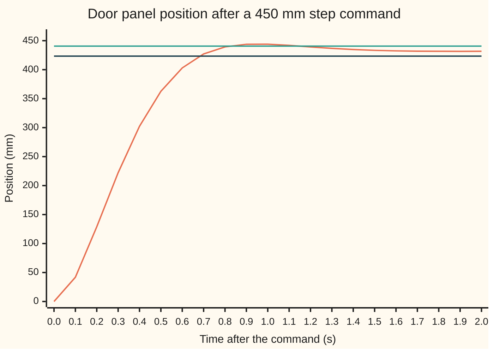
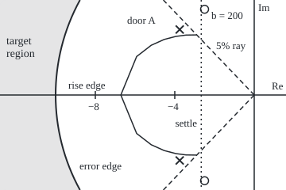

# Step response specs: rise time, overshoot, settling time and steady error

[Syllabus](../../../SYLLABUS.md) → [Engineering mathematics](../README.md) → [Linear Systems and Transforms](../README.md#s02) → Step response specs

---

## General Overview

A lift door has one panel on each side. Each panel weighs 40 kg and slides 450 mm along a rail to open. A light spring pulls it shut, so the door closes if the power fails. A motor drive pushes the panel towards the position it is told to reach.

The building's buyer writes a specification on one line: **open in half a second, overshoot under five percent.** The engineer adds two more lines that every door needs. The door must settle within 2% of where it stops in 1.5 s, and it must stop within 4.5 mm (1% of travel) of the position it was sent to. A door that overshoots bangs into its end stop. A door that settles slowly holds passengers in the doorway. A door that stops short of fully open narrows the entrance by the shortfall.

The test is simple. Tell the drive to go from 0 to 450 mm in one jump, a **step** command, and record the position. Four numbers come off that one trace. **Rise time** is how long the door takes to go from 10% to 90% of the way to where it stops. **Overshoot** is how far it swings past that final position, as a fraction of it. **Settling time** is the last moment it is outside a band 2% either side of the final position. **Steady error** is the gap between the commanded and the final position. This card measures all four on a simulated door, called door A below, explains each from the door's equation, and turns the spec into a region where the door's poles must sit.

**For a two-pole system, each step-response number is set by one feature of the pole position: overshoot by the angle, settling by the distance from the imaginary axis, rise time mainly by the distance from the origin; steady error by the zero-frequency gain, a separate number in general and, for this door, a distance from the origin as well.**

**What kind of fact this is:** a method. The four numbers are measurement conventions (10–90% and 2% are choices, not laws). The formulas linking them to the poles are proved on this card in Why it works, for the two-pole system with no zeros; the settling rule 4/σ is an approximation, with its error stated.

### The picture: the door's step test



The rising line is the simulated door, sampled every 0.1 s. The two flat lines are the 2% band, 440.64 mm and 423.36 mm, around the final position of 432.00 mm. The door peaks at 444.26 mm, 0.9500 s after the command, leaves the band, and comes back inside for good at 1.1485 s. It never reaches the 450 mm it was sent to.

---

## The formula

Two reminders. A **pole** is a value of the Laplace variable s at which the transfer function blows up; its real part sets how fast a term dies and its imaginary part how fast it rings ([Poles and zeros](03-poles-zeros-and-stability.md)). Engineers write j for the square root of −1; the rest of the library writes i. The damping ratio ζ and natural frequency ω_n are from [Damping ratio and natural frequency](06-second-order-systems-damping-and-natural-frequency.md).

The door obeys Newton's second law. The drive pushes with K_p times the distance still to go, minus b times the speed (velocity feedback, which also lumps in rail friction); the spring pulls back with k_s times the position:

$$m\,\ddot x + b\,\dot x + (K_p + k_s)\,x = K_p\, r \qquad\Longrightarrow\qquad \omega_n = \sqrt{\frac{K_p + k_s}{m}},\quad \zeta = \frac{b}{2\,m\,\omega_n}.$$

The dots are time derivatives: one dot is speed, two is acceleration. With σ = ζω_n and ω_d = ω_n√(1 − ζ^2), the poles are −σ ± jω_d, and the four numbers are

$$t_p = \frac{\pi}{\omega_d},\qquad M_p = e^{-\pi\sigma/\omega_d} = e^{-\pi\zeta/\sqrt{1-\zeta^2}},\qquad t_s \approx \frac{4}{\sigma},\qquad t_r = \frac{f(\zeta)}{\omega_n},\qquad e_{ss} = r - \frac{K_p}{K_p + k_s}\,r.$$

**Read it aloud:** the door peaks after half a ring period; the fraction it overshoots by depends only on the damping ratio; it settles in about four decay times; its rise time is a fixed number for that damping ratio divided by the natural frequency; and it stops short by the share of the command that the spring holds back.

The function f(ζ) is the 10–90% rise time of a system with ω_n = 1 rad/s. It has no closed form; the code finds it by bisection, the halving search for where a function changes sign. f(0.75) = 2.2875, f(0.6901) = 2.0964, and f(1) = 3.3579.

| Symbol | Plain meaning | In our example | Push it up and the answer… |
| --- | --- | --- | --- |
| $x$, $t$ | panel position, at time t after the command | the trace in the chart | — |
| $r$ | commanded travel, the step's height | 450 mm | every position and the error scale with it |
| $m$, $b$ | panel mass; damping from velocity feedback and the rail | 40 kg; 300 N s/m | m slows everything; b cuts overshoot and slows the rise |
| $K_p$, $k_s$ | drive force per metre still to go; closing spring stiffness | 960 N/m; 40 N/m | K_p shrinks the error, speeds the rise, adds overshoot |
| $k$ | total stiffness K_p + k_s, so ω_n = √(k/m) | 1000 N/m | ω_n rises and ζ falls |
| $y_{\infty}$, $e_{ss}$ | final position; steady error r minus final position | 432.00 mm; 18.00 mm | — |
| $\zeta$ | damping ratio: how hard the motion is braked compared with its stiffness | 0.75 | less overshoot, slower rise |
| $\omega_n$ | natural frequency: the poles' distance from the origin | 5 rad/s | every time on the trace shrinks in proportion |
| $\sigma$, $\omega_d$ | decay rate and ring frequency: minus the real part and the imaginary part of the poles | 3.75 1/s; 3.3072 rad/s | σ: faster settling; ω_d: earlier peak |
| $t_r$, $t_p$ | 10–90% rise time; time of the first peak | 0.4575 s; 0.9499 s | — |
| $f(\zeta)$ | 10–90% rise time of the same-ζ system with ω_n = 1 rad/s, as a pure number | 2.2875 at ζ = 0.75 | slower rise |
| $M_p$ | overshoot, as a fraction of the final position | 2.84% | — |
| $t_s$ | 2% settling time: last exit from the band | 1.1485 s | — |
| $s$, $j$ | Laplace variable; square root of −1 | poles −3.75 ± 3.3072j | — |
| \|p\| | a pole's distance from the origin; equal to ω_n | 5 rad/s | faster rise; for this door, a smaller steady error |

### When it holds

- **Two poles and no zeros.** The formulas for t_p and M_p are exact for this equation only. Give the drive's force a 0.1 s lag, which adds a third pole, and the trace overshoots by 9.20% while the formula, fed the same ζ and ω_n, still says 2.84%.
- **A linear drive.** At the instant of the command the drive asks for K_p r = 432 N. A drive that can deliver only 100 N rises in 0.526 s, which fails the half-second spec the linear model said it met with 0.4575 s.
- **A response that settles.** Final position and steady error exist only when both poles have negative real part; the final value comes from the transfer function at s = 0 ([Final value and bandwidth](05-final-value-theorem-and-steady-gain.md)).
- **Agreed conventions.** Rise is 10–90% and settling is 2% here. Some books use 0–100% rise and a 5% band; the numbers change and a spec must say which.

---

## Why it works

### Step 0: two numbers fix the whole trace

The door's equation has three physical constants on the left, and dividing by the mass leaves two: ζ and ω_n. So every feature of the trace is a function of those two numbers, and of the final position that scales it. Equivalently, every feature is a function of where the two poles sit. For this door the final position is fixed by the poles too, so a spec with four lines becomes four conditions on two pole coordinates: one region of the complex plane.

### Step 1: the trace, in a form whose parts can be read

Divide the position by its final value. The second-order card solves the equation; the result, with σ for the decay rate and ω_d for the ring frequency, is

$$\frac{x(t)}{y_\infty} = 1 - e^{-\sigma t}\left(\cos\omega_d t + \frac{\sigma}{\omega_d}\sin\omega_d t\right).$$

**Read it aloud:** the door heads for 1, minus a ring at frequency ω_d that dies like e^(−σt).

Write k = K_p + k_s = 1000 N/m for the total stiffness. For the door, 4mk − b^2 = 70000 kg^2/s^2, so the poles are −300/80 ± j√70000/80 = −3.75 ± 3.3072j. The ring frequency is ω_d = 5 × 0.6614 = 3.3072 rad/s.

### Step 2: overshoot is the angle of the poles

The speed is the derivative of the trace. The cosine terms cancel and what is left is

$$\dot x(t) = y_\infty\,\frac{\omega_n^2}{\omega_d}\,e^{-\sigma t}\sin\omega_d t.$$

The speed is first zero again when ω_d t = π. That instant is the peak, t_p = π/ω_d = 0.9499 s. Put it into the trace: cos π = −1 and sin π = 0, so x/y∞ = 1 + e^(−πσ/ω_d). The overshoot is e^(−3.5622), which is 2.84%.

The ratio σ/ω_d depends only on the angle of the pole seen from the origin. Draw a line from the origin to the pole −3.75 + 3.3072j: its angle from the negative real axis is arccos ζ, since cos of that angle is σ/ω_n = ζ. So every pole on one ray from the origin gives the same overshoot. The spec "under 5%" is a ray: solve e^(−πζ/√(1−ζ^2)) = 0.05 for ζ,

$$\zeta_{\min} = \frac{-\ln 0.05}{\sqrt{\pi^2 + (\ln 0.05)^2}} = \frac{2.9957}{4.3410} = 0.6901,$$

and the poles must lie within arccos 0.6901 = 0.8092 rad = 46.36° of the negative real axis.

<details>
<summary>Detailed proof: the peak, the overshoot and the settling bound</summary>

Write c = cos ω_d t and sn = sin ω_d t. Differentiate x/y∞ = 1 − e^(−σt)(c + (σ/ω_d) sn). The product rule gives σe^(−σt)(c + (σ/ω_d) sn) − e^(−σt)(−ω_d sn + σ c). The σc terms cancel. What is left is e^(−σt) sn (σ^2/ω_d + ω_d) = e^(−σt) sn (σ^2 + ω_d^2)/ω_d, and σ^2 + ω_d^2 = ω_n^2(ζ^2 + 1 − ζ^2) = ω_n^2. So the speed is y∞ (ω_n^2/ω_d) e^(−σt) sin ω_d t, positive until ω_d t = π, which is the first maximum.

At that instant the trace is 1 + e^(−σπ/ω_d), and σ/ω_d = ζ/√(1 − ζ^2). That function of ζ rises from 0 to infinity as ζ goes from 0 to 1, so e^(−πζ/√(1−ζ^2)) falls steadily from 1 to 0 and each overshoot below 1 picks out exactly one ζ. Taking logarithms, ln M_p = −πζ/√(1 − ζ^2); squaring and solving for ζ^2 gives ζ^2 = (ln M_p)^2/(π^2 + (ln M_p)^2), the formula above.

For settling, write the ring as one sinusoid: c + (σ/ω_d) sn = √(1 + σ^2/ω_d^2) cos(ω_d t − φ) for a fixed phase φ, and √(1 + σ^2/ω_d^2) = ω_n/ω_d = 1/√(1 − ζ^2). So the distance from the final position is at most e^(−σt)/√(1 − ζ^2), as a fraction. That bound is below 0.02 once t ≥ (ln 50 − ½ ln(1 − ζ^2))/σ. The actual last exit can come earlier, because the ring is not at its crest when it crosses the band edge.

</details>

### Step 3: settling time is the distance from the imaginary axis

The ring dies like e^(−σt), with σ the distance of the poles from the imaginary axis. The proof above bounds the leftover swing by e^(−σt)/√(1 − ζ^2). Setting that to 2% gives (ln 50 − ½ ln(1 − ζ^2))/σ = 1.1534 s for the door. Since ln 50 = 3.9120, the textbook rule rounds it to t_s ≈ 4/σ = 1.0667 s. The true last exit from the band, found by bisection on the formula and by measuring the trace, is 1.1485 s: later than the rule, earlier than the bound.

The spec "settle in 1.5 s", by the rule, is a vertical line: σ ≥ 4/1.5 = 2.6667 1/s. Done with the envelope bound instead, the edge is not vertical: the bound grows with ζ, so σ ≥ 2.8236 1/s at ζ_min is its least demanding point, and heavier damping asks for more.

### Step 4: rise time is the distance from the origin

The trace depends on t only through σt and ω_d t, which are ζ ω_n t and √(1 − ζ^2) ω_n t. So at a fixed ζ, doubling ω_n replays the same trace twice as fast. The rise time is a number that depends on ζ, divided by ω_n: t_r = f(ζ)/ω_n. The door's is 2.2875/5 = 0.4575 s.

The spec "rise in 0.5 s" needs ω_n ≥ f(ζ)/0.5: at least 4.1928 rad/s at ζ = 0.6901, 4.5751 rad/s at ζ = 0.75 and 6.7158 rad/s at ζ = 1. Heavier damping slows the rise, so this edge is not a circle; it bulges outwards towards the real axis.

### Step 5: the steady error, a gain that here becomes a circle

When the door has stopped, speed and acceleration are zero, so (K_p + k_s) x = K_p r and the door stops at 960/1000 × 450 = 432.00 mm. The spring takes a 40/1000 share of the push, which leaves 18.00 mm, 4.00% of travel.

In general the final position is the transfer function at s = 0, which the poles do not fix: a zero or a scaled command changes it and leaves the poles alone. This door has a fixed mass and spring, and k = mω_n^2, so its error is e_ss = r k_s/(m ω_n^2). The 4.5 mm spec needs K_p/(K_p + k_s) ≥ 0.99, so K_p ≥ 3960 N/m, which is ω_n ≥ 10 rad/s: a circle of radius 10 rad/s about the origin. Door A, at 5 rad/s, is inside it. Raising K_p alone moves the poles off the ray: ζ falls to 0.375 and the door overshoots by 28.06%. Meeting both needs b raised as well, to 600 N s/m, and then the drive must push 1782 N at the instant of the command instead of 432 N. That cost is why controllers add integral action, which makes the final position equal the command wherever the poles sit ([PID control](../03-Feedback%20Control/07-pid-control-and-tuning.md)).

### Step 6: reading the trace backwards gives the poles

A step test on a real door has no formula attached. Steps 2 and 4 run in reverse: the measured overshoot 2.84% gives ζ through the formula of Step 2, and the measured peak time gives ω_d = π/t_p and so ω_n. From the simulated trace this gives ζ = 0.7500 and ω_n = 4.9996 rad/s, poles −3.7497 ± 3.3069j, against −3.7500 ± 3.3072j from the equation. The small gap is the 1 ms sampling of the peak time.

### The picture: the target region for the poles

<p align="center"></p>

The shaded region is where both poles must sit, drawn to scale at 25 pixels per 1/s on both axes, with the imaginary axis on the right. The two dashed rays leave the origin at 46.36° from the negative real axis: inside them the overshoot is under 5%. The inner curve is the rise edge, from 4.1928 rad/s on the rays to 6.7158 rad/s on the real axis. The dotted vertical line is the settling rule σ = 2.6667 1/s; it lies wholly inside the rise edge, so settling adds no constraint. The outer arc is the error edge, |p| = 10 rad/s, where |p| is a pole's distance from the origin; it lies beyond the rise edge, so it binds. Left of it the rays have run off the frame, so the whole shaded strip is inside them. Door A's poles (×) meet three lines but sit inside the error arc. The poles with b lowered to 200 N s/m (○, upper right) sit outside the rays: ζ = 0.5 overshoots by 16.30%.

A second route to the same specs runs through the frequency response ([Bode plots](04-frequency-response-and-bode-plots.md)), whose gain curve is fixed by the same two numbers, ζ and ω_n. Its resonant peak depends on ζ alone, as the overshoot does, and exists only below ζ = 1/√2, so this door at ζ = 0.75 has none ([Damping ratio and natural frequency](06-second-order-systems-damping-and-natural-frequency.md)). Its bandwidth is a number set by ζ times ω_n, so bandwidth times rise time depends on ζ alone ([Final value and bandwidth](05-final-value-theorem-and-steady-gain.md)).

---

## Worked numbers, by hand

| Step | Arithmetic | Value |
| --- | --- | --- |
| natural frequency | √((960 + 40)/40) = √25 | ω_n = 5 rad/s |
| damping ratio | 300/(2 × 40 × 5) | ζ = 0.75 |
| decay rate, ring frequency | 0.75 × 5; 5 × √(1 − 0.75^2) = 5 × 0.6614 | σ = 3.75 1/s, ω_d = 3.3072 rad/s |
| peak time | π/3.3072 | 0.9499 s |
| overshoot | e^(−3.75π/3.3072) = e^(−3.5622) | **2.84%**, peak 444.26 mm |
| rise time | f(0.75)/ω_n = 2.2875/5 | **0.4575 s** |
| settling, rule and exact | 4/3.75; last exit by bisection | 1.0667 s; **1.1485 s** |
| final position, error | 960/1000 × 450; 450 − 432 | 432.00 mm; **18.00 mm** |
| spec: overshoot ray | 2.9957/4.3410; arccos | ζ ≥ 0.6901, within 46.36° |
| spec: rise edge at ζ = 0.75 | 2.2875/0.5 | ω_n ≥ 4.5751 rad/s |
| spec: steady error | 40 × (0.45 − 0.0045)/0.0045; √(4000/40) | K_p ≥ 3960 N/m, ω_n ≥ 10 rad/s |

The door rises in 0.4575 s, peaks at 444.26 mm and stays within 2% from 1.1485 s on, so it passes three lines of the spec. It stops 18.00 mm short, four times the 4.5 mm allowed, so it fails the fourth: its poles, 5 rad/s from the origin, sit inside the 10 rad/s error circle.

### What breaks if you drop a piece

| Mistake | Comes out at | What went wrong |
| --- | --- | --- |
| Overshoot read against the 450 mm command | −1.28%: "no overshoot" | The door overshoots its own final position, 432.00 mm, by 2.84%; overshoot is measured from where it settles |
| 4/σ used as the settling time | 1.0667 s, against 1.1485 s measured | The rule rounds ln 50 to 4 and drops the factor 1/√(1 − ζ^2) |
| Prototype formula on a drive with a 0.1 s force lag | 2.84% predicted; the trace gives 9.20%, rise 0.320 s, settle 1.304 s | A third pole: the velocity feedback arrives late, so the drive keeps pushing |
| Linear model on a drive capped at 100 N | rise 0.526 s, against 0.4575 s predicted | Outside the linear range: the drive cannot deliver the 432 N the model asks for |

The code prints all four.

---

## Code, from first principles, and it actually runs

The script builds the door from its mass, damping, spring and drive gain and reaches the four numbers by three roads. Road 1 is the closed form: ζ and ω_n from the coefficients, the peak and overshoot formulas, rise time by bisection on the formula, settling by stepping back from 4 s to the last exit and bisecting. Road 2 is a step test: an RK4 simulation ([Runge-Kutta four](../../08-Differential%20equations%20and%20dynamics/05-Numerical%20Evolution/04-runge-kutta-four.md)) with 1 ms steps, read off like a recorded trace with crossings found by straight-line interpolation. Road 3 recovers the poles from the measured overshoot and peak time and compares them with the roots of 40s^2 + 300s + 1000. Then it turns the spec into the pole region, prints the figure's coordinates, and runs each failure and each experiment below.

### Python

```python
# Step response specs -- the check behind the card.  Standard library only.
# One panel of a centre-opening lift door: mass m on a rail, a closing spring k_s, and a
# drive pushing F = K_p (r - x) - b v (b lumps the drive's velocity feedback and the rail):
#   m x'' + b x' + (K_p + k_s) x = K_p r,   r = 0.45 m of commanded travel.
# The four numbers by three roads: the closed form; an RK4 step test read off like a scope
# trace; and the poles recovered from the measured overshoot and peak time.
import math

m, b, k_s, K_p, r = 40.0, 300.0, 40.0, 960.0, 0.45    # kg, N s/m, N/m, N/m, m
RISE, OVER, SETTLE, ERR = 0.5, 0.05, 1.5, 0.01 * r     # the written spec: s, fraction, s, m

def bisect(f, lo, hi):                                  # f changes sign on [lo, hi]
    neg = f(lo) < 0
    for _ in range(100):
        mid = 0.5 * (lo + hi)
        if (f(mid) < 0) == neg: lo = mid
        else: hi = mid
    return 0.5 * (lo + hi)

def unit_step(t, z):                                    # prototype step, omega_n = 1, final 1
    if z == 1.0: return 1 - math.exp(-t) * (1 + t)
    wd = math.sqrt(1 - z * z)
    return 1 - math.exp(-z * t) * (math.cos(wd * t) + z / wd * math.sin(wd * t))

def rise_norm(z):                                       # omega_n x (10-90% rise time)
    return bisect(lambda t: unit_step(t, z) - 0.9, 0, 6) - bisect(lambda t: unit_step(t, z) - 0.1, 0, 6)

def step_test(Kp=K_p, bb=b, tau_m=0.0, fmax=1e9, T=6.0, dt=1e-3):
    def f(s):                                           # state: position, speed, drive force
        x, v, F = s
        Fc = max(-fmax, min(fmax, Kp * (r - x) - bb * v))
        Fd, dF = (Fc, 0.0) if tau_m == 0 else (F, (Fc - F) / tau_m)
        return [v, (Fd - k_s * x) / m, dF]
    s, rec = [0.0, 0.0, 0.0], [(0.0, 0.0)]
    for i in range(int(round(T / dt))):
        k1 = f(s); k2 = f([a + 0.5 * dt * d for a, d in zip(s, k1)])
        k3 = f([a + 0.5 * dt * d for a, d in zip(s, k2)]); k4 = f([a + dt * d for a, d in zip(s, k3)])
        s = [a + dt / 6 * (p + 2 * q + 2 * u + w) for a, p, q, u, w in zip(s, k1, k2, k3, k4)]
        rec.append(((i + 1) * dt, s[0]))
    return rec

def measure(rec):                                       # read the four numbers off a trace
    yf = rec[-1][1]
    def cross(level):
        for (t0, x0), (t1, x1) in zip(rec, rec[1:]):
            if x1 >= level: return t0 + (level - x0) / (x1 - x0) * (t1 - t0)
    tp, peak = max(rec, key=lambda p: p[1])
    band, ts = 0.02 * yf, 0.0
    for (t0, x0), (t1, x1) in zip(rec, rec[1:]):
        e0, e1 = abs(x0 - yf), abs(x1 - yf)
        if e0 > band >= e1: ts = t0 + (e0 - band) / (e0 - e1) * (t1 - t0)
    return cross(0.9 * yf) - cross(0.1 * yf), peak / yf - 1, ts, r - yf, tp, peak, yf

def show(label, q):
    tr, ov, ts, er = q[:4]
    print(f"{label:<26} rise {tr:6.3f} s  over {100 * ov:6.2f} %  settle {ts:6.3f} s  error {1000 * er:6.2f} mm")

# ---- road 1: closed form from the coefficients ----
k = K_p + k_s
wn = math.sqrt(k / m); z = b / (2 * m * wn); sig = z * wn; wd = wn * math.sqrt(1 - z * z)
yinf = K_p / k * r
tp1, Mp1, tr1 = math.pi / wd, math.exp(-sig * math.pi / wd), rise_norm(z) / wn
ex = lambda t: abs(yinf * unit_step(wn * t, z) - yinf) - 0.02 * yinf
t_out = next(i * 1e-3 for i in range(4000, 0, -1) if ex(i * 1e-3) > 0)
ts1 = bisect(ex, t_out, t_out + 1e-3)
print(f"door: m = {m:.0f} kg, b = {b:.0f} N s/m, k_s = {k_s:.0f} N/m, K_p = {K_p:.0f} N/m, command r = {1000 * r:.0f} mm")
print(f"zeta = {z:.4f}, omega_n = {wn:.4f} rad/s, sigma = {sig:.4f} 1/s, omega_d = {wd:.4f} rad/s")
print(f"final {1000 * yinf:.2f} mm = K_p/(K_p + k_s) r; steady error {1000 * (r - yinf):.2f} mm = {100 * (r - yinf) / r:.2f} % of travel")
print(f"hand: 4 m k - b^2 = {4 * m * k - b * b:.0f}, sqrt(1 - zeta^2) = {math.sqrt(1 - z * z):.4f}, sigma pi/omega_d = {sig * math.pi / wd:.4f}, ln 0.05 = {math.log(OVER):.4f}, sqrt(pi^2 + ln^2 0.05) = {math.sqrt(math.pi ** 2 + math.log(OVER) ** 2):.4f}, ln 50 = {math.log(50):.4f}")
print(f"road 1 closed form:  rise {tr1:.4f} s  peak time {tp1:.4f} s  over {100 * Mp1:.4f} %  settle {ts1:.4f} s")
print(f"  rise in omega_n units {rise_norm(z):.4f}; settle rules: 4/sigma {4 / sig:.4f} s, envelope {(math.log(50) - 0.5 * math.log(1 - z * z)) / sig:.4f} s")

# ---- road 2: the step test, measured off the simulated trace ----
rec = step_test()
q = measure(rec)
print(f"road 2 RK4 trace:    rise {q[0]:.4f} s  peak time {q[4]:.4f} s  over {100 * q[1]:.4f} %  settle {q[2]:.4f} s")
print(f"  peak {1000 * q[5]:.2f} mm, final {1000 * q[6]:.2f} mm, error {1000 * q[3]:.2f} mm")

# ---- road 3: the poles, recovered from the measured trace and from the polynomial ----
L = math.log(q[1])
z_id = -L / math.sqrt(math.pi ** 2 + L * L); wn_id = math.pi / (q[4] * math.sqrt(1 - z_id ** 2))
re, im = -b / (2 * m), math.sqrt(4 * m * k - b * b) / (2 * m)          # roots of m s^2 + b s + k
print(f"road 3 poles from trace: zeta {z_id:.4f}, omega_n {wn_id:.4f} rad/s -> {-z_id * wn_id:.4f} +- {wn_id * math.sqrt(1 - z_id ** 2):.4f} j")
print(f"       roots of 40 s^2 + 300 s + 1000: {re:.4f} +- {im:.4f} j, |p| = {math.hypot(re, im):.4f}, zeta = {-re / math.hypot(re, im):.4f}")
print("chart, t (s)  " + " ".join(f"{t:.1f}" for t, x in rec[0:2001:100]))
print("chart, x (mm) " + " ".join(f"{1000 * x:.2f}" for t, x in rec[0:2001:100]))
print(f"chart, 2% band {1000 * 1.02 * q[6]:.2f} and {1000 * 0.98 * q[6]:.2f} mm")

# ---- the written spec turned into a target region for the poles ----
zmin = -math.log(OVER) / math.sqrt(math.pi ** 2 + math.log(OVER) ** 2)
zmin_b = bisect(lambda u: math.exp(-math.pi * u / math.sqrt(1 - u * u)) - OVER, 0.01, 0.99)
th = math.degrees(math.acos(zmin))
print(f"spec over < 5 %:    zeta >= {zmin:.4f} (bisection {zmin_b:.4f}), within {th:.2f} deg of the negative real axis")
print(f"spec settle 1.5 s:  sigma >= 4/1.5 = {4 / SETTLE:.4f} 1/s (rule); envelope at zeta_min {(math.log(50) - 0.5 * math.log(1 - zmin ** 2)) / SETTLE:.4f} 1/s")
for zz in (zmin, 0.75, 1.0):
    print(f"spec rise 0.5 s:    at zeta {zz:.4f}, omega_n t_r = {rise_norm(zz):.4f}, so omega_n >= {rise_norm(zz) / RISE:.4f} rad/s")
wn_err = math.sqrt(k_s * r / (m * ERR))                # error = r k_s / (m omega_n^2) while m, k_s are fixed
print(f"spec error 4.5 mm:  K_p/(K_p + k_s) >= {1 - ERR / r:.2f}, so K_p >= {k_s * (r - ERR) / ERR:.0f} N/m; with m, k_s fixed, omega_n >= {wn_err:.4f} rad/s")
for name, ok in (("rise", q[0] <= RISE), ("overshoot", q[1] < OVER), ("settle", q[2] <= SETTLE), ("steady error", q[3] <= ERR)):
    print(f"door A {name:<13} {'meets' if ok else 'FAILS'} the spec")
S, X0, Y0 = 25.0, 320.0, 120.0                         # svg: 25 px per 1/s, origin at (320, 120)
px = lambda a, w: f"({X0 + S * a:.1f},{Y0 - S * w:.1f})"
im2 = math.sqrt(4 * m * k - 200.0 ** 2) / (2 * m)
edge = Y0 / math.tan(math.radians(th))
curve = [(zz, rise_norm(zz) / RISE) for zz in (zmin, 0.75, 0.8, 0.85, 0.9, 0.95, 1.0)]
print(f"figure, poles {px(re, im)} {px(re, -im)}; b = 200 poles {px(-200 / (2 * m), im2)} {px(-200 / (2 * m), -im2)}")
print(f"figure, wedge to ({X0 - edge:.1f},0) and ({X0 - edge:.1f},240); 4/1.5 line x = {X0 - S * 4 / SETTLE:.1f}")
print("figure, rise edge " + " ".join(px(-w * zz, w * math.sqrt(1 - zz * zz)) for zz, w in curve))
ax = math.sqrt(wn_err ** 2 - (Y0 / S) ** 2)
print(f"figure, error arc radius {S * wn_err:.1f}: {px(-ax, Y0 / S)} {px(-wn_err, 0)} {px(-ax, -Y0 / S)}")

# ---- what breaks, and the try-changing runs ----
qa = measure(step_test(tau_m=0.1))
show("drive lag 0.1 s", qa)
print(f"  prototype formula from zeta, omega_n still says over {100 * Mp1:.2f} %")
print(f"overshoot read against the 450 mm command: {100 * (q[5] / r - 1):.2f} %")
show("drive force capped 100 N", measure(step_test(fmax=100.0)))
show("try K_p = 3960", measure(step_test(Kp=3960.0)))
show("try b = 400 (zeta 1)", measure(step_test(bb=400.0)))
show("try b = 200 (zeta 0.5)", measure(step_test(bb=200.0)))
q4 = measure(step_test(Kp=3960.0, bb=600.0))
show("try K_p = 3960, b = 600", q4)
wn4 = math.hypot(-600 / (2 * m), math.sqrt(4 * m * 4000 - 600 ** 2) / (2 * m))
print(f"  K_p = 3960: zeta {b / (2 * math.sqrt(m * 4000)):.4f}, omega_n {math.sqrt(4000 / m):.4f} rad/s; with b = 600: zeta {600 / (2 * math.sqrt(m * 4000)):.4f}")
print(f"  drive force at t = 0: {K_p * r:.0f} N for door A, {3960 * r:.0f} N for K_p = 3960")

assert abs(q[0] - tr1) < 1e-3                              # 10-90 rise, trace vs bisection on the closed form
assert abs(q[4] - tp1) < 2e-3                              # peak time, trace vs pi / omega_d
assert abs(q[1] - Mp1) < 1e-5                              # measured overshoot vs exp(-pi zeta / sqrt(1 - zeta^2))
assert abs(q[2] - ts1) < 1e-3                              # last exit from the band, trace vs bisection
assert abs(z_id - (-re / math.hypot(re, im))) < 1e-3       # poles from the trace vs roots of the polynomial
assert abs(wn_id - math.hypot(re, im)) < 2e-3            # omega_n from the trace vs |root|
assert abs(zmin - zmin_b) < 1e-9                           # inverse overshoot formula vs bisection
assert abs(q[6] - yinf) < 1e-6                             # settled trace vs K_p r / (K_p + k_s)
assert abs(q4[3] - r * k_s / (m * wn4 ** 2)) < 1e-6        # stiff door: trace error vs r k_s / (m |pole|^2)
print("ALL CHECKS PASS")
```

**Ran 2026-10-06 on macOS, Python 3.14.6, standard library only. All checks passed. Output, pasted from the run:**

```
door: m = 40 kg, b = 300 N s/m, k_s = 40 N/m, K_p = 960 N/m, command r = 450 mm
zeta = 0.7500, omega_n = 5.0000 rad/s, sigma = 3.7500 1/s, omega_d = 3.3072 rad/s
final 432.00 mm = K_p/(K_p + k_s) r; steady error 18.00 mm = 4.00 % of travel
hand: 4 m k - b^2 = 70000, sqrt(1 - zeta^2) = 0.6614, sigma pi/omega_d = 3.5622, ln 0.05 = -2.9957, sqrt(pi^2 + ln^2 0.05) = 4.3410, ln 50 = 3.9120
road 1 closed form:  rise 0.4575 s  peak time 0.9499 s  over 2.8375 %  settle 1.1485 s
  rise in omega_n units 2.2875; settle rules: 4/sigma 1.0667 s, envelope 1.1534 s
road 2 RK4 trace:    rise 0.4575 s  peak time 0.9500 s  over 2.8375 %  settle 1.1485 s
  peak 444.26 mm, final 432.00 mm, error 18.00 mm
road 3 poles from trace: zeta 0.7500, omega_n 4.9996 rad/s -> -3.7497 +- 3.3069 j
       roots of 40 s^2 + 300 s + 1000: -3.7500 +- 3.3072 j, |p| = 5.0000, zeta = 0.7500
chart, t (s)  0.0 0.1 0.2 0.3 0.4 0.5 0.6 0.7 0.8 0.9 1.0 1.1 1.2 1.3 1.4 1.5 1.6 1.7 1.8 1.9 2.0
chart, x (mm) 0.00 41.86 128.84 222.16 302.39 362.62 403.02 427.10 439.31 443.83 443.92 441.91 439.25 436.75 434.75 433.33 432.43 431.93 431.71 431.65 431.69
chart, 2% band 440.64 and 423.36 mm
spec over < 5 %:    zeta >= 0.6901 (bisection 0.6901), within 46.36 deg of the negative real axis
spec settle 1.5 s:  sigma >= 4/1.5 = 2.6667 1/s (rule); envelope at zeta_min 2.8236 1/s
spec rise 0.5 s:    at zeta 0.6901, omega_n t_r = 2.0964, so omega_n >= 4.1928 rad/s
spec rise 0.5 s:    at zeta 0.7500, omega_n t_r = 2.2875, so omega_n >= 4.5751 rad/s
spec rise 0.5 s:    at zeta 1.0000, omega_n t_r = 3.3579, so omega_n >= 6.7158 rad/s
spec error 4.5 mm:  K_p/(K_p + k_s) >= 0.99, so K_p >= 3960 N/m; with m, k_s fixed, omega_n >= 10.0000 rad/s
door A rise          meets the spec
door A overshoot     meets the spec
door A settle        meets the spec
door A steady error  FAILS the spec
figure, poles (226.2,37.3) (226.2,202.7); b = 200 poles (257.5,11.7) (257.5,228.3)
figure, wedge to (205.6,0) and (205.6,240); 4/1.5 line x = 253.3
figure, rise edge (247.7,44.1) (234.2,44.3) (221.3,46.0) (206.7,49.8) (190.3,57.2) (172.0,71.4) (152.1,120.0)
figure, error arc radius 250.0: (100.7,0.0) (70.0,120.0) (100.7,240.0)
drive lag 0.1 s            rise  0.320 s  over   9.20 %  settle  1.304 s  error  18.00 mm
  prototype formula from zeta, omega_n still says over 2.84 %
overshoot read against the 450 mm command: -1.28 %
drive force capped 100 N   rise  0.526 s  over   2.49 %  settle  1.271 s  error  18.00 mm
try K_p = 3960             rise  0.143 s  over  28.06 %  settle  1.063 s  error   4.50 mm
try b = 400 (zeta 1)       rise  0.672 s  over   0.00 %  settle  1.167 s  error  18.00 mm
try b = 200 (zeta 0.5)     rise  0.328 s  over  16.30 %  settle  1.615 s  error  18.00 mm
try K_p = 3960, b = 600    rise  0.229 s  over   2.84 %  settle  0.574 s  error   4.50 mm
  K_p = 3960: zeta 0.3750, omega_n 10.0000 rad/s; with b = 600: zeta 0.7500
  drive force at t = 0: 432 N for door A, 1782 N for K_p = 3960
ALL CHECKS PASS
```

### Rust

```rust
// Step response specs -- the check behind the card.  Rust std only.
// One panel of a centre-opening lift door: mass m on a rail, a closing spring k_s, and a
// drive pushing F = K_p (r - x) - b v (b lumps the drive's velocity feedback and the rail):
//   m x'' + b x' + (K_p + k_s) x = K_p r,   r = 0.45 m of commanded travel.
// The four numbers by three roads: the closed form; an RK4 step test read off like a scope
// trace; and the poles recovered from the measured overshoot and peak time.
use std::f64::consts::PI;

const M: f64 = 40.0; const B: f64 = 300.0; const KS: f64 = 40.0; const KP: f64 = 960.0; const R: f64 = 0.45;
const RISE: f64 = 0.5; const OVER: f64 = 0.05; const SETTLE: f64 = 1.5; const ERR: f64 = 0.01 * R;

fn bisect<F: Fn(f64) -> f64>(f: F, mut lo: f64, mut hi: f64) -> f64 {
    let neg = f(lo) < 0.0;
    for _ in 0..100 {
        let mid = 0.5 * (lo + hi);
        if (f(mid) < 0.0) == neg { lo = mid } else { hi = mid }
    }
    0.5 * (lo + hi)
}

fn unit_step(t: f64, z: f64) -> f64 { // prototype step, omega_n = 1, final 1
    if z == 1.0 { return 1.0 - (-t).exp() * (1.0 + t); }
    let wd = (1.0 - z * z).sqrt();
    1.0 - (-z * t).exp() * ((wd * t).cos() + z / wd * (wd * t).sin())
}

fn rise_norm(z: f64) -> f64 { // omega_n x (10-90% rise time)
    bisect(|t| unit_step(t, z) - 0.9, 0.0, 6.0) - bisect(|t| unit_step(t, z) - 0.1, 0.0, 6.0)
}

fn step_test(kp: f64, bb: f64, tau_m: f64, fmax: f64) -> Vec<(f64, f64)> {
    let (t_end, dt) = (6.0, 1e-3);
    let f = |s: [f64; 3]| -> [f64; 3] { // state: position, speed, drive force
        let (x, v, force) = (s[0], s[1], s[2]);
        let fc = (kp * (R - x) - bb * v).min(fmax).max(-fmax);
        let (fd, df) = if tau_m == 0.0 { (fc, 0.0) } else { (force, (fc - force) / tau_m) };
        [v, (fd - KS * x) / M, df]
    };
    let add = |s: [f64; 3], k: [f64; 3], h: f64| [s[0] + h * k[0], s[1] + h * k[1], s[2] + h * k[2]];
    let mut s = [0.0; 3];
    let mut rec = vec![(0.0, 0.0)];
    for i in 0..((t_end / dt) as f64).round() as usize {
        let k1 = f(s); let k2 = f(add(s, k1, 0.5 * dt));
        let k3 = f(add(s, k2, 0.5 * dt)); let k4 = f(add(s, k3, dt));
        for j in 0..3 { s[j] += dt / 6.0 * (k1[j] + 2.0 * k2[j] + 2.0 * k3[j] + k4[j]); }
        rec.push(((i + 1) as f64 * dt, s[0]));
    }
    rec
}

struct Q { tr: f64, ov: f64, ts: f64, er: f64, tp: f64, peak: f64, yf: f64 }

fn measure(rec: &[(f64, f64)]) -> Q { // read the four numbers off a trace
    let yf = rec[rec.len() - 1].1;
    let cross = |level: f64| -> f64 {
        for w in rec.windows(2) {
            let ((t0, x0), (t1, x1)) = (w[0], w[1]);
            if x1 >= level { return t0 + (level - x0) / (x1 - x0) * (t1 - t0); }
        }
        f64::NAN
    };
    let (mut tp, mut peak) = rec[0];
    for &(t, x) in rec { if x > peak { tp = t; peak = x; } }
    let (band, mut ts) = (0.02 * yf, 0.0);
    for w in rec.windows(2) {
        let ((t0, x0), (t1, x1)) = (w[0], w[1]);
        let (e0, e1) = ((x0 - yf).abs(), (x1 - yf).abs());
        if e0 > band && band >= e1 { ts = t0 + (e0 - band) / (e0 - e1) * (t1 - t0); }
    }
    Q { tr: cross(0.9 * yf) - cross(0.1 * yf), ov: peak / yf - 1.0, ts, er: R - yf, tp, peak, yf }
}

fn show(label: &str, q: &Q) {
    println!("{:<26} rise {:6.3} s  over {:6.2} %  settle {:6.3} s  error {:6.2} mm", label, q.tr, 100.0 * q.ov, q.ts, 1000.0 * q.er);
}

fn main() {
    // ---- road 1: closed form from the coefficients ----
    let k = KP + KS;
    let wn = (k / M).sqrt(); let z = B / (2.0 * M * wn); let sig = z * wn; let wd = wn * (1.0 - z * z).sqrt();
    let yinf = KP / k * R;
    let (tp1, mp1, tr1) = (PI / wd, (-sig * PI / wd).exp(), rise_norm(z) / wn);
    let ex = |t: f64| (yinf * unit_step(wn * t, z) - yinf).abs() - 0.02 * yinf;
    let t_out = (1..=4000).rev().map(|i| i as f64 * 1e-3).find(|&t| ex(t) > 0.0).unwrap();
    let ts1 = bisect(ex, t_out, t_out + 1e-3);
    println!("door: m = {:.0} kg, b = {:.0} N s/m, k_s = {:.0} N/m, K_p = {:.0} N/m, command r = {:.0} mm", M, B, KS, KP, 1000.0 * R);
    println!("zeta = {:.4}, omega_n = {:.4} rad/s, sigma = {:.4} 1/s, omega_d = {:.4} rad/s", z, wn, sig, wd);
    println!("final {:.2} mm = K_p/(K_p + k_s) r; steady error {:.2} mm = {:.2} % of travel", 1000.0 * yinf, 1000.0 * (R - yinf), 100.0 * (R - yinf) / R);
    println!("hand: 4 m k - b^2 = {:.0}, sqrt(1 - zeta^2) = {:.4}, sigma pi/omega_d = {:.4}, ln 0.05 = {:.4}, sqrt(pi^2 + ln^2 0.05) = {:.4}, ln 50 = {:.4}", 4.0 * M * k - B * B, (1.0 - z * z).sqrt(), sig * PI / wd, OVER.ln(), (PI * PI + OVER.ln().powi(2)).sqrt(), 50f64.ln());
    println!("road 1 closed form:  rise {:.4} s  peak time {:.4} s  over {:.4} %  settle {:.4} s", tr1, tp1, 100.0 * mp1, ts1);
    println!("  rise in omega_n units {:.4}; settle rules: 4/sigma {:.4} s, envelope {:.4} s", rise_norm(z), 4.0 / sig, (50f64.ln() - 0.5 * (1.0 - z * z).ln()) / sig);

    // ---- road 2: the step test, measured off the simulated trace ----
    let rec = step_test(KP, B, 0.0, 1e9);
    let q = measure(&rec);
    println!("road 2 RK4 trace:    rise {:.4} s  peak time {:.4} s  over {:.4} %  settle {:.4} s", q.tr, q.tp, 100.0 * q.ov, q.ts);
    println!("  peak {:.2} mm, final {:.2} mm, error {:.2} mm", 1000.0 * q.peak, 1000.0 * q.yf, 1000.0 * q.er);

    // ---- road 3: the poles, recovered from the measured trace and from the polynomial ----
    let l = q.ov.ln();
    let z_id = -l / (PI * PI + l * l).sqrt(); let wn_id = PI / (q.tp * (1.0 - z_id * z_id).sqrt());
    let (re, im) = (-B / (2.0 * M), (4.0 * M * k - B * B).sqrt() / (2.0 * M)); // roots of m s^2 + b s + k
    println!("road 3 poles from trace: zeta {:.4}, omega_n {:.4} rad/s -> {:.4} +- {:.4} j", z_id, wn_id, -z_id * wn_id, wn_id * (1.0 - z_id * z_id).sqrt());
    println!("       roots of 40 s^2 + 300 s + 1000: {:.4} +- {:.4} j, |p| = {:.4}, zeta = {:.4}", re, im, re.hypot(im), -re / re.hypot(im));
    let pts: Vec<&(f64, f64)> = rec[0..2001].iter().step_by(100).collect();
    println!("chart, t (s)  {}", pts.iter().map(|p| format!("{:.1}", p.0)).collect::<Vec<_>>().join(" "));
    println!("chart, x (mm) {}", pts.iter().map(|p| format!("{:.2}", 1000.0 * p.1)).collect::<Vec<_>>().join(" "));
    println!("chart, 2% band {:.2} and {:.2} mm", 1000.0 * 1.02 * q.yf, 1000.0 * 0.98 * q.yf);

    // ---- the written spec turned into a target region for the poles ----
    let lo = OVER.ln();
    let zmin = -lo / (PI * PI + lo * lo).sqrt();
    let zmin_b = bisect(|u| (-PI * u / (1.0 - u * u).sqrt()).exp() - OVER, 0.01, 0.99);
    let th = zmin.acos().to_degrees();
    println!("spec over < 5 %:    zeta >= {:.4} (bisection {:.4}), within {:.2} deg of the negative real axis", zmin, zmin_b, th);
    println!("spec settle 1.5 s:  sigma >= 4/1.5 = {:.4} 1/s (rule); envelope at zeta_min {:.4} 1/s", 4.0 / SETTLE, (50f64.ln() - 0.5 * (1.0 - zmin * zmin).ln()) / SETTLE);
    for zz in [zmin, 0.75, 1.0] {
        println!("spec rise 0.5 s:    at zeta {:.4}, omega_n t_r = {:.4}, so omega_n >= {:.4} rad/s", zz, rise_norm(zz), rise_norm(zz) / RISE);
    }
    let wn_err = (KS * R / (M * ERR)).sqrt(); // error = r k_s / (m omega_n^2) while m, k_s are fixed
    println!("spec error 4.5 mm:  K_p/(K_p + k_s) >= {:.2}, so K_p >= {:.0} N/m; with m, k_s fixed, omega_n >= {:.4} rad/s", 1.0 - ERR / R, KS * (R - ERR) / ERR, wn_err);
    for (name, ok) in [("rise", q.tr <= RISE), ("overshoot", q.ov < OVER), ("settle", q.ts <= SETTLE), ("steady error", q.er <= ERR)] {
        println!("door A {:<13} {} the spec", name, if ok { "meets" } else { "FAILS" });
    }
    let (s, x0, y0) = (25.0, 320.0, 120.0); // svg: 25 px per 1/s, origin at (320, 120)
    let px = |a: f64, w: f64| format!("({:.1},{:.1})", x0 + s * a, y0 - s * w);
    let im2 = (4.0 * M * k - 200.0f64.powi(2)).sqrt() / (2.0 * M);
    let edge = y0 / th.to_radians().tan();
    println!("figure, poles {} {}; b = 200 poles {} {}", px(re, im), px(re, -im), px(-200.0 / (2.0 * M), im2), px(-200.0 / (2.0 * M), -im2));
    println!("figure, wedge to ({:.1},0) and ({:.1},240); 4/1.5 line x = {:.1}", x0 - edge, x0 - edge, x0 - s * 4.0 / SETTLE);
    let curve: Vec<String> = [zmin, 0.75, 0.8, 0.85, 0.9, 0.95, 1.0].iter()
        .map(|&zz| { let w = rise_norm(zz) / RISE; px(-w * zz, w * (1.0 - zz * zz).sqrt()) }).collect();
    println!("figure, rise edge {}", curve.join(" "));
    let ax = (wn_err * wn_err - (y0 / s).powi(2)).sqrt();
    println!("figure, error arc radius {:.1}: {} {} {}", s * wn_err, px(-ax, y0 / s), px(-wn_err, 0.0), px(-ax, -y0 / s));

    // ---- what breaks, and the try-changing runs ----
    show("drive lag 0.1 s", &measure(&step_test(KP, B, 0.1, 1e9)));
    println!("  prototype formula from zeta, omega_n still says over {:.2} %", 100.0 * mp1);
    println!("overshoot read against the 450 mm command: {:.2} %", 100.0 * (q.peak / R - 1.0));
    show("drive force capped 100 N", &measure(&step_test(KP, B, 0.0, 100.0)));
    show("try K_p = 3960", &measure(&step_test(3960.0, B, 0.0, 1e9)));
    show("try b = 400 (zeta 1)", &measure(&step_test(KP, 400.0, 0.0, 1e9)));
    show("try b = 200 (zeta 0.5)", &measure(&step_test(KP, 200.0, 0.0, 1e9)));
    let q4 = measure(&step_test(3960.0, 600.0, 0.0, 1e9));
    show("try K_p = 3960, b = 600", &q4);
    let wn4 = (-600.0 / (2.0 * M)).hypot((4.0 * M * 4000.0 - 600.0f64.powi(2)).sqrt() / (2.0 * M));
    println!("  K_p = 3960: zeta {:.4}, omega_n {:.4} rad/s; with b = 600: zeta {:.4}", B / (2.0 * (M * 4000.0).sqrt()), (4000.0 / M).sqrt(), 600.0 / (2.0 * (M * 4000.0).sqrt()));
    println!("  drive force at t = 0: {:.0} N for door A, {:.0} N for K_p = 3960", KP * R, 3960.0 * R);

    assert!((q.tr - tr1).abs() < 1e-3);                 // 10-90 rise, trace vs bisection on the closed form
    assert!((q.tp - tp1).abs() < 2e-3);                 // peak time, trace vs pi / omega_d
    assert!((q.ov - mp1).abs() < 1e-5);                 // measured overshoot vs exp(-pi zeta / sqrt(1 - zeta^2))
    assert!((q.ts - ts1).abs() < 1e-3);                 // last exit from the band, trace vs bisection
    assert!((z_id - (-re / re.hypot(im))).abs() < 1e-3); // poles from the trace vs roots of the polynomial
    assert!((wn_id - re.hypot(im)).abs() < 2e-3);       // omega_n from the trace vs |root|
    assert!((zmin - zmin_b).abs() < 1e-9);              // inverse overshoot formula vs bisection
    assert!((q.yf - yinf).abs() < 1e-6);                // settled trace vs K_p r / (K_p + k_s)
    assert!((q4.er - R * KS / (M * wn4 * wn4)).abs() < 1e-6); // stiff door: trace error vs r k_s / (m |pole|^2)
    println!("ALL CHECKS PASS");
}
```

**Ran 2026-10-06 on macOS, rustc 1.98.1, no crates. All checks passed. Output, pasted from the run:**

```
door: m = 40 kg, b = 300 N s/m, k_s = 40 N/m, K_p = 960 N/m, command r = 450 mm
zeta = 0.7500, omega_n = 5.0000 rad/s, sigma = 3.7500 1/s, omega_d = 3.3072 rad/s
final 432.00 mm = K_p/(K_p + k_s) r; steady error 18.00 mm = 4.00 % of travel
hand: 4 m k - b^2 = 70000, sqrt(1 - zeta^2) = 0.6614, sigma pi/omega_d = 3.5622, ln 0.05 = -2.9957, sqrt(pi^2 + ln^2 0.05) = 4.3410, ln 50 = 3.9120
road 1 closed form:  rise 0.4575 s  peak time 0.9499 s  over 2.8375 %  settle 1.1485 s
  rise in omega_n units 2.2875; settle rules: 4/sigma 1.0667 s, envelope 1.1534 s
road 2 RK4 trace:    rise 0.4575 s  peak time 0.9500 s  over 2.8375 %  settle 1.1485 s
  peak 444.26 mm, final 432.00 mm, error 18.00 mm
road 3 poles from trace: zeta 0.7500, omega_n 4.9996 rad/s -> -3.7497 +- 3.3069 j
       roots of 40 s^2 + 300 s + 1000: -3.7500 +- 3.3072 j, |p| = 5.0000, zeta = 0.7500
chart, t (s)  0.0 0.1 0.2 0.3 0.4 0.5 0.6 0.7 0.8 0.9 1.0 1.1 1.2 1.3 1.4 1.5 1.6 1.7 1.8 1.9 2.0
chart, x (mm) 0.00 41.86 128.84 222.16 302.39 362.62 403.02 427.10 439.31 443.83 443.92 441.91 439.25 436.75 434.75 433.33 432.43 431.93 431.71 431.65 431.69
chart, 2% band 440.64 and 423.36 mm
spec over < 5 %:    zeta >= 0.6901 (bisection 0.6901), within 46.36 deg of the negative real axis
spec settle 1.5 s:  sigma >= 4/1.5 = 2.6667 1/s (rule); envelope at zeta_min 2.8236 1/s
spec rise 0.5 s:    at zeta 0.6901, omega_n t_r = 2.0964, so omega_n >= 4.1928 rad/s
spec rise 0.5 s:    at zeta 0.7500, omega_n t_r = 2.2875, so omega_n >= 4.5751 rad/s
spec rise 0.5 s:    at zeta 1.0000, omega_n t_r = 3.3579, so omega_n >= 6.7158 rad/s
spec error 4.5 mm:  K_p/(K_p + k_s) >= 0.99, so K_p >= 3960 N/m; with m, k_s fixed, omega_n >= 10.0000 rad/s
door A rise          meets the spec
door A overshoot     meets the spec
door A settle        meets the spec
door A steady error  FAILS the spec
figure, poles (226.2,37.3) (226.2,202.7); b = 200 poles (257.5,11.7) (257.5,228.3)
figure, wedge to (205.6,0) and (205.6,240); 4/1.5 line x = 253.3
figure, rise edge (247.7,44.1) (234.2,44.3) (221.3,46.0) (206.7,49.8) (190.3,57.2) (172.0,71.4) (152.1,120.0)
figure, error arc radius 250.0: (100.7,0.0) (70.0,120.0) (100.7,240.0)
drive lag 0.1 s            rise  0.320 s  over   9.20 %  settle  1.304 s  error  18.00 mm
  prototype formula from zeta, omega_n still says over 2.84 %
overshoot read against the 450 mm command: -1.28 %
drive force capped 100 N   rise  0.526 s  over   2.49 %  settle  1.271 s  error  18.00 mm
try K_p = 3960             rise  0.143 s  over  28.06 %  settle  1.063 s  error   4.50 mm
try b = 400 (zeta 1)       rise  0.672 s  over   0.00 %  settle  1.167 s  error  18.00 mm
try b = 200 (zeta 0.5)     rise  0.328 s  over  16.30 %  settle  1.615 s  error  18.00 mm
try K_p = 3960, b = 600    rise  0.229 s  over   2.84 %  settle  0.574 s  error   4.50 mm
  K_p = 3960: zeta 0.3750, omega_n 10.0000 rad/s; with b = 600: zeta 0.7500
  drive force at t = 0: 432 N for door A, 1782 N for K_p = 3960
ALL CHECKS PASS
```

The two outputs are identical line for line.

> [!TIP]
> **Try changing**
> Guess first, then run it.
> - **Stiffen the drive to meet the error spec.** Set K_p to 3960 N/m. The error drops to 4.50 mm, exactly the spec. Guess the overshoot: ζ falls to 0.375 and the door overshoots by 28.06%, settling in 1.063 s. The "try K_p = 3960" line prints it.
> - **Critical damping.** Set b to 400 N s/m, so ζ = 1. No overshoot, 0.00%, but the rise takes 0.672 s and fails the half-second spec: the pole pair sits on the real axis inside the rise-time edge at 5 rad/s, short of the 6.7158 rad/s needed there.
> - **Too little damping.** Set b to 200 N s/m, so ζ = 0.5. The rise is quick, 0.328 s, but the door overshoots by 16.30% and settles in 1.615 s, failing two lines. Its poles are the ○ outside the rays in the picture.
> - **Meet all four.** Set K_p = 3960 N/m and b = 600 N s/m: ζ stays 0.75 and ω_n doubles to 10 rad/s. Rise 0.229 s, overshoot 2.84%, settle 0.574 s, error 4.50 mm. The price is printed on the last line: 1782 N at the instant of the command.

---

## The usual mistake

> [!warning]
> **Treating the pole region as a guarantee for any door.** The rays and the rise edge are exact for two poles and no zeros. Give the drive a 0.1 s force lag, a third pole, and the trace overshoots by 9.20% instead of 2.84% and fails the spec. The region is a target for a design; only a step test on the full model, or the real door, says whether the spec is met.
>
> - **Measuring overshoot from the command.** The door stops at 432.00 mm, not 450 mm. Against the command the peak reads −1.28%, which hides a real 2.84% swing past the final position.
> - **Mixing rise-time conventions.** A spec of "0.5 s rise" means 10–90% here. The 0–100% time, to first reach the final value, is a longer number for the same door, and a first-order system never reaches 100% at all.
> - **Calling the first entry into the band the settling time.** The door enters the 2% band on its way up, then leaves it at the peak. Settling is the last exit: 1.1485 s.

---

## Where you meet it in real life

- **Lift and train doors.** Door controllers are tuned against opening time, overshoot into the end stop and final position; the steady-error line is why most drives add an integral term ([PID control](../03-Feedback%20Control/07-pid-control-and-tuning.md)).
- **Disk-drive heads and robot arms.** A head must move between tracks and settle inside a tight band before reading; settling time is the number on the data sheet.
- **Cruise control and room heating.** The same four numbers describe a car reaching a new set speed or a room reaching a new set temperature; the steady part is the zero-frequency gain of [Final value and bandwidth](05-final-value-theorem-and-steady-gain.md).
- **Digital controllers.** A design is placed in the s-plane region and then turned into code that runs every sample, which moves the poles and must be checked again ([Discretising a design](09-zero-order-hold-and-tustin-discretisation.md)).

> **Say it back**
> A step test gives four numbers: 10–90% rise time, overshoot past the final position, the last exit from a 2% band, and the gap between command and final position. For a two-pole system with no zeros, overshoot depends only on the poles' angle, settling on their distance from the imaginary axis and rise time on their distance from the origin. So a written spec becomes a region: inside two rays, beyond a curved rise edge, left of a settling line. The steady error is set by the zero-frequency gain; for this door, with mass and spring fixed, it adds a circle, |p| ≥ 10 rad/s. Extra poles, zeros and drive limits all move the numbers, so the final word is a step test.

---

## What this builds on

- [Damping ratio and natural frequency](06-second-order-systems-damping-and-natural-frequency.md): the two-pole equation, its step response, and ζ and ω_n as the two numbers that fix it.

## Where this goes next

- [PID control](../03-Feedback%20Control/07-pid-control-and-tuning.md): the gains K_p, K_i and K_d chosen to put the poles in a region like this one, with an integral term that removes the steady error.

The door here meets three lines of its spec and fails the fourth unless its poles move out to 10 rad/s, which costs 1782 N of drive force instead of 432 N; how an integral term closes that 18.00 mm gap without that cost is what pid-control-and-tuning answers.

---

## Sources

Verified 2026-10-06: every link below resolves to the publisher's page.

- Nise, Norman S. *Control Systems Engineering*, 8th ed. Wiley, 2020. [Publisher page](https://www.wiley.com/en-us/control-systems-engineering-8th-edition-p-9781119721406). Chapter 4 defines the 10–90% rise time, peak time, percent overshoot and 2% settling time, derives the envelope bound and the 4/(ζω_n) rule, and maps each spec to the s-plane.
- Franklin, Gene F., J. David Powell, and Abbas Emami-Naeini. *Feedback Control of Dynamic Systems*, 8th ed. Pearson. [Publisher page](https://www.pearson.com/en-us/subject-catalog/p/feedback-control-of-dynamic-systems/P200000003343/9780137516834). Chapter 3 states the time-domain specifications and draws the region of acceptable pole positions; it also shows the effect of an extra pole and a zero.
- Ogata, Katsuhiko. *Modern Control Engineering*, 5th ed. Pearson. [Publisher page](https://www.pearson.com/en-gb/subject-catalog/p/modern-control-engineering/P200000003521/9780137551064). Chapter 5 derives the second-order step response, the peak time and maximum overshoot, and uses the 0–100% rise-time convention for underdamped systems.
- Åström, Karl Johan, and Richard M. Murray. *Feedback Systems: An Introduction for Scientists and Engineers*, 2nd ed. Princeton University Press, 2021. [Authors' site with the full text](https://fbswiki.org/wiki/index.php/Feedback_Systems:_An_Introduction_for_Scientists_and_Engineers). Step-response properties of a second-order system and their link to pole positions.
