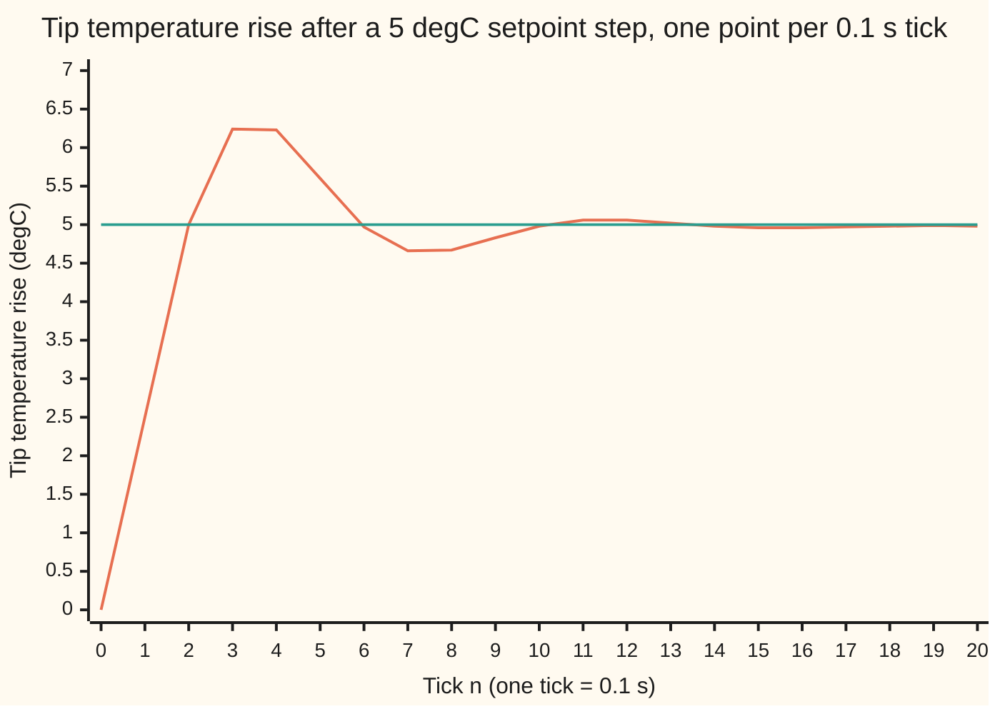
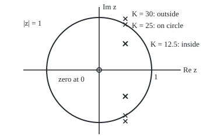

# The z-transform: difference equations become algebra in the z-plane

Engineering mathematics → Linear Systems and Transforms → Sampled loops in the z-plane → The z-transform

---

## General Overview

A soldering station holds its iron's tip at a set temperature with a digital thermostat. Every 0.1 s a microcontroller reads the tip's thermocouple, compares the reading with the setpoint, and sets the heater's power for the next tenth of a second. The tip is a small lump of copper: 2.5 J warms it by one degree. Holding it at working temperature takes 16.5 W; the heater can give 80 W at most.

The dial is turned up by 5 °C. The firmware engineer wants three numbers. How far does the tip overshoot? How soon is it within 2 % of the new value? And how much harder can the loop be pushed, by a higher gain or a smaller tip, before the swings grow instead of dying?

The firmware is a loop of a few lines. A rule that gives the next value from earlier values is a difference equation. Running it answers the questions for one setting; the z-transform answers them for every setting at once. It turns the difference equation into a fraction in a new variable z, and the fraction's poles, the values of z where its denominator is zero, decide everything. Here they sit at 0.49900 ± 0.50100j, a distance 0.70711 from the origin; j is the square root of −1, as engineers write it, where the rest of the library writes i. They lie inside the circle of radius 1, so the tip settles: it overshoots by 25.2 % and is within 2 % after 1.0 s. The loop goes unstable when the gain doubles.

**The z-transform turns "one tick later" into "multiply by z", so a difference equation becomes a ratio of polynomials in z; its poles are the growth factors per tick of the system's natural motions, and the system settles exactly when every pole lies inside the unit circle.**

**What kind of fact this is:** a method, built on a definition (the transform) and a theorem (stable exactly when every pole is inside the unit circle), proved on this card in Why it works.

### The picture: the tip after the dial goes up 5 °C



The ringing line is the tip temperature rise, one value per tick, from the firmware loop. The flat line is the 5 °C setpoint. The tip peaks at 6.24 °C on tick 3, swings back to 4.66 °C, and settles at 4.98 °C, a hair under the setpoint.

---

## The formula

**The z-transform** of a sequence y[0], y[1], y[2], … is one function of a complex variable z:

$$Y(z) = \sum_{n=0}^{\infty} y[n]\, z^{-n} = y[0] + \frac{y[1]}{z} + \frac{y[2]}{z^2} + \cdots$$

**Read it aloud:** hang each sample on a power of one over z, the power counting how many ticks have passed, and add them up.

This card introduces two pieces of notation the rest of the wing uses. The letter z is the transform's variable, a complex number. Its reciprocal z^(-1) is read "one-tick delay": a sequence delayed by one tick has the transform z^(-1) Y(z). Replace z by 1/x and Y(z) is the ordinary generating function of the sequence, the power series y[0] + y[1] x + y[2] x^2 + … of [ordinary-generating-functions](../../04-Combinatorics%20and%20graphs/07-Generating%20Functions/01-ordinary-generating-functions.md).

**The thermostat as two difference equations.** Write y[n] for the tip's temperature rise above where it started, in °C, at tick n, and u[n] for the extra heater power during that tick, in W, on top of the 16.5 W that holds it. Over one tick the tip keeps a share $a$ of its rise and gains $b$ degrees per watt. The thermostat acts on the reading taken one tick earlier, since reading and filtering take a tick:

$$y[n+1] = a\,y[n] + b\,u[n], \qquad u[n] = K\,\bigl(r - y[n-1]\bigr).$$

**Read it aloud:** next tick's temperature is most of this tick's plus the heater's push; the push is the gain times how far last tick's reading fell short.

**What the transform turns them into.** With the tip at rest to begin with, the closed loop's transfer function, the transform of the output over the transform of the setpoint, is

$$H(z) = \frac{Y(z)}{R(z)} = \frac{bK\,z}{z^2 - a\,z + bK} = \frac{0.5\,z}{z^2 - 0.998\,z + 0.5}.$$

**Read it aloud:** the loop multiplies the setpoint's transform by a fraction whose denominator is a quadratic in z.

**Stability.** The poles $p$ are the roots of the denominator. The loop settles from any start, and turns every bounded setpoint into a bounded temperature, exactly when every pole satisfies |p| < 1: every pole strictly inside the unit circle, the circle of radius 1 about the origin. A pole on the circle rings forever; one outside grows every tick.

**Settling value.** If every pole is inside, a step of size $r$ settles at H(1) r, the fraction at z = 1:

$$y[\infty] = H(1)\,r = \frac{bK}{1 - a + bK}\, r = 4.98008\ ^\circ\text{C}.$$

| Symbol | Plain meaning | In our example | Push it up and the answer… |
| --- | --- | --- | --- |
| $n$, $T$ | tick count; time between ticks | one tick = 0.1 s | — |
| $y$, $u$ | tip temperature rise (°C); extra heater power (W), at tick n | y settles at 4.98008 °C | — |
| $r$ | setpoint step | 5 °C | final rise grows in proportion |
| $C_{th}$, $R_{th}$ | heat capacity of the tip; thermal resistance to the air | 2.5 J/°C; 20 °C/W | smaller tip (lower C_th) raises b and moves poles out |
| $a$, $b$ | share of the rise kept per tick, 1 − T/(R_th C_th); warming per watt per tick, T/C_th | 0.998; 0.04 °C per W per tick | larger b: poles move toward the circle |
| $K$ | thermostat gain, watts per degree short | 12.5 W/°C | poles move out; limit 25 W/°C |
| $Y$, $R$ | transforms of the temperature sequence and the setpoint sequence | R(z) = 5z/(z − 1) | — |
| $H$, $h$ | closed-loop transfer function; its impulse response, h[n] | H(1) = 0.996016 | — |
| $p$, $\rho$ | a pole; a circle radius for the inverse transform | \|p\| = 0.70711; 1.2 | \|p\| near 1: slow, ringing settle |
| $s$, $j$ | Laplace variable; square root of −1, engineers' letter | s = −3.4657 ± 7.8740j rad/s | — |
| $f$, $\theta$ | frequency of a wobble (Hz); its angle per tick, 2πfT | 1 Hz; 36° | — |
| $d$ | heat drawn by a joint being soldered | 20 W | tip sags 1.5936 °C |

### When it holds

- **Linear.** The heater's power is clamped between −16.5 W and +63.5 W extra (it cannot cool, and it tops out at 80 W). The 5 °C step stays inside: it asks at most 62.5 W extra, 79.0 W in all. A 20 °C step asks for 250 W extra in the first tick. The linear model then promises a peak of 24.940 °C; the clamped tip peaks at 21.179 °C on tick 9. Poles describe the linear loop only.
- **Time-invariant.** The same a, b and K every tick. A tip swapped mid-job for one with half the heat capacity doubles b and puts the poles on the unit circle.
- **Causal and starting at rest.** The one-sided sum starts at n = 0, and the transfer function assumes every earlier value is zero. A non-zero start adds terms, worked out in Step 2.
- **A lumped tip.** One temperature for the whole tip. A real lag between heater and point adds a pole and lowers the stable gain.
- **The update rule is a model of the physics.** a = 0.998000 and b = 0.040000 are the one-step Euler values; a heater held constant over each tick gives exactly 0.998002 and 0.039960 ([zero-order-hold-and-tustin-discretisation](09-zero-order-hold-and-tustin-discretisation.md)). With those, |p| = 0.70675, the peak 6.23004 °C, overshoot 25.1 % and the gain limit 25.025 W/°C, against 0.70711, 6.23501 °C, 25.2 % and 25 W/°C; the settling value is unchanged.

---

## Why it works

### Step 0: a delay is the only memory a sampled system has

A continuous system remembers through its derivatives; the Laplace transform ([the-laplace-transform](../../08-Differential%20equations%20and%20dynamics/08-Laplace%20Transforms%20for%20Initial-Value%20Problems/01-the-laplace-transform.md)) turns each derivative into a factor of s. A sampled system remembers through earlier samples, y[n − 1], y[n − 2]. If one operation can turn "one tick earlier" into a multiplication, a difference equation of any length becomes a polynomial equation, solvable by algebra. Multiplying by z^(-1) is that operation.

### Step 1: the transform of a geometric sequence, and where it exists

The building block is the sequence p^n: each sample p times the last, the discrete version of an exponential. Its transform is a geometric series with ratio p/z:

$$\sum_{n=0}^{\infty} p^n z^{-n} = \frac{1}{1 - p/z} = \frac{z}{z - p}, \qquad \text{valid for } |z| > |p|.$$

The sum converges only outside the circle of radius |p|. That set is the region of convergence. It matters because the same fraction z/(z − p) is also the transform of a different sequence, one that is −p^n for negative n and zero after. Its sum, −Σ p^n z^(−n) over n = −1, −2, …, converges only inside the circle, |z| < |p|. For p = 0.998 at z = 0.5 it gives −1.004016, the value of z/(z − p) there. A fraction alone does not fix a sequence; the fraction plus its region does. For a sequence that starts at n = 0 the region is always the outside of the largest pole's circle.

In the terms of [laurent-series](../../07-Complex%20analysis/05-Laurent%20Series%2C%20Singularities%20and%20Residues/01-laurent-series.md), Y(z) is a Laurent series with only non-positive powers of z.

### Step 2: the shift rule turns the difference equation into algebra

Take the transform of y[n + 1], the sequence moved one tick earlier:

$$\sum_{n=0}^{\infty} y[n+1]\, z^{-n} = z \sum_{m=1}^{\infty} y[m]\, z^{-m} = z\,Y(z) - z\,y[0].$$

The sequence moved one tick later, y[n − 1], has transform z^(-1) Y(z) + y[−1]. The leftover terms are the initial conditions. The tip starts at rest, y[0] = y[−1] = 0, so they vanish.

Transform both equations. The tip gives z Y(z) = a Y(z) + b U(z). The thermostat gives U(z) = K (R(z) − z^(-1) Y(z)). Substitute the second into the first and collect the terms in Y(z):

$$Y(z)\,\bigl(z - a + bK\,z^{-1}\bigr) = bK\,R(z) \quad\Longrightarrow\quad Y(z) = \frac{bK\,z}{z^2 - a\,z + bK}\,R(z).$$

That is H(z). No step of it needed the numbers; the numbers enter only at the end. For the dial step, r = 5 °C every tick from n = 0, so R(z) = 5z/(z − 1) by Step 1 with p = 1.

### Step 3: partial fractions show each pole as a motion

The denominator z^2 − a z + bK has two roots p1 and p2. Splitting Y(z)/z into simple fractions, as in [poles-zeros-and-stability](03-poles-zeros-and-stability.md) and with Step 1 read backwards, gives the whole response in closed form:

$$y[n] = H(1)\,r \;+\; c_1\,p_1^{\,n} \;+\; c_2\,p_2^{\,n}, \qquad c_1 = \frac{bK\,r\,p_1}{(p_1 - 1)(p_1 - p_2)},$$

and c_2 likewise, with p_1 and p_2 swapped.

The first term is the pole at z = 1, the step itself, and gives the settling value. Each other term is a pole's geometric sequence. A pole p = |p| e^(jθ) contributes |p|^n times a rotation by θ each tick. The distance |p| is the factor by which that motion shrinks or grows per tick; the angle θ is how fast it rings.

For K = 12.5 W/°C the quadratic is z^2 − 0.998 z + 0.5. Its discriminant (the part under the square root) is negative, so the poles are a complex pair, 0.49900 ± 0.50100j. Their product is the constant term, so |p|^2 = bK = 0.5 and |p| = 0.70711. The ringing turns 45.11° per tick, one full turn in 7.980 ticks, 0.7980 s. Each tick the swing shrinks to 0.70711 of itself, so the envelope falls below 2 % after ln(0.02)/ln(0.70711) = 11.29 ticks; the loop is inside the band from tick 10.

### Step 4: the inverse transform is a contour integral

Step 3 needed the roots. A second route needs only the fraction. Y(z) is a Laurent series in z, so its coefficients are integrals around any circle outside all the poles:

$$y[n] = \frac{1}{2\pi j}\oint_{|z| = \rho} Y(z)\, z^{n-1}\, dz.$$

The residue theorem turns this integral back into the sum over poles of Step 3. Evaluated numerically, with 256 points on the circle of radius 1.2, it is an independent road: the code takes it and agrees with the firmware loop to better than 1e-9 °C at every tick from 0 to 40.

### Step 5: why the unit circle is the boundary

Every term of the response is a constant times p^n (times a power of n for a repeated pole). If every |p| < 1, every such term dies and the system settles. If one |p| > 1, its term grows by |p| each tick. If a single pole has |p| = 1 it neither grows nor dies: a steady ring. That is the whole stability test.

<details>
<summary>Detailed proof: bounded in, bounded out exactly when every pole is inside</summary>

A system is BIBO stable (bounded input, bounded output) when every input that stays below some bound M produces an output that stays below some bound too. The output is the convolution y[n] = Σ_k h[k] u[n − k] of the impulse response h with the input ([impulse-response-and-transfer-functions](02-impulse-response-and-transfer-functions.md)).

*Sufficient.* If Σ|h[k]| = S is finite, then |y[n]| ≤ Σ|h[k]| |u[n − k]| ≤ M S for every n.

*Necessary.* If Σ|h[k]| is infinite, pick the bounded input u[N − k] = sign of h[k] for k = 0 … N. Then y[N] = Σ_{k≤N} |h[k]|, which grows without bound as N grows. That input changes with N; one fixed input is needed. A unit pulse is one if h is unbounded. If every |h[k]| ≤ B, join the blocks end to end: earlier blocks add at most B times their length to y at a new block's end, so a long enough new block pushes y past any bound.

*Poles.* For a rational H(z) with no pole cancelled by a zero, partial fractions write h[n], for n past the numerator's degree, as a sum of terms c n^m p^n, one group per pole p, with m below the pole's multiplicity. If every |p| < 1, each term is summable, because n^m |p|^n shrinks faster than any geometric series with ratio between |p| and 1. If some |p| ≥ 1, the terms of the largest such |p| do not shrink, and sequences with different ratios cannot cancel them for every n ([poles-zeros-and-stability](03-poles-zeros-and-stability.md), with n for t), so the sum of |h[n]| is infinite. Hence BIBO stable exactly when every pole satisfies |p| < 1. ∎

</details>

**A test without the roots.** For a quadratic z^2 + c1 z + c0 with real coefficients, both roots lie inside the unit circle exactly when three inequalities hold: |c0| < 1, 1 + c1 + c0 > 0 and 1 − c1 + c0 > 0. The first bounds the product of the roots; the other two make the quadratic positive at z = 1 and z = −1, so no real root has escaped past either end. This is the second-order case of Jury's test. For the thermostat, c1 = −0.998 and c0 = bK, so the binding condition is bK < 1: K < 1/b = 25 W/°C. The design gain 12.5 W/°C has a gain margin of 2.00, a factor of two before instability.

### The picture: the poles in the z-plane

<p align="center"></p>

Drawn to scale, 90 px per unit. The crosses are the closed-loop pole pairs: inside the circle for the design gain, on it at 25 W/°C, outside at 30 W/°C. Raising K keeps the real part at a/2 = 0.499 and pushes the pair straight up and down, since only the constant term bK changes. The small circle is the zero at the origin, from the factor z in the numerator.

### Step 6: the map from the s-plane, and the unit circle as frequency

Sampling e^(st) every T seconds gives the sequence (e^(sT))^n, so a continuous pole at s becomes a discrete pole at z = e^(sT). The left half of the s-plane, Re s < 0, lands inside the unit circle, because |e^(sT)| = e^(T Re s) < 1. The tip alone has a = 0.998, which maps back to s = ln(a)/T = −0.020020 1/s, close to −1/(R_th C_th) = −0.020000 1/s. The closed-loop pair maps back to s = −3.4657 ± 7.8740j rad/s.

The unit circle itself is the imaginary axis of the s-plane: z = e^(jθ) with θ = 2πfT, the angle the wobble turns through per tick. Evaluating H on the circle gives the frequency response, the discrete-time Fourier transform. A setpoint wobbling ±1 °C at 1 Hz makes the tip swing ±1.3719 °C; the code gets that number both from |H| and from running the loop. The response peaks at 1.4114 at 1.154 Hz, near the ringing frequency. The sampling rate is f_s = 1/T = 10 Hz. The point z = −1 is half of it, f_s/2 = 5.0 Hz, the fastest wobble a 0.1 s tick can represent (sampling-and-the-nyquist-theorem).

### Step 7: the settling value is H at z = 1

A step's transform carries the pole z = 1. In Step 3 that pole's term is H(1) r, while every other term dies when the poles are inside. So y[∞] = H(1) r = 0.5 / 0.502 × 5 = 4.98008 °C. It is the discrete final value theorem ([final-value-theorem-and-steady-gain](05-final-value-theorem-and-steady-gain.md)), with z → 1 in place of s → 0. A proportional thermostat leaves a droop of 0.01992 °C; a joint that draws 20 W from the tip leaves it 1.5936 °C low, where the bare tip with the thermostat off would sag R_th d = 400 °C, more than it has above room temperature.

---

## Worked numbers, by hand

| Step | Arithmetic | Value |
| --- | --- | --- |
| tip memory a | 1 − 0.1 / (20 × 2.5) | 0.998 |
| tip warming b | 0.1 / 2.5 | 0.04 °C per W per tick |
| loop constant bK | 0.04 × 12.5 | 0.5 |
| first tick | y[1] = b K r = 0.04 × 12.5 × 5 | 2.50000 °C |
| second tick | y[2] = 0.998 × 2.5 + 0.5 × (5 − 0) | 4.99500 °C |
| third tick | y[3] = 0.998 × 4.995 + 0.5 × (5 − 2.5) | **6.23501 °C, the peak** |
| poles | (0.998 ± √(0.998^2 − 2)) / 2 | 0.49900 ± 0.50100j |
| pole size | √(bK) = √0.5 | 0.70711, inside the circle |
| final value | 0.5 / (1 − 0.998 + 0.5) × 5 | **4.98008 °C** |
| overshoot | 6.23501 / 4.98008 − 1 | 25.2 % |
| stability limit | bK = 1, so K = 1 / 0.04 | **25 W/°C** |
| transform at z = 2 | 2.5 × 4 / ((2 − 1)(4 − 1.996 + 0.5)) | 3.993610224 |

Turning the dial up 5 °C sends the tip 1.25493 °C past its settling value 0.3 s later, and it is within 2 % of its new value 1.0 s after the turn. The last row is the transform of the whole response at one point: the code adds y[n] 2^(−n) over 400 ticks of the running loop and gets the same 3.993610224.

### What breaks if you drop a piece

| Mistake | Comes out at | What went wrong |
| --- | --- | --- |
| The s-plane rule, "real part negative", applied to z-poles | Re p = 0.499 > 0: the K = 12.5 loop is called unstable | In the z-plane the test is distance from the origin; \|p\| = 0.70711 < 1 and it settles |
| Gain raised to 30 W/°C | poles at 0.49900 ± 0.97519j, \|p\| = 1.09545; after 290 s the linear model's swing is 10^119.44 °C | Outside the circle; at 25 W/°C, on the circle, it rings for ever at 5.65 °C |
| A 20 °C step through the linear model | asks for 250 W; promises a peak of 24.940 °C | The heater is clamped at +63.5 W extra; the real tip peaks at 21.179 °C on tick 9 |
| A tip with half the heat capacity | b = 0.080, max\|p\| = 1.00000 | The model's b was wrong by a factor of 2, exactly the gain margin |

The code prints every row.

---

## Code, from first principles, and it actually runs

The script runs the firmware loop as written and reaches the step response by three independent roads: the loop itself; the closed form from partial fractions over the poles; and the inverse transform as a numerical contour integral of Y(z) around a circle, which never finds the roots. It checks the transform's definition by summing the simulated samples at z = 2, reads the settling value at z = 1, and tests stability three ways at eight gains: the size of the roots, Jury's inequalities, and a 3000-tick run. It finds the stability limit by bisection on the roots' size, checks the unit-circle frequency response against a simulated wobble, and prints each failure in the table above. Complex numbers in Rust are a small struct written out.

### Python

```python
# The z-transform -- the check behind the card.  Standard library only.
# A soldering-iron tip on a digital thermostat that updates every T = 0.1 s.
#   tip:        y[n+1] = a y[n] + b u[n]     y: tip temperature change (degC), u: heater power change (W)
#   thermostat: u[n]   = K (r - y[n-1])      it acts on the reading taken one tick earlier
#   transform:  H(z) = b K z / (z^2 - a z + b K)
# Step response by three roads: the loop itself; partial fractions over the poles;
# the inverse transform as a contour integral.  Stability by roots, by Jury's test, by running it.
import math, cmath

T, Cth, Rth, P_idle, P_max = 0.1, 2.5, 20.0, 16.5, 80.0   # s, J/degC, degC/W, W, W
a, b = 1 - T / (Rth * Cth), T / Cth                       # share kept per tick; degC per W per tick
K, r0 = 12.5, 5.0                                         # W/degC; setpoint raised 5 degC

def loop(K, r, ticks, b=b, d=0.0, lo=-math.inf, hi=math.inf, a=a):   # the firmware
    y, u = [0.0, 0.0], []                                 # y[-1], y[0]: at rest
    for n in range(ticks):
        u.append(min(hi, max(lo, K * (r - y[-2]))))       # reading from one tick back
        y.append(a * y[-1] + b * u[-1] - b * d)           # d: heat drawn by a joint, W
    return y[1:], u

def poles(K, b=b, a=a):                                   # roots of z^2 - a z + b K
    q = cmath.sqrt(a * a - 4 * b * K)
    return (a + q) / 2, (a - q) / 2

def jury(K, b=b):                                         # z^2 + c1 z + c0, no roots needed
    c1, c0 = -a, b * K
    return abs(c0) < 1 and 1 + c1 + c0 > 0 and 1 - c1 + c0 > 0

def Y(z, K=K, r=r0):                                      # transform of the step response
    return b * K * r * z * z / ((z - 1) * (z * z - a * z + b * K))

def residues(n, K=K, r=r0):                               # partial fractions, read back in time
    p1, p2 = poles(K)
    g = b * K * r
    return (g / ((1 - p1) * (1 - p2)) + g * p1 ** (n + 1) / ((p1 - 1) * (p1 - p2))
            + g * p2 ** (n + 1) / ((p2 - 1) * (p2 - p1))).real

clean = lambda v: 0.0 if abs(v) < 1e-9 else v              # no "-0.00000" from rounding noise

def contour(n, rho=1.2, M=256):                           # (1/2 pi j) closed integral of Y z^(n-1) dz
    s = 0j
    for k in range(M):
        z = rho * cmath.exp(2j * math.pi * k / M)
        s += Y(z) * z ** n
    return (s / M).real

print(f"tip: T = {T:.1f} s, C = {Cth:.1f} J/degC, R = {Rth:.1f} degC/W; a = {a:.6f}, b = {b:.6f} degC per W per tick")
ae, be = math.exp(-T / (Rth * Cth)), Rth * (1 - math.exp(-T / (Rth * Cth)))   # heater held flat over each tick
print(f"exact one-tick factors (card 09): a = {ae:.6f}, b = {be:.6f}")
y, u = loop(K, r0, 400)
p1, p2 = poles(K)
print(f"K = {K:.1f} W/degC: b K = {b * K:.3f}; poles {p1.real:.5f} +- {abs(p1.imag):.5f}j, |p| = {abs(p1):.5f}, angle {math.degrees(cmath.phase(p1)):.2f} deg")
print(f"power for the 5 degC step: first tick {u[0]:.1f} W extra, total {u[0] + P_idle:.1f} W of {P_max:.0f} W; min extra {min(u):.2f} W")
gap = max(max(abs(y[n] - residues(n)), abs(y[n] - contour(n))) for n in range(41))
print(f"three roads, ticks 0-40 (contour |z| = 1.2, 256 points): largest gap {'below 1e-9' if gap < 1e-9 else gap} degC")
for n in (0, 1, 2, 3, 4, 5, 10, 20):
    print(f"n = {n:2d}  t = {n * T:.1f} s  loop {y[n]:8.5f}  partial fractions {clean(residues(n)):8.5f}  contour {clean(contour(n)):8.5f} degC")
print("chart, y[n] n=0..20 (degC) " + " ".join(f"{v:.2f}" for v in y[:21]))
H1 = b * K / (1 - a + b * K)
pk = max(range(60), key=lambda n: y[n])
settle = max(n for n in range(200) if abs(y[n] - H1 * r0) > 0.02 * H1 * r0) + 1
print(f"final value: H(1) = {H1:.6f}, H(1) r = {H1 * r0:.5f} degC (loop at n = 399: {y[399]:.5f}); droop {r0 - H1 * r0:.5f} degC")
print(f"peak {y[pk]:.4f} degC at n = {pk} (t = {pk * T:.1f} s), overshoot {100 * (y[pk] / (H1 * r0) - 1):.1f} %, {y[pk] - H1 * r0:.5f} degC past")
print(f"2 % settling: loop n = {settle} ({settle * T:.1f} s); envelope ln(0.02)/ln|p| = {math.log(0.02) / math.log(abs(p1)):.2f} ticks")
ye, _ = loop(K, r0, 400, b=be, a=ae); pe = max(range(60), key=lambda n: ye[n])
print(f"exact factors, same loop: |p| = {abs(poles(K, be, ae)[0]):.5f}, peak {ye[pe]:.5f} degC at n = {pe}, overshoot {100 * (ye[pe] / ye[399] - 1):.1f} %, final {ye[399]:.5f} degC, limit 1/b = {1 / be:.3f} W/degC")
z0 = 2.0
fwd = sum(y[n] * z0 ** -n for n in range(400))
print(f"definition at z = 2: sum of y[n] 2^-n = {fwd:.9f}; closed form Y(2) = {Y(z0).real:.9f}")
per = 2 * math.pi / cmath.phase(p1)
print(f"ringing period 2 pi/angle = {per:.3f} ticks = {per * T:.4f} s, {1 / (per * T):.4f} Hz")
s1 = cmath.log(p1) / T
print(f"z = e^(sT): closed-loop s = {s1.real:.4f} +- {abs(s1.imag):.4f}j rad/s; plant pole ln(a)/T = {math.log(a) / T:.6f} 1/s vs -1/(RC) = {-1 / (Rth * Cth):.6f}")

# ---- stability against the unit circle ----
for k in (0.0, 5.0, 12.5, 20.0, 24.0, 25.0, 26.0, 30.0):
    m = max(abs(p) for p in poles(k))
    yk, _ = loop(k, r0, 3000)
    dev = max(abs(v - (b * k / (1 - a + b * k)) * r0) for v in yk[2900:])
    print(f"K = {k:4.1f}  max|p| = {m:.5f}  roots say {'stable' if m < 1 - 1e-12 else 'not stable'}  Jury says {'stable' if jury(k) else 'not stable'}  swing after 290 s {'below 1e-9' if dev < 1e-9 else f'{dev:.2f}' if dev < 1e3 else f'10^{math.log10(dev):.2f}'} degC")
lo_k, hi_k = 0.0, 100.0
for _ in range(100):                                      # bisection on the roots' size, max|p| < 1
    mid = (lo_k + hi_k) / 2
    lo_k, hi_k = (mid, hi_k) if max(abs(p) for p in poles(mid)) < 1 else (lo_k, mid)
print(f"stability limit: bisection on max|p| = 1 {lo_k:.6f} W/degC; Jury's b K < 1 gives 1/b = {1 / b:.6f} W/degC; gain margin {1 / b / K:.2f}")
for k in (25.0, 30.0):
    q = poles(k)[0]
    print(f"K = {k:.1f}: poles {q.real:.5f} +- {abs(q.imag):.5f}j, angle {math.degrees(cmath.phase(q)):.2f} deg, period {2 * math.pi / cmath.phase(q) * T:.4f} s")
for sc in (1.2, 2.0):                                     # smaller tip: b grows and a shrinks
    print(f"tip heat capacity / {sc:.1f}: b = {b * sc:.3f}, max|p| = {max(abs(p) for p in poles(K, b * sc, 1 - T * sc / (Rth * Cth))):.5f}")
print("figure, centre (170,120), unit circle radius 90 px; zero at (170,120)")
for k in (12.5, 25.0, 30.0):
    q = poles(k)[0]
    print(f"figure, K = {k:.1f}: poles at ({170 + 90 * q.real:.1f},{120 - 90 * q.imag:.1f}) and ({170 + 90 * q.real:.1f},{120 + 90 * q.imag:.1f})")

# ---- the unit circle is frequency: z = e^(j 2 pi f T) ----
Hz = lambda f: b * K * cmath.exp(2j * math.pi * f * T) / (cmath.exp(4j * math.pi * f * T) - a * cmath.exp(2j * math.pi * f * T) + b * K)
for f in (0.0, 0.5, 1.0, 1.25, 2.0, 5.0):
    print(f"|H| at {f:4.2f} Hz = {abs(Hz(f)):.4f}")
fpk = max((i * 0.001 for i in range(5001)), key=lambda f: abs(Hz(f)))
print(f"peak gain {abs(Hz(fpk)):.4f} at {fpk:.3f} Hz; z = -1 is f_s/2 = {1 / (2 * T):.1f} Hz")
yv = [0.0, 0.0]
for n in range(1200):                                     # setpoint wobbling 1 degC at 1 Hz
    yv.append(a * yv[-1] + b * K * (math.sin(2 * math.pi * 1.0 * n * T) - yv[-2]))
tail = yv[201:1201]                                       # y[200]..y[1199], 100 whole periods
cs = sum(v * math.cos(2 * math.pi * (n + 200) * T) for n, v in enumerate(tail)) * 2 / 1000
sn = sum(v * math.sin(2 * math.pi * (n + 200) * T) for n, v in enumerate(tail)) * 2 / 1000
print(f"1 Hz wobble of 1 degC, run through the loop: tip swings {math.hypot(cs, sn):.4f} degC ({360 * 1.0 * T:.1f} deg per tick)")
print(f"no sensor delay: one pole a - b K = {a - b * K:.3f}; limit K = (1 + a)/b = {(1 + a) / b:.2f} W/degC")

# ---- what breaks ----
print(f"s-plane rule on z-poles: Re p = {p1.real:.3f} > 0 calls the K = 12.5 loop unstable; |p| = {abs(p1):.5f} < 1, it settles")
yl, ul = loop(K, 20.0, 200)
yc, uc = loop(K, 20.0, 200, lo=-P_idle, hi=P_max - P_idle)
print(f"20 degC step: linear asks {ul[0]:.0f} W extra, peak {max(yl):.3f} degC; heater clamped to +{P_max - P_idle:.1f} W/-{P_idle:.1f} W peaks {max(yc):.3f} degC at n = {yc.index(max(yc))}")
yd, _ = loop(K, 0.0, 400, d=20.0)
print(f"joint drawing 20 W: loop settles at {yd[399]:.4f} degC; formula -b d/(1 - a + b K) = {-b * 20 / (1 - a + b * K):.4f} degC; bare tip would sag R d = {Rth * 20:.0f} degC")
anti = sum(-(0.5 / a) ** m for m in range(1, 400))
print(f"anti-causal twin: same z/(z-a), ROC |z| < {a:.3f}: anti-causal sum at z = 0.5 is {anti:.6f} = {0.5 / (0.5 - a):.6f}")

assert gap < 1e-9                                         # loop vs pole formula vs contour integral
assert abs(fwd - Y(z0).real) < 1e-9                       # summed definition vs closed-form transform
assert abs(y[399] - H1 * r0) < 1e-9                       # long run vs z -> 1
assert abs(lo_k - 1 / b) < 1e-9                           # bisection on the roots vs Jury's b K < 1
assert all(jury(k) == (max(abs(p) for p in poles(k)) < 1 - 1e-12) for k in (0, 5, 12.5, 24, 26, 30))
assert abs(yd[399] + b * 20 / (1 - a + b * K)) < 1e-9     # disturbance run vs formula
assert abs(math.hypot(cs, sn) - abs(Hz(1.0))) < 1e-6      # simulated wobble vs H on the unit circle
assert abs(anti - 0.5 / (0.5 - a)) < 1e-9                 # anti-causal sum vs the same fraction
print("ALL CHECKS PASS")
```

**Ran 2026-10-06 on macOS, Python 3.14.6, standard library only. All checks passed. Output, pasted from the run:**

```
tip: T = 0.1 s, C = 2.5 J/degC, R = 20.0 degC/W; a = 0.998000, b = 0.040000 degC per W per tick
exact one-tick factors (card 09): a = 0.998002, b = 0.039960
K = 12.5 W/degC: b K = 0.500; poles 0.49900 +- 0.50100j, |p| = 0.70711, angle 45.11 deg
power for the 5 degC step: first tick 62.5 W extra, total 79.0 W of 80 W; min extra -15.44 W
three roads, ticks 0-40 (contour |z| = 1.2, 256 points): largest gap below 1e-9 degC
n =  0  t = 0.0 s  loop  0.00000  partial fractions  0.00000  contour  0.00000 degC
n =  1  t = 0.1 s  loop  2.50000  partial fractions  2.50000  contour  2.50000 degC
n =  2  t = 0.2 s  loop  4.99500  partial fractions  4.99500  contour  4.99500 degC
n =  3  t = 0.3 s  loop  6.23501  partial fractions  6.23501  contour  6.23501 degC
n =  4  t = 0.4 s  loop  6.22504  partial fractions  6.22504  contour  6.22504 degC
n =  5  t = 0.5 s  loop  5.59508  partial fractions  5.59508  contour  5.59508 degC
n = 10  t = 1.0 s  loop  4.98350  partial fractions  4.98350  contour  4.98350 degC
n = 20  t = 2.0 s  loop  4.98494  partial fractions  4.98494  contour  4.98494 degC
chart, y[n] n=0..20 (degC) 0.00 2.50 5.00 6.24 6.23 5.60 4.97 4.66 4.67 4.83 4.98 5.06 5.06 5.02 4.98 4.96 4.96 4.97 4.98 4.99 4.98
final value: H(1) = 0.996016, H(1) r = 4.98008 degC (loop at n = 399: 4.98008); droop 0.01992 degC
peak 6.2350 degC at n = 3 (t = 0.3 s), overshoot 25.2 %, 1.25493 degC past
2 % settling: loop n = 10 (1.0 s); envelope ln(0.02)/ln|p| = 11.29 ticks
exact factors, same loop: |p| = 0.70675, peak 6.23004 degC at n = 3, overshoot 25.1 %, final 4.98008 degC, limit 1/b = 25.025 W/degC
definition at z = 2: sum of y[n] 2^-n = 3.993610224; closed form Y(2) = 3.993610224
ringing period 2 pi/angle = 7.980 ticks = 0.7980 s, 1.2532 Hz
z = e^(sT): closed-loop s = -3.4657 +- 7.8740j rad/s; plant pole ln(a)/T = -0.020020 1/s vs -1/(RC) = -0.020000
K =  0.0  max|p| = 0.99800  roots say stable  Jury says stable  swing after 290 s below 1e-9 degC
K =  5.0  max|p| = 0.72036  roots say stable  Jury says stable  swing after 290 s below 1e-9 degC
K = 12.5  max|p| = 0.70711  roots say stable  Jury says stable  swing after 290 s below 1e-9 degC
K = 20.0  max|p| = 0.89443  roots say stable  Jury says stable  swing after 290 s below 1e-9 degC
K = 24.0  max|p| = 0.97980  roots say stable  Jury says stable  swing after 290 s below 1e-9 degC
K = 25.0  max|p| = 1.00000  roots say not stable  Jury says not stable  swing after 290 s 5.65 degC
K = 26.0  max|p| = 1.01980  roots say not stable  Jury says not stable  swing after 290 s 10^26.30 degC
K = 30.0  max|p| = 1.09545  roots say not stable  Jury says not stable  swing after 290 s 10^119.44 degC
stability limit: bisection on max|p| = 1 25.000000 W/degC; Jury's b K < 1 gives 1/b = 25.000000 W/degC; gain margin 2.00
K = 25.0: poles 0.49900 +- 0.86660j, angle 60.07 deg, period 0.5993 s
K = 30.0: poles 0.49900 +- 0.97519j, angle 62.90 deg, period 0.5723 s
tip heat capacity / 1.2: b = 0.048, max|p| = 0.77460
tip heat capacity / 2.0: b = 0.080, max|p| = 1.00000
figure, centre (170,120), unit circle radius 90 px; zero at (170,120)
figure, K = 12.5: poles at (214.9,74.9) and (214.9,165.1)
figure, K = 25.0: poles at (214.9,42.0) and (214.9,198.0)
figure, K = 30.0: poles at (214.9,32.2) and (214.9,207.8)
|H| at 0.00 Hz = 0.9960
|H| at 0.50 Hz = 1.0975
|H| at 1.00 Hz = 1.3719
|H| at 1.25 Hz = 1.3925
|H| at 2.00 Hz = 0.6989
|H| at 5.00 Hz = 0.2002
peak gain 1.4114 at 1.154 Hz; z = -1 is f_s/2 = 5.0 Hz
1 Hz wobble of 1 degC, run through the loop: tip swings 1.3719 degC (36.0 deg per tick)
no sensor delay: one pole a - b K = 0.498; limit K = (1 + a)/b = 49.95 W/degC
s-plane rule on z-poles: Re p = 0.499 > 0 calls the K = 12.5 loop unstable; |p| = 0.70711 < 1, it settles
20 degC step: linear asks 250 W extra, peak 24.940 degC; heater clamped to +63.5 W/-16.5 W peaks 21.179 degC at n = 9
joint drawing 20 W: loop settles at -1.5936 degC; formula -b d/(1 - a + b K) = -1.5936 degC; bare tip would sag R d = 400 degC
anti-causal twin: same z/(z-a), ROC |z| < 0.998: anti-causal sum at z = 0.5 is -1.004016 = -1.004016
ALL CHECKS PASS
```

### Rust

Same numbers, same labels, built with `rustc --edition 2021 -O`.

```rust
// The z-transform -- the same check as the Python, in Rust.  No crates.
// A soldering-iron tip on a digital thermostat that updates every T = 0.1 s.
//   tip:        y[n+1] = a y[n] + b u[n]     y: tip temperature change (degC), u: heater power change (W)
//   thermostat: u[n]   = K (r - y[n-1])      it acts on the reading taken one tick earlier
//   transform:  H(z) = b K z / (z^2 - a z + b K)
// Step response by three roads: the loop itself; partial fractions over the poles;
// the inverse transform as a contour integral.  Stability by roots, by Jury's test, by running it.
use std::f64::consts::PI;

#[derive(Clone, Copy)]
struct C { re: f64, im: f64 }                             // a complex number, written out
fn c(re: f64, im: f64) -> C { C { re, im } }
impl C {
    fn add(self, o: C) -> C { c(self.re + o.re, self.im + o.im) }
    fn sub(self, o: C) -> C { c(self.re - o.re, self.im - o.im) }
    fn mul(self, o: C) -> C { c(self.re * o.re - self.im * o.im, self.re * o.im + self.im * o.re) }
    fn div(self, o: C) -> C {
        let d = o.re * o.re + o.im * o.im;
        c((self.re * o.re + self.im * o.im) / d, (self.im * o.re - self.re * o.im) / d)
    }
    fn sc(self, k: f64) -> C { c(self.re * k, self.im * k) }
    fn abs(self) -> f64 { self.re.hypot(self.im) }  fn arg(self) -> f64 { self.im.atan2(self.re) }
    fn powi(self, n: i32) -> C { let mut p = c(1.0, 0.0); for _ in 0..n { p = p.mul(self) } p }
}
fn cis(t: f64) -> C { c(t.cos(), t.sin()) }

const T: f64 = 0.1; const CTH: f64 = 2.5; const RTH: f64 = 20.0; const P_IDLE: f64 = 16.5; const P_MAX: f64 = 80.0;
const A: f64 = 1.0 - T / (RTH * CTH); const B: f64 = T / CTH;  // share kept per tick; degC per W per tick
const K: f64 = 12.5; const R0: f64 = 5.0;                   // W/degC; setpoint raised 5 degC

fn run(k: f64, r: f64, ticks: usize, b: f64, d: f64, lo: f64, hi: f64, a: f64) -> (Vec<f64>, Vec<f64>) {   // the firmware
    let (mut y, mut u) = (vec![0.0, 0.0], vec![]);         // y[-1], y[0]: at rest
    for _ in 0..ticks {
        let l = y.len();
        u.push(hi.min(lo.max(k * (r - y[l - 2]))));         // reading from one tick back
        y.push(a * y[l - 1] + b * u[u.len() - 1] - b * d);  // d: heat drawn by a joint, W
    }
    (y[1..].to_vec(), u)
}
fn lp(k: f64, r: f64, ticks: usize) -> (Vec<f64>, Vec<f64>) { run(k, r, ticks, B, 0.0, f64::NEG_INFINITY, f64::INFINITY, A) }

fn poles_a(k: f64, b: f64, a: f64) -> (C, C) {             // roots of z^2 - a z + b K
    let disc = a * a - 4.0 * b * k;
    let q = if disc >= 0.0 { c(disc.sqrt(), 0.0) } else { c(0.0, (-disc).sqrt()) };
    (c(a, 0.0).add(q).sc(0.5), c(a, 0.0).sub(q).sc(0.5))
}
fn poles(k: f64, b: f64) -> (C, C) { poles_a(k, b, A) }    fn maxp(k: f64, b: f64) -> f64 { maxp_a(k, b, A) }
fn maxp_a(k: f64, b: f64, a: f64) -> f64 { let (p, q) = poles_a(k, b, a); p.abs().max(q.abs()) }
fn jury(k: f64) -> bool {                                   // z^2 + c1 z + c0, no roots needed
    let (c1, c0) = (-A, B * k);
    c0.abs() < 1.0 && 1.0 + c1 + c0 > 0.0 && 1.0 - c1 + c0 > 0.0
}
fn yz(z: C) -> C {                                          // transform of the step response
    let one = c(1.0, 0.0);
    z.mul(z).sc(B * K * R0).div(z.sub(one).mul(z.mul(z).sub(z.sc(A)).add(c(B * K, 0.0))))
}
fn residues(n: i32) -> f64 {                                // partial fractions, read back in time
    let (p1, p2) = poles(K, B);
    let (g, one) = (B * K * R0, c(1.0, 0.0));
    let t0 = c(g, 0.0).div(one.sub(p1).mul(one.sub(p2)));
    let t1 = p1.powi(n + 1).sc(g).div(p1.sub(one).mul(p1.sub(p2)));
    let t2 = p2.powi(n + 1).sc(g).div(p2.sub(one).mul(p2.sub(p1)));
    t0.add(t1).add(t2).re
}
fn clean(v: f64) -> f64 { if v.abs() < 1e-9 { 0.0 } else { v } }   // no "-0.00000" from rounding noise
fn contour(n: i32) -> f64 {                                 // (1/2 pi j) closed integral of Y z^(n-1) dz
    let (rho, m) = (1.2, 256);
    let mut s = c(0.0, 0.0);
    for k in 0..m {
        let z = cis(2.0 * PI * k as f64 / m as f64).sc(rho);
        s = s.add(yz(z).mul(z.powi(n)));
    }
    s.re / m as f64
}
fn hz(f: f64) -> C {
    let e = cis(2.0 * PI * f * T);
    e.sc(B * K).div(cis(4.0 * PI * f * T).sub(e.sc(A)).add(c(B * K, 0.0)))
}

fn main() {
    println!("tip: T = {:.1} s, C = {:.1} J/degC, R = {:.1} degC/W; a = {:.6}, b = {:.6} degC per W per tick", T, CTH, RTH, A, B);
    let (ea, eb) = ((-T / (RTH * CTH)).exp(), RTH * (1.0 - (-T / (RTH * CTH)).exp()));   // heater held flat over each tick
    println!("exact one-tick factors (card 09): a = {:.6}, b = {:.6}", ea, eb);
    let (y, u) = lp(K, R0, 400); let (p1, _p2) = poles(K, B);
    println!("K = {:.1} W/degC: b K = {:.3}; poles {:.5} +- {:.5}j, |p| = {:.5}, angle {:.2} deg", K, B * K, p1.re, p1.im.abs(), p1.abs(), p1.arg().to_degrees());
    let umin = u.iter().cloned().fold(f64::INFINITY, f64::min);
    println!("power for the 5 degC step: first tick {:.1} W extra, total {:.1} W of {:.0} W; min extra {:.2} W", u[0], u[0] + P_IDLE, P_MAX, umin);
    let gap = (0..41).map(|n| (y[n] - residues(n as i32)).abs().max((y[n] - contour(n as i32)).abs())).fold(0.0, f64::max);
    println!("three roads, ticks 0-40 (contour |z| = 1.2, 256 points): largest gap {} degC", if gap < 1e-9 { "below 1e-9".to_string() } else { format!("{}", gap) });
    for n in [0usize, 1, 2, 3, 4, 5, 10, 20] {
        println!("n = {:2}  t = {:.1} s  loop {:8.5}  partial fractions {:8.5}  contour {:8.5} degC", n, n as f64 * T, y[n], clean(residues(n as i32)), clean(contour(n as i32)));
    }
    println!("chart, y[n] n=0..20 (degC) {}", y[..21].iter().map(|v| format!("{:.2}", v)).collect::<Vec<_>>().join(" "));
    let h1 = B * K / (1.0 - A + B * K);
    let mut pk = 0; for n in 0..60 { if y[n] > y[pk] { pk = n } }
    let settle = (0..200).filter(|&n| (y[n] - h1 * R0).abs() > 0.02 * h1 * R0).max().unwrap() + 1;
    println!("final value: H(1) = {:.6}, H(1) r = {:.5} degC (loop at n = 399: {:.5}); droop {:.5} degC", h1, h1 * R0, y[399], R0 - h1 * R0);
    println!("peak {:.4} degC at n = {} (t = {:.1} s), overshoot {:.1} %, {:.5} degC past", y[pk], pk, pk as f64 * T, 100.0 * (y[pk] / (h1 * R0) - 1.0), y[pk] - h1 * R0);
    println!("2 % settling: loop n = {} ({:.1} s); envelope ln(0.02)/ln|p| = {:.2} ticks", settle, settle as f64 * T, 0.02f64.ln() / p1.abs().ln());
    let (ye, _) = run(K, R0, 400, eb, 0.0, f64::NEG_INFINITY, f64::INFINITY, ea); let mut pe = 0; for n in 0..60 { if ye[n] > ye[pe] { pe = n } }
    println!("exact factors, same loop: |p| = {:.5}, peak {:.5} degC at n = {}, overshoot {:.1} %, final {:.5} degC, limit 1/b = {:.3} W/degC", maxp_a(K, eb, ea), ye[pe], pe, 100.0 * (ye[pe] / ye[399] - 1.0), ye[399], 1.0 / eb);
    let z0 = 2.0f64; let fwd: f64 = (0..400).map(|n| y[n] * z0.powi(-(n as i32))).sum();
    println!("definition at z = 2: sum of y[n] 2^-n = {:.9}; closed form Y(2) = {:.9}", fwd, yz(c(z0, 0.0)).re);
    let per = 2.0 * PI / p1.arg();
    println!("ringing period 2 pi/angle = {:.3} ticks = {:.4} s, {:.4} Hz", per, per * T, 1.0 / (per * T));
    let (sre, sim) = (p1.abs().ln() / T, p1.arg() / T);
    println!("z = e^(sT): closed-loop s = {:.4} +- {:.4}j rad/s; plant pole ln(a)/T = {:.6} 1/s vs -1/(RC) = {:.6}", sre, sim.abs(), A.ln() / T, -1.0 / (RTH * CTH));

    // ---- stability against the unit circle ----
    for k in [0.0, 5.0, 12.5, 20.0, 24.0, 25.0, 26.0, 30.0] {
        let m = maxp(k, B);
        let (yk, _) = lp(k, R0, 3000);
        let fin = B * k / (1.0 - A + B * k) * R0;
        let dev = yk[2900..].iter().map(|v| (v - fin).abs()).fold(0.0, f64::max);
        let sw = if dev < 1e-9 { "below 1e-9".to_string() } else if dev < 1e3 { format!("{:.2}", dev) } else { format!("10^{:.2}", dev.log10()) };
        println!("K = {:4.1}  max|p| = {:.5}  roots say {}  Jury says {}  swing after 290 s {} degC", k, m,
                 if m < 1.0 - 1e-12 { "stable" } else { "not stable" }, if jury(k) { "stable" } else { "not stable" }, sw);
    }
    let (mut lo_k, mut hi_k) = (0.0, 100.0);
    for _ in 0..100 { let mid = (lo_k + hi_k) / 2.0; if maxp(mid, B) < 1.0 { lo_k = mid } else { hi_k = mid } }   // bisection on the roots' size
    println!("stability limit: bisection on max|p| = 1 {:.6} W/degC; Jury's b K < 1 gives 1/b = {:.6} W/degC; gain margin {:.2}", lo_k, 1.0 / B, 1.0 / B / K);
    for k in [25.0, 30.0] {
        let q = poles(k, B).0;
        println!("K = {:.1}: poles {:.5} +- {:.5}j, angle {:.2} deg, period {:.4} s", k, q.re, q.im.abs(), q.arg().to_degrees(), 2.0 * PI / q.arg() * T);
    }
    for s in [1.2, 2.0] { println!("tip heat capacity / {:.1}: b = {:.3}, max|p| = {:.5}", s, B * s, maxp_a(K, B * s, 1.0 - T * s / (RTH * CTH))) }   // b grows, a shrinks
    println!("figure, centre (170,120), unit circle radius 90 px; zero at (170,120)");
    for k in [12.5, 25.0, 30.0] {
        let q = poles(k, B).0;
        println!("figure, K = {:.1}: poles at ({:.1},{:.1}) and ({:.1},{:.1})", k, 170.0 + 90.0 * q.re, 120.0 - 90.0 * q.im, 170.0 + 90.0 * q.re, 120.0 + 90.0 * q.im);
    }

    // ---- the unit circle is frequency: z = e^(j 2 pi f T) ----
    for f in [0.0, 0.5, 1.0, 1.25, 2.0, 5.0] { println!("|H| at {:4.2} Hz = {:.4}", f, hz(f).abs()) }
    let mut fpk = 0.0;
    for i in 0..5001 { let f = i as f64 * 0.001; if hz(f).abs() > hz(fpk).abs() { fpk = f } }
    println!("peak gain {:.4} at {:.3} Hz; z = -1 is f_s/2 = {:.1} Hz", hz(fpk).abs(), fpk, 1.0 / (2.0 * T));
    let mut yv = vec![0.0, 0.0];
    for n in 0..1200 {                                      // setpoint wobbling 1 degC at 1 Hz
        let l = yv.len();
        yv.push(A * yv[l - 1] + B * K * ((2.0 * PI * 1.0 * n as f64 * T).sin() - yv[l - 2]));
    }
    let tail = &yv[201..1201];                              // y[200]..y[1199], 100 whole periods
    let cs = tail.iter().enumerate().map(|(n, v)| v * (2.0 * PI * (n + 200) as f64 * T).cos()).sum::<f64>() * 2.0 / 1000.0;
    let sn = tail.iter().enumerate().map(|(n, v)| v * (2.0 * PI * (n + 200) as f64 * T).sin()).sum::<f64>() * 2.0 / 1000.0;
    println!("1 Hz wobble of 1 degC, run through the loop: tip swings {:.4} degC ({:.1} deg per tick)", cs.hypot(sn), 360.0 * 1.0 * T);
    println!("no sensor delay: one pole a - b K = {:.3}; limit K = (1 + a)/b = {:.2} W/degC", A - B * K, (1.0 + A) / B);

    // ---- what breaks ----
    println!("s-plane rule on z-poles: Re p = {:.3} > 0 calls the K = 12.5 loop unstable; |p| = {:.5} < 1, it settles", p1.re, p1.abs());
    let (yl, ul) = lp(K, 20.0, 200);
    let (yc, _uc) = run(K, 20.0, 200, B, 0.0, -P_IDLE, P_MAX - P_IDLE, A);
    let (ylm, mut ic) = (yl.iter().cloned().fold(f64::NEG_INFINITY, f64::max), 0);
    for n in 0..yc.len() { if yc[n] > yc[ic] { ic = n } }
    println!("20 degC step: linear asks {:.0} W extra, peak {:.3} degC; heater clamped to +{:.1} W/-{:.1} W peaks {:.3} degC at n = {}", ul[0], ylm, P_MAX - P_IDLE, P_IDLE, yc[ic], ic);
    let (yd, _) = run(K, 0.0, 400, B, 20.0, f64::NEG_INFINITY, f64::INFINITY, A);
    println!("joint drawing 20 W: loop settles at {:.4} degC; formula -b d/(1 - a + b K) = {:.4} degC; bare tip would sag R d = {:.0} degC", yd[399], -B * 20.0 / (1.0 - A + B * K), RTH * 20.0);
    let anti: f64 = (1..400).map(|m| -(0.5 / A).powi(m)).sum();
    println!("anti-causal twin: same z/(z-a), ROC |z| < {:.3}: anti-causal sum at z = 0.5 is {:.6} = {:.6}", A, anti, 0.5 / (0.5 - A));

    assert!(gap < 1e-9);                                    // loop vs pole formula vs contour integral
    assert!((fwd - yz(c(z0, 0.0)).re).abs() < 1e-9);        // summed definition vs closed-form transform
    assert!((y[399] - h1 * R0).abs() < 1e-9);               // long run vs z -> 1
    assert!((lo_k - 1.0 / B).abs() < 1e-9);                 // bisection on the roots vs Jury's b K < 1
    assert!([0.0, 5.0, 12.5, 24.0, 26.0, 30.0].iter().all(|&k| jury(k) == (maxp(k, B) < 1.0 - 1e-12)));
    assert!((yd[399] + B * 20.0 / (1.0 - A + B * K)).abs() < 1e-9);   // disturbance run vs formula
    assert!((cs.hypot(sn) - hz(1.0).abs()).abs() < 1e-6);  // simulated wobble vs H on the unit circle
    assert!((anti - 0.5 / (0.5 - A)).abs() < 1e-9);         // anti-causal sum vs the same fraction
    println!("ALL CHECKS PASS");
}
```

**Ran 2026-10-06 on macOS, rustc 1.98.1, no crates. All checks passed. Output, pasted from the run:**

```
tip: T = 0.1 s, C = 2.5 J/degC, R = 20.0 degC/W; a = 0.998000, b = 0.040000 degC per W per tick
exact one-tick factors (card 09): a = 0.998002, b = 0.039960
K = 12.5 W/degC: b K = 0.500; poles 0.49900 +- 0.50100j, |p| = 0.70711, angle 45.11 deg
power for the 5 degC step: first tick 62.5 W extra, total 79.0 W of 80 W; min extra -15.44 W
three roads, ticks 0-40 (contour |z| = 1.2, 256 points): largest gap below 1e-9 degC
n =  0  t = 0.0 s  loop  0.00000  partial fractions  0.00000  contour  0.00000 degC
n =  1  t = 0.1 s  loop  2.50000  partial fractions  2.50000  contour  2.50000 degC
n =  2  t = 0.2 s  loop  4.99500  partial fractions  4.99500  contour  4.99500 degC
n =  3  t = 0.3 s  loop  6.23501  partial fractions  6.23501  contour  6.23501 degC
n =  4  t = 0.4 s  loop  6.22504  partial fractions  6.22504  contour  6.22504 degC
n =  5  t = 0.5 s  loop  5.59508  partial fractions  5.59508  contour  5.59508 degC
n = 10  t = 1.0 s  loop  4.98350  partial fractions  4.98350  contour  4.98350 degC
n = 20  t = 2.0 s  loop  4.98494  partial fractions  4.98494  contour  4.98494 degC
chart, y[n] n=0..20 (degC) 0.00 2.50 5.00 6.24 6.23 5.60 4.97 4.66 4.67 4.83 4.98 5.06 5.06 5.02 4.98 4.96 4.96 4.97 4.98 4.99 4.98
final value: H(1) = 0.996016, H(1) r = 4.98008 degC (loop at n = 399: 4.98008); droop 0.01992 degC
peak 6.2350 degC at n = 3 (t = 0.3 s), overshoot 25.2 %, 1.25493 degC past
2 % settling: loop n = 10 (1.0 s); envelope ln(0.02)/ln|p| = 11.29 ticks
exact factors, same loop: |p| = 0.70675, peak 6.23004 degC at n = 3, overshoot 25.1 %, final 4.98008 degC, limit 1/b = 25.025 W/degC
definition at z = 2: sum of y[n] 2^-n = 3.993610224; closed form Y(2) = 3.993610224
ringing period 2 pi/angle = 7.980 ticks = 0.7980 s, 1.2532 Hz
z = e^(sT): closed-loop s = -3.4657 +- 7.8740j rad/s; plant pole ln(a)/T = -0.020020 1/s vs -1/(RC) = -0.020000
K =  0.0  max|p| = 0.99800  roots say stable  Jury says stable  swing after 290 s below 1e-9 degC
K =  5.0  max|p| = 0.72036  roots say stable  Jury says stable  swing after 290 s below 1e-9 degC
K = 12.5  max|p| = 0.70711  roots say stable  Jury says stable  swing after 290 s below 1e-9 degC
K = 20.0  max|p| = 0.89443  roots say stable  Jury says stable  swing after 290 s below 1e-9 degC
K = 24.0  max|p| = 0.97980  roots say stable  Jury says stable  swing after 290 s below 1e-9 degC
K = 25.0  max|p| = 1.00000  roots say not stable  Jury says not stable  swing after 290 s 5.65 degC
K = 26.0  max|p| = 1.01980  roots say not stable  Jury says not stable  swing after 290 s 10^26.30 degC
K = 30.0  max|p| = 1.09545  roots say not stable  Jury says not stable  swing after 290 s 10^119.44 degC
stability limit: bisection on max|p| = 1 25.000000 W/degC; Jury's b K < 1 gives 1/b = 25.000000 W/degC; gain margin 2.00
K = 25.0: poles 0.49900 +- 0.86660j, angle 60.07 deg, period 0.5993 s
K = 30.0: poles 0.49900 +- 0.97519j, angle 62.90 deg, period 0.5723 s
tip heat capacity / 1.2: b = 0.048, max|p| = 0.77460
tip heat capacity / 2.0: b = 0.080, max|p| = 1.00000
figure, centre (170,120), unit circle radius 90 px; zero at (170,120)
figure, K = 12.5: poles at (214.9,74.9) and (214.9,165.1)
figure, K = 25.0: poles at (214.9,42.0) and (214.9,198.0)
figure, K = 30.0: poles at (214.9,32.2) and (214.9,207.8)
|H| at 0.00 Hz = 0.9960
|H| at 0.50 Hz = 1.0975
|H| at 1.00 Hz = 1.3719
|H| at 1.25 Hz = 1.3925
|H| at 2.00 Hz = 0.6989
|H| at 5.00 Hz = 0.2002
peak gain 1.4114 at 1.154 Hz; z = -1 is f_s/2 = 5.0 Hz
1 Hz wobble of 1 degC, run through the loop: tip swings 1.3719 degC (36.0 deg per tick)
no sensor delay: one pole a - b K = 0.498; limit K = (1 + a)/b = 49.95 W/degC
s-plane rule on z-poles: Re p = 0.499 > 0 calls the K = 12.5 loop unstable; |p| = 0.70711 < 1, it settles
20 degC step: linear asks 250 W extra, peak 24.940 degC; heater clamped to +63.5 W/-16.5 W peaks 21.179 degC at n = 9
joint drawing 20 W: loop settles at -1.5936 degC; formula -b d/(1 - a + b K) = -1.5936 degC; bare tip would sag R d = 400 degC
anti-causal twin: same z/(z-a), ROC |z| < 0.998: anti-causal sum at z = 0.5 is -1.004016 = -1.004016
ALL CHECKS PASS
```

The two outputs match line for line.

> [!TIP]
> **Try changing**
> Guess first, then run it.
> - **Halve the tip's heat capacity.** Guess where the poles go. The "/ 2.0" line prints max|p| = 1.00000: the loop sits on the edge of stability and rings for ever, the same as doubling K.
> - **Drop the one-tick delay.** Change `y[-2]` to `y[-1]` in `loop`, so the thermostat acts on this tick's reading. Guess whether that helps. The loop becomes first order, with a single pole at a − bK = 0.498, and the first assert stops the program, because the pole formula still describes the delayed loop. The script's "no sensor delay" line prints that pole and the limit it would give, 49.95 W/°C.
> - **Shrink the contour.** Set `rho=0.9` in `contour`. Guess the result. The circle no longer encloses the pole at z = 1, the integral loses the settling term, and the first assert fails: the circle must lie in the region of convergence.
> - **Gain 24 against 26.** The stability table already prints both. Guess the swing after 290 s. At 24 W/°C it is below 1e-9 °C; at 26 W/°C it is 10^26.30 °C. A small change in gain crosses the circle.

---

## The usual mistake

> [!warning]
> **Testing a z-plane pole with the s-plane rule.** In the s-plane stability means a negative real part. In the z-plane it means a distance from the origin under 1. The thermostat's poles at 0.49900 ± 0.50100j have a positive real part and settle quickly; a pole on the negative real axis just outside the circle has a negative real part, yet grows every tick, flipping sign as it goes. The map z = e^(sT) turns the left half-plane into the inside of the unit circle; the two tests are one test in two coordinate systems.
>
> - **A fraction without its region.** z/(z − 0.998) is the transform of 0.998^n outside the circle of radius 0.998, and of an anti-causal sequence (negative n only) inside it: at z = 0.5 the anti-causal sum is −1.004016. Shrinking the contour of Step 4 inside a pole gives the wrong sequence.
> - **Forgetting the delay.** The thermostat acts on last tick's reading. Leave that z^(-1) out and the loop is first order with one real pole, with no overshoot, and a stability limit at bK = 1 + a, K = 49.95 W/°C instead of 25 W/°C: the model promises twice the margin the firmware has.
> - **Dropping initial conditions.** The shift rule is z Y(z) − z y[0], not z Y(z), whenever the tip does not start at rest.
> - **Angle per tick read as angle per second.** The ringing turns 45.11° per tick, 1.2532 Hz with 0.1 s ticks; read per second, it is ten times too slow.

---

## Where you meet it in real life

- **Digital temperature control.** Soldering stations, 3D-printer hot ends and laboratory baths run loops like this one. The z-plane says how much gain the firmware can carry and what a sensor delay costs.
- **Digital filters.** A filter is a difference equation run on samples: audio equalisers, the smoothing on a thermocouple reading, the anti-hum notch on a medical monitor. Its poles and zeros are placed in the z-plane by design, in digital-filters-fir-and-iir.
- **Turning an analogue design into code.** A controller drawn in the s-plane is moved to the z-plane, and the choice of map decides what survives, in [zero-order-hold-and-tustin-discretisation](09-zero-order-hold-and-tustin-discretisation.md).
- **Steady errors of digital loops.** The droop under a 20 W load is H at z = 1; the cure, an integrator with its pole at z = 1, is the subject of [steady-state-error-and-system-type](../03-Feedback%20Control/03-steady-state-error-and-system-type.md).

> **Say it back**
> The z-transform hangs each sample on a power of 1/z, so a one-tick delay becomes a factor of z^(-1) and a difference equation becomes a fraction in z. Each root of the denominator, a pole, is the per-tick growth factor of one natural motion. The system settles exactly when every pole lies inside the unit circle. For the soldering-iron thermostat the poles sit at distance 0.70711, the tip overshoots 25.2 % and settles in 1.0 s, and the loop goes unstable at twice the gain. The settling value is the fraction at z = 1, and the frequency response is the fraction on the unit circle.

---

## What this builds on

- [impulse-response-and-transfer-functions](02-impulse-response-and-transfer-functions.md): the transfer function as output transform over input transform, and the impulse response whose sum decides BIBO stability.
- [poles-zeros-and-stability](03-poles-zeros-and-stability.md): poles, zeros and the partial-fraction reading of a response, in the s-plane this card maps across.
- [laurent-series](../../07-Complex%20analysis/05-Laurent%20Series%2C%20Singularities%20and%20Residues/01-laurent-series.md): Y(z) is a Laurent series; its region of convergence and the contour integral for its coefficients.
- [first-order-recurrences-and-loans](../../04-Combinatorics%20and%20graphs/05-Recurrences/03-first-order-recurrences-and-loans.md): the tip's own update, y[n + 1] = a y[n] + b u[n], is a first-order recurrence.
- [ordinary-generating-functions](../../04-Combinatorics%20and%20graphs/07-Generating%20Functions/01-ordinary-generating-functions.md): the same object with z replaced by 1/x.

## Where this goes next

- [zero-order-hold-and-tustin-discretisation](09-zero-order-hold-and-tustin-discretisation.md): the exact a and b for a heater held over each tick, and how an s-plane controller becomes a z-plane one.
- sampling-and-the-nyquist-theorem: why the point z = −1, half the sampling rate, is the fastest wobble a sampled system can see, and what happens to faster ones.
- digital-filters-fir-and-iir: difference equations designed on purpose, with poles and zeros placed to pass some frequencies and stop others.

This card took the update rule a = 0.998, b = 0.04 as given; where those numbers come from when a continuous tip is sampled every 0.1 s, and how much the choice of sampling map changes the poles, is what zero-order-hold-and-tustin-discretisation answers.

---

## Sources

Verified 2026-10-06: every link below resolves to the publisher's page.

- Åström, Karl J., and Björn Wittenmark. *Computer-Controlled Systems: Theory and Design*. Dover edition, 2011. [Publisher page](https://store.doverpublications.com/products/9780486486130). The z-transform for sampled control loops, the unit-circle stability test, Jury's test and the map z = e^(sT).
- Ragazzini, John R., and Lotfi A. Zadeh. "The Analysis of Sampled-Data Systems." *Transactions of the AIEE, Part II: Applications and Industry* 71(5), 225–234, 1952. [DOI](https://doi.org/10.1109/TAI.1952.6371274). The paper that introduced the z-transform to control engineering.
- Jury, Eliahu I. "A Simplified Stability Criterion for Linear Discrete Systems." *Proceedings of the IRE* 50(6), 1493–1500, 1962. [DOI](https://doi.org/10.1109/JRPROC.1962.288193). The stability test that decides whether every root lies inside the unit circle without computing the roots.
- Freeman, Dennis. *6.003 Signals and Systems*, Fall 2011. MIT OpenCourseWare. [Course page](https://ocw.mit.edu/courses/6-003-signals-and-systems-fall-2011/). Lecture notes on difference equations, the z-transform and its region of convergence, and the discrete-time frequency response.
