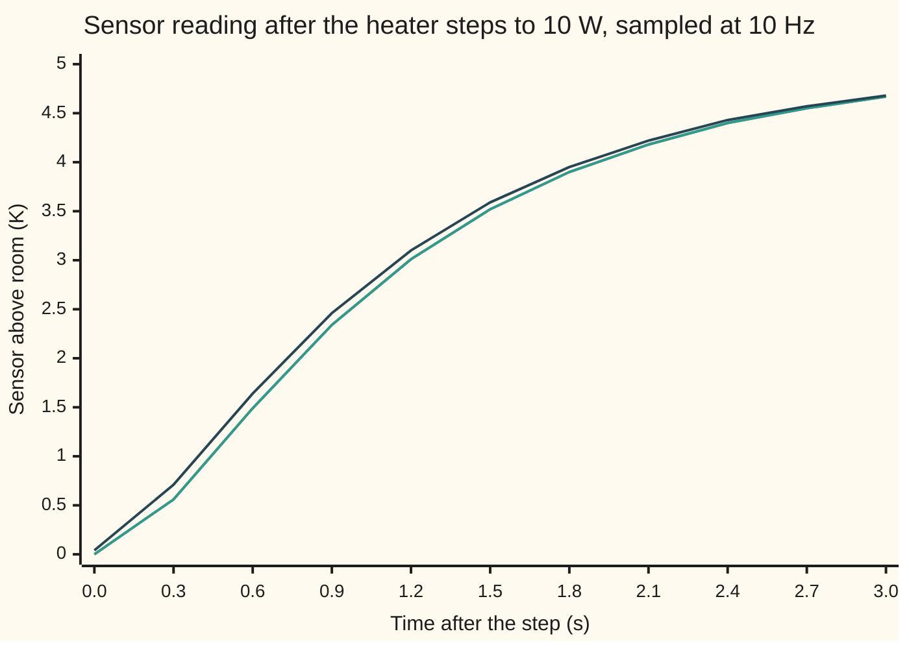
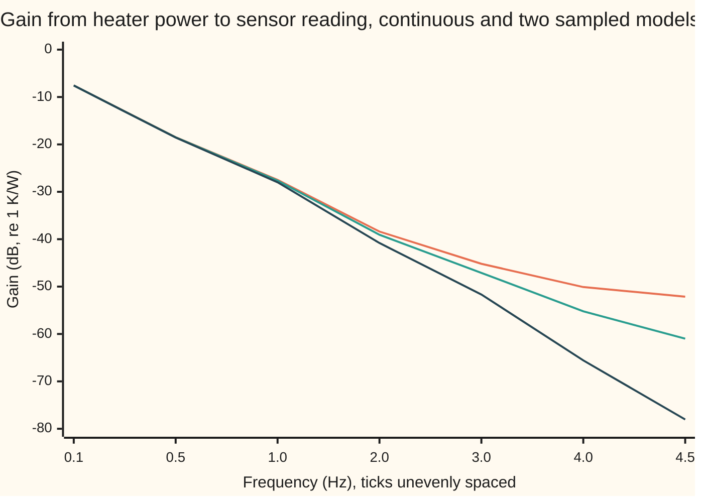

# Discretising a design: hold the input flat, or bend the frequency axis

[Syllabus](../../../SYLLABUS.md) → [Engineering mathematics](../README.md) → [Linear Systems and Transforms](../README.md#s02) → Discretising a design

---

## General Overview

A lab thermostat keeps a small aluminium sample cup a few kelvin above room temperature. A 10 W heater warms the cup. A thermistor, a temperature-sensing resistor, sits in a pocket of the cup and lags behind it. A microcontroller reads the thermistor ten times a second and sets the heater power ten times a second. Between two updates the heater driver holds the last power it was given.

The physics runs in continuous time; the code runs in steps of 0.1 s. Before anyone writes a controller, the engineer needs a model the code can step forward: "given the temperatures now and the power I set now, what will the sensor read one tick from now?" There are two standard ways to get it. The **zero-order hold** method assumes, correctly here, that the power stays flat for the whole tick, and solves the physics exactly over that tick. The **Tustin** method, also called the bilinear transform, swaps every derivative for a trapezoid-rule average; it keeps the frequency response's shape but squeezes the frequency axis.

For a 10 W step, the zero-order-hold model lands on the true sensor reading at every tick, to below 1e-12 K. The Tustin model is up to 152.075 mK off, mostly because it runs half a tick early. In the frequency domain the roles flip. Tustin reproduces the continuous gain and phase exactly, at a bent frequency. The zero-order hold adds a half-tick delay that costs 18.00° of phase at 1 Hz.

**Zero-order hold turns a continuous model into an exact sampled one for any input that is held flat between samples, using the matrix exponential; Tustin replaces s by (2/T)(z − 1)/(z + 1), which keeps every stable design stable but compresses the whole frequency axis into the band below half the sampling rate.**

**What kind of fact this is:** a method, two of them; the zero-order hold is exact under its stated assumption, proved in Why it works, and Tustin is an approximation whose error is stated there exactly, as a warping of frequency.

### The picture: the sensor after a 10 W heater step, three ways



The first line is the exact continuous response; the second is the zero-order-hold model's samples, which sit on it exactly, so the two lines coincide. The third line is the Tustin model: it starts at 0.0396825 K at the instant of the step, is 145.890 mK high at 0.3 s, and closes in as the cup settles towards 5 K.

---

## The formula

Reminders. The transfer function G(s) says what the system does to each exponential e^(st) ([Transfer functions](02-impulse-response-and-transfer-functions.md)). In a sampled system $z$ plays the same role for sequences, and multiplying by z^(−1) delays a sequence by one step ([The z-transform](08-z-transform-and-discrete-time-systems.md)).

The cup and the sensor, each a lump with one temperature. Write $x_1$ for the cup's temperature above room, $x_2$ for the sensor's, $u$ for the heater power and $y$ for the reading:

$$\frac{dx_1}{dt} = \frac{R\,u - x_1}{\tau_1}, \qquad \frac{dx_2}{dt} = \frac{x_1 - x_2}{\tau_2}, \qquad y = x_2, \qquad G(s) = \frac{R}{(\tau_1 s + 1)(\tau_2 s + 1)} = \frac{2}{s^2 + 5s + 4}.$$

Stack the two temperatures into the state x = (x_1, x_2): the numbers that, with the input, fix everything that happens next. In matrix form, dx/dt = A x + B u with `A = [[-1, 0], [4, -4]]` in 1/s and `B = [0.5, 0]` in K/(W s).

**Zero-order hold (ZOH).** If the power is held at u[k] from sample k to sample k + 1, then

$$x[k+1] = A_d\,x[k] + B_d\,u[k], \qquad A_d = e^{AT}, \qquad B_d = \int_0^T e^{A\sigma}\,d\sigma\;B.$$

**Read it aloud:** the state one tick later is the matrix exponential of A times the tick, applied to the state now, plus the effect of holding the power flat for one tick.

**Tustin.** Replace every $s$ in G(s) by a function of $z$:

$$s \;\longrightarrow\; \frac{2}{T}\,\frac{z - 1}{z + 1}, \qquad\text{and then on the unit circle}\qquad \omega_a = \frac{2}{T}\tan\frac{\omega T}{2}.$$

**Read it aloud:** Tustin's model swings at frequency ω exactly as the continuous system swings at the bent frequency ω_a, which runs off to infinity as ω reaches half the sampling rate.

| Symbol | Plain meaning | In our example | Push it up and the answer… |
| --- | --- | --- | --- |
| $u$ | heater power, held between samples | step to 10 W | every temperature rises in proportion |
| $x_1$, $x_2$, $y$ | cup and sensor temperature above room; the reading y = x2 | settle at 5.0 K | — |
| $R$ | thermal resistance from cup to room: kelvin of rise per watt | 0.5 K/W | higher final temperature |
| $\tau_1$, $\tau_2$ | time constants of the cup and the sensor | 1.0 s, 0.25 s | slower response; Tustin and ZOH agree better |
| $A$, $B$ | the continuous model dx/dt = A x + B u | see above | — |
| $T$, $f_s$ | sampling interval and sampling rate f_s = 1/T | 0.1 s, 10 Hz | larger T: Tustin's errors grow, ZOH stays exact |
| $k$ | sample number; time is kT | 0, 1, 2, … | — |
| $A_d$, $B_d$ | the sampled model's matrices | `[[0.904837, 0], [0.312690, 0.670320]]`, `[0.047581, 0.008495]` | — |
| $e^{AT}$, $\sigma$ | matrix exponential; σ is time inside the tick | — | — |
| $z$ | the shift variable: z = e^(jωT) on the unit circle | — | — |
| $\omega$, $\omega_a$, $\omega_0$, $j$ | angular frequency in rad/s; Tustin's bent frequency; the one frequency prewarping keeps exact; j is the square root of −1 | 1 Hz is 2π rad/s; ω₀ = 2π × 2 rad/s | ω_a grows faster than ω |
| $s$, $G$, $G_d$ | Laplace variable and transfer function; G_d, the sampled model's transfer function in z | 2/(s^2 + 5s + 4) | — |

Engineers write j for the square root of −1; the rest of the library writes i.

### When it holds

- **The input really is held flat between samples.** A digital-to-analogue output or a heater driver latched each tick does this, and then ZOH is exact at the samples. If the power instead varies smoothly within a tick, ZOH is an approximation too.
- **The continuous model is linear and time-invariant.** The heater only heats: holding the cup 2.0 K below room needs u = −4.0 W, which no resistive heater can deliver, so the model fails there whatever discretisation is used.
- **Lumped temperatures.** The cup is small enough to have one temperature. A long bar heated at one end would need many states.
- **Tustin needs nothing about the input, but pays in frequency.** Its response is exact only after the frequency axis is bent: a continuous feature at ω_a appears at the lower frequency ω. Prewarping fixes one chosen frequency exactly and no others.
- **Sampling well above the system's speed.** At 10 Hz against poles at 1 and 4 rad/s, both methods are usable; at 1 Hz Tustin's step error reaches 1.111 K while ZOH stays exact.

---

## Why it works

### Step 0: between samples, the input is a constant

A digital controller does not output a curve; it outputs a number and holds it. Over one tick the cup therefore obeys an ordinary differential equation (ODE) with a constant input, and that ODE has an exact solution. Sampling the exact solution at the tick boundaries gives a model with no approximation in it at all. That is the zero-order hold: "zero order" because the input is held as a polynomial of degree zero, a flat line.

### Step 1: solve one tick exactly with the matrix exponential

The solution of dx/dt = A x + B u from time 0, with state x(0), is the variation-of-constants formula ([The matrix exponential](../../08-Differential%20equations%20and%20dynamics/04-Systems%20and%20the%20Matrix%20Exponential/04-the-matrix-exponential.md)):

$$x(T) = e^{AT}x(0) + \int_0^T e^{A(T-\tau)}\,B\,u(\tau)\,d\tau.$$

With u constant at u[k], it comes out of the integral. Substituting σ = T − τ turns the integral into the one that defines B_d. So x[k+1] = A_d x[k] + B_d u[k], exactly.

For this cup A is lower triangular, so its exponential can be written out. The cup's own decay is e^(−t), the sensor's e^(−4t), and the sensor's response to the cup is the difference of the two, weighted by 4/(4 − 1):

$$e^{At} = \begin{pmatrix} e^{-t} & 0 \\ \tfrac{4}{3}\left(e^{-t} - e^{-4t}\right) & e^{-4t}\end{pmatrix}.$$

At t = 0.1 s this is `[[0.904837418, 0], [0.312689829, 0.670320046]]`, and integrating it against B gives B_d = `[0.047581291, 0.008495062]` K/W.

For the soldering tip of [The z-transform](08-z-transform-and-discrete-time-systems.md), one lump with a 50 s time constant, the same method gives a = e^(−0.002) = 0.998002 and b = 0.039960 °C per W per tick: the exact factors behind that card's Euler update.

<details>
<summary>One exponential gives both matrices (Van Loan's trick)</summary>

Build the 3-by-3 matrix `M = [[A, B], [0, 0]]` (A in the top-left, B as the third column, a row of zeros below). Its exponential is `e^(MT) = [[A_d, B_d], [0, 1]]`. The reason: the extra state is the held input, whose derivative is zero, so the augmented system just carries u along while the top block integrates it. The code computes A_d and B_d this way, by a Taylor series with scaling and squaring, and gets the same nine digits as the closed form.

</details>

### Step 2: poles move by z = e^(sT)

The eigenvalues of A are the continuous poles, −1 and −4 per second. The eigenvalues of e^(AT) are e^(−0.1) = 0.904837 and e^(−0.4) = 0.670320. Every continuous pole s becomes a sampled pole e^(sT). A pole in the left half of the s-plane lands inside the unit circle, so ZOH never turns a stable system unstable.

### Step 3: why ZOH matches a step response exactly, and what it does to frequency

A step is held flat on every tick, so the ZOH model reproduces the step response sample for sample: 0.0849506 K at 0.1 s and 0.2906766 K at 0.2 s, both by the model and by the exact formula. The code checks 31 samples and finds the largest gap below 1e-12 K.

The same fact gives a second formula for the sampled transfer function: G_d(z) = (1 − z^(−1)) times the z-transform of the sampled step response. The code computes G_d both ways and they agree to below 1e-12.

A sine wave is not held flat by nature. Holding it turns it into a staircase, and a staircase lags the smooth curve by half a tick on average. So the ZOH model's phase at frequency ω is close to the continuous phase minus ωT/2. At 1 Hz that is 0.05 s of delay, 18.00°: the continuous cup lags by 138.48°, the ZOH model by 156.44°, against 156.48° predicted. That is not an error in the model. It is the true cost of the hold, and any loop closed through the heater driver will pay it.

### Step 4: Tustin is the trapezoid rule

The exact relation is z = e^(sT), so s = (1/T) ln z. Tustin approximates the logarithm by the first term of its series: ln z ≈ 2 (z − 1)/(z + 1). In the time domain this is the trapezoid rule: each step averages the slope at its start and its end,

$$x[k] = x[k-1] + \tfrac{T}{2}\big(f(x[k-1],\,u[k-1]) + f(x[k],\,u[k])\big),$$

where f(x, u) = A x + B u. The code runs this implicit update, solving a 2-by-2 system each tick, and gets the same samples as the Tustin difference equation to below 1e-12 K.

The trapezoid rule assumes the input ramps linearly from one sample to the next. A step from 0 W before sample 0 to 10 W at sample 0 is read as a ramp starting half a tick early, so Tustin's step response leads the true one. Compared with the true response shifted 0.05 s earlier, its largest error falls from 152.075 mK to 16.661 mK.

### Step 5: the frequency axis bends

Put z = e^(jωT) on the unit circle. Then

$$\frac{z - 1}{z + 1} = \frac{e^{j\omega T/2} - e^{-j\omega T/2}}{e^{j\omega T/2} + e^{-j\omega T/2}} = j\tan\frac{\omega T}{2},$$

so Tustin's s becomes j (2/T) tan(ωT/2) = j ω_a. Tustin's model at frequency ω is the continuous G at the frequency ω_a, exactly. At low frequency tan is close to its argument and ω_a ≈ ω: 1.0 Hz is read as 1.03 Hz. Near the Nyquist frequency, half the sampling rate, here 5 Hz, the tangent explodes: 4.0 Hz is read as 9.80 Hz and 4.5 Hz as 20.10 Hz. The whole continuous axis from zero to infinity is squeezed into 0 to 5 Hz, without overlap, which is why Tustin never aliases (aliasing: a fast frequency masquerading as a slow one).

The same map sends the left half of the s-plane exactly onto the inside of the unit circle, so a stable controller stays stable after Tustin, at any sampling rate. Tustin's poles here are 0.904762 and 0.666667, against the exact 0.904837 and 0.670320.

**Prewarping.** If one frequency matters most, a corner of a filter or a notch, replace 2/T by ω₀ / tan(ω₀T/2). The bent axis then passes through ω₀ exactly. At 2 Hz plain Tustin gives −40.809 dB; prewarped at 2 Hz it gives −38.394 dB, the continuous value.

<details>
<summary>Detailed proof: Tustin maps the stable half-plane onto the unit disc</summary>

Solve s = (2/T)(z − 1)/(z + 1) for z: z = (1 + sT/2)/(1 − sT/2). Write sT/2 = a + jb. Then |z|^2 = ((1 + a)^2 + b^2)/((1 − a)^2 + b^2). The numerator minus the denominator is 4a. So |z| < 1 exactly when a < 0, that is, when s is in the left half-plane; |z| = 1 exactly when s is on the imaginary axis; and |z| > 1 on the right. The map is one-to-one, with inverse given by the substitution itself, so every point of the open disc comes from exactly one point of the left half-plane. A continuous transfer function whose poles all have negative real part therefore becomes a discrete one whose poles all lie inside the unit circle. The pole s = −4 goes to (1 − 0.2)/(1 + 0.2) = 0.666667.

For the ZOH frequency claim: a hold of one tick has the transfer function (1 − e^(−sT))/s. On s = jω this equals T e^(−jωT/2) · sin(ωT/2)/(ωT/2): a pure half-tick delay times a positive real gain, for ω below the sampling frequency. The ZOH model's response at ω is this times G(jω), divided by T, plus copies of the same product shifted by multiples of 2π/T, which the cup's low-pass shape makes small. So its phase is the continuous phase minus ωT/2 plus a small correction from those copies: −156.44° at 1 Hz, against −156.48° without them.

</details>

Euler's method, the third road some codes take, is x[k+1] = x[k] + T f(x[k], u[k]). It maps s to z = 1 + sT, which lands outside the unit circle once T passes 2 τ2 = 0.50 s for the sensor's pole. Tustin and ZOH have no such limit.

### The gain across frequency



The top line is the continuous cup, G(jω), with ω = 2π times the frequency in hertz. The middle line is the ZOH model on the unit circle. The bottom line is Tustin, which dives towards zero gain at the 5 Hz Nyquist frequency, where the continuous gain at infinite frequency has been placed. At 0.5 Hz the three read −18.47, −18.51 and −18.56 dB; the differences grow towards the Nyquist frequency.

---

## Worked numbers, by hand

| Step | Arithmetic | Value |
| --- | --- | --- |
| cup pole, sampled | e^(−1 × 0.1) | 0.904837 |
| sensor pole, sampled | e^(−4 × 0.1) | 0.670320 |
| A_d coupling term | (4/3)(0.904837 − 0.670320) | 0.312690 |
| B_d, cup row | 0.5 × (1 − 0.904837) | 0.047581 K/W |
| B_d, sensor row | 0.5 × (4/3) × ((1 − 0.904837) − (1 − 0.670320)/4) | 0.008495 K/W |
| ZOH reading at 0.1 s | 10 W × 0.008495 | **0.0849506 K, equal to the exact value** |
| Tustin, c = 2/T | 2 / 0.1 | 20 |
| Tustin denominator | 20^2 + 5 × 20 + 4; 2 × 4 − 2 × 20^2; 20^2 − 5 × 20 + 4 | 504, −792, 304 |
| Tustin numerator | 2 × (1, 2, 1) | 2, 4, 2 |
| Tustin reading at 0 s | 2 × 10 W / 504 | **0.0396825 K, where the truth is 0** |
| Tustin reading at 0.1 s | (792 × 0.0396825 + 2 × 10 + 4 × 10) / 504 | 0.1814059 K |

The sampled model the thermostat's code should step forward is the ZOH one: it is right at every tick because the heater driver really does hold. The Tustin model claims the sensor moves at the very instant the power changes, which no thermal lag can do.

### What breaks if you drop a piece

| Mistake | Comes out at | What went wrong |
| --- | --- | --- |
| Forward Euler instead, at T = 0.6 s | sensor 1399.5 K after 20 steps; truth 5.0000 K | Euler's sampled pole 1 − 4 × 0.6 = −1.40 is outside the unit circle; ZOH's are 0.5488 and 0.0907 |
| Tustin for a held input, sampled at 1 Hz | step error 1.111 K | the trapezoid rule assumes a ramp between samples; ZOH is exact at any rate |
| Tustin read at 4 Hz without prewarping | −65.57 dB against −50.10 dB, off by −15.46 dB | 4 Hz in the sampled model is 9.80 Hz in the continuous one |
| ZOH model's phase taken as the continuous phase | −156.44° against −138.48° at 1 Hz | the hold delays by T/2 = 0.05 s, 18.00° at 1 Hz |

The code prints all four.

---

## Code, from first principles, and it actually runs

The script builds the cup's continuous model and samples it at 10 Hz. It reaches the ZOH matrices by three independent roads: Van Loan's matrix exponential by Taylor series with scaling and squaring; the closed-form exponential for this triangular A; and an RK4 integration ([Runge-Kutta four](../../08-Differential%20equations%20and%20dynamics/05-Numerical%20Evolution/04-runge-kutta-four.md)) over one tick in 2000 sub-steps with the power held. It checks ZOH's step samples against the exact step response, and its transfer function against the step-response z-transform. It reaches Tustin by two roads: the difference equation from substituting for s, and the trapezoid rule run on the ODE. It checks Tustin on the unit circle against G at the bent frequency, and checks prewarping at 2 Hz. It also samples card 08's one-lump tip by Van Loan. Then it prints the four failures. Complex numbers are a small struct in Rust.

### Python

```python
# Zero-order hold and Tustin -- the check behind the card.  Standard library only.
# A thermostat's sample cup: heater power u (W) in, sensor reading y (K above room) out.
#   dx1/dt = (R u - x1)/tau1  (cup),  dx2/dt = (x1 - x2)/tau2  (sensor),  y = x2.
#   G(s) = R / ((tau1 s + 1)(tau2 s + 1)),  sampled at fs = 10 Hz, T = 0.1 s.
# ZOH by three roads: Van Loan matrix exponential; closed form; RK4 over one held sample.
# Tustin by two: substitute s = (2/T)(z-1)/(z+1); trapezoid integration of the ODE.
import cmath, math

R, tau1, tau2, P, T = 0.5, 1.0, 0.25, 10.0, 0.1   # K/W, s, s, W step, s
p1, p2 = 1 / tau1, 1 / tau2                       # pole speeds, 1/s
A = [[-p1, 0.0], [p2, -p2]]; B = [R * p1, 0.0]

def mm(X, Y): return [[sum(X[i][k] * Y[k][j] for k in range(len(Y))) for j in range(len(Y[0]))] for i in range(len(X))]
def expm(M):                                      # scaling and squaring, then Taylor
    n, sq = len(M), 0
    while max(sum(abs(v) for v in r) for r in M) > 0.5: M = [[v / 2 for v in r] for r in M]; sq += 1
    E = [[float(i == j) for j in range(n)] for i in range(n)]; term = [r[:] for r in E]
    for k in range(1, 20):
        term = [[v / k for v in r] for r in mm(term, M)]; E = [[a + b for a, b in zip(r, q)] for r, q in zip(E, term)]
    for _ in range(sq): E = mm(E, E)
    return E
def zoh_vanloan(T):                               # exp([[A, B], [0, 0]] T) = [[Ad, Bd], [0, 1]]
    E = expm([[A[0][0] * T, A[0][1] * T, B[0] * T], [A[1][0] * T, A[1][1] * T, B[1] * T], [0.0, 0.0, 0.0]])
    return [E[0][:2], E[1][:2]], [E[0][2], E[1][2]]
def zoh_closed(T):                                # e^(At) written out for this lower-triangular A
    e1, e2, c = math.exp(-p1 * T), math.exp(-p2 * T), p2 / (p2 - p1)
    Ad = [[e1, 0.0], [c * (e1 - e2), e2]]
    return Ad, [R * (1 - e1), R * c * ((1 - e1) - p1 / p2 * (1 - e2))]
def f(x, u): return [A[0][0] * x[0] + B[0] * u, A[1][0] * x[0] + A[1][1] * x[1]]
def rk4(x, u, T, n=2000):                         # input held at u for one sample
    h = T / n
    for _ in range(n):
        k1 = f(x, u); k2 = f([a + h / 2 * k for a, k in zip(x, k1)], u)
        k3 = f([a + h / 2 * k for a, k in zip(x, k2)], u); k4 = f([a + h * k for a, k in zip(x, k3)], u)
        x = [a + h / 6 * (q + 2 * r + 2 * s + w) for a, q, r, s, w in zip(x, k1, k2, k3, k4)]
    return x
def zoh_rk4(T):
    c0, c1 = rk4([1.0, 0.0], 0.0, T), rk4([0.0, 1.0], 0.0, T)
    return [[c0[0], c1[0]], [c0[1], c1[1]]], rk4([0.0, 0.0], 1.0, T)
def tustin_coeffs(T, c=None):                     # G(s) = b0/(s^2 + a1 s + a0), s -> c (z-1)/(z+1)
    c = 2 / T if c is None else c
    b0, a1, a0 = R * p1 * p2, p1 + p2, p1 * p2
    den = [c * c + a1 * c + a0, 2 * a0 - 2 * c * c, c * c - a1 * c + a0]
    return [b0 / den[0] * k for k in (1, 2, 1)], [d / den[0] for d in den]
def run_tf(num, den, u, n):                       # y[k] = sum num u[k-i] - sum den[i] y[k-i]
    y = []
    for k in range(n):
        y.append(sum(num[i] * u for i in range(3) if k - i >= 0) - sum(den[i] * y[k - i] for i in (1, 2) if k - i >= 0))
    return y
def run_trap(T, u, n):                            # x[k] = x[k-1] + T/2 (f(x[k-1], u[k-1]) + f(x[k], u[k]))
    a, c, d = 1 - A[0][0] * T / 2, -A[1][0] * T / 2, 1 - A[1][1] * T / 2   # I - AT/2, lower triangular
    x, up, ys = [0.0, 0.0], 0.0, []
    for _ in range(n):
        fx = f(x, up)
        r = [x[0] + T / 2 * (fx[0] + B[0] * u), x[1] + T / 2 * fx[1]]
        x0 = r[0] / a; x = [x0, (r[1] - c * x0) / d]; up = u; ys.append(x[1])
    return ys
def run_ss(Ad, Bd, u, n):
    x, ys = [0.0, 0.0], []
    for _ in range(n):
        ys.append(x[1]); x = [Ad[0][0] * x[0] + Bd[0] * u, Ad[1][0] * x[0] + Ad[1][1] * x[1] + Bd[1] * u]
    return ys
def y_exact(t): return P * R * (1 - p2 / (p2 - p1) * math.exp(-p1 * t) + p1 / (p2 - p1) * math.exp(-p2 * t))
def G(s): return R / ((tau1 * s + 1) * (tau2 * s + 1))
def Gzoh(z, Ad, Bd):                              # C (zI - Ad)^-1 Bd
    a, b, c, d = z - Ad[0][0], -Ad[0][1], -Ad[1][0], z - Ad[1][1]
    return (-c * Bd[0] + a * Bd[1]) / (a * d - b * c)
def Gzoh_step(z):                                 # (1 - 1/z) times the z-transform of the sampled step response
    e1, e2 = math.exp(-p1 * T), math.exp(-p2 * T)
    return R * (1 - p2 / (p2 - p1) * (z - 1) / (z - e1) + p1 / (p2 - p1) * (z - 1) / (z - e2))
def Gt(z, num, den): return (num[0] * z * z + num[1] * z + num[2]) / (den[0] * z * z + den[1] * z + den[2])
def db(g): return 20 * math.log10(abs(g))
def tiny(x): return "below 1e-12" if x < 1e-12 else f"{x:.2e}"

Av, Bv = zoh_vanloan(T); Ac, Bc = zoh_closed(T); Ar, Br = zoh_rk4(T)
print(f"inputs: R = {R} K/W, tau1 = {tau1} s, tau2 = {tau2} s, step {P:.0f} W, fs = {1 / T:.0f} Hz, T = {T} s, Nyquist {0.5 / T:.0f} Hz")
print(f"G(s) = {R * p1 * p2:.1f} / (s^2 + {p1 + p2:.1f} s + {p1 * p2:.1f});  steady rise {P * R:.1f} K")
for lab, (Ad, Bd) in (("Van Loan", (Av, Bv)), ("closed  ", (Ac, Bc)), ("RK4     ", (Ar, Br))):
    print(f"ZOH {lab}  Ad = [{Ad[0][0]:.9f} {Ad[0][1]:.9f}; {Ad[1][0]:.9f} {Ad[1][1]:.9f}]  Bd = [{Bd[0]:.9f} {Bd[1]:.9f}]")
Rt, Ct = 20.0, 2.5                                # card 08's soldering tip, one lump: degC/W, J/degC
Et = expm([[-T / (Rt * Ct), T / Ct], [0.0, 0.0]])  # Van Loan for dx/dt = -x/(Rt Ct) + u/Ct
print(f"card 08 tip, tau = {Rt * Ct:.0f} s, ZOH by Van Loan: a = {Et[0][0]:.6f}, b = {Et[0][1]:.6f} degC per W per tick")
num, den = tustin_coeffs(T)
c, a1, a0 = 2 / T, p1 + p2, p1 * p2
print(f"Tustin, c = 2/T = {c:.0f}: raw den = [{c * c + a1 * c + a0:.0f} {2 * a0 - 2 * c * c:.0f} {c * c - a1 * c + a0:.0f}], raw num = [{R * a0:.0f} {2 * R * a0:.0f} {R * a0:.0f}]")
print(f"Tustin  num = [{num[0]:.9f} {num[1]:.9f} {num[2]:.9f}]  den = [1 {den[1]:.9f} {den[2]:.9f}]")
print(f"poles   s = -1, -4   ZOH e^(sT) = {Ac[0][0]:.6f}, {Ac[1][1]:.6f}   Tustin (1+sT/2)/(1-sT/2) = {(1 - p1 * T / 2) / (1 + p1 * T / 2):.6f}, {(1 - p2 * T / 2) / (1 + p2 * T / 2):.6f}")
N = 31
yz, yt, ytr = run_ss(Ac, Bc, P, N), run_tf(num, den, P, N), run_trap(T, P, N)
ex = [y_exact(k * T) for k in range(N)]
ez, et = max(abs(a - b) for a, b in zip(yz, ex)), max(abs(a - b) for a, b in zip(yt, ex))
print(f"step 10 W: max |ZOH - exact| over 3 s {tiny(ez)} K;  max |Tustin - exact| = {et * 1000:.3f} mK")
print(f"first samples (K): exact {ex[1]:.7f} {ex[2]:.7f}  ZOH {yz[1]:.7f} {yz[2]:.7f}  Tustin {yt[0]:.7f} {yt[1]:.7f} {yt[2]:.7f}")
print(f"Tustin: difference equation vs trapezoid ODE, max gap {tiny(max(abs(a - b) for a, b in zip(yt, ytr)))} K")
for k in range(0, N, 3):
    print(f"chart, t = {k * T:3.1f} s  exact {ex[k]:5.2f} K  ZOH {yz[k]:5.2f} K  Tustin {yt[k]:5.2f} K  Tustin error {1000 * (yt[k] - ex[k]):+7.3f} mK")
print(f"Tustin vs exact shifted half a sample earlier, max gap {1000 * max(abs(a - y_exact(k * T + T / 2)) for k, a in enumerate(yt)):.3f} mK")
# ---- frequency response on the unit circle, z = e^(j w T) ----
gap_zoh = gap_warp = 0.0
for fhz in (0.1, 0.5, 1.0, 2.0, 3.0, 4.0, 4.5):
    w = 2 * math.pi * fhz; z = cmath.exp(1j * w * T); wa = 2 / T * math.tan(w * T / 2)
    gz, gt = Gzoh(z, Ac, Bc), Gt(z, num, den)
    gap_zoh = max(gap_zoh, abs(gz - Gzoh_step(z))); gap_warp = max(gap_warp, abs(gt - G(1j * wa)))
    print(f"chart, f = {fhz:3.1f} Hz  G {db(G(1j * w)):7.2f} dB  ZOH {db(gz):7.2f} dB  Tustin {db(gt):7.2f} dB  (= G at {wa / (2 * math.pi):5.2f} Hz)")
print(f"ZOH: state-space vs step-response z-transform, max gap {tiny(gap_zoh)};  Tustin vs G at warped frequency, max gap {tiny(gap_warp)}")
w1 = 2 * math.pi; z1 = cmath.exp(1j * w1 * T)
ph = lambda g: math.degrees(cmath.phase(g))
print(f"phase at 1 Hz: G {ph(G(1j * w1)):.2f} deg, ZOH {ph(Gzoh(z1, Ac, Bc)):.2f} deg, G - wT/2 {ph(G(1j * w1)) - math.degrees(w1 * T / 2):.2f} deg, Tustin {ph(Gt(z1, num, den)):.2f} deg; hold delay T/2 = {T / 2} s = {math.degrees(w1 * T / 2):.2f} deg")
w0 = 2 * math.pi * 2.0; numw, denw = tustin_coeffs(T, w0 / math.tan(w0 * T / 2)); z0 = cmath.exp(1j * w0 * T)
print(f"prewarp at {w0 / (2 * math.pi):.0f} Hz: Tustin {db(Gt(z0, num, den)):.3f} dB, prewarped {db(Gt(z0, numw, denw)):.3f} dB, G {db(G(1j * w0)):.3f} dB")
# ---- what breaks ----
Te = 0.6; xe, ye = [0.0, 0.0], []
for k in range(21):
    ye.append(xe[1]); dx = f(xe, P); xe = [xe[0] + Te * dx[0], xe[1] + Te * dx[1]]
Az6, _ = zoh_closed(Te)
print(f"forward Euler at T = {Te} s: poles {1 - p1 * Te:.2f}, {1 - p2 * Te:.2f}; sensor after 20 steps {ye[20]:.1f} K (exact {y_exact(20 * Te):.4f} K); ZOH poles {Az6[0][0]:.4f}, {Az6[1][1]:.4f}; Euler needs T < 2 tau2 = {2 * tau2:.2f} s")
n1, d1 = tustin_coeffs(1.0); A1, B1 = zoh_closed(1.0)
y1t, y1z = run_tf(n1, d1, P, 8), run_ss(A1, B1, P, 8)
print(f"fs = 1 Hz: max |Tustin - exact| {max(abs(a - y_exact(k)) for k, a in enumerate(y1t)):.3f} K; max |ZOH - exact| {tiny(max(abs(a - y_exact(k)) for k, a in enumerate(y1z)))} K")
z4 = cmath.exp(1j * 2 * math.pi * 4.0 * T)
print(f"Tustin read at 4 Hz: {db(Gt(z4, num, den)):.2f} dB vs G at 4 Hz {db(G(2j * math.pi * 4.0)):.2f} dB, error {db(Gt(z4, num, den)) - db(G(2j * math.pi * 4.0)):.2f} dB")
fl = math.atan(2 * math.pi * 4.0 * T / 2) / (math.pi * T); zl = cmath.exp(2j * math.pi * fl * T)   # (2/T) atan(wT/2), in Hz
print(f"G's 4 Hz lands in Tustin at (2/T) atan(wT/2) = {fl:.2f} Hz: Tustin there {db(Gt(zl, num, den)):.2f} dB, G at 4 Hz {db(G(2j * math.pi * 4.0)):.2f} dB")
print(f"heater only heats: holding 2.0 K below room needs u = {-2.0 / R:.1f} W")
n5, d5 = tustin_coeffs(0.5)
print(f"try: fs = 2 Hz: max |Tustin - exact| {max(abs(a - y_exact(k * 0.5)) for k, a in enumerate(run_tf(n5, d5, P, 12))):.3f} K")

assert max(abs(a - b) for a, b in zip(Av[0] + Av[1] + Bv, Ac[0] + Ac[1] + Bc)) < 1e-12   # series vs closed form
assert max(abs(a - b) for a, b in zip(Ar[0] + Ar[1] + Br, Ac[0] + Ac[1] + Bc)) < 1e-10   # RK4 vs closed form
assert ez < 1e-12                                 # ZOH samples vs the exact step response
assert max(abs(a - b) for a, b in zip(yt, ytr)) < 1e-12   # Tustin difference equation vs trapezoid ODE
assert gap_zoh < 1e-12                             # two ZOH transfer functions agree
assert gap_warp < 1e-12                            # Tustin on the circle = G at the warped frequency
assert abs(db(Gt(z0, numw, denw)) - db(G(1j * w0))) < 1e-9   # prewarped Tustin is exact at 2 Hz
assert abs(ph(Gzoh(z1, Ac, Bc)) - ph(G(1j * w1)) + math.degrees(w1 * T / 2)) < 0.1   # ZOH phase = G - wT/2 at 1 Hz
assert abs(ye[20] - y_exact(20 * Te)) > 100       # Euler at 0.6 s runs away
print("ALL CHECKS PASS")
```

**Ran 2026-10-06 on macOS, Python 3.14.6, standard library only. All checks passed. Output, pasted from the run:**

```
inputs: R = 0.5 K/W, tau1 = 1.0 s, tau2 = 0.25 s, step 10 W, fs = 10 Hz, T = 0.1 s, Nyquist 5 Hz
G(s) = 2.0 / (s^2 + 5.0 s + 4.0);  steady rise 5.0 K
ZOH Van Loan  Ad = [0.904837418 0.000000000; 0.312689829 0.670320046]  Bd = [0.047581291 0.008495062]
ZOH closed    Ad = [0.904837418 0.000000000; 0.312689829 0.670320046]  Bd = [0.047581291 0.008495062]
ZOH RK4       Ad = [0.904837418 0.000000000; 0.312689829 0.670320046]  Bd = [0.047581291 0.008495062]
card 08 tip, tau = 50 s, ZOH by Van Loan: a = 0.998002, b = 0.039960 degC per W per tick
Tustin, c = 2/T = 20: raw den = [504 -792 304], raw num = [2 4 2]
Tustin  num = [0.003968254 0.007936508 0.003968254]  den = [1 -1.571428571 0.603174603]
poles   s = -1, -4   ZOH e^(sT) = 0.904837, 0.670320   Tustin (1+sT/2)/(1-sT/2) = 0.904762, 0.666667
step 10 W: max |ZOH - exact| over 3 s below 1e-12 K;  max |Tustin - exact| = 152.075 mK
first samples (K): exact 0.0849506 0.2906766  ZOH 0.0849506 0.2906766  Tustin 0.0396825 0.1814059 0.4198611
Tustin: difference equation vs trapezoid ODE, max gap below 1e-12 K
chart, t = 0.0 s  exact  0.00 K  ZOH  0.00 K  Tustin  0.04 K  Tustin error +39.683 mK
chart, t = 0.3 s  exact  0.56 K  ZOH  0.56 K  Tustin  0.71 K  Tustin error +145.890 mK
chart, t = 0.6 s  exact  1.49 K  ZOH  1.49 K  Tustin  1.64 K  Tustin error +146.706 mK
chart, t = 0.9 s  exact  2.34 K  ZOH  2.34 K  Tustin  2.46 K  Tustin error +121.597 mK
chart, t = 1.2 s  exact  3.01 K  ZOH  3.01 K  Tustin  3.10 K  Tustin error +94.520 mK
chart, t = 1.5 s  exact  3.52 K  ZOH  3.52 K  Tustin  3.59 K  Tustin error +71.648 mK
chart, t = 1.8 s  exact  3.90 K  ZOH  3.90 K  Tustin  3.95 K  Tustin error +53.747 mK
chart, t = 2.1 s  exact  4.18 K  ZOH  4.18 K  Tustin  4.22 K  Tustin error +40.140 mK
chart, t = 2.4 s  exact  4.40 K  ZOH  4.40 K  Tustin  4.43 K  Tustin error +29.922 mK
chart, t = 2.7 s  exact  4.55 K  ZOH  4.55 K  Tustin  4.57 K  Tustin error +22.286 mK
chart, t = 3.0 s  exact  4.67 K  ZOH  4.67 K  Tustin  4.68 K  Tustin error +16.593 mK
Tustin vs exact shifted half a sample earlier, max gap 16.661 mK
chart, f = 0.1 Hz  G   -7.57 dB  ZOH   -7.57 dB  Tustin   -7.57 dB  (= G at  0.10 Hz)
chart, f = 0.5 Hz  G  -18.47 dB  ZOH  -18.51 dB  Tustin  -18.56 dB  (= G at  0.50 Hz)
chart, f = 1.0 Hz  G  -27.49 dB  ZOH  -27.64 dB  Tustin  -27.99 dB  (= G at  1.03 Hz)
chart, f = 2.0 Hz  G  -38.39 dB  ZOH  -39.07 dB  Tustin  -40.81 dB  (= G at  2.31 Hz)
chart, f = 3.0 Hz  G  -45.19 dB  ZOH  -47.11 dB  Tustin  -51.67 dB  (= G at  4.38 Hz)
chart, f = 4.0 Hz  G  -50.10 dB  ZOH  -55.21 dB  Tustin  -65.57 dB  (= G at  9.80 Hz)
chart, f = 4.5 Hz  G  -52.13 dB  ZOH  -60.99 dB  Tustin  -78.04 dB  (= G at 20.10 Hz)
ZOH: state-space vs step-response z-transform, max gap below 1e-12;  Tustin vs G at warped frequency, max gap below 1e-12
phase at 1 Hz: G -138.48 deg, ZOH -156.44 deg, G - wT/2 -156.48 deg, Tustin -139.64 deg; hold delay T/2 = 0.05 s = 18.00 deg
prewarp at 2 Hz: Tustin -40.809 dB, prewarped -38.394 dB, G -38.394 dB
forward Euler at T = 0.6 s: poles 0.40, -1.40; sensor after 20 steps 1399.5 K (exact 5.0000 K); ZOH poles 0.5488, 0.0907; Euler needs T < 2 tau2 = 0.50 s
fs = 1 Hz: max |Tustin - exact| 1.111 K; max |ZOH - exact| below 1e-12 K
Tustin read at 4 Hz: -65.57 dB vs G at 4 Hz -50.10 dB, error -15.46 dB
G's 4 Hz lands in Tustin at (2/T) atan(wT/2) = 2.86 Hz: Tustin there -50.10 dB, G at 4 Hz -50.10 dB
heater only heats: holding 2.0 K below room needs u = -4.0 W
try: fs = 2 Hz: max |Tustin - exact| 0.618 K
ALL CHECKS PASS
```

### Rust

Same numbers, same labels, built with `rustc --edition 2021 -O`.

```rust
// Zero-order hold and Tustin -- the same check as the Python, in Rust.  No crates.
// A thermostat's sample cup: heater power u (W) in, sensor reading y (K above room) out.
//   dx1/dt = (R u - x1)/tau1  (cup),  dx2/dt = (x1 - x2)/tau2  (sensor),  y = x2.
//   G(s) = R / ((tau1 s + 1)(tau2 s + 1)),  sampled at fs = 10 Hz, T = 0.1 s.
// ZOH by three roads: Van Loan matrix exponential; closed form; RK4 over one held sample.
// Tustin by two: substitute s = (2/T)(z-1)/(z+1); trapezoid integration of the ODE.
use std::f64::consts::PI;

#[derive(Clone, Copy)]
struct C { re: f64, im: f64 }                        // a complex number, written out
fn cx(re: f64, im: f64) -> C { C { re, im } }
fn add(a: C, b: C) -> C { cx(a.re + b.re, a.im + b.im) }   fn sub(a: C, b: C) -> C { cx(a.re - b.re, a.im - b.im) }
fn mul(a: C, b: C) -> C { cx(a.re * b.re - a.im * b.im, a.re * b.im + a.im * b.re) }
fn div(a: C, b: C) -> C { let d = b.re * b.re + b.im * b.im; cx((a.re * b.re + a.im * b.im) / d, (a.im * b.re - a.re * b.im) / d) }
fn sc(k: f64, a: C) -> C { cx(k * a.re, k * a.im) }
fn abs(a: C) -> f64 { (a.re * a.re + a.im * a.im).sqrt() }   fn deg(a: C) -> f64 { a.im.atan2(a.re).to_degrees() }
fn ejw(th: f64) -> C { cx(th.cos(), th.sin()) }             // e^(j th), a point on the unit circle

const R: f64 = 0.5; const TAU1: f64 = 1.0; const TAU2: f64 = 0.25; const P: f64 = 10.0; const T: f64 = 0.1;
const P1: f64 = 1.0 / TAU1; const P2: f64 = 1.0 / TAU2;    // pole speeds, 1/s
type M2 = [[f64; 2]; 2]; const A: M2 = [[-P1, 0.0], [P2, -P2]]; const B: [f64; 2] = [R * P1, 0.0];

fn mm(x: &Vec<Vec<f64>>, y: &Vec<Vec<f64>>) -> Vec<Vec<f64>> {
    let n = x.len();
    (0..n).map(|i| (0..n).map(|j| (0..n).map(|k| x[i][k] * y[k][j]).sum()).collect()).collect()
}
fn expm(mut m: Vec<Vec<f64>>) -> Vec<Vec<f64>> {    // scaling and squaring, then Taylor
    let (n, mut sq) = (m.len(), 0);
    while m.iter().map(|r| r.iter().map(|v| v.abs()).sum::<f64>()).fold(0.0, f64::max) > 0.5 {
        m = m.iter().map(|r| r.iter().map(|v| v / 2.0).collect()).collect(); sq += 1;
    }
    let mut e: Vec<Vec<f64>> = (0..n).map(|i| (0..n).map(|j| if i == j { 1.0 } else { 0.0 }).collect()).collect();
    let mut term = e.clone();                       // term k is M^k / k!
    for k in 1..20 {
        term = mm(&term, &m).iter().map(|r| r.iter().map(|v| v / k as f64).collect()).collect();
        for i in 0..n { for j in 0..n { e[i][j] += term[i][j] } }
    }
    for _ in 0..sq { e = mm(&e, &e) }               // undo the halvings: e^M = (e^(M/2^sq))^(2^sq)
    e
}
fn zoh_vanloan(t: f64) -> (M2, [f64; 2]) {          // exp([[A, B], [0, 0]] T) = [[Ad, Bd], [0, 1]]
    let e = expm(vec![vec![A[0][0] * t, A[0][1] * t, B[0] * t], vec![A[1][0] * t, A[1][1] * t, B[1] * t], vec![0.0; 3]]);
    ([[e[0][0], e[0][1]], [e[1][0], e[1][1]]], [e[0][2], e[1][2]])
}
fn zoh_closed(t: f64) -> (M2, [f64; 2]) {           // e^(At) written out for this lower-triangular A
    let (e1, e2, c) = ((-P1 * t).exp(), (-P2 * t).exp(), P2 / (P2 - P1));
    ([[e1, 0.0], [c * (e1 - e2), e2]], [R * (1.0 - e1), R * c * ((1.0 - e1) - P1 / P2 * (1.0 - e2))])
}
fn f(x: [f64; 2], u: f64) -> [f64; 2] { [A[0][0] * x[0] + B[0] * u, A[1][0] * x[0] + A[1][1] * x[1]] }
fn rk4(mut x: [f64; 2], u: f64, t: f64) -> [f64; 2] { // input held at u for one sample
    let h = t / 2000.0;
    let st = |x: [f64; 2], k: [f64; 2], a: f64| [x[0] + a * k[0], x[1] + a * k[1]];
    for _ in 0..2000 {
        let k1 = f(x, u); let k2 = f(st(x, k1, h / 2.0), u); let k3 = f(st(x, k2, h / 2.0), u); let k4 = f(st(x, k3, h), u);
        for i in 0..2 { x[i] += h / 6.0 * (k1[i] + 2.0 * k2[i] + 2.0 * k3[i] + k4[i]) }
    }
    x
}
fn zoh_rk4(t: f64) -> (M2, [f64; 2]) {
    let (c0, c1) = (rk4([1.0, 0.0], 0.0, t), rk4([0.0, 1.0], 0.0, t));
    ([[c0[0], c1[0]], [c0[1], c1[1]]], rk4([0.0, 0.0], 1.0, t))
}
fn tustin_coeffs(t: f64, cw: Option<f64>) -> ([f64; 3], [f64; 3]) { // G(s) = b0/(s^2 + a1 s + a0), s -> c (z-1)/(z+1)
    let c = cw.unwrap_or(2.0 / t);
    let (b0, a1, a0) = (R * P1 * P2, P1 + P2, P1 * P2);
    let den = [c * c + a1 * c + a0, 2.0 * a0 - 2.0 * c * c, c * c - a1 * c + a0];
    ([b0 / den[0], 2.0 * b0 / den[0], b0 / den[0]], [1.0, den[1] / den[0], den[2] / den[0]])
}
fn run_tf(num: &[f64; 3], den: &[f64; 3], u: f64, n: usize) -> Vec<f64> { // y[k] = sum num u[k-i] - sum den[i] y[k-i]
    let mut y: Vec<f64> = vec![];
    for k in 0..n {
        y.push((0..3).filter(|&i| k >= i).map(|i| num[i] * u).sum::<f64>() - (1..3).filter(|&i| k >= i).map(|i| den[i] * y[k - i]).sum::<f64>());
    }
    y
}
fn run_trap(t: f64, u: f64, n: usize) -> Vec<f64> { // x[k] = x[k-1] + T/2 (f(x[k-1], u[k-1]) + f(x[k], u[k]))
    let (a, c, d) = (1.0 - A[0][0] * t / 2.0, -A[1][0] * t / 2.0, 1.0 - A[1][1] * t / 2.0);
    let (mut x, mut up, mut ys) = ([0.0, 0.0], 0.0, vec![]);
    for _ in 0..n {
        let fx = f(x, up);
        let r = [x[0] + t / 2.0 * (fx[0] + B[0] * u), x[1] + t / 2.0 * fx[1]];
        let x0 = r[0] / a; x = [x0, (r[1] - c * x0) / d]; up = u; ys.push(x[1]);
    }
    ys
}
fn run_ss(ad: &M2, bd: &[f64; 2], u: f64, n: usize) -> Vec<f64> {
    let (mut x, mut ys) = ([0.0, 0.0], vec![]);
    for _ in 0..n { ys.push(x[1]); x = [ad[0][0] * x[0] + bd[0] * u, ad[1][0] * x[0] + ad[1][1] * x[1] + bd[1] * u]; }
    ys
}
fn y_exact(t: f64) -> f64 { P * R * (1.0 - P2 / (P2 - P1) * (-P1 * t).exp() + P1 / (P2 - P1) * (-P2 * t).exp()) }
fn g(s: C) -> C { div(cx(R, 0.0), mul(add(sc(TAU1, s), cx(1.0, 0.0)), add(sc(TAU2, s), cx(1.0, 0.0)))) }
fn gzoh(z: C, ad: &M2, bd: &[f64; 2]) -> C {        // C (zI - Ad)^-1 Bd
    let (a, b, c, d) = (sub(z, cx(ad[0][0], 0.0)), cx(-ad[0][1], 0.0), cx(-ad[1][0], 0.0), sub(z, cx(ad[1][1], 0.0)));
    div(add(sc(-bd[0], c), sc(bd[1], a)), sub(mul(a, d), mul(b, c)))
}
fn gzoh_step(z: C) -> C {                           // (1 - 1/z) times the z-transform of the sampled step response
    let (e1, e2) = ((-P1 * T).exp(), (-P2 * T).exp());
    let zm1 = sub(z, cx(1.0, 0.0)); sc(R, add(sub(cx(1.0, 0.0), sc(P2 / (P2 - P1), div(zm1, sub(z, cx(e1, 0.0))))), sc(P1 / (P2 - P1), div(zm1, sub(z, cx(e2, 0.0))))))
}
fn gt(z: C, num: &[f64; 3], den: &[f64; 3]) -> C {
    let z2 = mul(z, z); div(add(add(sc(num[0], z2), sc(num[1], z)), cx(num[2], 0.0)), add(add(sc(den[0], z2), sc(den[1], z)), cx(den[2], 0.0)))
}
fn db(a: C) -> f64 { 20.0 * abs(a).log10() }
fn tiny(x: f64) -> String { if x < 1e-12 { "below 1e-12".to_string() } else { format!("{:.2e}", x) } }
fn maxgap(a: &[f64], b: &[f64]) -> f64 { a.iter().zip(b).map(|(p, q)| (p - q).abs()).fold(0.0, f64::max) }

fn main() {
    let ((av, bv), (ac, bc), (ar, br)) = (zoh_vanloan(T), zoh_closed(T), zoh_rk4(T));
    println!("inputs: R = {} K/W, tau1 = {:.1} s, tau2 = {} s, step {:.0} W, fs = {:.0} Hz, T = {} s, Nyquist {:.0} Hz", R, TAU1, TAU2, P, 1.0 / T, T, 0.5 / T);
    println!("G(s) = {:.1} / (s^2 + {:.1} s + {:.1});  steady rise {:.1} K", R * P1 * P2, P1 + P2, P1 * P2, P * R);
    for (lab, ad, bd) in [("Van Loan", av, bv), ("closed  ", ac, bc), ("RK4     ", ar, br)] {
        println!("ZOH {}  Ad = [{:.9} {:.9}; {:.9} {:.9}]  Bd = [{:.9} {:.9}]", lab, ad[0][0], ad[0][1], ad[1][0], ad[1][1], bd[0], bd[1]);
    }
    let (rt, ct) = (20.0, 2.5); let et = expm(vec![vec![-T / (rt * ct), T / ct], vec![0.0, 0.0]]);   // card 08's tip, one lump: Van Loan for dx/dt = -x/(Rt Ct) + u/Ct
    println!("card 08 tip, tau = {:.0} s, ZOH by Van Loan: a = {:.6}, b = {:.6} degC per W per tick", rt * ct, et[0][0], et[0][1]);
    let (num, den) = tustin_coeffs(T, None);
    let (c, a1, a0) = (2.0 / T, P1 + P2, P1 * P2);
    println!("Tustin, c = 2/T = {:.0}: raw den = [{:.0} {:.0} {:.0}], raw num = [{:.0} {:.0} {:.0}]", c, c * c + a1 * c + a0, 2.0 * a0 - 2.0 * c * c, c * c - a1 * c + a0, R * a0, 2.0 * R * a0, R * a0);
    println!("Tustin  num = [{:.9} {:.9} {:.9}]  den = [1 {:.9} {:.9}]", num[0], num[1], num[2], den[1], den[2]);
    println!("poles   s = -1, -4   ZOH e^(sT) = {:.6}, {:.6}   Tustin (1+sT/2)/(1-sT/2) = {:.6}, {:.6}", ac[0][0], ac[1][1], (1.0 - P1 * T / 2.0) / (1.0 + P1 * T / 2.0), (1.0 - P2 * T / 2.0) / (1.0 + P2 * T / 2.0));
    let n = 31; let (yz, yt, ytr) = (run_ss(&ac, &bc, P, n), run_tf(&num, &den, P, n), run_trap(T, P, n));
    let ex: Vec<f64> = (0..n).map(|k| y_exact(k as f64 * T)).collect();
    let (ez, et) = (maxgap(&yz, &ex), maxgap(&yt, &ex));
    println!("step 10 W: max |ZOH - exact| over 3 s {} K;  max |Tustin - exact| = {:.3} mK", tiny(ez), et * 1000.0);
    println!("first samples (K): exact {:.7} {:.7}  ZOH {:.7} {:.7}  Tustin {:.7} {:.7} {:.7}", ex[1], ex[2], yz[1], yz[2], yt[0], yt[1], yt[2]);
    println!("Tustin: difference equation vs trapezoid ODE, max gap {} K", tiny(maxgap(&yt, &ytr)));
    for k in (0..n).step_by(3) {
        println!("chart, t = {:3.1} s  exact {:5.2} K  ZOH {:5.2} K  Tustin {:5.2} K  Tustin error {:+7.3} mK", k as f64 * T, ex[k], yz[k], yt[k], 1000.0 * (yt[k] - ex[k]));
    }
    let shifted: Vec<f64> = (0..n).map(|k| y_exact(k as f64 * T + T / 2.0)).collect();
    println!("Tustin vs exact shifted half a sample earlier, max gap {:.3} mK", 1000.0 * maxgap(&yt, &shifted));
    // ---- frequency response on the unit circle, z = e^(j w T) ----
    let (mut gap_zoh, mut gap_warp) = (0.0f64, 0.0f64);
    for fhz in [0.1, 0.5, 1.0, 2.0, 3.0, 4.0, 4.5] {
        let w = 2.0 * PI * fhz; let z = ejw(w * T); let wa = 2.0 / T * (w * T / 2.0).tan();
        let (gz, gtv) = (gzoh(z, &ac, &bc), gt(z, &num, &den));
        gap_zoh = gap_zoh.max(abs(sub(gz, gzoh_step(z)))); gap_warp = gap_warp.max(abs(sub(gtv, g(cx(0.0, wa)))));
        println!("chart, f = {:3.1} Hz  G {:7.2} dB  ZOH {:7.2} dB  Tustin {:7.2} dB  (= G at {:5.2} Hz)", fhz, db(g(cx(0.0, w))), db(gz), db(gtv), wa / (2.0 * PI));
    }
    println!("ZOH: state-space vs step-response z-transform, max gap {};  Tustin vs G at warped frequency, max gap {}", tiny(gap_zoh), tiny(gap_warp));
    let w1 = 2.0 * PI; let z1 = ejw(w1 * T);
    println!("phase at 1 Hz: G {:.2} deg, ZOH {:.2} deg, G - wT/2 {:.2} deg, Tustin {:.2} deg; hold delay T/2 = {} s = {:.2} deg", deg(g(cx(0.0, w1))), deg(gzoh(z1, &ac, &bc)), deg(g(cx(0.0, w1))) - (w1 * T / 2.0).to_degrees(), deg(gt(z1, &num, &den)), T / 2.0, (w1 * T / 2.0).to_degrees());
    let w0 = 2.0 * PI * 2.0; let (numw, denw) = tustin_coeffs(T, Some(w0 / (w0 * T / 2.0).tan())); let z0 = ejw(w0 * T);
    println!("prewarp at {:.0} Hz: Tustin {:.3} dB, prewarped {:.3} dB, G {:.3} dB", w0 / (2.0 * PI), db(gt(z0, &num, &den)), db(gt(z0, &numw, &denw)), db(g(cx(0.0, w0))));
    // ---- what breaks ----
    let te = 0.6; let (mut xe, mut ye) = ([0.0, 0.0], vec![]);
    for _ in 0..21 { ye.push(xe[1]); let dx = f(xe, P); xe = [xe[0] + te * dx[0], xe[1] + te * dx[1]]; }
    let (az6, _) = zoh_closed(te);
    println!("forward Euler at T = {} s: poles {:.2}, {:.2}; sensor after 20 steps {:.1} K (exact {:.4} K); ZOH poles {:.4}, {:.4}; Euler needs T < 2 tau2 = {:.2} s", te, 1.0 - P1 * te, 1.0 - P2 * te, ye[20], y_exact(20.0 * te), az6[0][0], az6[1][1], 2.0 * TAU2);
    let (n1, d1) = tustin_coeffs(1.0, None); let (a1m, b1m) = zoh_closed(1.0); let ex1: Vec<f64> = (0..8).map(|k| y_exact(k as f64)).collect();
    println!("fs = 1 Hz: max |Tustin - exact| {:.3} K; max |ZOH - exact| {} K", maxgap(&run_tf(&n1, &d1, P, 8), &ex1), tiny(maxgap(&run_ss(&a1m, &b1m, P, 8), &ex1)));
    let z4 = ejw(2.0 * PI * 4.0 * T); let g4 = g(cx(0.0, 2.0 * PI * 4.0)); let fl = (2.0 * PI * 4.0 * T / 2.0).atan() / (PI * T); let zl = ejw(2.0 * PI * fl * T);
    println!("Tustin read at 4 Hz: {:.2} dB vs G at 4 Hz {:.2} dB, error {:.2} dB", db(gt(z4, &num, &den)), db(g4), db(gt(z4, &num, &den)) - db(g4));
    println!("G's 4 Hz lands in Tustin at (2/T) atan(wT/2) = {:.2} Hz: Tustin there {:.2} dB, G at 4 Hz {:.2} dB", fl, db(gt(zl, &num, &den)), db(g4));
    println!("heater only heats: holding 2.0 K below room needs u = {:.1} W", -2.0 / R);
    let (n5, d5) = tustin_coeffs(0.5, None); let ex5: Vec<f64> = (0..12).map(|k| y_exact(k as f64 * 0.5)).collect();
    println!("try: fs = 2 Hz: max |Tustin - exact| {:.3} K", maxgap(&run_tf(&n5, &d5, P, 12), &ex5));

    let flat = |a: &M2, b: &[f64; 2]| vec![a[0][0], a[0][1], a[1][0], a[1][1], b[0], b[1]];
    assert!(maxgap(&flat(&av, &bv), &flat(&ac, &bc)) < 1e-12);           // series vs closed form
    assert!(maxgap(&flat(&ar, &br), &flat(&ac, &bc)) < 1e-10);           // RK4 vs closed form
    assert!(ez < 1e-12);                                                // ZOH samples vs the exact step response
    assert!(maxgap(&yt, &ytr) < 1e-12);                                 // Tustin difference equation vs trapezoid ODE
    assert!(gap_zoh < 1e-12 && gap_warp < 1e-12);                       // two ZOH transfer functions agree; Tustin = G at warped frequency
    assert!((deg(gzoh(z1, &ac, &bc)) - deg(g(cx(0.0, w1))) + (w1 * T / 2.0).to_degrees()).abs() < 0.1); // ZOH phase = G - wT/2 at 1 Hz
    assert!((db(gt(z0, &numw, &denw)) - db(g(cx(0.0, w0)))).abs() < 1e-9); // prewarped Tustin is exact at 2 Hz
    assert!((ye[20] - y_exact(20.0 * te)).abs() > 100.0);               // Euler at 0.6 s runs away
    println!("ALL CHECKS PASS");
}
```

**Ran 2026-10-06 on macOS, rustc 1.98.1, no crates. All checks passed. Output, pasted from the run:**

```
inputs: R = 0.5 K/W, tau1 = 1.0 s, tau2 = 0.25 s, step 10 W, fs = 10 Hz, T = 0.1 s, Nyquist 5 Hz
G(s) = 2.0 / (s^2 + 5.0 s + 4.0);  steady rise 5.0 K
ZOH Van Loan  Ad = [0.904837418 0.000000000; 0.312689829 0.670320046]  Bd = [0.047581291 0.008495062]
ZOH closed    Ad = [0.904837418 0.000000000; 0.312689829 0.670320046]  Bd = [0.047581291 0.008495062]
ZOH RK4       Ad = [0.904837418 0.000000000; 0.312689829 0.670320046]  Bd = [0.047581291 0.008495062]
card 08 tip, tau = 50 s, ZOH by Van Loan: a = 0.998002, b = 0.039960 degC per W per tick
Tustin, c = 2/T = 20: raw den = [504 -792 304], raw num = [2 4 2]
Tustin  num = [0.003968254 0.007936508 0.003968254]  den = [1 -1.571428571 0.603174603]
poles   s = -1, -4   ZOH e^(sT) = 0.904837, 0.670320   Tustin (1+sT/2)/(1-sT/2) = 0.904762, 0.666667
step 10 W: max |ZOH - exact| over 3 s below 1e-12 K;  max |Tustin - exact| = 152.075 mK
first samples (K): exact 0.0849506 0.2906766  ZOH 0.0849506 0.2906766  Tustin 0.0396825 0.1814059 0.4198611
Tustin: difference equation vs trapezoid ODE, max gap below 1e-12 K
chart, t = 0.0 s  exact  0.00 K  ZOH  0.00 K  Tustin  0.04 K  Tustin error +39.683 mK
chart, t = 0.3 s  exact  0.56 K  ZOH  0.56 K  Tustin  0.71 K  Tustin error +145.890 mK
chart, t = 0.6 s  exact  1.49 K  ZOH  1.49 K  Tustin  1.64 K  Tustin error +146.706 mK
chart, t = 0.9 s  exact  2.34 K  ZOH  2.34 K  Tustin  2.46 K  Tustin error +121.597 mK
chart, t = 1.2 s  exact  3.01 K  ZOH  3.01 K  Tustin  3.10 K  Tustin error +94.520 mK
chart, t = 1.5 s  exact  3.52 K  ZOH  3.52 K  Tustin  3.59 K  Tustin error +71.648 mK
chart, t = 1.8 s  exact  3.90 K  ZOH  3.90 K  Tustin  3.95 K  Tustin error +53.747 mK
chart, t = 2.1 s  exact  4.18 K  ZOH  4.18 K  Tustin  4.22 K  Tustin error +40.140 mK
chart, t = 2.4 s  exact  4.40 K  ZOH  4.40 K  Tustin  4.43 K  Tustin error +29.922 mK
chart, t = 2.7 s  exact  4.55 K  ZOH  4.55 K  Tustin  4.57 K  Tustin error +22.286 mK
chart, t = 3.0 s  exact  4.67 K  ZOH  4.67 K  Tustin  4.68 K  Tustin error +16.593 mK
Tustin vs exact shifted half a sample earlier, max gap 16.661 mK
chart, f = 0.1 Hz  G   -7.57 dB  ZOH   -7.57 dB  Tustin   -7.57 dB  (= G at  0.10 Hz)
chart, f = 0.5 Hz  G  -18.47 dB  ZOH  -18.51 dB  Tustin  -18.56 dB  (= G at  0.50 Hz)
chart, f = 1.0 Hz  G  -27.49 dB  ZOH  -27.64 dB  Tustin  -27.99 dB  (= G at  1.03 Hz)
chart, f = 2.0 Hz  G  -38.39 dB  ZOH  -39.07 dB  Tustin  -40.81 dB  (= G at  2.31 Hz)
chart, f = 3.0 Hz  G  -45.19 dB  ZOH  -47.11 dB  Tustin  -51.67 dB  (= G at  4.38 Hz)
chart, f = 4.0 Hz  G  -50.10 dB  ZOH  -55.21 dB  Tustin  -65.57 dB  (= G at  9.80 Hz)
chart, f = 4.5 Hz  G  -52.13 dB  ZOH  -60.99 dB  Tustin  -78.04 dB  (= G at 20.10 Hz)
ZOH: state-space vs step-response z-transform, max gap below 1e-12;  Tustin vs G at warped frequency, max gap below 1e-12
phase at 1 Hz: G -138.48 deg, ZOH -156.44 deg, G - wT/2 -156.48 deg, Tustin -139.64 deg; hold delay T/2 = 0.05 s = 18.00 deg
prewarp at 2 Hz: Tustin -40.809 dB, prewarped -38.394 dB, G -38.394 dB
forward Euler at T = 0.6 s: poles 0.40, -1.40; sensor after 20 steps 1399.5 K (exact 5.0000 K); ZOH poles 0.5488, 0.0907; Euler needs T < 2 tau2 = 0.50 s
fs = 1 Hz: max |Tustin - exact| 1.111 K; max |ZOH - exact| below 1e-12 K
Tustin read at 4 Hz: -65.57 dB vs G at 4 Hz -50.10 dB, error -15.46 dB
G's 4 Hz lands in Tustin at (2/T) atan(wT/2) = 2.86 Hz: Tustin there -50.10 dB, G at 4 Hz -50.10 dB
heater only heats: holding 2.0 K below room needs u = -4.0 W
try: fs = 2 Hz: max |Tustin - exact| 0.618 K
ALL CHECKS PASS
```

The two outputs match line for line.

> [!TIP]
> **Try changing**
> Guess first, then run it.
> - **Sample slower.** Guess Tustin's worst step error at 2 Hz and at 1 Hz sampling, against 152.075 mK at 10 Hz. The "try" line runs `tustin_coeffs(0.5)` and prints 0.618 K; the "fs = 1 Hz" line prints 1.111 K, with ZOH still below 1e-12 K. Changing the global `T` instead also moves the chart frequencies past the new Nyquist frequency, and the prewarp line divides by tan(π) at 2 Hz.
> - **Euler at a safer step.** Set `Te = 0.4`, below the 0.50 s limit. Guess the outcome. Euler's poles become 0.60 and −0.60, the sensor settles near 5 K with a decaying wobble, and the last assert fails because nothing runs away.
> - **Prewarp somewhere else.** Change `w0` to 2π × 4 rad/s. Guess the prewarp line. It now reads at 4 Hz: plain Tustin −65.57 dB, prewarped −50.10 dB, the continuous value. Every assert still passes, because the prewarp assert follows `w0`.

---

## The usual mistake

> [!warning]
> **Using Tustin to model a plant that a digital output drives.** The heater driver holds each power for a full tick, so the ZOH model is the exact one; Tustin is off by up to 152.075 mK on a 10 W step and reads 0.0396825 K at the instant of the step, when the true reading is 0. Tustin belongs on the other side of the converter: turning a continuous controller or filter, designed in s, into code, where keeping it stable and keeping its frequency shape are what matter.
>
> - **Forgetting the warp.** A notch designed at 4 Hz and converted by plain Tustin lands at 2.86 Hz; at 4 Hz the converted filter does what the continuous design does at 9.80 Hz. Prewarp at the frequency that matters.
> - **Hertz into the tangent.** The bend is tan(ωT/2) with ω in rad/s. Feeding it a frequency in hertz understates the relative bend about 40-fold, a factor of (2π)^2, and hides the problem.
> - **Leaving out the half-tick.** A loop designed on the continuous model loses 18.00° of phase at 1 Hz once the hold is in, which can eat most of a thin phase margin, the phase still spare where the loop gain falls to 1.
> - **Euler because it is short.** Forward Euler at T = 0.6 s turns a cup that settles at 5.0000 K into one at 1399.5 K after 20 steps.

---

## Where you meet it in real life

- **Every embedded control loop.** A microcontroller writing a heater, motor or valve command through a latch is a zero-order hold, and the plant model inside its controller or observer is the ZOH model. Model predictive control steps exactly this model forward to plan (Predictive control).
- **Converting a controller designed on paper.** A controller designed with Bode plots ([Bode plots](04-frequency-response-and-bode-plots.md)) is usually turned into a difference equation by Tustin, prewarped at the crossover frequency.
- **Digital audio filters.** Equalisers and crossover filters are designed as analogue prototypes and converted by the bilinear transform with prewarping, so the corner frequency lands where the designer put it.
- **Control software.** Tools that convert continuous models to discrete ones offer both methods by name, typically "zoh" and "tustin"; choosing between them is the decision this card describes.

> **Say it back**
> A digital controller holds each output flat for a tick, so a continuous model can be solved exactly over each tick with the matrix exponential: that is the zero-order hold, and it is exact at the samples. Tustin replaces s by (2/T)(z − 1)/(z + 1), the trapezoid rule, which keeps stable designs stable but bends frequency by ω_a = (2/T) tan(ωT/2). Use ZOH for a plant behind a held output; use Tustin, prewarped, to turn a continuous controller or filter into code. The hold itself costs half a tick of delay, 18.00° at 1 Hz with 10 Hz sampling. For the cup, ZOH lands on the true reading to below 1e-12 K and Tustin is up to 152.075 mK off.

---

## What this builds on

- [The z-transform](08-z-transform-and-discrete-time-systems.md): z, the one-step delay z^(−1), sampled poles and the unit-circle stability test.
- [The matrix exponential](../../08-Differential%20equations%20and%20dynamics/04-Systems%20and%20the%20Matrix%20Exponential/04-the-matrix-exponential.md): e^(AT) and the variation-of-constants formula that solve one tick exactly.

## Where this goes next

- Predictive control: steps the ZOH model forward over a horizon and chooses the next few heater powers by solving a small optimisation each tick.

The thermostat now has an exact model of what one tick of heater power does; what it lacks is a rule for choosing that power when the heater can only heat and the sensor must not overshoot, which model-predictive-control supplies.

---

## Sources

Verified 2026-10-06: every link below resolves to the publisher's page.

- Åström, Karl J., and Björn Wittenmark. *Computer-Controlled Systems: Theory and Design*, 3rd ed. Dover, 2011. [Publisher page](https://store.doverpublications.com/products/9780486486130). Sampling a continuous system by zero-order hold, the pole map z = e^(sT), and Tustin's approximation with prewarping.
- Tustin, A. "A method of analysing the behaviour of linear systems in terms of time series." *Journal of the Institution of Electrical Engineers, Part IIA* 94(1), 130–142, 1947. [DOI](https://doi.org/10.1049/ji-2a.1947.0020). The original substitution that bears his name.
- Van Loan, Charles F. "Computing integrals involving the matrix exponential." *IEEE Transactions on Automatic Control* 23(3), 395–404, 1978. [DOI](https://doi.org/10.1109/TAC.1978.1101743). The block-matrix exponential that gives A_d and B_d in one step.
