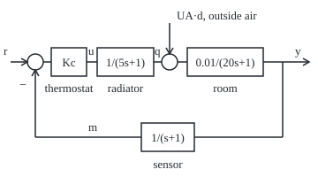
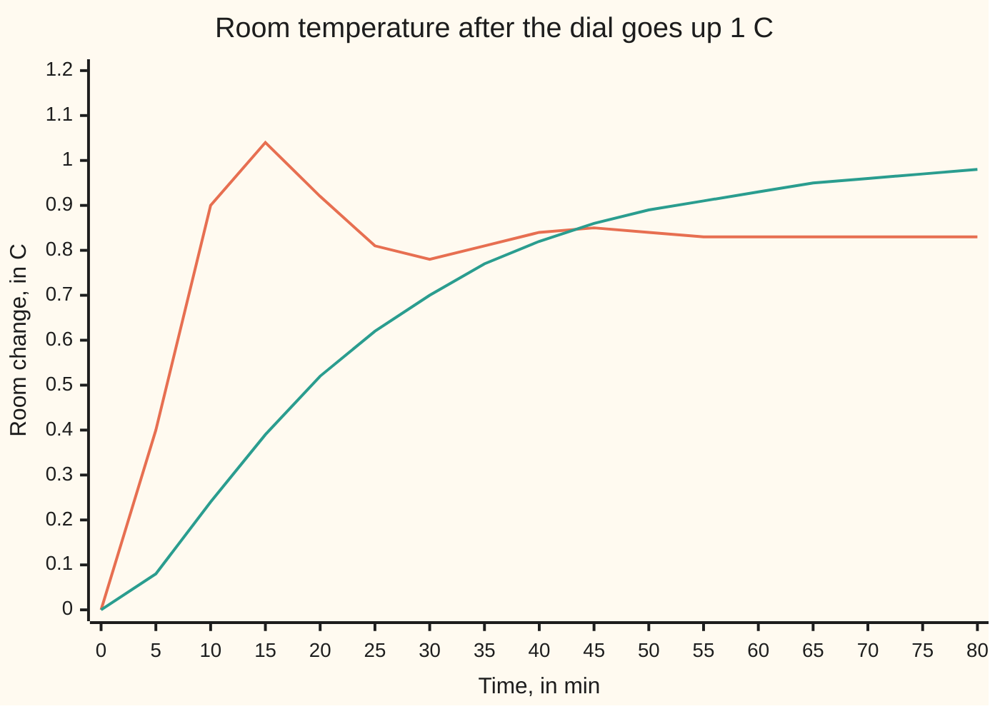
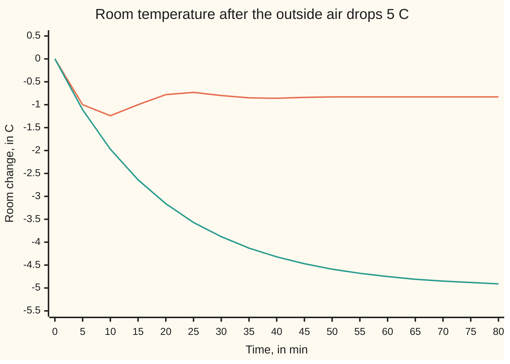

# Feedback: the closed loop is the open loop over one plus the open loop

[Syllabus](../../../SYLLABUS.md) → [Engineering mathematics](../../../SYLLABUS.md#w13) → [Feedback Control](../../../SYLLABUS.md#w13-s03) → Feedback

---

## General Overview

A room sits at 20 °C while it is 5 °C outside. A radiator feeds it 1500 W, exactly what leaks out through the walls, at 100 W for every degree of difference. Three things are slow. Hot water takes about 5 minutes to warm the radiator. The room's air and furniture, about 120 kJ of heat per degree, take about 20 minutes to warm up. The thermostat's own sensor takes about 1 minute to catch up with the air. The thermostat opens the valve in proportion to how cold it reads: 500 W for every degree below the setting. The valve is preset to give the 1500 W when the reading equals the setting (a fixed bias; [Steady-state error](03-steady-state-error-and-system-type.md) shows the offset a thermostat leaves without one).

The engineer wants three numbers. Turn the dial up 1 °C: where does the room settle, and how fast? A cold snap takes 5 °C off the outside air: how much colder does the room get? And how hard can the thermostat push before the room's swings stop dying out? Without the thermostat the cold snap costs the full 5 °C. With it, the room loses 0.8333 °C.

Each block, radiator, room and sensor, has its own transfer function, the multiplier it applies to each exponential signal. Chained round a loop, they feed back into themselves: the radiator heats the room, the room moves the reading, the reading moves the radiator. Block algebra turns that circle into one transfer function from the dial to the room. The going-round shows up as a single denominator, one plus the product of everything met once round the loop.

**Wrap a loop round a set of blocks and every signal reaches any other point through its own forward path divided by one plus the loop gain, the product of the blocks met once round the loop. The closed loop's poles are the zeros of that one-plus. So a large loop gain shrinks errors and disturbances by the same factor that, pushed too far, makes the loop swing without end.**

**What kind of fact this is:** a theorem of block algebra, proved on this card in Why it works. The room's three lags are a model, with its range stated in When it holds.

### The picture: radiator, room and sensor round one loop

The thermostat compares the setting with the reading; the error opens the valve; the radiator heats the room; the outside air pushes on the room as a second heat input; the sensor reads the room and feeds back with a minus sign. Schematic, not to scale.

<p align="center"></p>

---

## The formula

Notation first, in words. As on [Transfer functions](../02-Linear%20Systems%20and%20Transforms/02-impulse-response-and-transfer-functions.md), a transfer function is what a block does to each exponential e^(st), and a capital letter is the Laplace transform of the lower-case signal. New here: the **loop gain** $L(s)$, the product of every block met once round the loop, and the **closed-loop transfer function** $T(s) = L/(1+L)$, the title's "open loop over one plus the open loop". Time runs in minutes, the room's natural scale, so $s$ is in 1/min.

Every signal below is a change from the 20 °C, 5 °C, 1500 W operating point. The blocks are

$$C = K_c,\quad P_r(s) = \frac{1}{\tau_r s + 1},\quad P_m(s) = \frac{1/UA}{\tau_m s + 1},\quad H(s) = \frac{1}{\tau_s s + 1},\qquad L(s) = C\,P_r\,P_m\,H$$

and the loop closes with $e = r - m$. Then

$$Y(s) = \frac{C P_r P_m}{1 + L(s)}\,R(s) + \frac{UA\,P_m}{1 + L(s)}\,D(s), \qquad \frac{M(s)}{R(s)} = T(s) = \frac{L(s)}{1 + L(s)}$$

**Read it aloud:** the room's change is the forward path from the dial, over one plus the loop gain, times the dial's change, plus the outside air's path, over the same one plus the loop gain, times the outside change; seen at the sensor, the dial's path is the loop gain over one plus the loop gain.

| Symbol | Plain meaning | In our example | Push it up and the answer… |
| --- | --- | --- | --- |
| $r$, $R$ | change of the dial setting, and its transform | +1 °C | room rises in proportion |
| $y$, $Y$ | change of the room temperature | settles at +0.8333 °C | — |
| $d$, $D$ | change of the outside air temperature | −5 °C cold snap | room drops by d/(1+k) |
| $u$, $q$ | valve command and radiator heat, change in W | peaks 500 W (dial), 618 W (cold snap) | — |
| $m$, $e$ | thermostat reading, and the error $e = r - m$ | error settles at 0.1667 °C | — |
| $K_c$, $C$ | thermostat gain, the controller block | 500 W/K | smaller error, until the room swings |
| $\tau_r$, $\tau_m$, $\tau_s$, $UA$ | lags of radiator, room, sensor; heat lost per degree of inside-outside difference | 5, 20, 1 min; 100 W/K | lags: a slower, swingier loop |
| $s$, $j$, $\omega$ | Laplace variable in 1/min; the square root of −1 as engineers write it (the rest of the library writes i); angular frequency in rad/min | s = jω, ω = 0.1047 rad/min | — |
| $P_r$, $P_m$, $H$ | radiator, room and sensor transfer functions | 1/(5s+1), 0.01/(20s+1), 1/(s+1) | — |
| $L$, $k$, $G$ | loop gain, its value at s = 0; the forward path from error to room, $C P_r P_m$ | k = L(0) = 5 | errors shrink by 1 + k |
| $T$, $T_{yr}$, $T_{yd}$ | reading over dial; room over dial; room over outside air | 5/6, 5/6 and 1/6 at s = 0 | — |
| $n$, $\delta$ | numerator and denominator polynomials of $L$: the products of the blocks' numerators and of their denominators, multiplied out with nothing cancelled | n = 5, δ = (5s+1)(20s+1)(s+1) | — |
| $B_i$, $B_j$, $W$, $X$, $Z$, $F$, $n_F$, $\delta_F$ | in the folded proof: blocks of a general loop, an injected input, the signal where it enters, an output signal, the forward path to it, and that path's numerator and denominator | — | — |

The forward path from the dial to the room, $C P_r P_m$, at s = 0 is 500 × 1 × 0.01 = 5, the same as $k$ because the sensor reads true in the steady state. So $T_{yr}(0) = 5/6$ and $T_{yd}(0) = 1/6$.

### When it holds

- **Every block linear.** The radiator can give at most 2500 W, 1000 W above the operating point, and no less than nothing. Inside that range the formula is exact. A cold snap of 15 °C asks for more: the formula promises a 2.5000 °C drop, the room with a capped radiator falls 5.0000 °C.
- **Every block time-invariant.** Lags and losses fixed. An open window changes $UA$ and so every transfer function in the loop.
- **Blocks do not load each other.** The sensor reads the room without heating it, and the room does not slow the radiator. If one block draws on the next, the two must be modelled as one block first.
- **The loop is wired as drawn, with a minus sign.** A thermostat wired backwards puts $1 - L$ in the denominator, and the room runs away.
- **No time delay.** Each block here is a lag, which smears a change out. A pipe that holds the water back for a fixed time is a delay, $e^{-s\theta}$, which the loop handles far worse; that is [Time delays](10-smith-predictor-and-time-delays.md).

---

## Why it works

### Step 0: write one equation per block and one per junction, then solve them together

A loop looks circular: the reading depends on the room, which depends on the radiator, which depends on the reading. In transforms each block is a multiplication, so the circle is a set of linear equations. Solve them like any other set, and the circle disappears into one denominator.

### Step 1: blocks in series multiply, blocks in parallel add

From [Transfer functions](../02-Linear%20Systems%20and%20Transforms/02-impulse-response-and-transfer-functions.md), a chain of blocks has the product of their transfer functions. Blocks fed the same signal, with their outputs summed, add instead: the proportional-plus-integral thermostat of [Steady-state error](03-steady-state-error-and-system-type.md) is a gain and a running-total block side by side, so its transfer function is a gain plus a gain over s. The forward path from error to room is $G = C P_r P_m$. The return path is $H$. Their product is the loop gain:

L(s) = 500 × 1/(5s+1) × 0.01/(20s+1) × 1/(s+1) = 5 / ((5s+1)(20s+1)(s+1)).

The value $k = L(0) = 5$ says one degree of error, held steady, comes back round the loop as five degrees of correction.

### Step 2: solve the loop

Three equations: the junction, the sensor and the room.

- error: E = R − M;
- reading: M = H Y;
- room: Y = G E + UA P_m D.

Put the first two into the third: Y = G (R − H Y) + UA P_m D. Collect Y on the left:

Y (1 + G H) = G R + UA P_m D.

Divide by $1 + GH = 1 + L$. That is the formula. Every input reaches the room through its own path, $G$ for the dial and $UA\,P_m$ for the outside air, and both are divided by the same $1 + L$.

### Step 3: the reading over the dial is L over one plus L

Multiply the dial's term by $H$: M/R = GH/(1 + GH) = L/(1 + L). This is the title's formula, $T(s)$. With a sensor that reads true, $H = 1$, the room and the reading coincide and the room's own transfer function is $T$. Here the sensor lags, so the room's is $G/(1+L)$: the same denominator, a numerator one block shorter.

### Step 4: why gain shrinks error and disturbance

Hold the dial 1 °C up for good. At s = 0 the error is $E = R/(1 + L(0))$, so the reading ends 1/(1 + 5) = 0.1667 °C short. A 5 °C cold snap reaches the room as $UA\,P_m(0) = 1$ times 5 °C without the loop, and divided by 6 with it: 0.8333 °C. Each signal that enters the loop is answered by the loop pushing back, and the push is $L$ times what got through. What survives is one part in $1 + L$. [Sensitivity functions](02-sensitivity-and-the-gang-of-four.md) names that factor $1/(1+L)$ and follows it across frequency.

A proportional thermostat cannot reach a new setting exactly: beyond the preset 1500 W, the radiator's extra heat comes only from a standing error. Removing that error takes integral action, [Steady-state error](03-steady-state-error-and-system-type.md).

### Step 5: the closed-loop poles are the zeros of one plus L

Write $L = n/\delta$ with numerator $n = 5$ and denominator $\delta = (5s+1)(20s+1)(s+1) = 100 s^3 + 125 s^2 + 26 s + 1$. Then

1 + L = (δ + n)/δ, so the closed-loop denominator is δ + n = 100 s^3 + 125 s^2 + 26 s + 6.

Its roots are the closed-loop poles: −1.0578 and −0.0961 ± 0.2179j 1/min. The pair sets the room's behaviour. Its real part gives a decay time of 1/0.0961 = 10.41 min; its imaginary part a swing period of 2π/0.2179 = 28.83 min; the real part over the pair's distance from the origin, 0.0961/0.2381, is the damping ratio ζ (the fraction of critical damping, from shelf 02), 0.403. So the room overshoots: it peaks at 1.0426 °C after 14.35 min, above the 1 °C asked for, then settles at 0.8333 °C.

Raise $K_c$ and only the constant term of δ + n moves, $1 + k$. A cubic with all coefficients positive has all its roots in the left half-plane exactly when the middle product beats the outer one, 125 × 26 > 100 × (1 + k) ([Routh-Hurwitz](04-routh-hurwitz-criterion.md)). That fails at k = 31.5, a thermostat gain of 3150 W/K. For a product of three lags the bound on k is the sum of the lags times the sum of their reciprocals, minus one; the code computes it that way and checks it against the root finder.

### Step 6: the same formula along the frequency axis

Put s = jω. A setting that drifts in a 60-minute cycle (0.1047 rad/min) reaches the room with gain 0.9462 and a lag of 23.42°. A 20-minute cycle (0.3142 rad/min) reaches it with gain 0.6459 and a lag of 123.91°. The loop follows slow changes and lets fast ones go. How close $L(j\omega)$ comes to −1 decides how near the loop is to swinging, read off the plot in [Nyquist and margins](06-nyquist-criterion-and-stability-margins.md).

<details>
<summary>Detailed proof: any single loop, and the cancellation trap</summary>

**Any single loop.** Let a loop carry blocks $B_1, B_2, \dots$ in order, with one minus sign at a summing junction, so that $L = B_1 B_2 \cdots$, the product of all of them. Inject an input $W$ just before block $B_i$ and look at the signal $Z$ just after block $B_j$. Going forward from the injection point to $Z$ meets the blocks $B_i \cdots B_j$ (wrapping round past the junction if needed, picking up its minus sign); call that product $F$. Going on from $Z$ round to the injection point meets the rest, and the whole trip round is $L$. Call $X$ the signal just before $B_i$. It is the injected $W$ plus what arrives after one trip round the loop, and one trip multiplies $X$ by every block and by the minus sign: $-L X$. So $X = W - L X$, which gives $X = W/(1+L)$ and $Z = F X = F W/(1+L)$. Every input to every output: forward path over one plus loop. Step 2 is the case $Z = Y$ with $W = R$ before $C$, or $W = UA\,D$ before $P_m$.

**Poles are zeros of 1 + L.** Take $L = n/\delta$ with $n$ and $\delta$ the products of the blocks' numerators and denominators, before any cancelling, and $F = n_F/\delta_F$ formed the same way. The ratio is $F/(1+L) = n_F\,\delta/(\delta_F(\delta + n))$. Every block of $F$ is also a block of $L$, so $\delta_F$ divides $\delta$ and the ratio reduces to a polynomial over $\delta + n$. Its poles are among the roots of $\delta + n$: the zeros of $1 + L$, plus any root that $n$ and $\delta$ share.

**The trap.** If the controller has a zero exactly on a pole of the plant, that factor sits in both $n$ and $\delta$, so it is a root of $\delta + n$, a closed-loop pole. Reducing $L$ to lowest terms cancels it before $1 + L$ is formed. The closed loop from dial to room can then look stable while the cancelled pole survives in another path: from a disturbance entering just ahead of that plant block, to the room. If that pole is unstable, the hardware runs away while the formula looks fine. Checking every input-output pair at once is internal stability, on [Sensitivity functions](02-sensitivity-and-the-gang-of-four.md).

</details>

The same answer comes from a state-space model, with the controller's equation substituted into the plant's; that road is State space.

---

## Worked numbers, by hand

| Step | Arithmetic | Value |
| --- | --- | --- |
| room's heat capacity | τ_m × UA = 20 min × 60 s/min × 100 W/K | 120 kJ/K |
| loop gain at s = 0 | 500 W/K × 1 × 0.01 K/W × 1 | k = 5 |
| closed-loop denominator | (5s+1)(20s+1)(s+1) + 5 | 100 s^3 + 125 s^2 + 26 s + 6 |
| dial +1 °C, room for good | 5/(1 + 5) | 0.8333 °C |
| error left | 1/(1 + 5) | 0.1667 °C |
| cold snap −5 °C, room for good | −5/(1 + 5) | −0.8333 °C, not −5 °C |
| valve at the first instant | 500 W/K × 1 °C | 500 W, inside the 1000 W of headroom |
| stability bound | 125 × 26 / 100 − 1 | k = 31.5 |
| thermostat gain at the bound | 31.5 × 100 W/K | **3150 W/K** |

With 500 W/K the thermostat holds the room to within 0.1667 °C of a new setting and turns a 5 °C cold snap into a 0.8333 °C dip, while its gain stays well below the 3150 W/K at which the swings stop dying out.

### The picture: the dial turned up 1 °C



Orange: the closed loop, from residues at its three poles (residues: the weight each pole carries in the response), matched by simulation to four decimals. Green: no loop, the radiator set 100 W higher, which in the end is exactly enough for 1 °C. The loop passes its final value before the 10-minute mark (0.9047 °C at 10 min); without it the room is still short of 0.8333 °C at 40 minutes (0.8197 °C). The loop overshoots, and settles 0.1667 °C short.

### The picture: a 5 °C cold snap



Orange: the closed loop; the room dips to −1.2410 °C at 10 min and settles at −0.8333 °C. Green: no thermostat, the radiator left at 1500 W; the room falls on its own 20-minute clock towards −5 °C. The worst dip with the loop, −1.2410 °C, is far short of the −5 °C the unregulated room heads for.

### What breaks if you drop a piece

| Mistake | Comes out at | What went wrong |
| --- | --- | --- |
| Thermostat wired backwards | 1 − L in the denominator; pole at +0.1009 1/min; room +19.5 °C after 30 min (uncapped model; a radiator capped at 2500 W stops it at +10.0 °C, full open) | the loop reinforces the error instead of opposing it |
| Gain raised to 3500 W/K (k = 35) | swings of 2.590, 6.490, 16.047 °C in successive 100-min windows | past k = 31.5 the pole pair crosses into the right half-plane; in the uncapped model the swings grow without limit; a capped radiator holds them to a steady cycle, the room between 0.555 and 1.366 °C in both 250–500 and 500–750 min |
| Radiator capped, cold snap of 15 °C | room −5.0000 °C, not the formula's −2.5000 °C | the valve hits full open; the block is no longer linear |
| Sensor lag left out of the model | predicted peak 0.9625 °C, true 1.0426 °C | the steady state is the same, the dynamics are not |

The code prints all four.

---

## Code, from first principles, and it actually runs

The scripts import only `math` in Python and nothing beyond std in Rust; complex numbers in Rust are a small struct written out. They reach the closed loop by three independent roads. The first is block algebra: the closed-loop denominator, its roots by the Durand–Kerner iteration (which refines guesses for all roots of a polynomial at once), and the step responses by residues at those roots. The second is a fourth-order Runge–Kutta simulation (RK4, a standard step-by-step solver) of the radiator, room and sensor wired together, which never forms a transfer function. The third is the frequency response: the formula at s = jω against the simulated room driven by a sine-wave setting, projected onto sine and cosine over its last full cycle. Then the gain sweep, the stability bound from the coefficients against the root finder, and every row of the what-breaks table.

### Python

```python
# Feedback and closed-loop transfer functions -- the check behind the card.  Standard library only.
# A room heated by a radiator, read by a thermostat, round one loop.  Time in minutes, s in 1/min.
# Deviations from 20 C inside, 5 C outside, 1500 W of heat.  Blocks:
#   radiator 5 q' = -q + u (W), room 20 T' = -T + q/100 + d (C), sensor 1 m' = -m + T (C), u = Kc (r - m).
# Roads: block algebra and residues at the closed-loop poles; an RK4 simulation of the wired-up loop
# that never uses a transfer function; the frequency response against a sine-driven simulation.
import math

TR, TM, TS, UA, KC = 5.0, 20.0, 1.0, 100.0, 500.0   # lags min, loss W/K, thermostat gain W/K
DT, QLO, QHI = 0.01, -1500.0, 1000.0                # RK4 step min; radiator range 0..2500 W as a deviation

def poly_mul(a, b):                                  # product of two polynomials, highest power first
    out = [0.0] * (len(a) + len(b) - 1)
    for i, x in enumerate(a):
        for j, y in enumerate(b):
            out[i + j] += x * y
    return out
def peval(a, s):                                     # Horner's rule, real or complex s
    v = 0j
    for c in a:
        v = v * s + c
    return v
def roots(a, iters=500):                             # Durand-Kerner: all roots at once
    a = [c / a[0] for c in a]
    n = len(a) - 1
    r = [complex(0.4, 0.9) ** i for i in range(n)]
    for _ in range(iters):
        new = []
        for i, x in enumerate(r):
            den = 1 + 0j
            for j in range(n):
                if j != i:
                    den *= x - r[j]
            new.append(x - peval(a, x) / den)
        r = new
    return sorted(r, key=lambda z: (z.real, z.imag))

OPEN = poly_mul(poly_mul([TR, 1.0], [TM, 1.0]), [TS, 1.0])   # (5s+1)(20s+1)(s+1)
def char(k):                                         # closed-loop denominator: open-loop one plus k
    return OPEN[:-1] + [OPEN[-1] + k]

def L(s): return KC / (TR * s + 1) / UA / (TM * s + 1) / (TS * s + 1)   # loop: thermostat, radiator, room, sensor
def tyr(s): return KC / (TR * s + 1) / UA / (TM * s + 1) / (1 + L(s))   # setpoint to room: forward path over 1 + L
def tyd(s): return 1 / (TM * s + 1) / (1 + L(s))                        # outside air to room: its path over 1 + L

def step_by_residues(num, k, t):                     # inverse transform of num(s)/(s char(s))
    den = char(k)
    dd = [c * (len(den) - 1 - i) for i, c in enumerate(den[:-1])]
    y = peval(num, 0).real / den[-1]
    for p in roots(den):
        y += (peval(num, p) / (p * peval(dd, p)) * math.e ** (p * t)).real
    return y

def clean(v): return round(v, 9) + 0.0              # round off float dust so -0.0000 never prints

def loop(r, d, kc=KC, sat=False, sensor=True, sign=1.0):
    def f(t, x):
        q, temp, m = x
        u = kc * (r(t) - sign * (m if sensor else temp))
        u = min(QHI, max(QLO, u)) if sat else u
        f.peak = max(f.peak, abs(u))
        return [(u - q) / TR, (q / UA - temp + d(t)) / TM, (temp - m) / TS if sensor else 0.0]
    f.peak = 0.0
    return f

def run(f, t_end, x=(0.0, 0.0, 0.0)):                # RK4; returns room temperature at every step
    x, out = list(x), [x[1]]
    for i in range(round(t_end / DT)):
        t = i * DT
        k1 = f(t, x)
        k2 = f(t + DT / 2, [a + DT / 2 * b for a, b in zip(x, k1)])
        k3 = f(t + DT / 2, [a + DT / 2 * b for a, b in zip(x, k2)])
        k4 = f(t + DT, [a + DT * b for a, b in zip(x, k3)])
        x = [a + DT / 6 * (p + 2 * q + 2 * w + z) for a, p, q, w, z in zip(x, k1, k2, k3, k4)]
        out.append(x[1])
    return out

one, zero, cold = (lambda t: 1.0), (lambda t: 0.0), (lambda t: -5.0)
k = KC / UA
print(f"room: lags radiator {TR:.0f} min, room {TM:.0f} min (heat capacity {TM * 60 * UA / 1000:.0f} kJ/K), thermostat {TS:.0f} min; loss {UA:.0f} W/K; Kc {KC:.0f} W/K")
print(f"operating point: 20 C inside, 5 C outside, {UA * 15:.0f} W of heat; radiator range 0 to {UA * 15 + QHI:.0f} W")
print(f"loop gain L(s) = {k:.0f} / ((5s+1)(20s+1)(s+1)), s in 1/min; L(0) = {L(0).real:.0f}")
print(f"closed-loop denominator: {char(k)[0]:.0f} s^3 + {char(k)[1]:.0f} s^2 + {char(k)[2]:.0f} s + {char(k)[3]:.0f}")
p = roots(char(k))
print(f"closed-loop poles (1/min): {p[0].real:.4f} and {p[1].real:.4f} +/- {abs(p[1].imag):.4f}j")
print(f"dominant pair: decay time {-1 / p[1].real:.2f} min, swing period {2 * math.pi / abs(p[1].imag):.2f} min, damping ratio {-p[1].real / abs(p[1]):.3f}")
print(f"steady state: setpoint +1 C gives room {tyr(0).real:.4f} C, error {1 / (1 + k):.4f} C; outside 5 C colder gives room {-5 * tyd(0).real:.4f} C, open loop -5.0000 C")
fr, fd = loop(one, zero), loop(zero, cold)
yr, yd = run(fr, 400.0), run(fd, 400.0)
print(f"simulated at 400 min: setpoint +1 C -> {yr[-1]:.4f} C; outside 5 C colder -> {yd[-1]:.4f} C")
print(f"largest radiator demand: {fr.peak:.0f} W and {fd.peak:.0f} W, inside the {QHI:.0f} W of headroom")
print("t min | setpoint +1 C: residues | RK4 | heater +100 W, no loop | outside 5 C colder: residues | RK4 | no loop")
rows = []
for t in range(0, 81, 5):
    a, b = step_by_residues([k * TS, k], k, t), yr[round(t / DT)]
    c, e = -5 * step_by_residues(poly_mul([TR, 1.0], [TS, 1.0]), k, t), yd[round(t / DT)]
    o1, o2 = 1 - (TM * math.exp(-t / TM) - TR * math.exp(-t / TR)) / (TM - TR), -5 * (1 - math.exp(-t / TM))
    rows.append((a, b, o1, c, e, o2))
    print(f"{t:2d} | {clean(a):.4f} | {b:.4f} | {o1:.4f} | {clean(c):.4f} | {clean(e):.4f} | {clean(o2):.4f}")
for lab, i in (("setpoint +1 C, loop", 0), ("heater +100 W, no loop", 2), ("outside 5 C colder, loop", 3), ("outside 5 C colder, no loop", 5)):
    print(f"figure, {lab}, every 5 min: " + ", ".join(f"{clean(row[i]):.2f}" for row in rows))
fine = [step_by_residues([k * TS, k], k, i / 100) for i in range(4001)]
pk = max(range(4001), key=lambda i: fine[i])
print(f"setpoint +1 C peak: {fine[pk]:.4f} C at {pk / 100:.2f} min (residues), {max(yr):.4f} C (RK4)")
print("frequency response, setpoint to room: period | gain formula | gain from sine-driven RK4 | phase deg formula | RK4")
freq = []
for per in (60.0, 20.0):
    w = 2 * math.pi / per
    g = tyr(1j * w)
    y = run(loop(lambda t: math.sin(w * t), zero), 600.0)
    n, j0 = round(per / DT), len(y) - 1 - round(per / DT)    # project the last full cycle on sin and cos
    a = sum(y[j] * math.sin(w * j * DT) for j in range(j0, j0 + n)) * 2 / n
    b = sum(y[j] * math.cos(w * j * DT) for j in range(j0, j0 + n)) * 2 / n
    freq.append((abs(g), math.hypot(a, b), math.degrees(math.atan2(g.imag, g.real)), math.degrees(math.atan2(b, a))))
    print(f"{per:.0f} min ({w:.4f} rad/min) | {freq[-1][0]:.4f} | {freq[-1][1]:.4f} | {freq[-1][2]:.2f} | {freq[-1][3]:.2f}")
print("gain sweep: k = L(0) | steady error per 1 C | room drop for outside 5 C colder | largest pole real part 1/min")
crit = sum((TR, TM, TS)) * sum((1 / TR, 1 / TM, 1 / TS)) - 1
for kk in (1.0, 5.0, 10.0, 20.0, crit, 35.0):
    print(f"k = {kk:4.1f} | {1 / (1 + kk):.4f} C | {5 / (1 + kk):.4f} C | {clean(roots(char(kk))[-1].real):+.4f}")
print(f"critical loop gain from the coefficients: k = (sum of lags)(sum of 1/lags) - 1 = {crit:.1f}, Kc = {crit * UA:.0f} W/K")
pos, ypos, ycap = roots(char(-k))[-1].real, run(loop(one, zero, sign=-1.0), 30.0), run(loop(one, zero, sign=-1.0, sat=True), 600.0)
print(f"mistake 1, feedback sign flipped: 1+L becomes 1-L, L/(1-L) at s=0 reads {k / (1 - k):.2f}; pole +{pos:.4f} 1/min; room after 30 min {ypos[-1]:+.1f} C; radiator capped, after 600 min {ycap[-1]:+.1f} C, full open")
yhi, ycyc = run(loop(one, zero, kc=3500.0), 300.0), run(loop(one, zero, kc=3500.0, sat=True), 750.0)
sw = [max(abs(v - 35 / 36) for v in yhi[round(a / DT):round((a + 100) / DT)]) for a in (0.0, 100.0, 200.0)]
cy = [f(ycyc[round(a / DT):round((a + 250) / DT)]) for a in (250.0, 500.0) for f in (min, max)]   # capped: the swing in two later windows
print(f"mistake 2, Kc = 3500 W/K (k = 35): swing about {35 / 36:.4f} C, largest in 0-100, 100-200, 200-300 min: {sw[0]:.3f}, {sw[1]:.3f}, {sw[2]:.3f} C; radiator capped, room between {cy[0]:.3f} and {cy[1]:.3f} C in 250-500 min, {cy[2]:.3f} and {cy[3]:.3f} C in 500-750 min")
cold15 = lambda t: -15.0
lin, sat = run(loop(zero, cold15), 400.0), run(loop(zero, cold15, sat=True), 400.0)
hand = (1500.0 + QHI) / UA + (5.0 - 15.0) - 20.0     # radiator flat out: 100 (T + 10) = 2500 W
print(f"mistake 3, outside 15 C colder (-10 C), radiator capped at 2500 W: linear loop {lin[-1]:.4f} C, capped {sat[-1]:.4f} C, hand {hand:.4f} C")
nos = run(loop(one, zero, sensor=False), 400.0)
print(f"mistake 4, thermostat lag left out: peak {max(nos):.4f} C, true loop {max(yr):.4f} C; steady {nos[-1]:.4f} C both")
for a, b, _, c, e, _ in rows:                              # residues of the closed-loop ratio against the wired-up loop
    assert abs(a - b) < 1e-6 and abs(c - e) < 1e-6
assert abs(yr[-1] - KC / UA / (1 + KC / UA)) < 1e-6 and abs(yd[-1] + 5 / (1 + KC / UA)) < 1e-6
for g, gs, ph, phs in freq:                          # frequency response against sine-driven simulation
    assert abs(g - gs) < 1e-4 and abs(ph - phs) < 0.05
assert abs(roots(char(crit))[-1].real) < 1e-9 and roots(char(crit - 0.5))[-1].real < 0 < roots(char(crit + 0.5))[-1].real
assert abs(sat[-1] - hand) < 1e-3 and sw[2] > sw[1] > sw[0] and ypos[-1] > 10.0 and abs(ycap[-1] - QHI / UA) < 1e-3
print("ALL CHECKS PASS")
```

**Ran 2026-09-30 on macOS, Python 3.14.6, standard library only. All checks passed. Output, pasted from the run:**

```
room: lags radiator 5 min, room 20 min (heat capacity 120 kJ/K), thermostat 1 min; loss 100 W/K; Kc 500 W/K
operating point: 20 C inside, 5 C outside, 1500 W of heat; radiator range 0 to 2500 W
loop gain L(s) = 5 / ((5s+1)(20s+1)(s+1)), s in 1/min; L(0) = 5
closed-loop denominator: 100 s^3 + 125 s^2 + 26 s + 6
closed-loop poles (1/min): -1.0578 and -0.0961 +/- 0.2179j
dominant pair: decay time 10.41 min, swing period 28.83 min, damping ratio 0.403
steady state: setpoint +1 C gives room 0.8333 C, error 0.1667 C; outside 5 C colder gives room -0.8333 C, open loop -5.0000 C
simulated at 400 min: setpoint +1 C -> 0.8333 C; outside 5 C colder -> -0.8333 C
largest radiator demand: 500 W and 618 W, inside the 1000 W of headroom
t min | setpoint +1 C: residues | RK4 | heater +100 W, no loop | outside 5 C colder: residues | RK4 | no loop
 0 | 0.0000 | 0.0000 | 0.0000 | 0.0000 | 0.0000 | 0.0000
 5 | 0.3993 | 0.3993 | 0.0842 | -0.9965 | -0.9965 | -1.1060
10 | 0.9047 | 0.9047 | 0.2364 | -1.2410 | -1.2410 | -1.9673
15 | 1.0402 | 1.0402 | 0.3868 | -1.0043 | -1.0043 | -2.6382
20 | 0.9245 | 0.9245 | 0.5156 | -0.7753 | -0.7753 | -3.1606
25 | 0.8064 | 0.8064 | 0.6202 | -0.7347 | -0.7347 | -3.5675
30 | 0.7830 | 0.7830 | 0.7033 | -0.7991 | -0.7991 | -3.8843
35 | 0.8148 | 0.8148 | 0.7686 | -0.8515 | -0.8515 | -4.1311
40 | 0.8420 | 0.8420 | 0.8197 | -0.8568 | -0.8568 | -4.3233
45 | 0.8454 | 0.8454 | 0.8595 | -0.8398 | -0.8398 | -4.4730
50 | 0.8369 | 0.8369 | 0.8906 | -0.8281 | -0.8281 | -4.5896
55 | 0.8308 | 0.8308 | 0.9148 | -0.8278 | -0.8278 | -4.6804
60 | 0.8305 | 0.8305 | 0.9336 | -0.8322 | -0.8322 | -4.7511
65 | 0.8327 | 0.8327 | 0.9483 | -0.8348 | -0.8348 | -4.8061
70 | 0.8340 | 0.8340 | 0.9597 | -0.8346 | -0.8346 | -4.8490
75 | 0.8340 | 0.8340 | 0.9686 | -0.8335 | -0.8335 | -4.8824
80 | 0.8334 | 0.8334 | 0.9756 | -0.8329 | -0.8329 | -4.9084
figure, setpoint +1 C, loop, every 5 min: 0.00, 0.40, 0.90, 1.04, 0.92, 0.81, 0.78, 0.81, 0.84, 0.85, 0.84, 0.83, 0.83, 0.83, 0.83, 0.83, 0.83
figure, heater +100 W, no loop, every 5 min: 0.00, 0.08, 0.24, 0.39, 0.52, 0.62, 0.70, 0.77, 0.82, 0.86, 0.89, 0.91, 0.93, 0.95, 0.96, 0.97, 0.98
figure, outside 5 C colder, loop, every 5 min: 0.00, -1.00, -1.24, -1.00, -0.78, -0.73, -0.80, -0.85, -0.86, -0.84, -0.83, -0.83, -0.83, -0.83, -0.83, -0.83, -0.83
figure, outside 5 C colder, no loop, every 5 min: 0.00, -1.11, -1.97, -2.64, -3.16, -3.57, -3.88, -4.13, -4.32, -4.47, -4.59, -4.68, -4.75, -4.81, -4.85, -4.88, -4.91
setpoint +1 C peak: 1.0426 C at 14.35 min (residues), 1.0426 C (RK4)
frequency response, setpoint to room: period | gain formula | gain from sine-driven RK4 | phase deg formula | RK4
60 min (0.1047 rad/min) | 0.9462 | 0.9462 | -23.42 | -23.42
20 min (0.3142 rad/min) | 0.6459 | 0.6459 | -123.91 | -123.91
gain sweep: k = L(0) | steady error per 1 C | room drop for outside 5 C colder | largest pole real part 1/min
k =  1.0 | 0.5000 C | 2.5000 C | -0.1186
k =  5.0 | 0.1667 C | 0.8333 C | -0.0961
k = 10.0 | 0.0909 C | 0.4545 C | -0.0726
k = 20.0 | 0.0476 C | 0.2381 C | -0.0348
k = 31.5 | 0.0308 C | 0.1538 C | +0.0000
k = 35.0 | 0.0278 C | 0.1389 C | +0.0094
critical loop gain from the coefficients: k = (sum of lags)(sum of 1/lags) - 1 = 31.5, Kc = 3150 W/K
mistake 1, feedback sign flipped: 1+L becomes 1-L, L/(1-L) at s=0 reads -1.25; pole +0.1009 1/min; room after 30 min +19.5 C; radiator capped, after 600 min +10.0 C, full open
mistake 2, Kc = 3500 W/K (k = 35): swing about 0.9722 C, largest in 0-100, 100-200, 200-300 min: 2.590, 6.490, 16.047 C; radiator capped, room between 0.555 and 1.366 C in 250-500 min, 0.555 and 1.366 C in 500-750 min
mistake 3, outside 15 C colder (-10 C), radiator capped at 2500 W: linear loop -2.5000 C, capped -5.0000 C, hand -5.0000 C
mistake 4, thermostat lag left out: peak 0.9625 C, true loop 1.0426 C; steady 0.8333 C both
ALL CHECKS PASS
```

### Rust

Same numbers, same labels, built with `rustc --edition 2021 -O`.

```rust
// Feedback and closed-loop transfer functions -- the same check as the Python, in Rust.  No crates.
// A room heated by a radiator, read by a thermostat, round one loop.  Time in minutes, s in 1/min.
// Deviations from 20 C inside, 5 C outside, 1500 W of heat.  Blocks:
//   radiator 5 q' = -q + u (W), room 20 T' = -T + q/100 + d (C), sensor 1 m' = -m + T (C), u = Kc (r - m).
// Roads: block algebra and residues at the closed-loop poles; an RK4 simulation of the wired-up loop
// that never uses a transfer function; the frequency response against a sine-driven simulation.
use std::f64::consts::{E, PI};
use std::ops::{Add, Div, Mul, Sub};

const TR: f64 = 5.0; const TM: f64 = 20.0; const TS: f64 = 1.0; // lags, min
const UA: f64 = 100.0; const KC: f64 = 500.0; // heat loss W/K, thermostat gain W/K
const DT: f64 = 0.01; const QLO: f64 = -1500.0; const QHI: f64 = 1000.0; // RK4 step min; radiator 0..2500 W as a deviation

#[derive(Clone, Copy)]
struct C { re: f64, im: f64 } // a complex number, written out
fn c(re: f64, im: f64) -> C { C { re, im } }
impl Add for C { type Output = C; fn add(self, o: C) -> C { c(self.re + o.re, self.im + o.im) } }
impl Sub for C { type Output = C; fn sub(self, o: C) -> C { c(self.re - o.re, self.im - o.im) } }
impl Mul for C { type Output = C; fn mul(self, o: C) -> C { c(self.re * o.re - self.im * o.im, self.re * o.im + self.im * o.re) } }
impl Div for C { type Output = C; fn div(self, o: C) -> C { let d = o.re * o.re + o.im * o.im; c((self.re * o.re + self.im * o.im) / d, (self.im * o.re - self.re * o.im) / d) } }
impl C { fn abs(self) -> f64 { self.re.hypot(self.im) } fn exp(self) -> C { let l = E.powf(self.re); c(l * self.im.cos(), l * self.im.sin()) } }
fn r(x: f64) -> C { c(x, 0.0) }

fn poly_mul(a: &[f64], b: &[f64]) -> Vec<f64> { // product of two polynomials, highest power first
    let mut out = vec![0.0; a.len() + b.len() - 1];
    for (i, x) in a.iter().enumerate() { for (j, y) in b.iter().enumerate() { out[i + j] += x * y; } }
    out
}
fn peval(a: &[f64], s: C) -> C { a.iter().fold(c(0.0, 0.0), |v, &k| v * s + r(k)) } // Horner's rule

fn roots(a: &[f64]) -> Vec<C> { // Durand-Kerner: all roots at once
    let a: Vec<f64> = a.iter().map(|x| x / a[0]).collect();
    let n = a.len() - 1;
    let (mut z, mut w): (Vec<C>, C) = (Vec::new(), r(1.0));
    for _ in 0..n { z.push(w); w = w * c(0.4, 0.9); }
    for _ in 0..500 {
        let mut new = Vec::new();
        for i in 0..n {
            let mut den = r(1.0);
            for j in 0..n { if j != i { den = den * (z[i] - z[j]); } }
            new.push(z[i] - peval(&a, z[i]) / den);
        }
        z = new;
    }
    z.sort_by(|p, q| p.re.partial_cmp(&q.re).unwrap().then(p.im.partial_cmp(&q.im).unwrap()));
    z
}

fn open() -> Vec<f64> { poly_mul(&poly_mul(&[TR, 1.0], &[TM, 1.0]), &[TS, 1.0]) } // (5s+1)(20s+1)(s+1)
fn chr(k: f64) -> Vec<f64> { let mut o = open(); o[3] += k; o } // closed-loop denominator: open-loop one plus k

fn lg(s: C) -> C { r(KC) / (r(TR) * s + r(1.0)) / r(UA) / (r(TM) * s + r(1.0)) / (r(TS) * s + r(1.0)) } // loop
fn tyr(s: C) -> C { r(KC) / (r(TR) * s + r(1.0)) / r(UA) / (r(TM) * s + r(1.0)) / (r(1.0) + lg(s)) } // forward over 1 + L
fn tyd(s: C) -> C { r(1.0) / (r(TM) * s + r(1.0)) / (r(1.0) + lg(s)) } // outside air to room: its path over 1 + L

fn step_by_residues(num: &[f64], k: f64, t: f64) -> f64 { // inverse transform of num(s)/(s char(s))
    let den = chr(k);
    let dd: Vec<f64> = den[..den.len() - 1].iter().enumerate().map(|(i, x)| x * (den.len() - 1 - i) as f64).collect();
    let mut y = peval(num, r(0.0)).re / den[den.len() - 1];
    for p in roots(&den) { y += (peval(num, p) / (p * peval(&dd, p)) * (p * r(t)).exp()).re; }
    y
}

fn clean(v: f64) -> f64 { (v * 1e9).round() / 1e9 + 0.0 } // round off float dust so -0.0000 never prints

struct Loop<'a> { r: &'a dyn Fn(f64) -> f64, d: &'a dyn Fn(f64) -> f64, kc: f64, sat: bool, sensor: bool, sign: f64, peak: f64 }
impl<'a> Loop<'a> {
    fn new(r: &'a dyn Fn(f64) -> f64, d: &'a dyn Fn(f64) -> f64) -> Self { Loop { r, d, kc: KC, sat: false, sensor: true, sign: 1.0, peak: 0.0 } }
    fn f(&mut self, t: f64, x: &[f64]) -> [f64; 3] {
        let (q, temp, m) = (x[0], x[1], x[2]);
        let mut u = self.kc * ((self.r)(t) - self.sign * (if self.sensor { m } else { temp }));
        if self.sat { u = QHI.min(QLO.max(u)); }
        self.peak = self.peak.max(u.abs());
        [(u - q) / TR, (q / UA - temp + (self.d)(t)) / TM, if self.sensor { (temp - m) / TS } else { 0.0 }]
    }
    fn run(&mut self, t_end: f64) -> Vec<f64> { // RK4; returns room temperature at every step
        let mut x = [0.0; 3];
        let mut out = vec![x[1]];
        let ax = |x: &[f64; 3], h: f64, k: &[f64; 3]| [x[0] + h * k[0], x[1] + h * k[1], x[2] + h * k[2]];
        for i in 0..(t_end / DT).round() as usize {
            let t = i as f64 * DT;
            let k1 = self.f(t, &x);
            let k2 = self.f(t + DT / 2.0, &ax(&x, DT / 2.0, &k1));
            let k3 = self.f(t + DT / 2.0, &ax(&x, DT / 2.0, &k2));
            let k4 = self.f(t + DT, &ax(&x, DT, &k3));
            for j in 0..3 { x[j] = x[j] + DT / 6.0 * (k1[j] + 2.0 * k2[j] + 2.0 * k3[j] + k4[j]); }
            out.push(x[1]);
        }
        out
    }
}
fn idx(t: f64) -> usize { (t / DT).round() as usize }
fn vmax(v: &[f64]) -> f64 { v.iter().cloned().fold(f64::MIN, f64::max) }

fn main() {
    let (one, zero, cold) = (|_t: f64| 1.0, |_t: f64| 0.0, |_t: f64| -5.0);
    let k = KC / UA;
    println!("room: lags radiator {:.0} min, room {:.0} min (heat capacity {:.0} kJ/K), thermostat {:.0} min; loss {:.0} W/K; Kc {:.0} W/K", TR, TM, TM * 60.0 * UA / 1000.0, TS, UA, KC);
    println!("operating point: 20 C inside, 5 C outside, {:.0} W of heat; radiator range 0 to {:.0} W", UA * 15.0, UA * 15.0 + QHI);
    let ch = chr(k);
    println!("loop gain L(s) = {:.0} / ((5s+1)(20s+1)(s+1)), s in 1/min; L(0) = {:.0}", k, lg(r(0.0)).re);
    println!("closed-loop denominator: {:.0} s^3 + {:.0} s^2 + {:.0} s + {:.0}", ch[0], ch[1], ch[2], ch[3]);
    let p = roots(&ch);
    println!("closed-loop poles (1/min): {:.4} and {:.4} +/- {:.4}j", p[0].re, p[1].re, p[1].im.abs());
    println!("dominant pair: decay time {:.2} min, swing period {:.2} min, damping ratio {:.3}", -1.0 / p[1].re, 2.0 * PI / p[1].im.abs(), -p[1].re / p[1].abs());
    println!("steady state: setpoint +1 C gives room {:.4} C, error {:.4} C; outside 5 C colder gives room {:.4} C, open loop -5.0000 C", tyr(r(0.0)).re, 1.0 / (1.0 + k), -5.0 * tyd(r(0.0)).re);
    let (mut fr, mut fd) = (Loop::new(&one, &zero), Loop::new(&zero, &cold));
    let (yr, yd) = (fr.run(400.0), fd.run(400.0));
    println!("simulated at 400 min: setpoint +1 C -> {:.4} C; outside 5 C colder -> {:.4} C", yr[yr.len() - 1], yd[yd.len() - 1]);
    println!("largest radiator demand: {:.0} W and {:.0} W, inside the {:.0} W of headroom", fr.peak, fd.peak, QHI);
    println!("t min | setpoint +1 C: residues | RK4 | heater +100 W, no loop | outside 5 C colder: residues | RK4 | no loop");
    let mut rows = Vec::new();
    for ti in (0..=80).step_by(5) {
        let t = ti as f64;
        let (a, b) = (step_by_residues(&[k * TS, k], k, t), yr[idx(t)]);
        let (cc, e) = (-5.0 * step_by_residues(&poly_mul(&[TR, 1.0], &[TS, 1.0]), k, t), yd[idx(t)]);
        let (o1, o2) = (1.0 - (TM * (-t / TM).exp() - TR * (-t / TR).exp()) / (TM - TR), -5.0 * (1.0 - (-t / TM).exp()));
        rows.push([a, b, o1, cc, e, o2]);
        println!("{:2} | {:.4} | {:.4} | {:.4} | {:.4} | {:.4} | {:.4}", ti, clean(a), b, o1, clean(cc), clean(e), clean(o2));
    }
    for (lab, i) in [("setpoint +1 C, loop", 0), ("heater +100 W, no loop", 2), ("outside 5 C colder, loop", 3), ("outside 5 C colder, no loop", 5)] {
        let pts: Vec<String> = rows.iter().map(|row| format!("{:.2}", clean(row[i]))).collect();
        println!("figure, {}, every 5 min: {}", lab, pts.join(", "));
    }
    let fine: Vec<f64> = (0..=4000).map(|i| step_by_residues(&[k * TS, k], k, i as f64 / 100.0)).collect();
    let pk = (0..fine.len()).fold(0, |b, i| if fine[i] > fine[b] { i } else { b }); // first maximum
    println!("setpoint +1 C peak: {:.4} C at {:.2} min (residues), {:.4} C (RK4)", fine[pk], pk as f64 / 100.0, vmax(&yr));
    println!("frequency response, setpoint to room: period | gain formula | gain from sine-driven RK4 | phase deg formula | RK4");
    let mut freq = Vec::new();
    for per in [60.0, 20.0] {
        let w = 2.0 * PI / per;
        let g = tyr(c(0.0, w));
        let sine = move |t: f64| (w * t).sin();
        let y = Loop::new(&sine, &zero).run(600.0);
        let (n, j0) = (idx(per), y.len() - 1 - idx(per)); // project the last full cycle on sin and cos
        let a = (j0..j0 + n).fold(0.0, |s, j| s + y[j] * (w * j as f64 * DT).sin()) * 2.0 / n as f64;
        let b = (j0..j0 + n).fold(0.0, |s, j| s + y[j] * (w * j as f64 * DT).cos()) * 2.0 / n as f64;
        let row = (g.abs(), a.hypot(b), g.im.atan2(g.re).to_degrees(), b.atan2(a).to_degrees());
        println!("{:.0} min ({:.4} rad/min) | {:.4} | {:.4} | {:.2} | {:.2}", per, w, row.0, row.1, row.2, row.3);
        freq.push(row);
    }
    println!("gain sweep: k = L(0) | steady error per 1 C | room drop for outside 5 C colder | largest pole real part 1/min");
    let crit = (TR + TM + TS) * (1.0 / TR + 1.0 / TM + 1.0 / TS) - 1.0;
    let top = |kk: f64| roots(&chr(kk))[2].re;
    for kk in [1.0, 5.0, 10.0, 20.0, crit, 35.0] {
        println!("k = {:4.1} | {:.4} C | {:.4} C | {:+.4}", kk, 1.0 / (1.0 + kk), 5.0 / (1.0 + kk), clean(top(kk)));
    }
    println!("critical loop gain from the coefficients: k = (sum of lags)(sum of 1/lags) - 1 = {:.1}, Kc = {:.0} W/K", crit, crit * UA);
    let pos = top(-k);
    let (ypos, ycap) = (Loop { sign: -1.0, ..Loop::new(&one, &zero) }.run(30.0), Loop { sign: -1.0, sat: true, ..Loop::new(&one, &zero) }.run(600.0));
    println!("mistake 1, feedback sign flipped: 1+L becomes 1-L, L/(1-L) at s=0 reads {:.2}; pole +{:.4} 1/min; room after 30 min {:+.1} C; radiator capped, after 600 min {:+.1} C, full open", k / (1.0 - k), pos, ypos[ypos.len() - 1], ycap[ycap.len() - 1]);
    let (yhi, ycyc) = (Loop { kc: 3500.0, ..Loop::new(&one, &zero) }.run(300.0), Loop { kc: 3500.0, sat: true, ..Loop::new(&one, &zero) }.run(750.0));
    let sw: Vec<f64> = [0.0, 100.0, 200.0].iter().map(|&a| yhi[idx(a)..idx(a + 100.0)].iter().fold(0.0_f64, |m, v| m.max((v - 35.0 / 36.0).abs()))).collect();
    let cy: Vec<f64> = [250.0, 500.0].iter().flat_map(|&a| { let v = &ycyc[idx(a)..idx(a + 250.0)]; [v.iter().cloned().fold(f64::MAX, f64::min), vmax(v)] }).collect(); // capped: the swing in two later windows
    println!("mistake 2, Kc = 3500 W/K (k = 35): swing about {:.4} C, largest in 0-100, 100-200, 200-300 min: {:.3}, {:.3}, {:.3} C; radiator capped, room between {:.3} and {:.3} C in 250-500 min, {:.3} and {:.3} C in 500-750 min", 35.0 / 36.0, sw[0], sw[1], sw[2], cy[0], cy[1], cy[2], cy[3]);
    let cold15 = |_t: f64| -15.0;
    let lin = Loop::new(&zero, &cold15).run(400.0);
    let sat = Loop { sat: true, ..Loop::new(&zero, &cold15) }.run(400.0);
    let hand = (1500.0 + QHI) / UA + (5.0 - 15.0) - 20.0; // radiator flat out: 100 (T + 10) = 2500 W
    println!("mistake 3, outside 15 C colder (-10 C), radiator capped at 2500 W: linear loop {:.4} C, capped {:.4} C, hand {:.4} C", lin[lin.len() - 1], sat[sat.len() - 1], hand);
    let nos = Loop { sensor: false, ..Loop::new(&one, &zero) }.run(400.0);
    println!("mistake 4, thermostat lag left out: peak {:.4} C, true loop {:.4} C; steady {:.4} C both", vmax(&nos), vmax(&yr), nos[nos.len() - 1]);
    for row in &rows { assert!((row[0] - row[1]).abs() < 1e-6 && (row[3] - row[4]).abs() < 1e-6); } // residues against the wired-up loop
    assert!((yr[yr.len() - 1] - k / (1.0 + k)).abs() < 1e-6 && (yd[yd.len() - 1] + 5.0 / (1.0 + k)).abs() < 1e-6);
    for &(g, gs, ph, phs) in &freq { assert!((g - gs).abs() < 1e-4 && (ph - phs).abs() < 0.05); } // against sine-driven simulation
    assert!(top(crit).abs() < 1e-9 && top(crit - 0.5) < 0.0 && 0.0 < top(crit + 0.5));
    assert!((sat[sat.len() - 1] - hand).abs() < 1e-3 && sw[2] > sw[1] && sw[1] > sw[0] && ypos[ypos.len() - 1] > 10.0 && (ycap[ycap.len() - 1] - QHI / UA).abs() < 1e-3);
    println!("ALL CHECKS PASS");
}
```

**Ran 2026-09-30 on macOS, rustc 1.98.1, no crates. All checks passed. Output, pasted from the run:**

```
room: lags radiator 5 min, room 20 min (heat capacity 120 kJ/K), thermostat 1 min; loss 100 W/K; Kc 500 W/K
operating point: 20 C inside, 5 C outside, 1500 W of heat; radiator range 0 to 2500 W
loop gain L(s) = 5 / ((5s+1)(20s+1)(s+1)), s in 1/min; L(0) = 5
closed-loop denominator: 100 s^3 + 125 s^2 + 26 s + 6
closed-loop poles (1/min): -1.0578 and -0.0961 +/- 0.2179j
dominant pair: decay time 10.41 min, swing period 28.83 min, damping ratio 0.403
steady state: setpoint +1 C gives room 0.8333 C, error 0.1667 C; outside 5 C colder gives room -0.8333 C, open loop -5.0000 C
simulated at 400 min: setpoint +1 C -> 0.8333 C; outside 5 C colder -> -0.8333 C
largest radiator demand: 500 W and 618 W, inside the 1000 W of headroom
t min | setpoint +1 C: residues | RK4 | heater +100 W, no loop | outside 5 C colder: residues | RK4 | no loop
 0 | 0.0000 | 0.0000 | 0.0000 | 0.0000 | 0.0000 | 0.0000
 5 | 0.3993 | 0.3993 | 0.0842 | -0.9965 | -0.9965 | -1.1060
10 | 0.9047 | 0.9047 | 0.2364 | -1.2410 | -1.2410 | -1.9673
15 | 1.0402 | 1.0402 | 0.3868 | -1.0043 | -1.0043 | -2.6382
20 | 0.9245 | 0.9245 | 0.5156 | -0.7753 | -0.7753 | -3.1606
25 | 0.8064 | 0.8064 | 0.6202 | -0.7347 | -0.7347 | -3.5675
30 | 0.7830 | 0.7830 | 0.7033 | -0.7991 | -0.7991 | -3.8843
35 | 0.8148 | 0.8148 | 0.7686 | -0.8515 | -0.8515 | -4.1311
40 | 0.8420 | 0.8420 | 0.8197 | -0.8568 | -0.8568 | -4.3233
45 | 0.8454 | 0.8454 | 0.8595 | -0.8398 | -0.8398 | -4.4730
50 | 0.8369 | 0.8369 | 0.8906 | -0.8281 | -0.8281 | -4.5896
55 | 0.8308 | 0.8308 | 0.9148 | -0.8278 | -0.8278 | -4.6804
60 | 0.8305 | 0.8305 | 0.9336 | -0.8322 | -0.8322 | -4.7511
65 | 0.8327 | 0.8327 | 0.9483 | -0.8348 | -0.8348 | -4.8061
70 | 0.8340 | 0.8340 | 0.9597 | -0.8346 | -0.8346 | -4.8490
75 | 0.8340 | 0.8340 | 0.9686 | -0.8335 | -0.8335 | -4.8824
80 | 0.8334 | 0.8334 | 0.9756 | -0.8329 | -0.8329 | -4.9084
figure, setpoint +1 C, loop, every 5 min: 0.00, 0.40, 0.90, 1.04, 0.92, 0.81, 0.78, 0.81, 0.84, 0.85, 0.84, 0.83, 0.83, 0.83, 0.83, 0.83, 0.83
figure, heater +100 W, no loop, every 5 min: 0.00, 0.08, 0.24, 0.39, 0.52, 0.62, 0.70, 0.77, 0.82, 0.86, 0.89, 0.91, 0.93, 0.95, 0.96, 0.97, 0.98
figure, outside 5 C colder, loop, every 5 min: 0.00, -1.00, -1.24, -1.00, -0.78, -0.73, -0.80, -0.85, -0.86, -0.84, -0.83, -0.83, -0.83, -0.83, -0.83, -0.83, -0.83
figure, outside 5 C colder, no loop, every 5 min: 0.00, -1.11, -1.97, -2.64, -3.16, -3.57, -3.88, -4.13, -4.32, -4.47, -4.59, -4.68, -4.75, -4.81, -4.85, -4.88, -4.91
setpoint +1 C peak: 1.0426 C at 14.35 min (residues), 1.0426 C (RK4)
frequency response, setpoint to room: period | gain formula | gain from sine-driven RK4 | phase deg formula | RK4
60 min (0.1047 rad/min) | 0.9462 | 0.9462 | -23.42 | -23.42
20 min (0.3142 rad/min) | 0.6459 | 0.6459 | -123.91 | -123.91
gain sweep: k = L(0) | steady error per 1 C | room drop for outside 5 C colder | largest pole real part 1/min
k =  1.0 | 0.5000 C | 2.5000 C | -0.1186
k =  5.0 | 0.1667 C | 0.8333 C | -0.0961
k = 10.0 | 0.0909 C | 0.4545 C | -0.0726
k = 20.0 | 0.0476 C | 0.2381 C | -0.0348
k = 31.5 | 0.0308 C | 0.1538 C | +0.0000
k = 35.0 | 0.0278 C | 0.1389 C | +0.0094
critical loop gain from the coefficients: k = (sum of lags)(sum of 1/lags) - 1 = 31.5, Kc = 3150 W/K
mistake 1, feedback sign flipped: 1+L becomes 1-L, L/(1-L) at s=0 reads -1.25; pole +0.1009 1/min; room after 30 min +19.5 C; radiator capped, after 600 min +10.0 C, full open
mistake 2, Kc = 3500 W/K (k = 35): swing about 0.9722 C, largest in 0-100, 100-200, 200-300 min: 2.590, 6.490, 16.047 C; radiator capped, room between 0.555 and 1.366 C in 250-500 min, 0.555 and 1.366 C in 500-750 min
mistake 3, outside 15 C colder (-10 C), radiator capped at 2500 W: linear loop -2.5000 C, capped -5.0000 C, hand -5.0000 C
mistake 4, thermostat lag left out: peak 0.9625 C, true loop 1.0426 C; steady 0.8333 C both
ALL CHECKS PASS
```

The two outputs match line for line.

> [!TIP]
> **Try changing**
> Guess first, then run it.
> - **Double the thermostat gain.** Set `KC` to `1000.0`. The error falls from 0.1667 °C to 0.0909 °C, not to half: 1 + k goes from 6 to 11. The peak climbs to 1.3457 °C at 10.13 min, and the first valve command is 1000 W, the whole headroom. Every assert still passes.
> - **A sluggish sensor.** Set `TS` to `3.0`. The steady numbers do not move, but the stability bound falls from k = 31.5 to 15.3 (1533 W/K), and the peak rises to 1.2231 °C. Lag anywhere in the loop eats into the gain the loop can carry.
> - **Close to the edge.** Set `KC` to `3000.0`. The pole pair's decay time stretches to 240.23 min. The steady-state assert stops the run: after 400 minutes the room is still swinging.
> - **Flip the sign in the formula.** Change `(1 + L(s))` in `tyr` to `(1 - L(s))`. The frequency-response assert fails: the formula no longer describes the loop the simulation wires up.

---

## The usual mistake

> [!warning]
> **Treating loop gain as free.** The factor $1/(1+L)$ makes high gain look like pure gain: at k = 20 the error is 0.0476 °C and the cold snap costs 0.2381 °C. But the same $L$ sits in the denominator whose roots are the poles. Each step up in gain pulls the pole pair closer to the imaginary axis, −0.0961 at k = 5, −0.0348 at k = 20, and past k = 31.5 the room swings ever wider. The gain that buys accuracy is spent from the same budget as stability.
>
> - **Wiring the thermostat backwards.** A plus sign at the junction makes $1 - L$: the formula gives −1.25 for the steady room change, and the room runs off at the rate of the pole at +0.1009 1/min.
> - **Using the open loop for the closed loop.** $L(0) = 5$ is the correction per degree of error, not the room's response; the room's response to the dial at s = 0 is 5/6.
> - **Expecting the setting to be reached.** A proportional thermostat leaves a standing error of 1/(1 + k), here 0.1667 °C.
> - **Putting the sensor in the forward path.** The sensor sits in the return path, so the room's transfer function has the sensor in $L$ but not in its numerator; the reading's transfer function has it in both.

---

## Where you meet it in real life

- **Room and building heating.** Every thermostat, radiator valve and boiler loop. The house is slow, the sensor sits on a wall, and the tuning of the gain against the lags is [PID control](07-pid-control-and-tuning.md).
- **Feedback amplifiers.** Harold Black's feedback amplifier wraps an amplifier of gain A in a resistor network that feeds back a fraction β. The closed-loop gain A/(1 + Aβ) is close to 1/β when Aβ is large, so it is set by stable resistors rather than by the drifting vacuum tubes; every operational-amplifier circuit uses the same formula.
- **Cruise control.** The car of [Transfer functions](../02-Linear%20Systems%20and%20Transforms/02-impulse-response-and-transfer-functions.md) with a controller round it: a hill is a disturbance, cut by one plus the loop gain.
- **Valves that hit their stops.** When the actuator saturates, the linear formula stops applying, and an integrating controller winds up; that is [PID in practice](08-pid-on-real-hardware.md).
- **Loops with dead time.** A shower whose hot water takes seconds to arrive is a loop with a delay, where the gain must be much lower: [Time delays](10-smith-predictor-and-time-delays.md).

> **Say it back**
> Each block in a loop multiplies; the product once round the loop is the loop gain L. Writing one equation per junction and solving gives every output as its forward path over one plus L, and the reading over the setting as L over one plus L. With L(0) = 5 the room settles at 5/6 of a new setting and a 5 °C cold snap costs 0.8333 °C instead of 5 °C. The closed-loop poles are the zeros of one plus L, here −1.0578 and −0.0961 ± 0.2179j 1/min. More gain shrinks errors further but pulls those poles towards the axis, and past k = 31.5 the room swings ever wider.

---

## What this builds on

- [Transfer functions](../02-Linear%20Systems%20and%20Transforms/02-impulse-response-and-transfer-functions.md): what a transfer function is, and why blocks in series multiply.

## Where this goes next

- [Sensitivity functions](02-sensitivity-and-the-gang-of-four.md): the factor 1/(1 + L) named and followed across frequency, with sensor noise as the price of high gain.
- [Steady-state error](03-steady-state-error-and-system-type.md): why a proportional loop stays short, here 0.1667 °C on a 1 °C change, and what removes the gap. Its thermostat has no preset, so there the step the loop must hold is the whole inside-outside difference, not only a change of setting.
- [Routh-Hurwitz](04-routh-hurwitz-criterion.md): the test on the coefficients of 1 + L that gave k = 31.5, for any order.
- [Nyquist and margins](06-nyquist-criterion-and-stability-margins.md): stability read from L(jω) alone, as margins an engineer can measure.

The formula says how much a loop shrinks a disturbance at each frequency, but not what that costs in sensor noise and robustness; [Sensitivity functions](02-sensitivity-and-the-gang-of-four.md) answers that.

---

## Sources

Verified 6 Oct 2026: every link below opens the cited work; the DOI checked against Crossref.

- Åström, Karl Johan, and Richard M. Murray. *Feedback Systems: An Introduction for Scientists and Engineers*, 2nd ed. Princeton University Press, 2021. [Authors' site, with the full text by the publisher's leave](https://fbswiki.org/wiki/index.php/Feedback_Systems:_An_Introduction_for_Scientists_and_Engineers). Block diagram algebra, the loop transfer function, and closed-loop poles as the zeros of 1 + L.
- Black, H. S. "Stabilized Feedback Amplifiers." *Bell System Technical Journal* 13(1), 1934, pp. 1–18. [DOI 10.1002/j.1538-7305.1934.tb00652.x](https://doi.org/10.1002/j.1538-7305.1934.tb00652.x). The paper that put negative feedback to work: gain traded for accuracy, with the closed-loop gain set by the feedback network.
- Doyle, John C., Bruce A. Francis, and Allen R. Tannenbaum. *Feedback Control Theory*. Macmillan, 1990. [Full text, hosted by the University of Toronto](https://www.control.utoronto.ca/people/profs/francis/dft.pdf). The standard single loop, every closed-loop transfer function at once, and internal stability.
- Dawson, Joel, Kent Lundberg, and James Roberge. *6.302 Feedback Systems*, MIT OpenCourseWare, Spring 2007. [Course page](https://ocw.mit.edu/courses/6-302-feedback-systems-spring-2007/). The properties and advantages of feedback, stability and its degree, and feedback round operational amplifiers.
