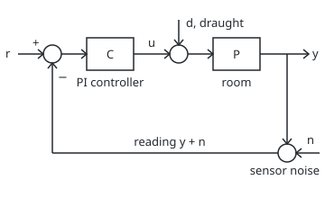
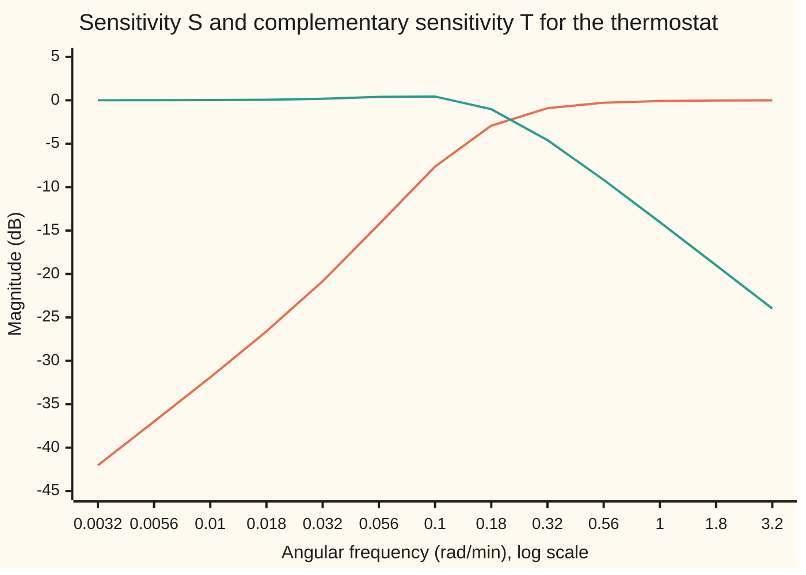
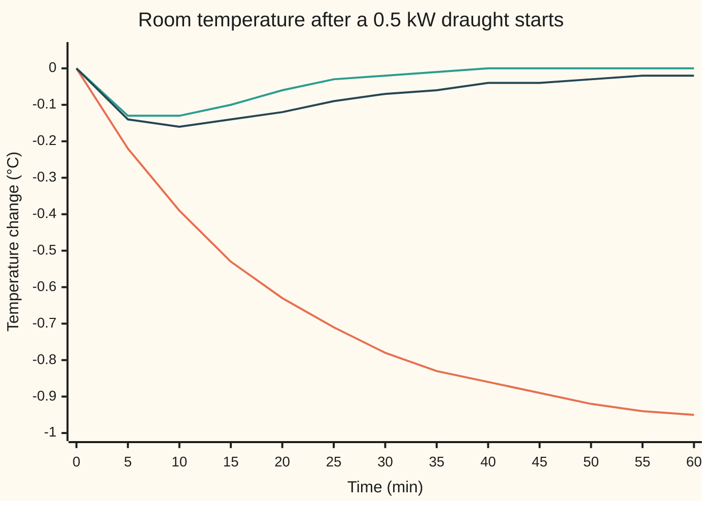

# Sensitivity functions: one loop has four paths and all four matter

[Syllabus](../../../SYLLABUS.md) → [Engineering mathematics](../README.md) → [Feedback Control](../README.md#s03) → Sensitivity functions

---

## General Overview

A room is held at 20 °C by a thermostat that drives a 3 kW heater. Three things push on the loop. The occupant turns the setpoint up. A window opens and a draught takes 0.5 kW of heat out of the room. The temperature sensor is noisy: each reading wanders about 0.1 °C around the truth, with a fresh error every 0.1 min.

The engineer wants three numbers. How far does the room dip when the draught starts, and for how long? How hard does the heater jitter because of the sensor's noise? And does the room follow a new setpoint without overshooting? One controller answers all three, and it cannot make all three answers good at once.

Left alone, the draught would cool this room by 1.00 °C. Under the thermostat it dips 0.1409 °C, at its worst 7.36 minutes after the window opens, and is gone within 45 minutes. The price: the sensor's noise shakes the heater by 0.2007 kW, root mean square (the typical size of a jitter). Each input reaches each output through its own path. A feedback loop with one controller has four distinct paths, and checking only the setpoint path hides the other three.

### The picture: the loop and where each input enters

<p align="center"></p>

Schematic, not to scale. The setpoint $r$ enters at the left. The controller turns the error into heater power $u$. The draught $d$ adds to the heater's power as heat lost (a negative number of kilowatts). The room turns net power into temperature $y$. The sensor adds its noise $n$, and the reading $y + n$ is fed back and subtracted from the setpoint.

**A loop with one controller and one plant has four closed-loop transfer functions, the sensitivity S, the complementary sensitivity T, the load sensitivity PS and the noise sensitivity CS; every input reaches every output through one of them, and S + T = 1 at every frequency, so the loop cannot make all four small at once.**

**What kind of fact this is:** a definition (four named transfer functions), plus one identity, S + T = 1, proved on this card in Why it works.

---

## The formula

Notation first, in words. The **loop gain** $L(s)$ is the transfer function once round the loop, controller then room: $L = PC$. A transfer function says what a system does to each exponential $e^{st}$ ([Transfer functions](../02-Linear%20Systems%20and%20Transforms/02-impulse-response-and-transfer-functions.md)). The **sensitivity** $S(s)$ is $1/(1+L)$: how much of a disturbance at the output survives the loop. The **complementary sensitivity** $T(s)$ is $L/(1+L)$: how much of the setpoint, and of the sensor's noise, reaches the room. Engineers write $j$ for the square root of −1; the rest of the library writes i.

The room and the thermostat, with time in minutes, temperature in °C and power in kW:

$$P(s) = \frac{K}{\tau s + 1}, \qquad C(s) = K_p + \frac{K_i}{s}$$

$K$ is the room's settled warming per kilowatt and $\tau$ its time constant, the minutes it takes to cover about two-thirds of a change. The controller is proportional-plus-integral (PI): $K_p$ kilowatts for each degree of error now, plus $K_i$ kilowatts for each degree-minute of error built up. Tuning those two numbers is the job of [PID control](07-pid-control-and-tuning.md); here only the controller's transfer function matters.

Every output, the room $y$, the heater $u$ and the error $e = r - y$, is a sum of three paths, one per input:

$$y = T\,r + PS\,d - T\,n, \qquad u = CS\,r - T\,d - CS\,n, \qquad e = S\,r - PS\,d + T\,n$$

with the **gang of four**

$$S = \frac{1}{1+PC}, \qquad T = \frac{PC}{1+PC}, \qquad PS = \frac{P}{1+PC}, \qquad CS = \frac{C}{1+PC}, \qquad S + T = 1.$$

**Read it aloud:** the setpoint reaches the room through T, the draught reaches the room through PS, the sensor's noise reaches the heater through CS and the room through T, and the sensitivity S plus the complementary sensitivity T is exactly one.

| Symbol | Plain meaning | In our example | Push it up and the answer… |
| --- | --- | --- | --- |
| $s$, $j$, $\omega$ | the Laplace variable; the square root of −1; angular frequency in rad/min, with $s = j\omega$ for a steady wobble | rad/min, since the room's clock is minutes | — |
| $P(s)$, $K$, $\tau$ | the room: steady gain in °C per kW, time constant in min | $K$ = 2 °C/kW, $\tau$ = 20 min | a bigger or slower room |
| $C(s)$, $K_p$, $K_i$ | the PI controller: kW per °C of error, kW per °C·min of built-up error | $K_p$ = 2 kW/°C, $K_i$ = 0.2 kW/(°C·min) | smaller draught dip, more heater jitter |
| $L(s)$, $PC$ | loop gain, once round the loop: controller times room | large at low $\omega$, small at high | $S$ shrinks, $T$ nears 1 |
| $S(s)$ | sensitivity, $1/(1+L)$: setpoint to error | 0.4152 at 0.1 rad/min | more of a disturbance survives |
| $T(s)$ | complementary sensitivity, $L/(1+L)$: setpoint to room, noise to room | 1.0505 at 0.1 rad/min | more noise reaches the room |
| $PS$, $CS$ | load sensitivity: draught to room; noise sensitivity: noise to heater | 0.3714 °C/kW and 1.1744 kW/°C at 0.1 rad/min | bigger dip; bigger heater jitter |
| $r$, $d$, $n$, $d_0$, $y$, $u$, $e$ | inputs: setpoint change (°C), draught (kW), sensor noise (°C), $d_0$ the draught's size; outputs: room change (°C), heater change (kW), error $r - y$ (°C) | $d_0$ = −0.5 kW | — |
| $F(s)$, $b$, $FT$, $FCS$ | a prefilter on the setpoint; the setpoint weight in the P term; the two setpoint paths once $F$ is added | $b$ = 0 gives $F = K_i/(K_p s + K_i)$ | — |
| $\alpha$, $\omega_d$, $\omega_n$, $\zeta$, $t$ | the dip's decay rate (1/min), its ringing rate (rad/min), natural frequency, damping ratio; time (min) | 0.1250 /min, 0.0661 rad/min, $\zeta$ = 0.8839 | — |
| $\sigma_n$, $\Delta$, $\Phi_n$, $M_s$ | noise size (°C rms); how long each reading is held (min); the noise's strength at each frequency; the peak of $\lvert S\rvert$ | 0.1 °C, 0.1 min, $M_s$ = 1, approached only at high $\omega$ | more heater jitter |
| $H$, $h$, $n_k$, $\theta$, $\lambda$ | in the proof: a path's transfer function; a one-reading pulse; the k-th reading; a random start time; a time lag | — | — |

### When it holds

- **Linear and unsaturated.** The paths add only while the heater stays between off and full power. A 5 °C setpoint step asks this 3 kW heater for 10.0 kW at the first instant; the real heater clips and the formulas no longer describe it ([PID in practice](08-pid-on-real-hardware.md)).
- **The model is the room.** One time constant leaves out the radiator pipe's own lag. Adding a 4 min pipe lag lifts the peak of $\lvert S\rvert$ from 1 to 1.6580: a disturbance wobbling at 0.2301 rad/min then comes out 1.6580 times bigger with the thermostat on than with it off.
- **Time-invariant.** The same room, the same heater. A wide-open door changes $K$ and $\tau$, and every function on this card with them.
- **The loop is stable.** All four functions are computed from $P$ and $C$ whatever they are, but they describe the settled loop only when every closed-loop pole lies in the left half-plane ([Routh-Hurwitz](04-routh-hurwitz-criterion.md)). The loop is **internally stable** when $S$, $T$, $PS$ and $CS$ are all stable; $T$ alone is not enough. A room pole cancelled by a controller zero drops out of $T$ but stays in $PS$, as the pole-cancelling row of What breaks shows. Had that pole been unstable, the room would run away after a draught while $T$ looked fine.

---

## Why it works

### Step 0: a linear loop lets each input be followed alone

The room and the controller are linear: double an input and its effect doubles, and two inputs together give the sum of their separate effects. So the loop can be studied one input at a time, and the full answer is the sum. Each input-output pair then needs one transfer function. Three inputs and three outputs give nine pairs; only four different functions appear.

### Step 1: solve the loop for the room temperature

Write the loop as two equations in transforms, capital letters standing for the transforms of the signals. The room turns the heater's power plus the draught into temperature: $Y = P(U + D)$. The controller acts on the error it can see, setpoint minus reading: $U = C(R - Y - N)$. Substitute the second into the first:

$$Y = PC(R - Y - N) + PD \quad\Longrightarrow\quad (1 + PC)\,Y = PC\,R + P\,D - PC\,N.$$

Divide by $1 + PC$. The setpoint and the noise both reach the room through $T = PC/(1+PC)$, with opposite signs: the loop cannot tell a real temperature change from a false reading. The draught reaches it through $PS = P/(1+PC)$.

### Step 2: solve it for the heater and for the error

Substitute the other way round: $U = C\big(R - N - P(U + D)\big)$, so $(1 + PC)\,U = C\,R - C\,N - PC\,D$. The heater sees the setpoint and the noise through $CS = C/(1+PC)$, and the draught through $T$. The error is $E = R - Y$, which gives $S\,R - PS\,D + T\,N$ after using $1 - T = S$.

### Step 3: S + T = 1, and what it forbids

$$S + T = \frac{1}{1+PC} + \frac{PC}{1+PC} = \frac{1 + PC}{1 + PC} = 1.$$

At every frequency the two add to one, as complex numbers. Where the loop gain is large, $S$ is small and disturbances are crushed, but $T$ is close to 1 and the sensor's noise passes straight into the room. Where the loop gain is small, noise is blocked, and so is the loop's power to fight a draught. A good design makes $S$ small at low frequency, where draughts and setpoint changes live, and $T$ small at high frequency, where the sensor's noise lives. In between, where the loop gain crosses 1, neither can be small.



Orange: $\lvert S\rvert$ in decibels (20 log10 of the gain, [Bode plots](../02-Linear%20Systems%20and%20Transforms/04-frequency-response-and-bode-plots.md)). Green: $\lvert T\rvert$. Slow disturbances are crushed, by −42.03 dB at 0.0032 rad/min; fast ones pass through untouched. The curves cross between 0.18 and 0.32 rad/min, where neither is small. Labels are rounded; the points are equally spaced on the log scale, a quarter-decade apart.

### Step 4: integral action zeroes the draught's lasting effect

At $s = 0$ the controller's $K_i/s$ is infinite, so $PS(0) = 0$: a steady draught leaves no steady error. More is true. For a step draught of size $d_0$, the transform of the dip is $Y(s) = PS(s)\,d_0/s$. A transform at $s = 0$ is the plain area under the curve, since $e^{-0\cdot t} = 1$:

$$\int_0^\infty y\,dt = \lim_{s\to 0}\frac{PS(s)\,d_0}{s} = \lim_{s\to 0}\frac{K\,d_0}{\tau s^2 + (1 + KK_p)s + KK_i} = \frac{d_0}{K_i}.$$

The room gain $K$ cancels. The degree-minutes the room loses to a draught are set by the integral gain alone: −0.5 kW over 0.2 kW/(°C·min) is −2.5 °C·min.

### Step 5: the dip itself, in closed form

Multiply out $PS$ for this room: $PS = K s/\big(\tau s^2 + (1 + KK_p)s + KK_i\big)$. For a step draught the transform of the dip is $PS\,d_0/s$, which is $(K d_0/\tau)/(s^2 + 2\alpha s + \omega_n^2)$ with $2\alpha = (1 + KK_p)/\tau$ and $\omega_n^2 = KK_i/\tau$. For our numbers that is $20s^2 + 5s + 0.4$ underneath, a damping ratio $\zeta = \alpha/\omega_n$ of 0.8839, below 1, so the dip barely rings ([Damping ratio and natural frequency](../02-Linear%20Systems%20and%20Transforms/06-second-order-systems-damping-and-natural-frequency.md)). The inverse transform is

$$y(t) = \frac{K d_0}{\tau}\,e^{-\alpha t}\,\frac{\sin\omega_d t}{\omega_d}, \qquad \omega_d = \sqrt{\omega_n^2 - \alpha^2}.$$

Setting its slope to zero gives $\tan(\omega_d t) = \omega_d/\alpha$: the deepest point.

### Step 6: a second degree of freedom frees the setpoint path

The setpoint is the one input the controller knows exactly. So it can be shaped before it enters the loop, by a prefilter $F$: the setpoint paths become $FT$ and $FCS$, while the draught and noise paths, $PS$, $T$ and $CS$, are untouched. This is a **two-degree-of-freedom** structure: the feedback $C$ is chosen for draughts and noise, and $F$ separately for setpoint changes. The simplest form keeps the integral term on the error but leaves the setpoint out of the proportional term: $u = K_p(b\,r - y - n) + K_i\!\int(r - y - n)\,dt$ with weight $b = 0$. That is $F = K_i/(K_p s + K_i)$, which cancels the zero in $T$ that caused the overshoot. A one-degree-of-freedom loop has four functions; with $F$ it has six, since $FT$ and $FCS$ join the gang.

### Step 7: how much the noise shakes the heater

Sensor noise is a jumble of all frequencies. The spread it causes at an output is the sum, over frequency, of the noise's strength times the path's gain squared:

$$\text{var}(u) = \frac{1}{\pi}\int_0^\infty \lvert CS(j\omega)\rvert^2\,\Phi_n(\omega)\,d\omega, \qquad \Phi_n(\omega) = \sigma_n^2\,\Delta\left(\frac{\sin(\omega\Delta/2)}{\omega\Delta/2}\right)^2.$$

The strength $\Phi_n$ belongs to readings that each hold a random value for $\Delta$ minutes. At high frequency $CS$ tends to $K_p$, so the heater jitter is close to $K_p\,\sigma_n$: 2 kW/°C times 0.1 °C. The room's jitter uses $\lvert T\rvert^2$ instead, which is small at high frequency, so the room itself barely notices.

<details>
<summary>Detailed proof: why the spread formula holds</summary>

Write the held noise as $n(t) = \sum_k n_k\,h(t - k\Delta - \theta)$, where the $n_k$ are independent with mean 0 and variance $\sigma_n^2$, $h$ is 1 on $[0, \Delta)$ and 0 elsewhere, and $\theta$ is a random start time spread evenly over $[0, \Delta)$, which makes the noise's statistics the same at every time.

Its autocorrelation, the average of $n(t)\,n(t + \lambda)$, is $\sigma_n^2(1 - \lvert\lambda\rvert/\Delta)$ for $\lvert\lambda\rvert < \Delta$ and 0 beyond: two times a lag $\lambda$ apart share a reading with probability $1 - \lvert\lambda\rvert/\Delta$. The Fourier transform of that triangle is $\sigma_n^2\,\Delta\,\big(\sin(\omega\Delta/2)/(\omega\Delta/2)\big)^2$, the $\Phi_n$ above.

A stable linear filter $H$ multiplies a stationary input's spectrum by $\lvert H(j\omega)\rvert^2$. The output's variance is its autocorrelation at lag 0, which is the inverse transform at 0: $\frac{1}{2\pi}\int_{-\infty}^{\infty}\lvert H\rvert^2\Phi_n\,d\omega$. The integrand is even in $\omega$, which gives the factor $1/\pi$ over $[0, \infty)$. With $H = -CS$ this is the heater's variance; with $H = -T$, the room's.

Check: with $H = 1$, $\frac{1}{\pi}\int_0^\infty \sigma_n^2\Delta\,\big(\sin x/x\big)^2 \frac{2\,dx}{\Delta} = \frac{2\sigma_n^2}{\pi}\cdot\frac{\pi}{2} = \sigma_n^2$, the noise's own variance.

</details>

Another route to the same four functions is to measure them: drive one input with a steady sine, wait for the loop to settle, and read the size and timing of each output. It is the code's second road.

---

## Worked numbers, by hand

The draught: the window opens at $t = 0$ and the room loses 0.5 kW, so $d_0$ = −0.5 kW.

| Step | Arithmetic | Value |
| --- | --- | --- |
| no thermostat: settled change | $K d_0$ = 2 × (−0.5) | −1.00 °C |
| closed-loop polynomial | $\tau s^2 + (1 + KK_p)s + KK_i$ | $20s^2 + 5s + 0.4$ |
| decay rate $\alpha$ | 5 / (2 × 20) | 0.1250 /min |
| ringing rate $\omega_d$ | √(0.4 / 20 − 0.1250^2) | 0.0661 rad/min |
| time of the deepest point | arctan(0.0661 / 0.1250) / 0.0661 | 7.36 min |
| depth | (2 × (−0.5) / 20) × e^(−0.1250 × 7.36) × sin(0.0661 × 7.36) / 0.0661 | −0.1409 °C |
| area under the dip | $d_0/K_i$ = −0.5 / 0.2 | −2.5 °C·min |
| heater jitter from the sensor | about $K_p\,\sigma_n$ = 2 × 0.1 | about 0.2 kW rms |
| **the draught's dip** | | **−0.1409 °C at 7.36 min** |

A draught that would cool the room by a full degree costs it 0.1409 °C for a few minutes. The occupant will not feel it. The heater jitters by 0.2007 kW rms from the sensor alone, against the 0.2 kW estimate: the heater pays for the good draught rejection.



Orange: no thermostat, heading for −1.00 °C, drawn from its closed form $K d_0 (1 - e^{-t/\tau})$. Green: the PI thermostat, deepest at 7.36 min and back to zero by 45 min. Dark blue: the pole-cancelling design from What breaks, which looks better on a setpoint step and lets the draught linger. Green and dark blue are simulated; the green one also matches the closed form of Step 5.

### What breaks if you drop a piece

| Mistake | Comes out at | What went wrong |
| --- | --- | --- |
| Judge the loop by its setpoint step alone: choose $K_i = K_p/\tau$ = 0.1, which cancels the room's pole | Setpoint: no overshoot (PI: 0.0719 °C). Draught: still −0.0736 °C at 30 min (PI: −0.0163), area −5.0 °C·min (PI: −2.5) | Cancelling the room's slow pole removes it from $T$, not from $PS$; the draught still sees the 20 min room |
| Raise $K_p$ to 8 and $K_i$ to 0.8 to beat the draught | Dip −0.0485 °C (was −0.1409), but heater jitter 0.7947 kW (was 0.2007); with a 4 min pipe lag, peak $\lvert S\rvert$ 2.5638 (was 1.6580) | $CS$ grows with $K_p$: noise goes straight to the heater; the model error makes the peak of $S$ worse |
| Ask for small $S$ and small $T$ at the same frequency | At 0.2 rad/min, $\lvert S\rvert$ = 0.7656 and $\lvert T\rvert$ = 0.8305 | $S + T = 1$ as complex numbers; where the loop gain is near 1, both are near 1 |
| Use the linear model for a 5 °C setpoint step | The first instant asks for 10.0 kW from a 3 kW heater | The model has no ceiling; the real heater saturates ([PID in practice](08-pid-on-real-hardware.md)) |

---

## Code, from first principles, and it actually runs

The code builds the gang of four by complex arithmetic at six frequencies. Then it simulates the whole loop with a fourth-order Runge-Kutta step (RK4), driving one input at a time with a sine and reading the settled output's size and timing: setpoint to error gives $S$, noise to room gives $T$, draught to room gives $PS$, setpoint to heater gives $CS$. The $S$ and $T$ read from two separate simulations must add to 1. For the draught it compares the simulated dip with the closed form of Step 5 and the simulated area with $d_0/K_i$. For the sensor it generates Gaussian noise from a SplitMix64 generator (seed 0x20260930, written out in both languages) and compares the simulated heater and room jitter with the frequency integral of Step 7. Four roads: formula, sine simulation, time-domain closed form, noise statistics.

### Python

```python
# Sensitivity and the gang of four -- the check behind the card.  Standard library only.
# A room on a thermostat.  Time in minutes, temperature in degC, heat in kW.
# Room: tau y' = -y + K (u + d), K = 2 degC/kW, tau = 20 min.  P(s) = K / (tau s + 1).
# Controller: PI, u = Kp (b r - ym) + Ki * integral(r - ym), ym = y + n (sensor reading).
# Inputs, one at a time: setpoint r, draught d (kW of heat lost), sensor noise n (degC).
# Roads: 1. the four transfer functions by complex arithmetic;  2. RK4 simulation of the loop,
# each input alone, gains read off the settled output;  3. time-domain closed forms and the
# integral identity for the draught;  4. noise spread: simulated against a frequency integral.
from math import sqrt, exp, sin, cos, atan, atan2, pi, log, log10

K, TAU, KP, KI = 2.0, 20.0, 2.0, 0.2

def gang(w, kp=KP, ki=KI, pipe=0.0):           # S, T, PS, CS at s = jw; pipe = optional extra lag, min
    s = complex(0.0, w)
    P, C = K / (TAU * s + 1) / (pipe * s + 1), kp + ki / s
    S = 1 / (1 + P * C)
    return S, P * C * S, P * S, C * S

def sim(inp, dt, steps, kp=KP, ki=KI, b=1.0):
    # state: room y and integral z.  inp(t, k) -> (r, d, n).  Records y, u, e = r - y each step.
    def f(t, k, y, z):
        r, d, n = inp(t, k)
        u = kp * (b * r - (y + n)) + ki * z
        return (-y + K * (u + d)) / TAU, r - (y + n), u, r - y
    y = z = 0.0; Y, U, E = [], [], []
    for k in range(steps):
        t = k * dt
        a1, b1, u, e = f(t, k, y, z); Y.append(y); U.append(u); E.append(e)
        a2, b2, _, _ = f(t + dt / 2, k, y + dt / 2 * a1, z + dt / 2 * b1)
        a3, b3, _, _ = f(t + dt / 2, k, y + dt / 2 * a2, z + dt / 2 * b2)
        a4, b4, _, _ = f(t + dt, k, y + dt * a3, z + dt * b3)
        y += dt / 6 * (a1 + 2 * a2 + 2 * a3 + a4); z += dt / 6 * (b1 + 2 * b2 + 2 * b3 + b4)
    return Y, U, E

def phasor(w, which, slot):                     # drive one input with sin(wt), read one output's phasor
    per = 2 * pi / w; n = 2000; dt = per / n; settle = n * (int(150 / per) + 1)
    inp = lambda t, k: tuple(sin(w * t) if i == which else 0.0 for i in range(3))
    out = sim(inp, dt, settle + n)[slot][settle:]
    a = 2 / n * sum(v * sin(w * (settle + k) * dt) for k, v in enumerate(out))
    c = 2 / n * sum(v * cos(w * (settle + k) * dt) for k, v in enumerate(out))
    return complex(a, c)

print("room K = 2 degC/kW, tau = 20 min; PI Kp = 2 kW/degC, Ki = 0.2 kW/(degC min); w in rad/min")
print("   w   |S| form  sim | |T| form  sim | |PS| form  sim | |CS| form  sim | |S+T| sim")
for w in (0.01, 0.05, 0.1, 0.2, 0.5, 2.0):
    S, T, PS, CS = gang(w)
    sS, sT = phasor(w, 0, 2), -phasor(w, 2, 0)            # e from r;  y from n is -T
    sPS, sCS = phasor(w, 1, 0), phasor(w, 0, 1)           # y from d;  u from r
    print(f"{w:5.2f} {abs(S):8.4f} {abs(sS):6.4f} {abs(T):8.4f} {abs(sT):6.4f} {abs(PS):9.4f} {abs(sPS):6.4f}"
          f" {abs(CS):9.4f} {abs(sCS):6.4f}   {abs(sS + sT):7.4f}")
    for x, y in ((S, sS), (T, sT), (PS, sPS), (CS, sCS)):
        assert abs(x - y) < 1e-4 * max(1.0, abs(x)), "simulated loop must match the formula"
    assert abs(sS + sT - 1) < 1e-4, "S + T = 1, from two separate simulations"
ws = [10 ** (-2.5 + k / 4) for k in range(13)]
def peak_s(kp, ki, pipe):
    return max((abs(gang(10 ** (-3 + k / 1000), kp, ki, pipe)[0]), 10 ** (-3 + k / 1000)) for k in range(4001))
for kp, ki, pipe in ((KP, KI, 0.0), (KP, KI, 4.0), (8.0, 0.8, 4.0)):
    m, wm = peak_s(kp, ki, pipe)
    print(f"peak |S|, Kp = {kp:.0f}, pipe lag {pipe:.0f} min: {m:.4f} at w = {wm:.4f} rad/min ({20 * log10(m):.2f} dB)")

# ---- the draught: 0.5 kW of heat lost from t = 0 ----
d0, dt = -0.5, 0.01
Y, U, _ = sim(lambda t, k: (0.0, d0, 0.0), dt, 12001)
a, wn2 = (1 + K * KP) / TAU, K * KI / TAU                # closed loop: y'' + a y' + wn2 y = (K d0 / TAU) delta
sg, wd = a / 2, sqrt(wn2 - a * a / 4)
tp = atan(wd / sg) / wd
yp = K * d0 / TAU * exp(-sg * tp) * sin(wd * tp) / wd
k_min = min(range(len(Y)), key=lambda k: Y[k])
area = dt * (sum(Y) - (Y[0] + Y[-1]) / 2)
print(f"draught, no control: room settles {K * d0:.2f} degC low")
print(f"closed loop: {TAU:.0f} s^2 + {1 + K * KP:.0f} s + {K * KI:.1f}; alpha {sg:.4f} /min, wd {wd:.4f} rad/min, zeta {sg / sqrt(wn2):.4f}")
print(f"draught dip, closed form: {yp:.4f} degC at {tp:.2f} min;  simulated: {Y[k_min]:.4f} degC at {k_min * dt:.2f} min")
print(f"draught area, d0/Ki: {d0 / KI:.4f} degC min;  simulated: {area:.4f};  at 120 min y = {Y[-1]:.5f}")
assert abs(Y[k_min] - yp) < 1e-5 and abs(k_min * dt - tp) < 0.02, "dip: simulation vs closed form"
assert abs(area - d0 / KI) < 1e-3, "integral of the dip equals d0 / Ki"
# cancellation design: Kp = 2, Ki = Kp / tau = 0.1 cancels the room's pole; T = 1/(5s+1)
Yc, _, _ = sim(lambda t, k: (0.0, d0, 0.0), dt, 12001, ki=0.1)
yc = lambda t: K * d0 / TAU / ((K * KP - 1) / TAU) * (exp(-t / TAU) - exp(-K * KP * t / TAU))
print(f"cancel design: at 30 min y = {Yc[3000]:.4f} (closed form {yc(30):.4f}); PI design {Y[3000]:.4f}")
print(f"cancel design area: {dt * (sum(Yc) - (Yc[0] + Yc[-1]) / 2):.4f} degC min by 120 min; d0/Ki = {d0 / 0.1:.4f}")
assert abs(Yc[3000] - yc(30)) < 1e-6, "cancellation design: simulation vs closed form"
Rs, _, _ = sim(lambda t, k: (1.0, 0.0, 0.0), dt, 6001)
Rc, _, _ = sim(lambda t, k: (1.0, 0.0, 0.0), dt, 6001, ki=0.1)
Rf, Uf, _ = sim(lambda t, k: (1.0, 0.0, 0.0), dt, 6001, b=0.0)
print(f"setpoint +1 degC: overshoot PI {max(Rs) - 1:.4f}, cancel {max(Rc) - 1:.4f}, 2DOF b=0 {max(Rf) - 1:.4f} degC")
print(f"setpoint +1 degC: y at 10 min PI {Rs[1000]:.4f}, cancel {Rc[1000]:.4f} (1-e^-2 = {1 - exp(-2):.4f}), 2DOF {Rf[1000]:.4f}")
Df, _, _ = sim(lambda t, k: (0.0, d0, 0.0), dt, 12001, b=0.0)
print(f"2DOF draught dip {min(Df):.4f} degC (same loop, same S);  heater kick at t = 0: 1DOF {KP:.2f} kW, 2DOF {Uf[0]:.2f} kW")
zeta = sg / sqrt(wn2)                                      # b = 0: FT = K Ki / (tau s^2 + ...), no zero
assert abs(max(Rf) - 1 - exp(-pi * zeta / sqrt(1 - zeta ** 2))) < 1e-4, "2DOF"

# ---- the noisy sensor: 0.1 degC rms, a new independent reading every 0.1 min ----
st = 0x2026_0930
def rnd():
    global st
    st = (st + 0x9E3779B97F4A7C15) & (2 ** 64 - 1); z = st
    z = ((z ^ (z >> 30)) * 0xBF58476D1CE4E5B9) & (2 ** 64 - 1)
    z = ((z ^ (z >> 27)) * 0x94D049BB133111EB) & (2 ** 64 - 1)
    return ((z ^ (z >> 31)) >> 11) / 2 ** 53
SIG, HOLD, N = 0.1, 0.1, 30000
noise = []
for _ in range(N // 2):
    u1, u2 = 1.0 - rnd(), rnd()
    rr = sqrt(-2 * log(u1)); noise += [SIG * rr * cos(2 * pi * u2), SIG * rr * sin(2 * pi * u2)]
def noise_rms(kp, ki):
    Yn, Un, _ = sim(lambda t, k: (0.0, 0.0, noise[k // 5]), HOLD / 5, 5 * N, kp=kp, ki=ki)
    keep = 5 * 500                                         # drop the first 50 min
    rms = lambda v: sqrt(sum(x * x for x in v[keep:]) / len(v[keep:]))
    # frequency road: var = (1/pi) * int_0^inf |H|^2 SIG^2 HOLD sinc^2(w HOLD / 2) dw, H = T or CS
    h, W = 0.01, 400.0; acc = [0.0, 0.0]
    for i in range(int(W / h) + 1):
        w = max(i * h, 1e-9); wt = 1 if i in (0, int(W / h)) else (4 if i % 2 else 2)
        x = w * HOLD / 2; sinc2 = (sin(x) / x) ** 2
        _, T, _, CS = gang(w, kp, ki)
        acc[0] += wt * abs(T) ** 2 * sinc2; acc[1] += wt * abs(CS) ** 2 * sinc2
    tail = 2 / (pi * HOLD * W)                             # sinc^2 tail beyond W, where |CS| -> kp, |T| -> 0
    vy = SIG ** 2 * HOLD / pi * h / 3 * acc[0]
    vu = SIG ** 2 * HOLD / pi * h / 3 * acc[1] + kp * kp * SIG ** 2 * tail
    return rms(Yn), sqrt(vy), rms(Un), sqrt(vu)
for kp, ki in ((KP, KI), (8.0, 0.8)):
    sy, fy, su, fu = noise_rms(kp, ki)
    print(f"noise, Kp = {kp:.0f}: room jitter sim {sy:.4f} formula {fy:.4f} degC; heater jitter sim {su:.4f} formula {fu:.4f} kW")
    assert abs(su - fu) < 0.03 * fu and abs(sy - fy) < 0.15 * fy, "noise: simulation vs frequency integral"
Y8, _, _ = sim(lambda t, k: (0.0, d0, 0.0), dt, 12001, kp=8.0, ki=0.8)
print(f"Kp = 8, Ki = 0.8: draught dip {min(Y8):.4f} degC, area {dt * (sum(Y8) - (Y8[0] + Y8[-1]) / 2):.4f} degC min")
print(f"outside the model: a 5 degC setpoint step asks the heater for {KP * 5:.1f} kW at t = 0, against a 3 kW rating")

# ---- chart points ----
print("chart, w rad/min " + " ".join(f"{w:7.4f}" for w in ws))
print("chart, |S| dB    " + " ".join(f"{20 * log10(abs(gang(w)[0])):7.2f}" for w in ws))
print("chart, |T| dB    " + " ".join(f"{20 * log10(abs(gang(w)[1])):7.2f}" for w in ws))
print("chart, t min     " + " ".join(f"{5 * k:5d}" for k in range(13)))
print("chart, no ctrl   " + " ".join(f"{K * d0 * (1 - exp(-5 * k / TAU)):5.2f}" for k in range(13)))
print("chart, PI        " + " ".join(f"{Y[500 * k]:5.2f}" for k in range(13)))
print("chart, cancel    " + " ".join(f"{Yc[500 * k]:5.2f}" for k in range(13)))
print("ALL CHECKS PASS")
```

**Ran 2026-10-06 on macOS, Python 3.14.6, standard library only. All checks passed. Output, pasted from the run:**

```
room K = 2 degC/kW, tau = 20 min; PI Kp = 2 kW/degC, Ki = 0.2 kW/(degC min); w in rad/min
   w   |S| form  sim | |T| form  sim | |PS| form  sim | |CS| form  sim | |S+T| sim
 0.01   0.0254 0.0254   1.0022 1.0022    0.0499 0.0499    0.5110 0.5110    1.0000
 0.05   0.1644 0.1644   1.0398 1.0398    0.2325 0.2325    0.7352 0.7352    1.0000
 0.10   0.4152 0.4152   1.0505 1.0505    0.3714 0.3714    1.1744 1.1744    1.0000
 0.20   0.7656 0.7656   0.8305 0.8305    0.3714 0.3714    1.7120 1.7120    1.0000
 0.50   0.9598 0.9598   0.3896 0.3896    0.1910 0.1910    1.9576 1.9576    1.0000
 2.00   0.9975 0.9975   0.0998 0.0998    0.0499 0.0499    1.9975 1.9975    1.0000
peak |S|, Kp = 2, pipe lag 0 min: 0.9999 at w = 10.0000 rad/min (-0.00 dB)
peak |S|, Kp = 2, pipe lag 4 min: 1.6580 at w = 0.2301 rad/min (4.39 dB)
peak |S|, Kp = 8, pipe lag 4 min: 2.5638 at w = 0.4571 rad/min (8.18 dB)
draught, no control: room settles -1.00 degC low
closed loop: 20 s^2 + 5 s + 0.4; alpha 0.1250 /min, wd 0.0661 rad/min, zeta 0.8839
draught dip, closed form: -0.1409 degC at 7.36 min;  simulated: -0.1409 degC at 7.36 min
draught area, d0/Ki: -2.5000 degC min;  simulated: -2.5000;  at 120 min y = -0.00000
cancel design: at 30 min y = -0.0736 (closed form -0.0736); PI design -0.0163
cancel design area: -4.9835 degC min by 120 min; d0/Ki = -5.0000
setpoint +1 degC: overshoot PI 0.0719, cancel -0.0000, 2DOF b=0 0.0026 degC
setpoint +1 degC: y at 10 min PI 0.9735, cancel 0.8647 (1-e^-2 = 0.8647), 2DOF 0.4413
2DOF draught dip -0.1409 degC (same loop, same S);  heater kick at t = 0: 1DOF 2.00 kW, 2DOF 0.00 kW
noise, Kp = 2: room jitter sim 0.0111 formula 0.0109 degC; heater jitter sim 0.2007 formula 0.1994 kW
noise, Kp = 8: room jitter sim 0.0207 formula 0.0203 degC; heater jitter sim 0.7947 formula 0.7853 kW
Kp = 8, Ki = 0.8: draught dip -0.0485 degC, area -0.6250 degC min
outside the model: a 5 degC setpoint step asks the heater for 10.0 kW at t = 0, against a 3 kW rating
chart, w rad/min  0.0032  0.0056  0.0100  0.0178  0.0316  0.0562  0.1000  0.1778  0.3162  0.5623  1.0000  1.7783  3.1623
chart, |S| dB     -42.03  -36.99  -31.90  -26.60  -20.83  -14.29   -7.63   -2.92   -0.91   -0.28   -0.09   -0.03   -0.01
chart, |T| dB       0.00    0.01    0.02    0.06    0.17    0.39    0.43   -1.03   -4.59   -9.16  -14.03  -19.00  -23.98
chart, t min         0     5    10    15    20    25    30    35    40    45    50    55    60
chart, no ctrl   -0.00 -0.22 -0.39 -0.53 -0.63 -0.71 -0.78 -0.83 -0.86 -0.89 -0.92 -0.94 -0.95
chart, PI         0.00 -0.13 -0.13 -0.10 -0.06 -0.03 -0.02 -0.01 -0.00 -0.00  0.00  0.00  0.00
chart, cancel     0.00 -0.14 -0.16 -0.14 -0.12 -0.09 -0.07 -0.06 -0.04 -0.04 -0.03 -0.02 -0.02
ALL CHECKS PASS
```

Every simulated gain matches its formula to four decimals, and $\lvert S + T\rvert$ = 1.0000 comes from two simulations that share nothing but the loop. Without the pipe, the first peak line stops at the grid's top, 10 rad/min: $\lvert S\rvert$ climbs toward 1 there and never passes it. The $b = 0$ overshoot of a 1 °C step is asserted against the second-order formula $e^{-\pi\zeta/\sqrt{1-\zeta^2}}$ °C = 0.0026 °C, since $b = 0$ leaves the setpoint path $K K_i/(\tau s^2 + (1+KK_p)s + KK_i)$, which has no zero. The simulated noise figures differ from the integral by 2% or less, as a finite sample of 30,000 readings should: the asserts allow 3% for the heater and 15% for the room, whose jitter is slow and so averages over fewer independent stretches.

### Rust

The same checks with complex numbers as a small struct written out. No crates.

```rust
// Sensitivity and the gang of four -- the same check as sensitivity_and_the_gang_of_four_check.py.
// Standard library only, no crates.  Complex numbers are a small struct written out.
// Room: tau y' = -y + K (u + d), K = 2 degC/kW, tau = 20 min.  PI: u = Kp (b r - ym) + Ki * int(r - ym).
use std::f64::consts::PI;

const K: f64 = 2.0; const TAU: f64 = 20.0; const KP: f64 = 2.0; const KI: f64 = 0.2;

#[derive(Clone, Copy)]
struct C { re: f64, im: f64 }
impl C {
    fn new(re: f64, im: f64) -> C { C { re, im } }
    fn add(self, o: C) -> C { C::new(self.re + o.re, self.im + o.im) }
    fn mul(self, o: C) -> C { C::new(self.re * o.re - self.im * o.im, self.re * o.im + self.im * o.re) }
    fn div(self, o: C) -> C { let d = o.re * o.re + o.im * o.im; C::new((self.re * o.re + self.im * o.im) / d, (self.im * o.re - self.re * o.im) / d) }
    fn abs(self) -> f64 { (self.re * self.re + self.im * self.im).sqrt() }
}

fn gang(w: f64, kp: f64, ki: f64, pipe: f64) -> [C; 4] {
    let (s, one) = (C::new(0.0, w), C::new(1.0, 0.0));
    let p = C::new(K, 0.0).div(s.mul(C::new(TAU, 0.0)).add(one)).div(s.mul(C::new(pipe, 0.0)).add(one));
    let c = C::new(kp, 0.0).add(C::new(ki, 0.0).div(s));
    let sn = one.div(one.add(p.mul(c)));
    [sn, p.mul(c).mul(sn), p.mul(sn), c.mul(sn)]
}

fn sim(inp: &dyn Fn(f64, usize) -> [f64; 3], dt: f64, steps: usize, kp: f64, ki: f64, b: f64) -> [Vec<f64>; 3] {
    let f = |t: f64, k: usize, y: f64, z: f64| -> (f64, f64, f64, f64) {
        let [r, d, n] = inp(t, k);
        let u = kp * (b * r - (y + n)) + ki * z;
        ((-y + K * (u + d)) / TAU, r - (y + n), u, r - y)
    };
    let (mut y, mut z) = (0.0, 0.0);
    let (mut yy, mut uu, mut ee) = (Vec::new(), Vec::new(), Vec::new());
    for k in 0..steps {
        let t = k as f64 * dt;
        let (a1, b1, u, e) = f(t, k, y, z);
        yy.push(y); uu.push(u); ee.push(e);
        let (a2, b2, _, _) = f(t + dt / 2.0, k, y + dt / 2.0 * a1, z + dt / 2.0 * b1);
        let (a3, b3, _, _) = f(t + dt / 2.0, k, y + dt / 2.0 * a2, z + dt / 2.0 * b2);
        let (a4, b4, _, _) = f(t + dt, k, y + dt * a3, z + dt * b3);
        y += dt / 6.0 * (a1 + 2.0 * a2 + 2.0 * a3 + a4);
        z += dt / 6.0 * (b1 + 2.0 * b2 + 2.0 * b3 + b4);
    }
    [yy, uu, ee]
}
fn simd(inp: &dyn Fn(f64, usize) -> [f64; 3], dt: f64, steps: usize) -> [Vec<f64>; 3] { sim(inp, dt, steps, KP, KI, 1.0) }

fn phasor(w: f64, which: usize, slot: usize) -> C {
    let (per, n) = (2.0 * PI / w, 2000);
    let dt = per / n as f64;
    let settle = n * ((150.0 / per) as usize + 1);
    let inp = |t: f64, _k: usize| { let mut v = [0.0; 3]; v[which] = (w * t).sin(); v };
    let out = &simd(&inp, dt, settle + n)[slot];
    let (mut a, mut c) = (0.0, 0.0);
    for k in 0..n { let t = (settle + k) as f64 * dt; a += out[settle + k] * (w * t).sin(); c += out[settle + k] * (w * t).cos(); }
    C::new(2.0 / n as f64 * a, 2.0 / n as f64 * c)
}

fn area(v: &[f64], dt: f64) -> f64 { dt * (v.iter().fold(0.0, |s, x| s + x) - (v[0] + v[v.len() - 1]) / 2.0) }
fn vmax(v: &[f64]) -> f64 { v.iter().cloned().fold(f64::NEG_INFINITY, f64::max) }  fn vmin(v: &[f64]) -> f64 { v.iter().cloned().fold(f64::INFINITY, f64::min) }
fn row(label: &str, v: &[f64], w: usize, p: usize) {
    let s: Vec<String> = v.iter().map(|x| format!("{:>w$.p$}", x, w = w, p = p)).collect();
    println!("{}{}", label, s.join(" "));
}

fn main() {
    println!("room K = 2 degC/kW, tau = 20 min; PI Kp = 2 kW/degC, Ki = 0.2 kW/(degC min); w in rad/min");
    println!("   w   |S| form  sim | |T| form  sim | |PS| form  sim | |CS| form  sim | |S+T| sim");
    for w in [0.01, 0.05, 0.1, 0.2, 0.5, 2.0] {
        let g = gang(w, KP, KI, 0.0);
        let (ss, st) = (phasor(w, 0, 2), phasor(w, 2, 0).mul(C::new(-1.0, 0.0)));
        let (sps, scs) = (phasor(w, 1, 0), phasor(w, 0, 1));
        let sum = ss.add(st);
        println!("{:5.2} {:8.4} {:6.4} {:8.4} {:6.4} {:9.4} {:6.4} {:9.4} {:6.4}   {:7.4}", w, g[0].abs(), ss.abs(),
                 g[1].abs(), st.abs(), g[2].abs(), sps.abs(), g[3].abs(), scs.abs(), sum.abs());
        for (x, y) in [(g[0], ss), (g[1], st), (g[2], sps), (g[3], scs)] {
            assert!(x.add(y.mul(C::new(-1.0, 0.0))).abs() < 1e-4 * x.abs().max(1.0), "simulated loop must match the formula");
        }
        assert!(sum.add(C::new(-1.0, 0.0)).abs() < 1e-4, "S + T = 1, from two separate simulations");
    }
    let ws: Vec<f64> = (0..13).map(|k| 10f64.powf(-2.5 + k as f64 / 4.0)).collect();
    for (kp, ki, pipe) in [(KP, KI, 0.0), (KP, KI, 4.0), (8.0, 0.8, 4.0)] {
        let (mut m, mut wm) = (f64::NEG_INFINITY, 0.0);
        for k in 0..4001 {
            let w = 10f64.powf(-3.0 + k as f64 / 1000.0); let a = gang(w, kp, ki, pipe)[0].abs();
            if a > m || (a == m && w > wm) { m = a; wm = w; }
        }
        println!("peak |S|, Kp = {:.0}, pipe lag {:.0} min: {:.4} at w = {:.4} rad/min ({:.2} dB)", kp, pipe, m, wm, 20.0 * m.log10());
    }
    // ---- the draught ----
    let (d0, dt) = (-0.5, 0.01);
    let (dr, st) = (|_t: f64, _k: usize| [0.0, d0, 0.0], |_t: f64, _k: usize| [1.0, 0.0, 0.0]);
    let [y, _, _] = simd(&dr, dt, 12001);
    let (a, wn2) = ((1.0 + K * KP) / TAU, K * KI / TAU);
    let (sg, wd) = (a / 2.0, (wn2 - a * a / 4.0).sqrt());
    let tp = (wd / sg).atan() / wd;
    let yp = K * d0 / TAU * (-sg * tp).exp() * (wd * tp).sin() / wd;
    let mut kmin = 0;
    for k in 0..y.len() { if y[k] < y[kmin] { kmin = k; } }
    let ar = area(&y, dt);
    println!("draught, no control: room settles {:.2} degC low", K * d0);
    println!("closed loop: {:.0} s^2 + {:.0} s + {:.1}; alpha {:.4} /min, wd {:.4} rad/min, zeta {:.4}", TAU, 1.0 + K * KP, K * KI, sg, wd, sg / wn2.sqrt());
    println!("draught dip, closed form: {:.4} degC at {:.2} min;  simulated: {:.4} degC at {:.2} min", yp, tp, y[kmin], kmin as f64 * dt);
    println!("draught area, d0/Ki: {:.4} degC min;  simulated: {:.4};  at 120 min y = {:.5}", d0 / KI, ar, y[y.len() - 1]);
    assert!((y[kmin] - yp).abs() < 1e-5 && (kmin as f64 * dt - tp).abs() < 0.02);
    assert!((ar - d0 / KI).abs() < 1e-3);
    let [yc, _, _] = sim(&dr, dt, 12001, KP, 0.1, 1.0);
    let ycf = |t: f64| K * d0 / TAU / ((K * KP - 1.0) / TAU) * ((-t / TAU).exp() - (-K * KP * t / TAU).exp());
    println!("cancel design: at 30 min y = {:.4} (closed form {:.4}); PI design {:.4}", yc[3000], ycf(30.0), y[3000]);
    println!("cancel design area: {:.4} degC min by 120 min; d0/Ki = {:.4}", area(&yc, dt), d0 / 0.1);
    assert!((yc[3000] - ycf(30.0)).abs() < 1e-6);
    let [rs, _, _] = simd(&st, dt, 6001);
    let [rc, _, _] = sim(&st, dt, 6001, KP, 0.1, 1.0);
    let [rf, uf, _] = sim(&st, dt, 6001, KP, KI, 0.0);
    println!("setpoint +1 degC: overshoot PI {:.4}, cancel {:.4}, 2DOF b=0 {:.4} degC", vmax(&rs) - 1.0, vmax(&rc) - 1.0, vmax(&rf) - 1.0);
    println!("setpoint +1 degC: y at 10 min PI {:.4}, cancel {:.4} (1-e^-2 = {:.4}), 2DOF {:.4}", rs[1000], rc[1000], 1.0 - (-2.0f64).exp(), rf[1000]);
    let [df, _, _] = sim(&dr, dt, 12001, KP, KI, 0.0);
    println!("2DOF draught dip {:.4} degC (same loop, same S);  heater kick at t = 0: 1DOF {:.2} kW, 2DOF {:.2} kW", vmin(&df), KP, uf[0]);
    let zeta = sg / wn2.sqrt(); assert!((vmax(&rf) - 1.0 - (-PI * zeta / (1.0 - zeta * zeta).sqrt()).exp()).abs() < 1e-4);
    // ---- the noisy sensor ----
    let mut s: u64 = 0x2026_0930;
    let mut rnd = || {
        s = s.wrapping_add(0x9E3779B97F4A7C15);
        let mut z = s;
        z = (z ^ (z >> 30)).wrapping_mul(0xBF58476D1CE4E5B9);
        z = (z ^ (z >> 27)).wrapping_mul(0x94D049BB133111EB);
        ((z ^ (z >> 31)) >> 11) as f64 / 9007199254740992.0
    };
    let (sig, hold, nn) = (0.1, 0.1, 30000usize);
    let mut noise = Vec::new();
    for _ in 0..nn / 2 {
        let (u1, u2) = (1.0 - rnd(), rnd());
        let rr = (-2.0 * u1.ln()).sqrt();
        noise.extend([sig * rr * (2.0 * PI * u2).cos(), sig * rr * (2.0 * PI * u2).sin()]);
    }
    for (kp, ki) in [(KP, KI), (8.0, 0.8)] {
        let nz = |_t: f64, k: usize| [0.0, 0.0, noise[k / 5]];
        let [yn, un, _] = sim(&nz, hold / 5.0, 5 * nn, kp, ki, 1.0);
        let keep = 5 * 500;
        let rms = |v: &[f64]| (v[keep..].iter().fold(0.0, |s, x| s + x * x) / (v.len() - keep) as f64).sqrt();
        let (h, wmax, mut acc) = (0.01, 400.0, [0.0, 0.0]);
        let last = (wmax / h) as usize;
        for i in 0..last + 1 {
            let w = (i as f64 * h).max(1e-9);
            let wt = if i == 0 || i == last { 1.0 } else if i % 2 == 1 { 4.0 } else { 2.0 };
            let x = w * hold / 2.0;
            let sinc2 = (x.sin() / x).powi(2);
            let g = gang(w, kp, ki, 0.0);
            acc[0] += wt * g[1].abs().powi(2) * sinc2;
            acc[1] += wt * g[3].abs().powi(2) * sinc2;
        }
        let tail = 2.0 / (PI * hold * wmax);
        let fy = (sig * sig * hold / PI * h / 3.0 * acc[0]).sqrt();
        let fu = (sig * sig * hold / PI * h / 3.0 * acc[1] + kp * kp * sig * sig * tail).sqrt();
        println!("noise, Kp = {:.0}: room jitter sim {:.4} formula {:.4} degC; heater jitter sim {:.4} formula {:.4} kW", kp, rms(&yn), fy, rms(&un), fu);
        assert!((rms(&un) - fu).abs() < 0.03 * fu && (rms(&yn) - fy).abs() < 0.15 * fy);
    }
    let [y8, _, _] = sim(&dr, dt, 12001, 8.0, 0.8, 1.0);
    println!("Kp = 8, Ki = 0.8: draught dip {:.4} degC, area {:.4} degC min", vmin(&y8), area(&y8, dt));
    println!("outside the model: a 5 degC setpoint step asks the heater for {:.1} kW at t = 0, against a 3 kW rating", KP * 5.0);
    // ---- chart points ----
    row("chart, w rad/min ", &ws, 7, 4);
    row("chart, |S| dB    ", &ws.iter().map(|&w| 20.0 * gang(w, KP, KI, 0.0)[0].abs().log10()).collect::<Vec<_>>(), 7, 2);
    row("chart, |T| dB    ", &ws.iter().map(|&w| 20.0 * gang(w, KP, KI, 0.0)[1].abs().log10()).collect::<Vec<_>>(), 7, 2);
    row("chart, t min     ", &(0..13).map(|k| 5.0 * k as f64).collect::<Vec<_>>(), 5, 0);
    row("chart, no ctrl   ", &(0..13).map(|k| K * d0 * (1.0 - (-5.0 * k as f64 / TAU).exp())).collect::<Vec<_>>(), 5, 2);
    row("chart, PI        ", &(0..13).map(|k| y[500 * k]).collect::<Vec<_>>(), 5, 2);
    row("chart, cancel    ", &(0..13).map(|k| yc[500 * k]).collect::<Vec<_>>(), 5, 2);
    println!("ALL CHECKS PASS");
}
```

**Ran 2026-10-06 on macOS, rustc 1.98.1, no crates. All checks passed. Output, pasted from the run:**

```
room K = 2 degC/kW, tau = 20 min; PI Kp = 2 kW/degC, Ki = 0.2 kW/(degC min); w in rad/min
   w   |S| form  sim | |T| form  sim | |PS| form  sim | |CS| form  sim | |S+T| sim
 0.01   0.0254 0.0254   1.0022 1.0022    0.0499 0.0499    0.5110 0.5110    1.0000
 0.05   0.1644 0.1644   1.0398 1.0398    0.2325 0.2325    0.7352 0.7352    1.0000
 0.10   0.4152 0.4152   1.0505 1.0505    0.3714 0.3714    1.1744 1.1744    1.0000
 0.20   0.7656 0.7656   0.8305 0.8305    0.3714 0.3714    1.7120 1.7120    1.0000
 0.50   0.9598 0.9598   0.3896 0.3896    0.1910 0.1910    1.9576 1.9576    1.0000
 2.00   0.9975 0.9975   0.0998 0.0998    0.0499 0.0499    1.9975 1.9975    1.0000
peak |S|, Kp = 2, pipe lag 0 min: 0.9999 at w = 10.0000 rad/min (-0.00 dB)
peak |S|, Kp = 2, pipe lag 4 min: 1.6580 at w = 0.2301 rad/min (4.39 dB)
peak |S|, Kp = 8, pipe lag 4 min: 2.5638 at w = 0.4571 rad/min (8.18 dB)
draught, no control: room settles -1.00 degC low
closed loop: 20 s^2 + 5 s + 0.4; alpha 0.1250 /min, wd 0.0661 rad/min, zeta 0.8839
draught dip, closed form: -0.1409 degC at 7.36 min;  simulated: -0.1409 degC at 7.36 min
draught area, d0/Ki: -2.5000 degC min;  simulated: -2.5000;  at 120 min y = -0.00000
cancel design: at 30 min y = -0.0736 (closed form -0.0736); PI design -0.0163
cancel design area: -4.9835 degC min by 120 min; d0/Ki = -5.0000
setpoint +1 degC: overshoot PI 0.0719, cancel -0.0000, 2DOF b=0 0.0026 degC
setpoint +1 degC: y at 10 min PI 0.9735, cancel 0.8647 (1-e^-2 = 0.8647), 2DOF 0.4413
2DOF draught dip -0.1409 degC (same loop, same S);  heater kick at t = 0: 1DOF 2.00 kW, 2DOF 0.00 kW
noise, Kp = 2: room jitter sim 0.0111 formula 0.0109 degC; heater jitter sim 0.2007 formula 0.1994 kW
noise, Kp = 8: room jitter sim 0.0207 formula 0.0203 degC; heater jitter sim 0.7947 formula 0.7853 kW
Kp = 8, Ki = 0.8: draught dip -0.0485 degC, area -0.6250 degC min
outside the model: a 5 degC setpoint step asks the heater for 10.0 kW at t = 0, against a 3 kW rating
chart, w rad/min  0.0032  0.0056  0.0100  0.0178  0.0316  0.0562  0.1000  0.1778  0.3162  0.5623  1.0000  1.7783  3.1623
chart, |S| dB     -42.03  -36.99  -31.90  -26.60  -20.83  -14.29   -7.63   -2.92   -0.91   -0.28   -0.09   -0.03   -0.01
chart, |T| dB       0.00    0.01    0.02    0.06    0.17    0.39    0.43   -1.03   -4.59   -9.16  -14.03  -19.00  -23.98
chart, t min         0     5    10    15    20    25    30    35    40    45    50    55    60
chart, no ctrl   -0.00 -0.22 -0.39 -0.53 -0.63 -0.71 -0.78 -0.83 -0.86 -0.89 -0.92 -0.94 -0.95
chart, PI         0.00 -0.13 -0.13 -0.10 -0.06 -0.03 -0.02 -0.01 -0.00 -0.00  0.00  0.00  0.00
chart, cancel     0.00 -0.14 -0.16 -0.14 -0.12 -0.09 -0.07 -0.06 -0.04 -0.04 -0.03 -0.02 -0.02
ALL CHECKS PASS
```

The two outputs agree line for line, including the noise figures, since both languages draw the same SplitMix64 sequence.

> [!TIP]
> **Try changing**
> Guess first, then run.
> - **A harder controller.** In `noise_rms` the second pair is $K_p$ = 8, $K_i$ = 0.8. Guess the heater jitter. Four times the proportional gain gives about four times the jitter: **0.7947 kW** against 0.2007, while the draught dip shrinks to **−0.0485 °C**.
> - **Setpoint weight.** Call `sim(..., b=0.0)` with a setpoint step. Guess the overshoot. It falls from **0.0719 °C** to **0.0026 °C**, and the draught dip stays at **−0.1409 °C**: the prefilter touches only the setpoint paths. The cost is speed: at 10 min the room has reached 0.4413 °C of the 1 °C step, against 0.9735.
> - **Cancel the room's pole.** Set `ki=0.1`. Guess the area under the draught dip. It doubles to **−5.0 °C·min**, since the area is $d_0/K_i$.
> - **Add the pipe.** Call `gang(w, pipe=4.0)`. Guess whether $\lvert S\rvert$ can exceed 1. It peaks at **1.6580** at 0.2301 rad/min.

---

## The usual mistake

> [!warning]
> **Checking one path and calling the loop good.** A setpoint step shows only $T$ and $CS$. A design can pass it beautifully and still let draughts linger, as the pole-cancelling design does: no overshoot at all on the setpoint, yet the draught is still costing 0.0736 °C after 30 min, against the PI design's 0.0163. A controller is judged on all four paths: setpoint, draught, noise to the room, noise to the heater.
>
> - **Calling S and T independent.** They add to 1. Making $\lvert S\rvert$ small at a frequency forces $T$ near 1 there: $\lvert S\rvert$ = 0.0254 and $\lvert T\rvert$ = 1.0022 at 0.01 rad/min.
> - **Forgetting the heater.** $CS$ is the path that wears out actuators. At high frequency it tends to $K_p$, so every kilowatt per degree of gain turns 0.1 °C of noise into 0.1 kW of jitter.
> - **Confusing the noise's sign.** Noise and setpoint both pass through $T$ to the room, with opposite signs: a reading 0.1 °C too high cools the room as if the setpoint had dropped 0.1 °C.
> - **Using the gang of four on a saturated heater.** Every path assumes the heater can deliver what is asked. A 5 °C step asks for 10.0 kW.

---

## Where you meet it in real life

- **Building heating.** Thermostat loops are tuned against draughts, and sensor filtering is added to calm $CS$, the path that cycles valves and wears relays.
- **Process control.** Plant engineers judge a loop by load disturbances, not setpoint steps, because in a chemical plant the setpoint rarely moves and the feed changes all the time. Pole-cancelling tunings of slow processes are a known trap for exactly the reason in What breaks.
- **Motion control and disk drives.** The peak of $\lvert S\rvert$, $M_s$, is the usual robustness number, and tuning rules typically cap it between 1.2 and 2; its reciprocal is the closest the loop gain comes to the critical point −1 ([Nyquist and margins](06-nyquist-criterion-and-stability-margins.md)).
- **Loop shaping.** Designers draw $\lvert S\rvert$ and $\lvert T\rvert$ and push each down where it matters ([Loop shaping](09-lead-lag-compensation-and-loop-shaping.md)).
- **Steady error.** The low-frequency end of $S$ decides how a loop tracks ramps and holds steps ([Steady-state error](03-steady-state-error-and-system-type.md)).

> **Say it back**
> A feedback loop has three inputs, setpoint, disturbance and sensor noise, and every output is the sum of their separate effects. Those effects travel through four transfer functions: S, T, PS and CS. S plus T is exactly one, so a loop that crushes disturbances at some frequency passes noise there. The thermostat holds a 0.5 kW draught to a 0.1409 °C dip and pays for it with 0.2007 kW of heater jitter from a 0.1 °C sensor. A design is checked on all four paths, never on the setpoint step alone.

---

## What this builds on

- [Feedback](01-feedback-and-closed-loop-transfer-functions.md): closing a loop around a plant and the single closed-loop transfer function from setpoint to output; this card adds the other inputs and outputs.

## Where this goes next

- Writing down model error: $T$ measures how a model error in the room is fed back on itself, and the small-gain theorem turns that into a guarantee of stability.

This card shows that a 4 min pipe lag left out of the model raised the peak of $\lvert S\rvert$ from 1 to 1.6580; how large a model error a loop can survive without going unstable is the question the small-gain theorem answers.

---

## Sources

Verified 2026-10-06: every link below opens a page naming the cited work.

- Åström, Karl Johan, and Richard M. Murray. *Feedback Systems: An Introduction for Scientists and Engineers*, 2nd ed. Princeton University Press, 2021. [Publisher page](https://press.princeton.edu/books/hardcover/9780691193984/feedback-systems); [authors' site](https://fbswiki.org/wiki/index.php/Feedback_Systems:_An_Introduction_for_Scientists_and_Engineers). Names the gang of four, writes the loop with load disturbance and measurement noise, and treats the two-degree-of-freedom structure.
- Doyle, John C., Bruce A. Francis, and Allen R. Tannenbaum. *Feedback Control Theory*. Macmillan, 1990. [Full text at the University of Toronto](https://www.control.utoronto.ca/people/profs/francis/dft.pdf). S and T, the identity S + T = 1, and the design constraints it imposes.
- Skogestad, Sigurd, and Ian Postlethwaite. *Multivariable Feedback Control: Analysis and Design*, 2nd ed. Wiley, 2005. [Authors' book site](https://skoge.folk.ntnu.no/book/). The peak of the sensitivity as a robustness measure, and why cancelling a slow plant pole gives poor disturbance rejection.
