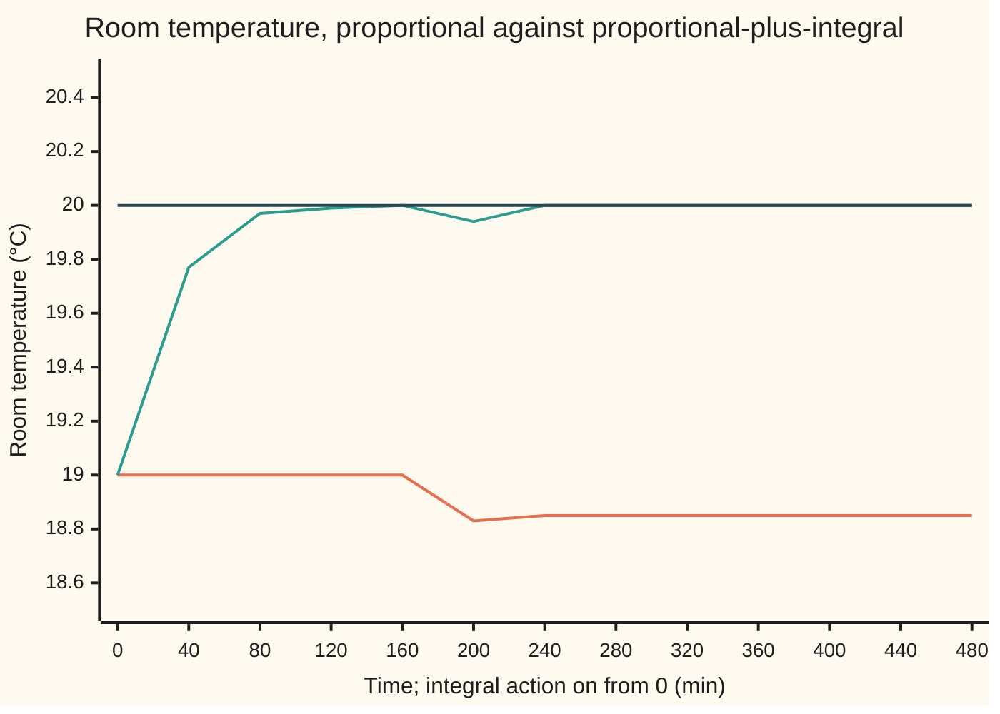
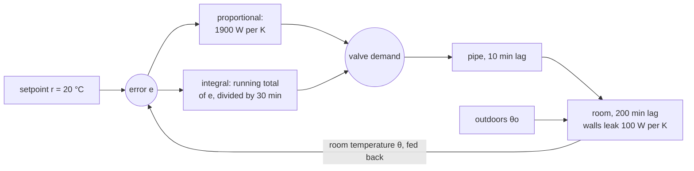

# Steady-state error: an integrator is what kills a permanent offset

[Syllabus](../../../SYLLABUS.md) → [Engineering mathematics](../../../SYLLABUS.md#w13) → [Feedback Control](../../../SYLLABUS.md#w13-s03) → Steady-state error

---

## General Overview

A room is set to 20 °C on a day when it is 0 °C outdoors. The walls leak 100 W for every kelvin of difference between inside and out, so holding 20 °C costs 2000 W. Hot water reaches the radiator through a slow pipe: its heat output follows the valve with a lag of about 10 minutes. The room itself warms with a lag of 200 minutes. Time on this card is in minutes, the room's natural scale.

The thermostat is proportional: it opens the valve in proportion to how cold the room is, 1900 W for every kelvin below the setpoint. However long the wait, the room settles at 19 °C, one degree cold. Nothing is broken. At 19 °C the thermostat sees one kelvin of error and asks for 1900 W, and the walls, 19 K above outdoors, lose exactly 1900 W. Heat in equals heat out, so nothing moves. A thermostat that acts only on the error needs an error to make any heat at all.

The engineer wants two numbers: how big that leftover error is for a given loop, and what change to the thermostat removes it. The leftover, after every transient has died, is the **steady-state error**. It can be read straight off the loop's transfer function, with no simulation, by counting one thing: how many integrators the loop contains. An integrator is a device whose output is the running total of its input; it keeps its output wherever it stopped once its input is zero. Add one to the thermostat and the room settles on 20 °C.

**The steady-state error of a stable loop is set by how many integrators sit inside it: none leaves a fixed offset on a fixed target, one removes that offset and leaves a fixed lag on a steadily rising target, and each extra one clears the next kind of target.**

**What kind of fact this is:** a theorem, proved on this card in Why it works from the final value theorem; "system type", the integrator count, is a definition.

### The picture: switching on the integrator, then a cold front



Both rooms start at the proportional thermostat's rest, 19.00 °C. The lower line keeps the proportional thermostat. The middle line has integral action switched on at time zero; it reads 19.77 °C after 40 minutes and 20.00 °C by 160 minutes. The top line is the 20.00 °C setpoint. At 160 minutes a cold front drops the outdoors to −3 °C. The proportional room sags further, to 18.85 °C, and stays there. The integral room dips to 19.83 °C and comes back.

---

## The formula

Three reminders first. A transfer function says what a system does to each exponential e^(st); s is the Laplace variable, and s = 0 is the input that never changes ([Final value and bandwidth](../02-Linear%20Systems%20and%20Transforms/05-final-value-theorem-and-steady-gain.md)). The loop gain L(s) is the transfer function once round the loop: thermostat, then pipe, then room ([Feedback](01-feedback-and-closed-loop-transfer-functions.md)). The sensitivity S(s) = 1/(1 + L(s)) is what the loop does to the error ([Sensitivity functions](02-sensitivity-and-the-gang-of-four.md)).

The error e is the setpoint minus the room temperature. Its transform E(s) is the target's transform R(s) passed through the sensitivity. The final value theorem then gives e_∞, where the error settles:

$$e_\infty \;=\; \lim_{s\to 0}\; s\,\frac{R(s)}{1+L(s)}$$

**Read it aloud:** the leftover error is s times the target's transform divided by one plus the loop gain, as s shrinks to zero.

Two targets matter most. A step of size $A$, held for ever, has transform A/s. A ramp rising at $a$ kelvin per minute has transform a/s^2. Put each in:

$$e_{\text{step}} = \frac{A}{1+K_0},\qquad K_0 = L(0); \qquad\qquad e_{\text{ramp}} = \frac{a}{K_v},\qquad K_v = \lim_{s\to 0} s\,L(s).$$

**Read it aloud:** a step leaves its size divided by one plus the loop's zero-frequency gain; a ramp leaves its slope divided by the loop's velocity constant.

The **system type** $N$ is the number of integrators in L(s): the power of s it divides by near zero. An integrator's transfer function is 1/s, since the running total of e^(st) is e^(st)/s. That one count fills the whole table:

| Type of the loop | Step of size A | Ramp of slope a |
| --- | --- | --- |
| 0: no integrator, L(0) finite | A/(1 + K_0) | grows without limit |
| 1: one integrator | 0 | a/K_v |
| 2: two integrators | 0 | 0 |

For the room, with $k_c$ the thermostat's gain in watts per kelvin, $U$ the walls' heat loss in watts per kelvin, $\tau_r$, $\tau_p$ the room's and the pipe's lags, and $T_i$ the integral time:

$$L_{\text{P}}(s) = \frac{k_c/U}{(\tau_r s+1)(\tau_p s+1)}, \qquad L_{\text{PI}}(s) = \frac{k_c}{U}\Big(1+\frac{1}{T_i\, s}\Big)\frac{1}{(\tau_r s+1)(\tau_p s+1)}.$$

The proportional loop is type 0 with K_0 = 1900/100 = 19. Adding integral action, the term with integral time $T_i$, divides by s once: type 1, with K_v = 19/30 = 0.633 per minute. Textbooks often write K_p for the position constant K_0; this library keeps K_p for the proportional gain of [PID control](07-pid-control-and-tuning.md), so the two never collide.

| Symbol | Plain meaning | In our example | Push it up and the error… |
| --- | --- | --- | --- |
| $e$, $E(s)$, $e_\infty$ | error, setpoint minus room temperature; its transform; its final value | 1.00 °C with the proportional thermostat | — |
| $r$, $R(s)$ | the target and its Laplace transform | 20 °C | grows with the target's distance from outdoors |
| $\theta$, $\theta_o$ | room and outdoor temperature | 19 °C and 0 °C | outdoors colder: a bigger step for the loop |
| $A$, $a$ | step size; ramp slope | 20 K (20 °C above 0 °C); 2 K per hour | grows in proportion |
| $L(s)$, $S(s)$, $s$ | loop gain; sensitivity 1/(1 + L); the Laplace variable | thermostat × pipe × room; S(0) = 1/20 for the proportional loop | a bigger L(0) means a smaller S(0) and a smaller step error |
| $\omega$, $j$ | angular frequency in rad/min; the square root of −1, as engineers write it | very low, to approach s = 0 | — |
| $N$ | system type: integrators in L(s) | 0 without integral action, 1 with | one more clears one more kind of target |
| $K_0$ | position constant, L(0) | 19 | shrinks the step error, never to zero |
| $K_v$ | velocity constant, s L(s) at s = 0 | 0.633 per minute | shrinks the ramp error |
| $k_c$, $U$ | thermostat gain; heat loss through the walls | 1900 W/K; 100 W/K | k_c shrinks it; U grows it |
| $\tau_r$, $\tau_p$ | lags of the room and of the pipe | 200 min; 10 min | no effect on the final error; they set the way there and the stability edge |
| $T_i$ | integral time: how long the integral term takes to match the proportional one on a steady error | 30 min | ramp error grows in proportion; too short and the loop goes unstable |
| $K$, $M(s)$, $m$ | in the folded proof: the loop's low-frequency constant; the rest of the loop, scaled so that M(0) = 1; the target's order, 0 for a step, 1 for a ramp, 2 for a parabola | K = K_0 or K_v | K shrinks it when N = m; a higher m needs one more integrator |

### When it holds

- **The closed loop is stable.** The final value theorem only applies to a signal that settles. With an integral time of 5 minutes the theorem still gives zero (0.000053 °C at ω = 10^(−5) rad/min), while the simulated room swings by 143 °C within six hours (uncapped linear model; a real 3000 W radiator would hit its stops and keep the room swinging).
- **The loop is linear: the radiator delivers whatever is asked.** On a −15 °C day the room needs 3500 W at 20 °C and the radiator gives 3000 W at most. The room tops out 5.00 °C cold, integrator or not.
- **The error the loop sees is the error that matters.** The theorem zeros the thermostat's reading of the error. A thermometer that reads high leaves the room cold by exactly its bias; no integrator can see it.
- **The target holds its shape long enough.** The numbers are limits. A ramp that has run for four hours shows 0.052544 °C against the limit 0.052632 °C; a ramp that stops after ten minutes never reaches its steady lag.
- **The plant does not change while it settles.** A slowly drifting heat loss is fine for the integral loop; for the proportional loop the offset drifts with it.

### The picture: where the integrator sits



A block diagram, schematic. The proportional path alone is type 0. The integral path divides by s once and makes the loop type 1.

---

## Why it works

### Step 0: a steady push needs a source that does not depend on the error

The room needs 2000 W for ever. A proportional thermostat makes heat only as k_c times the error, so a steady 2000 W needs a steady error, here about one kelvin. An integrator breaks that link. Its output is the running total of the error, so it can hold any value, 2000 W included, while the error is zero. If any error remained, the total would keep growing, the heat would keep rising, and the room would warm. The only place it can stop is zero error. Everything below is that argument written in transforms.

### Step 1: the error is the target passed through the sensitivity

Around the loop, the room's transform is L times the error's. The error is the target minus the room, so E = R − L E. Solve for E:

$$E(s) = \frac{R(s)}{1+L(s)} = S(s)\,R(s).$$

Here everything is measured from outdoors: the target is the room's height above 0 °C. The derivation of the closed loop is on [Feedback](01-feedback-and-closed-loop-transfer-functions.md).

### Step 2: the final value theorem turns the error into a number

If the error settles, its final value is s E(s) at s = 0 ([Final value and bandwidth](../02-Linear%20Systems%20and%20Transforms/05-final-value-theorem-and-steady-gain.md)). It settles when every root of 1 + L(s) = 0, the closed-loop poles, has a negative real part. That is the stability condition, and the theorem says nothing without it.

### Step 3: a step leaves A over one plus the zero-frequency gain

A step of size A has R = A/s. The s in front cancels it, leaving A/(1 + L(0)). For the proportional room, L(0) = 1900/100 = 19 and A = 20 K, so the error is 20/20 = 1.00 °C. The heat balance of the opening gives the same answer by another road: 1900 e = 100 (20 − e), so e = 1.00 °C.

### Step 4: an integrator makes L(0) infinite, so the step error is zero

With integral action, L(s) contains 1/(T_i s). As s shrinks, L grows without limit, so A/(1 + L) shrinks to zero. That is Step 0 in transforms: infinite gain at zero frequency means any steady error, however small, would produce an unlimited push.

### Step 5: a ramp needs one integrator more

A ramp of slope a has R = a/s^2. Then s E = a / (s + s L(s)). For a type-0 loop, s L(s) goes to zero and the error grows without limit. For type 1, s L(s) tends to K_v and the error settles at a/K_v. For the room, K_v = 19/30 per minute and a = 2 K per hour, which is 1/30 K per minute: the error is 1/19 = 0.0526 °C. Read in time, the room runs 1/K_v = 1.58 minutes behind the schedule.

<details>
<summary>Detailed proof: the whole table at once</summary>

Write the loop gain near zero as $L(s) = K\,M(s)/s^N$, where $N$ is the type, K is a positive constant, and M(s) is the rest of the loop scaled so that M(0) = 1. Take a target $R(s) = A/s^{m+1}$: m = 0 is a step, m = 1 a ramp, m = 2 a parabola.

Then, assuming the closed loop is stable,
$$s\,E(s) = \frac{A\,s^{N-m}}{s^N + K\,M(s)}.$$
As s goes to zero the bottom tends to K when N ≥ 1 and to 1 + K when N = 0.

- If N > m, the top goes to zero: no error.
- If N = m = 0, the limit is A/(1 + K): the step offset, with K = K_0.
- If N = m ≥ 1, the limit is A/K: the ramp lag for N = 1, with K = K_v; the parabola lag for N = 2.
- If N < m, s E grows without limit. The error has no final value; the theorem's hypothesis fails because E then has a pole at zero of order two or more, and the error grows like t^(m − N).

Each case needs the closed-loop poles in the left half-plane, so that every other part of e(t) dies away. That is exactly the hypothesis of the final value theorem.

</details>

### Step 6: the integrator is a model of what it must cancel

Why integrators and not something else? A step is what an integrator produces from a single kick: its output after an impulse is constant for ever. A ramp is what two integrators produce. The loop cancels a target or a disturbance completely only if it contains a copy of the thing that generates it. This is the **internal model principle** of Francis and Wonham (1976). It explains the cold front too: a sudden −3 °C drop outdoors is a step disturbance, and the same integrator that removed the setpoint offset removes it. The proportional room settles 23/20 = 1.15 °C cold; the integral room returns to 20 °C. A 24-hour swing of outdoor temperature would need a model of a 24-hour sine wave in the controller to cancel exactly.

A second road gives the same numbers in frequency: |S(jω)| at small ω. Engineers write j for the square root of −1; the rest of the library writes i. For the proportional loop, 20 × |S(jω)| tends to 1.00 °C. For the integral loop it tends to zero, and the ramp error (2 K per hour) × |S(jω)|/ω tends to 0.0526 °C. The code below computes both.

---

## Worked numbers, by hand

| Step | Arithmetic | Value |
| --- | --- | --- |
| step the loop must hold | 20 °C setpoint − 0 °C outdoors | 20 K |
| position constant | K_0 = 1900 / 100 | 19 |
| proportional offset | 20 / (1 + 19) | **1.00 °C** |
| heat balance check | thermostat 1900 × 1 = walls 100 × (19 − 0) | 1900 W both |
| power the integral loop holds | 100 × (20 − 0) | 2000 W |
| cold front, proportional | (20 − (−3)) / (1 + 19) | 1.15 °C |
| velocity constant | K_v = 19 / 30 per minute | 0.633 per minute |
| ramp slope | 2 K per hour ÷ 60 | 1/30 K per minute |
| ramp error, integral loop | (1/30) / (19/30) = 1/19 | **0.0526 °C** |
| ramp lag in time | 1 / K_v = 30/19 | 1.58 min |

Without integral action the room sits a full degree cold on a 0 °C day, and 1.15 °C cold once the front arrives. With it, the room holds 20 °C, and on a morning warm-up from 14 °C to 22 °C at 2 °C per hour it trails the schedule by about a twentieth of a degree.

### What breaks if you drop a piece

| Mistake | Comes out at | What went wrong |
| --- | --- | --- |
| Proportional only, step target | 1.00 °C cold for ever | type 0: an error is needed to make the heat |
| Proportional only, warm-up ramp from 14 °C to 22 °C | 1.43 °C behind after 240 min, against 1.10 °C if 22 °C were held | type 0 on a ramp: the error grows with the target |
| Integral time 5 min, below the stability edge of 9.05 min | worst error 3.85 °C, then 22.0 °C, then 143 °C in successive two-hour windows (uncapped linear model); the final value theorem claims zero | the final value theorem used on a loop that never settles |
| −15 °C outdoors, radiator capped at 3000 W | 5.00 °C cold by heat balance, 4.998 °C simulated; the integral term asks for 422,189 W | the linear model fails once the actuator saturates, and the integrator winds up |

The edge of 9.05 minutes comes from the Routh test on the closed loop's cubic ([Routh-Hurwitz](04-routh-hurwitz-criterion.md)). The simulation agrees: at 0.9 times the edge the worst error in the third window is 1.78 °C and growing; at 1.1 times it is 0.385 °C and shrinking. With 15 minutes the worst error falls from 1.00 °C to 0.156 °C to 0.026 °C over the same windows. The wind-up and how real controllers stop it are on [PID in practice](08-pid-on-real-hardware.md).

---

## Code, from first principles, and it actually runs

The scripts reach every steady error by three independent roads: the final-value formula from the loop's constants; the heat balance at rest; and a fourth-order Runge–Kutta (RK4) simulation of room, pipe and thermostat in steps of 0.05 minutes. They also evaluate the loop's frequency response at a very low frequency, with complex arithmetic written out in Rust. That is a numerical check of the s → 0 limit, not a separate road: like the theorem, it cannot see the pipe and room lags. Then they push the loop past each hypothesis: an unstable integral time, a capped radiator, a ramp on a type-0 loop. The chart's points are printed on the lines starting `chart`.

### Python

```python
# Steady-state error and system type -- the check behind the card.  Standard library only.
# A room (200 min lag) heated by a radiator through a slow pipe (10 min lag), with a thermostat.
# Roads: the final-value formula; a heat balance at rest; an RK4 simulation.  The frequency
# response near zero checks the s -> 0 limit.  Time in minutes, temperature in degC, power in W.
U, KC, TR, TP = 100.0, 1900.0, 200.0, 10.0   # heat loss W/K, thermostat gain W/K, lags (min)
TI, QMAX = 30.0, 3000.0                      # integral time (min), radiator limit (W)

def sim(ti, t_end, th, q, i, out, r0=20.0, slope=0.0, front=None, qmax=None, dt=0.05):
    """RK4 on room temperature th, radiator output q, integral of error i.  Returns history."""
    def f(t, x):
        to = out if front is None or t < front[0] else front[1]
        e = r0 + slope * t - x[0]
        qc = KC * (e + (x[2] / ti if ti else 0.0))
        if qmax is not None: qc = min(max(qc, 0.0), qmax)
        return [(x[1] / U - (x[0] - to)) / TR, (qc - x[1]) / TP, e if ti else 0.0]
    x, hist = [th, q, i], [(0.0, th, r0)]
    for k in range(int(round(t_end / dt))):
        t = k * dt
        k1 = f(t, x)
        k2 = f(t + dt / 2, [a + dt / 2 * b for a, b in zip(x, k1)])
        k3 = f(t + dt / 2, [a + dt / 2 * b for a, b in zip(x, k2)])
        k4 = f(t + dt, [a + dt * b for a, b in zip(x, k3)])
        x = [a + dt / 6 * (b + 2 * c + 2 * d + g) for a, b, c, d, g in zip(x, k1, k2, k3, k4)]
        hist.append(((k + 1) * dt, x[0], r0 + slope * (k + 1) * dt))
    return x, hist

def loop(w, ti):
    """L(jw): thermostat (with or without integral) times radiator pipe times room."""
    s = 1j * w
    ctrl = KC * (1 + 1 / (ti * s)) if ti else KC
    return ctrl / U / ((TR * s + 1) * (TP * s + 1))

def row(name, v, unit=""):
    print(f"{name:<44} {v:>11.6f} {unit}")

# ---- road 1: the formula, from the loop's constants ----
A = 20.0 - 0.0                      # the step the loop must hold: setpoint 20 degC above a 0 degC outdoors
K0 = KC / U                         # position constant L(0), type 0
KV = KC / U / TI                    # velocity constant lim s L(s), type 1, per minute
a = 2.0 / 60.0                      # ramp slope: 2 degC per hour, in degC per minute
row("type 0 position constant K0 = L(0)", K0, "dimensionless")
row("type 1 velocity constant Kv", KV, "1/min")
row("formula  P  step error A/(1+K0)", A / (1 + K0), "degC")
row("formula  PI ramp error a/Kv", a / KV, "degC")
row("formula  PI ramp lag in time 1/Kv", 1 / KV, "min")
# ---- road 2: heat balance at rest: thermostat power = heat lost through the walls ----
e_bal = U * A / (U + KC)            # KC*e = U*(20 - e - 0), solved for e
row("balance  P  step error", e_bal, "degC")
row("balance  P  power held at rest", KC * e_bal, "W")
row("balance  PI power held at rest", U * 20.0, "W")
# ---- road 3: simulation.  Integral switched off at 20 degC: the room sags to its P rest ----
x0, _ = sim(0, 360, 20.0, 2000.0, 0.0, 0.0)
row("sim      P  from 20 degC, error at 360 min", 20 - x0[0], "degC")
# P at its 19 degC rest, PI switched on at t = 0; cold front to -3 degC at 160 min
xP, hP = sim(0, 480, 19.0, 1900.0, 0.0, 0.0, front=(160, -3.0))
xI, hI = sim(TI, 480, 19.0, 1900.0, 0.0, 0.0, front=(160, -3.0))
for (t, p, r), (_, q, _) in list(zip(hP, hI))[::800]:
    print(f"chart, t {t:3.0f} min, P {p:5.2f}, PI {q:5.2f}, setpoint {r:5.2f}")
row("sim      P  error at 480 min, after the front", 20 - xP[0], "degC")
row("formula  P  error after the front 23/(1+K0)", 23.0 / (1 + K0), "degC")
row("sim      PI error at 480 min", 20 - xI[0], "degC")
row("sim      PI lowest room after the front", min(h[1] for h in hI[3200:]), "degC")
row("sim      PI radiator power at 480 min", xI[1], "W")
# ---- the s -> 0 limit, checked on the frequency response: E = S R with S = 1/(1+L) ----
w = 1e-5
row("freq     P  step error A*|S(jw)|", A * abs(1 / (1 + loop(w, 0))), "degC")
row("freq     PI step error A*|S(jw)|", A * abs(1 / (1 + loop(w, TI))), "degC")
row("freq     PI ramp error a*|S(jw)|/w", a * abs(1 / (1 + loop(w, TI))) / w, "degC")
# ---- ramp: night setback 14 degC rising to 22 degC at 2 degC/h; both loops start at rest ----
xR, _ = sim(TI, 240, 14.0, 1400.0, 1400.0 / KC * TI, 0.0, r0=14.0, slope=a)
xRp, _ = sim(0, 240, 14.0 - 14.0 / 20, 1400.0 * 19 / 20, 0.0, 0.0, r0=14.0, slope=a)
row("sim      PI ramp error at 240 min", 22.0 - xR[0], "degC")
row("sim      P  ramp error at 240 min", 22.0 - xRp[0], "degC")
row("formula  P  error if 22 degC were held", 22.0 / (1 + K0), "degC")
# ---- what breaks ----
ti_edge = K0 * TR * TP / ((1 + K0) * (TR + TP))   # cubic a2*a1 > a3*a0 (Routh) solved for Ti
row("stability edge for Ti", ti_edge, "min")
def worst(ti):          # largest error in each 120-minute window after the integral is switched on
    _, h = sim(ti, 360, 19.0, 1900.0, 0.0, 0.0)
    return [max(abs(20 - p[1]) for p in h[k - 2400:k]) for k in (2400, 4800, 7200)]
pU, pS = worst(5.0), worst(15.0)
for k, p, q in zip((120, 240, 360), pU, pS):
    row(f"sim      worst error to {k} min, Ti = 5 / 15 min", p, f"/ {q:.6f} degC")
pLo, pHi = worst(0.9 * ti_edge), worst(1.1 * ti_edge)
row("sim      worst error to 360 min, Ti = 0.9 / 1.1 edge", pLo[2], f"/ {pHi[2]:.6f} degC")
xS, _ = sim(TI, 1500, 20.0, 2000.0, 2000.0 / KC * TI, -15.0, qmax=QMAX)
row("sim      -15 degC, 3000 W cap, error at 1500 min", 20 - xS[0], "degC")
row("balance  -15 degC, power needed at 20 degC", U * 35.0, "W")
row("balance  -15 degC, 3000 W cap, error", 20 - (-15.0 + QMAX / U), "degC")
row("sim      -15 degC, integral term asks for", KC * xS[2] / TI, "W")
row("wrong: FVT on the unstable loop, Ti = 5 min", A * abs(1 / (1 + loop(w, 5.0))), "degC")
# ---- try changing ----
row("try: P, draughty room U = 150 W/K", 150 * A / (150 + KC), "degC")
row("try: P, thermostat gain 3900 W/K", U * A / (U + 3900.0), "degC")
row("try: PI ramp error, Ti = 15 min", a * 15.0 / K0, "degC")

assert abs(e_bal - (20 - x0[0])) < 1e-3                    # heat balance vs simulation
assert abs(A / (1 + K0) - A * abs(1 / (1 + loop(w, 0)))) < 1e-4   # formula vs the s -> 0 limit of S
assert abs(20 - xP[0] - 23.0 / (1 + K0)) < 1e-4            # cold front, P: formula vs simulation
assert abs(20 - xI[0]) < 1e-4                              # the integrator removes the offset
assert abs((22.0 - xR[0]) - a / KV) < 2e-4                 # ramp lag: formula vs simulation
assert abs(a * abs(1 / (1 + loop(w, TI))) / w - a / KV) < 1e-4    # ramp: the s -> 0 limit vs formula
assert pU[2] > 10 * pU[0] and pS[2] < pS[0] / 10           # simulated: Ti = 5 min grows, 15 min dies
assert pLo[2] > pLo[0] and pHi[2] < pHi[0]                 # Routh edge: just below it grows, just above it dies
assert abs((20 - xS[0]) - (20 - (-15.0 + QMAX / U))) < 1e-2   # saturated: heat balance vs simulation
print("all checks passed")
```

**Ran 2026-10-06 on macOS, Python 3.14.6, standard library only. All checks passed. Output, pasted from the run:**

```
type 0 position constant K0 = L(0)             19.000000 dimensionless
type 1 velocity constant Kv                     0.633333 1/min
formula  P  step error A/(1+K0)                 1.000000 degC
formula  PI ramp error a/Kv                     0.052632 degC
formula  PI ramp lag in time 1/Kv               1.578947 min
balance  P  step error                          1.000000 degC
balance  P  power held at rest               1900.000000 W
balance  PI power held at rest               2000.000000 W
sim      P  from 20 degC, error at 360 min      1.000000 degC
chart, t   0 min, P 19.00, PI 19.00, setpoint 20.00
chart, t  40 min, P 19.00, PI 19.77, setpoint 20.00
chart, t  80 min, P 19.00, PI 19.97, setpoint 20.00
chart, t 120 min, P 19.00, PI 19.99, setpoint 20.00
chart, t 160 min, P 19.00, PI 20.00, setpoint 20.00
chart, t 200 min, P 18.83, PI 19.94, setpoint 20.00
chart, t 240 min, P 18.85, PI 20.00, setpoint 20.00
chart, t 280 min, P 18.85, PI 20.00, setpoint 20.00
chart, t 320 min, P 18.85, PI 20.00, setpoint 20.00
chart, t 360 min, P 18.85, PI 20.00, setpoint 20.00
chart, t 400 min, P 18.85, PI 20.00, setpoint 20.00
chart, t 440 min, P 18.85, PI 20.00, setpoint 20.00
chart, t 480 min, P 18.85, PI 20.00, setpoint 20.00
sim      P  error at 480 min, after the front    1.150000 degC
formula  P  error after the front 23/(1+K0)     1.150000 degC
sim      PI error at 480 min                   -0.000002 degC
sim      PI lowest room after the front        19.828195 degC
sim      PI radiator power at 480 min        2299.979219 W
freq     P  step error A*|S(jw)|                1.000002 degC
freq     PI step error A*|S(jw)|                0.000316 degC
freq     PI ramp error a*|S(jw)|/w              0.052632 degC
sim      PI ramp error at 240 min               0.052544 degC
sim      P  ramp error at 240 min               1.432501 degC
formula  P  error if 22 degC were held          1.100000 degC
stability edge for Ti                           9.047619 min
sim      worst error to 120 min, Ti = 5 / 15 min    3.846606 / 1.000000 degC
sim      worst error to 240 min, Ti = 5 / 15 min   22.008197 / 0.155651 degC
sim      worst error to 360 min, Ti = 5 / 15 min  143.054709 / 0.026161 degC
sim      worst error to 360 min, Ti = 0.9 / 1.1 edge    1.782477 / 0.385412 degC
sim      -15 degC, 3000 W cap, error at 1500 min    4.997626 degC
balance  -15 degC, power needed at 20 degC   3500.000000 W
balance  -15 degC, 3000 W cap, error            5.000000 degC
sim      -15 degC, integral term asks for    422188.710426 W
wrong: FVT on the unstable loop, Ti = 5 min     0.000053 degC
try: P, draughty room U = 150 W/K               1.463415 degC
try: P, thermostat gain 3900 W/K                0.500000 degC
try: PI ramp error, Ti = 15 min                 0.026316 degC
all checks passed
```

### Rust

```rust
// Steady-state error and system type -- the check behind the card.  Rust std only.
// A room (200 min lag) heated by a radiator through a slow pipe (10 min lag), with a thermostat.
// Roads: the final-value formula; a heat balance at rest; an RK4 simulation.  The frequency
// response near zero checks the s -> 0 limit.  Time in minutes, temperature in degC, power in W.
const U: f64 = 100.0; // heat loss, W/K
const KC: f64 = 1900.0; // thermostat gain, W/K
const TR: f64 = 200.0; // room lag, min
const TP: f64 = 10.0; // radiator pipe lag, min
const TI: f64 = 30.0; // integral time, min
const QMAX: f64 = 3000.0; // radiator limit, W

#[derive(Clone, Copy)]
struct C { re: f64, im: f64 } // a complex number, written out
impl C {
    fn add(self, o: C) -> C { C { re: self.re + o.re, im: self.im + o.im } }
    fn mul(self, o: C) -> C { C { re: self.re * o.re - self.im * o.im, im: self.re * o.im + self.im * o.re } }
    fn div(self, o: C) -> C {
        let d = o.re * o.re + o.im * o.im;
        C { re: (self.re * o.re + self.im * o.im) / d, im: (self.im * o.re - self.re * o.im) / d }
    }
    fn abs(self) -> f64 { self.re.hypot(self.im) }
}
fn r(x: f64) -> C { C { re: x, im: 0.0 } }

struct Run { ti: f64, t_end: f64, x: [f64; 3], out: f64, r0: f64, slope: f64, front: Option<(f64, f64)>, qmax: Option<f64> }
fn run(ti: f64, t_end: f64, th: f64, q: f64, i: f64, out: f64) -> Run {
    Run { ti, t_end, x: [th, q, i], out, r0: 20.0, slope: 0.0, front: None, qmax: None }
}
// RK4 on room temperature, radiator output, integral of error.  Returns final state and history.
fn sim(p: &Run) -> ([f64; 3], Vec<(f64, f64, f64)>) {
    let dt = 0.05;
    let f = |t: f64, x: [f64; 3]| -> [f64; 3] {
        let to = match p.front { Some((t0, v)) if t >= t0 => v, _ => p.out };
        let e = p.r0 + p.slope * t - x[0];
        let mut qc = KC * (e + if p.ti > 0.0 { x[2] / p.ti } else { 0.0 });
        if let Some(m) = p.qmax { qc = qc.max(0.0).min(m); }
        [(x[1] / U - (x[0] - to)) / TR, (qc - x[1]) / TP, if p.ti > 0.0 { e } else { 0.0 }]
    };
    let step = |x: [f64; 3], k: [f64; 3], h: f64| [x[0] + h * k[0], x[1] + h * k[1], x[2] + h * k[2]];
    let mut x = p.x;
    let mut hist = vec![(0.0, x[0], p.r0)];
    let n = (p.t_end / dt).round() as usize;
    for k in 0..n {
        let t = k as f64 * dt;
        let k1 = f(t, x);
        let k2 = f(t + dt / 2.0, step(x, k1, dt / 2.0));
        let k3 = f(t + dt / 2.0, step(x, k2, dt / 2.0));
        let k4 = f(t + dt, step(x, k3, dt));
        for j in 0..3 { x[j] += dt / 6.0 * (k1[j] + 2.0 * k2[j] + 2.0 * k3[j] + k4[j]); }
        let tn = (k + 1) as f64 * dt;
        hist.push((tn, x[0], p.r0 + p.slope * tn));
    }
    (x, hist)
}
// L(jw): thermostat (with or without integral) times radiator pipe times room.
fn lp(w: f64, ti: f64) -> C {
    let s = C { re: 0.0, im: w };
    let ctrl = if ti > 0.0 { r(KC).mul(r(1.0).add(r(1.0).div(r(ti).mul(s)))) } else { r(KC) };
    ctrl.div(r(U)).div(r(TR).mul(s).add(r(1.0)).mul(r(TP).mul(s).add(r(1.0))))
}
fn sens(w: f64, ti: f64) -> f64 { r(1.0).div(r(1.0).add(lp(w, ti))).abs() } // |S(jw)|
fn row(name: &str, v: f64, unit: &str) { println!("{:<44} {:>11.6} {}", name, v, unit); }

fn main() {
    // ---- road 1: the formula, from the loop's constants ----
    let a_step = 20.0 - 0.0; // setpoint 20 degC above a 0 degC outdoors
    let k0 = KC / U; // position constant L(0), type 0
    let kv = KC / U / TI; // velocity constant lim s L(s), type 1, per minute
    let a = 2.0 / 60.0; // ramp slope, degC per minute
    row("type 0 position constant K0 = L(0)", k0, "dimensionless");
    row("type 1 velocity constant Kv", kv, "1/min");
    row("formula  P  step error A/(1+K0)", a_step / (1.0 + k0), "degC");
    row("formula  PI ramp error a/Kv", a / kv, "degC");
    row("formula  PI ramp lag in time 1/Kv", 1.0 / kv, "min");
    // ---- road 2: heat balance at rest ----
    let e_bal = U * a_step / (U + KC);
    row("balance  P  step error", e_bal, "degC");
    row("balance  P  power held at rest", KC * e_bal, "W");
    row("balance  PI power held at rest", U * 20.0, "W");
    // ---- road 3: simulation ----
    let (x0, _) = sim(&run(0.0, 360.0, 20.0, 2000.0, 0.0, 0.0));
    row("sim      P  from 20 degC, error at 360 min", 20.0 - x0[0], "degC");
    let (xp, hp) = sim(&Run { front: Some((160.0, -3.0)), ..run(0.0, 480.0, 19.0, 1900.0, 0.0, 0.0) });
    let (xi, hi) = sim(&Run { front: Some((160.0, -3.0)), ..run(TI, 480.0, 19.0, 1900.0, 0.0, 0.0) });
    for k in (0..hp.len()).step_by(800) {
        println!("chart, t {:3.0} min, P {:5.2}, PI {:5.2}, setpoint {:5.2}", hp[k].0, hp[k].1, hi[k].1, hp[k].2);
    }
    row("sim      P  error at 480 min, after the front", 20.0 - xp[0], "degC");
    row("formula  P  error after the front 23/(1+K0)", 23.0 / (1.0 + k0), "degC");
    row("sim      PI error at 480 min", 20.0 - xi[0], "degC");
    let low = hi[3200..].iter().map(|h| h.1).fold(f64::INFINITY, f64::min);
    row("sim      PI lowest room after the front", low, "degC");
    row("sim      PI radiator power at 480 min", xi[1], "W");
    // ---- the s -> 0 limit, checked on the frequency response ----
    let w = 1e-5;
    row("freq     P  step error A*|S(jw)|", a_step * sens(w, 0.0), "degC");
    row("freq     PI step error A*|S(jw)|", a_step * sens(w, TI), "degC");
    row("freq     PI ramp error a*|S(jw)|/w", a * sens(w, TI) / w, "degC");
    // ---- ramp: night setback 14 degC rising to 22 degC at 2 degC/h ----
    let (xr, _) = sim(&Run { r0: 14.0, slope: a, ..run(TI, 240.0, 14.0, 1400.0, 1400.0 / KC * TI, 0.0) });
    let (xrp, _) = sim(&Run { r0: 14.0, slope: a, ..run(0.0, 240.0, 14.0 - 14.0 / 20.0, 1400.0 * 19.0 / 20.0, 0.0, 0.0) });
    row("sim      PI ramp error at 240 min", 22.0 - xr[0], "degC");
    row("sim      P  ramp error at 240 min", 22.0 - xrp[0], "degC");
    row("formula  P  error if 22 degC were held", 22.0 / (1.0 + k0), "degC");
    // ---- what breaks ----
    let ti_edge = k0 * TR * TP / ((1.0 + k0) * (TR + TP)); // cubic a2*a1 > a3*a0 (Routh) solved for Ti
    row("stability edge for Ti", ti_edge, "min");
    let worst = |ti: f64| -> Vec<f64> {
        let (_, h) = sim(&run(ti, 360.0, 19.0, 1900.0, 0.0, 0.0));
        [2400usize, 4800, 7200].iter().map(|&k| h[k - 2400..k].iter().map(|p| (20.0 - p.1).abs()).fold(0.0, f64::max)).collect()
    };
    let (pu, ps) = (worst(5.0), worst(15.0));
    for (j, k) in [120, 240, 360].iter().enumerate() {
        row(&format!("sim      worst error to {} min, Ti = 5 / 15 min", k), pu[j], &format!("/ {:.6} degC", ps[j]));
    }
    let (plo, phi) = (worst(0.9 * ti_edge), worst(1.1 * ti_edge));
    row("sim      worst error to 360 min, Ti = 0.9 / 1.1 edge", plo[2], &format!("/ {:.6} degC", phi[2]));
    let (xs, _) = sim(&Run { qmax: Some(QMAX), ..run(TI, 1500.0, 20.0, 2000.0, 2000.0 / KC * TI, -15.0) });
    row("sim      -15 degC, 3000 W cap, error at 1500 min", 20.0 - xs[0], "degC");
    row("balance  -15 degC, power needed at 20 degC", U * 35.0, "W");
    row("balance  -15 degC, 3000 W cap, error", 20.0 - (-15.0 + QMAX / U), "degC");
    row("sim      -15 degC, integral term asks for", KC * xs[2] / TI, "W");
    row("wrong: FVT on the unstable loop, Ti = 5 min", a_step * sens(w, 5.0), "degC");
    // ---- try changing ----
    row("try: P, draughty room U = 150 W/K", 150.0 * a_step / (150.0 + KC), "degC");
    row("try: P, thermostat gain 3900 W/K", U * a_step / (U + 3900.0), "degC");
    row("try: PI ramp error, Ti = 15 min", a * 15.0 / k0, "degC");

    assert!((e_bal - (20.0 - x0[0])).abs() < 1e-3); // heat balance vs simulation
    assert!((a_step / (1.0 + k0) - a_step * sens(w, 0.0)).abs() < 1e-4); // formula vs the s -> 0 limit of S
    assert!((20.0 - xp[0] - 23.0 / (1.0 + k0)).abs() < 1e-4); // cold front, P: formula vs simulation
    assert!((20.0 - xi[0]).abs() < 1e-4); // the integrator removes the offset
    assert!(((22.0 - xr[0]) - a / kv).abs() < 2e-4); // ramp lag: formula vs simulation
    assert!((a * sens(w, TI) / w - a / kv).abs() < 1e-4); // ramp: the s -> 0 limit vs formula
    assert!(pu[2] > 10.0 * pu[0] && ps[2] < ps[0] / 10.0); // simulated: Ti = 5 min grows, 15 min dies
    assert!(plo[2] > plo[0] && phi[2] < phi[0]); // Routh edge: just below it grows, just above it dies
    assert!(((20.0 - xs[0]) - (20.0 - (-15.0 + QMAX / U))).abs() < 1e-2); // saturated: heat balance vs simulation
    println!("all checks passed");
}
```

**Ran 2026-10-06 on macOS, rustc 1.98.1, no crates. All checks passed. Output, pasted from the run:**

```
type 0 position constant K0 = L(0)             19.000000 dimensionless
type 1 velocity constant Kv                     0.633333 1/min
formula  P  step error A/(1+K0)                 1.000000 degC
formula  PI ramp error a/Kv                     0.052632 degC
formula  PI ramp lag in time 1/Kv               1.578947 min
balance  P  step error                          1.000000 degC
balance  P  power held at rest               1900.000000 W
balance  PI power held at rest               2000.000000 W
sim      P  from 20 degC, error at 360 min      1.000000 degC
chart, t   0 min, P 19.00, PI 19.00, setpoint 20.00
chart, t  40 min, P 19.00, PI 19.77, setpoint 20.00
chart, t  80 min, P 19.00, PI 19.97, setpoint 20.00
chart, t 120 min, P 19.00, PI 19.99, setpoint 20.00
chart, t 160 min, P 19.00, PI 20.00, setpoint 20.00
chart, t 200 min, P 18.83, PI 19.94, setpoint 20.00
chart, t 240 min, P 18.85, PI 20.00, setpoint 20.00
chart, t 280 min, P 18.85, PI 20.00, setpoint 20.00
chart, t 320 min, P 18.85, PI 20.00, setpoint 20.00
chart, t 360 min, P 18.85, PI 20.00, setpoint 20.00
chart, t 400 min, P 18.85, PI 20.00, setpoint 20.00
chart, t 440 min, P 18.85, PI 20.00, setpoint 20.00
chart, t 480 min, P 18.85, PI 20.00, setpoint 20.00
sim      P  error at 480 min, after the front    1.150000 degC
formula  P  error after the front 23/(1+K0)     1.150000 degC
sim      PI error at 480 min                   -0.000002 degC
sim      PI lowest room after the front        19.828195 degC
sim      PI radiator power at 480 min        2299.979219 W
freq     P  step error A*|S(jw)|                1.000002 degC
freq     PI step error A*|S(jw)|                0.000316 degC
freq     PI ramp error a*|S(jw)|/w              0.052632 degC
sim      PI ramp error at 240 min               0.052544 degC
sim      P  ramp error at 240 min               1.432501 degC
formula  P  error if 22 degC were held          1.100000 degC
stability edge for Ti                           9.047619 min
sim      worst error to 120 min, Ti = 5 / 15 min    3.846606 / 1.000000 degC
sim      worst error to 240 min, Ti = 5 / 15 min   22.008197 / 0.155651 degC
sim      worst error to 360 min, Ti = 5 / 15 min  143.054709 / 0.026161 degC
sim      worst error to 360 min, Ti = 0.9 / 1.1 edge    1.782477 / 0.385412 degC
sim      -15 degC, 3000 W cap, error at 1500 min    4.997626 degC
balance  -15 degC, power needed at 20 degC   3500.000000 W
balance  -15 degC, 3000 W cap, error            5.000000 degC
sim      -15 degC, integral term asks for    422188.710426 W
wrong: FVT on the unstable loop, Ti = 5 min     0.000053 degC
try: P, draughty room U = 150 W/K               1.463415 degC
try: P, thermostat gain 3900 W/K                0.500000 degC
try: PI ramp error, Ti = 15 min                 0.026316 degC
all checks passed
```

The two outputs are identical to the printed precision.

> [!TIP]
> **Try changing**
> - **A draughtier room.** Guess first: does a heat loss of 150 W/K instead of 100 W/K matter to either thermostat? Set `U = 150` in the proportional formula. The proportional offset grows to 1.46 °C. The integral room still settles on 20 °C, by Step 4: the integrator never needed to know U.
> - **A stronger proportional thermostat.** Guess first: what gain halves the offset? Set the gain to 3900 W/K, which doubles 1 + K_0 from 20 to 40. The offset is 100 × 20 / (100 + 3900) = 0.50 °C: half, not zero, because L(0) is still finite.
> - **A faster integrator.** Guess first: what does halving T_i to 15 minutes do to the ramp error? It halves it, to 0.0263 °C, and the loop is still stable. At 5 minutes it is not.
> - **A harder winter.** Set the outdoor temperature to −15 °C with the 3000 W cap. Guess first: does integral action help? It cannot: the room tops out 5.00 °C cold.

---

## The usual mistake

> [!warning]
> **Turning up the proportional gain to remove the offset.** A bigger gain shrinks the offset, from 1.00 °C to 0.50 °C at 3900 W/K, but never to zero, because zero error would mean zero heat. Only an integrator holds heat with no error. With the lags of a real pipe and room, a high gain also brings ringing and, once there is a time delay, instability ([Time delays](10-smith-predictor-and-time-delays.md)).
>
> - **Counting integrators in the closed loop.** Type is counted in the loop gain L(s), once round the loop. The closed-loop transfer function of a type-1 loop has no pole at zero at all.
> - **Using the final value theorem without checking stability.** With T_i = 5 min it returns zero error for a room swinging by 143 °C in the uncapped model.
> - **Taking the step to be the setpoint change.** The proportional loop must hold the room 20 K above outdoors, so the offset is 20/20 = 1.00 °C on a 0 °C day, even if the setpoint has not moved in a week. That holds for a thermostat with no preset bias. One preset for the operating point (manual reset, as on [Feedback](01-feedback-and-closed-loop-transfer-functions.md)) shows an offset only on changes from that point.
> - **Expecting one integrator to track a schedule exactly.** A warm-up ramp still leaves 0.0526 °C; zero ramp error needs type 2.

---

## Where you meet it in real life

- **Cruise control on a hill.** A proportional speed controller slows on every climb by an amount set by K_0; integral action brings the speed back to the set value.
- **Ovens, kilns and incubators.** Simple proportional controllers droop below the setpoint. Old industrial controllers had a "manual reset" knob to add the missing bias by hand; "automatic reset" was the old name for integral action.
- **Motors and antennas following a moving target.** A type-1 position servo tracking a target moving at a steady rate trails it by the speed divided by K_v; tracking radars and telescope mounts add a second integrator to remove that lag.
- **Phase-locked loops in radios.** A frequency offset is a phase ramp; a type-2 loop locks to it with zero phase error.
- **Every PID controller.** The I in PID is this card's integrator ([PID control](07-pid-control-and-tuning.md)); its limits on real valves are on [PID in practice](08-pid-on-real-hardware.md).

> **Say it back**
> A proportional thermostat makes heat only from error, so to hold a room warm it must leave the room a little cold: 1.00 °C here. The final value theorem reads that offset off the loop gain at zero frequency, as the step divided by one plus L(0). An integrator makes L(0) infinite and the offset zero, because it can hold any output with no error. Each integrator clears one more kind of target, step, then ramp, which is why the count is called the system type. None of it holds unless the loop is stable and the actuator has room to deliver.

---

## What this builds on

- [Feedback](01-feedback-and-closed-loop-transfer-functions.md): the loop gain and the closed loop, from which E = R/(1 + L) follows.
- [Final value and bandwidth](../02-Linear%20Systems%20and%20Transforms/05-final-value-theorem-and-steady-gain.md): the theorem that turns s E(s) at s = 0 into the error's final value, and its stability hypothesis.

---

## Where this goes next

- [PID control](07-pid-control-and-tuning.md): the proportional, integral and derivative terms together, and how to choose their gains so the loop is fast without ringing.

The integrator removes the offset, but an integral time of 5 minutes turns the room unstable and 30 minutes still takes 160 minutes to reach 20.00 °C; choosing gains that are both quick and safe is what pid-control-and-tuning answers.

---

## Sources

Verified 2026-10-06: every link below opens the cited work or its publisher's page.

- Karl J. Åström and Richard M. Murray, *Feedback Systems: An Introduction for Scientists and Engineers*, Princeton University Press, 2nd ed., [book site with the free edition](https://fbswiki.org/wiki/index.php/Feedback_Systems:_An_Introduction_for_Scientists_and_Engineers). Integral action, steady-state error and the loop transfer functions, with physical examples.
- Norman S. Nise, *Control Systems Engineering*, 8th ed., Wiley, [publisher's page](https://www.wiley.com/en-us/Control+Systems+Engineering%2C+8th+Edition-p-9781119474227). The system-type table and the static error constants for step, ramp and parabola.
- Bruce A. Francis and W. Murray Wonham, "The internal model principle of control theory", *Automatica* 12 (1976) 457–465, [doi:10.1016/0005-1098(76)90006-6](https://doi.org/10.1016/0005-1098%2876%2990006-6). Why a loop must contain a model of the signal it cancels.
