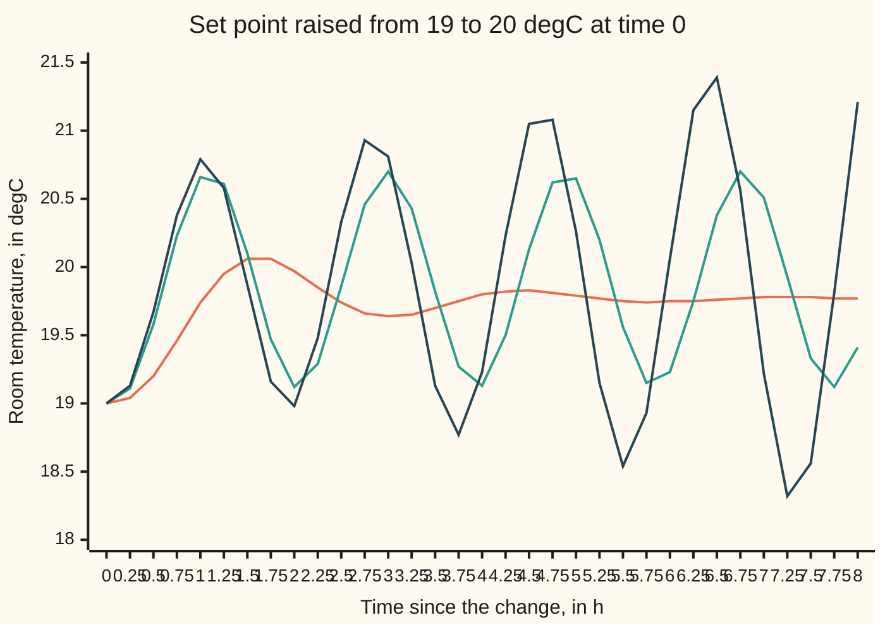
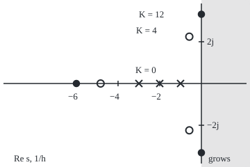

# Routh-Hurwitz: decide whether every root decays without finding a single root

Engineering mathematics → Feedback Control → Stability from coefficients → Routh-Hurwitz

---

## General Overview

A large workshop is heated by one radiator, fed through a long, slow pipe. A thermostat opens the boiler in proportion to the shortfall: so many kilowatts of heat for every degree the room is too cold. That number, kilowatts per degree, is the thermostat's **gain**. Heat passes three slow stages in a row: the pipe warms in about 20 min, the radiator in about 30 min, the room in about 60 min.

On a cold morning the set point goes up from 19 °C to 20 °C. The engineer wants one number before choosing the gain: how large can it be before the room stops settling and starts swinging? A bold gain heats fast, but the slow stages keep delivering heat after the room is warm enough, so it overshoots. Push the gain far enough and each overshoot is bigger than the last.

For this workshop the answer is exact: **any positive gain below 12 kW per °C settles; at 12 the room swings between about 19.12 °C and 20.70 °C forever, once every 113.67 min; above 12 the swings grow.** It comes from a small table of arithmetic on the four coefficients of a cubic polynomial, with the cubic never solved. The table is the **Routh array**; the rule that reads it is the **Routh-Hurwitz criterion**.

**Write the coefficients of the closed loop's characteristic polynomial in two rows, fill in each new row from the two above it by one cross-multiplication rule, and count the sign changes down the first column: that count is exactly the number of roots in the right half-plane, so a column with no sign change means every mode of the loop decays.**

**What kind of fact this is:** a theorem, proved on this card in Why it works, with the two special cases (a zero first entry, a whole row of zeros) handled separately; the room model is an approximation whose limits are stated in When it holds.

### The picture: the room after the set point goes up



Orange, gain 4 kW per °C: overshoot to a highest sample of 20.06 °C, then settling at 19.77 °C. Green, 12 kW per °C: a swing that neither grows nor fades. Dark blue, 14 kW per °C: each swing larger than the last, with samples reaching 18.32 °C and 21.39 °C within 8 h. All three are simulated and sampled every 0.25 h, so the true peaks lie slightly beyond the samples.

---

## The formula

Reminders. The transfer function $G(s)$ says what a system does to each exponential e^(st). A loop is stable when every root of its characteristic polynomial, each a **pole**, has negative real part ([poles-zeros-and-stability](../02-Linear%20Systems%20and%20Transforms/03-poles-zeros-and-stability.md)). Closing a loop with gain $K$ around $G(s)$ = N(s)/D(s), a numerator polynomial N over a denominator polynomial D, gives the characteristic polynomial D(s) + K N(s) ([feedback-and-closed-loop-transfer-functions](01-feedback-and-closed-loop-transfer-functions.md)). Engineers write j for the square root of −1; the rest of the library writes i.

For the workshop, time in hours, with s in 1/h:

$$G(s) = \frac{5}{(s+1)(s+2)(s+3)}\ ^\circ\text{C per kW}, \qquad p(s) = (s+1)(s+2)(s+3) + 5K = s^3 + 6s^2 + 11s + (6 + 5K).$$

Write a polynomial of degree n as p(s) = a_n s^n + a_(n−1) s^(n−1) + … + a_0. The **Routh array** has one row per power, s^n down to s^0. The first two rows take the coefficients alternately:

| Row | Entries |
| --- | --- |
| s^n | a_n, a_(n−2), a_(n−4), … |
| s^(n−1) | a_(n−1), a_(n−3), a_(n−5), … |

Each later row comes from the two above it. With the row two above written x_0, x_1, … and the row just above y_0, y_1, …, the new row is

$$z_j = \frac{y_0\, x_{j+1} - x_0\, y_{j+1}}{y_0}, \qquad j = 0, 1, 2, \dots$$

**Read it aloud:** each new entry is the little two-by-two cross product of the first column with the next column over, divided by the first entry of the row just above.

The criterion:

$$\#\{\text{roots of } p \text{ with positive real part}\} = \#\{\text{sign changes down the first column}\}.$$

**Read it aloud:** the number of flips between positive and negative down the first column is the number of modes that grow.

For the workshop the array is

| Row | First column | Second column |
| --- | --- | --- |
| s^3 | 1 | 11 |
| s^2 | 6 | 6 + 5K |
| s^1 | (60 − 5K)/6 | 0 |
| s^0 | 6 + 5K | |

No sign change needs 60 − 5K > 0 and 6 + 5K > 0. So the loop is stable exactly when

$$-1.2 < K < 12 \ \text{kW per }^\circ\text{C}, \qquad K_{cr} = 12 \ \text{kW per }^\circ\text{C}.$$

| Symbol | Plain meaning | In our example | Push it up and the answer… |
| --- | --- | --- | --- |
| $s$ | the rate in a test exponential e^(st), in 1/h; its imaginary part in rad/h | any complex number | — |
| $G(s)$ | the plant: boiler heat in, room temperature out, in °C per kW | 5/((s+1)(s+2)(s+3)), steady gain 0.8333 °C per kW | — |
| $N(s)$, $D(s)$ | the plant's numerator and denominator polynomials, G = N/D | N = 5, D = (s+1)(s+2)(s+3) | — |
| $K$ | thermostat gain, kW of heat per °C of shortfall | 4 kW per °C as a working setting | past 12 the room swings ever wider |
| $K_{cr}$ | critical gain: the edge between settling and growing swings | 12 kW per °C | — |
| $p(s)$ | the closed loop's characteristic polynomial; its roots are the loop's poles | s^3 + 6s^2 + 11s + (6 + 5K) | — |
| $a_k$ | the coefficient of s^k in p(s) | a_3 = 1, a_2 = 6, a_1 = 11, a_0 = 6 + 5K | a_0 up: the s^1 entry falls |
| $r_k(s)$ | the polynomial whose coefficients are row k of the array, read with every second power | r_1 = s^3 + 11s, r_2 = 6s^2 + (6 + 5K) | — |
| $\mu$ | ratio of the first entries of two consecutive rows | 1/6 for rows s^3 and s^2 | negative means one more growing root |
| $\omega$ | angular frequency of a swing, in rad/h | 3.316625 rad/h at K = 12 | faster swing, shorter period |
| $A(s)$ | auxiliary polynomial: the row above a row of zeros | 6s^2 + 66 at K = 12 | — |
| $\varepsilon$ | a small positive number put in place of a zero first entry (not the perturbation ε of shelf 01) | 1e-9 in the code | the count does not depend on it |
| $\Delta_2$ | a Hurwitz determinant: a_2 a_1 − a_3 a_0 for a cubic | 60 − 5K, so 40 at K = 4 | positive is needed for stability |
| $n$, $x_j$, $y_j$, $z_j$, $q(s)$, $p_t(s)$, $t$, $c_k$, $w$ | helpers in the rule and the proof: the degree of p; entries of the row two above, the row just above, and the new row; the reduced polynomial r_2 + r_3; the family joining q to p as t runs from 0 to 1; the first-column entries; s rescaled as w = ts | n = 3; q = 6s^2 + ((60 − 5K)/6)s + (6 + 5K); c_k = 1, 6, 6.6667, 26 at K = 4 | — |

### When it holds

- **Linear loop.** The radiator cannot give negative heat and the boiler has a top rating. Once the demand passes it, growing swings stop at a fixed size, a **limit cycle**. The criterion speaks about the linear model only.
- **A polynomial characteristic equation.** The array needs a finite list of coefficients. A pipe that carries water with a pure 20 min transport delay gives e^(−s/3), which is no polynomial; with that delay the true critical gain is 6.3060 kW per °C, not 12 (What breaks, below).
- **Coefficients known exactly.** A slower radiator moves the critical gain; the gain margin 12/4 = 3.0, or 9.54 dB, at K = 4 is the safety factor against such errors ([nyquist-criterion-and-stability-margins](06-nyquist-criterion-and-stability-margins.md)).
- **Real coefficients and no zero entries.** The count is exact when no first-column entry is zero. A zero first entry and a whole zero row each have their own rule, Steps 4 and 5.
- **Continuous time.** A thermostat that samples the room at fixed intervals is a discrete-time loop, and its test is "every pole inside the unit circle", by a different table (the Jury test).

---

## Why it works

### Step 0: a root can only become unstable by crossing the imaginary axis, and there the polynomial splits in two

Roots move continuously with the coefficients, so a root passes into the right half-plane only by touching the imaginary axis at some s = jω. There the even powers of s give a real number and the odd powers an imaginary one, and both must vanish. Each Routh row is a polynomial of one parity, and each new row removes one degree without changing the count of right-half-plane roots, except for one root sent off to infinity, left or right according to a sign.

### Step 1: the room as a cubic

Pipe, radiator and room are three first-order lags in a row: the pipe water follows the boiler at rate 3 per h, the radiator follows the pipe at 2 per h, the room follows the radiator at 1 per h. The room loses 1.2000 kW per °C above its surroundings, so a held kilowatt warms it by 0.8333 °C in the end. The product of the three stages is $G(s)$. The thermostat delivers K times the shortfall, the closed loop is KG/(1 + KG), and clearing the denominator of 1 + KG(s) = 0 gives p(s) = s^3 + 6s^2 + 11s + (6 + 5K).

### Step 2: each Routh row is a polynomial, and each step is one division

Read each row as a polynomial with every second power: row 1 is r_1(s) = s^3 + 11s, row 2 is r_2(s) = 6s^2 + (6 + 5K), and their sum is p(s). Take $\mu$ = a_n/a_(n−1), the ratio of the rows' first entries. Row 3 is what is left after subtracting μ s times row 2 from row 1:

$$r_3(s) = r_1(s) - \mu\, s\, r_2(s).$$

Spelled out entry by entry, that subtraction is the cross-multiplication rule. For the workshop, μ = 1/6 and r_3(s) = s^3 + 11s − (s/6)(6s^2 + 6 + 5K) = ((60 − 5K)/6) s. That is the s^1 row.

### Step 3: the reduced polynomial has the same number of right-half-plane roots, plus one if μ is negative

Let q(s) = r_2(s) + r_3(s), of degree n − 1; its Routh array is that of p with the top row removed. Join q to p through a family:

$$p_t(s) = q(s) + t\,\mu\, s\, r_2(s), \qquad 0 \le t \le 1, \qquad p_1 = p.$$

Two facts finish the step.

**No root of the family crosses the axis.** At s = jω, r_2(jω) is purely real and r_3(jω) + tμ jω r_2(jω) purely imaginary, or the other way round, because the powers differ in parity. A root forces r_2(jω) = 0 and then r_3(jω) = 0, with no t in either condition. So if q has no root on the axis, the count of right-half-plane roots is the same for every t in (0, 1].

**The extra root comes from infinity on the side set by μ.** For tiny t the top two terms are tμ a_(n−1) s^n and a_(n−1) s^(n−1), so one root sits far out near s = −1/(tμ), and the other n − 1 sit near the roots of q. The far root is in the left half-plane if μ > 0, in the right if μ < 0.

So **p has as many right-half-plane roots as q when μ > 0, and one more when μ < 0.** A negative μ is a sign change between consecutive first-column entries. Repeating the step down the table gives the criterion.

<details>
<summary>Detailed proof: the full induction, and why the far root is where it is said to be</summary>

Let p have degree n with all first-column entries of its Routh array nonzero, so no step divides by zero. Write c_0, c_1, …, c_n for the first column. Claim: the number of roots of p with positive real part equals the number of indices k with c_k c_(k+1) < 0, and p has no roots on the imaginary axis.

Degree 1: p(s) = c_0 s + c_1, root −c_1/c_0, positive exactly when c_0 and c_1 differ in sign. True.

Degree n: build q of degree n − 1 from rows 2 and 3 as in Step 3. Its first column is c_1, …, c_n, so by induction q has no axis roots and its right-half count equals the sign changes in c_1, …, c_n. An axis root of p_t at any t in (0, 1] would force r_2(jω) = r_3(jω) = 0, hence q(jω) = 0, which is excluded. Roots move continuously with the coefficients while the leading coefficient tμ c_1 stays nonzero, so the right-half count of p_t is the same for all t in (0, 1]. For small t, substitute s = w/t and multiply by t^(n−1)/(μ c_1): the polynomial becomes w^(n−1) (w + 1/μ) plus terms of order t, O(t) in the notation of shelf 01. One root in w tends to −1/μ; the other n − 1 tend to 0, and scaled back by s = w/t they are the roots that approach those of q (Rouché's theorem, wing 07, makes this precise). So one root of p_t sits far out on the side of −1/μ. With μ = c_0/c_1, the count for p is that of q plus one exactly when c_0 c_1 < 0. Induction closes.

</details>

### Step 4: a whole row of zeros means a mirror-image pair of roots

At K = 12 the whole s^1 row is zero. Then r_3 = 0, so r_1 = μ s r_2 and p = (μ s + 1) r_2: the row above, the auxiliary polynomial $A(s)$ = 6s^2 + 66, is a factor of p:

$$s^3 + 6s^2 + 11s + 66 = (s + 6)(s^2 + 11).$$

An even polynomial has its roots in mirror pairs about the origin: ±jω, ±σ, or a quartet ±σ ± jω. Here s = ±j√11 = ±3.316625j rad/h: a swing that neither grows nor fades, period 113.67 min. To finish the array, replace the zero row by the coefficients of the derivative A′(s) = 12s. The column becomes 1, 6, 12, 66: no root in the right half-plane, but two on the axis. **A zero row never means stable.**

### Step 5: a zero first entry with the rest of its row nonzero

If only a row's first entry is zero, replace it by a small positive $\varepsilon$ and carry on. That is the array of a slightly nudged polynomial; with no root on the axis, a tiny nudge cannot carry a root across it, so the count as ε shrinks to 0 is the true count. The quartic s^4 + s^3 + 3s^2 + 3s + 3 hits a zero first entry in its s^2 row; with ε the column shows 2 sign changes, and the root finder confirms 2 right-half-plane roots.

### Step 6: the same test written as determinants

Hurwitz (1895) wrote the condition as determinants of the coefficients. For a cubic with a_3 > 0: every coefficient positive, and $\Delta_2$ = a_2 a_1 − a_3 a_0 > 0. For the workshop Δ_2 = 60 − 5K, 6 times the Routh s^1 entry; in general each Hurwitz determinant is a product of Routh first-column entries.

**Another route.** The critical gain is where the phase of G(jω) reaches −180°, taking K = 1/|G(jω)| there: for the workshop at 3.316625 rad/h, where |G| = 0.083333 = 1/12. [nyquist-criterion-and-stability-margins](06-nyquist-criterion-and-stability-margins.md) builds the test on that picture, and it still works with time delays. [root-locus](05-root-locus.md) draws where the poles go as the gain rises, for a faster room (lags 2, 4 and 10 min) whose pair crosses the axis at loop gain 12.6.

### The picture: the three poles at three gains, to scale

Real part of s across, imaginary part up, 30 px per 1/h on both axes. The shaded half is where a pole grows. Crosses: K = 0, the three lags alone. Circles: K = 4. Filled dots: K = 12, with the pair sitting on the axis.

<p align="center"></p>

At K = 4 the fast pole has moved to −4.8371 and the other two have joined into the pair −0.5814 ± 2.2443j, the gentle ring of the orange curve. At K = 12 the pair reaches the axis at ±3.3166j and the real pole sits at −6.

---

## Worked numbers, by hand

The Routh array at the working gain K = 4 kW per °C, and then the boundary.

| Step | Arithmetic | Value |
| --- | --- | --- |
| Characteristic polynomial | (s+1)(s+2)(s+3) + 5 × 4 | s^3 + 6s^2 + 11s + 26 |
| Row s^3 | a_3, a_1 | 1, 11 |
| Row s^2 | a_2, a_0 | 6, 26 |
| Row s^1 | (6 × 11 − 1 × 26)/6 = 40/6 | 6.6667 |
| Row s^0 | (6.6667 × 26 − 6 × 0)/6.6667 | 26 |
| Sign changes in 1, 6, 6.6667, 26 | none | stable |
| s^1 entry for any K | (66 − 6 − 5K)/6 | (60 − 5K)/6 |
| Upper edge | 60 − 5K = 0 | K = 12 |
| Lower edge | 6 + 5K = 0 | K = −1.2 |
| Swing at the edge | 6s^2 + 66 = 0, s = ±j√11 | 3.316625 rad/h |
| Period | 2π/3.316625 h × 60 | 113.67 min |
| Gain margin at K = 4 | 12/4, and 20 log10 3 | **3.0, or 9.54 dB** |

The thermostat can be turned up to three times its working setting before the room swings without end, at 113.67 min per cycle. At K = 4 the room ends at 19.77 °C, not 20 °C: a gain-only thermostat leaves a steady shortfall of 1/(1 + 4 × 0.8333) of the step, which [steady-state-error-and-system-type](03-steady-state-error-and-system-type.md) treats.

### What breaks if you drop a piece

| Mistake | Comes out at | What went wrong |
| --- | --- | --- |
| "All coefficients positive, so stable" at K = 13 | coefficients 1, 6, 11, 71, all positive; 2 roots at +0.0518 ± 3.4102j | positive coefficients are necessary, never enough beyond degree 2; the s^1 entry (60 − 65)/6 is negative |
| A zero row at K = 12 read as "no sign change, stable" | roots ±3.3166j; a swing of period 113.67 min that never fades | the zero row is the auxiliary polynomial's mirror pair sitting on the axis |
| The slow pipe is really a 20 min delay, modelled as a lag | lag model: stable to 12; delay model: critical gain 6.3060 kW per °C, and at K = 10 the swings grow at +0.4540 per h | a delay is not a polynomial; the array cannot see it |
| Thermostat wired with the wrong sign, K = −2 | 1 sign change; a root at +0.3089 1/h, the room drifts away without swinging | the lower edge 6 + 5K > 0 is real too |

---

## Code, from first principles, and it actually runs

Four independent roads to the critical gain. Road 1 builds the Routh array for any polynomial, both special cases included, and bisects on the gain until the sign-change count flips. Road 2 finds all roots by a Durand-Kerner iteration (each guess corrected by the polynomial's value over its distances to the other guesses) and bisects on the largest real part. Road 3 finds where the phase of $G$ reaches −180° and takes 1/|G| there. Road 4 simulates pipe, radiator and room by fourth-order Runge-Kutta, step 0.002 h, and bisects on whether successive swings grow. The asserts also check the sign-change count against the root count, the simulated growth at K = 11 and 13 against the roots, the simulated period against the auxiliary polynomial, and the simulated delay loop against the delay's critical gain.

### Python

```python
# Routh-Hurwitz on a thermostat loop: slow pipe, radiator, room. Standard library only.
# Time in hours. Plant G(s) = 5 / ((s + 1)(s + 2)(s + 3)) in degC per kW; thermostat u = K e, K in kW per degC.
# Road 1: Routh array, sign changes in its first column.  Road 2: roots by Durand-Kerner.
# Road 3: frequency response, gain where the phase reaches -180 deg.  Road 4: RK4 simulation.
import math

def routh(c, eps=1e-9):            # c: coefficients, highest power first -> (first column, notes)
    n, w = len(c) - 1, (len(c) + 1) // 2
    rows = [c[0::2] + [0.0] * (w - len(c[0::2])), c[1::2] + [0.0] * (w - len(c[1::2]))]
    notes = []
    for i in range(2, n + 1):
        a, b = rows[-2], rows[-1]
        if all(abs(x) < eps for x in b):              # whole row zero: auxiliary polynomial
            p = n - i + 2                              # power of the row above
            rows[-1] = b = [(p - 2 * j) * a[j] for j in range(w)]
            notes.append(f"zero row at s^{p - 1}, auxiliary from s^{p}")
        if abs(b[0]) < eps:                            # first entry zero: replace by a small epsilon
            b[0] = eps
            notes.append(f"zero pivot at s^{n - i + 1}, epsilon used")
        rows.append([(b[0] * a[j + 1] - a[0] * b[j + 1]) / b[0] if j + 1 < w else 0.0 for j in range(w)])
    return [r[0] for r in rows], notes

changes = lambda col: sum(1 for x, y in zip(col, col[1:]) if x * y < 0)   # sign changes down the column

def roots(c, iters=800):           # Durand-Kerner, all roots at once
    c = [x / c[0] for x in c]
    n = len(c) - 1
    z = [complex(1.0, 0.0)]
    for k in range(1, n):
        z.append(z[-1] * complex(0.4, 0.9))
    for _ in range(iters):
        nz = []
        for i in range(n):
            v, d = complex(0.0, 0.0), complex(1.0, 0.0)
            for a in c:
                v = v * z[i] + a                          # Horner
            for j in range(n):
                d = d * (z[i] - z[j]) if j != i else d
            nz.append(z[i] - v / d)
        z = nz
    z = [complex(0.0 if abs(r.real) < 5e-9 else r.real, 0.0 if abs(r.imag) < 5e-9 else r.imag) for r in z]
    return sorted(z, key=lambda r: (round(r.real, 9), r.imag))

char = lambda K: [1.0, 6.0, 11.0, 6.0 + 5.0 * K]       # (s+1)(s+2)(s+3) + 5K
rhp = lambda c: sum(1 for r in roots(c) if r.real > 1e-7)

def bisect(f, lo, hi, n=60):       # f(lo) false, f(hi) true
    for _ in range(n):
        m = 0.5 * (lo + hi)
        lo, hi = (lo, m) if f(m) else (m, hi)
    return 0.5 * (lo + hi)

def G(w, delay=False):             # plant at s = j w; the pipe is a lag 3/(s+3) or a delay e^(-s/3)
    s = complex(0.0, w)
    pipe = complex(math.cos(-w / 3), math.sin(-w / 3)) if delay else 3 / (s + 3)
    return (5 / 6) * pipe * (2 / (s + 2)) * (1 / (s + 1))

def phase(w, delay=False):         # unwrapped phase in rad, summed factor by factor
    return -math.atan(w) - math.atan(w / 2) - (w / 3 if delay else math.atan(w / 3))

def simulate(K, T, dt, delay=False):  # set point up 1 degC at t = 0; returns room temperature change
    x, out = [0.0, 0.0, 0.0], [0.0]
    D = int(round(1 / 3 / dt))
    def f(x, ud):
        u = ud if delay else K * (1.0 - x[2])
        return [0.0 if delay else 3 * (u - x[0]), 2 * ((ud if delay else x[0]) - x[1]), (5 / 6) * x[1] - x[2]]
    for i in range(int(round(T / dt))):
        ud = K * (1.0 - 0.5 * (out[i - D] + out[i - D + 1])) if delay and i >= D else 0.0
        k1 = f(x, ud)
        k2 = f([x[m] + dt / 2 * k1[m] for m in range(3)], ud)
        k3 = f([x[m] + dt / 2 * k2[m] for m in range(3)], ud)
        k4 = f([x[m] + dt * k3[m] for m in range(3)], ud)
        x = [x[m] + dt / 6 * (k1[m] + 2 * k2[m] + 2 * k3[m] + k4[m]) for m in range(3)]
        out.append(x[2])
    return out

def peaks(y, dt, after):           # times and heights of local maxima after a settling time
    return [(i * dt, y[i]) for i in range(1, len(y) - 1) if i * dt > after and y[i - 1] < y[i] >= y[i + 1]]

def growth(K, delay=False, T=40.0, dt=0.002):   # growth rate per hour, from the last two peaks
    pk = peaks(simulate(K, T, dt, delay), dt, 8.0)
    ss = 5 * K / (6 + 5 * K)
    (t1, y1), (t2, y2) = pk[-2], pk[-1]
    return math.log((y2 - ss) / (y1 - ss)) / (t2 - t1), t2 - t1

print(f"plant: steady gain {5 / 6:.4f} degC per kW (room loses {6 / 5:.4f} kW per degC), lags {60 / 1:.0f}, {60 / 2:.0f}, {60 / 3:.0f} min")
col, _ = routh(char(4.0))
print("Routh first column, K = 4:", " ".join(f"{v:.4f}" for v in col))
print(f"Hurwitz minor a2 a1 - a3 a0, K = 4: {6 * 11 - (6 + 5 * 4.0):.4f}")
col12, notes12 = routh(char(12.0))
print("Routh first column, K = 12:", " ".join(f"{v:.4f}" for v in col12), "|", "; ".join(notes12))
print(f"auxiliary 6 s^2 + 66 = 0: s = +-j {math.sqrt(66 / 6):.6f} rad/h, period {2 * math.pi / math.sqrt(11) * 60:.2f} min")
print(" K      sign changes  RHP roots  roots")
for K in (-2.0, -1.0, 0.0, 4.0, 11.0, 12.0, 13.0, 14.0):
    rs = roots(char(K))
    print(f"{K:5.1f}  {changes(routh(char(K))[0]):12d}  {rhp(char(K)):9d}  " + "  ".join(f"{r.real:+.4f}{r.imag:+.4f}j" for r in rs))
quart = [1.0, 1.0, 3.0, 3.0, 3.0]
qc, qn = routh(quart)
print(f"s^4+s^3+3s^2+3s+3: sign changes {changes(qc)}, RHP roots {rhp(quart)}, {'; '.join(qn)}")

k1 = bisect(lambda K: changes(routh(char(K))[0]) > 0, 0.0, 50.0)
k2 = bisect(lambda K: max(r.real for r in roots(char(K), 300)) > 0, 0.0, 50.0, 40)
wc = bisect(lambda w: phase(w) < -math.pi, 0.1, 20.0)
k3 = 1 / abs(G(wc))
print(f"road 1 Routh, K_cr          {k1:.6f} kW/degC")
print(f"road 2 Durand-Kerner, K_cr  {k2:.6f} kW/degC")
print(f"road 3 phase -180 deg at {wc:.6f} rad/h, |G| = {abs(G(wc)):.6f}, K_cr {k3:.6f} kW/degC")
k4 = bisect(lambda K: growth(K)[0] > 0, 10.0, 14.0, 22)
print(f"road 4 simulation, K_cr     {k4:.4f} kW/degC")
r12, per12 = growth(12.0)
print(f"simulated K = 12: growth {r12:+.5f} per h, peak spacing {per12 * 60:.1f} min")
for K in (11.0, 13.0):
    g, per = growth(K)
    print(f"K = {K:.0f}: simulated growth {g:+.5f} per h, roots say {max(r.real for r in roots(char(K))):+.5f} per h, spacing {per * 60:.1f} min")
    assert abs(g - max(r.real for r in roots(char(K)))) < 1e-3, "simulated growth rate against the roots"
print(f"steady room change per degC of set point, K = 4: {20 / 26:.4f} degC; gain margin 12/4 = {12 / 4:.1f} ({20 * math.log10(3):.2f} dB)")
print(f"lower limit 6 + 5K = 0: K = {-6 / 5:.1f} kW/degC; K = 13 coefficients all positive: {char(13.0)}")

wd = bisect(lambda w: phase(w, True) < -math.pi, 0.1, 20.0)
kd = 1 / abs(G(wd, True))
print(f"pipe as a 20 min delay: phase -180 deg at {wd:.4f} rad/h, K_cr {kd:.4f} kW/degC, period {2 * math.pi / wd * 60:.1f} min")
gd = {K: growth(K, True, 60.0, 1 / 3000)[0] for K in (6.0, 6.6, 10.0)}
print("delay model, simulated growth per h: " + ", ".join(f"K = {K:.1f}: {g:+.4f}" for K, g in gd.items()))
dt = 0.002
ts = [0.25 * i for i in range(33)]
print("chart, t (h)  " + " ".join(f"{t:5.2f}" for t in ts))
for K in (4.0, 12.0, 14.0):
    y = simulate(K, 10.0, dt)
    print(f"chart, K = {K:2.0f} " + " ".join(f"{19 + y[int(round(t / dt))]:5.2f}" for t in ts))
px = lambda r: f"({290 + 30 * r.real:.1f},{120 - 30 * r.imag:.1f})"
print("figure, 30 px per unit: " + "; ".join(f"K={K:.0f} " + " ".join(px(r) for r in roots(char(K))) for K in (0.0, 4.0, 12.0)))

assert abs(k1 - k3) < 1e-6, "Routh critical gain against the frequency road"
assert abs(k2 - k3) < 1e-6, "root-finder critical gain against the frequency road"
assert abs(k4 - k1) < 0.02, "simulated critical gain against Routh"
assert all(changes(routh(char(K))[0]) == rhp(char(K)) for K in (-2.0, 0.0, 4.0, 11.0, 13.0, 14.0)) and changes(qc) == rhp(quart), "sign changes count RHP roots"
assert abs(per12 - 2 * math.pi / math.sqrt(66 / 6)) < 0.01, "simulated swing period against the auxiliary polynomial"
assert abs(col12[2] - 2 * 6.0) < 1e-9, "auxiliary-derivative row: A'(s) = 12 s replaces the zero s^1 row"
assert gd[6.0] < 0.0 < gd[6.6] and 6.0 < kd < 6.6, "delay model: simulation brackets the frequency-road critical gain"
print("ALL CHECKS PASS")
```

**Ran 2026-10-06 on macOS, Python 3.14.6, standard library only. All checks passed. Output, pasted from the run:**

```
plant: steady gain 0.8333 degC per kW (room loses 1.2000 kW per degC), lags 60, 30, 20 min
Routh first column, K = 4: 1.0000 6.0000 6.6667 26.0000
Hurwitz minor a2 a1 - a3 a0, K = 4: 40.0000
Routh first column, K = 12: 1.0000 6.0000 12.0000 66.0000 | zero row at s^1, auxiliary from s^2
auxiliary 6 s^2 + 66 = 0: s = +-j 3.316625 rad/h, period 113.67 min
 K      sign changes  RHP roots  roots
 -2.0             1          1  -3.1545-1.7316j  -3.1545+1.7316j  +0.3089+0.0000j
 -1.0             0          0  -2.9521-1.3112j  -2.9521+1.3112j  -0.0958+0.0000j
  0.0             0          0  -3.0000+0.0000j  -2.0000+0.0000j  -1.0000+0.0000j
  4.0             0          0  -4.8371+0.0000j  -0.5814-2.2443j  -0.5814+2.2443j
 11.0             0          0  -5.8906+0.0000j  -0.0547-3.2175j  -0.0547+3.2175j
 12.0             0          0  -6.0000+0.0000j  +0.0000-3.3166j  +0.0000+3.3166j
 13.0             2          2  -6.1036+0.0000j  +0.0518-3.4102j  +0.0518+3.4102j
 14.0             2          2  -6.2022+0.0000j  +0.1011-3.4991j  +0.1011+3.4991j
s^4+s^3+3s^2+3s+3: sign changes 2, RHP roots 2, zero pivot at s^2, epsilon used
road 1 Routh, K_cr          12.000000 kW/degC
road 2 Durand-Kerner, K_cr  12.000000 kW/degC
road 3 phase -180 deg at 3.316625 rad/h, |G| = 0.083333, K_cr 12.000000 kW/degC
road 4 simulation, K_cr     12.0000 kW/degC
simulated K = 12: growth -0.00000 per h, peak spacing 113.6 min
K = 11: simulated growth -0.05473 per h, roots say -0.05471 per h, spacing 117.1 min
K = 13: simulated growth +0.05182 per h, roots say +0.05181 per h, spacing 110.5 min
steady room change per degC of set point, K = 4: 0.7692 degC; gain margin 12/4 = 3.0 (9.54 dB)
lower limit 6 + 5K = 0: K = -1.2 kW/degC; K = 13 coefficients all positive: [1.0, 6.0, 11.0, 71.0]
pipe as a 20 min delay: phase -180 deg at 2.8489 rad/h, K_cr 6.3060 kW/degC, period 132.3 min
delay model, simulated growth per h: K = 6.0: -0.0447, K = 6.6: +0.0417, K = 10.0: +0.4540
chart, t (h)   0.00  0.25  0.50  0.75  1.00  1.25  1.50  1.75  2.00  2.25  2.50  2.75  3.00  3.25  3.50  3.75  4.00  4.25  4.50  4.75  5.00  5.25  5.50  5.75  6.00  6.25  6.50  6.75  7.00  7.25  7.50  7.75  8.00
chart, K =  4 19.00 19.04 19.20 19.46 19.74 19.95 20.06 20.06 19.97 19.85 19.74 19.66 19.64 19.65 19.70 19.75 19.80 19.82 19.83 19.81 19.79 19.77 19.75 19.74 19.75 19.75 19.76 19.77 19.78 19.78 19.78 19.77 19.77
chart, K = 12 19.00 19.11 19.58 20.23 20.66 20.61 20.10 19.47 19.12 19.29 19.86 20.46 20.70 20.43 19.82 19.27 19.13 19.50 20.13 20.62 20.65 20.20 19.56 19.15 19.23 19.75 20.38 20.70 20.51 19.93 19.33 19.12 19.41
chart, K = 14 19.00 19.13 19.67 20.38 20.79 20.58 19.87 19.16 18.98 19.48 20.33 20.93 20.81 20.03 19.13 18.77 19.23 20.23 21.05 21.08 20.26 19.15 18.54 18.93 20.06 21.15 21.39 20.56 19.22 18.32 18.56 19.81 21.21
figure, 30 px per unit: K=0 (200.0,120.0) (230.0,120.0) (260.0,120.0); K=4 (144.9,120.0) (272.6,187.3) (272.6,52.7); K=12 (110.0,120.0) (290.0,219.5) (290.0,20.5)
ALL CHECKS PASS
```

### Rust

```rust
// Routh-Hurwitz on a thermostat loop: slow pipe, radiator, room. Rust std only.
// Time in hours. Plant G(s) = 5 / ((s + 1)(s + 2)(s + 3)) in degC per kW; thermostat u = K e, K in kW per degC.
// Road 1: Routh array, sign changes in its first column.  Road 2: roots by Durand-Kerner.
// Road 3: frequency response, gain where the phase reaches -180 deg.  Road 4: RK4 simulation.
use std::f64::consts::PI;

#[derive(Clone, Copy)]
struct C { re: f64, im: f64 }
impl C {
    fn new(re: f64, im: f64) -> C { C { re, im } }
    fn add(self, o: C) -> C { C::new(self.re + o.re, self.im + o.im) }
    fn sub(self, o: C) -> C { C::new(self.re - o.re, self.im - o.im) }
    fn mul(self, o: C) -> C { C::new(self.re * o.re - self.im * o.im, self.re * o.im + self.im * o.re) }
    fn div(self, o: C) -> C { let d = o.re * o.re + o.im * o.im; C::new((self.re * o.re + self.im * o.im) / d, (self.im * o.re - self.re * o.im) / d) }
    fn abs(self) -> f64 { self.re.hypot(self.im) }
}

fn routh(c: &[f64]) -> (Vec<f64>, Vec<String>) { // coefficients, highest power first -> (first column, notes)
    let eps = 1e-9;
    let (n, w) = (c.len() - 1, (c.len() + 1) / 2);
    let pad = |mut v: Vec<f64>| { v.resize(w, 0.0); v };
    let mut rows = vec![pad(c.iter().step_by(2).cloned().collect()), pad(c.iter().skip(1).step_by(2).cloned().collect())];
    let mut notes = Vec::new();
    for i in 2..=n {
        let a = rows[i - 2].clone();
        let mut b = rows[i - 1].clone();
        if b.iter().all(|x| x.abs() < eps) { // whole row zero: auxiliary polynomial
            let p = n + 2 - i; // power of the row above
            b = (0..w).map(|j| (p as f64 - 2.0 * j as f64) * a[j]).collect();
            notes.push(format!("zero row at s^{}, auxiliary from s^{}", p - 1, p));
        }
        if b[0].abs() < eps { // first entry zero: replace by a small epsilon
            b[0] = eps;
            notes.push(format!("zero pivot at s^{}, epsilon used", n + 1 - i));
        }
        rows[i - 1] = b.clone();
        rows.push((0..w).map(|j| if j + 1 < w { (b[0] * a[j + 1] - a[0] * b[j + 1]) / b[0] } else { 0.0 }).collect());
    }
    (rows.iter().map(|r| r[0]).collect(), notes)
}
fn changes(col: &[f64]) -> usize { col.windows(2).filter(|p| p[0] * p[1] < 0.0).count() }

fn roots(c: &[f64], iters: usize) -> Vec<C> { // Durand-Kerner, all roots at once
    let c: Vec<f64> = c.iter().map(|x| x / c[0]).collect();
    let n = c.len() - 1;
    let mut z = vec![C::new(1.0, 0.0)];
    for _ in 1..n { let l = z[z.len() - 1]; z.push(l.mul(C::new(0.4, 0.9))); }
    for _ in 0..iters {
        let mut nz = Vec::new();
        for i in 0..n {
            let (mut v, mut d) = (C::new(0.0, 0.0), C::new(1.0, 0.0));
            for &a in c.iter() { v = v.mul(z[i]).add(C::new(a, 0.0)); } // Horner
            for j in 0..n { if j != i { d = d.mul(z[i].sub(z[j])); } }
            nz.push(z[i].sub(v.div(d)));
        }
        z = nz;
    }
    let cl = |x: f64| if x.abs() < 5e-9 { 0.0 } else { x };
    let mut z: Vec<C> = z.iter().map(|r| C::new(cl(r.re), cl(r.im))).collect();
    z.sort_by(|a, b| ((a.re * 1e9).round(), a.im).partial_cmp(&((b.re * 1e9).round(), b.im)).unwrap());
    z
}
fn chr(k: f64) -> Vec<f64> { vec![1.0, 6.0, 11.0, 6.0 + 5.0 * k] } // (s+1)(s+2)(s+3) + 5K
fn rhp(c: &[f64]) -> usize { roots(c, 800).iter().filter(|r| r.re > 1e-7).count() }
fn maxre(c: &[f64], it: usize) -> f64 { roots(c, it).iter().map(|r| r.re).fold(f64::MIN, f64::max) }

fn bisect(f: &dyn Fn(f64) -> bool, mut lo: f64, mut hi: f64, n: usize) -> f64 { // f(lo) false, f(hi) true
    for _ in 0..n { let m = 0.5 * (lo + hi); if f(m) { hi = m; } else { lo = m; } }
    0.5 * (lo + hi)
}
fn g(w: f64, delay: bool) -> C { // plant at s = j w; the pipe is a lag 3/(s+3) or a delay e^(-s/3)
    let s = C::new(0.0, w);
    let pipe = if delay { C::new((-w / 3.0).cos(), (-w / 3.0).sin()) } else { C::new(3.0, 0.0).div(s.add(C::new(3.0, 0.0))) };
    C::new(5.0 / 6.0, 0.0).mul(pipe).mul(C::new(2.0, 0.0).div(s.add(C::new(2.0, 0.0)))).mul(C::new(1.0, 0.0).div(s.add(C::new(1.0, 0.0))))
}
fn phase(w: f64, delay: bool) -> f64 { // unwrapped phase in rad, summed factor by factor
    -w.atan() - (w / 2.0).atan() - if delay { w / 3.0 } else { (w / 3.0).atan() }
}

fn simulate(k: f64, t_end: f64, dt: f64, delay: bool) -> Vec<f64> { // set point up 1 degC at t = 0
    let mut x = [0.0f64; 3];
    let mut out = vec![0.0];
    let dd = (1.0 / 3.0 / dt).round() as usize;
    let f = |x: &[f64; 3], ud: f64| -> [f64; 3] {
        let u = if delay { ud } else { k * (1.0 - x[2]) };
        [if delay { 0.0 } else { 3.0 * (u - x[0]) }, 2.0 * ((if delay { ud } else { x[0] }) - x[1]), (5.0 / 6.0) * x[1] - x[2]]
    };
    let step = |x: &[f64; 3], kk: &[f64; 3], h: f64| [x[0] + h * kk[0], x[1] + h * kk[1], x[2] + h * kk[2]];
    for i in 0..(t_end / dt).round() as usize {
        let ud = if delay && i >= dd { k * (1.0 - 0.5 * (out[i - dd] + out[i - dd + 1])) } else { 0.0 };
        let k1 = f(&x, ud);
        let k2 = f(&step(&x, &k1, dt / 2.0), ud);
        let k3 = f(&step(&x, &k2, dt / 2.0), ud);
        let k4 = f(&step(&x, &k3, dt), ud);
        for m in 0..3 { x[m] = x[m] + dt / 6.0 * (k1[m] + 2.0 * k2[m] + 2.0 * k3[m] + k4[m]); }
        out.push(x[2]);
    }
    out
}

fn growth(k: f64, delay: bool, t_end: f64, dt: f64) -> (f64, f64) { // growth rate per hour, from the last two peaks
    let y = simulate(k, t_end, dt, delay);
    let pk: Vec<(f64, f64)> = (1..y.len() - 1).filter(|&i| i as f64 * dt > 8.0 && y[i - 1] < y[i] && y[i] >= y[i + 1]).map(|i| (i as f64 * dt, y[i])).collect();
    let ss = 5.0 * k / (6.0 + 5.0 * k);
    let ((t1, y1), (t2, y2)) = (pk[pk.len() - 2], pk[pk.len() - 1]);
    (((y2 - ss) / (y1 - ss)).ln() / (t2 - t1), t2 - t1)
}

fn main() {
    let j = |v: &[f64]| v.iter().map(|x| format!("{:.4}", x)).collect::<Vec<_>>().join(" ");
    println!("plant: steady gain {:.4} degC per kW (room loses {:.4} kW per degC), lags {:.0}, {:.0}, {:.0} min", 5.0 / 6.0, 6.0 / 5.0, 60.0 / 1.0, 60.0 / 2.0, 60.0 / 3.0);
    println!("Routh first column, K = 4: {}", j(&routh(&chr(4.0)).0));
    println!("Hurwitz minor a2 a1 - a3 a0, K = 4: {:.4}", 6.0 * 11.0 - (6.0 + 5.0 * 4.0));
    let (col12, notes12) = routh(&chr(12.0));
    println!("Routh first column, K = 12: {} | {}", j(&col12), notes12.join("; "));
    println!("auxiliary 6 s^2 + 66 = 0: s = +-j {:.6} rad/h, period {:.2} min", (66.0f64 / 6.0).sqrt(), 2.0 * PI / 11f64.sqrt() * 60.0);
    println!(" K      sign changes  RHP roots  roots");
    for k in [-2.0, -1.0, 0.0, 4.0, 11.0, 12.0, 13.0, 14.0] {
        let rs: Vec<String> = roots(&chr(k), 800).iter().map(|r| format!("{:+.4}{:+.4}j", r.re, r.im)).collect();
        println!("{:5.1}  {:12}  {:9}  {}", k, changes(&routh(&chr(k)).0), rhp(&chr(k)), rs.join("  "));
    }
    let quart = [1.0, 1.0, 3.0, 3.0, 3.0];
    let (qc, qn) = routh(&quart);
    println!("s^4+s^3+3s^2+3s+3: sign changes {}, RHP roots {}, {}", changes(&qc), rhp(&quart), qn.join("; "));

    let k1 = bisect(&|k| changes(&routh(&chr(k)).0) > 0, 0.0, 50.0, 60);
    let k2 = bisect(&|k| maxre(&chr(k), 300) > 0.0, 0.0, 50.0, 40);
    let wc = bisect(&|w| phase(w, false) < -PI, 0.1, 20.0, 60);
    let k3 = 1.0 / g(wc, false).abs();
    println!("road 1 Routh, K_cr          {:.6} kW/degC", k1);
    println!("road 2 Durand-Kerner, K_cr  {:.6} kW/degC", k2);
    println!("road 3 phase -180 deg at {:.6} rad/h, |G| = {:.6}, K_cr {:.6} kW/degC", wc, g(wc, false).abs(), k3);
    let k4 = bisect(&|k| growth(k, false, 40.0, 0.002).0 > 0.0, 10.0, 14.0, 22);
    println!("road 4 simulation, K_cr     {:.4} kW/degC", k4);
    let (r12, per12) = growth(12.0, false, 40.0, 0.002);
    println!("simulated K = 12: growth {:+.5} per h, peak spacing {:.1} min", r12, per12 * 60.0);
    for k in [11.0, 13.0] {
        let (gr, per) = growth(k, false, 40.0, 0.002);
        println!("K = {:.0}: simulated growth {:+.5} per h, roots say {:+.5} per h, spacing {:.1} min", k, gr, maxre(&chr(k), 800), per * 60.0);
        assert!((gr - maxre(&chr(k), 800)).abs() < 1e-3, "simulated growth rate against the roots");
    }
    println!("steady room change per degC of set point, K = 4: {:.4} degC; gain margin 12/4 = {:.1} ({:.2} dB)", 20.0 / 26.0, 12.0 / 4.0, 20.0 * 3f64.log10());
    println!("lower limit 6 + 5K = 0: K = {:.1} kW/degC; K = 13 coefficients all positive: {:?}", -6.0 / 5.0, chr(13.0));

    let wd = bisect(&|w| phase(w, true) < -PI, 0.1, 20.0, 60);
    let kd = 1.0 / g(wd, true).abs();
    println!("pipe as a 20 min delay: phase -180 deg at {:.4} rad/h, K_cr {:.4} kW/degC, period {:.1} min", wd, kd, 2.0 * PI / wd * 60.0);
    let gd: Vec<(f64, f64)> = [6.0, 6.6, 10.0].iter().map(|&k| (k, growth(k, true, 60.0, 1.0 / 3000.0).0)).collect();
    let gs: Vec<String> = gd.iter().map(|(k, gr)| format!("K = {:.1}: {:+.4}", k, gr)).collect();
    println!("delay model, simulated growth per h: {}", gs.join(", "));
    let dt = 0.002;
    let ts: Vec<f64> = (0..33).map(|i| 0.25 * i as f64).collect();
    println!("chart, t (h)  {}", ts.iter().map(|t| format!("{:5.2}", t)).collect::<Vec<_>>().join(" "));
    for k in [4.0, 12.0, 14.0] {
        let y = simulate(k, 10.0, dt, false);
        println!("chart, K = {:2.0} {}", k, ts.iter().map(|t| format!("{:5.2}", 19.0 + y[(t / dt).round() as usize])).collect::<Vec<_>>().join(" "));
    }
    let px = |r: &C| format!("({:.1},{:.1})", 290.0 + 30.0 * r.re, 120.0 - 30.0 * r.im);
    let fig: Vec<String> = [0.0, 4.0, 12.0].iter().map(|&k| format!("K={:.0} {}", k, roots(&chr(k), 800).iter().map(|r| px(r)).collect::<Vec<_>>().join(" "))).collect();
    println!("figure, 30 px per unit: {}", fig.join("; "));

    assert!((k1 - k3).abs() < 1e-6, "Routh critical gain against the frequency road");
    assert!((k2 - k3).abs() < 1e-6, "root-finder critical gain against the frequency road");
    assert!((k4 - k1).abs() < 0.02, "simulated critical gain against Routh");
    assert!([-2.0, 0.0, 4.0, 11.0, 13.0, 14.0].iter().all(|&k| changes(&routh(&chr(k)).0) == rhp(&chr(k))) && changes(&qc) == rhp(&quart), "sign changes count RHP roots");
    assert!((per12 - 2.0 * PI / (66.0f64 / 6.0).sqrt()).abs() < 0.01, "simulated swing period against the auxiliary polynomial");
    assert!((col12[2] - 2.0 * 6.0).abs() < 1e-9, "auxiliary-derivative row: A'(s) = 12 s replaces the zero s^1 row");
    assert!(gd[0].1 < 0.0 && 0.0 < gd[1].1 && 6.0 < kd && kd < 6.6, "delay model: simulation brackets the frequency-road critical gain");
    println!("ALL CHECKS PASS");
}
```

**Ran 2026-10-06 on macOS, rustc 1.98.1, no crates. All checks passed. Output, pasted from the run:**

```
plant: steady gain 0.8333 degC per kW (room loses 1.2000 kW per degC), lags 60, 30, 20 min
Routh first column, K = 4: 1.0000 6.0000 6.6667 26.0000
Hurwitz minor a2 a1 - a3 a0, K = 4: 40.0000
Routh first column, K = 12: 1.0000 6.0000 12.0000 66.0000 | zero row at s^1, auxiliary from s^2
auxiliary 6 s^2 + 66 = 0: s = +-j 3.316625 rad/h, period 113.67 min
 K      sign changes  RHP roots  roots
 -2.0             1          1  -3.1545-1.7316j  -3.1545+1.7316j  +0.3089+0.0000j
 -1.0             0          0  -2.9521-1.3112j  -2.9521+1.3112j  -0.0958+0.0000j
  0.0             0          0  -3.0000+0.0000j  -2.0000+0.0000j  -1.0000+0.0000j
  4.0             0          0  -4.8371+0.0000j  -0.5814-2.2443j  -0.5814+2.2443j
 11.0             0          0  -5.8906+0.0000j  -0.0547-3.2175j  -0.0547+3.2175j
 12.0             0          0  -6.0000+0.0000j  +0.0000-3.3166j  +0.0000+3.3166j
 13.0             2          2  -6.1036+0.0000j  +0.0518-3.4102j  +0.0518+3.4102j
 14.0             2          2  -6.2022+0.0000j  +0.1011-3.4991j  +0.1011+3.4991j
s^4+s^3+3s^2+3s+3: sign changes 2, RHP roots 2, zero pivot at s^2, epsilon used
road 1 Routh, K_cr          12.000000 kW/degC
road 2 Durand-Kerner, K_cr  12.000000 kW/degC
road 3 phase -180 deg at 3.316625 rad/h, |G| = 0.083333, K_cr 12.000000 kW/degC
road 4 simulation, K_cr     12.0000 kW/degC
simulated K = 12: growth -0.00000 per h, peak spacing 113.6 min
K = 11: simulated growth -0.05473 per h, roots say -0.05471 per h, spacing 117.1 min
K = 13: simulated growth +0.05182 per h, roots say +0.05181 per h, spacing 110.5 min
steady room change per degC of set point, K = 4: 0.7692 degC; gain margin 12/4 = 3.0 (9.54 dB)
lower limit 6 + 5K = 0: K = -1.2 kW/degC; K = 13 coefficients all positive: [1.0, 6.0, 11.0, 71.0]
pipe as a 20 min delay: phase -180 deg at 2.8489 rad/h, K_cr 6.3060 kW/degC, period 132.3 min
delay model, simulated growth per h: K = 6.0: -0.0447, K = 6.6: +0.0417, K = 10.0: +0.4540
chart, t (h)   0.00  0.25  0.50  0.75  1.00  1.25  1.50  1.75  2.00  2.25  2.50  2.75  3.00  3.25  3.50  3.75  4.00  4.25  4.50  4.75  5.00  5.25  5.50  5.75  6.00  6.25  6.50  6.75  7.00  7.25  7.50  7.75  8.00
chart, K =  4 19.00 19.04 19.20 19.46 19.74 19.95 20.06 20.06 19.97 19.85 19.74 19.66 19.64 19.65 19.70 19.75 19.80 19.82 19.83 19.81 19.79 19.77 19.75 19.74 19.75 19.75 19.76 19.77 19.78 19.78 19.78 19.77 19.77
chart, K = 12 19.00 19.11 19.58 20.23 20.66 20.61 20.10 19.47 19.12 19.29 19.86 20.46 20.70 20.43 19.82 19.27 19.13 19.50 20.13 20.62 20.65 20.20 19.56 19.15 19.23 19.75 20.38 20.70 20.51 19.93 19.33 19.12 19.41
chart, K = 14 19.00 19.13 19.67 20.38 20.79 20.58 19.87 19.16 18.98 19.48 20.33 20.93 20.81 20.03 19.13 18.77 19.23 20.23 21.05 21.08 20.26 19.15 18.54 18.93 20.06 21.15 21.39 20.56 19.22 18.32 18.56 19.81 21.21
figure, 30 px per unit: K=0 (200.0,120.0) (230.0,120.0) (260.0,120.0); K=4 (144.9,120.0) (272.6,187.3) (272.6,52.7); K=12 (110.0,120.0) (290.0,219.5) (290.0,20.5)
ALL CHECKS PASS
```

The two outputs are identical line for line. The simulated growth at K = 11 and K = 13 matches the root finder's real part to the fourth decimal; the simulated period at K = 12, 113.6 min, sits within one simulation time step of the auxiliary polynomial's 113.67 min.

> [!TIP]
> **Try changing**
> - **Flip the thermostat's sign, K = −2.** Guess first: does the room swing or drift? The column has 1 sign change and the root finder puts one root at +0.3089 1/h, a real root: the room drifts away without swinging.
> - **K from 4 to 11.** Guess first: does the room still settle? Yes, but the pair sits at −0.0547 ± 3.2175j: each swing is only a little smaller than the last, and the envelope fades at just 0.0547 per h.
> - **Replace the cubic with the quartic s^4 + s^3 + 3s^2 + 3s + 3.** Guess first: which special case? A zero first entry in the s^2 row; with ε the column has 2 sign changes and there are 2 right-half-plane roots.
> - **The delay model at K = 6.0 and K = 6.6.** Guess first: which one settles? K = 6.0 decays at −0.0447 per h and K = 6.6 grows at +0.0417 per h; the edge, 6.3060 kW per °C, is about half the lag model's 12.

---

## The usual mistake

> [!warning]
> **Believing that every coefficient positive means every root in the left half-plane.** That holds for degree 1 and 2 only. At K = 13 the polynomial is s^3 + 6s^2 + 11s + 71, all positive, with two roots at +0.0518 ± 3.4102j. Positive coefficients are a first screen; the array is the test.
>
> - **Reading a row of zeros as a pass.** At K = 12 the finished column 1, 6, 12, 66 has no sign change, yet the room swings forever between 19.12 °C and 20.70 °C. A zero row means a mirror pair, here on the axis at ±3.3166j.
> - **Using the open loop's polynomial.** The plant alone, (s+1)(s+2)(s+3), is stable at any gain. Stability belongs to the closed loop, p(s) = D(s) + K N(s).
> - **Feeding the array a time delay.** With a true 20 min delay the critical gain is 6.3060 kW per °C, not 12; a thermostat set to 10 on the array's word swings ever wider, at +0.4540 per h.
> - **Reading the count as "how unstable".** Sign changes count growing roots, not their growth rate. At K = 13 and K = 14 the count is 2 both times; the rates are +0.0518 and +0.1011 per h.

---

## Where you meet it in real life

- **Heating and process plants.** Raising a gain until the loop swings without end finds the critical gain by experiment; the array finds it from a model first. That gain and its swing period are where the Ziegler-Nichols tuning rules start ([pid-control-and-tuning](07-pid-control-and-tuning.md)).
- **Design with a free parameter.** The array is arithmetic, so a gain or a time constant can stay a letter and the answer is an inequality, as −1.2 < K < 12 here.
- **Engine governors.** The problem the test was made for. Maxwell's 1868 paper on governors asked when a steam engine's speed regulator hunts; Routh's 1877 essay answered the question for a loop of any degree.
- **Motor drives.** A current loop with a filter and a motor is a cubic or quartic, and the array gives its gain range before any simulation.
- **Uncertain coefficients.** Kharitonov's theorem covers coefficients known only to lie in ranges, by testing four corner polynomials.

> **Say it back**
> A loop is stable when every root of its characteristic polynomial has negative real part. The Routh array decides that from the coefficients alone: two rows of coefficients, one cross-multiplication rule, and a count of sign changes down the first column, which equals the number of growing roots. A row of zeros is a mirror pair of roots, often a swing on the axis; a zero first entry is handled with a small ε. For the workshop's three slow stages the array gives −1.2 < K < 12 kW per °C, with a never-ending 113.67 min swing at the edge. A transport delay is not a polynomial, and with a 20 min delay the true edge falls to 6.3060 kW per °C.

---

## What this builds on

- [feedback-and-closed-loop-transfer-functions](01-feedback-and-closed-loop-transfer-functions.md): closing a loop turns D(s) and N(s) into the characteristic polynomial D(s) + K N(s) that the array tests.
- [poles-zeros-and-stability](../02-Linear%20Systems%20and%20Transforms/03-poles-zeros-and-stability.md): stability means every pole has negative real part, the fact this card decides without finding a pole.
- [roots-and-the-factor-theorem](../../03-Algebra/02-Polynomials/05-roots-and-the-factor-theorem.md): a polynomial of degree n has n roots, and a factor like s^2 + 11 carries two of them, which is what a zero row exposes.

## Where this goes next

- [root-locus](05-root-locus.md): the paths the three poles trace as the gain rises, drawn by rules, for a faster room than this workshop (lags 2, 4 and 10 min), whose pair crosses the axis at loop gain 12.6.

The array says for which gains the room settles; how the poles move between those gains, and so how fast the room settles at each one, is what the root locus draws.

---

## Sources

Verified 2026-10-06: every link below resolves to a page naming the cited work.

- Routh, Edward John. *A Treatise on the Stability of a Given State of Motion, Particularly Steady Motion*. Macmillan, 1877. [Internet Archive scan](https://archive.org/details/treatiseonstabil00routuoft). The Adams Prize essay where the array first appears.
- Hurwitz, Adolf. "Ueber die Bedingungen, unter welchen eine Gleichung nur Wurzeln mit negativen reellen Theilen besitzt." *Mathematische Annalen* 46 (1895), 273–284. [doi:10.1007/BF01446812](https://doi.org/10.1007/BF01446812). The determinant form of the same test.
- Åström, Karl Johan, and Richard M. Murray. *Feedback Systems: An Introduction for Scientists and Engineers*, 2nd ed. Princeton University Press, 2021. [Companion site, FBSwiki](https://fbswiki.org/wiki/index.php/Feedback_Systems:_An_Introduction_for_Scientists_and_Engineers). Free chapters; transfer functions (chapter 9) and frequency-domain stability and margins (chapter 10).
- Roberge, James, Joel Dawson and Kent Lundberg. *6.302 Feedback Systems*, Spring 2007. MIT OpenCourseWare. [Course page](https://ocw.mit.edu/courses/6-302-feedback-systems-spring-2007/). Stability and degree of stability, root locus and the Nyquist criterion, applied to physical loops.
