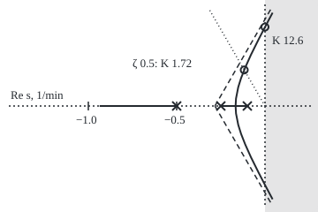
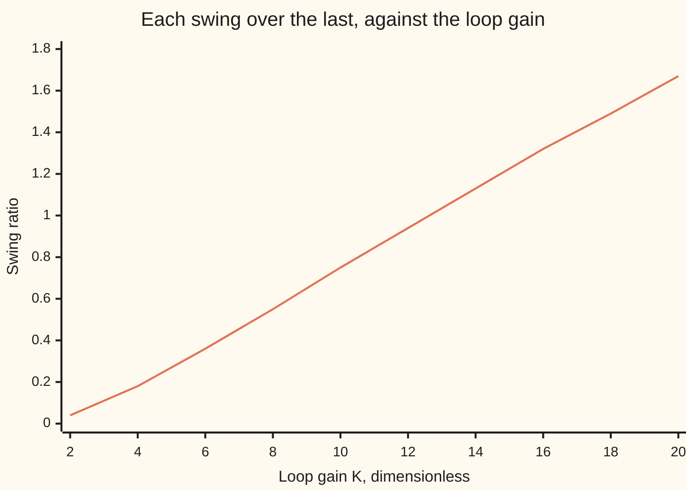
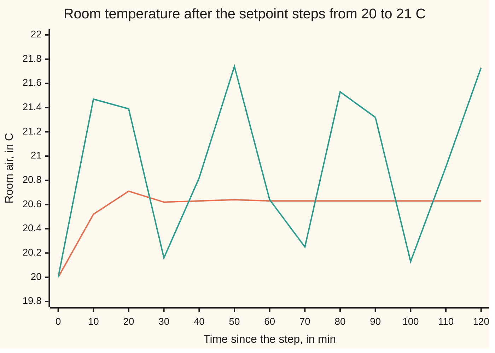

# Root locus: watch the closed-loop poles travel as you turn the gain up

Engineering mathematics → Feedback Control → Poles against gain → Root locus

---

## General Overview

A room is heated by a radiator fed through a slow pipe. A thermostat compares the air with the setpoint and opens the boiler in proportion to the shortfall. The room loses 100 W per degree above the outside air, so 1 kW of steady heat holds it 10.0 °C warmer. The pipe, the radiator's metal and the air each lag behind what feeds them, by about 2, 4 and 10 minutes.

The engineer has one dial: the thermostat's gain, in kilowatts per degree of shortfall. Turn it up and the room answers faster. Turn it too far and the room swings, each swing bigger than the last. Three questions decide the setting. Where do the swings stop dying out? Which gain gives a chosen damping? What does that gain cost in accuracy? For this room: a loop gain of 12.6, or 1.26 kW per °C, puts the room on a steady 14.05-minute swing. A loop gain of 1.7226 gives a damping ratio of 0.5, and with it the room settles at 20.63 °C when the setpoint goes from 20 to 21 °C.

All three answers come from the closed-loop **poles**, the rates inside the exponentials that make up the response. As the dial turns, the poles move through the complex plane. The curves they trace are the **root locus**. Walter Evans showed in 1948 that these curves can be sketched from the open loop alone, by a handful of rules, without solving for a root.

**Every closed-loop pole solves one equation, loop gain = −1; its angle half fixes where poles can ever be, its size half says which gain puts them there, so the poles for every gain can be drawn from the open-loop poles and zeros and read for stability and damping.**

**What kind of fact this is:** a method for solving the closed-loop equation for every gain at once; its sketching rules are theorems about polynomial roots, proved on this card in Why it works.

### The picture: the locus of the room's poles, to scale

Real part of s across, imaginary part up, 200 px per 1/min, origin at the right. Crosses are the open-loop poles; heavy lines are the locus for loop gains 0 to 20; the shaded strip is the right half-plane, where swings grow.

<p align="center"></p>

The poles at −0.25 and −0.1 1/min run together along the axis, meet at −0.1667 at gain 0.148148, and split into a pair. The pair crosses the dotted damping ray ζ = 0.5 at gain 1.72 and the imaginary axis at gain 12.6. The third pole runs left from −0.5 to −0.9360 at gain 20. The dashed lines are the asymptotes from the centroid, −0.2833.

---

## The formula

Reminders. A **pole** is a value of s where a transfer function's denominator vanishes; each is the rate of one mode of the response, and a **zero** is where the numerator vanishes ([poles-zeros-and-stability](../02-Linear%20Systems%20and%20Transforms/03-poles-zeros-and-stability.md)). The **loop gain** $L(s)$ is everything met once round the loop ([feedback-and-closed-loop-transfer-functions](01-feedback-and-closed-loop-transfer-functions.md)). Engineers write j for the square root of −1; the rest of the library writes i.

Write the loop gain as one dial $K$ times a fixed shape:

$$L(s) = K\,\frac{N(s)}{D(s)} = K\,\frac{b\,\prod_{k=1}^{m}(s - z_k)}{a\,\prod_{i=1}^{n}(s - p_i)}.$$

Here $N$ and $D$ are polynomials with leading coefficients $b$ and $a$, $z_k$ are the $m$ open-loop zeros and $p_i$ the $n$ open-loop poles. The index is k, not j, because j is the square root of −1.

The closed-loop poles are the roots of $1 + L(s) = 0$, that is $D(s) + K\,N(s) = 0$. Split it into angle and size:

$$\sum_{k=1}^{m} \angle(s - z_k) - \sum_{i=1}^{n} \angle(s - p_i) = (2q + 1)\,\pi, \qquad K = \frac{a}{b}\,\frac{\prod_i \lvert s - p_i\rvert}{\prod_k \lvert s - z_k\rvert},$$

with q any integer.

**Read it aloud:** a point is a closed-loop pole for some positive gain exactly when the angles from the zeros minus the angles from the poles make an odd number of half turns (π radians, 180°); the gain that puts it there is a/b, the ratio of the leading coefficients (80 here), times the product of distances to the poles over the product of distances to the zeros.

For the room there are no zeros, and

$$D(s) = (T_1 s + 1)(T_2 s + 1)(T_3 s + 1) = 80\,s^3 + 68\,s^2 + 16\,s + 1, \qquad D(s) + K = 0.$$

The sketching rules, each proved in Why it works:

1. **Start and end.** The $n$ branches start at the open-loop poles at $K = 0$ and end at the $m$ zeros or at infinity.
2. **Real axis.** A real point is on the locus when an odd number of real poles and zeros lie to its right.
3. **Asymptotes.** The $n - m$ branches that leave follow lines from the centroid $\sigma_a$ at angles $\phi_q$:
$$\sigma_a = \frac{\sum_i p_i - \sum_k z_k}{n - m}, \qquad \phi_q = \frac{(2q + 1)\,180^\circ}{n - m}, \quad q = 0, 1, \ldots, n - m - 1.$$
4. **Breakaway.** Branches meet on the axis and split where $dK/ds = 0$, with $K = -D(s)/N(s)$.
5. **Crossing.** Put $s = j\omega$ in $D + K N = 0$; real and imaginary parts give $\omega$ and $K$.
6. **Damping ray.** A pair with damping ratio $\zeta$ lies on the ray from the origin at angle $\arccos \zeta$ from the negative real axis.

A seventh rule, the angle at which a branch leaves a complex open-loop pole, is the angle condition applied just beside that pole; the room has no complex open-loop poles, so it is not needed here.

| Symbol | Plain meaning | In our example | Push it up and the answer… |
| --- | --- | --- | --- |
| $s$ | rate of a test exponential e^(st), in 1/min; complex | any point of the plane | — |
| $L(s)$ | loop gain, thermostat times room | 12.6 / D(s) at the crossing | — |
| $K$ | the dial: loop gain at zero frequency, dimensionless | 0 to 20 | poles move along the locus |
| $k_c$ | thermostat gain, kW per °C; $k_c = K / G_0$ | 0.1723 at ζ = 0.5 | faster, then swinging |
| $G_0$, $y$, $u$ | room's steady rise per kW; room's rise, °C; boiler heat, kW | 10.0 °C per kW | acts like more $K$ |
| $T_1$, $T_2$, $T_3$ | lags of pipe, radiator, air, in min | 2, 4, 10 | crossing gain moves |
| $D(s)$, $N(s)$, $a$, $b$ | the loop shape's denominator and numerator, and their leading coefficients | a = 80, N = b = 1 | — |
| $p_i$, $z_k$, $n$, $m$, $s_0$ | open-loop poles and zeros in 1/min, how many, and a double root | −0.5, −0.25, −0.1; none; n = 3 | — |
| $\sigma_a$, $\phi_q$, $q$, $\theta$ | asymptotes' centroid in 1/min, their angles, index, and the direction of a far point | −0.2833; 60°, 180°, 300° | — |
| $\omega$ | where a branch crosses the imaginary axis, rad/min | 0.4472 | — |
| $\zeta$, $\omega_n$ | damping ratio and natural frequency of a pair | 0.5; 0.2353 rad/min | ζ falls as K rises |
| $\sigma$, $\omega_d$, $p_3$ | the pair as −σ ± jω_d, and the third pole | 0.1176, 0.2038, −0.6147 | — |

### When it holds

- **One gain moves, all else fixed.** Change a lag as well and the whole picture shifts.
- **A rational loop.** A pure delay is not a ratio of polynomials and gives infinitely many branches. Treat the 2-minute pipe as a delay and the crossing falls from 12.6 to 7.8106; at gain 10 swings then grow by a factor of 1.5743 per cycle ([smith-predictor-and-time-delays](10-smith-predictor-and-time-delays.md)).
- **A linear room.** A boiler cannot give negative heat or exceed its rating; swings the model calls growing are clipped into a steady cycle.
- **Positive gain.** For negative K the angle condition becomes an even number of half turns and the locus fills the other axis segments; −0.4000 belongs there, at gain −0.3600.
- **A dominant pair.** Reading damping off one pair ignores the third pole; here it moves the overshoot from 16.30% to 14.90%.

---

## Why it works

### Step 0: one complex equation, split in two

A closed-loop pole is where $L(s) = -1$. A complex number equals −1 exactly when its size is 1 and its angle is half a turn. A positive K has no angle, so the angle condition alone decides which points can ever be poles; the size condition then reads off the gain. Every rule below is the angle condition seen from a different distance.

### Step 1: turn the room into a loop

Call the room's rise y, in °C, and the boiler's heat u, in kW. The pipe water chases $G_0 u$ with lag $T_1$, the radiator chases the water with lag $T_2$, the air chases the radiator with lag $T_3$. Each lag is a factor $1/(T s + 1)$, so $y/u = G_0 / D(s)$. The thermostat sends $u = k_c\,(\text{setpoint} - y)$, so $L(s) = k_c G_0 / D(s) = K / D(s)$ and the closed loop's poles solve

$$80\,s^3 + 68\,s^2 + 16\,s + (1 + K) = 0.$$

Only the constant term moves with the dial. A root finder written out in the code gives the target the rules must hit:

| Loop gain K | Third pole, 1/min | The pair, 1/min |
| --- | --- | --- |
| 0 | −0.5000 | −0.1000 and −0.2500 |
| 1 | −0.5792 | −0.1354 ± 0.1576j |
| 4 | −0.6915 | −0.0793 ± 0.2900j |
| 8 | −0.7787 | −0.0357 ± 0.3784j |
| 16 | −0.8926 | +0.0213 ± 0.4874j |
| 20 | −0.9360 | +0.0430 ± 0.5278j |

Every row sums to −0.8500. A cubic's roots add to minus its second coefficient over its first, −68/80, and the dial never touches those. So as the pair drifts right, the third pole moves left twice as far.

### Step 2: start, end, and the real axis

At $K = 0$ the equation is $D(s) = 0$: branches start at the open-loop poles. As K grows, $K N(s)$ dominates, so roots approach the zeros of N; with fewer zeros than poles the spare branches go to infinity.

On the real axis, a complex pole pair's angles cancel. A real pole left of a real test point contributes 0; one to its right contributes 180°. The sum is an odd number of half turns exactly when an odd number lie to the right. At −0.15 one pole lies right: on the locus. At −0.4, two: off. At −1.0, three: on.

### Step 3: from far away, the poles look like one point

Far from the poles every vector to s points almost the same way, so $L(s) \approx K / (80\,(s - \sigma_a)^3)$, with $\sigma_a$ the poles' average, −0.2833. The angle condition becomes $3\theta = 180^\circ, 540^\circ, 900^\circ$: branches leave at 60°, 180° and 300°. Two asymptotes point into the right half-plane, so the pair must cross the imaginary axis at some finite gain.

<details>
<summary>The algebra behind this</summary>

Divide $D + K N$ by $a$. Its n roots add to minus its $s^{n-1}$ coefficient. When $n - m \ge 2$, $K N$ cannot reach $s^{n-1}$, so the sum stays $\sum p_i$ for every K. As K grows, m roots settle on the zeros, adding to $\sum z_k$; the other $n - m$ keep the rest, so their average stays $\sigma_a$. Their size grows like $K^{1/(n-m)}$, and the balance $s^{n-m} \approx -K b / a$ puts them at the $(n - m)$-th roots of a negative number: the angles $\phi_q$.

</details>

### Step 4: the breakaway is where the axis gain peaks

On the segment from −0.25 to −0.1 the gain at a real point is $K = -D(s)$. It is 0 at both ends and rises between. Each gain below the peak is met twice, one real pole on each side; at the peak the two meet; above it, no real point has that gain, so the pair leaves the axis. The peak is where

$$D'(s) = 240\,s^2 + 136\,s + 16 = 0 \quad\Longrightarrow\quad s = -0.166667 \ \text{or}\ -0.4000.$$

Step 2 rules out −0.4000, where the gain would be −0.3600. At −0.166667 the gain is 0.148148, and the third pole is −0.85 + 2 × 0.166667 = −0.5167.

<details>
<summary>Detailed proof: a breakaway needs dK/ds = 0</summary>

At a breakaway $P(s) = D(s) + K N(s)$ has a double root $s_0$, so $P(s_0) = 0$ and $P'(s_0) = 0$. The first gives $K = -D(s_0)/N(s_0)$. Put that into $D'(s_0) + K N'(s_0) = 0$: $D'(s_0) N(s_0) - D(s_0) N'(s_0) = 0$, the numerator of $d(-D/N)/ds$. The converse needs the gain read there to be positive, which is the test −0.4000 fails.

</details>

### Step 5: the crossing, from real and imaginary parts

Put $s = j\omega$ in $D(s) + K = 0$. With $s^2 = -\omega^2$ and $s^3 = -j\omega^3$:

$$(1 + K - 68\,\omega^2) + j\,(16\,\omega - 80\,\omega^3) = 0.$$

The imaginary part gives $\omega^2 = 16/80$, so $\omega = 0.4472$ rad/min, a swing period of 14.05 min. The real part gives $K = 68 \times 0.2 - 1 = 12.6$. The Routh table applied to this cubic finds the same 12.6 ([routh-hurwitz-criterion](04-routh-hurwitz-criterion.md); that card's workshop is a slower room, whose thermostat gain crosses at 12 kW per °C); the substitution also says where the crossing is.

Evans's check: the angles from the three poles to 0.4472j are 41.81°, 60.79° and 77.40°, adding to 180.00°, and $\lvert D(j\omega)\rvert = 12.6$.

### The picture: how much each swing shrinks or grows

The swing ratio is each swing's size over the one before, $e^{2\pi\,\mathrm{Re}\,p / \mathrm{Im}\,p}$ for the pair's upper pole p.



The line is the swing ratio from the root finder. It passes 1 at the crossing gain, 12.6. The simulated room, with no poles in sight, gives 0.1796 at gain 4, 1.0000 at 12.6 and 1.6680 at 20, matching the poles to four places.

### Step 6: pick the gain for a chosen damping

A pair $-\sigma \pm j\omega_d$ has damping ratio $\sigma/\sqrt{\sigma^2 + \omega_d^2}$, the cosine of its angle from the negative real axis ([second-order-systems-damping-and-natural-frequency](../02-Linear%20Systems%20and%20Transforms/06-second-order-systems-damping-and-natural-frequency.md)). For ζ = 0.5 the angle is 60°, the pair is $-\sigma \pm j\sigma\sqrt{3}$, and its factor is $s^2 + 2\sigma s + 4\sigma^2$. Write the cubic over 80 as that factor times $(s - p_3)$ and match:

- $s^2$: $2\sigma - p_3 = 0.85$.
- $s^1$: $4\sigma^2 - 2\sigma p_3 = 0.2$; with $p_3 = 2\sigma - 0.85$ the $\sigma^2$ terms cancel, leaving $1.7\,\sigma = 0.2$.

So the pair is $-0.1176 \pm 0.2038j$, the third pole is $-0.6147$, and the constant term gives $1 + K = 80 \times 4\sigma^2 \times 0.6147$: $K = 1.7226$, a thermostat gain of 0.1723 kW per °C, with $\omega_n = 2\sigma = 0.2353$ rad/min.

### The picture: the room after the setpoint goes from 20 to 21 °C



Orange: the room at the ζ = 0.5 gain, 1.7226, peaking at 20.7270 °C after 17.33 min and settling at 20.63 °C. Green: the room at the crossing gain, 12.6, swinging for good, its samples running between 20.13 and 21.74 °C. Both sampled every 10 min from the simulation.

The ζ = 0.5 room overshoots its final value by 14.90%; a lone pair with ζ = 0.5 would overshoot by $e^{-\pi\zeta/\sqrt{1-\zeta^2}} = 16.30\%$. The third pole, about five times farther left, trims the peak. The room settles at 0.6327 of the requested degree, $K/(1 + K)$, because a proportional thermostat needs a standing shortfall to keep the heat on ([steady-state-error-and-system-type](03-steady-state-error-and-system-type.md)). On this locus more accuracy means more gain, and more gain means less damping.

**Another route.** The Nyquist plot reads the same crossing off $L(j\omega)$: at 0.4472 rad/min and gain 12.6 the loop gain is exactly −1, and that frequency road also handles the delay the rules cannot ([nyquist-criterion-and-stability-margins](06-nyquist-criterion-and-stability-margins.md)).

---

## Worked numbers, by hand

| Step | Arithmetic | Value |
| --- | --- | --- |
| Open-loop poles | −1/T for T = 2, 4, 10 min | −0.5, −0.25, −0.1 1/min |
| Polynomial | (2s + 1)(4s + 1)(10s + 1) | 80 s^3 + 68 s^2 + 16 s + 1 |
| Real-axis locus | odd count to the right | −0.25 to −0.1; left of −0.5 |
| Centroid, angles | (−0.5 − 0.25 − 0.1)/3; 180° × (1, 3, 5)/3 | −0.2833 1/min; 60°, 180°, 300° |
| Breakaway | root of 240 s^2 + 136 s + 16 on the segment | −0.166667 1/min |
| Gain there | −D(−0.166667) | 0.148148 |
| Crossing | ω^2 = 16/80; K = 68 × 0.2 − 1 | 0.4472 rad/min; **12.6** |
| Swing period there | 2π/0.4472 | 14.05 min |
| ζ = 0.5 pair | σ = 0.2/1.7; −σ ± jσ√3 | −0.1176 ± 0.2038j |
| ζ = 0.5 gain | 80 × 4σ^2 × 0.6147 − 1 | **1.7226** |
| Thermostat | 1.7226/10 | 0.1723 kW per °C |

At the ζ = 0.5 setting a request for 21 °C brings the room to a peak of 20.7270 °C and a rest at 20.63 °C. At 1.26 kW per °C it swings forever every 14.05 min.

### What breaks if you drop a piece

| Mistake | Comes out at | What went wrong |
| --- | --- | --- |
| Taking the centroid for the breakaway | −0.2833 instead of −0.166667 | the centroid is where asymptotes meet; the breakaway is where the axis gain peaks |
| Modelling the pipe as a lag when it is a delay | safe limit 12.6 instead of 7.8106; swing ratio at K = 10 is 1.5743, not 0.7490 | a delay keeps adding phase lag; the lag model is optimistic |
| Reading ω = 0.4472 as cycles per minute | period 2.24 min instead of 14.05 min | ω is in rad/min: 0.0712 cycles per min |
| Using the lone-pair overshoot formula | 16.30% instead of 14.90% | the third pole at −0.6147 is too close to ignore |

---

## Code, from first principles, and it actually runs

Both programs take four roads. Road 1 is the rules in closed form. Road 2 is a Durand–Kerner root finder (it refines all three roots together), written out, swept over the gain with bisection, plus a golden-section search for the peak of the axis gain. Road 3 simulates pipe, radiator and room with a fourth-order Runge–Kutta step of 0.01 min and no transfer function; it reads ring period and swing ratio back from the simulated peaks and checks the step response against the residue sum to 1e-9 °C. Road 4 tests Evans's angle and size conditions at the points found. The delay case is solved by its phase condition, then simulated 0.3 below and above the gain it predicts.

### Python

```python
# Root locus: a room thermostat whose gain runs from 0 to 20. Standard library only.
# Roads: (1) the sketching rules in closed form; (2) a Durand-Kerner root finder swept with bisection;
# (3) RK4 simulation read back as ring period and swing ratio; (4) Evans's angle and magnitude conditions.
import math, cmath

T1, T2, T3 = 2.0, 4.0, 10.0          # time constants in min: pipe, radiator, room air
G0 = 10.0                            # room rise per kW of heat, degC per kW (loss 100 W per degC)
P = [-1 / T1, -1 / T2, -1 / T3]      # open-loop poles, 1/min
A3, A2, A1 = T1 * T2 * T3, T1 * T2 + T1 * T3 + T2 * T3, T1 + T2 + T3   # D(s) = 80 s^3 + 68 s^2 + 16 s + 1

def D(s):                            # (T1 s + 1)(T2 s + 1)(T3 s + 1), the characteristic part
    return ((A3 * s + A2) * s + A1) * s + 1.0

def roots(K):                        # roots of D(s) + K = 0 by Durand-Kerner: real pole first, then the pair
    c = [A2 / A3, A1 / A3, (1.0 + K) / A3]
    r = [complex(0.4, 0.9) ** i for i in range(3)]
    for _ in range(300):
        new = []
        for i in range(3):
            den = complex(1.0, 0.0)
            for j in range(3):
                if j != i:
                    den *= r[i] - r[j]
            new.append(r[i] - (((r[i] + c[0]) * r[i] + c[1]) * r[i] + c[2]) / den)
        r = new
    r.sort(key=lambda z: z.real)
    return [complex(r[0].real, 0.0)] + sorted(r[1:], key=lambda z: z.imag)

def bisect(f, lo, hi, n=100):        # f changes sign from negative at lo to positive at hi
    for _ in range(n):
        mid = (lo + hi) / 2
        lo, hi = (mid, hi) if f(mid) < 0 else (lo, mid)
    return (lo + hi) / 2
def angle_sum(s):                    # angles from each open-loop pole to the point s, in degrees
    return sum(math.degrees(cmath.phase(s - p)) for p in P)

def simulate(K, T, dt=0.01, delay=False):   # room's response to a 1 degC setpoint step
    kc, nd = K / G0, int(round(T1 / dt))    # thermostat gain in kW per degC; delay in steps
    x, err, out = [0.0, 0.0, 0.0], [], [0.0]
    def f(x, u):                     # delay=True: the pipe is a pure 2-min delay, not a lag
        return [(G0 * u - x[0]) / T1, ((G0 * u if delay else x[0]) - x[1]) / T2, (x[1] - x[2]) / T3]
    for i in range(int(round(T / dt))):
        err.append(1.0 - x[2])
        if delay:
            u0 = kc * err[i - nd] if i >= nd else 0.0
            u1 = kc * err[i + 1 - nd] if i + 1 >= nd else 0.0
            us = [u0, (u0 + u1) / 2, (u0 + u1) / 2, u1]
        def u(k, xs):
            return us[k] if delay else kc * (1.0 - xs[2])
        k1 = f(x, u(0, x))
        y = [x[j] + dt / 2 * k1[j] for j in range(3)]; k2 = f(y, u(1, y))
        y = [x[j] + dt / 2 * k2[j] for j in range(3)]; k3 = f(y, u(2, y))
        y = [x[j] + dt * k3[j] for j in range(3)];     k4 = f(y, u(3, y))
        x = [x[j] + dt / 6 * (k1[j] + 2 * k2[j] + 2 * k3[j] + k4[j]) for j in range(3)]
        out.append(x[2])
    return out

def swings(y, dt, K, t0=30.0):       # period and ratio of successive like peaks, after t0 min
    fin, pk = K / (1 + K), []
    for i in range(int(t0 / dt), len(y) - 1):
        if y[i] - y[i - 1] > 0 >= y[i + 1] - y[i]:   # a maximum; refine by a parabola
            a, b, c = y[i - 1], y[i], y[i + 1]
            h = (a - c) / (2 * (a - 2 * b + c))
            pk.append(((i + h) * dt, b - (a - c) * h / 4 - fin))
    return pk[1][0] - pk[0][0], pk[1][1] / pk[0][1]

fc = lambda z: f"{round(z.real, 6) + 0.0:+.4f} {round(z.imag, 6) + 0.0:+.4f}j"
print(f"room: {G0:.1f} degC per kW (heat loss {1000 / G0:.0f} W per degC); lags {T1:.0f}, {T2:.0f}, {T3:.0f} min; thermostat k_c = K / {G0:.0f} kW per degC")
print(f"open-loop poles {P[0]:+.4f} {P[1]:+.4f} {P[2]:+.4f} 1/min; D(s) = {A3:.0f} s^3 + {A2:.0f} s^2 + {A1:.0f} s + 1")
sig_a = sum(P) / 3
print(f"rule, asymptotes: centroid {sig_a:+.4f} 1/min, angles 60, 180, 300 deg")
sb = (-2 * A2 + math.sqrt(4 * A2 * A2 - 12 * A3 * A1)) / (6 * A3)       # D'(s) = 0 on (-0.25, -0.1)
gs = (math.sqrt(5) - 1) / 2                                            # road 2: golden-section peak of -D
lo, hi = P[1], P[2]
for _ in range(100):
    m1, m2 = hi - gs * (hi - lo), lo + gs * (hi - lo)
    lo, hi = (m1, hi) if -D(m1) < -D(m2) else (lo, m2)
print(f"breakaway: D'(s) = 0 at {sb:+.6f}, K = {-D(sb):.6f}; golden section {lo:+.6f}, K = {-D(lo):.6f}")
print(f"breakaway: third pole {sum(P) - 2 * sb:+.4f} 1/min; other root of D' {(-2 * A2 - math.sqrt(4 * A2 * A2 - 12 * A3 * A1)) / (6 * A3):+.4f} (off the locus: K there {-D(-0.4):+.4f})")
for K in (0.0, 1.0, 2.0, 4.0, 8.0, 16.0, 20.0):
    r = roots(K)
    print(f"gain K = {K:5.2f}: poles {fc(r[0])}  {fc(r[2])}  {fc(r[1])}  sum {sum(r).real:+.4f}")
w_c, K_c = math.sqrt(A1 / A3), A2 * A1 / A3 - 1.0
K_b = bisect(lambda K: roots(K)[2].real, 10.0, 20.0)
print(f"crossing, rules: omega = {w_c:.4f} rad/min, K = {K_c:.4f}, period {2 * math.pi / w_c:.2f} min")
print(f"crossing, root finder: K = {K_b:.4f}, omega = {roots(K_b)[2].imag:.4f} rad/min")
print(f"crossing, Evans: angle sum at j omega {angle_sum(complex(0, w_c)):.4f} deg, K = |D| = {abs(D(complex(0, w_c))):.4f}")
print("crossing: angles from the poles " + " + ".join(f"{math.degrees(cmath.phase(complex(0, w_c) - p)):.2f}" for p in P) + f" deg; thermostat {K_c / G0:.2f} kW per degC")
print(f"crossing: omega {w_c / 60:.6f} rad/s = {w_c / (2 * math.pi):.4f} cycles per min; misread as cycles per min, period {1 / w_c:.2f} min")
sz, p3 = A1 / (2 * A2), A1 / A2 - A2 / A3                              # pair -sz +- j sz sqrt3: zeta 0.5
K_z = -A3 * 4 * sz * sz * p3 - 1.0
K_zb, K_z7 = (bisect(lambda K: z + roots(K)[2].real / abs(roots(K)[2]), 0.2, 12.0) for z in (0.5, 0.7))
ray = lambda r: r * cmath.exp(1j * math.radians(120))
r_e = bisect(lambda r: angle_sum(ray(r)) - 180.0, 0.05, 0.5)
print(f"zeta 0.5, rules: pair {fc(complex(-sz, sz * math.sqrt(3)))}, third {p3:+.4f}, K = {K_z:.4f}")
print(f"zeta 0.5, root finder: K = {K_zb:.4f}; Evans on the 60 deg ray: K = |D| = {abs(D(ray(r_e))):.4f}")
print(f"zeta 0.5: thermostat {K_z / G0:.4f} kW per degC; omega_n {2 * sz:.4f} rad/min; settles at {K_z / (1 + K_z):.4f} degC per degC")
print(f"try, zeta 0.7: root finder K = {K_z7:.4f}; settles at {K_z7 / (1 + K_z7):.4f} degC per degC, {20 + K_z7 / (1 + K_z7):.2f} degC")
dt, rz = 0.01, roots(K_z)
ms = [(p, K_z / (A3 * p * math.prod(p - q for q in rz if q != p))) for p in rz]
yz = simulate(K_z, 120.0)
gap = max(abs(yz[i] - (K_z / (1 + K_z) + sum((rr * cmath.exp(p * i * dt)).real for p, rr in ms)))
          for i in range(len(yz)))
print(f"step response, residues vs RK4: largest gap below 1e-9 degC: {'yes' if gap < 1e-9 else 'NO'}")
ipk, fin = max(range(len(yz)), key=lambda i: yz[i]), K_z / (1 + K_z)
print(f"zeta 0.5 step: peak {20 + yz[ipk]:.4f} degC at {ipk * dt:.2f} min, overshoot {100 * (yz[ipk] / fin - 1):.2f} %, "
      f"pair alone {100 * math.exp(-math.pi / math.sqrt(3)):.2f} %")
y12 = simulate(12.6, 120.0)
print("chart, t (min)      " + " ".join(f"{10 * i:5d}" for i in range(13)))
print("chart, K = 1.72     " + " ".join(f"{20 + yz[1000 * i]:5.2f}" for i in range(13)))
print("chart, K = 12.6     " + " ".join(f"{20 + y12[1000 * i]:5.2f}" for i in range(13)))
print("chart, K            " + " ".join(f"{K:5d}" for K in range(2, 21, 2)))
print("chart, swing ratio  " + " ".join(f"{math.exp(2 * math.pi * roots(K)[2].real / roots(K)[2].imag):5.2f}" for K in range(2, 21, 2)))
sim = {}
for K in (4.0, 12.6, 20.0):
    per, rat = swings(simulate(K, 150.0), dt, K)
    q = roots(K)[2]
    sim[K] = (per, rat, 2 * math.pi / q.imag, math.exp(2 * math.pi * q.real / q.imag))
    print(f"K = {K:4.1f}: simulated period {per:.3f} min, swing ratio {rat:.4f}; poles say {sim[K][2]:.3f} min, {sim[K][3]:.4f}")
wd = bisect(lambda w: math.atan(T2 * w) + math.atan(T3 * w) + T1 * w - math.pi, 0.01, 1.0)
K_d = math.sqrt((1 + (T2 * wd) ** 2) * (1 + (T3 * wd) ** 2))
rd = [swings(simulate(K, 200.0, delay=True), dt, K)[1] for K in (K_d - 0.3, K_d + 0.3, 10.0)]
print(f"pipe as a 2-min delay: crossing omega {wd:.4f} rad/min, K = {K_d:.4f}")
q = roots(10.0)[2]
print(f"pipe as a delay, simulated swing ratio: K = {K_d - 0.3:.2f} {rd[0]:.4f}, K = {K_d + 0.3:.2f} {rd[1]:.4f}, K = 10 {rd[2]:.4f}; "
      f"lag model K = 10 {math.exp(2 * math.pi * q.real / q.imag):.4f}")
px = lambda z: f"({300 + 200 * z.real:.1f},{120 - 200 * z.imag:.1f})"
print("figure, 200 px per 1/min, upper branch: " + " ".join(px(roots(K)[2]) for K in (0.2, 0.5, 1, 2, 4, 8, 12.6, 20)))
print(f"figure, real branch to {px(roots(20.0)[0])}; breakaway {px(complex(sb, 0))}; centroid {px(complex(sig_a, 0))}; "
      f"zeta point {px(ray(r_e))}; crossing {px(complex(0, w_c))}")

assert abs(K_b - K_c) < 1e-9, "root finder's crossing gain matches the rules"
assert abs(lo - sb) < 1e-6, "golden-section peak matches the breakaway from D'(s) = 0"
assert abs(angle_sum(complex(0, w_c)) - 180.0) < 1e-9, "Evans angle condition holds at the crossing"
assert abs(K_zb - K_z) < 1e-9, "root finder matches the rules on the zeta 0.5 gain"
assert abs(abs(D(ray(r_e))) - K_z) < 1e-9, "Evans's ray search matches the rules on the zeta 0.5 gain"
assert gap < 1e-9, "RK4 simulation matches the residue sum"
assert all(abs(sim[K][0] - sim[K][2]) < 1e-3 and abs(sim[K][1] - sim[K][3]) < 1e-3 for K in sim), "simulated rings match the poles"
assert rd[0] < 1.0 < rd[1], "simulated delay loop decays 0.3 below the frequency road's gain and grows 0.3 above"
print("ALL CHECKS PASS")
```

**Ran 2026-10-06 on macOS, Python 3.14.6, standard library only. All checks passed. Output, pasted from the run:**

```
room: 10.0 degC per kW (heat loss 100 W per degC); lags 2, 4, 10 min; thermostat k_c = K / 10 kW per degC
open-loop poles -0.5000 -0.2500 -0.1000 1/min; D(s) = 80 s^3 + 68 s^2 + 16 s + 1
rule, asymptotes: centroid -0.2833 1/min, angles 60, 180, 300 deg
breakaway: D'(s) = 0 at -0.166667, K = 0.148148; golden section -0.166667, K = 0.148148
breakaway: third pole -0.5167 1/min; other root of D' -0.4000 (off the locus: K there -0.3600)
gain K =  0.00: poles -0.5000 +0.0000j  -0.1000 +0.0000j  -0.2500 +0.0000j  sum -0.8500
gain K =  1.00: poles -0.5792 +0.0000j  -0.1354 +0.1576j  -0.1354 -0.1576j  sum -0.8500
gain K =  2.00: poles -0.6263 +0.0000j  -0.1119 +0.2176j  -0.1119 -0.2176j  sum -0.8500
gain K =  4.00: poles -0.6915 +0.0000j  -0.0793 +0.2900j  -0.0793 -0.2900j  sum -0.8500
gain K =  8.00: poles -0.7787 +0.0000j  -0.0357 +0.3784j  -0.0357 -0.3784j  sum -0.8500
gain K = 16.00: poles -0.8926 +0.0000j  +0.0213 +0.4874j  +0.0213 -0.4874j  sum -0.8500
gain K = 20.00: poles -0.9360 +0.0000j  +0.0430 +0.5278j  +0.0430 -0.5278j  sum -0.8500
crossing, rules: omega = 0.4472 rad/min, K = 12.6000, period 14.05 min
crossing, root finder: K = 12.6000, omega = 0.4472 rad/min
crossing, Evans: angle sum at j omega 180.0000 deg, K = |D| = 12.6000
crossing: angles from the poles 41.81 + 60.79 + 77.40 deg; thermostat 1.26 kW per degC
crossing: omega 0.007454 rad/s = 0.0712 cycles per min; misread as cycles per min, period 2.24 min
zeta 0.5, rules: pair -0.1176 +0.2038j, third -0.6147, K = 1.7226
zeta 0.5, root finder: K = 1.7226; Evans on the 60 deg ray: K = |D| = 1.7226
zeta 0.5: thermostat 0.1723 kW per degC; omega_n 0.2353 rad/min; settles at 0.6327 degC per degC
try, zeta 0.7: root finder K = 0.8308; settles at 0.4538 degC per degC, 20.45 degC
step response, residues vs RK4: largest gap below 1e-9 degC: yes
zeta 0.5 step: peak 20.7270 degC at 17.33 min, overshoot 14.90 %, pair alone 16.30 %
chart, t (min)          0    10    20    30    40    50    60    70    80    90   100   110   120
chart, K = 1.72     20.00 20.52 20.71 20.62 20.63 20.64 20.63 20.63 20.63 20.63 20.63 20.63 20.63
chart, K = 12.6     20.00 21.47 21.39 20.16 20.82 21.74 20.64 20.25 21.53 21.32 20.13 20.91 21.73
chart, K                2     4     6     8    10    12    14    16    18    20
chart, swing ratio   0.04  0.18  0.36  0.55  0.75  0.94  1.13  1.32  1.49  1.67
K =  4.0: simulated period 21.666 min, swing ratio 0.1796; poles say 21.666 min, 0.1796
K = 12.6: simulated period 14.050 min, swing ratio 1.0000; poles say 14.050 min, 1.0000
K = 20.0: simulated period 11.904 min, swing ratio 1.6680; poles say 11.904 min, 1.6680
pipe as a 2-min delay: crossing omega 0.4010 rad/min, K = 7.8106
pipe as a delay, simulated swing ratio: K = 7.51 0.9288, K = 8.11 1.0731, K = 10 1.5743; lag model K = 10 0.7490
figure, 200 px per 1/min, upper branch: (267.2,111.5) (269.7,98.7) (272.9,88.5) (277.6,76.5) (284.1,62.0) (292.9,44.3) (300.0,30.6) (308.6,14.4)
figure, real branch to (112.8,120.0); breakaway (266.7,120.0); centroid (243.3,120.0); zeta point (276.5,79.2); crossing (300.0,30.6)
ALL CHECKS PASS
```

### Rust

```rust
// Root locus: a room thermostat whose gain runs from 0 to 20. Rust std only.
// Roads: (1) the sketching rules in closed form; (2) a Durand-Kerner root finder swept with bisection;
// (3) RK4 simulation read back as ring period and swing ratio; (4) Evans's angle and magnitude conditions.
use std::f64::consts::PI;
use std::ops::{Add, Div, Mul, Sub};

#[derive(Clone, Copy, PartialEq)]
struct C { re: f64, im: f64 }
fn c(re: f64, im: f64) -> C { C { re, im } }
impl Add for C { type Output = C; fn add(self, o: C) -> C { c(self.re + o.re, self.im + o.im) } }
impl Sub for C { type Output = C; fn sub(self, o: C) -> C { c(self.re - o.re, self.im - o.im) } }
impl Mul for C { type Output = C; fn mul(self, o: C) -> C { c(self.re * o.re - self.im * o.im, self.re * o.im + self.im * o.re) } }
impl Div for C { type Output = C; fn div(self, o: C) -> C { let d = o.re * o.re + o.im * o.im; c((self.re * o.re + self.im * o.im) / d, (self.im * o.re - self.re * o.im) / d) } }
impl C { // size, angle, e^z, and scaling by a real number
    fn abs(self) -> f64 { self.re.hypot(self.im) } fn arg(self) -> f64 { self.im.atan2(self.re) }
    fn exp(self) -> C { let m = self.re.exp(); c(m * self.im.cos(), m * self.im.sin()) } fn sc(self, k: f64) -> C { c(self.re * k, self.im * k) }
}

const T1: f64 = 2.0; const T2: f64 = 4.0; const T3: f64 = 10.0; // time constants in min
const G0: f64 = 10.0;                                             // degC per kW of heat
const P: [f64; 3] = [-1.0 / T1, -1.0 / T2, -1.0 / T3];            // open-loop poles, 1/min
const A3: f64 = T1 * T2 * T3; const A2: f64 = T1 * T2 + T1 * T3 + T2 * T3; const A1: f64 = T1 + T2 + T3;

fn d(s: C) -> C { ((s.sc(A3) + c(A2, 0.0)) * s + c(A1, 0.0)) * s + c(1.0, 0.0) }

fn roots(k: f64) -> [C; 3] { // Durand-Kerner on D(s) + K = 0: real pole first, then the pair (lower, upper)
    let cf = [A2 / A3, A1 / A3, (1.0 + k) / A3];
    let z = c(0.4, 0.9);
    let mut r = [c(1.0, 0.0), z, z * z];
    for _ in 0..300 {
        let mut nw = r;
        for i in 0..3 {
            let mut den = c(1.0, 0.0);
            for j in 0..3 { if j != i { den = den * (r[i] - r[j]); } }
            nw[i] = r[i] - (((r[i] + c(cf[0], 0.0)) * r[i] + c(cf[1], 0.0)) * r[i] + c(cf[2], 0.0)) / den;
        }
        r = nw;
    }
    r.sort_by(|a, b| a.re.partial_cmp(&b.re).unwrap());
    let (lo, up) = if r[1].im <= r[2].im { (r[1], r[2]) } else { (r[2], r[1]) };
    [c(r[0].re, 0.0), lo, up]
}

fn bisect<F: Fn(f64) -> f64>(f: F, mut lo: f64, mut hi: f64) -> f64 {
    for _ in 0..100 { let m = (lo + hi) / 2.0; if f(m) < 0.0 { lo = m } else { hi = m } }
    (lo + hi) / 2.0
}
fn angle_sum(s: C) -> f64 { P.iter().map(|&p| (s - c(p, 0.0)).arg().to_degrees()).sum() }

fn simulate(k: f64, t: f64, delay: bool) -> Vec<f64> { // room's response to a 1 degC setpoint step
    let dt = 0.01; let kc = k / G0; let nd = (T1 / dt).round() as usize;
    let f = |x: [f64; 3], u: f64| -> [f64; 3] {
        [(G0 * u - x[0]) / T1, ((if delay { G0 * u } else { x[0] }) - x[1]) / T2, (x[1] - x[2]) / T3]
    };
    let (mut x, mut err, mut out) = ([0.0f64; 3], Vec::new(), vec![0.0]);
    for i in 0..(t / dt).round() as usize {
        err.push(1.0 - x[2]);
        let u0 = if delay && i >= nd { kc * err[i - nd] } else { 0.0 };
        let u1 = if delay && i + 1 >= nd { kc * err[i + 1 - nd] } else { 0.0 };
        let us = [u0, (u0 + u1) / 2.0, (u0 + u1) / 2.0, u1];
        let u = |n: usize, xs: [f64; 3]| if delay { us[n] } else { kc * (1.0 - xs[2]) };
        let step = |a: [f64; 3], b: [f64; 3], h: f64| [a[0] + h * b[0], a[1] + h * b[1], a[2] + h * b[2]];
        let k1 = f(x, u(0, x));
        let y = step(x, k1, dt / 2.0); let k2 = f(y, u(1, y));
        let y = step(x, k2, dt / 2.0); let k3 = f(y, u(2, y));
        let y = step(x, k3, dt); let k4 = f(y, u(3, y));
        for j in 0..3 { x[j] += dt / 6.0 * (k1[j] + 2.0 * k2[j] + 2.0 * k3[j] + k4[j]); }
        out.push(x[2]);
    }
    out
}

fn swings(y: &[f64], dt: f64, k: f64) -> (f64, f64) { // period and ratio of successive like peaks after 30 min
    let fin = k / (1.0 + k);
    let mut pk: Vec<(f64, f64)> = Vec::new();
    for i in (30.0 / dt) as usize..y.len() - 1 {
        if y[i] - y[i - 1] > 0.0 && 0.0 >= y[i + 1] - y[i] {
            let (a, b, cc) = (y[i - 1], y[i], y[i + 1]);
            let h = (a - cc) / (2.0 * (a - 2.0 * b + cc));
            pk.push(((i as f64 + h) * dt, b - (a - cc) * h / 4.0 - fin));
        }
    }
    (pk[1].0 - pk[0].0, pk[1].1 / pk[0].1)
}

fn r6(x: f64) -> f64 { (x * 1e6).round() / 1e6 + 0.0 }
fn fc(z: C) -> String { format!("{:+.4} {:+.4}j", r6(z.re), r6(z.im)) }
fn ratio(q: C) -> f64 { (2.0 * PI * q.re / q.im).exp() }
fn px(z: C) -> String { format!("({:.1},{:.1})", 300.0 + 200.0 * z.re, 120.0 - 200.0 * z.im) }

fn main() {
    println!("room: {:.1} degC per kW (heat loss {:.0} W per degC); lags {:.0}, {:.0}, {:.0} min; thermostat k_c = K / {:.0} kW per degC", G0, 1000.0 / G0, T1, T2, T3, G0);
    println!("open-loop poles {:+.4} {:+.4} {:+.4} 1/min; D(s) = {:.0} s^3 + {:.0} s^2 + {:.0} s + 1", P[0], P[1], P[2], A3, A2, A1);
    let sig_a = P.iter().sum::<f64>() / 3.0;
    println!("rule, asymptotes: centroid {:+.4} 1/min, angles 60, 180, 300 deg", sig_a);
    let disc = (4.0 * A2 * A2 - 12.0 * A3 * A1).sqrt();
    let sb = (-2.0 * A2 + disc) / (6.0 * A3);
    let (gs, mut lo, mut hi) = ((5.0f64.sqrt() - 1.0) / 2.0, P[1], P[2]);
    let nd = |s: f64| -d(c(s, 0.0)).re;
    for _ in 0..100 {
        let (m1, m2) = (hi - gs * (hi - lo), lo + gs * (hi - lo));
        if nd(m1) < nd(m2) { lo = m1 } else { hi = m2 }
    }
    println!("breakaway: D'(s) = 0 at {:+.6}, K = {:.6}; golden section {:+.6}, K = {:.6}", sb, nd(sb), lo, nd(lo));
    println!("breakaway: third pole {:+.4} 1/min; other root of D' {:+.4} (off the locus: K there {:+.4})", P.iter().sum::<f64>() - 2.0 * sb, (-2.0 * A2 - disc) / (6.0 * A3), nd(-0.4));
    for k in [0.0, 1.0, 2.0, 4.0, 8.0, 16.0, 20.0] {
        let r = roots(k);
        println!("gain K = {:5.2}: poles {}  {}  {}  sum {:+.4}", k, fc(r[0]), fc(r[2]), fc(r[1]), r[0].re + r[1].re + r[2].re);
    }
    let (w_c, k_c) = ((A1 / A3).sqrt(), A2 * A1 / A3 - 1.0);
    let k_b = bisect(|k| roots(k)[2].re, 10.0, 20.0);
    println!("crossing, rules: omega = {:.4} rad/min, K = {:.4}, period {:.2} min", w_c, k_c, 2.0 * PI / w_c);
    println!("crossing, root finder: K = {:.4}, omega = {:.4} rad/min", k_b, roots(k_b)[2].im);
    println!("crossing, Evans: angle sum at j omega {:.4} deg, K = |D| = {:.4}", angle_sum(c(0.0, w_c)), d(c(0.0, w_c)).abs());
    let ang: Vec<String> = P.iter().map(|&p| format!("{:.2}", (c(0.0, w_c) - c(p, 0.0)).arg().to_degrees())).collect();
    println!("crossing: angles from the poles {} deg; thermostat {:.2} kW per degC", ang.join(" + "), k_c / G0);
    println!("crossing: omega {:.6} rad/s = {:.4} cycles per min; misread as cycles per min, period {:.2} min", w_c / 60.0, w_c / (2.0 * PI), 1.0 / w_c);
    let (sz, p3) = (A1 / (2.0 * A2), A1 / A2 - A2 / A3); // pair -sz +- j sz sqrt3: zeta 0.5
    let k_z = -A3 * 4.0 * sz * sz * p3 - 1.0;
    let [k_zb, k_z7] = [0.5, 0.7].map(|z| bisect(|k| { let q = roots(k)[2]; z + q.re / q.abs() }, 0.2, 12.0));
    let th = 120.0f64.to_radians(); let ray = |r: f64| c(r * th.cos(), r * th.sin());
    let r_e = bisect(|r| angle_sum(ray(r)) - 180.0, 0.05, 0.5);
    println!("zeta 0.5, rules: pair {}, third {:+.4}, K = {:.4}", fc(c(-sz, sz * 3.0f64.sqrt())), p3, k_z);
    println!("zeta 0.5, root finder: K = {:.4}; Evans on the 60 deg ray: K = |D| = {:.4}", k_zb, d(ray(r_e)).abs());
    println!("zeta 0.5: thermostat {:.4} kW per degC; omega_n {:.4} rad/min; settles at {:.4} degC per degC", k_z / G0, 2.0 * sz, k_z / (1.0 + k_z));
    println!("try, zeta 0.7: root finder K = {:.4}; settles at {:.4} degC per degC, {:.2} degC", k_z7, k_z7 / (1.0 + k_z7), 20.0 + k_z7 / (1.0 + k_z7));
    let (dt, rz, fin) = (0.01, roots(k_z), k_z / (1.0 + k_z));
    let ms: Vec<(C, C)> = rz.iter().map(|&p| {
        let mut den = p.sc(A3);
        for &q in rz.iter() { if q != p { den = den * (p - q); } }
        (p, c(k_z, 0.0) / den)
    }).collect();
    let yz = simulate(k_z, 120.0, false);
    let gap = (0..yz.len()).map(|i| (yz[i] - (fin + ms.iter().map(|&(p, rr)| (rr * p.sc(i as f64 * dt).exp()).re).sum::<f64>())).abs()).fold(0.0, f64::max);
    println!("step response, residues vs RK4: largest gap below 1e-9 degC: {}", if gap < 1e-9 { "yes" } else { "NO" });
    let ipk = (0..yz.len()).fold(0, |b, i| if yz[i] > yz[b] { i } else { b });
    println!("zeta 0.5 step: peak {:.4} degC at {:.2} min, overshoot {:.2} %, pair alone {:.2} %", 20.0 + yz[ipk], ipk as f64 * dt, 100.0 * (yz[ipk] / fin - 1.0), 100.0 * (-PI / 3.0f64.sqrt()).exp());
    let y12 = simulate(12.6, 120.0, false);
    let row = |v: Vec<String>| v.join(" ");
    println!("chart, t (min)      {}", row((0..13).map(|i| format!("{:5}", 10 * i)).collect()));
    println!("chart, K = 1.72     {}", row((0..13).map(|i| format!("{:5.2}", 20.0 + yz[1000 * i])).collect()));
    println!("chart, K = 12.6     {}", row((0..13).map(|i| format!("{:5.2}", 20.0 + y12[1000 * i])).collect()));
    println!("chart, K            {}", row((1..11).map(|i| format!("{:5}", 2 * i)).collect()));
    println!("chart, swing ratio  {}", row((1..11).map(|i| format!("{:5.2}", ratio(roots(2.0 * i as f64)[2]))).collect()));
    let mut sim = Vec::new();
    for k in [4.0, 12.6, 20.0] {
        let (per, rat) = swings(&simulate(k, 150.0, false), dt, k);
        let q = roots(k)[2];
        sim.push((per, rat, 2.0 * PI / q.im, ratio(q)));
        println!("K = {:4.1}: simulated period {:.3} min, swing ratio {:.4}; poles say {:.3} min, {:.4}", k, per, rat, 2.0 * PI / q.im, ratio(q));
    }
    let wd = bisect(|w| (T2 * w).atan() + (T3 * w).atan() + T1 * w - PI, 0.01, 1.0);
    let k_d = ((1.0 + (T2 * wd).powi(2)) * (1.0 + (T3 * wd).powi(2))).sqrt();
    let rd: Vec<f64> = [k_d - 0.3, k_d + 0.3, 10.0].iter().map(|&k| swings(&simulate(k, 200.0, true), dt, k).1).collect();
    println!("pipe as a 2-min delay: crossing omega {:.4} rad/min, K = {:.4}", wd, k_d);
    println!("pipe as a delay, simulated swing ratio: K = {:.2} {:.4}, K = {:.2} {:.4}, K = 10 {:.4}; lag model K = 10 {:.4}", k_d - 0.3, rd[0], k_d + 0.3, rd[1], rd[2], ratio(roots(10.0)[2]));
    let ub: Vec<String> = [0.2, 0.5, 1.0, 2.0, 4.0, 8.0, 12.6, 20.0].iter().map(|&k| px(roots(k)[2])).collect();
    println!("figure, 200 px per 1/min, upper branch: {}", ub.join(" "));
    println!("figure, real branch to {}; breakaway {}; centroid {}; zeta point {}; crossing {}", px(roots(20.0)[0]), px(c(sb, 0.0)), px(c(sig_a, 0.0)), px(ray(r_e)), px(c(0.0, w_c)));

    assert!((k_b - k_c).abs() < 1e-9, "root finder's crossing gain matches the rules");
    assert!((lo - sb).abs() < 1e-6, "golden-section peak matches the breakaway from D'(s) = 0");
    assert!((angle_sum(c(0.0, w_c)) - 180.0).abs() < 1e-9, "Evans angle condition holds at the crossing");
    assert!((k_zb - k_z).abs() < 1e-9, "root finder matches the rules on the zeta 0.5 gain");
    assert!((d(ray(r_e)).abs() - k_z).abs() < 1e-9, "Evans's ray search matches the rules on the zeta 0.5 gain");
    assert!(gap < 1e-9, "RK4 simulation matches the residue sum");
    assert!(sim.iter().all(|s| (s.0 - s.2).abs() < 1e-3 && (s.1 - s.3).abs() < 1e-3), "simulated rings match the poles");
    assert!(rd[0] < 1.0 && 1.0 < rd[1], "simulated delay loop decays 0.3 below the frequency road's gain and grows 0.3 above");
    println!("ALL CHECKS PASS");
}
```

**Ran 2026-10-06 on macOS, rustc 1.98.1, no crates. All checks passed. Output, pasted from the run:**

```
room: 10.0 degC per kW (heat loss 100 W per degC); lags 2, 4, 10 min; thermostat k_c = K / 10 kW per degC
open-loop poles -0.5000 -0.2500 -0.1000 1/min; D(s) = 80 s^3 + 68 s^2 + 16 s + 1
rule, asymptotes: centroid -0.2833 1/min, angles 60, 180, 300 deg
breakaway: D'(s) = 0 at -0.166667, K = 0.148148; golden section -0.166667, K = 0.148148
breakaway: third pole -0.5167 1/min; other root of D' -0.4000 (off the locus: K there -0.3600)
gain K =  0.00: poles -0.5000 +0.0000j  -0.1000 +0.0000j  -0.2500 +0.0000j  sum -0.8500
gain K =  1.00: poles -0.5792 +0.0000j  -0.1354 +0.1576j  -0.1354 -0.1576j  sum -0.8500
gain K =  2.00: poles -0.6263 +0.0000j  -0.1119 +0.2176j  -0.1119 -0.2176j  sum -0.8500
gain K =  4.00: poles -0.6915 +0.0000j  -0.0793 +0.2900j  -0.0793 -0.2900j  sum -0.8500
gain K =  8.00: poles -0.7787 +0.0000j  -0.0357 +0.3784j  -0.0357 -0.3784j  sum -0.8500
gain K = 16.00: poles -0.8926 +0.0000j  +0.0213 +0.4874j  +0.0213 -0.4874j  sum -0.8500
gain K = 20.00: poles -0.9360 +0.0000j  +0.0430 +0.5278j  +0.0430 -0.5278j  sum -0.8500
crossing, rules: omega = 0.4472 rad/min, K = 12.6000, period 14.05 min
crossing, root finder: K = 12.6000, omega = 0.4472 rad/min
crossing, Evans: angle sum at j omega 180.0000 deg, K = |D| = 12.6000
crossing: angles from the poles 41.81 + 60.79 + 77.40 deg; thermostat 1.26 kW per degC
crossing: omega 0.007454 rad/s = 0.0712 cycles per min; misread as cycles per min, period 2.24 min
zeta 0.5, rules: pair -0.1176 +0.2038j, third -0.6147, K = 1.7226
zeta 0.5, root finder: K = 1.7226; Evans on the 60 deg ray: K = |D| = 1.7226
zeta 0.5: thermostat 0.1723 kW per degC; omega_n 0.2353 rad/min; settles at 0.6327 degC per degC
try, zeta 0.7: root finder K = 0.8308; settles at 0.4538 degC per degC, 20.45 degC
step response, residues vs RK4: largest gap below 1e-9 degC: yes
zeta 0.5 step: peak 20.7270 degC at 17.33 min, overshoot 14.90 %, pair alone 16.30 %
chart, t (min)          0    10    20    30    40    50    60    70    80    90   100   110   120
chart, K = 1.72     20.00 20.52 20.71 20.62 20.63 20.64 20.63 20.63 20.63 20.63 20.63 20.63 20.63
chart, K = 12.6     20.00 21.47 21.39 20.16 20.82 21.74 20.64 20.25 21.53 21.32 20.13 20.91 21.73
chart, K                2     4     6     8    10    12    14    16    18    20
chart, swing ratio   0.04  0.18  0.36  0.55  0.75  0.94  1.13  1.32  1.49  1.67
K =  4.0: simulated period 21.666 min, swing ratio 0.1796; poles say 21.666 min, 0.1796
K = 12.6: simulated period 14.050 min, swing ratio 1.0000; poles say 14.050 min, 1.0000
K = 20.0: simulated period 11.904 min, swing ratio 1.6680; poles say 11.904 min, 1.6680
pipe as a 2-min delay: crossing omega 0.4010 rad/min, K = 7.8106
pipe as a delay, simulated swing ratio: K = 7.51 0.9288, K = 8.11 1.0731, K = 10 1.5743; lag model K = 10 0.7490
figure, 200 px per 1/min, upper branch: (267.2,111.5) (269.7,98.7) (272.9,88.5) (277.6,76.5) (284.1,62.0) (292.9,44.3) (300.0,30.6) (308.6,14.4)
figure, real branch to (112.8,120.0); breakaway (266.7,120.0); centroid (243.3,120.0); zeta point (276.5,79.2); crossing (300.0,30.6)
ALL CHECKS PASS
```

The two outputs are identical line for line.

> [!TIP]
> **Try changing**
> - **The loop gain from 4 to 20.** Guess first: faster ring or slower? Faster: the simulated period falls from 21.666 min to 11.904 min while the swing ratio climbs from 0.1796 to 1.6680.
> - **The ζ target from 0.5 to 0.7** (the `try, zeta 0.7` line). Guess first: more gain or less? Less: K = 0.8308 instead of 1.7226. The ray tilts toward the real axis and meets the locus nearer the breakaway, so the room is better damped and settles further below the setpoint, at 20.45 °C.
> - **The pipe as a delay, at gains 7.51 and 8.11.** Guess first: which is stable? Swing ratios 0.9288 and 1.0731: the frequency road's 7.8106 sits between.
> - **Drop the pipe's lag.** Guess first: can gain alone destabilise a two-lag room? No: with two poles the asymptotes are vertical, so above the breakaway the pair's real part stays at the two poles' average.

---

## The usual mistake

> [!warning]
> **Believing more gain always means tighter control.** The first steps of gain do speed the room up. But three poles and no zeros send asymptotes into the right half-plane at 60° and 300°, so the pair must cross at some gain: 12.6 for this room, and at 20 each swing is 1.67 times the last. A real pipe's delay brings the limit down to 7.8106.
>
> - **Calling the open-loop poles the closed loop's.** The crosses at −0.5, −0.25 and −0.1 are where branches start, at zero gain.
> - **Drawing the axis locus between every pair of poles.** Between −0.5 and −0.25 two poles lie to the right: no branch. Its stationary point −0.4000 needs gain −0.3600.
> - **Sending branches to zeros that are not there.** With no zeros all three branches go to infinity, two along the asymptotes from −0.2833.
> - **Choosing gain for damping and forgetting the offset.** ζ = 0.5 leaves the room at 20.63 °C, not 21 °C, under proportional control.

---

## Where you meet it in real life

- **Heating and process loops.** The crossing gain and its period, 12.6 and 14.05 min here, are what the Ziegler–Nichols tuning recipe calls the ultimate gain and ultimate period, and it sets PID gains as fractions of them ([pid-control-and-tuning](07-pid-control-and-tuning.md)).
- **Compensator design.** A lead compensator adds a zero that pulls branches left, away from the crossing ([lead-lag-compensation-and-loop-shaping](09-lead-lag-compensation-and-loop-shaping.md)).
- **Flight control.** Evans built the method for aircraft guidance loops; engineers still read a pitch loop's damping off the locus as one gain is scheduled with airspeed.
- **Servo drives.** A position loop with an integrator and two lags has the room's three-pole shape and crosses the same way.
- **Thermostats on site.** A room that cycles a few degrees every quarter hour after a radiator upgrade is often a loop pushed past its crossing ([pid-on-real-hardware](08-pid-on-real-hardware.md)).

> **Say it back**
> A closed-loop pole is a point where the loop gain equals −1. The angle half of that equation fixes the curves poles can travel; the size half says which gain puts a pole at each point. From the open-loop poles alone the rules give the axis segments, the asymptotes, the breakaway and the crossing. For the heated room the pair breaks away at gain 0.148148, has damping 0.5 at 1.7226, and crosses into growing swings at 12.6 with a 14.05-minute period. A pipe that is really a delay lowers that limit to 7.8106.

---

## What this builds on

- [routh-hurwitz-criterion](04-routh-hurwitz-criterion.md): the sign test that, applied to 80s^3 + 68s^2 + 16s + (1 + K), says a crossing happens at 12.6 (that card's own workshop is a slower room, crossing at 12 kW per °C); the locus adds where, and how the poles get there.
- [second-order-systems-damping-and-natural-frequency](../02-Linear%20Systems%20and%20Transforms/06-second-order-systems-damping-and-natural-frequency.md): ζ and ω_n, and why constant damping is a ray from the origin.
- [rational-functions-and-partial-fractions](../../07-Complex%20analysis/05-Laurent%20Series%2C%20Singularities%20and%20Residues/03-rational-functions-and-partial-fractions.md): poles and zeros of a rational function, and the residues that turn moved poles into the room's curve.

## Where this goes next

- [nyquist-criterion-and-stability-margins](06-nyquist-criterion-and-stability-margins.md): the same crossing read off the frequency response, with margins and delays.
- [pid-control-and-tuning](07-pid-control-and-tuning.md): an integrator and a derivative reshape the locus.
- [lead-lag-compensation-and-loop-shaping](09-lead-lag-compensation-and-loop-shaping.md): poles and zeros added on purpose to bend the branches.
- [smith-predictor-and-time-delays](10-smith-predictor-and-time-delays.md): what to do when the pipe is a delay and the rational rules stop applying.

A proportional thermostat must trade damping against a standing error; how far an integrator and a derivative escape that trade, and at what risk, is what the PID card answers.

---

## Sources

Verified 2026-10-06: every link below resolves to a page naming the cited work.

- Evans, Walter R. "Graphical Analysis of Control Systems." *Transactions of the American Institute of Electrical Engineers* 67 (1948): 547–551. [DOI 10.1109/T-AIEE.1948.5059708](https://doi.org/10.1109/T-AIEE.1948.5059708). The angle and size conditions and the first sketching rules.
- Evans, Walter R. "Control System Synthesis by Root Locus Method." *Transactions of the American Institute of Electrical Engineers* 69 (1950): 66–69. [DOI 10.1109/T-AIEE.1950.5060121](https://doi.org/10.1109/T-AIEE.1950.5060121). The locus as a design tool: a gain for a damping target.
- Åström, Karl Johan, and Richard M. Murray. *Feedback Systems: An Introduction for Scientists and Engineers*, 2nd ed. Princeton University Press, 2021. [Publisher page](https://press.princeton.edu/books/hardcover/9780691193984/feedback-systems). Loop gain, closed-loop poles, and the root locus as a gain sweep.
- Åström and Murray, companion site. [FBSwiki](https://fbswiki.org/wiki/index.php/Feedback_Systems:_An_Introduction_for_Scientists_and_Engineers). Free chapters of the same book.
- *16.06 Principles of Automatic Control*, Fall 2012. MIT OpenCourseWare. [Course page](https://ocw.mit.edu/courses/16-06-principles-of-automatic-control-fall-2012/). Lecture notes on the root locus rules and lead compensation.
