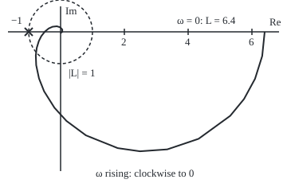
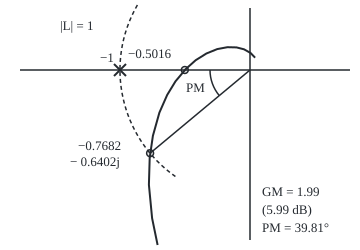
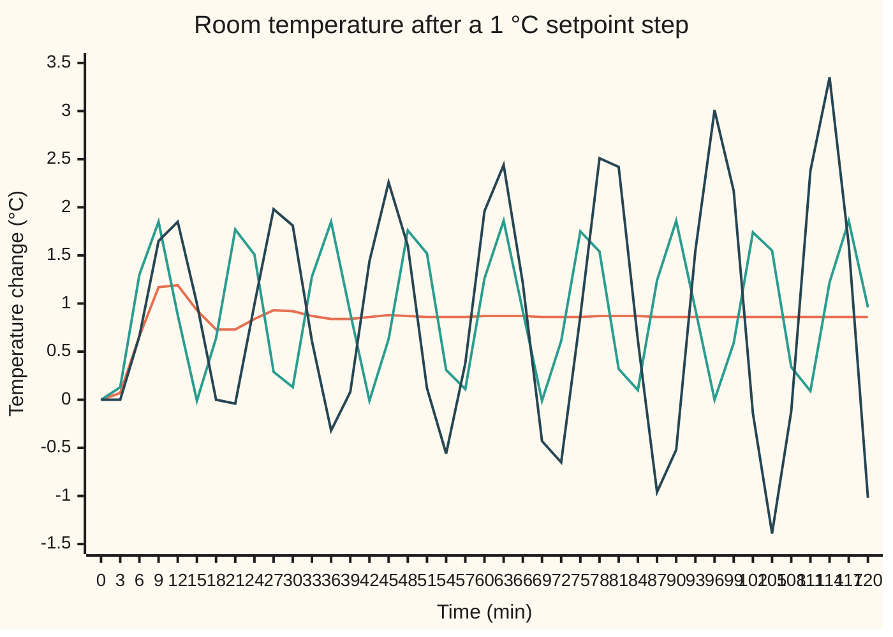

# Nyquist and margins: encirclements decide stability, margins say by how much

[Syllabus](../../../SYLLABUS.md) → [Engineering mathematics](../../../SYLLABUS.md#w13) → [Feedback Control](../../../SYLLABUS.md#w13-s03) → Nyquist and margins

---

## General Overview

A room is heated by one radiator. Hot water reaches it through a long pipe: a change at the valve takes 2 min to arrive. The radiator itself warms and cools with a time constant of 2 min, and the room, with its air, walls and furniture, follows the radiator with a time constant of 20 min. Time on this card runs in minutes, the room's natural scale.

A thermostat works the valve. For every 1 °C the room sits below the setpoint, it opens the valve a further 16%. Held open, each extra 1% of valve eventually warms the room by 0.4 °C. So once round the loop, a 1 °C error comes back as a 0.4 × 16 = 6.4 °C correction. That is a strong push, and the pipe makes it late.

The engineer has two questions. Will the room settle, or hunt up and down for ever? And if it settles, how much could go wrong before it starts to hunt: how much stronger could the thermostat be, and how much longer the pipe? The answers on this card: it settles; the thermostat gain could almost double, a factor of 1.99 or 5.99 dB, before the room oscillates with a 13.52 min period; and the loop has 39.81° of phase to spare, which buys 2.52 min more of pipe. Six decibels and forty degrees, to the nearest whole number: margins of the size control texts recommend for a loop that is safe without being sluggish.

Harry Nyquist found the test in 1932, for telephone amplifiers. Plot the open loop's answer to sine waves of every frequency as a curve in the complex plane, and count how often it goes round −1. No closed-loop pole has to be found, measured data will do, and a delay costs nothing extra.

**The closed loop's unstable poles equal the clockwise turns of the open-loop frequency-response curve round −1, plus the unstable poles the open loop already had; the gain margin and phase margin say how far that curve is from turning round −1, measured as a factor of size and as an angle.**

**What kind of fact this is:** a theorem, the Nyquist criterion, proved on this card in Why it works from the argument principle; the gain, phase and delay margins are definitions, engineering measures of distance from −1.

### The picture: the room's loop curve and the point −1

Each point is the loop's answer to a temperature wobble at one angular frequency $\omega$, from 0 upwards. Drawn to scale, 40 px per unit; the dashed circle has radius 1.

<p align="center"></p>

The curve starts at 6.4 on the right: a very slow wobble comes back 6.4 times as large and not delayed. As the wobble speeds up, the room's lag swings the answer clockwise, below the axis, and shrinks it. The pipe's delay then keeps turning it, so it crosses the negative real axis at −0.5016, inside −1, and spirals into the origin. The mirror image, for negative frequencies, is the curve flipped about the real axis, and it closes the curve into a loop. Neither half goes round −1: zero encirclements, a stable room.

---

## The formula

Some notation, reminded or introduced. The **loop gain** $L(s)$ is what one trip round the loop does to each exponential $e^{st}$ ([Feedback](01-feedback-and-closed-loop-transfer-functions.md)): thermostat, pipe, radiator and room in series. Engineers write $j$ for the square root of −1; the rest of the library writes i. A **decibel** is $20\log_{10}$ of a gain, so a factor of 2 is 6.02 dB ([Bode plots](../02-Linear%20Systems%20and%20Transforms/04-frequency-response-and-bode-plots.md)). To **encircle** a point is to go once round it; clockwise turns count +1 here and anticlockwise turns −1.

For the room,

$$L(s) = \frac{K\,e^{-\theta s}}{(T_1 s + 1)(T_2 s + 1)}, \qquad K = 6.4,\ T_1 = 20\ \text{min},\ T_2 = 2\ \text{min},\ \theta = 2\ \text{min}.$$

The **Nyquist plot** is the curve $L(j\omega)$ as $\omega$ runs from $-\infty$ to $+\infty$. The criterion is one line of counting:

$$Z = N + P$$

**Read it aloud:** the closed loop's poles in the right half-plane number the clockwise turns of the curve round −1 plus the open loop's own poles in the right half-plane.

A pole in the right half-plane is a mode that grows ([Poles and zeros](../02-Linear%20Systems%20and%20Transforms/03-poles-zeros-and-stability.md)), so the closed loop is stable exactly when $Z = 0$. For the room, $P = 0$ (a heated room left alone settles) and $N = 0$, so $Z = 0$.

The margins are read at two special frequencies. The **phase crossover** $\omega_{pc}$ is where the curve crosses the negative real axis: its phase is −180°. The **gain crossover** $\omega_{gc}$ is where it crosses the unit circle: its size is 1.

$$\text{GM} = \frac{1}{\lvert L(j\omega_{pc})\rvert}, \qquad \text{PM} = 180^\circ + \arg L(j\omega_{gc}), \qquad \theta_m = \frac{\text{PM in radians}}{\omega_{gc}}$$

**Read it aloud:** the gain margin is how many times larger the loop could be before its negative-axis crossing reaches −1; the phase margin is how much more lag the loop could take at the frequency where its size is 1; the delay margin is that lag turned into minutes of extra delay.

| Symbol | Plain meaning | In our example | Push it up and the answer… |
| --- | --- | --- | --- |
| $L(s)$, $L$ | loop gain: one trip round thermostat, pipe, radiator and room | the curve in the picture | the curve swells towards −1 |
| $s$, $j$ | the Laplace variable, a complex rate in 1/min; the square root of −1 | $s = j\omega$ on the curve | — |
| $\omega$ | angular frequency of a temperature wobble, in rad/min | 0.2757 and 0.4646 rad/min at the crossovers | the answer shrinks and lags more |
| $K$, $c$ | the loop's steady gain: 0.4 °C per % times 16 % per °C; a factor that scales it | 6.4; up to 1.9935 | both margins shrink |
| $T_1$ | time constant of the room | 20 min | the curve shrinks sooner, the gain crossover falls and both margins grow: at 25 min, GM 7.73 dB and PM 49.00° |
| $T_2$ | time constant of the radiator | 2 min | the phase margin shrinks while the gain margin barely moves: at 4 min, PM 33.27° and GM 6.25 dB |
| $\theta$, $\Delta$ | the pipe's transport delay; an extra delay added to it | 2 min; up to 2.52 min | lag $\omega\theta$ grows; both margins shrink |
| $N$ | clockwise turns of the curve round −1 | 0 | each turn is one unstable closed-loop pole |
| $P$ | open-loop poles in the right half-plane | 0 (reactor below: 1) | stability then needs anticlockwise turns |
| $Z$ | closed-loop poles in the right half-plane | 0 | the room hunts and the swing grows |
| $\omega_{pc}$, $\omega_{gc}$ | phase crossover (phase −180°) and gain crossover (size 1) | 0.4646 and 0.2757 rad/min | — |
| $\theta_m$, GM, PM | delay margin, gain margin, phase margin | 2.52 min, 1.9935 (5.99 dB), 39.81° | more room before −1 |
| $F$, $R$, $R_0$, $D_R$ | $1 + L$, whose zeros are the closed-loop poles; the radius of the fencing half-circle, a radius beyond which $L$ is small, and the contour itself | — | — |

The phase in the PM formula is the unwrapped phase: the lag accumulated from 0 upwards, not folded back into (−180°, 180°].

### The picture: the margins near −1

The same curve near −1, drawn to scale at 130 px per unit, for $\omega$ from 0.19 to 1.2 rad/min.

<p align="center"></p>

The curve crosses the negative real axis at −0.5016: doubling the loop, or nearly, carries that point onto −1. It crosses the unit circle at −0.7682 − 0.6402j, 39.81° short of −1: rotating it that far clockwise lands on −1.

### When it holds

- **Linear.** The model covers small changes with the valve between its stops. A 10 °C setpoint step asks this thermostat for 160% open; the valve saturates and the loop is no longer the curve drawn here.
- **Time-invariant.** The same room. An open window or an air-locked radiator changes $K$ and $T_1$, and the curve with them. Margins exist to absorb such changes.
- **$P$ known.** The count says nothing until the open loop's own unstable poles are counted. For an open loop that is unstable, "no encirclement" means unstable, not stable.
- **Nothing on the axis.** A closed-loop pole on the imaginary axis puts the curve through −1, and the count is undefined; an open-loop pole on the axis, such as an integrator (a $1/s$ term that adds up error over time), needs a small detour round it, and the curve then closes through a large arc.
- **Margins one at a time.** Each margin assumes the other quantity is exactly as modelled. Spending part of both can be fatal; What breaks shows it.

---

## Why it works

### Step 0: the closed loop fails where the loop gain equals −1

With the loop closed, the room answers its setpoint through $L/(1 + L)$, so the closed-loop poles are the values of $s$ where $1 + L(s) = 0$: where the loop gain is exactly −1. There a signal comes round the loop the same size and inverted, and the comparison's minus sign flips it back: it sustains itself. The question is whether any such point lies in the right half-plane, answered without solving.

### Step 1: turns count zeros minus poles

The argument principle ([The argument principle](../../07-Complex%20analysis/06-Real%20Integrals%20and%20Counting%20Zeros/06-the-argument-principle.md)) says: walk once anticlockwise round a closed curve in the $s$-plane, and the image $F(s)$ turns round 0 as many times as $F$ has zeros inside minus poles inside. Each zero inside drags the image round once; each pole inside drags it back. A turn count is a winding number ([Deforming a loop](../../07-Complex%20analysis/03-Contour%20Integrals%20and%20Cauchy%27s%20Theorem/04-deforming-contours-and-winding-numbers.md)).

### Step 2: fence in the whole right half-plane

Take $F = 1 + L$. Its zeros are the closed-loop poles. Its poles are the open-loop poles, since adding 1 creates none. Draw the **Nyquist contour**: up the imaginary axis from $-jR$ to $+jR$, then round a half-circle of huge radius $R$ through the right half-plane back to the start. It encloses every right-half-plane point as $R$ grows, and it runs clockwise, which flips the signs: clockwise turns of $F$ round 0 equal $Z - P$.

### Step 3: the half-circle adds nothing, so the frequency response is enough

On the half-circle, $\lvert e^{-\theta s}\rvert \le 1$ because the real part of $s$ is not negative, and the two lags make $\lvert L \rvert$ fall like $1/R^2$. So $F$ sits at 1 there and does not turn. Everything happens on the imaginary axis, where $F(j\omega) = 1 + L(j\omega)$. Turns of $1 + L$ round 0 are turns of $L$ round −1: shift the picture left by one. That gives $N = Z - P$, which is the formula.

So, once $P$ is known, the test needs no model: shake the valve sinusoidally, record the room's answer, and the curve is measured.

<details>
<summary>Detailed proof</summary>

Let $F(s) = 1 + L(s) = \big[(T_1 s + 1)(T_2 s + 1) + K e^{-\theta s}\big] / \big[(T_1 s + 1)(T_2 s + 1)\big]$. The numerator is entire, so $F$ is meromorphic with poles only at $-1/T_1$ and $-1/T_2$; in general its poles are those of $L$. Assume no zero or pole of $F$ lies on the imaginary axis.

In the closed right half-plane, $\lvert L(s)\rvert \le K / (\lvert T_1 s + 1\rvert\,\lvert T_2 s + 1\rvert)$, which tends to 0 as $\lvert s\rvert \to \infty$. Choose $R_0$ with $\lvert L\rvert < 1/2$ for $\lvert s\rvert > R_0$ there. Then $F \ne 0$ outside radius $R_0$, so the right-half-plane zeros lie in a bounded set; zeros of a function analytic and not identically zero are isolated, so there are finitely many, $Z$ counted with multiplicity. Likewise $P$ is finite.

For $R > R_0$ let $D_R$ be the contour up the axis from $-jR$ to $+jR$ and back along $\lvert s\rvert = R$, $\operatorname{Re} s \ge 0$. It bounds the half-disc anticlockwise when walked the other way; walked as stated it is clockwise, so the argument principle gives: clockwise winding of $F(D_R)$ round 0 equals $Z - P$.

On the arc, $\lvert F - 1\rvert = \lvert L \rvert < 1/2$, so $F$ stays in the disc of radius 1/2 about 1, which does not contain 0. Its argument changes there by less than a quarter-turn, and by an amount that tends to 0 as $R \to \infty$, since $\lvert L\rvert \to 0$ uniformly on the arc. The winding number is an integer that does not change once $R > R_0$, so it equals the limit of the turning of $1 + L(j\omega)$ round 0 as $\omega$ runs from $-R$ to $+R$: the turning of $L(j\omega)$ round −1 over the whole axis. That number is $N$, and $N = Z - P$.

A pole of $L$ on the axis is skipped by a small half-circle detour into the right half-plane. A zero of $F$ on the axis puts the curve through −1: the loop is on the boundary.

</details>

### Step 4: the gain margin is a stretch

Multiply the loop gain by a number $c$, and every point of the curve moves $c$ times further from the origin along its own ray. The crossing of the negative axis, at −0.5016, reaches −1 when $c$ = 1/0.5016 = 1.9935. At that moment $1 + L(j\omega_{pc}) = 0$: a closed-loop pole sits on the imaginary axis at $j\omega_{pc}$, and the room oscillates for ever with period $2\pi/\omega_{pc}$ = 13.52 min. Stretch further and the crossing passes −1. The mirror half passes it too, so $N$ jumps from 0 to 2: a pair of complex poles crosses into the right half-plane together.

### Step 5: the phase margin is a rotation, and a rotation is a delay

An extra delay $\Delta$ multiplies $L(j\omega)$ by $e^{-j\omega\Delta}$: same size, turned clockwise by $\omega\Delta$ radians. The point on the unit circle, at $\omega_{gc}$, is 39.81° short of −1. Turn it that far and it lands on −1: $\omega_{gc}\Delta$ = 0.6948 rad, so $\Delta$ = 0.6948 / 0.2757 = 2.52 min. A pipe 4.52 min long puts a closed-loop pole at $j\omega_{gc}$, a 22.79 min oscillation. Any lag behaves the same way at that one frequency, which is why the margin is quoted as an angle.

Other routes to the same verdict exist. Routh's table ([Routh-Hurwitz](04-routh-hurwitz-criterion.md)) and the root locus ([Root locus](05-root-locus.md)) both need a polynomial, so the pipe's $e^{-\theta s}$ must first be approximated; the Nyquist count takes it exactly. The code below also finds the rightmost closed-loop pole directly, by Newton's method on $1 + L(s) = 0$, as an independent check.

---

## Worked numbers, by hand

The phase crossover, $\omega_{pc}$ = 0.4646 rad/min (found by halving an interval until the lags sum to 180°), then the gain crossover, $\omega_{gc}$ = 0.2757 rad/min.

| Step | Arithmetic | Value |
| --- | --- | --- |
| room's lag at $\omega_{pc}$ | arctan(20 × 0.4646) | 83.86° |
| radiator's lag | arctan(2 × 0.4646) | 42.90° |
| pipe's lag | 2 × 0.4646 rad, in degrees | 53.24° |
| total | 83.86 + 42.90 + 53.24 | 180.00° |
| size there | 6.4 / (9.3462 × 1.3651) | 0.5016 |
| gain margin | 1 / 0.5016 | 1.9935 = 5.99 dB |
| room's lag at $\omega_{gc}$ | arctan(20 × 0.2757) | 79.72° |
| radiator's lag | arctan(2 × 0.2757) | 28.87° |
| pipe's lag | 2 × 0.2757 rad, in degrees | 31.60° |
| phase margin | 180 − (79.72 + 28.87 + 31.60) | 39.81° = 0.6948 rad |
| delay margin | 0.6948 / 0.2757 | 2.52 min |
| **reading** | | **GM 5.99 dB, PM 39.81°, 2.52 min of pipe to spare** |

The factors 9.3462 and 1.3651 are $\sqrt{1 + (\omega T)^2}$ for the room and the radiator. In the room: the thermostat could be set 1.99 times as strong, or the pipe made 2.52 min longer, before the temperature hunts. A 1 °C setpoint step peaks at 1.2376 °C after 10.61 min, settles at 0.8649 °C, and is within 2% of that after 39.72 min. The settled value falls short of 1 °C because a thermostat that only pushes in proportion leaves an offset ([Steady-state error](03-steady-state-error-and-system-type.md)).

### The picture: spending the margins

The room after a 1 °C setpoint step, simulated, every 3 min.



Orange: the room as built, gain 6.4 and 2 min of pipe; it rings down, each swing about a fifth of the last, and settles. Green: the thermostat gain raised by exactly the gain margin, to 12.7585; the room swings between about 0 °C and 1.9 °C for ever, period 13.53 min in the simulation against 13.52 min predicted. Dark blue: gain 1.5 times larger and the pipe 1 min longer, each inside its own margin; the swing grows by a factor of 1.1611 per cycle.

### What breaks if you drop a piece

| Mistake | Comes out at | What went wrong |
| --- | --- | --- |
| Model the pipe as instant | PM 71.40° and an unlimited gain margin (right: 39.81° and 5.99 dB) | Without the delay the two lags never reach −180°, so the curve never crosses the negative axis; the pipe's lag is the danger |
| Read "5.99 dB" as "6 times the gain" | gain 38.4: $N$ = 2, growing poles +0.2077 ± 0.6215j | Decibels are $20\log_{10}$: 5.99 dB is a factor of 1.99 |
| Spend part of both margins: gain × 1.5, pipe +1 min | $N$ = 2, pole +0.0087 ± 0.3678j, swing × 1.1611 per cycle | Each margin assumes the other is untouched; extra gain moves the gain crossover to a higher frequency, where the longer pipe lags more |
| Forget $P$: reactor with $L = 2/(s - 1)$ | "one turn, so unstable"; truth: $N$ = −1, $P$ = 1, $Z$ = 0, pole at −1 | An open loop that runs away on its own needs an anticlockwise turn to be stabilised |

The reactor is an exothermic vessel whose temperature error, left alone, grows like $e^{t}$, time in minutes; its curve is a circle of radius 1 round −1, walked anticlockwise.

---

## Code, from first principles, and it actually runs

Three independent roads to every verdict. Road 1 is Nyquist: walk $\omega$ across the whole axis, add up the turns of $1 + L$ round 0, and find both crossovers by halving intervals. Road 2 finds the rightmost closed-loop pole by Newton's method on $1 + L(s) = 0$, then the gain and the delay that put it on the imaginary axis: a second road to both margins. Road 3 simulates the room with fourth-order Runge-Kutta (RK4) steps, holding the valve signal in a buffer for the pipe, and measures successive temperature peaks. Asserts check that the roads agree on every verdict, that both margins match between roads 1 and 2 to six decimals, and that the simulated swing at each margin holds steady at the predicted period.

### Python

```python
# Nyquist criterion and stability margins -- the check behind the card.  Standard library only.
# Thermostat loop, time in minutes.  Valve opening u (%) -> hot water through 2 min of pipe ->
# radiator (lag 2 min) -> room (lag 20 min).  Plant 0.4 degC per %, thermostat gain 16 % per degC.
# Loop gain L(s) = K e^(-s TH) / ((T1 s + 1)(T2 s + 1)), K = 6.4.  Three roads to "stable, and by how much":
#   1. Nyquist: wind L(jw) round -1 for w from -inf to +inf; margins from the frequency response.
#   2. Closed-loop poles: Newton's method on (T1 s + 1)(T2 s + 1) + K e^(-s TH) = 0.
#   3. Time domain: simulate the room with RK4 and a delay buffer; measure peaks.
from math import pi, sin, cos, atan, atan2, exp, log, log10, sqrt, degrees, tan

T1, T2, TH, KP, KC = 20.0, 2.0, 2.0, 0.4, 16.0
K = KP * KC

def cexp(z): return exp(z.real) * complex(cos(z.imag), sin(z.imag))
def L(s, k=K, th=TH): return k * cexp(-s * th) / ((T1 * s + 1) * (T2 * s + 1))
def mag(w, k=K, t1=T1, t2=T2): return k / sqrt((1 + (w * t1) ** 2) * (1 + (w * t2) ** 2))
def phase(w, th=TH, t1=T1, t2=T2): return -atan(w * t1) - atan(w * t2) - w * th        # unwrapped, radians

def bisect(f, lo, hi):
    for _ in range(200):
        mid = (lo + hi) / 2
        if (f(lo) > 0) == (f(mid) > 0): lo = mid
        else: hi = mid
    return (lo + hi) / 2

def winding(Lf, n=200000):          # clockwise turns of Lf(jw) round -1, w = tan(u), u across (-pi/2, pi/2)
    total, prev = 0.0, None
    for i in range(1, n):
        z = 1 + Lf(1j * tan(-pi / 2 + pi * i / n))
        a = atan2(z.imag, z.real)
        if prev is not None:
            d = a - prev
            d -= 2 * pi * round(d / (2 * pi))
            total += d
        prev = a
    return -round(total / (2 * pi))

def root(k, th, s=0.45j):           # Newton on f(s) = (T1 s+1)(T2 s+1) + k e^(-s th)
    for _ in range(100):
        e = cexp(-s * th)
        s -= ((T1 * s + 1) * (T2 * s + 1) + k * e) / (T1 * (T2 * s + 1) + T2 * (T1 * s + 1) - k * th * e)
    return s

def simulate(k, th, t_end=240.0, dt=0.01):   # 1 degC setpoint step at t = 0; returns room temperature list
    kc = k / KP; lag = round(th / dt); n = round(t_end / dt)
    y = r = 0.0; ys, us = [], []
    def ud(i2):                     # valve opening at half-step index i2/2, delayed by th; 0 before start
        j = i2 / 2 - lag
        if j < 0: return 0.0
        a = int(j); return us[a] if j == a else (us[a] + us[a + 1]) / 2
    def rhs(i2, r, y): return (-r + KP * ud(i2)) / T2, (-y + r) / T1
    for i in range(n + 1):
        ys.append(y); us.append(kc * (1.0 - y))
        if i == n: break
        k1 = rhs(2 * i, r, y); k2 = rhs(2 * i + 1, r + dt / 2 * k1[0], y + dt / 2 * k1[1])
        k3 = rhs(2 * i + 1, r + dt / 2 * k2[0], y + dt / 2 * k2[1]); k4 = rhs(2 * i + 2, r + dt * k3[0], y + dt * k3[1])
        r += dt / 6 * (k1[0] + 2 * k2[0] + 2 * k3[0] + k4[0]); y += dt / 6 * (k1[1] + 2 * k2[1] + 2 * k3[1] + k4[1])
    return ys
def peaks(ys, k, dt=0.01):          # times of maxima, and the ratio of the 3rd to the 2nd swing above the final value
    yinf = k / (1 + k)
    ix = [i for i in range(1, len(ys) - 1) if ys[i] > ys[i - 1] and ys[i] >= ys[i + 1]]
    return (ix[2] - ix[1]) * dt, (ys[ix[2]] - yinf) / (ys[ix[1]] - yinf), ys[ix[0]] - yinf

wpc = bisect(lambda w: phase(w) + pi, 1e-6, 2.0)
gm = 1 / mag(wpc)
wgc = bisect(lambda w: mag(w) - 1, 1e-6, wpc)
pm = phase(wgc) + pi
dm = pm / wgc
print(f"loop: K = {KP} degC/% x {KC} %/degC = {K:.1f}; room lag {T1:.0f} min, radiator lag {T2:.0f} min, pipe delay {TH:.0f} min")
print(f"hand, phase crossover w = {wpc:.4f} rad/min: room {degrees(atan(wpc * T1)):.2f} deg, radiator {degrees(atan(wpc * T2)):.2f} deg, "
      f"pipe {degrees(wpc * TH):.2f} deg")
print(f"hand, total lag {-degrees(phase(wpc)):.2f} deg; |L| there = {K:.1f} / ({sqrt(1 + (wpc * T1) ** 2):.4f} x "
      f"{sqrt(1 + (wpc * T2) ** 2):.4f}) = {mag(wpc):.4f}")
print(f"gain margin  GM = {gm:.4f} = {20 * log10(gm):.2f} dB (a factor 2 is {20 * log10(2):.2f} dB); "
      f"real-axis crossing at {L(1j * wpc).real:.4f}")
print(f"hand, gain crossover w = {wgc:.4f} rad/min: room {degrees(atan(wgc * T1)):.2f} deg, radiator {degrees(atan(wgc * T2)):.2f} deg, "
      f"pipe {degrees(wgc * TH):.2f} deg")
print(f"phase margin PM = {degrees(pm):.2f} deg = {pm:.4f} rad; unit-circle crossing at {L(1j * wgc).real:.4f} {L(1j * wgc).imag:+.4f}j")
print(f"delay margin PM / wgc = {dm:.4f} min; periods 2 pi / wpc = {2 * pi / wpc:.2f} min, 2 pi / wgc = {2 * pi / wgc:.2f} min")
print(f"closest approach to -1: |1 + L| = {min(abs(1 + L(1j * i / 10000)) for i in range(1, 30000)):.4f}")
# ---- road 1: encirclements; road 2: rightmost closed-loop pole; road 3: simulation ----
reactor = lambda s: 2.0 / (s - 1.0)
print("case                         N cw   P   Z=N+P   Newton pole           sim period  swing ratio")
cases = (("thermostat K = 6.4", K, TH), ("gain x 2.1", 2.1 * K, TH), ("gain x 1.5, pipe +1 min", 1.5 * K, TH + 1.0))
res = {}
for name, k, th in cases:
    n = winding(lambda s: L(s, k, th)); s = root(k, th); per, ratio, first = peaks(simulate(k, th), k)
    res[name] = (n, s, per, ratio, first)
    print(f"{name:<27} {n:4d} {0:3d} {n:6d}    {s.real:+.4f} {s.imag:+.4f}j    {per:8.2f}  {ratio:9.4f}")
nr = winding(reactor)
print(f"{'reactor 2/(s - 1)':<27} {nr:4d} {1:3d} {nr + 1:6d}    {1.0 - 2.0:+.4f} {0.0:+.4f}j    {'-':>8}  {'-':>9}")
# ---- the two margins, by a second and third road ----
kcrit = bisect(lambda k: root(k, TH).real, K, 3 * K)
thcrit = bisect(lambda th: root(K, th).real, TH, 3 * TH)
pk, rk, _ = peaks(simulate(kcrit, TH), kcrit); pt, rt, _ = peaks(simulate(K, thcrit), K)
print(f"pole on the axis at gain {kcrit:.4f}: GM = {kcrit / K:.4f}, pole {root(kcrit, TH).imag:.4f}j; sim period {pk:.2f} min, ratio {rk:.4f}")
print(f"pole on the axis at delay {thcrit:.4f} min: margin {thcrit - TH:.4f} min, pole {root(K, thcrit).imag:.4f}j; "
      f"sim period {pt:.2f} min, ratio {rt:.4f}")
n0, s0, per0, ratio0, first0 = res["thermostat K = 6.4"]
ys = simulate(K, TH); yinf = K / (1 + K)
settle = max(i for i, y in enumerate(ys) if abs(y - yinf) > 0.02 * yinf) * 0.01
ipk = max(range(len(ys)), key=lambda i: ys[i])
print(f"1 degC step: settles at {yinf:.4f} degC; peak {ys[ipk]:.4f} degC at {ipk * 0.01:.2f} min, {first0:+.4f} above; "
      f"within 2% after {settle:.2f} min")
print(f"pole predicts swing ratio exp(re x period) = {exp(s0.real * 2 * pi / s0.imag):.4f}, period {2 * pi / s0.imag:.2f} min")
# ---- what breaks ----
print(f"wrong: drop the pipe delay: phase only nears -180 deg; PM {degrees(pm + wgc * TH):.2f} deg, GM none")
s6 = root(6 * K, TH, 0.6j)
print(f"wrong: read 6 dB as 'times 6': gain {6 * K:.1f}, pole {s6.real:+.4f} {s6.imag:+.4f}j, N = {winding(lambda s: L(s, 6 * K))}")
print(f"outside the model: a 10 degC setpoint step asks the valve for {KC * 10:.0f}% open")
# ---- try changing ----
for lab, k, th, t1, t2 in (("try: pipe 4 min", K, 4.0, T1, T2), ("try: gain 3.2", 3.2, TH, T1, T2),
                          ("try: room lag 25 min", K, TH, 25.0, T2), ("try: radiator lag 4 min", K, TH, T1, 4.0)):
    w1 = bisect(lambda w: phase(w, th, t1, t2) + pi, 1e-6, 2.0); w2 = bisect(lambda w: mag(w, k, t1, t2) - 1, 1e-6, w1)
    print(f"{lab}: GM {20 * log10(1 / mag(w1, k, t1, t2)):.2f} dB, PM {degrees(phase(w2, th, t1, t2) + pi):.2f} deg")
# ---- figures ----
full = (0, .005, .01, .015, .02, .03, .04, .05, .06, .08, .1, .12, .15, .18, .22, .26, .3, .35, .4, .47, .55, .65, .8, 1, 1.3, 1.7, 2.2, 3)
print("figure, full (px = 76 + 40 Re, py = 40 - 40 Im):", " ".join(f"{76 + 40 * L(1j * w).real:.1f},{40 - 40 * L(1j * w).imag:.1f}" for w in full))
zoom = (.19, .21, .24, .27, .3, .34, .38, .42, .47, .52, .58, .65, .73, .82, .92, 1.05, 1.2)
print("figure, zoom (px = 250 + 130 Re, py = 70 - 130 Im):", " ".join(f"{250 + 130 * L(1j * w).real:.1f},{70 - 130 * L(1j * w).imag:.1f}" for w in zoom))
print(f"figure, zoom marks: crossing {250 + 130 * L(1j * wpc).real:.1f},70.0  unit circle {250 + 130 * L(1j * wgc).real:.1f},"
      f"{70 - 130 * L(1j * wgc).imag:.1f}")
names = ("nominal", "gain x GM", "both at once")
runs = (simulate(K, TH), simulate(kcrit, TH), simulate(1.5 * K, TH + 1.0))
print("chart, t min       " + " ".join(f"{3 * i:5d}" for i in range(41)))
for nm, ys in zip(names, runs):
    print(f"chart, {nm:<12}" + " ".join(f"{ys[300 * i]:5.2f}" for i in range(41)))
for name, (n, s, per, ratio, first) in res.items():           # three roads agree on every verdict
    assert (n == 0) == (s.real < 0), name                      # encirclements vs the rightmost pole
    assert (s.real < 0) == (ratio < 1), name                   # the pole vs the simulated room
assert res["gain x 2.1"][0] == 2                               # two closed-loop poles cross over
assert nr == -1                                               # reactor: N = -1, P = 1 -> Z = 0, pole at -1
assert abs(kcrit / K - gm) < 1e-6                             # GM: frequency response vs pole on the axis
assert abs(root(kcrit, TH).imag - wpc) < 1e-6
assert abs((thcrit - TH) - dm) < 1e-6                         # PM: delay margin vs pole on the axis
assert abs(pk - 2 * pi / wpc) < 0.05                          # simulated at GM: swing at the crossover period
assert abs(rk - 1) < 0.01                                     # ... neither growing nor dying
assert abs(pt - 2 * pi / wgc) < 0.05                          # simulated at the delay margin, likewise
assert abs(rt - 1) < 0.01
assert abs(ratio0 - exp(s0.real * 2 * pi / s0.imag)) < 0.01   # simulated decay vs the Newton pole
print("ALL CHECKS PASS")
```

**Ran 2026-10-06 on macOS, Python 3.14.6, standard library only. All checks passed. Output, pasted from the run:**

```
loop: K = 0.4 degC/% x 16.0 %/degC = 6.4; room lag 20 min, radiator lag 2 min, pipe delay 2 min
hand, phase crossover w = 0.4646 rad/min: room 83.86 deg, radiator 42.90 deg, pipe 53.24 deg
hand, total lag 180.00 deg; |L| there = 6.4 / (9.3462 x 1.3651) = 0.5016
gain margin  GM = 1.9935 = 5.99 dB (a factor 2 is 6.02 dB); real-axis crossing at -0.5016
hand, gain crossover w = 0.2757 rad/min: room 79.72 deg, radiator 28.87 deg, pipe 31.60 deg
phase margin PM = 39.81 deg = 0.6948 rad; unit-circle crossing at -0.7682 -0.6402j
delay margin PM / wgc = 2.5199 min; periods 2 pi / wpc = 13.52 min, 2 pi / wgc = 22.79 min
closest approach to -1: |1 + L| = 0.4106
case                         N cw   P   Z=N+P   Newton pole           sim period  swing ratio
thermostat K = 6.4             0   0      0    -0.0969 +0.3574j       17.58     0.1821
gain x 2.1                     2   0      2    +0.0084 +0.4725j       13.30     1.1180
gain x 1.5, pipe +1 min        2   0      2    +0.0087 +0.3678j       17.08     1.1611
reactor 2/(s - 1)             -1   1      0    -1.0000 +0.0000j           -          -
pole on the axis at gain 12.7585: GM = 1.9935, pole 0.4646j; sim period 13.53 min, ratio 1.0000
pole on the axis at delay 4.5199 min: margin 2.5199 min, pole 0.2757j; sim period 22.79 min, ratio 1.0000
1 degC step: settles at 0.8649 degC; peak 1.2376 degC at 10.61 min, +0.3727 above; within 2% after 39.72 min
pole predicts swing ratio exp(re x period) = 0.1821, period 17.58 min
wrong: drop the pipe delay: phase only nears -180 deg; PM 71.40 deg, GM none
wrong: read 6 dB as 'times 6': gain 38.4, pole +0.2077 +0.6215j, N = 2
outside the model: a 10 degC setpoint step asks the valve for 160% open
try: pipe 4 min: GM 0.87 dB, PM 8.21 deg
try: gain 3.2: GM 12.01 dB, PM 76.14 deg
try: room lag 25 min: GM 7.73 dB, PM 49.00 deg
try: radiator lag 4 min: GM 6.25 dB, PM 33.27 deg
figure, full (px = 76 + 40 Re, py = 40 - 40 Im): 332.0,40.0 328.9,70.4 319.9,99.0 306.1,124.4 288.8,145.5 249.1,174.4 209.8,187.7 175.6,190.1 147.6,186.1 107.8,170.1 83.4,152.0 68.3,135.4 55.3,114.7 48.9,98.5 45.4,81.9 44.9,69.6 46.1,60.2 48.7,51.6 51.8,45.4 56.3,39.7 61.0,35.8 65.9,33.6 71.3,33.0 75.5,34.3 78.1,37.1 78.1,39.9 76.7,41.1 75.4,40.3
figure, zoom (px = 250 + 130 Re, py = 70 - 130 Im): 157.6,245.0 152.1,218.2 148.9,184.8 149.7,157.8 152.9,135.8 159.4,112.6 167.2,94.9 175.5,81.3 185.9,68.9 195.7,60.2 206.4,53.5 217.2,49.1 227.4,47.2 236.5,47.4 244.0,49.3 250.6,53.0 255.1,57.7
figure, zoom marks: crossing 184.8,70.0  unit circle 150.1,153.2
chart, t min           0     3     6     9    12    15    18    21    24    27    30    33    36    39    42    45    48    51    54    57    60    63    66    69    72    75    78    81    84    87    90    93    96    99   102   105   108   111   114   117   120
chart, nominal      0.00  0.07  0.66  1.17  1.19  0.93  0.73  0.73  0.84  0.93  0.92  0.87  0.84  0.84  0.86  0.88  0.87  0.86  0.86  0.86  0.87  0.87  0.87  0.86  0.86  0.86  0.87  0.87  0.87  0.86  0.86  0.86  0.86  0.86  0.86  0.86  0.86  0.86  0.86  0.86  0.86
chart, gain x GM    0.00  0.13  1.30  1.85  0.88 -0.01  0.64  1.77  1.51  0.29  0.13  1.28  1.85  0.90 -0.01  0.63  1.76  1.52  0.31  0.11  1.26  1.86  0.92 -0.01  0.61  1.75  1.54  0.32  0.10  1.24  1.86  0.94 -0.00  0.59  1.74  1.55  0.34  0.09  1.22  1.86  0.96
chart, both at once 0.00  0.00  0.66  1.65  1.85  1.00 -0.00 -0.04  0.99  1.98  1.81  0.61 -0.32  0.08  1.44  2.26  1.60  0.12 -0.56  0.38  1.96  2.44  1.21 -0.43 -0.65  0.87  2.51  2.42  0.62 -0.96 -0.52  1.55  3.01  2.17 -0.14 -1.39 -0.12  2.38  3.35  1.61 -1.02
ALL CHECKS PASS
```

Read the case table across: the turn count $N$, the sign of the Newton pole's real part and the simulated swing ratio (below 1 dies, above 1 grows) agree for every loop. The nominal pole predicts the room's swing ratio, $e^{-0.0969 \times 17.58}$ = 0.1821, as simulated. The reactor's pole is solved by hand, not by Newton: $s - 1 + 2 = 0$ gives $s = -1$.

### Rust

The same checks, with complex numbers as a small struct written out. No crates.

```rust
// Nyquist criterion and stability margins -- the same check as nyquist_criterion_and_stability_margins_check.py.
// Rust std only, no crates; complex numbers are a small struct written out.  Time in minutes.
// Thermostat loop L(s) = K e^(-s TH) / ((T1 s + 1)(T2 s + 1)), K = 0.4 degC/% x 16 %/degC = 6.4.
// Roads: Nyquist winding and frequency-response margins; Newton on the closed-loop poles; RK4 simulation.
use std::f64::consts::PI;

const T1: f64 = 20.0; const T2: f64 = 2.0; const TH: f64 = 2.0;   // room lag, radiator lag, pipe delay (min)
const KP: f64 = 0.4; const KC: f64 = 16.0; const K: f64 = KP * KC; // degC per %, % per degC, loop gain

#[derive(Clone, Copy)]
struct C { re: f64, im: f64 }
fn c(re: f64, im: f64) -> C { C { re, im } }
impl C {
    fn add(self, o: C) -> C { c(self.re + o.re, self.im + o.im) }
    fn sub(self, o: C) -> C { c(self.re - o.re, self.im - o.im) }
    fn mul(self, o: C) -> C { c(self.re * o.re - self.im * o.im, self.re * o.im + self.im * o.re) }
    fn scale(self, k: f64) -> C { c(self.re * k, self.im * k) }
    fn div(self, o: C) -> C { let d = o.re * o.re + o.im * o.im; c((self.re * o.re + self.im * o.im) / d, (self.im * o.re - self.re * o.im) / d) }
    fn abs(self) -> f64 { (self.re * self.re + self.im * self.im).sqrt() }
    fn exp(self) -> C { c(self.im.cos(), self.im.sin()).scale(self.re.exp()) }
}
const ONE: C = C { re: 1.0, im: 0.0 };

fn l(s: C, k: f64, th: f64) -> C { s.scale(-th).exp().scale(k).div(s.scale(T1).add(ONE).mul(s.scale(T2).add(ONE))) }
fn mag(w: f64, k: f64, t1: f64, t2: f64) -> f64 { k / ((1.0 + (w * t1).powi(2)) * (1.0 + (w * t2).powi(2))).sqrt() }
fn phase(w: f64, th: f64, t1: f64, t2: f64) -> f64 { -(w * t1).atan() - (w * t2).atan() - w * th }

fn bisect(f: &dyn Fn(f64) -> f64, mut lo: f64, mut hi: f64) -> f64 {
    for _ in 0..200 {
        let mid = (lo + hi) / 2.0;
        if (f(lo) > 0.0) == (f(mid) > 0.0) { lo = mid; } else { hi = mid; }
    }
    (lo + hi) / 2.0
}

fn winding(lf: &dyn Fn(C) -> C) -> i64 {
    let n = 200000;
    let (mut total, mut prev) = (0.0, f64::NAN);
    for i in 1..n {
        let z = ONE.add(lf(c(0.0, (-PI / 2.0 + PI * i as f64 / n as f64).tan())));
        let a = z.im.atan2(z.re);
        if !prev.is_nan() { let d = a - prev; total += d - 2.0 * PI * (d / (2.0 * PI)).round(); }
        prev = a;
    }
    -(total / (2.0 * PI)).round() as i64
}

fn root(k: f64, th: f64, s0: f64) -> C {
    let mut s = c(0.0, s0);
    for _ in 0..100 {
        let (e, a, b) = (s.scale(-th).exp(), s.scale(T1).add(ONE), s.scale(T2).add(ONE));
        s = s.sub(a.mul(b).add(e.scale(k)).div(b.scale(T1).add(a.scale(T2)).sub(e.scale(k * th))));
    }
    s
}

fn simulate(k: f64, th: f64) -> Vec<f64> {
    let dt = 0.01;
    let (kc, lag, n) = (k / KP, (th / dt).round() as i64, (240.0f64 / dt).round() as usize);
    let (mut y, mut r) = (0.0f64, 0.0f64);
    let (mut ys, mut us): (Vec<f64>, Vec<f64>) = (vec![], vec![]);
    for i in 0..=n {
        ys.push(y); us.push(kc * (1.0 - y));
        if i == n { break; }
        let ud = |i2: i64| -> f64 {
            let j2 = i2 - 2 * lag;
            if j2 < 0 { 0.0 } else if j2 % 2 == 0 { us[(j2 / 2) as usize] } else { (us[(j2 / 2) as usize] + us[(j2 / 2 + 1) as usize]) / 2.0 }
        };
        let rhs = |i2: i64, r: f64, y: f64| ((-r + KP * ud(i2)) / T2, (-y + r) / T1);
        let i2 = 2 * i as i64;
        let k1 = rhs(i2, r, y);
        let k2 = rhs(i2 + 1, r + dt / 2.0 * k1.0, y + dt / 2.0 * k1.1);
        let k3 = rhs(i2 + 1, r + dt / 2.0 * k2.0, y + dt / 2.0 * k2.1);
        let k4 = rhs(i2 + 2, r + dt * k3.0, y + dt * k3.1);
        r += dt / 6.0 * (k1.0 + 2.0 * k2.0 + 2.0 * k3.0 + k4.0);
        y += dt / 6.0 * (k1.1 + 2.0 * k2.1 + 2.0 * k3.1 + k4.1);
    }
    ys
}

fn peaks(ys: &[f64], k: f64) -> (f64, f64, f64) {
    let yinf = k / (1.0 + k);
    let ix: Vec<usize> = (1..ys.len() - 1).filter(|&i| ys[i] > ys[i - 1] && ys[i] >= ys[i + 1]).collect();
    ((ix[2] - ix[1]) as f64 * 0.01, (ys[ix[2]] - yinf) / (ys[ix[1]] - yinf), ys[ix[0]] - yinf)
}

fn margins(k: f64, th: f64, t1: f64, t2: f64) -> (f64, f64, f64, f64) {
    let w1 = bisect(&|w| phase(w, th, t1, t2) + PI, 1e-6, 2.0);
    let w2 = bisect(&|w| mag(w, k, t1, t2) - 1.0, 1e-6, w1);
    (w1, 1.0 / mag(w1, k, t1, t2), w2, phase(w2, th, t1, t2) + PI)
}

fn pts(ws: &[f64], ox: f64, oy: f64, sc: f64) -> String {
    ws.iter().map(|&w| { let z = l(c(0.0, w), K, TH); format!("{:.1},{:.1}", ox + sc * z.re, oy - sc * z.im) }).collect::<Vec<_>>().join(" ")
}

fn main() {
    let (wpc, gm, wgc, pm) = margins(K, TH, T1, T2); let dm = pm / wgc;
    let (lpc, lgc) = (l(c(0.0, wpc), K, TH), l(c(0.0, wgc), K, TH));
    println!("loop: K = {} degC/% x {:.1} %/degC = {:.1}; room lag {:.0} min, radiator lag {:.0} min, pipe delay {:.0} min", KP, KC, K, T1, T2, TH);
    println!("hand, phase crossover w = {:.4} rad/min: room {:.2} deg, radiator {:.2} deg, pipe {:.2} deg",
             wpc, (wpc * T1).atan().to_degrees(), (wpc * T2).atan().to_degrees(), (wpc * TH).to_degrees());
    println!("hand, total lag {:.2} deg; |L| there = {:.1} / ({:.4} x {:.4}) = {:.4}", -phase(wpc, TH, T1, T2).to_degrees(), K,
             (1.0 + (wpc * T1).powi(2)).sqrt(), (1.0 + (wpc * T2).powi(2)).sqrt(), mag(wpc, K, T1, T2));
    println!("gain margin  GM = {:.4} = {:.2} dB (a factor 2 is {:.2} dB); real-axis crossing at {:.4}", gm, 20.0 * gm.log10(), 20.0 * 2f64.log10(), lpc.re);
    println!("hand, gain crossover w = {:.4} rad/min: room {:.2} deg, radiator {:.2} deg, pipe {:.2} deg",
             wgc, (wgc * T1).atan().to_degrees(), (wgc * T2).atan().to_degrees(), (wgc * TH).to_degrees());
    println!("phase margin PM = {:.2} deg = {:.4} rad; unit-circle crossing at {:.4} {:+.4}j", pm.to_degrees(), pm, lgc.re, lgc.im);
    println!("delay margin PM / wgc = {:.4} min; periods 2 pi / wpc = {:.2} min, 2 pi / wgc = {:.2} min", dm, 2.0 * PI / wpc, 2.0 * PI / wgc);
    let close = (1..30000).map(|i| ONE.add(l(c(0.0, i as f64 / 10000.0), K, TH)).abs()).fold(f64::INFINITY, f64::min);
    println!("closest approach to -1: |1 + L| = {:.4}", close);
    println!("case                         N cw   P   Z=N+P   Newton pole           sim period  swing ratio");
    let cases = [("thermostat K = 6.4", K, TH), ("gain x 2.1", 2.1 * K, TH), ("gain x 1.5, pipe +1 min", 1.5 * K, TH + 1.0)];
    let mut res = vec![];
    for (name, k, th) in cases {
        let (n, s, (per, ratio, first)) = (winding(&|s| l(s, k, th)), root(k, th, 0.45), peaks(&simulate(k, th), k));
        println!("{:<27} {:4} {:3} {:6}    {:+.4} {:+.4}j    {:8.2}  {:9.4}", name, n, 0, n, s.re, s.im, per, ratio);
        res.push((n, s, per, ratio, first));
    }
    let nr = winding(&|s: C| c(2.0, 0.0).div(s.sub(ONE)));
    println!("{:<27} {:4} {:3} {:6}    {:+.4} {:+.4}j    {:>8}  {:>9}", "reactor 2/(s - 1)", nr, 1, nr + 1, 1.0 - 2.0, 0.0, "-", "-");
    let kcrit = bisect(&|k| root(k, TH, 0.45).re, K, 3.0 * K);
    let thcrit = bisect(&|th| root(K, th, 0.45).re, TH, 3.0 * TH);
    let ((pk, rk, _), (pt, rt, _)) = (peaks(&simulate(kcrit, TH), kcrit), peaks(&simulate(K, thcrit), K));
    println!("pole on the axis at gain {:.4}: GM = {:.4}, pole {:.4}j; sim period {:.2} min, ratio {:.4}", kcrit, kcrit / K, root(kcrit, TH, 0.45).im, pk, rk);
    println!("pole on the axis at delay {:.4} min: margin {:.4} min, pole {:.4}j; sim period {:.2} min, ratio {:.4}",
             thcrit, thcrit - TH, root(K, thcrit, 0.45).im, pt, rt);
    let (_, s0, _, ratio0, first0) = res[0];
    let (ys, yinf) = (simulate(K, TH), K / (1.0 + K));
    let settle = (0..ys.len()).filter(|&i| (ys[i] - yinf).abs() > 0.02 * yinf).max().unwrap() as f64 * 0.01;
    let ipk = (0..ys.len()).fold(0, |b, i| if ys[i] > ys[b] { i } else { b });
    println!("1 degC step: settles at {:.4} degC; peak {:.4} degC at {:.2} min, {:+.4} above; within 2% after {:.2} min",
             yinf, ys[ipk], ipk as f64 * 0.01, first0, settle);
    println!("pole predicts swing ratio exp(re x period) = {:.4}, period {:.2} min", (s0.re * 2.0 * PI / s0.im).exp(), 2.0 * PI / s0.im);
    println!("wrong: drop the pipe delay: phase only nears -180 deg; PM {:.2} deg, GM none", (pm + wgc * TH).to_degrees());
    let s6 = root(6.0 * K, TH, 0.6);
    println!("wrong: read 6 dB as 'times 6': gain {:.1}, pole {:+.4} {:+.4}j, N = {}", 6.0 * K, s6.re, s6.im, winding(&|s| l(s, 6.0 * K, TH)));
    println!("outside the model: a 10 degC setpoint step asks the valve for {:.0}% open", KC * 10.0);
    for (lab, k, th, t1, t2) in [("try: pipe 4 min", K, 4.0, T1, T2), ("try: gain 3.2", 3.2, TH, T1, T2),
                                 ("try: room lag 25 min", K, TH, 25.0, T2), ("try: radiator lag 4 min", K, TH, T1, 4.0)] {
        let (_, g, _, p) = margins(k, th, t1, t2);
        println!("{}: GM {:.2} dB, PM {:.2} deg", lab, 20.0 * g.log10(), p.to_degrees());
    }
    let full = [0.0, 0.005, 0.01, 0.015, 0.02, 0.03, 0.04, 0.05, 0.06, 0.08, 0.1, 0.12, 0.15, 0.18, 0.22, 0.26, 0.3, 0.35, 0.4, 0.47, 0.55, 0.65, 0.8, 1.0, 1.3, 1.7, 2.2, 3.0];
    println!("figure, full (px = 76 + 40 Re, py = 40 - 40 Im): {}", pts(&full, 76.0, 40.0, 40.0));
    let zoom = [0.19, 0.21, 0.24, 0.27, 0.3, 0.34, 0.38, 0.42, 0.47, 0.52, 0.58, 0.65, 0.73, 0.82, 0.92, 1.05, 1.2];
    println!("figure, zoom (px = 250 + 130 Re, py = 70 - 130 Im): {}", pts(&zoom, 250.0, 70.0, 130.0));
    println!("figure, zoom marks: crossing {:.1},70.0  unit circle {:.1},{:.1}", 250.0 + 130.0 * lpc.re, 250.0 + 130.0 * lgc.re, 70.0 - 130.0 * lgc.im);
    let runs = [("nominal", simulate(K, TH)), ("gain x GM", simulate(kcrit, TH)), ("both at once", simulate(1.5 * K, TH + 1.0))];
    println!("chart, t min       {}", (0..41).map(|i| format!("{:5}", 3 * i)).collect::<Vec<_>>().join(" "));
    for (nm, ys) in runs.iter() {
        println!("chart, {:<12}{}", nm, (0..41).map(|i| format!("{:5.2}", ys[300 * i])).collect::<Vec<_>>().join(" "));
    }
    for (n, s, _, ratio, _) in res.iter() {
        assert_eq!(*n == 0, s.re < 0.0);                       // encirclements vs the rightmost pole
        assert_eq!(s.re < 0.0, *ratio < 1.0);                  // the pole vs the simulated room
    }
    assert_eq!(res[1].0, 2);
    assert_eq!(nr, -1);
    assert!((kcrit / K - gm).abs() < 1e-6);
    assert!((root(kcrit, TH, 0.45).im - wpc).abs() < 1e-6);
    assert!(((thcrit - TH) - dm).abs() < 1e-6);
    assert!((pk - 2.0 * PI / wpc).abs() < 0.05); assert!((rk - 1.0).abs() < 0.01);
    assert!((pt - 2.0 * PI / wgc).abs() < 0.05); assert!((rt - 1.0).abs() < 0.01);
    assert!((ratio0 - (s0.re * 2.0 * PI / s0.im).exp()).abs() < 0.01);
    println!("ALL CHECKS PASS");
}
```

**Ran 2026-10-06 on macOS, rustc 1.98.1, no crates. All checks passed. Output, pasted from the run:**

```
loop: K = 0.4 degC/% x 16.0 %/degC = 6.4; room lag 20 min, radiator lag 2 min, pipe delay 2 min
hand, phase crossover w = 0.4646 rad/min: room 83.86 deg, radiator 42.90 deg, pipe 53.24 deg
hand, total lag 180.00 deg; |L| there = 6.4 / (9.3462 x 1.3651) = 0.5016
gain margin  GM = 1.9935 = 5.99 dB (a factor 2 is 6.02 dB); real-axis crossing at -0.5016
hand, gain crossover w = 0.2757 rad/min: room 79.72 deg, radiator 28.87 deg, pipe 31.60 deg
phase margin PM = 39.81 deg = 0.6948 rad; unit-circle crossing at -0.7682 -0.6402j
delay margin PM / wgc = 2.5199 min; periods 2 pi / wpc = 13.52 min, 2 pi / wgc = 22.79 min
closest approach to -1: |1 + L| = 0.4106
case                         N cw   P   Z=N+P   Newton pole           sim period  swing ratio
thermostat K = 6.4             0   0      0    -0.0969 +0.3574j       17.58     0.1821
gain x 2.1                     2   0      2    +0.0084 +0.4725j       13.30     1.1180
gain x 1.5, pipe +1 min        2   0      2    +0.0087 +0.3678j       17.08     1.1611
reactor 2/(s - 1)             -1   1      0    -1.0000 +0.0000j           -          -
pole on the axis at gain 12.7585: GM = 1.9935, pole 0.4646j; sim period 13.53 min, ratio 1.0000
pole on the axis at delay 4.5199 min: margin 2.5199 min, pole 0.2757j; sim period 22.79 min, ratio 1.0000
1 degC step: settles at 0.8649 degC; peak 1.2376 degC at 10.61 min, +0.3727 above; within 2% after 39.72 min
pole predicts swing ratio exp(re x period) = 0.1821, period 17.58 min
wrong: drop the pipe delay: phase only nears -180 deg; PM 71.40 deg, GM none
wrong: read 6 dB as 'times 6': gain 38.4, pole +0.2077 +0.6215j, N = 2
outside the model: a 10 degC setpoint step asks the valve for 160% open
try: pipe 4 min: GM 0.87 dB, PM 8.21 deg
try: gain 3.2: GM 12.01 dB, PM 76.14 deg
try: room lag 25 min: GM 7.73 dB, PM 49.00 deg
try: radiator lag 4 min: GM 6.25 dB, PM 33.27 deg
figure, full (px = 76 + 40 Re, py = 40 - 40 Im): 332.0,40.0 328.9,70.4 319.9,99.0 306.1,124.4 288.8,145.5 249.1,174.4 209.8,187.7 175.6,190.1 147.6,186.1 107.8,170.1 83.4,152.0 68.3,135.4 55.3,114.7 48.9,98.5 45.4,81.9 44.9,69.6 46.1,60.2 48.7,51.6 51.8,45.4 56.3,39.7 61.0,35.8 65.9,33.6 71.3,33.0 75.5,34.3 78.1,37.1 78.1,39.9 76.7,41.1 75.4,40.3
figure, zoom (px = 250 + 130 Re, py = 70 - 130 Im): 157.6,245.0 152.1,218.2 148.9,184.8 149.7,157.8 152.9,135.8 159.4,112.6 167.2,94.9 175.5,81.3 185.9,68.9 195.7,60.2 206.4,53.5 217.2,49.1 227.4,47.2 236.5,47.4 244.0,49.3 250.6,53.0 255.1,57.7
figure, zoom marks: crossing 184.8,70.0  unit circle 150.1,153.2
chart, t min           0     3     6     9    12    15    18    21    24    27    30    33    36    39    42    45    48    51    54    57    60    63    66    69    72    75    78    81    84    87    90    93    96    99   102   105   108   111   114   117   120
chart, nominal      0.00  0.07  0.66  1.17  1.19  0.93  0.73  0.73  0.84  0.93  0.92  0.87  0.84  0.84  0.86  0.88  0.87  0.86  0.86  0.86  0.87  0.87  0.87  0.86  0.86  0.86  0.87  0.87  0.87  0.86  0.86  0.86  0.86  0.86  0.86  0.86  0.86  0.86  0.86  0.86  0.86
chart, gain x GM    0.00  0.13  1.30  1.85  0.88 -0.01  0.64  1.77  1.51  0.29  0.13  1.28  1.85  0.90 -0.01  0.63  1.76  1.52  0.31  0.11  1.26  1.86  0.92 -0.01  0.61  1.75  1.54  0.32  0.10  1.24  1.86  0.94 -0.00  0.59  1.74  1.55  0.34  0.09  1.22  1.86  0.96
chart, both at once 0.00  0.00  0.66  1.65  1.85  1.00 -0.00 -0.04  0.99  1.98  1.81  0.61 -0.32  0.08  1.44  2.26  1.60  0.12 -0.56  0.38  1.96  2.44  1.21 -0.43 -0.65  0.87  2.51  2.42  0.62 -0.96 -0.52  1.55  3.01  2.17 -0.14 -1.39 -0.12  2.38  3.35  1.61 -1.02
ALL CHECKS PASS
```

The two outputs agree line for line at the printed precision.

> [!TIP]
> **Try changing**
> Guess first, then run.
> - **A longer pipe.** Set `TH = 4.0`, or read the `try: pipe 4 min` line. Guess the margins. The pipe is still inside the 4.52 min limit, so both stay positive, but barely: **GM 0.87 dB, PM 8.21°**.
> - **A gentler thermostat.** Halve the loop gain to 3.2. Guess the gain margin. Halving the gain adds 6.02 dB: **GM 12.01 dB, PM 76.14°**, bought with a larger offset.
> - **Just past the gain margin.** The `gain x 2.1` row. Guess the count. The crossing passes −1 on both halves of the curve: **N = 2**, a pair of growing poles at +0.0084 ± 0.4725j, and a simulated swing growing by 1.1180 per 13.30 min cycle.

---

## The usual mistake

> [!warning]
> **Counting turns round the origin instead of round −1, or forgetting $P$.** Closed-loop poles are where $L = -1$, so −1 is the only point that matters; the origin is where the open loop is silent. And the count is a difference: $N$ turns only say "stable" once the open loop's own unstable poles, $P$, are added. The reactor's curve turns once round −1, anticlockwise, and its loop is stable.
>
> - **Two good margins, one bad loop.** GM and PM are read at two points of the curve. The curve's closest approach to −1, here 0.4106, can be smaller than either suggests; it is the reciprocal of the peak sensitivity ([Sensitivity functions](02-sensitivity-and-the-gang-of-four.md)).
> - **Folding the phase.** The PM formula needs the lag accumulated from $\omega$ = 0. A phase folded back into (−180°, 180°] hides the turns a delay adds.
> - **Reading the margins at the wrong frequencies.** The gain margin is read where the phase is −180°, the phase margin where the size is 1. Swapped, each comes out as zero by construction.
> - **Calling 6 dB "six times".** It is twice: 20 log10 2 = 6.02 dB.
> - **Mixing up the two Nyquists.** The sampling rule's Nyquist frequency, half the sampling rate (the number of samples taken per second), is a different result by the same engineer (1928); this criterion is from 1932.

---

## Where you meet it in real life

- **Heating, ventilation and process plants.** Long pipes, ducts and conveyors put delays in loops. The delay margin, 2.52 min here, says how much more transport lag a loop can carry; [Time delays](10-smith-predictor-and-time-delays.md) shows how to control round a delay instead.
- **Tuning by the ultimate gain.** Raising a P-only gain until the loop just oscillates finds the gain margin's critical gain, 12.7585 here, and its 13.52 min period. Classical tuning rules start from those two numbers ([PID control](07-pid-control-and-tuning.md)).
- **Specifications.** Controller specifications set minimum gain and phase margins, checked against a Bode or Nyquist plot measured on the plant itself.
- **Feedback amplifiers.** Nyquist's own setting: too much loop gain where the phase reaches −180°, and the amplifier sings.
- **Multivariable loops.** With several valves and several rooms, $L$ becomes a matrix; the generalised criterion counts turns of a determinant, and its sizes become singular values (Writing down model error).

> **Say it back**
> The closed loop has a pole wherever the loop gain equals −1. The argument principle counts those poles in the right half-plane by how often the open-loop frequency-response curve turns round −1, corrected by the open loop's own unstable poles: Z = N + P. The heated room's curve does not encircle −1, so it settles. Its negative-axis crossing at −0.5016 gives a gain margin of 1.99, or 5.99 dB, and its unit-circle crossing gives 39.81° of phase margin, worth 2.52 min of extra pipe. The margins hold one at a time; spending part of both made the room hunt.

---

## What this builds on

- [Bode plots](../02-Linear%20Systems%20and%20Transforms/04-frequency-response-and-bode-plots.md): $L(j\omega)$ as gain and phase, the decibel, and the delay's lag $\omega\theta$; the Nyquist curve draws the same numbers in one plane.
- [Feedback](01-feedback-and-closed-loop-transfer-functions.md): the loop gain and the closed loop $L/(1 + L)$, whose poles are the zeros of $1 + L$.
- [The argument principle](../../07-Complex%20analysis/06-Real%20Integrals%20and%20Counting%20Zeros/06-the-argument-principle.md): turns of the image count zeros minus poles, the engine of Step 1.
- [Deforming a loop](../../07-Complex%20analysis/03-Contour%20Integrals%20and%20Cauchy%27s%20Theorem/04-deforming-contours-and-winding-numbers.md): winding numbers, and why a contour may be stretched to infinity or detoured round a pole.

## Where this goes next

- [Loop shaping](09-lead-lag-compensation-and-loop-shaping.md): bending the curve away from −1 on purpose, buying phase margin near the crossover without giving up gain at low frequency.
- [Time delays](10-smith-predictor-and-time-delays.md): a controller that models the pipe and so removes most of the delay's lag from the loop.
- Writing down model error: replacing two one-at-a-time margins by a guarantee against every model error up to a stated size.

The margins measure how far the curve is from −1; how to reshape the curve so that it keeps that distance while the thermostat works harder is the question loop shaping answers.

---

## Sources

Verified 2026-10-06: every link below resolves to the publisher's page or, for the two papers, to a DOI whose Crossref record names the paper.

- Nyquist, Harry. "Regeneration Theory." *Bell System Technical Journal* 11, no. 1 (1932): 126–147. [doi:10.1002/j.1538-7305.1932.tb02344.x](https://doi.org/10.1002/j.1538-7305.1932.tb02344.x). The criterion itself, stated for feedback amplifiers.
- Bode, Hendrik W. "Relations Between Attenuation and Phase in Feedback Amplifier Design." *Bell System Technical Journal* 19, no. 3 (1940): 421–454. [doi:10.1002/j.1538-7305.1940.tb00839.x](https://doi.org/10.1002/j.1538-7305.1940.tb00839.x). Gain and phase margins as design quantities read off log-frequency plots.
- Åström, Karl J., and Richard M. Murray. *Feedback Systems: An Introduction for Scientists and Engineers*, 2nd ed. Princeton University Press, 2021. [Authors' book site](https://fbswiki.org/wiki/index.php/Main_Page). The frequency-domain chapter: the Nyquist criterion with and without open-loop unstable poles, stability margins, delay margin and the closest approach to −1.
- Skogestad, Sigurd, and Ian Postlethwaite. *Multivariable Feedback Control: Analysis and Design*, 2nd ed. Wiley, 2005. [Publisher's page](https://www.wiley.com/en-us/Multivariable+Feedback+Control%3A+Analysis+and+Design%2C+2nd+Edition-p-9780470011683). The generalised Nyquist criterion for several inputs and outputs, and singular-value plots.
