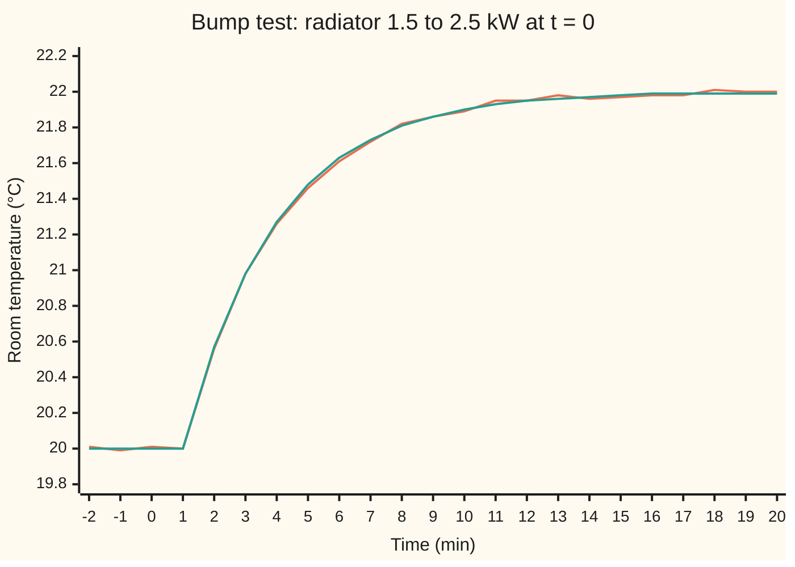
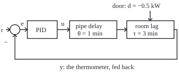
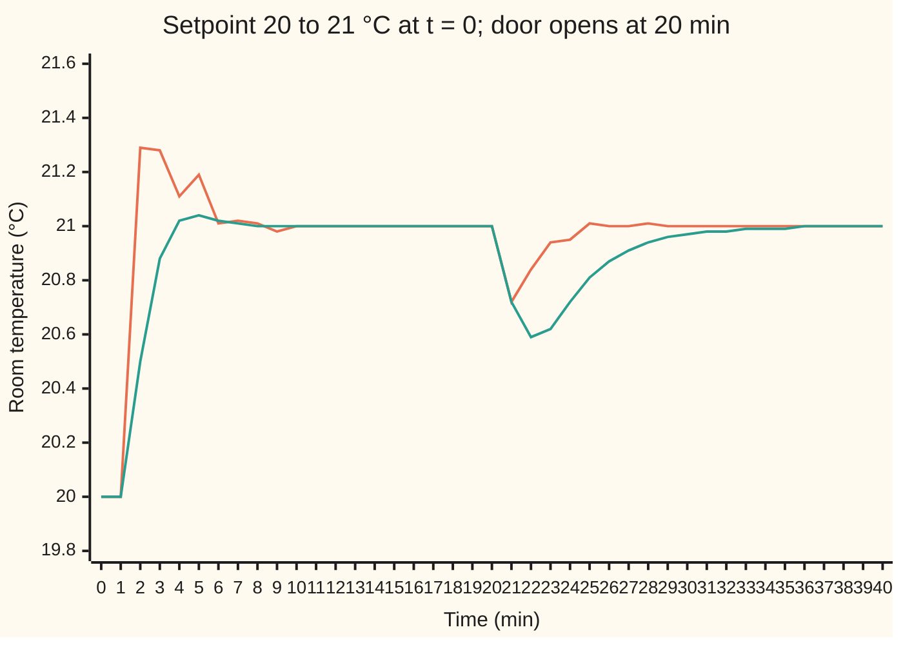

# PID control: answer the error, its history and its trend

[Syllabus](../../../SYLLABUS.md) → [Engineering mathematics](../README.md) → [Feedback Control](../README.md#s03) → PID control

---

## General Overview

A small room is heated by one radiator, fed with hot water through a long, slow pipe. A steady 1.5 kW holds the room at 20 °C. The engineer wants a thermostat that reaches a new temperature quickly, overshoots little, and holds it when someone opens the door. First the engineer needs to know how the room answers the radiator.

So the engineer runs a **bump test**: raise the radiator from 1.5 kW to 2.5 kW at a stroke and log the thermometer every 0.1 min, from 2 minutes before the bump to 20 minutes after. For a minute nothing happens: the hot water is still in the pipe. Then the room warms, fast at first, and settles near 22 °C. Three numbers describe the record. The room gained 2 °C for 1 kW: a **gain** of two. Once it started, it took about three minutes to cover 63% of the rise: a **lag** of three minutes. It waited one minute before starting: a **delay** of one. Time on this card is in minutes, the room's natural scale.

The thermostat answers the **error**, the setpoint minus the measured temperature, three ways: in proportion to the error now, to its history, and to its trend. That rule is a **PID controller**: proportional, integral, derivative. A tuning rule turns the bump-test numbers into the three strengths, and a door opening tests the result.

### The picture: the bump test and the model fitted to it



Orange: the thermometer, one reading per minute from the 0.1-minute log, with ±0.02 °C of reading noise. Green: the model fitted by the two-point method below: flat for 1.017 min, then a rise with a 2.962 min lag to 1.997 °C above the start.

**Model the plant from one bump test as a gain, a lag and a delay; set the proportional, integral and derivative strengths from those three numbers by a rule; then check the loop against a disturbance and a model error, because the delay sets how hard any controller can push.**

**What kind of fact this is:** a method. The fitted model is an approximation that holds near the operating point; the lambda rule is derived on this card in Why it works; the Ziegler–Nichols rule is an empirical recipe. Every claim about the loop is tested by its frequency response and by simulation.

---

## The formula

The controller watches the **error** $e = r - y$: the setpoint $r$ minus the measured temperature $y$, both as changes from 20 °C. It sets the radiator change $u$, in kW from the 1.5 kW baseline. Three strengths, called **gains**, are new notation here: the proportional gain $K_p$, the integral gain $K_i$ and the derivative gain $K_d$. The PID law is

$$u(t) = K_p\,e(t) + K_i\int_0^t e(t')\,dt' + K_d\,\frac{de}{dt}.$$

**Read it aloud:** the heat change is a proportional gain times the error now, plus an integral gain times the error added up so far, plus a derivative gain times the rate the error is changing.

Engineers often write it with one gain and two times: $K_i = K_p/T_i$ and $K_d = K_p T_d$. The integral time $T_i$ is how long a steady error takes to double the proportional push. The derivative time $T_d$ is how far ahead the derivative term looks along the trend.

The bump test fits a **first-order-plus-dead-time** model, a single lag behind a pure delay; the factor $e^{-\theta s}$ is the delay of $\theta$ minutes:

$$G(s) = \frac{K\,e^{-\theta s}}{\tau s + 1}, \qquad y(t) = K\,\Delta u\,\Big(1 - e^{-(t-\theta)/\tau}\Big) \ \text{for } t > \theta.$$

**Read it aloud:** after a heat step, the room waits the delay, then rises towards the gain times the step, covering 63.2% of the way in one lag.

Two tuning rules turn $(K, \tau, \theta)$ into gains:

$$\text{Ziegler–Nichols PID: } K_p = \frac{1.2\,\tau}{K\theta},\ T_i = 2\theta,\ T_d = \frac{\theta}{2}; \qquad \text{lambda PI: } K_p = \frac{\tau}{K(\lambda + \theta)},\ T_i = \tau,\ T_d = 0.$$

The lambda rule asks the engineer to choose one number, $\lambda$, the time constant wanted for the closed loop. This card takes $\lambda$ = 1 min, equal to the delay, which Skogestad's version of the rule (SIMC, Simple Internal Model Control) recommends as a robust default.

| Symbol | Plain meaning | In our example | Push it up and the answer… |
| --- | --- | --- | --- |
| $u$, $y$, $r$, $e$, $\Delta u$ | heat change in kW; temperature change in °C; setpoint; error $r - y$; the bump size | bump $\Delta u$ = 1 kW; setpoint step 1 °C | — |
| $K_p$ | proportional gain, kW per °C of error | 1.800 (ZN), 0.750 (lambda) | faster, less stable |
| $K_i$, $T_i$ | integral gain in kW per °C per min; integral time in min | 0.900 and 2.000 min (ZN); 0.250 and 3.000 min (lambda) | $K_i$ up: offset cleared faster, more overshoot |
| $K_d$, $T_d$ | derivative gain in kW·min per °C; derivative time in min | 0.900 and 0.500 min (ZN); 0 (lambda) | more braking, more noise passed through |
| $K$ | the room's gain: settled °C per kW | 2 °C/kW (fitted 1.997) | the same gains push harder |
| $\tau$ | the room's lag, the time constant | 3 min (fitted 2.962) | slower room |
| $\theta$ | the pipe's delay, dead time | 1 min (fitted 1.017) | lower safe gain |
| $\lambda$ | chosen closed-loop time constant | 1 min | gentler, more robust loop |
| $G(s)$, $C(s)$, $L(s)$, $s$, $j$ | room model; controller $K_p(1 + 1/(T_i s) + T_d s)$; loop gain $C G$; Laplace variable; $\sqrt{-1}$ | $s = j\omega$ for frequencies | — |
| $\omega$, $\omega_c$, $\omega_{180}$, $\pi$ | angular frequency in rad/min; where the loop gain is 1; where its phase is −180°, which is $\pi$ rad, half a cycle | $\omega_c$ = 0.5000 rad/min (lambda) | — |
| $K_u$, $P_u$, $\omega_u$ | ultimate gain: the proportional gain that just sustains oscillation; its period; its frequency | 2.6842 kW/°C, 3.5737 min, 1.7582 rad/min | — |
| $t$, $f$, $t_f$, $t_{28}$, $t_{63}$, $d$ | time in min; a fraction of the bump's rise; the time the model's rise passes the fraction $f$; times the record passes 28.3% and 63.2% of it; door heat loss in kW | 2.005 and 3.979 min; $d$ = −0.5 kW | — |
| $T(s)$ | complementary sensitivity: the closed loop from setpoint to temperature, here the one lambda tuning asks for | $e^{-s}/(s + 1)$ with $\lambda$ = 1 min | — |

Two numbers judge a loop, both from the loop gain $L(j\omega)$, which is the controller and room in series, read at frequency $\omega$ ([Nyquist and margins](06-nyquist-criterion-and-stability-margins.md)). The **gain margin** (GM) is how many times the loop gain could grow before the loop oscillates. The **phase margin** (PM) is how much extra lag, in degrees, it could take at $\omega_c$.

### The picture: the loop

<p align="center"></p>

Schematic, not to scale. The circle subtracts the measured temperature $y$ from the setpoint $r$. The door's heat loss enters at the room, after the pipe, so the controller sees it only through $y$.

### When it holds

- **Small changes about 20 °C and 1.5 kW.** The fit is a straight-line model of the room near its operating point. Far from it the slope drifts: a radiator's output is not a straight line in the room temperature ([PID in practice](08-pid-on-real-hardware.md) shows the curve), so $K$ = 2 °C/kW is the slope at 20 °C, not a constant. A drifting $K$ is a model error the loop must survive, as the third bullet shows.
- **One lag behind one delay.** Heavy walls add a second lag, which the fit folds into a longer apparent delay.
- **The room stays the room.** Hotter boiler water raises $K$. Lower flow lengthens $\theta$. The Ziegler–Nichols gains lose stability at a 50% gain rise or a doubled delay, and both are shown below.
- **The radiator can deliver what is asked.** Between 0 and 3 kW. A 4 °C setpoint asks for 2.0 kW extra, but the radiator gives at most 1.5 kW more, so the room tops out at 23.0 °C. Past the limit the integral keeps growing while the radiator cannot respond: integral windup, shown in What breaks.
- **A quiet thermometer for the derivative.** The derivative term multiplies the rate of change of the reading, so it multiplies reading noise too: [PID in practice](08-pid-on-real-hardware.md).

---

## Why it works

### Step 0: each term answers a different question about the error

The proportional term answers "how far off is it now", the integral term "how long, and by how much", the derivative term "where is it heading". None needs the room's equations. Each reacts to the measured error, so it corrects whatever caused it: a door, a cold wall, a wrong model. The model enters once, when the gains are chosen. The delay is why that choice matters: the controller always acts on news at least a minute old.

### Step 1: proportional action alone leaves an offset

At rest, the room sits at $y = K u$. A proportional controller sets $u = K_p e$. With $e = r - y$, these give $e = r - K K_p e$, so

$$e_{\text{rest}} = \frac{r}{1 + K K_p}.$$

A warmer room needs more heat, and a proportional controller gives more heat only while an error remains. With $K_p$ = 1.8 kW/°C, a 1 °C step leaves $1/(1 + 2 \times 1.8)$ = 0.2174 °C of error for ever. The simulation agrees: 0.2174 °C after 80 minutes. This is the type-0 offset of [Steady-state error](03-steady-state-error-and-system-type.md).

### Step 2: the integral term drives the error to zero, and pays a known debt

Suppose the loop settles. Then $e$ and $u$ are constant and the derivative term is zero, so the integral term, $u$ minus the proportional term, is constant too. Its rate of change is $K_i e$, so $e = 0$. Any settled state of a PI or PID loop has zero error, whatever the door or the walls do. That is the integrator's pole at $s = 0$ making the loop type 1.

The same argument prices a disturbance. The door removes 0.5 kW. Once the room has recovered, $e$ and its rate are back at zero, so the proportional and derivative terms are back at their old values. The extra 0.5 kW must all come from the integral term: $K_i \int e\,dt = 0.5$. So the error added up over the whole recovery is

$$\int e\,dt = \frac{\lvert d \rvert}{K_i}.$$

For the Ziegler–Nichols gains that is 0.5/0.9 = 0.5556 °C·min. For the lambda gains it is 0.5/0.25 = 2.0000 °C·min. The simulation gives 0.5555 and 2.0000. A larger integral gain means a smaller debt, and no tuning escapes this budget.

### Step 3: two points on the bump record give the lag and the delay

After the delay, the model's rise covers the fraction $f$ of its total at time $t_f = \theta + \tau\ln\!\big(1/(1 - f)\big)$. Pick two fractions whose logarithms are easy. For 28.3%, $\ln(1/0.717)$ = 0.3327, about one third. For 63.2%, $\ln(1/0.368)$ = 0.9997, about one. So

$$t_{28} = \theta + \tfrac{\tau}{3}, \qquad t_{63} = \theta + \tau \quad\Longrightarrow\quad \tau = 1.5\,(t_{63} - t_{28}), \qquad \theta = t_{63} - \tau.$$

The gain is the settled rise over the bump. This is C. L. Smith's two-point method (1972), as taught by Seborg and coauthors; it needs two readings off the record. A least-squares fit of all 221 readings is a second, independent road, and the code takes it.

### Step 4: the delay caps the gain

A pure delay of $\theta$ shifts a sine of frequency $\omega$ by $\omega\theta$ radians and leaves its size alone. The lag adds $\arctan(\tau\omega)$ more. Under proportional control with gain $K_p$, the loop gain is $L(j\omega) = K_p K e^{-j\omega\theta}/(1 + j\tau\omega)$. At the frequency $\omega_u$ where the total lag reaches half a cycle,

$$\arctan(\tau\omega_u) + \theta\,\omega_u = \pi,$$

the fed-back signal returns inverted, and the subtraction at the circle turns into an addition. If the loop gain there is 1 or more, a swing feeds itself. So the largest proportional gain is

$$K_u = \frac{\sqrt{1 + \tau^2\omega_u^2}}{K}, \qquad P_u = \frac{2\pi}{\omega_u}.$$

For the room, $\omega_u$ = 1.7582 rad/min, $K_u$ = 2.6842 kW/°C and $P_u$ = 3.5737 min. Without the delay there would be no such limit: a single lag never reaches −180°. The simulation finds $K_u$ = 2.6725 and $P_u$ = 3.5900 min. The small gap is the simulation's own: each heater setting is held for one 0.01 min step, which adds half a step of delay.

### Step 5: lambda tuning picks the closed loop and solves for the controller

Ask for a closed loop that copies the setpoint after the unavoidable delay, smoothed by a chosen time constant $\lambda$: $T(s) = e^{-\theta s}/(\lambda s + 1)$, the complementary sensitivity of [Sensitivity functions](02-sensitivity-and-the-gang-of-four.md). The controller that delivers it satisfies $T = CG/(1 + CG)$, so $C = T/\big(G(1 - T)\big)$. Replace the delay in $1 - T$ by its first-order approximation $e^{-\theta s} \approx 1 - \theta s$, and the controller comes out as a PI controller whose integral time cancels the room's lag:

$$C(s) = \frac{\tau}{K(\lambda + \theta)}\Big(1 + \frac{1}{\tau s}\Big).$$

<details>
<summary>Detailed proof</summary>

With $G = K e^{-\theta s}/(\tau s + 1)$ and $T = e^{-\theta s}/(\lambda s + 1)$,
$$1 - T = \frac{\lambda s + 1 - e^{-\theta s}}{\lambda s + 1} \approx \frac{\lambda s + 1 - (1 - \theta s)}{\lambda s + 1} = \frac{(\lambda + \theta)s}{\lambda s + 1}.$$
Then
$$C = \frac{T}{G(1 - T)} = \frac{e^{-\theta s}}{\lambda s + 1}\cdot\frac{\tau s + 1}{K e^{-\theta s}}\cdot\frac{\lambda s + 1}{(\lambda + \theta)s} = \frac{\tau s + 1}{K(\lambda + \theta)s} = \frac{\tau}{K(\lambda + \theta)}\Big(1 + \frac{1}{\tau s}\Big).$$
So $K_p = \tau/(K(\lambda + \theta))$ and $T_i = \tau$. The delay cancels exactly; only the approximation in $1 - T$ is not exact.

The margins follow in closed form. With this $C$, the lag cancels and $L(s) = e^{-\theta s}/((\lambda + \theta)s)$. Its size at $s = j\omega$ is $1/((\lambda + \theta)\omega)$ and its phase is $-\pi/2 - \theta\omega$. The size is 1 at $\omega_c = 1/(\lambda + \theta)$, so the phase margin is $\pi/2 - \theta/(\lambda + \theta)$ radians. The phase is $-\pi$ at $\omega_{180} = \pi/(2\theta)$, where the size is $2\theta/(\pi(\lambda + \theta))$, so the gain margin is $\pi(\lambda + \theta)/(2\theta)$. With $\lambda = \theta$ the gain margin is $\pi$ for every room of this shape. Since a change in delay leaves $\omega_c$ alone, the loop stays stable until the delay reaches the value that uses up the phase margin: $\theta' = (\lambda + \theta)\,\pi/2$, which is 3.142 min here.

</details>

In words: the integral time equals the lag, so the controller's zero cancels the room's pole. What is left is an integrator behind the delay, its speed set by one number. A larger $\lambda$ gives a slower, safer loop, and the margins are known in advance.

### Step 6: Ziegler–Nichols is a recipe aimed at fast recovery

Ziegler and Nichols, in 1942, tuned many real loops by hand. They aimed for swings that shrink to a quarter each cycle, and wrote the gains that gave it in terms of the bump's delay and slope; the slope is $K/\tau$ per kW, hence $\tau/(K\theta)$ in the rule. Their second recipe uses the ultimate gain and period: $K_p = 0.6\,K_u$, $T_i = P_u/2$, $T_d = P_u/8$. Both are rules of thumb fitted to experience. Quarter decay is aggressive: quick recovery from the door, at the price of a gain margin of 1.452.

Another road to the same gains places the closed-loop poles by hand, on a plot of how they move as one gain rises ([Root locus](05-root-locus.md)); a third shapes $L(j\omega)$ directly ([Loop shaping](09-lead-lag-compensation-and-loop-shaping.md)).

---

## Worked numbers, by hand

From the bump record to the lambda gains and their margins. The bump was 1 kW.

| Step | Arithmetic | Value |
| --- | --- | --- |
| baseline and settled level | mean of the first 2 min; mean of the last 2 min | 20.001 °C; 21.998 °C |
| gain $K$ | (21.998 − 20.001) °C per 1 kW | 1.997 °C/kW |
| two read-off times | where the record crosses 28.3% and 63.2% of its rise | $t_{28}$ = 2.005 min, $t_{63}$ = 3.979 min |
| lag $\tau$ | 1.5 × (3.979 − 2.005), from the unrounded gap 1.9747 | 2.962 min |
| delay $\theta$ | 3.979 − 2.962 | 1.017 min |
| check by least squares | best fit of all 221 readings | 1.999 °C/kW, 3.000 min, 1.000 min |
| model used | rounded | $K$ = 2 °C/kW, $\tau$ = 3 min, $\theta$ = 1 min |
| lambda PI, $\lambda$ = 1 min | $K_p$ = 3 / (2 × (1 + 1)); $T_i$ = $\tau$ | 0.750 kW/°C; 3.000 min |
| loop gain | $L(s) = e^{-s}/(2s)$ | — |
| crossover | $1/(2\omega_c) = 1$ | $\omega_c$ = 0.5000 rad/min |
| phase margin | 90° minus $\theta\omega_c$ = 0.5 rad | 61.35° |
| gain margin | phase −180° at $\omega_{180} = \pi/2$ = 1.5708 rad/min, where the size is $1/\pi$ | GM = $\pi$ = 3.142 |
| Ziegler–Nichols PID | 1.2 × 3 / (2 × 1); 2 × 1; 1 / 2 | 1.800 kW/°C; 2.000 min; 0.500 min |
| **lambda PI gains** | | **$K_p$ = 0.750 kW/°C, $K_i$ = 0.250 kW/°C per min, GM 3.142, PM 61.35°** |

A room thermostat with these gains could see its gain grow by a factor of 3.142, or its pipe delay grow to 3.142 min, before it began to oscillate.

### Testing the loop: a setpoint step, then the door

The setpoint rises from 20 °C to 21 °C at $t$ = 0. At $t$ = 20 min the door opens and stays open, taking 0.5 kW.



Orange: Ziegler–Nichols PID. Green: lambda PI. Points are one minute apart, so the orange peak, 0.469 °C over, falls between plotted points.

| Tuning | Overshoot | Settles within 0.02 °C | Door dip | Error added up after the door | GM | PM |
| --- | --- | --- | --- | --- | --- | --- |
| Ziegler–Nichols PID | 0.469 °C | 7.72 min | 0.288 °C | 0.598 °C·min | 1.452 | 47.87° |
| lambda PI | 0.042 °C | 6.06 min | 0.415 °C | 1.996 °C·min | 3.142 | 61.35° |

Read back in the room: Ziegler–Nichols overshoots by nearly half a degree and takes 7.72 min to settle, but holds the door's dip to 0.288 °C. Lambda tuning reaches 21 °C with 0.042 °C of overshoot and settles sooner, but the door pulls the room 0.415 °C down, and it is still at 20.98 °C at 32 min. Both end with no error: 0.0000 °C and 0.0012 °C at 40 min, the second still closing. The error column adds up the size of the error from 20 to 40 min; Step 2's signed totals are 0.5556 and 2.0000 °C·min.

### What breaks if you drop a piece

| Mistake | Comes out at | What went wrong |
| --- | --- | --- |
| P only, $K_p$ = 1.8 kW/°C | 0.2174 °C short of a 1 °C step, for ever | No integral: more heat needs a standing error |
| P only at 1.1 $K_u$ = 2.953 kW/°C | the swing grows ×4.00 every 20 min | Above the ultimate gain, the delay turns each correction into a push the wrong way |
| Lambda PI, 2.5 °C step, radiator 0 to 3 kW, no anti-windup (stop integrating while the radiator is flat out) | 0.365 °C overshoot, 17.10 min to settle (with anti-windup: 0.000 °C, 11.87 min) | The integral kept growing while the radiator was flat out, then had to unwind |
| Ziegler–Nichols PID, pipe delay doubles to 2 min | GM 0.809, PM −19.04°, the swing grows ×7.289 every 20 min | Quarter-decay gains left too little margin; lambda PI on the same room: GM 1.571, PM 32.70°, swing ×0.039 |

The time-domain figures on this card come from the simulation's 0.01 min step, whose held heater setting adds half a step to the pipe delay (Step 4). A 0.001 min step moves the Ziegler–Nichols overshoot and settling only a little, to 0.458 °C and 7.63 min. Near a stability edge the half step matters more: the swing growth falls to ×6.84 with the doubled delay, and to ×2.32 on the $K$ = 3 room of Try changing. The verdicts, grows or shrinks, stay the same.

---

## Code, from first principles, and it actually runs

Three independent roads. Road 1 makes the bump record from the true room plus SplitMix64 noise (seed 2026) and fits it twice: two-point, and least squares over a grid of delays and lags. Road 2 is the frequency domain: the ultimate gain, and each tuning's margins by bisection on $\lvert L(j\omega)\rvert = 1$ and on a phase of −180°. Road 3 simulates the loop: an exact step for the lag, a buffer of past heater settings for the pipe, and the PID law with its derivative taken on the measurement, so a setpoint step does not jolt the radiator. The asserts tie the roads together: simulated and frequency-domain ultimate gains within 1%; gains at 0.98 times the gain margin decay and at 1.02 times grow; every loop with GM below 1 grows in simulation; the integrated door error equals $\lvert d \rvert/K_i$; the two-minute delay is unstable in both roads or neither. Road 3 is run once more at a 0.001 min step, to show which figures depend on the step.

### Python

```python
# PID control and tuning -- the check behind the card.  Standard library only.
# A small room heated by a radiator through a slow pipe.  Input u: radiator heat, kW, as a change
# from the 1.5 kW that holds 20 C.  Output y: room temperature change, C.  Time in minutes.
# True room: first order plus dead time, gain 2 C/kW, lag 3 min, pipe delay 1 min.
# Roads: (1) fit the model from a noisy bump test two ways; (2) the frequency domain (margins,
# ultimate gain) in closed form; (3) time-domain simulation of the loop, exact step by step.
from math import exp, atan, sqrt, pi, log

K, TAU, TH, DT, M64 = 2.0, 3.0, 1.0, 0.01, (1 << 64) - 1

def splitmix(seed):                              # SplitMix64: uniform numbers in [0, 1)
    s = seed
    def nxt():
        nonlocal s
        s = (s + 0x9E3779B97F4A7C15) & M64
        z = ((s ^ (s >> 30)) * 0xBF58476D1CE4E5B9) & M64
        z = ((z ^ (z >> 27)) * 0x94D049BB133111EB) & M64
        return (z ^ (z >> 31)) / 2.0 ** 64
    return nxt

# ---- road 1: the bump test.  Heat 1.5 -> 2.5 kW at t = 0; thermometer noise +-0.02 C ----
rnd = splitmix(2026)
ts = [n / 10 - 2 for n in range(221)]                       # -2 .. 20 min, every 0.1 min
data = [20 + (K * (1 - exp(-(t - TH) / TAU)) if t > TH else 0) + 0.04 * (rnd() - 0.5) for t in ts]
base = sum(data[:20]) / 20; final = sum(data[-21:]) / 21
def cross(f):                                    # first time the rise passes fraction f, interpolated
    lvl = base + f * (final - base)
    i = next(i for i, v in enumerate(data) if v >= lvl)
    return ts[i - 1] + (lvl - data[i - 1]) / (data[i] - data[i - 1]) * 0.1
t28, t63 = cross(0.283), cross(0.632)
kA, tauA = final - base, 1.5 * (t63 - t28); thA = t63 - tauA
best = None                                      # least squares: grid over delay and lag, gain in closed form
for i in range(81):
    for j in range(201):
        th, tau = 0.8 + 0.005 * i, 2.5 + 0.005 * j
        f = [1 - exp(-(t - th) / tau) if t > th else 0.0 for t in ts]
        k = sum(a * (v - base) for a, v in zip(f, data)) / sum(a * a for a in f)
        sse = sum((v - base - k * a) ** 2 for a, v in zip(f, data))
        if best is None or sse < best[0]: best = (sse, k, tau, th)
print("room: K = 2 C/kW, tau = 3 min, theta = 1 min; bump 1.5 -> 2.5 kW at t = 0; noise +-0.02 C")
print(f"bump, read off: base {base:.3f} C, final {final:.3f} C, t28 {t28:.3f} min, t63 {t63:.3f} min")
print(f"fit, two-point:     K {kA:.3f} C/kW  tau {tauA:.3f} min  theta {thA:.3f} min  (t63 - t28 = {t63 - t28:.4f} min)")
print(f"two-point constants: ln(1/(1 - 0.283)) = {-log(1 - 0.283):.4f}, ln(1/(1 - 0.632)) = {-log(1 - 0.632):.4f}")
_, kB, tauB, thB = best; print(f"fit, least squares: K {kB:.3f} C/kW  tau {tauB:.3f} min  theta {thB:.3f} min")
assert abs(kA - K) < 0.03 and abs(tauA - TAU) < 0.1 and abs(thA - TH) < 0.05   # recovers the room
assert abs(kB - K) < 0.02 and abs(tauB - TAU) < 0.05 and abs(thB - TH) < 0.03

# ---- road 2: frequency domain.  L(jw) = C(jw) K e^(-j w theta) / (1 + j w tau) ----
def L(w, kp, ti, td, k=K, tau=TAU, th=TH):
    c = td * w - (1 / (ti * w) if ti else 0.0)                  # PID: kp (1 + j c)
    return kp * sqrt(1 + c * c) * k / sqrt(1 + (w * tau) ** 2), atan(c) - atan(w * tau) - w * th
def first(fn, lo=0.01):                          # scan up for a sign change of fn, then bisect it
    w = lo
    while fn(w) * fn(w * 1.01) > 0: w *= 1.01
    a, b = w, w * 1.01
    for _ in range(60):
        m = (a + b) / 2
        if fn(a) * fn(m) <= 0: b = m
        else: a = m
    return a
def margins(kp, ti, td, **kw):
    wc = first(lambda w: L(w, kp, ti, td, **kw)[0] - 1)
    w180 = first(lambda w: L(w, kp, ti, td, **kw)[1] + pi)
    return 1 / L(w180, kp, ti, td, **kw)[0], (pi + L(wc, kp, ti, td, **kw)[1]) * 180 / pi, wc, w180
_, _, _, wu = margins(1.0, None, 0.0)
ku, pu = sqrt(1 + (wu * TAU) ** 2) / K, 2 * pi / wu
print(f"ultimate, frequency domain: wu {wu:.4f} rad/min  Ku {ku:.4f} kW/C  Pu {pu:.4f} min")

# ---- road 3: simulate the loop.  Exact step for the lag, a buffer for the pipe delay ----
def loop(kp, ti, td, k=K, tau=TAU, th=TH, r=1.0, dist=-0.5, tdist=20.0, tend=40.0, umax=None, aw=True, dt=DT):
    a, nd = exp(-dt / tau), round(th / dt); buf = [0.0] * nd; y = yp = ip = 0.0; ys = []
    for n in range(round(tend / dt) + 1):
        ys.append(y); e = r - y
        ui = ip + (kp / ti * e * dt if ti else 0.0)            # integral term
        u = kp * e + ui - kp * td * (y - yp) / dt              # derivative acts on the measurement
        if umax is not None and abs(u) > umax:
            u = umax if u > 0 else -umax
            if aw: ui = ip                                     # anti-windup: stop integrating
        ip, yp = ui, y
        ud = buf[n % nd]; buf[n % nd] = u
        y = a * y + (1 - a) * k * (ud + (dist if n * dt >= tdist else 0.0))
    return ys
def growth(kp, ti, td, **kw):                    # swing in 40..60 min over swing in 20..40 min, no disturbance
    ys, n = loop(kp, ti, td, dist=0.0, tend=60.0, **kw), round(20 / kw.get("dt", DT))
    return max(abs(v - 1) for v in ys[2 * n:]) / max(abs(v - 1) for v in ys[n:2 * n])
lo, hi = 2.0, 3.5
for _ in range(40):
    m = (lo + hi) / 2
    if growth(m, None, 0.0) > 1: hi = m
    else: lo = m
ys = loop(lo, None, 0.0, dist=0.0, tend=60.0)
up = [n * DT for n in range(3001, 6000) if ys[n - 1] < 1 <= ys[n]]
print(f"ultimate, simulation:       Ku {lo:.4f} kW/C  Pu {(up[-1] - up[0]) / (len(up) - 1):.4f} min")
assert abs(lo / ku - 1) < 0.01 and abs((up[-1] - up[0]) / (len(up) - 1) / pu - 1) < 0.01

TUNE = {"ZN PID": (1.2 * TAU / (K * TH), 2 * TH, 0.5 * TH), "lambda PI": (TAU / (K * (1.0 + TH)), TAU, 0.0)}   # lambda = 1 min
for name, g in TUNE.items():
    gm, pm, wc, w180 = margins(*g)
    ys = loop(*g)
    ov, settle = max(ys[:2000]) - 1, max(n for n in range(2000) if abs(ys[n] - 1) > 0.02) * DT
    dip, iae = 1 - min(ys[2000:]), sum(abs(1 - v) for v in ys[2000:]) * DT
    print(f"{name:9s}: Kp {g[0]:.3f} kW/C  Ti {g[1]:.3f} min  Td {g[2]:.3f} min  Ki {g[0] / g[1]:.3f}  Kd {g[0] * g[2]:.3f}")
    print(f"{name:9s}: GM {gm:.3f}  PM {pm:.2f} deg  wc {wc:.4f}  w180 {w180:.4f} rad/min")
    ie = sum(1 - v for v in loop(*g, tend=60.0)[2000:]) * DT
    print(f"{name:9s}: overshoot {ov:.3f} C  settles (2%) {settle:.2f} min  door dip {dip:.3f} C  IAE {iae:.3f} C min")
    print(f"{name:9s}: error at 40 min {abs(1 - ys[-1]):.4f} C; door error, integrated {ie:.4f} C min (0.5/Ki = {0.5 * g[1] / g[0]:.4f})")
    assert abs(1 - ys[-1]) < 0.005 and abs(ie / (0.5 * g[1] / g[0]) - 1) < 0.002   # integral action: no offset
    assert growth(g[0] * gm * 0.98, g[1], g[2]) < 1 < growth(g[0] * gm * 1.02, g[1], g[2])   # GM is the edge
gm, pm, wc, _ = margins(*TUNE["lambda PI"])
print(f"lambda PI, by hand: GM = pi = {pi:.3f}  PM = 90 - 0.5 rad = {90 - 0.5 * 180 / pi:.2f} deg  wc = 0.5")
assert abs(gm - pi) < 1e-6 and abs(pm - (90 - 0.5 * 180 / pi)) < 1e-6 and abs(wc - 0.5) < 1e-6

# ---- what breaks ----
ys = loop(1.8, None, 0.0, dist=0.0, tend=80.0)
print(f"wrong: P only, Kp 1.8: error left {1 - ys[-1]:.4f} C (formula 1/(1 + K Kp) = {1 / (1 + K * 1.8):.4f})")
assert abs(1 - ys[-1] - 1 / (1 + K * 1.8)) < 1e-3
print(f"wrong: P only at 1.1 Ku = {1.1 * ku:.3f}: swing grows x{growth(1.1 * ku, None, 0.0):.2f} per 20 min")
for aw in (False, True):
    ys = loop(*TUNE["lambda PI"], r=2.5, dist=0.0, umax=1.5, aw=aw)
    print(f"windup: lambda PI, 2.5 C step, heater 0..3 kW, anti-windup {'on ' if aw else 'off'}:"
          f" overshoot {max(max(ys) - 2.5, 0.0):.3f} C, settles (2%) {max(n for n in range(4001) if abs(ys[n] - 2.5) > 0.05) * DT:.2f} min")
for name, g in TUNE.items():
    gm, pm, _, _ = margins(*g, th=2.0)
    print(f"wrong: pipe delay 2 min, {name:9s}: GM {gm:.3f}  PM {pm:.2f} deg  swing x{growth(*g, th=2.0):.3f} per 20 min")
    assert (gm > 1) == (growth(*g, th=2.0) < 1)                # frequency domain and simulation agree
print(f"outside the model: 4 C setpoint asks {4 / K:.1f} kW extra; heater gives 1.5, room tops out at {20 + 1.5 * K:.1f} C")
print(f"try: lambda = 3 min: Kp {TAU / (K * 4):.4f}  GM {margins(TAU / (K * 4), TAU, 0.0)[0]:.3f}")
g3 = growth(*TUNE["ZN PID"], k=3.0); print(f"try: ZN PID on K = 3 room: GM {margins(*TUNE['ZN PID'], k=3.0)[0]:.3f}  swing x{g3:.3f} per 20 min")
assert g3 > 1 and growth(1.1 * ku, None, 0.0) > 1              # GM below 1: the simulation grows too
zf = loop(*TUNE["ZN PID"], dt=0.001); print(f"finer step 0.001 min, ZN PID: overshoot {max(zf[:20000]) - 1:.3f} C  settles (2%) {max(n for n in range(20000) if abs(zf[n] - 1) > 0.02) * 0.001:.2f} min  swing x{growth(*TUNE['ZN PID'], k=3.0, dt=0.001):.2f} (K = 3), x{growth(*TUNE['ZN PID'], th=2.0, dt=0.001):.2f} (delay 2 min)")
print(f"try: lambda PI, longest pipe delay it survives: {1 + (pi / 2 - 0.5) / 0.5:.3f} min")
assert growth(*TUNE["lambda PI"], th=3.10) < 1 < growth(*TUNE["lambda PI"], th=3.20)   # simulation agrees
print("chart, bump t min    " + " ".join(f"{ts[n]:5.0f}" for n in range(0, 221, 10)))
print("chart, bump data C   " + " ".join(f"{data[n]:5.2f}" for n in range(0, 221, 10)))
print("chart, bump fit C    " + " ".join(f"{base + (kA * (1 - exp(-(ts[n] - thA) / tauA)) if ts[n] > thA else 0):5.2f}" for n in range(0, 221, 10)))
zn, lam = loop(*TUNE["ZN PID"]), loop(*TUNE["lambda PI"])
print("chart, loop t min    " + " ".join(f"{n:5d}" for n in range(41)))
print("chart, ZN PID C      " + " ".join(f"{20 + zn[n * 100]:5.2f}" for n in range(41)))
print("chart, lambda PI C   " + " ".join(f"{20 + lam[n * 100]:5.2f}" for n in range(41)))
print("ALL CHECKS PASS")
```

**Ran 2026-10-06 on macOS, Python 3.14.6, standard library only. All checks passed. Output, pasted from the run:**

```
room: K = 2 C/kW, tau = 3 min, theta = 1 min; bump 1.5 -> 2.5 kW at t = 0; noise +-0.02 C
bump, read off: base 20.001 C, final 21.998 C, t28 2.005 min, t63 3.979 min
fit, two-point:     K 1.997 C/kW  tau 2.962 min  theta 1.017 min  (t63 - t28 = 1.9747 min)
two-point constants: ln(1/(1 - 0.283)) = 0.3327, ln(1/(1 - 0.632)) = 0.9997
fit, least squares: K 1.999 C/kW  tau 3.000 min  theta 1.000 min
ultimate, frequency domain: wu 1.7582 rad/min  Ku 2.6842 kW/C  Pu 3.5737 min
ultimate, simulation:       Ku 2.6725 kW/C  Pu 3.5900 min
ZN PID   : Kp 1.800 kW/C  Ti 2.000 min  Td 0.500 min  Ki 0.900  Kd 0.900
ZN PID   : GM 1.452  PM 47.87 deg  wc 1.1678  w180 2.5169 rad/min
ZN PID   : overshoot 0.469 C  settles (2%) 7.72 min  door dip 0.288 C  IAE 0.598 C min
ZN PID   : error at 40 min 0.0000 C; door error, integrated 0.5555 C min (0.5/Ki = 0.5556)
lambda PI: Kp 0.750 kW/C  Ti 3.000 min  Td 0.000 min  Ki 0.250  Kd 0.000
lambda PI: GM 3.142  PM 61.35 deg  wc 0.5000  w180 1.5708 rad/min
lambda PI: overshoot 0.042 C  settles (2%) 6.06 min  door dip 0.415 C  IAE 1.996 C min
lambda PI: error at 40 min 0.0012 C; door error, integrated 2.0000 C min (0.5/Ki = 2.0000)
lambda PI, by hand: GM = pi = 3.142  PM = 90 - 0.5 rad = 61.35 deg  wc = 0.5
wrong: P only, Kp 1.8: error left 0.2174 C (formula 1/(1 + K Kp) = 0.2174)
wrong: P only at 1.1 Ku = 2.953: swing grows x4.00 per 20 min
windup: lambda PI, 2.5 C step, heater 0..3 kW, anti-windup off: overshoot 0.365 C, settles (2%) 17.10 min
windup: lambda PI, 2.5 C step, heater 0..3 kW, anti-windup on : overshoot 0.000 C, settles (2%) 11.87 min
wrong: pipe delay 2 min, ZN PID   : GM 0.809  PM -19.04 deg  swing x7.289 per 20 min
wrong: pipe delay 2 min, lambda PI: GM 1.571  PM 32.70 deg  swing x0.039 per 20 min
outside the model: 4 C setpoint asks 2.0 kW extra; heater gives 1.5, room tops out at 23.0 C
try: lambda = 3 min: Kp 0.3750  GM 6.283
try: ZN PID on K = 3 room: GM 0.968  swing x2.911 per 20 min
finer step 0.001 min, ZN PID: overshoot 0.458 C  settles (2%) 7.63 min  swing x2.32 (K = 3), x6.84 (delay 2 min)
try: lambda PI, longest pipe delay it survives: 3.142 min
chart, bump t min       -2    -1     0     1     2     3     4     5     6     7     8     9    10    11    12    13    14    15    16    17    18    19    20
chart, bump data C   20.01 19.99 20.01 20.00 20.56 20.98 21.26 21.46 21.61 21.72 21.82 21.86 21.89 21.95 21.95 21.98 21.96 21.97 21.98 21.98 22.01 22.00 22.00
chart, bump fit C    20.00 20.00 20.00 20.00 20.57 20.98 21.27 21.48 21.63 21.73 21.81 21.86 21.90 21.93 21.95 21.96 21.97 21.98 21.99 21.99 21.99 21.99 21.99
chart, loop t min        0     1     2     3     4     5     6     7     8     9    10    11    12    13    14    15    16    17    18    19    20    21    22    23    24    25    26    27    28    29    30    31    32    33    34    35    36    37    38    39    40
chart, ZN PID C      20.00 20.00 21.29 21.28 21.11 21.19 21.01 21.02 21.01 20.98 21.00 21.00 21.00 21.00 21.00 21.00 21.00 21.00 21.00 21.00 21.00 20.72 20.84 20.94 20.95 21.01 21.00 21.00 21.01 21.00 21.00 21.00 21.00 21.00 21.00 21.00 21.00 21.00 21.00 21.00 21.00
chart, lambda PI C   20.00 20.00 20.50 20.88 21.02 21.04 21.02 21.01 21.00 21.00 21.00 21.00 21.00 21.00 21.00 21.00 21.00 21.00 21.00 21.00 21.00 20.72 20.59 20.62 20.72 20.81 20.87 20.91 20.94 20.96 20.97 20.98 20.98 20.99 20.99 20.99 21.00 21.00 21.00 21.00 21.00
ALL CHECKS PASS
```

### Rust

The same checks, std only. Python's `sum` adds floats with compensation and Rust's does not; the difference sits far below the printed digits.

```rust
// PID control and tuning -- the same check as pid_control_and_tuning_check.py, in Rust.  Std only.
// Room heated through a slow pipe: u = radiator heat change (kW), y = room temperature change (C),
// time in minutes.  True room: gain 2 C/kW, lag 3 min, delay 1 min.  Roads: bump-test fits,
// closed-form frequency domain, exact step-by-step simulation of the loop.
use std::f64::consts::PI;

const K: f64 = 2.0; const TAU: f64 = 3.0; const TH: f64 = 1.0; const DT: f64 = 0.01;

struct SplitMix(u64);
impl SplitMix {
    fn next(&mut self) -> f64 {
        self.0 = self.0.wrapping_add(0x9E3779B97F4A7C15);
        let mut z = (self.0 ^ (self.0 >> 30)).wrapping_mul(0xBF58476D1CE4E5B9);
        z = (z ^ (z >> 27)).wrapping_mul(0x94D049BB133111EB);
        (z ^ (z >> 31)) as f64 / 18446744073709551616.0
    }
}
#[derive(Clone, Copy)] struct P { k: f64, tau: f64, th: f64, dt: f64 }
const ROOM: P = P { k: K, tau: TAU, th: TH, dt: DT };

// L(jw) = kp (1 + j c) K e^(-j w th) / (1 + j w tau): magnitude and phase; ti = 0 means no integral
fn l(w: f64, g: (f64, f64, f64), p: P) -> (f64, f64) {
    let c = g.2 * w - if g.1 > 0.0 { 1.0 / (g.1 * w) } else { 0.0 };
    (g.0 * (1.0 + c * c).sqrt() * p.k / (1.0 + (w * p.tau).powi(2)).sqrt(), c.atan() - (w * p.tau).atan() - w * p.th)
}
fn first(f: &dyn Fn(f64) -> f64) -> f64 {
    let mut w = 0.01;
    while f(w) * f(w * 1.01) > 0.0 { w *= 1.01; }
    let (mut a, mut b) = (w, w * 1.01);
    for _ in 0..60 {
        let m = (a + b) / 2.0; if f(a) * f(m) <= 0.0 { b = m; } else { a = m; }
    }
    a
}
fn margins(g: (f64, f64, f64), p: P) -> (f64, f64, f64, f64) {
    let (wc, w180) = (first(&|w| l(w, g, p).0 - 1.0), first(&|w| l(w, g, p).1 + PI));
    (1.0 / l(w180, g, p).0, (PI + l(wc, g, p).1) * 180.0 / PI, wc, w180)
}

fn sim(g: (f64, f64, f64), p: P, r: f64, dist: f64, tend: f64, umax: f64, aw: bool) -> Vec<f64> {
    let (kp, ti, td) = g;
    let (a, nd) = ((-p.dt / p.tau).exp(), (p.th / p.dt).round() as usize);
    let (mut buf, mut ys) = (vec![0.0; nd], Vec::new());
    let (mut y, mut yp, mut ip) = (0.0f64, 0.0f64, 0.0f64);
    for n in 0..=((tend / p.dt).round() as usize) {
        ys.push(y); let e = r - y;
        let mut ui = ip + if ti > 0.0 { kp / ti * e * p.dt } else { 0.0 };
        let mut u = kp * e + ui - kp * td * (y - yp) / p.dt;      // derivative on the measurement
        if u.abs() > umax {
            u = if u > 0.0 { umax } else { -umax };
            if aw { ui = ip; }                                   // anti-windup: stop integrating
        }
        ip = ui; yp = y;
        let ud = buf[n % nd]; buf[n % nd] = u;
        y = a * y + (1.0 - a) * p.k * (ud + if n as f64 * p.dt >= 20.0 { dist } else { 0.0 });
    }
    ys
}
fn lp(g: (f64, f64, f64), p: P, tend: f64) -> Vec<f64> { sim(g, p, 1.0, -0.5, tend, f64::INFINITY, true) }
fn growth(g: (f64, f64, f64), p: P) -> f64 {
    let (ys, n) = (sim(g, p, 1.0, 0.0, 60.0, f64::INFINITY, true), (20.0 / p.dt).round() as usize);
    let sw = |a: usize, b: usize| ys[a..b].iter().map(|v| (v - 1.0).abs()).fold(0.0, f64::max);
    sw(2 * n, ys.len()) / sw(n, 2 * n)
}
fn row(label: &str, v: &[f64], prec: usize) {
    let s: Vec<String> = v.iter().map(|x| format!("{:5.p$}", x, p = prec)).collect();
    println!("{}{}", label, s.join(" "));
}

fn main() {
    // ---- road 1: the bump test ----
    let mut rnd = SplitMix(2026);
    let ts: Vec<f64> = (0..221).map(|n| n as f64 / 10.0 - 2.0).collect();
    let data: Vec<f64> = ts.iter().map(|&t| 20.0 + if t > TH { K * (1.0 - (-(t - TH) / TAU).exp()) } else { 0.0 } + 0.04 * (rnd.next() - 0.5)).collect();
    let base = data[..20].iter().sum::<f64>() / 20.0;
    let fin = data[200..].iter().sum::<f64>() / 21.0;
    let cross = |f: f64| {
        let lvl = base + f * (fin - base);
        let i = data.iter().position(|&v| v >= lvl).unwrap();
        ts[i - 1] + (lvl - data[i - 1]) / (data[i] - data[i - 1]) * 0.1
    };
    let (t28, t63) = (cross(0.283), cross(0.632));
    let (ka, taua, tha) = (fin - base, 1.5 * (t63 - t28), t63 - 1.5 * (t63 - t28));
    let mut best = (f64::INFINITY, 0.0, 0.0, 0.0);
    for i in 0..81 {
        for j in 0..201 {
            let (th, tau) = (0.8 + 0.005 * i as f64, 2.5 + 0.005 * j as f64);
            let f: Vec<f64> = ts.iter().map(|&t| if t > th { 1.0 - (-(t - th) / tau).exp() } else { 0.0 }).collect();
            let k = f.iter().zip(&data).map(|(a, v)| a * (v - base)).sum::<f64>() / f.iter().map(|a| a * a).sum::<f64>();
            let sse = f.iter().zip(&data).map(|(a, v)| (v - base - k * a).powi(2)).sum::<f64>();
            if sse < best.0 { best = (sse, k, tau, th); }
        }
    }
    println!("room: K = 2 C/kW, tau = 3 min, theta = 1 min; bump 1.5 -> 2.5 kW at t = 0; noise +-0.02 C");
    println!("bump, read off: base {:.3} C, final {:.3} C, t28 {:.3} min, t63 {:.3} min", base, fin, t28, t63);
    println!("fit, two-point:     K {:.3} C/kW  tau {:.3} min  theta {:.3} min  (t63 - t28 = {:.4} min)", ka, taua, tha, t63 - t28);
    println!("two-point constants: ln(1/(1 - 0.283)) = {:.4}, ln(1/(1 - 0.632)) = {:.4}", -(1.0f64 - 0.283).ln(), -(1.0f64 - 0.632).ln());
    let (_, kb, taub, thb) = best; println!("fit, least squares: K {:.3} C/kW  tau {:.3} min  theta {:.3} min", kb, taub, thb);
    assert!((ka - K).abs() < 0.03 && (taua - TAU).abs() < 0.1 && (tha - TH).abs() < 0.05);
    assert!((kb - K).abs() < 0.02 && (taub - TAU).abs() < 0.05 && (thb - TH).abs() < 0.03);
    // ---- road 2: frequency domain ----
    let wu = margins((1.0, 0.0, 0.0), ROOM).3;
    let (ku, pu) = ((1.0 + (wu * TAU).powi(2)).sqrt() / K, 2.0 * PI / wu);
    println!("ultimate, frequency domain: wu {:.4} rad/min  Ku {:.4} kW/C  Pu {:.4} min", wu, ku, pu);
    // ---- road 3: simulation ----
    let (mut lo, mut hi) = (2.0, 3.5);
    for _ in 0..40 {
        let m = (lo + hi) / 2.0; if growth((m, 0.0, 0.0), ROOM) > 1.0 { hi = m; } else { lo = m; }
    }
    let ys = sim((lo, 0.0, 0.0), ROOM, 1.0, 0.0, 60.0, f64::INFINITY, true);
    let up: Vec<f64> = (3001..6000).filter(|&n| ys[n - 1] < 1.0 && 1.0 <= ys[n]).map(|n| n as f64 * DT).collect();
    let pus = (up[up.len() - 1] - up[0]) / (up.len() - 1) as f64;
    println!("ultimate, simulation:       Ku {:.4} kW/C  Pu {:.4} min", lo, pus);
    assert!((lo / ku - 1.0).abs() < 0.01 && (pus / pu - 1.0).abs() < 0.01);

    let tune = [("ZN PID", (1.2 * TAU / (K * TH), 2.0 * TH, 0.5 * TH)), ("lambda PI", (TAU / (K * (1.0 + TH)), TAU, 0.0))];
    for (name, g) in tune {
        let (gm, pm, wc, w180) = margins(g, ROOM);
        let ys = lp(g, ROOM, 40.0);
        let ov = ys[..2000].iter().fold(f64::MIN, |a, &b| a.max(b)) - 1.0;
        let settle = (0..2000).filter(|&n| (ys[n] - 1.0).abs() > 0.02).max().unwrap() as f64 * DT;
        let dip = 1.0 - ys[2000..].iter().fold(f64::MAX, |a, &b| a.min(b));
        let iae = ys[2000..].iter().map(|v| (1.0 - v).abs()).sum::<f64>() * DT;
        let ie = lp(g, ROOM, 60.0)[2000..].iter().map(|v| 1.0 - v).sum::<f64>() * DT;
        println!("{:9}: Kp {:.3} kW/C  Ti {:.3} min  Td {:.3} min  Ki {:.3}  Kd {:.3}", name, g.0, g.1, g.2, g.0 / g.1, g.0 * g.2);
        println!("{:9}: GM {:.3}  PM {:.2} deg  wc {:.4}  w180 {:.4} rad/min", name, gm, pm, wc, w180);
        println!("{:9}: overshoot {:.3} C  settles (2%) {:.2} min  door dip {:.3} C  IAE {:.3} C min", name, ov, settle, dip, iae);
        println!("{:9}: error at 40 min {:.4} C; door error, integrated {:.4} C min (0.5/Ki = {:.4})",
                 name, (1.0 - ys[ys.len() - 1]).abs(), ie, 0.5 * g.1 / g.0);
        assert!((1.0 - ys[ys.len() - 1]).abs() < 0.005 && (ie / (0.5 * g.1 / g.0) - 1.0).abs() < 0.002);
        assert!(growth((g.0 * gm * 0.98, g.1, g.2), ROOM) < 1.0 && 1.0 < growth((g.0 * gm * 1.02, g.1, g.2), ROOM));
    }
    let (gm, pm, wc, _) = margins(tune[1].1, ROOM);
    println!("lambda PI, by hand: GM = pi = {:.3}  PM = 90 - 0.5 rad = {:.2} deg  wc = 0.5", PI, 90.0 - 0.5 * 180.0 / PI);
    assert!((gm - PI).abs() < 1e-6 && (pm - (90.0 - 0.5 * 180.0 / PI)).abs() < 1e-6 && (wc - 0.5).abs() < 1e-6);
    // ---- what breaks ----
    let off = 1.0 - sim((1.8, 0.0, 0.0), ROOM, 1.0, 0.0, 80.0, f64::INFINITY, true)[8000];
    println!("wrong: P only, Kp 1.8: error left {:.4} C (formula 1/(1 + K Kp) = {:.4})", off, 1.0 / (1.0 + K * 1.8));
    assert!((off - 1.0 / (1.0 + K * 1.8)).abs() < 1e-3);
    println!("wrong: P only at 1.1 Ku = {:.3}: swing grows x{:.2} per 20 min", 1.1 * ku, growth((1.1 * ku, 0.0, 0.0), ROOM));
    for aw in [false, true] {
        let ys = sim(tune[1].1, ROOM, 2.5, 0.0, 40.0, 1.5, aw);
        let mx = ys.iter().fold(f64::MIN, |a, &b| a.max(b));
        let st = (0..4001).filter(|&n| (ys[n] - 2.5).abs() > 0.05).max().unwrap() as f64 * DT;
        println!("windup: lambda PI, 2.5 C step, heater 0..3 kW, anti-windup {}: overshoot {:.3} C, settles (2%) {:.2} min",
                 if aw { "on " } else { "off" }, (mx - 2.5).max(0.0), st);
    }
    let slow = P { th: 2.0, ..ROOM };
    for (name, g) in tune {
        let (gm, pm, _, _) = margins(g, slow); let gr = growth(g, slow); println!("wrong: pipe delay 2 min, {:9}: GM {:.3}  PM {:.2} deg  swing x{:.3} per 20 min", name, gm, pm, gr);
        assert!((gm > 1.0) == (gr < 1.0));
    }
    println!("outside the model: 4 C setpoint asks {:.1} kW extra; heater gives 1.5, room tops out at {:.1} C", 4.0 / K, 20.0 + 1.5 * K);
    println!("try: lambda = 3 min: Kp {:.4}  GM {:.3}", TAU / (K * 4.0), margins((TAU / (K * 4.0), TAU, 0.0), ROOM).0);
    let g3 = growth(tune[0].1, P { k: 3.0, ..ROOM }); println!("try: ZN PID on K = 3 room: GM {:.3}  swing x{:.3} per 20 min", margins(tune[0].1, P { k: 3.0, ..ROOM }).0, g3);
    assert!(g3 > 1.0 && growth((1.1 * ku, 0.0, 0.0), ROOM) > 1.0);   // GM below 1: the simulation grows too
    let fine = P { dt: 0.001, ..ROOM }; let zf = lp(tune[0].1, fine, 40.0);
    println!("finer step 0.001 min, ZN PID: overshoot {:.3} C  settles (2%) {:.2} min  swing x{:.2} (K = 3), x{:.2} (delay 2 min)", zf[..20000].iter().fold(f64::MIN, |a, &b| a.max(b)) - 1.0, (0..20000).filter(|&n| (zf[n] - 1.0).abs() > 0.02).max().unwrap() as f64 * 0.001, growth(tune[0].1, P { k: 3.0, ..fine }), growth(tune[0].1, P { th: 2.0, ..fine }));
    println!("try: lambda PI, longest pipe delay it survives: {:.3} min", 1.0 + (PI / 2.0 - 0.5) / 0.5);
    assert!(growth(tune[1].1, P { th: 3.10, ..ROOM }) < 1.0 && 1.0 < growth(tune[1].1, P { th: 3.20, ..ROOM }));
    let pick: Vec<usize> = (0..221).step_by(10).collect();
    row("chart, bump t min    ", &pick.iter().map(|&n| ts[n]).collect::<Vec<_>>(), 0);
    row("chart, bump data C   ", &pick.iter().map(|&n| data[n]).collect::<Vec<_>>(), 2);
    row("chart, bump fit C    ", &pick.iter().map(|&n| base + if ts[n] > tha { ka * (1.0 - (-(ts[n] - tha) / taua).exp()) } else { 0.0 }).collect::<Vec<_>>(), 2);
    let (zn, lam) = (lp(tune[0].1, ROOM, 40.0), lp(tune[1].1, ROOM, 40.0));
    row("chart, loop t min    ", &(0..41).map(|n| n as f64).collect::<Vec<_>>(), 0);
    row("chart, ZN PID C      ", &(0..41).map(|n| 20.0 + zn[n * 100]).collect::<Vec<_>>(), 2);
    row("chart, lambda PI C   ", &(0..41).map(|n| 20.0 + lam[n * 100]).collect::<Vec<_>>(), 2);
    println!("ALL CHECKS PASS");
}
```

**Ran 2026-10-06 on macOS, rustc 1.98.1, no crates. All checks passed. Output, pasted from the run:**

```
room: K = 2 C/kW, tau = 3 min, theta = 1 min; bump 1.5 -> 2.5 kW at t = 0; noise +-0.02 C
bump, read off: base 20.001 C, final 21.998 C, t28 2.005 min, t63 3.979 min
fit, two-point:     K 1.997 C/kW  tau 2.962 min  theta 1.017 min  (t63 - t28 = 1.9747 min)
two-point constants: ln(1/(1 - 0.283)) = 0.3327, ln(1/(1 - 0.632)) = 0.9997
fit, least squares: K 1.999 C/kW  tau 3.000 min  theta 1.000 min
ultimate, frequency domain: wu 1.7582 rad/min  Ku 2.6842 kW/C  Pu 3.5737 min
ultimate, simulation:       Ku 2.6725 kW/C  Pu 3.5900 min
ZN PID   : Kp 1.800 kW/C  Ti 2.000 min  Td 0.500 min  Ki 0.900  Kd 0.900
ZN PID   : GM 1.452  PM 47.87 deg  wc 1.1678  w180 2.5169 rad/min
ZN PID   : overshoot 0.469 C  settles (2%) 7.72 min  door dip 0.288 C  IAE 0.598 C min
ZN PID   : error at 40 min 0.0000 C; door error, integrated 0.5555 C min (0.5/Ki = 0.5556)
lambda PI: Kp 0.750 kW/C  Ti 3.000 min  Td 0.000 min  Ki 0.250  Kd 0.000
lambda PI: GM 3.142  PM 61.35 deg  wc 0.5000  w180 1.5708 rad/min
lambda PI: overshoot 0.042 C  settles (2%) 6.06 min  door dip 0.415 C  IAE 1.996 C min
lambda PI: error at 40 min 0.0012 C; door error, integrated 2.0000 C min (0.5/Ki = 2.0000)
lambda PI, by hand: GM = pi = 3.142  PM = 90 - 0.5 rad = 61.35 deg  wc = 0.5
wrong: P only, Kp 1.8: error left 0.2174 C (formula 1/(1 + K Kp) = 0.2174)
wrong: P only at 1.1 Ku = 2.953: swing grows x4.00 per 20 min
windup: lambda PI, 2.5 C step, heater 0..3 kW, anti-windup off: overshoot 0.365 C, settles (2%) 17.10 min
windup: lambda PI, 2.5 C step, heater 0..3 kW, anti-windup on : overshoot 0.000 C, settles (2%) 11.87 min
wrong: pipe delay 2 min, ZN PID   : GM 0.809  PM -19.04 deg  swing x7.289 per 20 min
wrong: pipe delay 2 min, lambda PI: GM 1.571  PM 32.70 deg  swing x0.039 per 20 min
outside the model: 4 C setpoint asks 2.0 kW extra; heater gives 1.5, room tops out at 23.0 C
try: lambda = 3 min: Kp 0.3750  GM 6.283
try: ZN PID on K = 3 room: GM 0.968  swing x2.911 per 20 min
finer step 0.001 min, ZN PID: overshoot 0.458 C  settles (2%) 7.63 min  swing x2.32 (K = 3), x6.84 (delay 2 min)
try: lambda PI, longest pipe delay it survives: 3.142 min
chart, bump t min       -2    -1     0     1     2     3     4     5     6     7     8     9    10    11    12    13    14    15    16    17    18    19    20
chart, bump data C   20.01 19.99 20.01 20.00 20.56 20.98 21.26 21.46 21.61 21.72 21.82 21.86 21.89 21.95 21.95 21.98 21.96 21.97 21.98 21.98 22.01 22.00 22.00
chart, bump fit C    20.00 20.00 20.00 20.00 20.57 20.98 21.27 21.48 21.63 21.73 21.81 21.86 21.90 21.93 21.95 21.96 21.97 21.98 21.99 21.99 21.99 21.99 21.99
chart, loop t min        0     1     2     3     4     5     6     7     8     9    10    11    12    13    14    15    16    17    18    19    20    21    22    23    24    25    26    27    28    29    30    31    32    33    34    35    36    37    38    39    40
chart, ZN PID C      20.00 20.00 21.29 21.28 21.11 21.19 21.01 21.02 21.01 20.98 21.00 21.00 21.00 21.00 21.00 21.00 21.00 21.00 21.00 21.00 21.00 20.72 20.84 20.94 20.95 21.01 21.00 21.00 21.01 21.00 21.00 21.00 21.00 21.00 21.00 21.00 21.00 21.00 21.00 21.00 21.00
chart, lambda PI C   20.00 20.00 20.50 20.88 21.02 21.04 21.02 21.01 21.00 21.00 21.00 21.00 21.00 21.00 21.00 21.00 21.00 21.00 21.00 21.00 21.00 20.72 20.59 20.62 20.72 20.81 20.87 20.91 20.94 20.96 20.97 20.98 20.98 20.99 20.99 20.99 21.00 21.00 21.00 21.00 21.00
ALL CHECKS PASS
```

The two outputs agree line for line.

> [!TIP]
> **Try changing**
> Guess first, then run.
> - **A gentler loop.** Set $\lambda$ = 3 min, so $K_p = 3/(2 \times 4)$. Guess the gain margin. The formula in the folded proof gives $\pi \times 4/2$: **$K_p$ = 0.3750 kW/°C, GM 6.283**, twice as robust and slower.
> - **Hotter boiler water.** Run `margins(*TUNE['ZN PID'], k=3.0)`. Guess whether the Ziegler–Nichols loop survives a 50% rise in the room's gain. It does not: **GM 0.968**, just below 1, and the simulated swing grows ×2.911 every 20 min.
> - **A longer pipe for lambda PI.** Raise `th` in `growth` until the swing grows. Guess the limit. The phase margin of 61.35° at 0.5 rad/min runs out at **3.142 min** of total delay; the code confirms the swing shrinks at 3.10 min and grows at 3.20 min.

---

## The usual mistake

> [!warning]
> **Treating a tuning rule's gains as finished.** A rule is a starting point computed from one bump test on one day. Ziegler–Nichols PID on this room has a gain margin of 1.452: a 50% rise in the room's gain gives GM 0.968, and a doubled pipe delay gives GM 0.809. Both loops oscillate with growing swings. A loop is fit for use only after it has been checked against a disturbance and against the model being wrong, by its margins or by simulation.
>
> - **Leaving out the integral.** Proportional control on this room leaves 0.2174 °C of a 1 °C step unreached, however long it waits.
> - **Mixing minutes and seconds.** The gains here are per minute. Typed into a controller that counts seconds, $K_i$, $K_d$, $T_i$ and $T_d$ are off by a factor of 60.
> - **Reading the 63.2% time as the lag.** The 63.2% point is at $\theta + \tau$, 3.979 min, not at $\tau$. Forgetting to subtract the delay makes the lag look like 3.979 min instead of 2.962 min.
> - **Ignoring the radiator's limits.** Without anti-windup, a 2.5 °C step overshoots by 0.365 °C instead of 0.000 °C: [PID in practice](08-pid-on-real-hardware.md).

---

## Where you meet it in real life

- **Heating and cooling.** Thermostats, boilers and chillers run PI or PID loops; a building's delays come from its pipes and ducts.
- **Process plants.** Flow, level and temperature loops in refineries and paper mills are mostly PI, often lambda-tuned so that loops in series stay calm.
- **Vehicles and drones.** Cruise control and a quadcopter's attitude loops are PID; the derivative earns its place where the plant has little damping of its own.
- **Long delays.** When the delay is much longer than the lag, PID can only be slow. A controller that carries a model of the delay does better: [Time delays](10-smith-predictor-and-time-delays.md).
- **Judging a loop beyond its margins.** How a loop amplifies disturbances and noise at each frequency is read from its sensitivity functions: [Sensitivity functions](02-sensitivity-and-the-gang-of-four.md).

> **Say it back**
> A bump test fits the room as a gain, a lag and a delay: 2 °C per kW, 3 minutes, 1 minute. A PID controller adds three responses to the error: to its size, to its history and to its trend. The integral term makes every settled error zero, and the error it accumulates after a disturbance is the disturbance divided by the integral gain. The delay caps the proportional gain at 2.6842 kW/°C. Lambda tuning cancels the lag and sets the loop's speed with one number, giving a gain margin of π; Ziegler–Nichols recovers faster from the door, with too little margin to survive a doubled delay.

---

## What this builds on

- [Steady-state error](03-steady-state-error-and-system-type.md): why proportional control leaves an offset and an integrator removes it.
- [Step response specs](../02-Linear%20Systems%20and%20Transforms/07-step-response-specifications.md): overshoot and settling time, the numbers this card reads off each loop test.

## Where this goes next

- [PID in practice](08-pid-on-real-hardware.md): anti-windup, a filtered derivative, a fast inner loop (cascade) and feedforward.
- [Loop shaping](09-lead-lag-compensation-and-loop-shaping.md): shaping $L(j\omega)$ directly when three terms are not enough.
- Adapting as you go: changing the gains as the room's gain and delay change, instead of tuning once for the worst case.

This card tunes a loop for a radiator that can deliver anything asked of it, read by a quiet thermometer; what changes with a valve that has limits, a noisy thermometer and disturbances that can be measured is the question pid-on-real-hardware answers.

---

## Sources

Verified 2026-10-06: every link below resolves to the publisher's page.

- Ziegler, J. G., and N. B. Nichols. "Optimum Settings for Automatic Controllers." *Transactions of the ASME* 64, no. 8 (1942): 759–765. [doi:10.1115/1.4019264](https://doi.org/10.1115/1.4019264). The two Ziegler–Nichols recipes and their quarter-decay aim.
- Rivera, Daniel E., Manfred Morari, and Sigurd Skogestad. "Internal Model Control: PID Controller Design." *Industrial & Engineering Chemistry Process Design and Development* 25, no. 1 (1986): 252–265. [doi:10.1021/i200032a041](https://doi.org/10.1021/i200032a041). Deriving PID gains from a model and one chosen closed-loop speed.
- Skogestad, Sigurd. "Simple Analytic Rules for Model Reduction and PID Controller Tuning." *Journal of Process Control* 13, no. 4 (2003): 291–309. [doi:10.1016/S0959-1524(02)00062-8](https://doi.org/10.1016/S0959-1524(02)00062-8). The SIMC rules used here, with $\lambda$ equal to the delay as the default.
- Seborg, Dale E., Thomas F. Edgar, Duncan A. Mellichamp, and Francis J. Doyle III. *Process Dynamics and Control*, 4th ed. Wiley. [Publisher's page](https://www.wiley.com/en-us/Process+Dynamics+and+Control%2C+4th+Edition-p-9781119285915). Fitting first-order-plus-dead-time models from step tests, including the two-point method.
- Åström, Karl J., and Richard M. Murray. *Feedback Systems: An Introduction for Scientists and Engineers*, 2nd ed. Princeton University Press. [Authors' book site](https://fbswiki.org/wiki/index.php/Main_Page). The PID chapter: the three terms, integral action, Ziegler–Nichols and windup.
