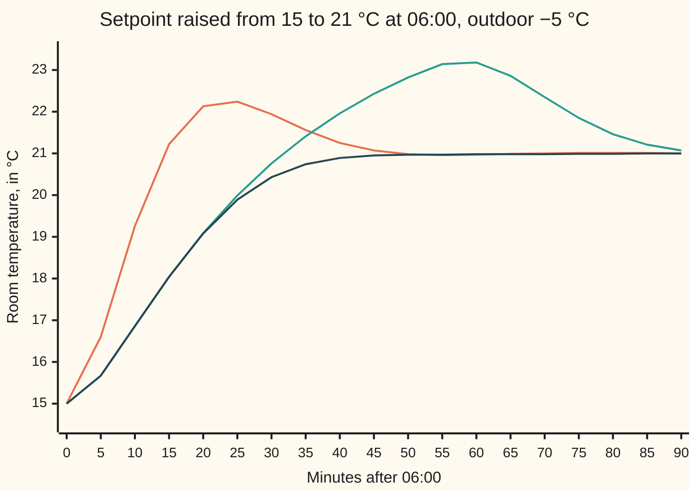
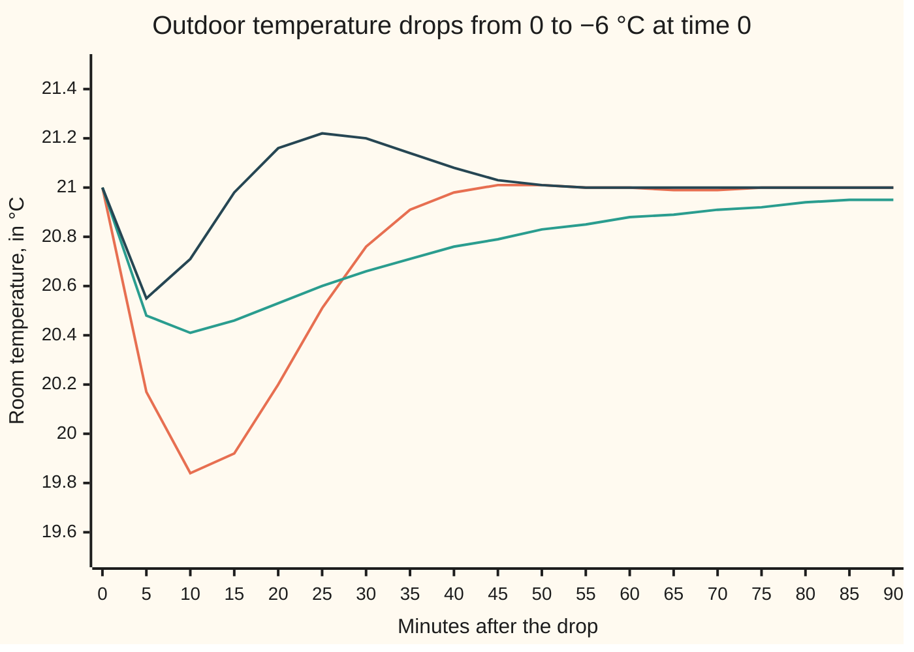
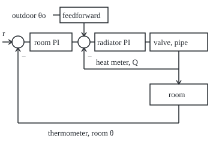

# PID in practice: saturation, noisy derivatives, nested loops and feedforward

[Syllabus](../../../SYLLABUS.md) → [Engineering mathematics](../README.md) → [Feedback Control](../README.md#s03) → PID in practice

---

## General Overview

A living room sits at 15 °C overnight. Outside it is −5 °C. At 06:00 the thermostat asks for 21 °C. One radiator heats the room through a slow pipe: open its valve and the heat arrives over about 4 minutes. Wide open, the radiator gives 6 kW. Holding 15 °C took 4 kW, a valve two-thirds open. Holding 21 °C will take 5.2 kW.

The thermostat runs a PI controller (proportional plus integral, from [PID control](07-pid-control-and-tuning.md)). At 06:00 it asks for a valve 1.4167 times wide open. The valve stops at wide open. So the room heats at full power, and the controller's running total of past error, its integral term, keeps growing as if its requests were being met. The total reaches 1.4406, a request for 1.4406 times wide open, by the time the room passes 21 °C at 31.778 min. The valve then stays pinned wide open until 52.475 min while that total drains. The room peaks at 23.21 °C and takes 85.2 minutes to settle within 0.2 °C. This is **integral windup**: the integral term winding up like a spring while the actuator (the part that acts, here the valve) is stuck at its limit.

Four repairs, each with a number. **Anti-windup** stops the integral growing while the valve is pinned: the same morning then peaks at 21.00 °C and settles in 36.6 minutes. **A filtered derivative** lets a derivative term act without the valve chattering on thermometer noise. **Cascade control** nests a fast loop on the radiator's heat output inside the slow room loop, to catch a cooling of the boiler's water. **Feedforward** acts on a cold front the moment an outdoor sensor sees it.

**A textbook PID becomes a working one when the integral stops when the actuator stops, the derivative is filtered before it reaches the valve, every fast disturbance gets its own inner loop, and every measured disturbance is acted on before the room feels it.**

**What kind of fact this is:** a method, four engineering repairs; the two facts that justify them, the integral-area identity and the derivative-noise formula, are theorems proved on this card in Why it works, and the room itself is a model.

### The picture: the 06:00 warm-up, three ways



Orange: the design on paper, a valve with no limit; it peaks at 22.26 °C after 23.3 min. Teal: the real valve, no anti-windup; the room passes 21 °C at 31.8 min and keeps climbing to 23.21 °C at 58.0 min. Dark blue: the real valve with clamping anti-windup; the valve leaves wide open at 16.3 min and arrives without overshoot. The teal and dark-blue lines share their first 16 minutes, because the valve is wide open in both.

---

## The formula

Reminder: a PI controller's output is a proportional part $K_p e$ plus an integral part $x_I$ that grows at rate $K_i e$, where $e$ is the error, setpoint minus measurement ([PID control](07-pid-control-and-tuning.md)). Time on this card is in minutes, the natural scale of a room.

This is a larger room than the one on [PID control](07-pid-control-and-tuning.md), and its pipe lags rather than delays. So here $\theta$ is the room temperature, not a delay, and $C$ is the room's heat capacity, not a controller. The room and its radiator, with $\theta$ the room temperature, $Q$ the radiator's heat output and $u$ the valve opening from 0 (shut) to 1 (wide open):

$$\tau_q \frac{dQ}{dt} = Q_{\max}\,u - Q, \qquad C\,\frac{d\theta}{dt} = Q - UA\,(\theta - \theta_o).$$

The controller as it must be built, with the valve limit written in:

$$v = K_p e + x_I, \qquad u = \min(\max(v, 0), 1), \qquad \frac{dx_I}{dt} = \begin{cases} 0 & \text{if } u \ne v \text{ and } e \text{ pushes } v \text{ further past the limit} \\ K_i\, e & \text{otherwise.} \end{cases}$$

**Read it aloud:** ask for $v$, get the nearest valve setting the hardware has, and stop adding to the integral whenever the request is already out of reach and the error would push it further out.

The fact that makes the clamp necessary, the **integral-area identity**: if the integral is never stopped and the loop settles, then

$$\int_0^\infty e\,dt = \frac{u_\infty - u_0}{K_i},$$

where $u_0$ and $u_\infty$ are the valve settings that hold the old and the new steady state. **Read it aloud:** the error's total area, in degree-minutes, is fixed in advance by how far the valve must move, whatever the valve does on the way.

The filtered derivative, as the controller computes it once every sample period $h$ on the measured temperature $y$:

$$D_k = a\,D_{k-1} - b\,(y_k - y_{k-1}), \qquad a = \frac{T_f}{T_f + h}, \quad b = \frac{K_d}{T_f + h}, \qquad \sigma_D = b\,\sigma\sqrt{\frac{2}{1 + a}}.$$

**Read it aloud:** the derivative term keeps a fraction $a$ of its last value and subtracts a scaled step in the measurement; sensor noise of size $\sigma$ makes the valve jitter by $\sigma_D$. With $T_f = 0$ it is the raw difference quotient: $a = 0$, $b = K_d/h$.

Feedforward, from a measured outdoor temperature: $u_{\text{ff}} = UA\,(r - \theta_o)/Q_{\max}$, the valve that would hold the setpoint $r$ at today's outdoor temperature, added to $v$.

| Symbol | Plain meaning | In our example | Push it up and the answer… |
| --- | --- | --- | --- |
| $\theta$, $\theta_o$, $y$ | room temperature; outdoor temperature; the thermometer's reading of θ, °C | 15 → 21 °C; −5 °C; θ plus noise | outdoor down: more heat needed, longer at the limit |
| $r$, $e$, $t$ | setpoint; error r − θ, °C; time, min | 21 °C; 6 °C at 06:00 | bigger step: longer pinned, more windup |
| $v$, $u$, $u_0$, $u_\infty$, $u_{\text{ff}}$ | valve asked for; valve reached; valve holding the old and the new steady state; feedforward valve | 1.4167; 1; 0.6667; 0.8667; UA(r − θ_o)/Q_max | v past 1: the integral is unchecked |
| $Q$, $Q_0$, $Q_{\max}$ | radiator heat output; its steady value before a change; its wide-open maximum, kW | 4 → 5.2 kW; 4 kW at 06:00, 4.2 kW at 21 °C with 0 °C outside; 6 kW | bigger radiator: less time pinned |
| $\tau_q$, $\tau_r$ | radiator-and-pipe lag; room time constant C/UA, min | 4 min; 30 min | slower pipe: bigger cold-front dip with feedforward |
| $C$, $UA$ | room heat capacity, kW·min/°C; heat-loss coefficient, kW/°C | 6; 0.2 | UA up: more heat needed to hold 21 °C |
| $K_p$, $K_i$ | proportional gain, per °C; integral gain, per °C per min | 0.125; 0.008333 | K_i up: smaller fixed area, faster windup |
| $x_I$ | integral term, in valve units | 0.6667, peaks at 1.4406 | above 1: a request no valve can meet |
| $K_d$, $T_f$ | derivative gain, valve per (°C/min); derivative filter time, min | 0.25; 0.2 | T_f up: less jitter, more lag |
| $h$, $\sigma$, $\sigma_D$ | sample period, min; sensor noise rms, °C; valve jitter rms | 0.1 min; 0.05 °C; 0.0456 | h down: raw jitter grows as 1/h |
| $D_k$ | the filtered derivative term at sample k, in valve units | jitters by σ_D | K_d up: larger |
| $a$, $b$ | filter memory; filter scale, valve per °C | 0.6667; 0.8333 | a toward 1: smoother, slower |
| $K_{\text{in}}$, $s$ | inner-loop gain, valve per kW; Laplace variable, 1/min | 8/6 per kW, so K_in Q_max = 8 | K_in up: faster inner loop |

### When it holds

- **One room temperature.** Air, walls and furniture share one θ. Real rooms stratify by a degree or two; the model's θ is the thermometer's.
- **Radiator output set by the valve alone.** Real output grows roughly as (water temperature − room temperature)^1.3, so it falls as the room warms. With 60 °C water, output at a 25 °C room is 0.7213 of output at 15 °C. The fixed 6 kW is a stand-in: the pinned-valve times shift with it; the identity and the need for a clamp do not.
- **A hard, linear valve.** Real valves have curved characteristics and a dead band, which add their own small windup.
- **White sensor noise.** Each reading's noise is independent of the last; correlated noise or 0.1 °C quantisation changes σ_D, not the shape of the argument.
- **A trustworthy feedforward model.** u_ff uses UA; if UA is 30% low, feedforward alone leaves the room at 19.2001 °C and only feedback brings it back.

---

## Why it works

### Step 0: an integrator remembers; a valve does not

The integral term is a memory of past error. In normal running, feedback checks it: too much integral means too much heat, the room overshoots, the error turns negative and drains the memory. When the valve is pinned, that check is cut. The room no longer answers the controller, the loop is open, and the memory grows with nothing pushing back. Two repairs on this card deal with that: anti-windup restores the check, and the derivative filter stops a signal reaching the valve that the valve cannot use. The other two, cascade and feedforward, act on disturbances before the room feels them.

### Step 1: the room while the valve is pinned, solved exactly

With $u = 1$ from 06:00 the two equations are linear with constant input. The radiator rises as Q = 6 − 2e^(−t/4) kW. Put that into the room equation and solve:

$$\theta(t) = 25.00 + 1.5385\,e^{-t/4} - 11.5385\,e^{-t/30} \ \ ^\circ\text{C}.$$

25 °C is where a wide-open radiator would leave the room at −5 °C outside: −5 + 6/0.2. The room crosses 21 °C at 31.778 min.

<details>
<summary>The algebra behind this, if you want it</summary>

The room equation is θ' = Q/C − (θ − θ_o)/τ_r with Q = Q_max − (Q_max − Q_0)e^(−t/τ_q). Try θ = θ_eq + B e^(−t/τ_q) + D e^(−t/τ_r) with θ_eq = θ_o + Q_max/UA. Matching the e^(−t/τ_q) terms gives B = (Q_max − Q_0)/C × τ_q τ_r/(τ_r − τ_q) = (2/6)(120/26) = 1.5385. The start θ(0) = 15 fixes D = 15 − 25 − 1.5385 = −11.5385. The error's running area is the integral of 21 − θ, which is (21 − 25)t − Bτ_q(1 − e^(−t/τ_q)) − Dτ_r(1 − e^(−t/τ_r)).

</details>

### Step 2: the integral-area identity

**Claim.** If $x_I$ is never stopped and the loop settles, the error's total area is $(u_\infty - u_0)/K_i$.

**Proof.** Integrate dx_I/dt = K_i e from 0 to a late time t_end: x_I(t_end) − x_I(0) = K_i × (area of e up to t_end). At the start the room is steady, e = 0, so the valve is all integral: x_I(0) = u_0. Once the room has settled, e = 0 again and x_I(t_end) = u_∞. Divide by K_i. ∎

For the 06:00 warm-up the area must be (0.8667 − 0.6667)/0.008333 = 24.000 °C·min. The identity does not mention the valve limit. So positive area built up while the valve is pinned must be paid back as negative area: the room above 21 °C.

By the time the pinned valve lets go (Step 3), 69.9 °C·min is banked, so 45.9 °C·min must be repaid above 21 °C. The overshoot is not bad tuning. It is forced. A valve with no limit runs at 1.4167, reaches 21 °C sooner and banks less; its area is also exactly 24.000.

### Step 3: when the wound-up valve lets go

The valve leaves wide open when the request falls back to 1: K_p e + x_I = 1, with both pieces given by Step 1's exact solution and x_I = 0.6667 + K_i × (running area). A bisection (halving a bracket until it is tight) finds 52.475 min. At the crossing of 21 °C, 31.778 min, the integral term stood at 1.4406. From then on the error is negative, but it drains the integral at only K_i per degree per minute, and the radiator stays at 6 kW until 52.475 min. The room peaks at 23.21 °C at 58.0 min.

### Step 4: clamping, and what it costs

Clamping, the rule in the formula, freezes $x_I$ while the valve is pinned and the error is still positive. Now the request is 0.125 e + 0.6667, which falls back to 1 when the room reaches 21 − (1 − 0.6667)/0.125 = 18.333 °C. Step 1's solution reaches 18.333 °C at 16.341 min. From then on the loop is closed and linear, and the room creeps to 21 °C without overshoot: within 0.2 °C after 36.6 min.

The identity no longer binds, because the frozen minutes were never added to the integral: the error's total area is 97.967 °C·min, not 24. The price is the slow last approach (20.89 °C at 40 min, still short), since the integral starts climbing from 0.6667 only at 16.3 min. A common alternative, **back-calculation**, bleeds the integral toward the value that would make v equal the valve limit, at a rate set by a tracking time; it trades the creep against a little overshoot.

### Step 5: the derivative, and why it must be filtered

A derivative term K_d × (rate of change) anticipates: a room warming fast is about to overshoot. It acts on the measurement, not the error, so a setpoint jump does not kick the valve. And it is filtered, because differencing amplifies noise.

**Claim.** On white noise of size σ, the filter in the formula gives a valve jitter σ_D = b σ √(2/(1 + a)).

**Proof, in outline.** One noisy reading passes through the filter as b, then b(a − 1), then b(a − 1)a, shrinking by a each step. Independent readings add in squares, and the squares sum to 2b^2/(1 + a).

<details>
<summary>Detailed proof</summary>

Write the filter as D_k = a D_(k−1) + b(n_k − n_(k−1)) on noise readings n_k with mean 0, size σ, independent of each other; flipping the sign of b does not change a variance. Its response to a single unit reading at step 0 is g_0 = b. At step 1 the unit leaves the difference, so g_1 = ab − b = b(a − 1); after that g_k = a g_(k−1) = a^(k−1) b(a − 1). The output is a sum of independent readings times these weights, so its variance is σ^2 times the sum of the squared weights: b^2 [1 + (1 − a)^2 (1 + a^2 + a^4 + …)] = b^2 [1 + (1 − a)^2/(1 − a^2)] = b^2 [1 + (1 − a)/(1 + a)] = 2b^2/(1 + a). For 0 ≤ a < 1 the geometric sum converges. With a = 0 this is 2(K_d/h)^2: the raw derivative's jitter grows as 1/h. As h shrinks with T_f fixed, a → 1 and b → K_d/T_f, so σ_D tends to K_d σ/T_f: bounded. A second road is Parseval's theorem: the same variance is σ^2/π times the integral, over frequencies ω from 0 to π radians per sample, of b^2 (2 − 2cos ω)/(1 − 2a cos ω + a^2), the filter's squared gain; the code does that integral by Simpson's rule.

</details>

With K_d = 0.25 valve per (°C/min) (a derivative time of 2 min), σ = 0.05 °C and a reading every 0.1 min (6 s), the raw derivative jitters the valve by 0.1768 of its full travel, all the time. A filter with T_f = 0.2 min (a tenth of the derivative time) gives a = 0.6667, b = 0.8333 and a jitter of 0.0456. Sample ten times faster, every 0.6 s, and the raw jitter becomes 1.7678: the valve would be slammed end to end. The filtered one moves only to 0.0602. A common rule samples 10 to 20 times per closed-loop rise time; 6 s is already well inside it, so faster sampling buys only noise. What the derivative buys is margin ([Nyquist and margins](06-nyquist-criterion-and-stability-margins.md)): with the valve unlimited, PI has 50.50° of phase margin at 0.1231 rad/min, and K_d = 0.25 lifts it to 62.20°. The filter's cost is a 0.2 min lag inside a 4 min pipe lag: the margin becomes 62.30°, almost unchanged.

### Step 6: feedforward, and why it cannot be perfect

At 21 °C with 0 °C outside, a cold front drops the outdoor temperature to −6 °C in one step. Feedback alone waits for the room to cool, then reacts: the room bottoms at 19.8248 °C at 11.21 min. An outdoor sensor sees the drop at once. Feedforward sets the valve to u_ff = 0.2 × (21 − (−6))/6 at that instant, the valve that will hold 21 °C in the new weather.

It still cannot hold the room flat. The cold acts on the room directly, through its walls; the extra heat arrives through the 4 min pipe. With feedforward alone the room's error is the difference of those two paths, and solving the two lags gives:

$$\theta(t) - 21 = \Delta\theta_o\,\frac{\tau_q}{\tau_r - \tau_q}\left(e^{-t/\tau_r} - e^{-t/\tau_q}\right),$$

with Δθ_o = −6 °C. It is lowest at t = ln(τ_r/τ_q) τ_r τ_q/(τ_r − τ_q) = 9.300 min, at −0.5868 °C, and then recovers. Feedback and feedforward together bottom at 20.5515 °C. Feedback, having seen the dip, then over-corrects a little, to 21.22 °C at 25 min.



Orange: feedback only. Teal: feedforward only, recovering with the room's own 30 min time constant. Dark blue: both, with the shallowest dip.

### Step 7: cascade, a fast loop inside the slow one

The boiler's water cools when another zone opens, and at the same valve the radiator now gives 1.2 kW less. A single room loop learns this only when the room cools, minutes later: the radiator sinks to 3.4357 kW and the room bottoms at 19.9348 °C at 15.43 min.

A cascade adds a heat meter on the radiator pipe (flow rate times the drop in water temperature) and a second PI controller. The room controller no longer moves the valve; it asks for a heat output in kW. The inner controller moves the valve to deliver that heat. Its integral time equals the pipe lag, 4 min, which cancels the pipe's pole, so the inner loop behaves like a single lag of τ_q/(K_in Q_max) = 0.50 min.

With the room loop held still, the inner loop's answer to the 1.2 kW loss is

$$Q(t) - Q_0 = -\frac{1.2}{7}\left(e^{-t/4} - e^{-8t/4}\right) \text{ kW},$$

because the inner loop's sensitivity (its leftover share of a disturbance, from [Sensitivity functions](02-sensitivity-and-the-gang-of-four.md)) is τ_q s/(τ_q s + 8), and the loss enters through the pipe's 1/(τ_q s + 1). The dip is deepest at (4 ln 8)/7 = 1.188 min, at −0.1114 kW, and is gone within a few minutes. The room hardly notices: it bottoms at 20.9547 °C. The cascade works because the inner loop is much faster than the outer one, here 0.50 min against the room's 30 min; with the two similar in speed the loops fight.

### The picture: the finished controller, schematic

<p align="center"></p>

Schematic, not to scale. The outer loop closes through the thermometer, the inner one through the heat meter. Feedforward adds the outdoor sensor's heat request at the inner summing point. Clamps sit inside both PI blocks; a derivative, when used, sits in the room PI and reads the thermometer.

**Another route.** Anti-windup, filtering and feedforward can all be read in the frequency domain, as changes to the loop gain and to what the disturbance sees; [Loop shaping](09-lead-lag-compensation-and-loop-shaping.md) designs a controller that way. When the slow part of a loop is a pure delay rather than a lag, [Time delays](10-smith-predictor-and-time-delays.md) adds a model of the delay inside the controller.

---

## Worked numbers, by hand

The 06:00 warm-up: −5 °C outside, 15 → 21 °C, K_p = 0.125 per °C, K_i = 0.125/15 per °C per min. These gains are chosen for a calm loop: with the valve unlimited they give 50.50° of phase margin (Step 5).

| Step | Arithmetic | Value |
| --- | --- | --- |
| Heat and valve before | 0.2 × (15 − (−5)); 4/6 | 4.00 kW; 0.6667 |
| Heat and valve after | 0.2 × (21 − (−5)); 5.2/6 | 5.20 kW; 0.8667 |
| First request | 0.125 × 6 + 0.6667 | 1.4167: pinned at 1 |
| Where wide open leads | −5 + 6/0.2 | 25.00 °C |
| Fixed error area | (0.8667 − 0.6667)/0.008333 | 24.000 °C·min |
| Area banked while pinned | Step 1's running area at 52.475 min | 69.9 °C·min |
| To repay above 21 °C | 69.9 − 24.000 | 45.9 °C·min |
| Clamped: valve frees at | 21 − (1 − 0.6667)/0.125 | 18.333 °C, at 16.341 min |
| Wound up: valve frees at | 0.125 e + x_I = 1 on Step 1's solution | **52.475 min, peak 23.21 °C** |

Without anti-windup the room overshoots to 23.21 °C and is not within 0.2 °C until 85.2 min after 06:00; with clamping it never overshoots and is within 0.2 °C after 36.6 min.

### What breaks if you drop a piece

| Mistake | Comes out at | What went wrong |
| --- | --- | --- |
| No anti-windup | peak 23.21 °C at 58.0 min; integral 1.4406; settled at 85.2 min | the integral kept counting while the valve could not respond, and the identity forced it to be repaid |
| Raw derivative, sampled every 0.6 s | valve jitter 1.7678 of full travel | differencing noise grows as 1/h; the filter caps it at 0.0602 |
| Feedforward 30% low, no feedback | room settles at 19.2001 °C | feedforward is only as good as its model; with feedback the room returns to 21.0000 °C |
| One loop against a supply drop | room bottoms at 19.9348 °C | the disturbance had to cross the pipe and the room before anything reacted; the cascade holds 20.9547 °C |

---

## Code, from first principles, and it actually runs

Both programs simulate the room, the radiator and the controller with a fourth-order Runge-Kutta step of 0.01 min, with saturation and clamping written in; they call the room temperature T and UA is G. Against those simulations they take independent roads: the pinned-valve phase solved exactly, with bisection for the moment the valve lets go; the integral-area identity; the two-lag formula for feedforward; and the inner loop's closed-form dip. The derivative jitter is reached three ways: the variance formula, Parseval's frequency integral by Simpson's rule, and a Monte Carlo run of 100,000 readings from a SplitMix64 generator with seed 2026 and a Box-Muller step, so both languages draw the same noise. The Monte Carlo check allows 3%, a few standard errors for correlated samples. Last, the frequency response gives the phase margins of PI, raw-derivative PID and filtered PID.

### Python

```python
# PID in practice: a room, a slow radiator pipe, and a valve that stops at fully open. Standard library only.
# Units: minutes, °C, kW; valve opening 0 (shut) to 1 (wide open). Simulations: RK4, 0.01 min step.
# Road 1: closed forms (pinned valve solved exactly, integral-area identity, lag formulas). Road 2: simulation
# of the same room, no formula inside it. Derivative noise: variance formula, Parseval, Monte Carlo.
import math

G, C, QM, TQ = 0.2, 6.0, 6.0, 4.0     # loss kW/°C, heat capacity kW·min/°C, radiator max kW, radiator lag min
TR, DT = C / G, 0.01                   # room time constant: 30 min; simulation step, min
KP, KI = 0.125, 0.125 / 15.0           # valve per °C; valve per °C per min (integral time 15 min)
KPO, KIO, KIN = KP * QM, KI * QM, 8.0 / QM   # cascade: outer asks for kW; inner valve per kW, integral time TQ

def sim(r, T0, tout0, tout, d, tend, limit=True, aw=False, ff=0.0, cascade=False, fb=True):
    """Steady at room T0, outdoor tout0; at t = 0 outdoor becomes tout and the radiator loses d kW."""
    Q0 = G * (T0 - tout0)
    x = [T0, Q0, Q0 - ff * Q0 if cascade else (Q0 - ff * Q0) / QM, Q0 / QM]
    sat = lambda v, hi: min(max(v, 0.0), hi) if limit else v
    def f(x):
        T, Q, xo, xi = x
        e = r - T if fb else 0.0
        if cascade:                                    # outer PI asks for heat; inner PI moves the valve
            qv = ff * G * (r - tout) + KPO * e + xo; qr = sat(qv, QM); eq = qr - Q
            v = KIN * eq + xi; u = sat(v, 1.0)
            dxo = 0.0 if aw and qv != qr and e * (qv - qr) > 0 else KIO * e
            dxi = 0.0 if aw and v != u and eq * (v - u) > 0 else KIN / TQ * eq
        else:
            v = ff * G * (r - tout) / QM + KP * e + xo; u = sat(v, 1.0)
            dxo, dxi = (0.0 if aw and v != u and e * (v - u) > 0 else KI * e), 0.0
        return [(Q - G * (T - tout)) / C, (QM * u - d - Q) / TQ, dxo, dxi], v
    out = [[T0], [Q0], [x[2]], []]                     # room, radiator, outer integral, valve demand
    for _ in range(int(round(tend / DT))):
        k1, v = f(x)
        k2 = f([a + DT / 2 * b for a, b in zip(x, k1)])[0]
        k3 = f([a + DT / 2 * b for a, b in zip(x, k2)])[0]
        k4 = f([a + DT * b for a, b in zip(x, k3)])[0]
        x = [a + DT / 6 * (p + 2 * q + 2 * w + z) for a, p, q, w, z in zip(x, k1, k2, k3, k4)]
        out[0].append(x[0]); out[1].append(x[1]); out[2].append(x[2]); out[3].append(v)
    return out
def bisect(fn, lo, hi):
    for _ in range(100):
        mid = (lo + hi) / 2
        lo, hi = (mid, hi) if (fn(lo) > 0) == (fn(mid) > 0) else (lo, mid)
    return (lo + hi) / 2
def cross(ys, level):                     # first time ys falls through level, interpolated
    i = next(i for i in range(1, len(ys)) if ys[i] <= level)
    return (i - 1 + (ys[i - 1] - level) / (ys[i - 1] - ys[i])) * DT
def peak(ys, sign=1):
    i = max(range(len(ys)), key=lambda i: sign * ys[i])
    return ys[i], i * DT
row = lambda lab, ys: print(f"{lab:<24}" + " ".join(f"{ys[i]:.2f}" for i in range(0, 9001, 500)))
trap = lambda ys, n: sum((2 * r - ys[i] - ys[i + 1]) * DT / 2 for i in range(n))   # area of the error
# ---- 1. cold morning: outdoor -5 °C, setpoint raised from 15 to 21 °C ----
r, T0, to = 21.0, 15.0, -5.0
Q0, Teq, x0, x1 = G * (T0 - to), to + QM / G, G * (T0 - to) / QM, G * (r - to) / QM
B = (QM - Q0) / C * TQ * TR / (TR - TQ); D = T0 - Teq - B   # open-valve room: Teq + B e^(-t/TQ) + D e^(-t/TR)
T_open = lambda t: Teq + B * math.exp(-t / TQ) + D * math.exp(-t / TR)
area_open = lambda t: (r - Teq) * t - B * TQ * (1 - math.exp(-t / TQ)) - D * TR * (1 - math.exp(-t / TR))
xo_open = lambda t: x0 + KI * area_open(t)
t_wind = bisect(lambda t: KP * (r - T_open(t)) + xo_open(t) - 1.0, 0.0, 200.0)
t_clamp = bisect(lambda t: KP * (r - T_open(t)) + x0 - 1.0, 0.0, 200.0)
t_c = bisect(lambda t: T_open(t) - r, 0.0, 200.0)
lin, wnd, clp = (sim(r, T0, to, to, 0.0, 300, limit=lim, aw=aw) for lim, aw in ((False, False), (True, False), (True, True)))
print(f"before: radiator {Q0:.2f} kW, valve {x0:.4f}; after: needs {G * (r - to):.2f} kW, valve {x1:.4f}")
print(f"first valve demand {KP * (r - T0) + x0:.4f}; wide open the room heads for {Teq:.2f} °C")
print(f"open-valve room: T = {Teq:.2f} + {B:.4f} e^(-t/{TQ:.0f}) {D:+.4f} e^(-t/{TR:.0f})")
ar = [trap(run[0], len(run[0]) - 1) for run in (lin, wnd, clp)]; sw = cross(wnd[3], 1.0)
print(f"windup: valve pinned until {t_wind:.3f} min (formula), {sw:.3f} min (sim)")
print(f"windup: room crosses 21 at {t_c:.3f} min; integral peaks at {xo_open(t_c):.4f} (formula), {max(wnd[2]):.4f} (sim)")
print(f"windup: area banked while pinned {area_open(t_wind):.1f} °C·min (formula), {trap(wnd[0], round(t_wind / DT)):.1f} (sim)")
print(f"clamped: valve pinned until {t_clamp:.3f} min (formula), {cross(clp[3], 1.0):.3f} min (sim), room {r - (1 - x0) / KP:.3f} °C")
print(f"area identity: change in valve / KI = ({x1:.4f} - {x0:.4f}) / {KI:.6f} = {(x1 - x0) / KI:.3f} °C·min; "
      f"left to repay after the valve frees {area_open(t_wind) - (x1 - x0) / KI:.1f} °C·min")
for lab, run, a in (("no valve limit", lin, ar[0]), ("limit, no anti-windup", wnd, ar[1]), ("limit, clamping", clp, ar[2])):
    pk, tp = peak(run[0])
    st = max(i for i in range(len(run[0])) if abs(run[0][i] - r) > 0.2) * DT
    print(f"{lab:<22} peak {pk:.2f} °C at {tp:5.1f} min, within 0.2 °C after {st:5.1f} min, area {a:6.3f}")
row("chart, no valve limit", lin[0]); row("chart, no anti-windup", wnd[0]); row("chart, clamping", clp[0])
# ---- 2. cold front: outdoor 0 -> -6 °C with the room at 21 °C; feedforward from an outdoor sensor ----
dto, tstar = -6.0, math.log(TR / TQ) * TR * TQ / (TR - TQ)
ffpk = dto * TQ / (TR - TQ) * (math.exp(-tstar / TR) - math.exp(-tstar / TQ))
runs = {k: sim(r, r, 0.0, dto, 0.0, 300, ff=g, fb=fb) for k, g, fb in
        (("feedback only", 0.0, True), ("feedforward only", 1.0, False), ("both", 1.0, True),
         ("ff 30% low, alone", 0.7, False), ("ff 30% low, with fb", 0.7, True))}
print(f"feedforward only, formula: dip {ffpk:.4f} °C at {tstar:.3f} min; steady error if 30% low {0.3 * dto:.2f} °C")
for k, run in runs.items():
    pk, tp = peak(run[0], -1)
    print(f"cold front, {k:<20} lowest {pk:.4f} °C at {tp:6.2f} min, at 300 min {run[0][-1]:.4f} °C")
for k in ("feedback only", "feedforward only", "both"): row("chart, " + k, runs[k][0])
# ---- 3. supply water cools: the radiator loses 1.2 kW at the same valve; one loop against a cascade ----
dq, ts = 1.2, TQ * math.log(8.0) / 7.0
qpk = -dq / 7.0 * (math.exp(-ts / TQ) - math.exp(-8.0 * ts / TQ))
qmin, tq_ = peak(sim(r, r, 0.0, 0.0, dq, 30, cascade=True, fb=False)[1], -1)
print(f"inner loop time {TQ / (KIN * QM):.2f} min; inner loop alone: radiator dips {qpk:.4f} kW at {ts:.3f} min (formula), {qmin - G * r:.4f} kW at {tq_:.3f} (sim)")
for lab, cas in (("single loop", False), ("cascade", True)):
    run = sim(r, r, 0.0, 0.0, dq, 300, cascade=cas, aw=True)
    pk, tp = peak(run[0], -1)
    print(f"supply drop, {lab:<12} room lowest {pk:.4f} °C at {tp:6.2f} min, radiator lowest {min(run[1]):.4f} kW")
# ---- 4. derivative on a noisy thermometer: KD = KP x 2 min, sensor noise 0.05 °C rms, seed 2026 ----
KD, SIG, M64, state = KP * 2.0, 0.05, (1 << 64) - 1, 2026
def unif():                                        # SplitMix64, mapped to (0, 1)
    global state
    state = z = (state + 0x9E3779B97F4A7C15) & M64
    z = ((z ^ (z >> 30)) * 0xBF58476D1CE4E5B9) & M64
    z = ((z ^ (z >> 27)) * 0x94D049BB133111EB) & M64
    return ((z ^ (z >> 31)) >> 11) * 2.0 ** -53 + 2.0 ** -54
gauss = lambda: math.sqrt(-2.0 * math.log(unif())) * math.cos(2.0 * math.pi * unif())   # Box-Muller
noise, pms = [], []
for h in (0.1, 0.01):
    for tf in (0.0, 0.2):
        a, b, n = tf / (tf + h), KD / (tf + h), 2000
        formula = b * SIG * math.sqrt(2.0 / (1.0 + a))
        hp = lambda th: b * b * (2 - 2 * math.cos(th)) / (1 - 2 * a * math.cos(th) + a * a)
        par = SIG * math.sqrt(sum((1 if j in (0, n) else 4 if j % 2 else 2) * hp(j * math.pi / n)
                                  for j in range(n + 1)) * (math.pi / n) / 3 / math.pi)
        prev, dv, acc = gauss() * SIG, 0.0, 0.0
        for k in range(100100):
            y = gauss() * SIG
            dv, prev = a * dv + b * (y - prev), y
            acc += dv * dv if k >= 100 else 0.0
        noise.append((formula, par, math.sqrt(acc / 100000)))
        print(f"derivative, h {h:.2f} min, filter {tf:.1f} min, a {a:.4f}, b {b:.4f}: jitter {formula:.4f} formula, "
              f"{par:.4f} Parseval, {noise[-1][2]:.4f} Monte Carlo")
print(f"radiator law (Tw - T)^1.3, water 60 °C: output at 25 °C room / at 15 °C room = {(35 / 45) ** 1.3:.4f}")
def lm(w, kd, tf):                                 # |L| and arg L of the loop with no valve limit, C(jw) G(jw)
    cr, ci = KP + kd * tf * w * w / (1 + tf * tf * w * w), kd * w / (1 + tf * tf * w * w) - KI / w
    return math.sqrt(cr * cr + ci * ci) * QM / G / math.sqrt((1 + TQ * TQ * w * w) * (1 + TR * TR * w * w)), math.atan2(ci, cr) - math.atan(TQ * w) - math.atan(TR * w)
for lab, kd, tf in (("PI", 0.0, 0.0), ("PID, raw derivative", KD, 0.0), ("PID, D filtered 0.2 min", KD, 0.2)):
    wc = bisect(lambda w: lm(w, kd, tf)[0] - 1.0, 0.01, 1.0); pms.append(180.0 + math.degrees(lm(wc, kd, tf)[1]))
    print(f"margins, {lab:<23} crossover {wc:.4f} rad/min, phase margin {pms[-1]:.2f} deg")

assert abs(t_wind - sw) < 0.01, "pinned-valve time: exact solution against simulation"
assert abs(ar[1] - (x1 - x0) / KI) < 0.01, "windup run must pay back exactly the identity's area"
assert abs(xo_open(t_c) - max(wnd[2])) < 1e-4, "integral peak: exact solution against simulation"
assert abs(t_clamp - cross(clp[3], 1.0)) < 0.01, "clamped release time: exact solution against simulation"
assert abs(ffpk - peak(runs["feedforward only"][0], -1)[0] + r) < 1e-4, "feedforward dip: formula against sim"
assert abs(runs["ff 30% low, alone"][0][-1] - r - 0.3 * dto) < 1e-3, "30% low feedforward: steady error against sim"
assert abs(qpk - (qmin - G * r)) < 1e-4, "inner-loop dip: formula against sim"
assert all(abs(p - f) < 1e-6 for f, p, m in noise), "Parseval integral against the variance formula"
assert all(abs(m - f) < 0.03 * f for f, p, m in noise), "Monte Carlo within 3% (a few standard errors)"
assert abs(pms[2] - pms[1]) < 1.0, "a 0.2 min derivative filter moves the phase margin by under 1 deg"
print("ALL CHECKS PASS")
```

**Ran 2026-10-06 on macOS, Python 3.14.6, standard library only. All checks passed. Output, pasted from the run:**

```
before: radiator 4.00 kW, valve 0.6667; after: needs 5.20 kW, valve 0.8667
first valve demand 1.4167; wide open the room heads for 25.00 °C
open-valve room: T = 25.00 + 1.5385 e^(-t/4) -11.5385 e^(-t/30)
windup: valve pinned until 52.475 min (formula), 52.475 min (sim)
windup: room crosses 21 at 31.778 min; integral peaks at 1.4406 (formula), 1.4406 (sim)
windup: area banked while pinned 69.9 °C·min (formula), 69.9 (sim)
clamped: valve pinned until 16.341 min (formula), 16.342 min (sim), room 18.333 °C
area identity: change in valve / KI = (0.8667 - 0.6667) / 0.008333 = 24.000 °C·min; left to repay after the valve frees 45.9 °C·min
no valve limit         peak 22.26 °C at  23.3 min, within 0.2 °C after  41.1 min, area 24.000
limit, no anti-windup  peak 23.21 °C at  58.0 min, within 0.2 °C after  85.2 min, area 24.000
limit, clamping        peak 21.00 °C at 213.5 min, within 0.2 °C after  36.6 min, area 97.967
chart, no valve limit   15.00 16.60 19.26 21.22 22.13 22.24 21.94 21.56 21.25 21.07 20.98 20.96 20.97 20.99 21.00 21.01 21.01 21.01 21.00
chart, no anti-windup   15.00 15.67 16.86 18.04 19.09 19.99 20.76 21.41 21.96 22.43 22.82 23.14 23.18 22.86 22.35 21.85 21.46 21.21 21.07
chart, clamping         15.00 15.67 16.86 18.04 19.08 19.89 20.43 20.74 20.89 20.95 20.97 20.97 20.98 20.98 20.98 20.99 20.99 21.00 21.00
feedforward only, formula: dip -0.5868 °C at 9.300 min; steady error if 30% low -1.80 °C
cold front, feedback only        lowest 19.8248 °C at  11.21 min, at 300 min 21.0000 °C
cold front, feedforward only     lowest 20.4132 °C at   9.30 min, at 300 min 21.0000 °C
cold front, both                 lowest 20.5515 °C at   5.32 min, at 300 min 21.0000 °C
cold front, ff 30% low, alone    lowest 19.2001 °C at 300.00 min, at 300 min 19.2001 °C
cold front, ff 30% low, with fb  lowest 20.3973 °C at   7.18 min, at 300 min 21.0000 °C
chart, feedback only    21.00 20.17 19.84 19.92 20.20 20.51 20.76 20.91 20.98 21.01 21.01 21.00 21.00 20.99 20.99 21.00 21.00 21.00 21.00
chart, feedforward only 21.00 20.48 20.41 20.46 20.53 20.60 20.66 20.71 20.76 20.79 20.83 20.85 20.88 20.89 20.91 20.92 20.94 20.95 20.95
chart, both             21.00 20.55 20.71 20.98 21.16 21.22 21.20 21.14 21.08 21.03 21.01 21.00 21.00 21.00 21.00 21.00 21.00 21.00 21.00
inner loop time 0.50 min; inner loop alone: radiator dips -0.1114 kW at 1.188 min (formula), -0.1114 kW at 1.190 (sim)
supply drop, single loop  room lowest 19.9348 °C at  15.43 min, radiator lowest 3.4357 kW
supply drop, cascade      room lowest 20.9547 °C at   5.03 min, radiator lowest 4.0943 kW
derivative, h 0.10 min, filter 0.0 min, a 0.0000, b 2.5000: jitter 0.1768 formula, 0.1768 Parseval, 0.1765 Monte Carlo
derivative, h 0.10 min, filter 0.2 min, a 0.6667, b 0.8333: jitter 0.0456 formula, 0.0456 Parseval, 0.0454 Monte Carlo
derivative, h 0.01 min, filter 0.0 min, a 0.0000, b 25.0000: jitter 1.7678 formula, 1.7678 Parseval, 1.7657 Monte Carlo
derivative, h 0.01 min, filter 0.2 min, a 0.9524, b 1.1905: jitter 0.0602 formula, 0.0602 Parseval, 0.0604 Monte Carlo
radiator law (Tw - T)^1.3, water 60 °C: output at 25 °C room / at 15 °C room = 0.7213
margins, PI                      crossover 0.1231 rad/min, phase margin 50.50 deg
margins, PID, raw derivative     crossover 0.1154 rad/min, phase margin 62.20 deg
margins, PID, D filtered 0.2 min crossover 0.1158 rad/min, phase margin 62.30 deg
ALL CHECKS PASS
```

### Rust

```rust
// PID in practice: a room, a slow radiator pipe, and a valve that stops at fully open. Rust std only.
// Units: minutes, °C, kW; valve opening 0 (shut) to 1 (wide open). Simulations: RK4, 0.01 min step.
// Road 1: closed forms (pinned valve solved exactly, integral-area identity, lag formulas). Road 2: simulation
// of the same room, no formula inside it. Derivative noise: variance formula, Parseval, Monte Carlo.
const G: f64 = 0.2; const C: f64 = 6.0; const QM: f64 = 6.0; const TQ: f64 = 4.0; const TR: f64 = C / G;
const KP: f64 = 0.125; const KI: f64 = 0.125 / 15.0; const DT: f64 = 0.01;
const KPO: f64 = KP * QM; const KIO: f64 = KI * QM; const KIN: f64 = 8.0 / QM;
#[derive(Clone, Copy)] struct Opt { limit: bool, aw: bool, ff: f64, cascade: bool, fb: bool }
const BASE: Opt = Opt { limit: true, aw: false, ff: 0.0, cascade: false, fb: true };

/// Steady at room t0, outdoor tout0; at t = 0 outdoor becomes tout and the radiator loses d kW.
/// Returns room, radiator, outer integral, valve demand, one entry per step.
fn sim(r: f64, t0: f64, tout0: f64, tout: f64, d: f64, tend: f64, o: Opt) -> [Vec<f64>; 4] {
    let q0 = G * (t0 - tout0);
    let mut x = [t0, q0, if o.cascade { q0 - o.ff * q0 } else { (q0 - o.ff * q0) / QM }, q0 / QM];
    let sat = |v: f64, hi: f64| if o.limit { v.max(0.0).min(hi) } else { v };
    let f = |x: &[f64; 4]| -> ([f64; 4], f64) {
        let (t, q, xo, xi) = (x[0], x[1], x[2], x[3]);
        let e = if o.fb { r - t } else { 0.0 };
        let (u, v, dxo, dxi);
        if o.cascade {                                   // outer PI asks for heat; inner PI moves the valve
            let qv = o.ff * G * (r - tout) + KPO * e + xo; let qr = sat(qv, QM); let eq = qr - q;
            v = KIN * eq + xi; u = sat(v, 1.0);
            dxo = if o.aw && qv != qr && e * (qv - qr) > 0.0 { 0.0 } else { KIO * e };
            dxi = if o.aw && v != u && eq * (v - u) > 0.0 { 0.0 } else { KIN / TQ * eq };
        } else {
            v = o.ff * G * (r - tout) / QM + KP * e + xo; u = sat(v, 1.0);
            dxo = if o.aw && v != u && e * (v - u) > 0.0 { 0.0 } else { KI * e }; dxi = 0.0;
        }
        ([(q - G * (t - tout)) / C, (QM * u - d - q) / TQ, dxo, dxi], v)
    };
    let mut out = [vec![t0], vec![q0], vec![x[2]], vec![]];
    let add = |x: &[f64; 4], k: &[f64; 4], h: f64| [x[0] + h * k[0], x[1] + h * k[1], x[2] + h * k[2], x[3] + h * k[3]];
    for _ in 0..(tend / DT).round() as usize {
        let (k1, v) = f(&x);
        let k2 = f(&add(&x, &k1, DT / 2.0)).0;
        let k3 = f(&add(&x, &k2, DT / 2.0)).0;
        let k4 = f(&add(&x, &k3, DT)).0;
        for i in 0..4 { x[i] += DT / 6.0 * (k1[i] + 2.0 * k2[i] + 2.0 * k3[i] + k4[i]); }
        out[0].push(x[0]); out[1].push(x[1]); out[2].push(x[2]); out[3].push(v);
    }
    out
}
fn bisect(f: impl Fn(f64) -> f64, mut lo: f64, mut hi: f64) -> f64 {
    for _ in 0..100 { let mid = (lo + hi) / 2.0; if (f(lo) > 0.0) == (f(mid) > 0.0) { lo = mid } else { hi = mid } }
    (lo + hi) / 2.0
}
fn cross(ys: &[f64], level: f64) -> f64 {              // first time ys falls through level, interpolated
    let i = (1..ys.len()).find(|&i| ys[i] <= level).unwrap();
    (i as f64 - 1.0 + (ys[i - 1] - level) / (ys[i - 1] - ys[i])) * DT
}
fn peak(ys: &[f64], sign: f64) -> (f64, f64) {
    let mut b = 0;
    for i in 1..ys.len() { if sign * ys[i] > sign * ys[b] { b = i } }
    (ys[b], b as f64 * DT)
}
fn row(lab: &str, ys: &[f64]) {
    let v: Vec<String> = (0..=9000).step_by(500).map(|i| format!("{:.2}", ys[i])).collect();
    println!("{:<24}{}", lab, v.join(" "));
}
fn trap(ys: &[f64], n: usize, r: f64) -> f64 { (0..n).fold(0.0, |s, i| s + (2.0 * r - ys[i] - ys[i + 1]) * DT / 2.0) } // area of the error
struct Mix(u64);
impl Mix {                                             // SplitMix64, mapped to (0, 1)
    fn unif(&mut self) -> f64 {
        self.0 = self.0.wrapping_add(0x9E3779B97F4A7C15);
        let mut z = (self.0 ^ (self.0 >> 30)).wrapping_mul(0xBF58476D1CE4E5B9);
        z = (z ^ (z >> 27)).wrapping_mul(0x94D049BB133111EB);
        ((z ^ (z >> 31)) >> 11) as f64 * 2f64.powi(-53) + 2f64.powi(-54)
    }
    fn gauss(&mut self) -> f64 {                       // Box-Muller
        let u1 = self.unif();
        (-2.0 * u1.ln()).sqrt() * (2.0 * std::f64::consts::PI * self.unif()).cos()
    }
}
fn main() {
    // ---- 1. cold morning: outdoor -5 °C, setpoint raised from 15 to 21 °C ----
    let (r, t0, to) = (21.0, 15.0, -5.0);
    let (q0, teq, x0, x1) = (G * (t0 - to), to + QM / G, G * (t0 - to) / QM, G * (r - to) / QM);
    let b = (QM - q0) / C * TQ * TR / (TR - TQ); let d = t0 - teq - b;   // open valve: teq + b e^(-t/TQ) + d e^(-t/TR)
    let t_open = |t: f64| teq + b * (-t / TQ).exp() + d * (-t / TR).exp();
    let area_open = |t: f64| (r - teq) * t - b * TQ * (1.0 - (-t / TQ).exp()) - d * TR * (1.0 - (-t / TR).exp());
    let xo_open = |t: f64| x0 + KI * area_open(t);
    let t_wind = bisect(|t| KP * (r - t_open(t)) + xo_open(t) - 1.0, 0.0, 200.0);
    let t_clamp = bisect(|t| KP * (r - t_open(t)) + x0 - 1.0, 0.0, 200.0);
    let t_c = bisect(|t| t_open(t) - r, 0.0, 200.0);
    let (lin, wnd, clp) = (sim(r, t0, to, to, 0.0, 300.0, Opt { limit: false, ..BASE }),
        sim(r, t0, to, to, 0.0, 300.0, BASE), sim(r, t0, to, to, 0.0, 300.0, Opt { aw: true, ..BASE }));
    println!("before: radiator {:.2} kW, valve {:.4}; after: needs {:.2} kW, valve {:.4}", q0, x0, G * (r - to), x1);
    println!("first valve demand {:.4}; wide open the room heads for {:.2} °C", KP * (r - t0) + x0, teq);
    println!("open-valve room: T = {:.2} + {:.4} e^(-t/{:.0}) {:+.4} e^(-t/{:.0})", teq, b, TQ, d, TR);
    let ar: Vec<f64> = [&lin, &wnd, &clp].iter().map(|run| trap(&run[0], run[0].len() - 1, r)).collect();
    let (sw, wmax) = (cross(&wnd[3], 1.0), wnd[2].iter().cloned().fold(f64::MIN, f64::max));
    println!("windup: valve pinned until {:.3} min (formula), {:.3} min (sim)", t_wind, sw);
    println!("windup: room crosses 21 at {:.3} min; integral peaks at {:.4} (formula), {:.4} (sim)", t_c, xo_open(t_c), wmax);
    println!("windup: area banked while pinned {:.1} °C·min (formula), {:.1} (sim)", area_open(t_wind),
             trap(&wnd[0], (t_wind / DT).round() as usize, r));
    println!("clamped: valve pinned until {:.3} min (formula), {:.3} min (sim), room {:.3} °C", t_clamp, cross(&clp[3], 1.0), r - (1.0 - x0) / KP);
    println!("area identity: change in valve / KI = ({:.4} - {:.4}) / {:.6} = {:.3} °C·min; left to repay after the valve frees {:.1} °C·min",
             x1, x0, KI, (x1 - x0) / KI, area_open(t_wind) - (x1 - x0) / KI);
    for (lab, run, a) in [("no valve limit", &lin, ar[0]), ("limit, no anti-windup", &wnd, ar[1]), ("limit, clamping", &clp, ar[2])] {
        let (pk, tp) = peak(&run[0], 1.0);
        let st = (0..run[0].len()).filter(|&i| (run[0][i] - r).abs() > 0.2).max().unwrap() as f64 * DT;
        println!("{:<22} peak {:.2} °C at {:5.1} min, within 0.2 °C after {:5.1} min, area {:6.3}", lab, pk, tp, st, a);
    }
    row("chart, no valve limit", &lin[0]); row("chart, no anti-windup", &wnd[0]); row("chart, clamping", &clp[0]);
    // ---- 2. cold front: outdoor 0 -> -6 °C with the room at 21 °C; feedforward from an outdoor sensor ----
    let dto: f64 = -6.0; let tstar = (TR / TQ).ln() * TR * TQ / (TR - TQ);
    let ffpk = dto * TQ / (TR - TQ) * ((-tstar / TR).exp() - (-tstar / TQ).exp());
    let cases = [("feedback only", 0.0, true), ("feedforward only", 1.0, false), ("both", 1.0, true),
                 ("ff 30% low, alone", 0.7, false), ("ff 30% low, with fb", 0.7, true)];
    let runs: Vec<[Vec<f64>; 4]> = cases.iter().map(|&(_, g, fb)| sim(r, r, 0.0, dto, 0.0, 300.0, Opt { ff: g, fb, ..BASE })).collect();
    println!("feedforward only, formula: dip {:.4} °C at {:.3} min; steady error if 30% low {:.2} °C", ffpk, tstar, 0.3 * dto);
    for (k, run) in cases.iter().zip(runs.iter()) {
        let (pk, tp) = peak(&run[0], -1.0);
        println!("cold front, {:<20} lowest {:.4} °C at {:6.2} min, at 300 min {:.4} °C", k.0, pk, tp, run[0][run[0].len() - 1]);
    }
    row("chart, feedback only", &runs[0][0]); row("chart, feedforward only", &runs[1][0]); row("chart, both", &runs[2][0]);
    // ---- 3. supply water cools: the radiator loses 1.2 kW at the same valve; one loop against a cascade ----
    let (dq, ts) = (1.2, TQ * 8f64.ln() / 7.0);
    let qpk = -dq / 7.0 * ((-ts / TQ).exp() - (-8.0 * ts / TQ).exp());
    let (qmin, tq_) = peak(&sim(r, r, 0.0, 0.0, dq, 30.0, Opt { cascade: true, fb: false, ..BASE })[1], -1.0);
    println!("inner loop time {:.2} min; inner loop alone: radiator dips {:.4} kW at {:.3} min (formula), {:.4} kW at {:.3} (sim)",
             TQ / (KIN * QM), qpk, ts, qmin - G * r, tq_);
    for (lab, cas) in [("single loop", false), ("cascade", true)] {
        let run = sim(r, r, 0.0, 0.0, dq, 300.0, Opt { cascade: cas, aw: true, ..BASE });
        let (pk, tp) = peak(&run[0], -1.0);
        let qlo = run[1].iter().cloned().fold(f64::MAX, f64::min);
        println!("supply drop, {:<12} room lowest {:.4} °C at {:6.2} min, radiator lowest {:.4} kW", lab, pk, tp, qlo);
    }
    // ---- 4. derivative on a noisy thermometer: KD = KP x 2 min, sensor noise 0.05 °C rms, seed 2026 ----
    let (kd, sig, mut rng, mut noise, mut pms) = (KP * 2.0, 0.05, Mix(2026), vec![], vec![]);
    for h in [0.1, 0.01] {
        for tf in [0.0, 0.2] {
            let (a, bb, n) = (tf / (tf + h), kd / (tf + h), 2000usize);
            let formula = bb * sig * (2.0 / (1.0 + a)).sqrt();
            let hp = |th: f64| bb * bb * (2.0 - 2.0 * th.cos()) / (1.0 - 2.0 * a * th.cos() + a * a);
            let s = (0..=n).fold(0.0, |s, j| s + (if j == 0 || j == n { 1.0 } else if j % 2 == 1 { 4.0 } else { 2.0 })
                                 * hp(j as f64 * std::f64::consts::PI / n as f64));
            let par = sig * (s * (std::f64::consts::PI / n as f64) / 3.0 / std::f64::consts::PI).sqrt();
            let (mut prev, mut dv, mut acc) = (rng.gauss() * sig, 0.0, 0.0);
            for k in 0..100100 {
                let y = rng.gauss() * sig;
                dv = a * dv + bb * (y - prev); prev = y;
                acc += if k >= 100 { dv * dv } else { 0.0 };
            }
            let mc = (acc / 100000.0).sqrt(); noise.push((formula, par, mc));
            println!("derivative, h {:.2} min, filter {:.1} min, a {:.4}, b {:.4}: jitter {:.4} formula, {:.4} Parseval, {:.4} Monte Carlo",
                     h, tf, a, bb, formula, par, mc);
        }
    }
    println!("radiator law (Tw - T)^1.3, water 60 °C: output at 25 °C room / at 15 °C room = {:.4}", (35.0f64 / 45.0).powf(1.3));
    let lm = |w: f64, kd: f64, tf: f64| { let (cr, ci) = (KP + kd * tf * w * w / (1.0 + tf * tf * w * w), kd * w / (1.0 + tf * tf * w * w) - KI / w); // C(jw); |L|, arg L
        ((cr * cr + ci * ci).sqrt() * QM / G / ((1.0 + TQ * TQ * w * w) * (1.0 + TR * TR * w * w)).sqrt(), ci.atan2(cr) - (TQ * w).atan() - (TR * w).atan()) };
    for (lab, kdx, tf) in [("PI", 0.0, 0.0), ("PID, raw derivative", kd, 0.0), ("PID, D filtered 0.2 min", kd, 0.2)] {
        let wc = bisect(|w| lm(w, kdx, tf).0 - 1.0, 0.01, 1.0); pms.push(180.0 + lm(wc, kdx, tf).1.to_degrees());
        println!("margins, {:<23} crossover {:.4} rad/min, phase margin {:.2} deg", lab, wc, pms[pms.len() - 1]);
    }

    assert!((t_wind - sw).abs() < 0.01, "pinned-valve time: exact solution against simulation");
    assert!((ar[1] - (x1 - x0) / KI).abs() < 0.01, "windup run must pay back exactly the identity's area");
    assert!((xo_open(t_c) - wmax).abs() < 1e-4, "integral peak: exact solution against simulation");
    assert!((t_clamp - cross(&clp[3], 1.0)).abs() < 0.01, "clamped release time: exact solution against simulation");
    assert!((ffpk - peak(&runs[1][0], -1.0).0 + r).abs() < 1e-4, "feedforward dip: formula against sim");
    assert!((runs[3][0][runs[3][0].len() - 1] - r - 0.3 * dto).abs() < 1e-3, "30% low feedforward: steady error against sim");
    assert!((qpk - (qmin - G * r)).abs() < 1e-4, "inner-loop dip: formula against sim");
    assert!(noise.iter().all(|&(f, p, _)| (p - f).abs() < 1e-6), "Parseval integral against the variance formula");
    assert!(noise.iter().all(|&(f, _, m)| (m - f).abs() < 0.03 * f), "Monte Carlo within 3% (a few standard errors)");
    assert!((pms[2] - pms[1]).abs() < 1.0, "a 0.2 min derivative filter moves the phase margin by under 1 deg");
    println!("ALL CHECKS PASS");
}
```

**Ran 2026-10-06 on macOS, rustc 1.98.1, no crates. All checks passed. Output, pasted from the run:**

```
before: radiator 4.00 kW, valve 0.6667; after: needs 5.20 kW, valve 0.8667
first valve demand 1.4167; wide open the room heads for 25.00 °C
open-valve room: T = 25.00 + 1.5385 e^(-t/4) -11.5385 e^(-t/30)
windup: valve pinned until 52.475 min (formula), 52.475 min (sim)
windup: room crosses 21 at 31.778 min; integral peaks at 1.4406 (formula), 1.4406 (sim)
windup: area banked while pinned 69.9 °C·min (formula), 69.9 (sim)
clamped: valve pinned until 16.341 min (formula), 16.342 min (sim), room 18.333 °C
area identity: change in valve / KI = (0.8667 - 0.6667) / 0.008333 = 24.000 °C·min; left to repay after the valve frees 45.9 °C·min
no valve limit         peak 22.26 °C at  23.3 min, within 0.2 °C after  41.1 min, area 24.000
limit, no anti-windup  peak 23.21 °C at  58.0 min, within 0.2 °C after  85.2 min, area 24.000
limit, clamping        peak 21.00 °C at 213.5 min, within 0.2 °C after  36.6 min, area 97.967
chart, no valve limit   15.00 16.60 19.26 21.22 22.13 22.24 21.94 21.56 21.25 21.07 20.98 20.96 20.97 20.99 21.00 21.01 21.01 21.01 21.00
chart, no anti-windup   15.00 15.67 16.86 18.04 19.09 19.99 20.76 21.41 21.96 22.43 22.82 23.14 23.18 22.86 22.35 21.85 21.46 21.21 21.07
chart, clamping         15.00 15.67 16.86 18.04 19.08 19.89 20.43 20.74 20.89 20.95 20.97 20.97 20.98 20.98 20.98 20.99 20.99 21.00 21.00
feedforward only, formula: dip -0.5868 °C at 9.300 min; steady error if 30% low -1.80 °C
cold front, feedback only        lowest 19.8248 °C at  11.21 min, at 300 min 21.0000 °C
cold front, feedforward only     lowest 20.4132 °C at   9.30 min, at 300 min 21.0000 °C
cold front, both                 lowest 20.5515 °C at   5.32 min, at 300 min 21.0000 °C
cold front, ff 30% low, alone    lowest 19.2001 °C at 300.00 min, at 300 min 19.2001 °C
cold front, ff 30% low, with fb  lowest 20.3973 °C at   7.18 min, at 300 min 21.0000 °C
chart, feedback only    21.00 20.17 19.84 19.92 20.20 20.51 20.76 20.91 20.98 21.01 21.01 21.00 21.00 20.99 20.99 21.00 21.00 21.00 21.00
chart, feedforward only 21.00 20.48 20.41 20.46 20.53 20.60 20.66 20.71 20.76 20.79 20.83 20.85 20.88 20.89 20.91 20.92 20.94 20.95 20.95
chart, both             21.00 20.55 20.71 20.98 21.16 21.22 21.20 21.14 21.08 21.03 21.01 21.00 21.00 21.00 21.00 21.00 21.00 21.00 21.00
inner loop time 0.50 min; inner loop alone: radiator dips -0.1114 kW at 1.188 min (formula), -0.1114 kW at 1.190 (sim)
supply drop, single loop  room lowest 19.9348 °C at  15.43 min, radiator lowest 3.4357 kW
supply drop, cascade      room lowest 20.9547 °C at   5.03 min, radiator lowest 4.0943 kW
derivative, h 0.10 min, filter 0.0 min, a 0.0000, b 2.5000: jitter 0.1768 formula, 0.1768 Parseval, 0.1765 Monte Carlo
derivative, h 0.10 min, filter 0.2 min, a 0.6667, b 0.8333: jitter 0.0456 formula, 0.0456 Parseval, 0.0454 Monte Carlo
derivative, h 0.01 min, filter 0.0 min, a 0.0000, b 25.0000: jitter 1.7678 formula, 1.7678 Parseval, 1.7657 Monte Carlo
derivative, h 0.01 min, filter 0.2 min, a 0.9524, b 1.1905: jitter 0.0602 formula, 0.0602 Parseval, 0.0604 Monte Carlo
radiator law (Tw - T)^1.3, water 60 °C: output at 25 °C room / at 15 °C room = 0.7213
margins, PI                      crossover 0.1231 rad/min, phase margin 50.50 deg
margins, PID, raw derivative     crossover 0.1154 rad/min, phase margin 62.20 deg
margins, PID, D filtered 0.2 min crossover 0.1158 rad/min, phase margin 62.30 deg
ALL CHECKS PASS
```

The two outputs are identical.

> [!TIP]
> **Try changing**
> - **Remove the valve limit.** Guess first: does the room overshoot more or less than with the real valve? Less: 22.26 °C at 23.3 min, because a 1.4167 valve reaches 21 °C before much area is banked; the area is still exactly 24.000 °C·min.
> - **Sample ten times faster, every 0.01 min.** Guess first: does the valve get calmer? The raw derivative goes from 0.1768 to 1.7678; the filtered one only from 0.0456 to 0.0602.
> - **Make feedforward 30% low and keep feedback.** Guess first: where does the room end up? Back at 21.0000 °C, bottoming at 20.3973 °C on the way; alone it would sit at 19.2001 °C.
> - **Take away the inner loop.** Guess first: how far does the supply drop pull the room? To 19.9348 °C at 15.43 min, against 20.9547 °C with the cascade.

---

## The usual mistake

> [!warning]
> **Retuning the gains to cure overshoot that the valve limit caused.** Lowering K_i does shrink this overshoot: the fixed area (u_∞ − u_0)/K_i grows, so less is left to repay. But it slows every recovery, on mornings when the valve is never pinned too, to fix a fault only the pinned valve causes. The cure is structural: stop the integral while the valve is pinned. With clamping the same gains peak at 21.00 °C.
>
> - **Taking the derivative of the error instead of the measurement.** The setpoint jump at 06:00 is 6 °C in one sample; differenced, it is a spike that slams the valve for a sample. On the measurement the derivative sees only the room.
> - **Sampling faster to "improve" a derivative.** The raw jitter scales as 1/h: 0.1768 at 6 s, 1.7678 at 0.6 s.
> - **An inner loop no faster than the outer.** The cascade's benefit rests on the inner loop settling long before the room moves; here 0.50 min against 30 min.
> - **Feedforward without feedback.** It removes the steady error only if its model is exact; 30% wrong, it leaves the room at 19.2001 °C.

---

## Where you meet it in real life

- **Home heating.** Thermostats with "optimum start" switch the heating on early rather than let a PI loop wind up against a wide-open valve.
- **Weather compensation in boilers.** The boiler sets its water temperature from an outdoor sensor along a heating curve: feedforward, trimmed by the room thermostat's feedback.
- **Process plants and district heating.** Cascade is the standard structure: a fast flow or supply-temperature loop inside a slow temperature or level loop.
- **Motor drives and drones.** A current loop inside a speed loop inside a position loop, each several times faster than the one around it, each clamping its integral at the drive's limit.
- **Cars on hills.** Cruise control at full throttle on a climb winds up like the radiator, and overshoots at the crest unless the integral is clamped.

> **Say it back**
> When the valve is pinned, the loop is open and the integral term counts error that no one can act on. With the integral never stopped, the error's total area is fixed at (u_∞ − u_0)/K_i, so area banked while pinned must be repaid as overshoot: 23.21 °C instead of 21. Clamping freezes the integral while the valve is pinned, and the room arrives without overshoot. A derivative must be filtered, since differencing noise grows as 1/h. A fast inner loop catches disturbances inside the pipe, and feedforward acts on a measured disturbance before the room feels it, with feedback cleaning up whatever its model gets wrong.

---

## What this builds on

- [PID control](07-pid-control-and-tuning.md): the three PID terms, their gains, and how to tune them on a linear model, which this card puts on hardware with limits and noise.

## Where this goes next

- [Loop shaping](09-lead-lag-compensation-and-loop-shaping.md): designing the controller in the frequency domain, where the derivative filter and the inner loop appear as reshaping of the loop gain.
- [Time delays](10-smith-predictor-and-time-delays.md): when the slow pipe is a true delay, so that no inner loop can be closed around it.

The controller now survives limits, noise and disturbances; how to shape its frequency response so that a margin is chosen, not discovered, is what loop shaping answers.

---

## Sources

Verified 2026-10-06: every link below resolves to a page naming the cited work.

- Åström, Karl Johan, and Richard M. Murray. *Feedback Systems: An Introduction for Scientists and Engineers*, 2nd ed. Princeton University Press, 2021. [FBSwiki companion site](https://fbswiki.org/wiki/index.php/Feedback_Systems:_An_Introduction_for_Scientists_and_Engineers). Chapter 11, PID control: integrator windup, anti-windup and derivative filtering.
- Åström, Karl Johan, and Tore Hägglund. *Advanced PID Control*. ISA, 2006. [Publisher page](https://www.isa.org/products/advanced-pid-control). Windup and its cures, setpoint weighting, cascade and feedforward in practice.
- Visioli, Antonio. *Practical PID Control*. Springer, 2006. [DOI 10.1007/1-84628-586-0](https://doi.org/10.1007/1-84628-586-0). Anti-windup methods compared, and derivative filtering.
- Åström, Karl Johan, and Björn Wittenmark. *Computer-Controlled Systems: Theory and Design*, 3rd ed. Dover, 2011. [Publisher page](https://store.doverpublications.com/products/9780486486130). Choosing the sampling period and implementing a digital PID.
