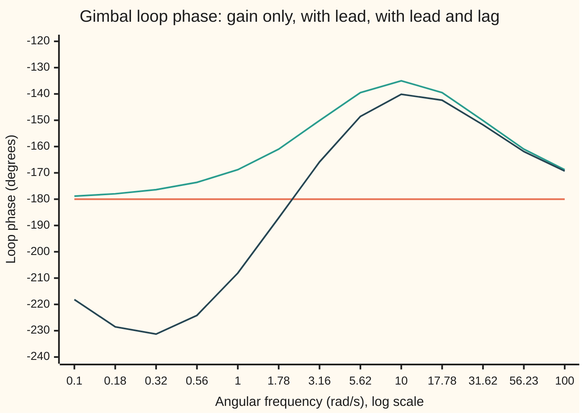
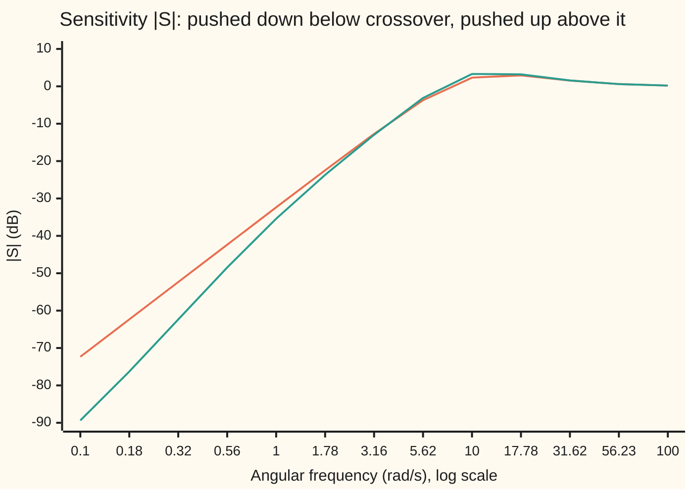
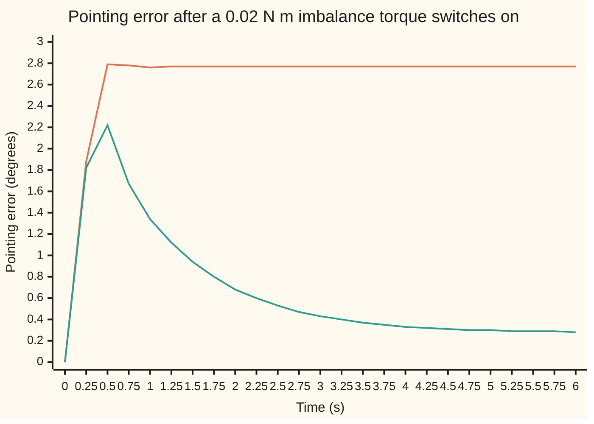

# Loop shaping: buy phase with a lead, buy accuracy with a lag

[Syllabus](../../../SYLLABUS.md) → [Engineering mathematics](../README.md) → [Feedback Control](../README.md#s03) → Loop shaping

---

## General Overview

A handheld camera gimbal holds a camera level while the hand that carries it shakes. Take its tilt axis. A brushless motor applies a torque, in newton metres (N m), to the camera and its cradle, whose moment of inertia (resistance to being spun up) is 0.01 kg m^2. A gyro and an angle sensor report the tilt. Nothing else acts on the camera: no spring pulls it back, almost no friction slows it. Torque changes the spin rate, and the spin rate changes the angle.

The engineer wants three things. The loop should react up to about 10 rad/s, which is 1.5915 Hz: that is the bandwidth the hand shake demands. It should have at least 35° of phase margin, so it does not ring. And a camera balanced slightly off its axis pulls with a steady 0.02 N m; that pull should leave a pointing error under 0.5°.

A plain proportional controller (torque proportional to the angle error) cannot do it at any gain. A pure inertia lags every wobble by exactly 180°, so the loop has zero phase margin at every frequency. The fix is two small filters in the controller. A **lead** section adds phase early, 45° at 10 rad/s, and turns zero margin into 45°. A **lag** section multiplies the controller's gain at low frequency by ten, which cuts the steady pointing error from 2.7665° to 0.2766°, and costs only 5.14° of phase at 10 rad/s. Choosing such sections by drawing the loop's frequency response into a target shape is **loop shaping**.

### The picture: the loop's phase, before and after

The loop's phase is how late a wobble comes back around the loop, against its frequency. The margin is the gap above −180° at the frequency where the loop's gain is 1, here 10 rad/s.



Orange: gain only, flat at −180°, no margin anywhere. Green: with the lead, a bump that peaks at −135.00° at 10 rad/s. Dark blue: lead and lag, −140.14° at 10 rad/s; the lag's dip sits a decade lower, where the loop gain is large, so it does no harm while the gain stays up (see When it holds).

**Loop shaping chooses the controller so that the loop's gain crosses 1 at the wanted bandwidth with phase to spare: a lead (a zero below a pole) buys phase near crossover, a lag (a pole below a zero) buys low-frequency gain, and Bode's sensitivity integral forbids pushing the error down at every frequency at once, because the area of attenuation must be paid back as amplification elsewhere.**

**What kind of fact this is:** a method for designing controllers, resting on two theorems proved on this card in Why it works: the lead's peak phase formula, and Bode's sensitivity integral (the waterbed effect), whose full proof is in a folded callout.

---

## The formula

Four pieces of notation from earlier cards, in one line each. $G(s)$ is the transfer function, what the system does to each exponential $e^{st}$; $s = j\omega$ reads off the response to a sine of angular frequency $\omega$, with $j$ the square root of −1 as engineers write it (the rest of the library writes i). The loop gain $L(s)$ is controller times plant, the round trip a signal makes ([Feedback](01-feedback-and-closed-loop-transfer-functions.md)). The sensitivity $S = 1/(1+L)$ is the factor by which feedback shrinks a disturbance's effect at each frequency ([Sensitivity functions](02-sensitivity-and-the-gang-of-four.md)). The phase margin is 180° plus the loop's phase at the crossover frequency $\omega_c$, where $|L| = 1$ ([Nyquist and margins](06-nyquist-criterion-and-stability-margins.md)).

The gimbal, the two sections and the loop:

$$G(s) = \frac{1}{J s^2}, \qquad C_1(s) = K_c\,\frac{T s + 1}{\alpha T s + 1}\ (\alpha < 1), \qquad C_2(s) = \beta\,\frac{T_l s + 1}{\beta T_l s + 1}\ (\beta > 1), \qquad L = C_1 C_2 G$$

The lead's phase peaks at the geometric mean of its zero $1/T$ and its pole $1/(\alpha T)$:

$$\omega_m = \frac{1}{T\sqrt{\alpha}}, \qquad \sin\varphi_m = \frac{1-\alpha}{1+\alpha} \quad\Longleftrightarrow\quad \alpha = \frac{1 - \sin\varphi_m}{1 + \sin\varphi_m}, \qquad \lvert C_1(j\omega_m)\rvert = \frac{K_c}{\sqrt{\alpha}}$$

**Read it aloud:** the lead's phase peaks halfway between its zero and its pole on a log scale; the peak is set by alpha alone, and there the lead's gain is one over root alpha times its low-frequency gain.

The waterbed, for a loop that is stable once closed and whose gain falls at least as fast as $1/\omega^2$:

$$\int_0^\infty \ln\lvert S(j\omega)\rvert\,d\omega = \pi \sum_k \operatorname{Re} p_k$$

**Read it aloud:** the area under the log of the sensitivity, over all frequencies, is pi times the sum of the real parts of the loop's unstable poles; for a loop with none, it is zero.

| Symbol | Plain meaning | In our example | Push it up and the answer… |
| --- | --- | --- | --- |
| $G(s)$, $s$, $j$ | plant transfer function; Laplace variable, set to $j\omega$; square root of −1 | $1/(J s^2)$: torque in N m to angle in rad | — |
| $J$ | moment of inertia of camera and cradle | 0.01 kg m^2 | needs more torque: $K_c$ grows in proportion |
| $\theta$, $u$ | tilt angle in rad; motor torque in N m | — | — |
| $C_1$, $K_c$ | the lead section; its low-frequency gain, torque per radian of error | $K_c$ = 0.414214 N m/rad | crossover moves up |
| $T$, $\alpha$ | the lead's time constant; pole-to-zero ratio, below 1 | 0.241421 s; 0.171573 | smaller $\alpha$: more phase, more noise gain $1/\alpha$ |
| $\omega$, $\omega_m$ | angular frequency in rad/s; where the lead's phase peaks | $\omega_m$ = 10 rad/s | — |
| $\varphi_m$ | the lead's peak phase | 45° | needs smaller $\alpha$ |
| $\omega_c$ | crossover: where $\lvert L\rvert = 1$, roughly the bandwidth | 10.0379 rad/s with both sections | faster loop, less margin from the plant |
| $C_2$, $\beta$, $T_l$ | the lag section; its low-frequency gain boost; its time constant | $\beta$ = 10, $T_l$ = 1 s | bigger $\beta$: smaller error, more phase lost |
| $L$, $S$ | loop gain; sensitivity $1/(1+L)$ | $\lvert S\rvert$ peaks at 3.81 dB | — |
| $p_k$ | an unstable pole of $L$, real part in rad/s | none; +3 rad/s for a top-heavy camera | the area under $\ln\lvert S\rvert$ grows by $\pi p_k$ |
| $\tau_d$, $e$ | steady imbalance torque; pointing error | 0.02 N m; 0.2766° | error grows in proportion |

The design follows from three lines. A pure inertia has phase −180° at every frequency, so a 45° margin at 10 rad/s needs $\varphi_m$ = 45° placed at $\omega_m$ = 10 rad/s. The gain $K_c$ is then chosen so that $\lvert C_1 G\rvert = 1$ there: $K_c = J\omega_c^2\sqrt{\alpha}$. The lag's corner $1/T_l$ goes a decade below crossover, at 1 rad/s.

### When it holds

- **Linear plant and actuator.** The motor must deliver whatever torque the controller asks. The lead's high-frequency gain is $K_c/\alpha$, so a 0.5 rad step command asks for 1.21 N m at once, more than a small gimbal motor gives; a saturated motor is not this loop, and the margins no longer describe it.
- **A plant model that is right near crossover.** The margins are read at 10 rad/s, so that is where the model must be good. An unmodelled 20 ms sensing delay costs phase the design never saw: 39.88° of margin falls to 28.38°.
- **Stable closed loop, judged as a whole.** Margins describe a loop that the Nyquist test already passes. The lead-lag loop is *conditionally* stable: its phase dips below −180° at 2.1465 rad/s, where its gain is 11.115. Cut the gain below 9.0% of design, as a weak battery might, and it goes unstable. The lead alone has no such floor.
- **Noise the sensor can live with.** A lead amplifies high frequencies by $1/\alpha$ = 5.8284 times, 15.31 dB, relative to low ones. Gyro noise reaches the motor that much louder.
- **Relative degree at least two for the waterbed.** The integral as written needs $\lvert L\rvert$ to fall at least as fast as $1/\omega^2$. Here it does: the lead flattens out and the inertia supplies $1/\omega^2$.

---

## Why it works

### Step 0: phases of factors add, and a zero adds phase before its pole takes it away

At $s = j\omega$, the loop gain is a product of complex numbers, so its phase is a sum ([Bode plots](../02-Linear%20Systems%20and%20Transforms/04-frequency-response-and-bode-plots.md)). A factor $T s + 1$, a zero, adds up to +90° of phase as $\omega$ climbs past $1/T$. A factor $1/(\alpha T s + 1)$, a pole, takes up to 90° away as $\omega$ climbs past $1/(\alpha T)$. Put the zero first and, in the band between them, the zero has given more than the pole has taken. That band is where the lead earns its keep. Swap the order and the same pair is a lag.

### Step 1: the peak sits at the geometric mean, and its height depends on alpha alone

The lead's phase is $\arctan(\omega T) - \arctan(\alpha\omega T)$. Write $x = \omega T$. The tangent of a difference gives $\tan\varphi = (1-\alpha)x/(1+\alpha x^2)$. That is largest where $x/(1+\alpha x^2)$ is, at $x = 1/\sqrt{\alpha}$. So the peak frequency is $\omega_m = 1/(T\sqrt{\alpha})$: on a log scale, halfway between the zero at $1/T$ and the pole at $1/(\alpha T)$. At the peak, $\tan\varphi_m = (1-\alpha)/(2\sqrt{\alpha})$. A right triangle with legs $1-\alpha$ and $2\sqrt{\alpha}$ has hypotenuse $1+\alpha$, which gives the sine formula.

<details>
<summary>Detailed proof</summary>

Let $f(x) = x/(1+\alpha x^2)$ for $x > 0$. Then $f'(x) = (1 - \alpha x^2)/(1+\alpha x^2)^2$, positive for $x < 1/\sqrt{\alpha}$ and negative beyond, so $f(x)$ has its single maximum at $x = 1/\sqrt{\alpha}$, where $f = 1/(2\sqrt{\alpha})$. The phase lies between 0° and 90° when $0 < \alpha < 1$, and on that range the tangent is increasing, so the phase peaks where $\tan\varphi = (1-\alpha) f(x)$ does. Hence $\tan\varphi_m = (1-\alpha)/(2\sqrt{\alpha})$.

Now $(1-\alpha)^2 + (2\sqrt{\alpha})^2 = 1 - 2\alpha + \alpha^2 + 4\alpha = (1+\alpha)^2$. So $\sin\varphi_m = (1-\alpha)/(1+\alpha)$. Solving for $\alpha$: $\alpha(1 + \sin\varphi_m) = 1 - \sin\varphi_m$.

The gain at the peak: $\lvert C_1(j\omega_m)\rvert / K_c = \sqrt{1 + x^2}/\sqrt{1 + \alpha^2 x^2}$ with $x^2 = 1/\alpha$, which is $\sqrt{(1 + 1/\alpha)/(1+\alpha)} = 1/\sqrt{\alpha}$.

</details>

For 45°, $\sin\varphi_m = \sqrt 2/2$ and $\alpha = 3 - 2\sqrt 2$ = 0.171573. No lead gives 90°: $\alpha$ would have to be 0, an infinite noise gain. Engineers stop at about 60° per section, where $\alpha$ is already 0.0718 and the noise gain 13.93.

### Step 2: the lead's gain lifts the crossover, so the gain must be set after the lead

At its peak the lead multiplies the loop's gain by $1/\sqrt{\alpha}$ = 2.4142. Put the peak at the old crossover and leave the gain alone, and the crossover walks right, to 19.29 rad/s, where the bump has faded: the margin is 39.25°, not 45°, and the bandwidth has nearly doubled. The design avoids this by choosing $K_c$ last: $K_c/\sqrt{\alpha} \cdot 1/(J\omega_c^2) = 1$ gives $K_c$ = 0.414214 N m/rad, and the code's bisection on $\lvert L\rvert = 1$ finds the crossover at 10.0000 rad/s with 45.00° of margin.

### Step 3: a lag a decade below crossover costs a few degrees and buys a factor of beta

The lag $C_2 = \beta (T_l s + 1)/(\beta T_l s + 1)$ has gain $\beta$ at low frequency and 1 at high frequency. At steady state the controller's torque must cancel the imbalance: $C(0)\,e = -\tau_d$, so the camera sits off by $\lvert e\rvert = \tau_d/(\beta K_c)$, ten times smaller with $\beta$ = 10. Its price is phase near crossover. Using $\arctan x \approx \pi/2 - 1/x$ (radians) for large $x$, the lag's phase at $\omega_c$ is about $-(1 - 1/\beta)/(\omega_c T_l)$ radians: −5.16° by the rule, −5.14° exactly. Its gain there is 1.0049, so the crossover barely moves, to 10.0379 rad/s, and the margin is 39.88°. Move the lag's zero up to 5 rad/s and the margin collapses to 22.68°: the lag must live well below crossover.

### Step 4: the waterbed: log sensitivity has zero net area

Feedback works where $\lvert S\rvert < 1$: a disturbance at that frequency is shrunk. Bode's sensitivity integral says the area of $\ln\lvert S\rvert$ against $\omega$ cannot be negative overall. For the gimbal, with no unstable pole, it is exactly zero. The code integrates it: the lead loop has −13.4154 rad/s of area below zero and 13.4154 above; the lead-lag loop, which pushes harder at low frequency, has −14.4668 below and 14.4669 above. Pushing $\lvert S\rvert$ down at low frequency raised it near crossover: the peak of $\lvert S\rvert$ rose from 3.20 dB at 14.03 rad/s to 3.81 dB at 12.59 rad/s.



Orange: lead only. Green: lead and lag. Below 0 dB feedback helps; above it, feedback makes disturbances worse. The log axis hides the balance: the integral is over $\omega$ itself, so the thin positive sliver from 10 to 100 rad/s and beyond weighs as much as the deep trough below 5 rad/s.

<details>
<summary>Detailed proof</summary>

Assume the closed loop is stable, so $S = 1/(1+L)$ has no poles with $\operatorname{Re} s \ge 0$ (apart from what follows), and assume $sL(s) \to 0$ as $\lvert s\rvert \to \infty$ in the right half plane, which holds when $L$ falls like $1/s^2$. The zeros of $S$ in the open right half plane are the unstable poles $p_k$ of $L$. Remove them with the factor $B(s) = \prod_k (s - p_k)/(s + \bar p_k)$, which has $\lvert B(j\omega)\rvert = 1$ on the imaginary axis. Then $S/B$ has no zeros and no poles in the right half plane, so $\ln(S/B)$ is analytic there.

Integrate $\ln(S/B)$ anticlockwise around the half disc of radius $R > 0$: down the imaginary axis from $s = jR$ to $s = -jR$, then along the semicircle $s = Re^{j\psi}$ with $-\pi/2 \le \psi \le \pi/2$. Cauchy's theorem makes the total zero. On the semicircle, $\ln S = -\ln(1+L) \approx -L$, and $R \cdot \lvert L\rvert \to 0$, so that part vanishes. Also $\ln(1/B) = \sum_k \ln\big((1 + \bar p_k/s)/(1 - p_k/s)\big) \approx \sum_k 2\operatorname{Re}p_k / s$, whose integral over the semicircle tends to $j\pi \sum_k 2\operatorname{Re} p_k$. Along the axis, $ds = j\,d\omega$ and the real part of $\ln(S/B)$ is $\ln\lvert S\rvert$. Taking the part multiplying $j$: $-\int_{-R}^{R} \ln\lvert S(j\omega)\rvert\,d\omega + 2\pi\sum_k \operatorname{Re}p_k \to 0$. Since $\lvert S(-j\omega)\rvert = \lvert S(j\omega)\rvert$, the integral over $(-R, R)$ is twice the one over $(0, R)$, which gives the formula.

Poles of $L$ on the imaginary axis, such as the gimbal's double pole at 0, are zeros of $S$ there. Indent the contour around them with small half circles; $\ln\lvert S\rvert$ grows only like $2\ln\omega$ near 0, which is integrable, and the indentations contribute nothing in the limit. Bode stated the stable case in 1945; Freudenberg and Looze gave the unstable-pole form in 1985.

</details>

### Step 5: what the waterbed forbids

Three things follow. First, no controller makes $\lvert S\rvert < 1$ at every frequency: the area must balance. Second, an unstable plant pays extra. A top-heavy camera, its centre of mass above the axis, has gravity torque 0.09 N m/rad pushing it over, an unstable pole at +3 rad/s. The same lead still stabilises it (the Routh test, [Routh-Hurwitz](04-routh-hurwitz-criterion.md), gives 0.000828 > 0), but the integral is now 9.4248 rad/s, π times 3: net amplification is compulsory. Third, the balance can only be spread thin over frequencies where the loop gain is small, and those are limited by noise, by the motor and by delays. A delay caps how high crossover can go; that limit is the subject of [Time delays](10-smith-predictor-and-time-delays.md). A right-half-plane zero (a zero with positive real part) caps it too, holding crossover well below the zero's frequency (Freudenberg and Looze, in Sources).

The same design can be reached in the complex plane by placing closed-loop poles with the lead's zero and pole ([Root locus](05-root-locus.md)); a lead is also a filtered derivative term, the D of [PID control](07-pid-control-and-tuning.md) with the filter of [PID in practice](08-pid-on-real-hardware.md) (its Step 5), and a lag a softened integral.

---

## Worked numbers, by hand

Target: crossover 10 rad/s, margin at least 35°, error under 0.5° for 0.02 N m.

| Step | Arithmetic | Value |
| --- | --- | --- |
| margin the plant gives at 10 rad/s | 180° − 180° | 0° |
| lead needed | 45° at 10 rad/s, leaving room for the lag | $\varphi_m$ = 45° |
| $\alpha$ | (1 − 0.70711) / (1 + 0.70711) | 0.171573 |
| $T$ | 1 / (10 × √0.171573) = 1 / (10 × 0.414214) | 0.241421 s |
| zero and pole | 1/0.241421 and 1/(0.171573 × 0.241421) | 4.1421 rad/s and 24.1421 rad/s |
| $K_c$ | 0.01 × 10^2 × 0.414214 | 0.414214 N m/rad |
| error, lead only | 0.02 / 0.414214 = 0.048284 rad | 2.7665°: fails |
| lag | $\beta$ = 10, zero 1 rad/s, pole 0.1 rad/s | — |
| lag's phase at 10 rad/s | arctan 10 − arctan 100 = 84.289° − 89.427° | −5.14° |
| margin with both | 45° − 5.14° = 39.86° at 10 rad/s; crossover moves to 10.0379 rad/s | 39.88° |
| **error, lead and lag** | 2.7665° / 10 | **0.2766°: passes** |

The camera now holds within 0.28° of level against the imbalance, with 39.88° of margin at 10.0379 rad/s. A 0.1 rad step in the commanded tilt overshoots by 33.6% with the lead alone and 42.0% with both: the lag's slow corner adds a tail. The margin also sets how much unmodelled delay the loop survives, the margin in radians divided by the crossover: 78.5 ms with the lead, 69.3 ms with both.

The imbalance switches on at time 0. The simulated pointing error:



Orange: lead only, settling at 2.77° within half a second. Green: lead and lag, the same fast first response, then a slow slide to 0.28°, reached near 6 s; the simulation reads 0.2766° at 20 s.

### What breaks if you drop a piece

| Mistake | Comes out at | What went wrong |
| --- | --- | --- |
| Keep the plain gain, $K_c$ = 1.00 N m/rad | crossover 19.29 rad/s, margin 39.25° (designed 10 rad/s, 45°) | The lead's gain of 2.4142 at its peak moved the crossover past the peak |
| Flip $\alpha$ to 5.8284 | margin −45.00°; Routh test −0.004828 < 0: unstable | Pole before zero is a lag: it subtracts 45° from a loop that had none |
| Lag zero at 5 rad/s, not 1 rad/s | margin 22.68° (crossover 10.77 rad/s) | The lag's phase dip landed on crossover |
| Ignore a 20 ms sensing delay | margin 28.38°, not 39.88° | A delay subtracts $\omega$ times the delay, 11.46° at 10 rad/s; the delay margin was only 69.3 ms |

---

## Code, from first principles, and it actually runs

The code designs the lead from its formulas, then reaches the same numbers by other roads. A golden-section search (shrinking a bracket by a fixed ratio each step) over frequency finds the lead's phase peak without the formula. An RK4 simulation (fourth-order Runge-Kutta, a time-stepping method) pushes a 10 rad/s sine through the lead's differential equation and measures how much bigger and earlier it comes out. A bisection on $\lvert L\rvert = 1$, with complex arithmetic written out, finds each crossover and margin. A second RK4 simulation runs the whole closed loop against the imbalance torque and a step command, and checks both Routh verdicts: the top-heavy camera settles at the angle the formula predicts, the flipped lead runs away. Finally Simpson's rule (a weighted sum of samples) integrates $\ln\lvert S\rvert$ from $10^{-6}$ to $10^{7}$ rad/s to test the waterbed, for the stable gimbal and the top-heavy one. Every number on the card is printed, including every chart point.

### Python

```python
# Loop shaping -- the check behind the card.  Standard library only.
# A camera gimbal's tilt axis: motor torque u (N m) turns inertia J = 0.01 kg m^2, so the
# plant is G(s) = 1/(J s^2), angle in rad.  Target: loop crossover 10 rad/s.  A lead
# C1 = Kc (T s + 1)/(alpha T s + 1) adds 45 deg there; a lag C2 = beta (Tl s + 1)/(beta Tl s + 1)
# multiplies the low-frequency gain by beta = 10.  Roads: closed-form design; complex
# arithmetic with a search and a bisection; RK4 simulation in time; the Bode sensitivity integral.
from math import sqrt, sin, cos, atan, atan2, log, log10, exp, pi, degrees, radians

J, WC, PHI, BETA, TL, TD = 0.01, 10.0, radians(45.0), 10.0, 1.0, 0.02   # TD: imbalance torque, N m
ALPHA = (1 - sin(PHI)) / (1 + sin(PHI))                 # road 1: the design formulas
T, KC = 1 / (WC * sqrt(ALPHA)), J * WC ** 2 * sqrt(ALPHA)

def lead(w, kc=KC, al=ALPHA, t=T):
    return kc * complex(1, w * t) / complex(1, al * w * t)
def lag(w, b=BETA, tl=TL):
    return b * complex(1, w * tl) / complex(1, b * w * tl)
def loop(w, uselag=True, delay=0.0, k=0.0, **kw):          # k > 0: top-heavy payload, J s^2 - k
    c = lead(w, **kw) * (lag(w) if uselag else 1)
    return c * complex(cos(w * delay), -sin(w * delay)) / (-J * w * w - k)
def deg(z): return degrees(atan2(z.imag, z.real))
def crossover(f, lo=0.5, hi=500.0):                          # bisection on |L| = 1, in log w
    for _ in range(100):
        m = sqrt(lo * hi)
        lo, hi = (m, hi) if abs(f(m)) > 1 else (lo, m)
    w = sqrt(lo * hi)
    return w, (deg(f(w)) + 360) % 360 - 180                  # phase margin: angle above -180 deg
def golden(f, lo, hi):                                       # maximise f on [lo, hi], searching in log w
    g, lo, hi = (sqrt(5) - 1) / 2, log(lo), log(hi)
    for _ in range(200):
        a, b = hi - g * (hi - lo), lo + g * (hi - lo)
        lo, hi = (lo, b) if f(exp(a)) > f(exp(b)) else (a, hi)
    return exp((lo + hi) / 2)
def rk4(f, x, dt, n, every):                                 # returns x[0] every `every` steps
    out = [x[0]]
    for i in range(1, n + 1):
        k1 = f(x); k2 = f([a + dt / 2 * b for a, b in zip(x, k1)])
        k3 = f([a + dt / 2 * b for a, b in zip(x, k2)]); k4 = f([a + dt * b for a, b in zip(x, k3)])
        x = [a + dt / 6 * (p + 2 * q + 2 * r + s) for a, p, q, r, s in zip(x, k1, k2, k3, k4)]
        if i % every == 0: out.append(x[0])
    return out
def gimbal(uselag, d, r, tend, every, kc=KC, al=ALPHA, t=T, k=0.0):   # states: angle, rate, lead state, lag state
    def f(x):
        e = r - x[0]
        v = kc * (e / al + (1 - 1 / al) * x[2])              # lead = KC/alpha + KC(1 - 1/alpha)/(alpha T s + 1)
        u = v + (BETA - 1) * x[3] if uselag else v           # lag = 1 + (beta - 1)/(beta Tl s + 1)
        return [x[1], (u + d + k * x[0]) / J, (e - x[2]) / (al * t), (v - x[3]) / (BETA * TL)]   # k: top-heavy pull
    return rk4(f, [0.0] * 4, 0.001, int(round(tend * 1000)), every)
def bode_integral(f, sign=0):                                # integral of ln|S| dw, w = e^u, Simpson
    lo, hi, n = log(1e-6), log(1e7), 40000
    h, tot = (hi - lo) / n, 0.0
    for i in range(n + 1):
        w = exp(lo + i * h); v = log(abs(1 / (1 + f(w))))
        v = v if sign == 0 else (min(v, 0.0) if sign < 0 else max(v, 0.0))
        tot += (1 if i in (0, n) else (4 if i % 2 else 2)) * v * w
    return tot * h / 3

print(f"gimbal: J = {J} kg m^2, plant 1/(J s^2); target crossover {WC:.0f} rad/s = {WC / 2 / pi:.4f} Hz")
print(f"target: phase margin at least 35 deg, pointing error under 0.5 deg for a {TD} N m imbalance torque")
print(f"road 1, lead formulas: alpha {ALPHA:.6f}  T {T:.6f} s  zero {1 / T:.4f} rad/s  pole {1 / (ALPHA * T):.4f} rad/s  Kc {KC:.6f} N m/rad")
wm = golden(lambda w: deg(lead(w)), 0.1, 1000.0)
print(f"road 2, search: lead phase peaks at {deg(lead(wm)):.4f} deg at {wm:.4f} rad/s; gain there {abs(lead(wm)) / KC:.4f} (1/sqrt(alpha) {1 / sqrt(ALPHA):.4f})")
n = 20000; dt = 2 * pi / WC / 2000                           # road 3: a 10 rad/s sine through the lead's ODE
x, ys, e = 0.0, [], lambda t: sin(WC * t)
for i in range(n):                                           # alpha T x' = -x + e,  y = e/alpha + (1 - 1/alpha) x
    t = i * dt
    k1 = (e(t) - x) / (ALPHA * T); k2 = (e(t + dt / 2) - x - dt / 2 * k1) / (ALPHA * T)
    k3 = (e(t + dt / 2) - x - dt / 2 * k2) / (ALPHA * T); k4 = (e(t + dt) - x - dt * k3) / (ALPHA * T)
    ys.append(e(t) / ALPHA + (1 - 1 / ALPHA) * x); x += dt / 6 * (k1 + 2 * k2 + 2 * k3 + k4)
last = range(n - 2000, n); sa = sum(ys[i] * sin(WC * i * dt) for i in last) / 1000; ca = sum(ys[i] * cos(WC * i * dt) for i in last) / 1000
print(f"road 3, simulation: the sine comes out {sqrt(sa * sa + ca * ca):.4f} times bigger and {degrees(atan2(ca, sa)):.2f} deg early")
w1, pm1 = crossover(lambda w: loop(w, uselag=False))
print(f"lead loop: crossover {w1:.4f} rad/s, phase margin {pm1:.2f} deg, delay margin {radians(pm1) / w1 * 1000:.1f} ms")
lagc = deg(lag(WC)); rule = -degrees((1 - 1 / BETA) / (WC * TL))
print(f"lag: beta {BETA:.0f}, zero {1 / TL:.4f} rad/s, pole {1 / (BETA * TL):.4f} rad/s; phase at 10 rad/s {lagc:.2f} deg (rule of thumb {rule:.2f})")
print(f"hand: sin 45 deg {sin(PHI):.5f}; error, lead only {TD / KC:.6f} rad; arctan 10 = {degrees(atan(10)):.3f} deg,"
      f" arctan 100 = {degrees(atan(100)):.3f} deg; lag gain at 10 rad/s {abs(lag(WC)):.4f}; 20 ms at 10 rad/s = {degrees(0.2):.2f} deg")
w2, pm2 = crossover(lambda w: loop(w))
print(f"lead-lag loop: crossover {w2:.4f} rad/s, phase margin {pm2:.2f} deg, delay margin {radians(pm2) / w2 * 1000:.1f} ms")
lo, hi = 1.0, 5.0                                            # where the lead-lag loop's phase crosses -180 deg
for _ in range(100):
    m = (lo + hi) / 2; lo, hi = (m, hi) if loop(m).imag > 0 else (lo, m)
print(f"lead-lag: phase crosses -180 deg at {lo:.4f} rad/s where |L| = {abs(loop(lo)):.3f}: gain may fall to {100 / abs(loop(lo)):.1f}% of design")
e1, e2 = gimbal(False, TD, 0.0, 20.0, 20000), gimbal(True, TD, 0.0, 20.0, 20000)
print(f"imbalance {TD} N m, steady pointing error: formula {degrees(TD / KC):.4f} deg lead, {degrees(TD / (KC * BETA)):.4f} deg lead-lag;"
      f" simulated at 20 s {degrees(e1[-1]):.4f}, {degrees(e2[-1]):.4f}")
s1, s2 = gimbal(False, 0.0, 0.1, 5.0, 1), gimbal(True, 0.0, 0.1, 5.0, 1)
print(f"0.1 rad step: overshoot {100 * (max(s1) / 0.1 - 1):.1f}% lead, {100 * (max(s2) / 0.1 - 1):.1f}% lead-lag")
print(f"noise: lead's high-frequency gain is {1 / ALPHA:.4f} times its low ({20 * log10(1 / ALPHA):.2f} dB);"
      f" a 0.5 rad step asks {0.5 * KC / ALPHA:.2f} N m at once")
I1, I2 = bode_integral(lambda w: loop(w, uselag=False)), bode_integral(loop)
print(f"waterbed, integral of ln|S| dw (theorem: 0): lead {I1:.4f}, lead-lag {I2:.4f} rad/s")
for name, uselag in (("lead", False), ("lead-lag", True)):
    f = lambda w: loop(w, uselag=uselag)
    pk = golden(lambda w: abs(1 / (1 + f(w))), 1.0, 100.0)
    print(f"  {name:<8} area below 0 {bode_integral(f, -1):8.4f}, above 0 {bode_integral(f, 1):7.4f} rad/s;"
          f" peak |S| {20 * log10(abs(1 / (1 + f(pk)))):.2f} dB at {pk:.2f} rad/s")
K3 = 9 * J; a3, a2, a1, a0 = ALPHA * T * J, J, KC * T - K3 * ALPHA * T, KC - K3                 # pole at sqrt(K3/J) = 3 rad/s
I3 = bode_integral(lambda w: loop(w, uselag=False, k=K3))
print(f"top-heavy payload, k = {K3:.2f} N m/rad, pole at +{sqrt(K3 / J):.0f} rad/s: Routh a2 a1 - a3 a0 = {a2 * a1 - a3 * a0:.6f} > 0;"
      f" integral {I3:.4f} (theorem pi x 3 = {3 * pi:.4f})")
# ---- what breaks ----
wb1 = crossover(lambda w: loop(w, uselag=False, kc=J * WC ** 2))
print(f"wrong: keep the plain-gain Kc = {J * WC ** 2:.2f}: crossover {wb1[0]:.2f} rad/s, margin {wb1[1]:.2f} deg")
af = 1 / ALPHA; tf = 1 / (WC * sqrt(af)); kf = J * WC ** 2 * sqrt(af)
wb2 = crossover(lambda w: loop(w, uselag=False, kc=kf, al=af, t=tf))
print(f"wrong: alpha flipped to {af:.4f}: margin {wb2[1]:.2f} deg; Routh a2 a1 - a3 a0 = {J * kf * tf - af * tf * J * kf:.6f}")
sk, sf = gimbal(False, 0.0, 0.1, 5.0, 1, k=K3), gimbal(False, 0.0, 0.1, 5.0, 1, kc=kf, al=af, t=tf); print(f"Routh by simulation, 0.1 rad step: top-heavy settles at {sk[-1]:.4f} rad (0.1 Kc/(Kc - k) = {0.1 * KC / (KC - K3):.4f}); flipped alpha passes 1 rad at {next(i for i, v in enumerate(sf) if abs(v) > 1) * 0.001:.3f} s")
wb3 = crossover(lambda w: lead(w) * lag(w, tl=0.2) / (-J * w * w))
print(f"wrong: lag zero at 5 rad/s, not 1: crossover {wb3[0]:.2f} rad/s, margin {wb3[1]:.2f} deg")
wb4 = crossover(lambda w: loop(w, delay=0.02))
print(f"wrong: ignore a 20 ms sensing delay: margin {wb4[1]:.2f} deg, not {pm2:.2f}")
wt = crossover(lambda w: lead(w) * lag(w, b=30.0) / (-J * w * w))
print(f"try: beta 30: error {degrees(TD / (KC * 30)):.4f} deg, margin {wt[1]:.2f} deg")
a60 = (1 - sin(radians(60))) / (1 + sin(radians(60))); print(f"try: lead of 60 deg: alpha {a60:.4f}, high-frequency gain {1 / a60:.2f} times the low")
# ---- chart points ----
ws = [10 ** (k / 4) for k in range(-4, 9)]
def row(label, vals, w): return f"{label:<23}" + " ".join(f"{v:{w}.2f}" for v in vals)
ph = lambda w, l: -180 + degrees(atan(w * T) - atan(ALPHA * w * T)) + l * degrees(atan(w * TL) - atan(BETA * w * TL))
print(row("chart, w rad/s", ws, 7))
print(row("chart, phase gain deg", [(deg(J * WC ** 2 / complex(-J * w * w, 0)) + 360) % 360 - 360 for w in ws], 7))
print(row("chart, phase lead deg", [ph(w, 0) for w in ws], 7))
print(row("chart, phase l-lag deg", [ph(w, 1) for w in ws], 7))
print(row("chart, |S| lead dB", [20 * log10(abs(1 / (1 + loop(w, uselag=False)))) for w in ws], 7))
print(row("chart, |S| l-lag dB", [20 * log10(abs(1 / (1 + loop(w)))) for w in ws], 7))
c1, c2 = gimbal(False, TD, 0.0, 6.0, 250), gimbal(True, TD, 0.0, 6.0, 250)
print(row("chart, t s", [0.25 * i for i in range(25)], 5))
print(row("chart, error lead deg", [degrees(v) for v in c1], 5))
print(row("chart, error l-lag deg", [degrees(v) for v in c2], 5))
assert abs(deg(lead(wm)) - 45.0) < 1e-6; assert abs(wm - WC) < 1e-4   # search finds the formula's peak, at its frequency
assert abs(degrees(atan2(ca, sa)) - 45.0) < 0.05                    # simulated sine leads by 45 deg
assert abs(sqrt(sa * sa + ca * ca) - 1 / sqrt(ALPHA)) < 1e-3       # ... and is 1/sqrt(alpha) bigger
assert abs(pm1 - 45.0) < 1e-6                                      # bisection lands on the design
assert abs(e2[-1] - TD / (KC * BETA)) < 1e-6 * TD / KC              # simulated error = beta-fold smaller
assert abs(I2) < 1e-3                                              # waterbed: net area zero
assert abs(I3 - 3 * pi) < 1e-3                                     # unstable pole: net area pi p
assert (max(abs(v) for v in sf) > 1.0) == (J * kf * tf - af * tf * J * kf < 0)   # flipped alpha: Routh verdict = simulation
assert (abs(sk[-1] - 0.1 * KC / (KC - K3)) < 1e-6) == (a2 * a1 - a3 * a0 > 0)    # top-heavy: Routh verdict = simulation
assert abs(wb2[1] + 45.0) < 1e-6                                   # ... and bisection finds -45 deg margin
assert pm2 >= 35.0 and degrees(e2[-1]) < 0.5                       # lead-lag meets both targets
print("ALL CHECKS PASS")
```

**Ran 2026-10-06 on macOS, Python 3.14.6, standard library only. All checks passed. Output, pasted from the run:**

```
gimbal: J = 0.01 kg m^2, plant 1/(J s^2); target crossover 10 rad/s = 1.5915 Hz
target: phase margin at least 35 deg, pointing error under 0.5 deg for a 0.02 N m imbalance torque
road 1, lead formulas: alpha 0.171573  T 0.241421 s  zero 4.1421 rad/s  pole 24.1421 rad/s  Kc 0.414214 N m/rad
road 2, search: lead phase peaks at 45.0000 deg at 10.0000 rad/s; gain there 2.4142 (1/sqrt(alpha) 2.4142)
road 3, simulation: the sine comes out 2.4142 times bigger and 45.00 deg early
lead loop: crossover 10.0000 rad/s, phase margin 45.00 deg, delay margin 78.5 ms
lag: beta 10, zero 1.0000 rad/s, pole 0.1000 rad/s; phase at 10 rad/s -5.14 deg (rule of thumb -5.16)
hand: sin 45 deg 0.70711; error, lead only 0.048284 rad; arctan 10 = 84.289 deg, arctan 100 = 89.427 deg; lag gain at 10 rad/s 1.0049; 20 ms at 10 rad/s = 11.46 deg
lead-lag loop: crossover 10.0379 rad/s, phase margin 39.88 deg, delay margin 69.3 ms
lead-lag: phase crosses -180 deg at 2.1465 rad/s where |L| = 11.115: gain may fall to 9.0% of design
imbalance 0.02 N m, steady pointing error: formula 2.7665 deg lead, 0.2766 deg lead-lag; simulated at 20 s 2.7665, 0.2766
0.1 rad step: overshoot 33.6% lead, 42.0% lead-lag
noise: lead's high-frequency gain is 5.8284 times its low (15.31 dB); a 0.5 rad step asks 1.21 N m at once
waterbed, integral of ln|S| dw (theorem: 0): lead 0.0000, lead-lag 0.0000 rad/s
  lead     area below 0 -13.4154, above 0 13.4154 rad/s; peak |S| 3.20 dB at 14.03 rad/s
  lead-lag area below 0 -14.4668, above 0 14.4669 rad/s; peak |S| 3.81 dB at 12.59 rad/s
top-heavy payload, k = 0.09 N m/rad, pole at +3 rad/s: Routh a2 a1 - a3 a0 = 0.000828 > 0; integral 9.4248 (theorem pi x 3 = 9.4248)
wrong: keep the plain-gain Kc = 1.00: crossover 19.29 rad/s, margin 39.25 deg
wrong: alpha flipped to 5.8284: margin -45.00 deg; Routh a2 a1 - a3 a0 = -0.004828
Routh by simulation, 0.1 rad step: top-heavy settles at 0.1278 rad (0.1 Kc/(Kc - k) = 0.1278); flipped alpha passes 1 rad at 0.918 s
wrong: lag zero at 5 rad/s, not 1: crossover 10.77 rad/s, margin 22.68 deg
wrong: ignore a 20 ms sensing delay: margin 28.38 deg, not 39.88
try: beta 30: error 0.0922 deg, margin 39.50 deg
try: lead of 60 deg: alpha 0.0718, high-frequency gain 13.93 times the low
chart, w rad/s            0.10    0.18    0.32    0.56    1.00    1.78    3.16    5.62   10.00   17.78   31.62   56.23  100.00
chart, phase gain deg  -180.00 -180.00 -180.00 -180.00 -180.00 -180.00 -180.00 -180.00 -180.00 -180.00 -180.00 -180.00 -180.00
chart, phase lead deg  -178.85 -177.96 -176.38 -173.60 -168.80 -160.98 -150.10 -139.49 -135.00 -139.49 -150.10 -160.98 -168.80
chart, phase l-lag deg -218.14 -228.53 -231.29 -224.17 -208.09 -187.11 -165.84 -148.55 -140.14 -142.38 -151.73 -161.90 -169.31
chart, |S| lead dB      -72.34  -62.35  -52.35  -42.36  -32.38  -22.46  -12.73   -3.72    2.32    2.93    1.54    0.60    0.20
chart, |S| l-lag dB     -89.38  -76.29  -62.36  -48.46  -35.42  -23.69  -12.97   -3.11    3.31    3.20    1.57    0.60    0.20
chart, t s              0.00  0.25  0.50  0.75  1.00  1.25  1.50  1.75  2.00  2.25  2.50  2.75  3.00  3.25  3.50  3.75  4.00  4.25  4.50  4.75  5.00  5.25  5.50  5.75  6.00
chart, error lead deg   0.00  1.88  2.79  2.78  2.76  2.77  2.77  2.77  2.77  2.77  2.77  2.77  2.77  2.77  2.77  2.77  2.77  2.77  2.77  2.77  2.77  2.77  2.77  2.77  2.77
chart, error l-lag deg  0.00  1.82  2.22  1.67  1.34  1.12  0.94  0.80  0.68  0.60  0.53  0.47  0.43  0.40  0.37  0.35  0.33  0.32  0.31  0.30  0.30  0.29  0.29  0.29  0.28
ALL CHECKS PASS
```

### Rust

The same checks, with complex numbers as a small struct written out. No crates. The two outputs are identical line for line.

```rust
// Loop shaping -- the same check as lead_lag_compensation_and_loop_shaping_check.py, in Rust.
// Standard library only, no crates.  Complex numbers are a small struct written out.
// Camera gimbal tilt axis: G(s) = 1/(J s^2), J = 0.01 kg m^2.  Lead C1 = Kc (T s + 1)/(alpha T s + 1)
// adds 45 deg at 10 rad/s; lag C2 = beta (Tl s + 1)/(beta Tl s + 1), beta = 10.
use std::f64::consts::PI;
const J: f64 = 0.01; const WC: f64 = 10.0; const BETA: f64 = 10.0; const TL: f64 = 1.0; const TD: f64 = 0.02; // TD: imbalance torque, N m
#[derive(Clone, Copy)] struct C { re: f64, im: f64 }
impl C {
    fn new(re: f64, im: f64) -> C { C { re, im } }
    fn mul(self, o: C) -> C { C::new(self.re * o.re - self.im * o.im, self.re * o.im + self.im * o.re) }
    fn div(self, o: C) -> C { let d = o.re * o.re + o.im * o.im; C::new((self.re * o.re + self.im * o.im) / d, (self.im * o.re - self.re * o.im) / d) }
    fn scale(self, k: f64) -> C { C::new(self.re * k, self.im * k) }
    fn abs(self) -> f64 { (self.re * self.re + self.im * self.im).sqrt() }
    fn deg(self) -> f64 { self.im.atan2(self.re).to_degrees() }
}
struct D { alpha: f64, t: f64, kc: f64 }
fn lead(w: f64, d: &D) -> C { C::new(1.0, w * d.t).div(C::new(1.0, d.alpha * w * d.t)).scale(d.kc) }
fn lag(w: f64, b: f64, tl: f64) -> C { C::new(1.0, w * tl).div(C::new(1.0, b * w * tl)).scale(b) }
// k > 0: top-heavy payload, plant 1/(J s^2 - k)
fn lp(w: f64, d: &D, uselag: bool, delay: f64, k: f64) -> C {
    let c = if uselag { lead(w, d).mul(lag(w, BETA, TL)) } else { lead(w, d) };
    c.mul(C::new((w * delay).cos(), -(w * delay).sin())).scale(1.0 / (-J * w * w - k))
}
fn crossover(f: &dyn Fn(f64) -> C) -> (f64, f64) {
    let (mut lo, mut hi) = (0.5f64, 500.0f64);
    for _ in 0..100 { let m = (lo * hi).sqrt(); if f(m).abs() > 1.0 { lo = m } else { hi = m } }
    let w = (lo * hi).sqrt();
    (w, (f(w).deg() + 360.0) % 360.0 - 180.0)
}
fn golden(f: &dyn Fn(f64) -> f64, lo: f64, hi: f64) -> f64 {
    let (g, mut lo, mut hi) = ((5f64.sqrt() - 1.0) / 2.0, lo.ln(), hi.ln());
    for _ in 0..200 { let (a, b) = (hi - g * (hi - lo), lo + g * (hi - lo)); if f(a.exp()) > f(b.exp()) { hi = b } else { lo = a } }
    ((lo + hi) / 2.0).exp()
}
// RK4 on the closed loop; states angle, rate, lead state, lag state; returns angle every `every` steps
fn gimbal(d: &D, uselag: bool, dist: f64, r: f64, tend: f64, every: usize, k: f64) -> Vec<f64> {
    let f = |x: &[f64; 4]| -> [f64; 4] {
        let e = r - x[0];
        let v = d.kc * (e / d.alpha + (1.0 - 1.0 / d.alpha) * x[2]);
        let u = if uselag { v + (BETA - 1.0) * x[3] } else { v };
        [x[1], (u + dist + k * x[0]) / J, (e - x[2]) / (d.alpha * d.t), (v - x[3]) / (BETA * TL)] // k: top-heavy pull
    };
    let (dt, n) = (0.001, (tend * 1000.0).round() as usize);
    let mut x = [0.0f64; 4];
    let mut out = vec![x[0]];
    let add = |x: &[f64; 4], k: &[f64; 4], h: f64| -> [f64; 4] { [x[0] + h * k[0], x[1] + h * k[1], x[2] + h * k[2], x[3] + h * k[3]] };
    for i in 1..=n {
        let k1 = f(&x); let k2 = f(&add(&x, &k1, dt / 2.0));
        let k3 = f(&add(&x, &k2, dt / 2.0)); let k4 = f(&add(&x, &k3, dt));
        for j in 0..4 { x[j] += dt / 6.0 * (k1[j] + 2.0 * k2[j] + 2.0 * k3[j] + k4[j]); }
        if i % every == 0 { out.push(x[0]); }
    }
    out
}
// integral of ln|S| dw with w = e^u, Simpson; sign -1 keeps only negative parts, +1 only positive
fn bode_integral(f: &dyn Fn(f64) -> C, sign: i32) -> f64 {
    let (lo, hi, n) = (1e-6f64.ln(), 1e7f64.ln(), 40000usize);
    let h = (hi - lo) / n as f64;
    let mut tot = 0.0;
    for i in 0..=n {
        let w = (lo + i as f64 * h).exp(); let l = f(w);
        let mut v = (1.0 / C::new(1.0 + l.re, l.im).abs()).ln();
        if sign < 0 { v = v.min(0.0) } else if sign > 0 { v = v.max(0.0) }
        let c = if i == 0 || i == n { 1.0 } else if i % 2 == 1 { 4.0 } else { 2.0 };
        tot += c * v * w;
    }
    tot * h / 3.0
}
fn s_db(l: C) -> f64 { 20.0 * (1.0 / C::new(1.0 + l.re, l.im).abs()).log10() }
fn row(label: &str, v: &[f64], w: usize) -> String {
    let mut s = String::from(label);
    for (i, x) in v.iter().enumerate() { if i > 0 { s.push(' ') } s += &format!("{:w$.2}", x, w = w); }
    s
}

fn main() {
    let phi = 45f64.to_radians();
    let alpha = (1.0 - phi.sin()) / (1.0 + phi.sin());
    let (t, kc) = (1.0 / (WC * alpha.sqrt()), J * WC * WC * alpha.sqrt());
    let d = D { alpha, t, kc };
    println!("gimbal: J = {} kg m^2, plant 1/(J s^2); target crossover {:.0} rad/s = {:.4} Hz", J, WC, WC / 2.0 / PI);
    println!("target: phase margin at least 35 deg, pointing error under 0.5 deg for a {} N m imbalance torque", TD);
    println!("road 1, lead formulas: alpha {:.6}  T {:.6} s  zero {:.4} rad/s  pole {:.4} rad/s  Kc {:.6} N m/rad", alpha, t, 1.0 / t, 1.0 / (alpha * t), kc);
    let wm = golden(&|w| lead(w, &d).deg(), 0.1, 1000.0);
    println!("road 2, search: lead phase peaks at {:.4} deg at {:.4} rad/s; gain there {:.4} (1/sqrt(alpha) {:.4})", lead(wm, &d).deg(), wm, lead(wm, &d).abs() / kc, 1.0 / alpha.sqrt());
    // road 3: a 10 rad/s sine through the lead's ODE, alpha T x' = -x + e, y = e/alpha + (1 - 1/alpha) x
    let (n, dt) = (20000usize, 2.0 * PI / WC / 2000.0);
    let e = |t: f64| (WC * t).sin();
    let (mut x, mut ys) = (0.0f64, Vec::with_capacity(n));
    for i in 0..n {
        let tt = i as f64 * dt; let at = alpha * t;
        let k1 = (e(tt) - x) / at; let k2 = (e(tt + dt / 2.0) - x - dt / 2.0 * k1) / at;
        let k3 = (e(tt + dt / 2.0) - x - dt / 2.0 * k2) / at; let k4 = (e(tt + dt) - x - dt * k3) / at;
        ys.push(e(tt) / alpha + (1.0 - 1.0 / alpha) * x); x += dt / 6.0 * (k1 + 2.0 * k2 + 2.0 * k3 + k4);
    }
    let (mut sa, mut ca) = (0.0, 0.0);
    for i in n - 2000..n { sa += ys[i] * (WC * i as f64 * dt).sin(); ca += ys[i] * (WC * i as f64 * dt).cos(); }
    sa /= 1000.0; ca /= 1000.0; let (g3, p3) = ((sa * sa + ca * ca).sqrt(), ca.atan2(sa).to_degrees());
    println!("road 3, simulation: the sine comes out {:.4} times bigger and {:.2} deg early", g3, p3);
    let (w1, pm1) = crossover(&|w| lp(w, &d, false, 0.0, 0.0));
    println!("lead loop: crossover {:.4} rad/s, phase margin {:.2} deg, delay margin {:.1} ms", w1, pm1, pm1.to_radians() / w1 * 1000.0);
    let lagc = lag(WC, BETA, TL).deg(); let rule = -((1.0 - 1.0 / BETA) / (WC * TL)).to_degrees();
    println!("lag: beta {:.0}, zero {:.4} rad/s, pole {:.4} rad/s; phase at 10 rad/s {:.2} deg (rule of thumb {:.2})", BETA, 1.0 / TL, 1.0 / (BETA * TL), lagc, rule);
    println!("hand: sin 45 deg {:.5}; error, lead only {:.6} rad; arctan 10 = {:.3} deg, arctan 100 = {:.3} deg; lag gain at 10 rad/s {:.4}; 20 ms at 10 rad/s = {:.2} deg", phi.sin(), TD / kc, 10f64.atan().to_degrees(), 100f64.atan().to_degrees(), lag(WC, BETA, TL).abs(), 0.2f64.to_degrees());
    let (w2, pm2) = crossover(&|w| lp(w, &d, true, 0.0, 0.0));
    println!("lead-lag loop: crossover {:.4} rad/s, phase margin {:.2} deg, delay margin {:.1} ms", w2, pm2, pm2.to_radians() / w2 * 1000.0);
    let (mut lo, mut hi) = (1.0f64, 5.0f64);
    for _ in 0..100 { let m = (lo + hi) / 2.0; if lp(m, &d, true, 0.0, 0.0).im > 0.0 { lo = m } else { hi = m } }
    let lx = lp(lo, &d, true, 0.0, 0.0).abs(); println!("lead-lag: phase crosses -180 deg at {:.4} rad/s where |L| = {:.3}: gain may fall to {:.1}% of design", lo, lx, 100.0 / lx);
    let (e1, e2) = (gimbal(&d, false, TD, 0.0, 20.0, 20000, 0.0), gimbal(&d, true, TD, 0.0, 20.0, 20000, 0.0));
    println!("imbalance {} N m, steady pointing error: formula {:.4} deg lead, {:.4} deg lead-lag; simulated at 20 s {:.4}, {:.4}",
        TD, (TD / kc).to_degrees(), (TD / (kc * BETA)).to_degrees(), e1[e1.len() - 1].to_degrees(), e2[e2.len() - 1].to_degrees());
    let mx = |v: Vec<f64>| v.into_iter().fold(f64::MIN, f64::max);
    let (s1, s2) = (mx(gimbal(&d, false, 0.0, 0.1, 5.0, 1, 0.0)), mx(gimbal(&d, true, 0.0, 0.1, 5.0, 1, 0.0)));
    println!("0.1 rad step: overshoot {:.1}% lead, {:.1}% lead-lag", 100.0 * (s1 / 0.1 - 1.0), 100.0 * (s2 / 0.1 - 1.0));
    println!("noise: lead's high-frequency gain is {:.4} times its low ({:.2} dB); a 0.5 rad step asks {:.2} N m at once", 1.0 / alpha, 20.0 * (1.0 / alpha).log10(), 0.5 * kc / alpha);
    let i1 = bode_integral(&|w| lp(w, &d, false, 0.0, 0.0), 0); let i2 = bode_integral(&|w| lp(w, &d, true, 0.0, 0.0), 0);
    println!("waterbed, integral of ln|S| dw (theorem: 0): lead {:.4}, lead-lag {:.4} rad/s", i1, i2);
    for (name, ul) in [("lead", false), ("lead-lag", true)] {
        let f = |w: f64| lp(w, &d, ul, 0.0, 0.0);
        let pk = golden(&|w| s_db(f(w)), 1.0, 100.0);
        println!("  {:<8} area below 0 {:8.4}, above 0 {:7.4} rad/s; peak |S| {:.2} dB at {:.2} rad/s", name, bode_integral(&f, -1), bode_integral(&f, 1), s_db(f(pk)), pk);
    }
    let k3 = 9.0 * J; let (a3, a2, a1, a0) = (alpha * t * J, J, kc * t - k3 * alpha * t, kc - k3);
    let i3 = bode_integral(&|w| lp(w, &d, false, 0.0, k3), 0);
    println!("top-heavy payload, k = {:.2} N m/rad, pole at +{:.0} rad/s: Routh a2 a1 - a3 a0 = {:.6} > 0; integral {:.4} (theorem pi x 3 = {:.4})", k3, (k3 / J).sqrt(), a2 * a1 - a3 * a0, i3, 3.0 * PI);
    // ---- what breaks ----
    let dk = D { alpha, t, kc: J * WC * WC }; let wb1 = crossover(&|w| lp(w, &dk, false, 0.0, 0.0));
    println!("wrong: keep the plain-gain Kc = {:.2}: crossover {:.2} rad/s, margin {:.2} deg", J * WC * WC, wb1.0, wb1.1);
    let af = 1.0 / alpha; let tf = 1.0 / (WC * af.sqrt()); let kf = J * WC * WC * af.sqrt();
    let df = D { alpha: af, t: tf, kc: kf }; let wb2 = crossover(&|w| lp(w, &df, false, 0.0, 0.0));
    let rf = J * kf * tf - af * tf * J * kf;
    println!("wrong: alpha flipped to {:.4}: margin {:.2} deg; Routh a2 a1 - a3 a0 = {:.6}", af, wb2.1, rf);
    let (sk, sf) = (gimbal(&d, false, 0.0, 0.1, 5.0, 1, k3), gimbal(&df, false, 0.0, 0.1, 5.0, 1, 0.0));
    println!("Routh by simulation, 0.1 rad step: top-heavy settles at {:.4} rad (0.1 Kc/(Kc - k) = {:.4}); flipped alpha passes 1 rad at {:.3} s", sk[sk.len() - 1], 0.1 * kc / (kc - k3), sf.iter().position(|v| v.abs() > 1.0).unwrap() as f64 * 0.001);
    let wb3 = crossover(&|w| lead(w, &d).mul(lag(w, BETA, 0.2)).scale(-1.0 / (J * w * w)));
    println!("wrong: lag zero at 5 rad/s, not 1: crossover {:.2} rad/s, margin {:.2} deg", wb3.0, wb3.1);
    let wb4 = crossover(&|w| lp(w, &d, true, 0.02, 0.0));
    println!("wrong: ignore a 20 ms sensing delay: margin {:.2} deg, not {:.2}", wb4.1, pm2);
    let wt = crossover(&|w| lead(w, &d).mul(lag(w, 30.0, TL)).scale(-1.0 / (J * w * w)));
    println!("try: beta 30: error {:.4} deg, margin {:.2} deg", (TD / (kc * 30.0)).to_degrees(), wt.1);
    let s60 = 60f64.to_radians().sin(); let a60 = (1.0 - s60) / (1.0 + s60); println!("try: lead of 60 deg: alpha {:.4}, high-frequency gain {:.2} times the low", a60, 1.0 / a60);
    // ---- chart points ----
    let ws: Vec<f64> = (-4..9).map(|k| 10f64.powf(k as f64 / 4.0)).collect();
    let ph = |w: f64, l: f64| -180.0 + ((w * t).atan() - (alpha * w * t).atan()).to_degrees() + l * ((w * TL).atan() - (BETA * w * TL).atan()).to_degrees();
    println!("{}", row("chart, w rad/s         ", &ws, 7));
    println!("{}", row("chart, phase gain deg  ", &ws.iter().map(|&w| (C::new(J * WC * WC, 0.0).div(C::new(-J * w * w, 0.0)).deg() + 360.0) % 360.0 - 360.0).collect::<Vec<_>>(), 7));
    println!("{}", row("chart, phase lead deg  ", &ws.iter().map(|&w| ph(w, 0.0)).collect::<Vec<_>>(), 7));
    println!("{}", row("chart, phase l-lag deg ", &ws.iter().map(|&w| ph(w, 1.0)).collect::<Vec<_>>(), 7));
    println!("{}", row("chart, |S| lead dB     ", &ws.iter().map(|&w| s_db(lp(w, &d, false, 0.0, 0.0))).collect::<Vec<_>>(), 7));
    println!("{}", row("chart, |S| l-lag dB    ", &ws.iter().map(|&w| s_db(lp(w, &d, true, 0.0, 0.0))).collect::<Vec<_>>(), 7));
    let c1: Vec<f64> = gimbal(&d, false, TD, 0.0, 6.0, 250, 0.0).iter().map(|v| v.to_degrees()).collect();
    let c2: Vec<f64> = gimbal(&d, true, TD, 0.0, 6.0, 250, 0.0).iter().map(|v| v.to_degrees()).collect();
    println!("{}", row("chart, t s             ", &(0..25).map(|i| 0.25 * i as f64).collect::<Vec<_>>(), 5));
    println!("{}", row("chart, error lead deg  ", &c1, 5));
    println!("{}", row("chart, error l-lag deg ", &c2, 5));
    assert!((lead(wm, &d).deg() - 45.0).abs() < 1e-6, "search finds the formula's peak");
    assert!((wm - WC).abs() < 1e-4, "... at the formula's frequency");
    assert!((p3 - 45.0).abs() < 0.05, "simulated sine leads by 45 deg");
    assert!((g3 - 1.0 / alpha.sqrt()).abs() < 1e-3, "... and is 1/sqrt(alpha) bigger");
    assert!((pm1 - 45.0).abs() < 1e-6, "bisection lands on the design");
    assert!((e2[e2.len() - 1] - TD / (kc * BETA)).abs() < 1e-6 * TD / kc, "simulated error = beta-fold smaller");
    assert!(i2.abs() < 1e-3, "waterbed: net area zero");
    assert!((i3 - 3.0 * PI).abs() < 1e-3, "unstable pole: net area pi p");
    assert!((sf.iter().fold(0.0f64, |a, v| a.max(v.abs())) > 1.0) == (rf < 0.0), "flipped alpha: Routh verdict = simulation");
    assert!(((sk[sk.len() - 1] - 0.1 * kc / (kc - k3)).abs() < 1e-6) == (a2 * a1 - a3 * a0 > 0.0), "top-heavy: Routh verdict = simulation");
    assert!((wb2.1 + 45.0).abs() < 1e-6, "... and bisection finds -45 deg margin");
    assert!(pm2 >= 35.0 && e2[e2.len() - 1].to_degrees() < 0.5, "lead-lag meets both targets");
    println!("ALL CHECKS PASS");
}
```

**Ran 2026-10-06 on macOS, rustc 1.98.1, no crates. All checks passed. Output, pasted from the run:**

```
gimbal: J = 0.01 kg m^2, plant 1/(J s^2); target crossover 10 rad/s = 1.5915 Hz
target: phase margin at least 35 deg, pointing error under 0.5 deg for a 0.02 N m imbalance torque
road 1, lead formulas: alpha 0.171573  T 0.241421 s  zero 4.1421 rad/s  pole 24.1421 rad/s  Kc 0.414214 N m/rad
road 2, search: lead phase peaks at 45.0000 deg at 10.0000 rad/s; gain there 2.4142 (1/sqrt(alpha) 2.4142)
road 3, simulation: the sine comes out 2.4142 times bigger and 45.00 deg early
lead loop: crossover 10.0000 rad/s, phase margin 45.00 deg, delay margin 78.5 ms
lag: beta 10, zero 1.0000 rad/s, pole 0.1000 rad/s; phase at 10 rad/s -5.14 deg (rule of thumb -5.16)
hand: sin 45 deg 0.70711; error, lead only 0.048284 rad; arctan 10 = 84.289 deg, arctan 100 = 89.427 deg; lag gain at 10 rad/s 1.0049; 20 ms at 10 rad/s = 11.46 deg
lead-lag loop: crossover 10.0379 rad/s, phase margin 39.88 deg, delay margin 69.3 ms
lead-lag: phase crosses -180 deg at 2.1465 rad/s where |L| = 11.115: gain may fall to 9.0% of design
imbalance 0.02 N m, steady pointing error: formula 2.7665 deg lead, 0.2766 deg lead-lag; simulated at 20 s 2.7665, 0.2766
0.1 rad step: overshoot 33.6% lead, 42.0% lead-lag
noise: lead's high-frequency gain is 5.8284 times its low (15.31 dB); a 0.5 rad step asks 1.21 N m at once
waterbed, integral of ln|S| dw (theorem: 0): lead 0.0000, lead-lag 0.0000 rad/s
  lead     area below 0 -13.4154, above 0 13.4154 rad/s; peak |S| 3.20 dB at 14.03 rad/s
  lead-lag area below 0 -14.4668, above 0 14.4669 rad/s; peak |S| 3.81 dB at 12.59 rad/s
top-heavy payload, k = 0.09 N m/rad, pole at +3 rad/s: Routh a2 a1 - a3 a0 = 0.000828 > 0; integral 9.4248 (theorem pi x 3 = 9.4248)
wrong: keep the plain-gain Kc = 1.00: crossover 19.29 rad/s, margin 39.25 deg
wrong: alpha flipped to 5.8284: margin -45.00 deg; Routh a2 a1 - a3 a0 = -0.004828
Routh by simulation, 0.1 rad step: top-heavy settles at 0.1278 rad (0.1 Kc/(Kc - k) = 0.1278); flipped alpha passes 1 rad at 0.918 s
wrong: lag zero at 5 rad/s, not 1: crossover 10.77 rad/s, margin 22.68 deg
wrong: ignore a 20 ms sensing delay: margin 28.38 deg, not 39.88
try: beta 30: error 0.0922 deg, margin 39.50 deg
try: lead of 60 deg: alpha 0.0718, high-frequency gain 13.93 times the low
chart, w rad/s            0.10    0.18    0.32    0.56    1.00    1.78    3.16    5.62   10.00   17.78   31.62   56.23  100.00
chart, phase gain deg  -180.00 -180.00 -180.00 -180.00 -180.00 -180.00 -180.00 -180.00 -180.00 -180.00 -180.00 -180.00 -180.00
chart, phase lead deg  -178.85 -177.96 -176.38 -173.60 -168.80 -160.98 -150.10 -139.49 -135.00 -139.49 -150.10 -160.98 -168.80
chart, phase l-lag deg -218.14 -228.53 -231.29 -224.17 -208.09 -187.11 -165.84 -148.55 -140.14 -142.38 -151.73 -161.90 -169.31
chart, |S| lead dB      -72.34  -62.35  -52.35  -42.36  -32.38  -22.46  -12.73   -3.72    2.32    2.93    1.54    0.60    0.20
chart, |S| l-lag dB     -89.38  -76.29  -62.36  -48.46  -35.42  -23.69  -12.97   -3.11    3.31    3.20    1.57    0.60    0.20
chart, t s              0.00  0.25  0.50  0.75  1.00  1.25  1.50  1.75  2.00  2.25  2.50  2.75  3.00  3.25  3.50  3.75  4.00  4.25  4.50  4.75  5.00  5.25  5.50  5.75  6.00
chart, error lead deg   0.00  1.88  2.79  2.78  2.76  2.77  2.77  2.77  2.77  2.77  2.77  2.77  2.77  2.77  2.77  2.77  2.77  2.77  2.77  2.77  2.77  2.77  2.77  2.77  2.77
chart, error l-lag deg  0.00  1.82  2.22  1.67  1.34  1.12  0.94  0.80  0.68  0.60  0.53  0.47  0.43  0.40  0.37  0.35  0.33  0.32  0.31  0.30  0.30  0.29  0.29  0.29  0.28
ALL CHECKS PASS
```

> [!TIP]
> **Try changing**
> - **A bigger lag, $\beta$ = 30.** Guess first: does the margin fall by three times 5°? It does not: the error drops to 0.0922° and the margin only to 39.50°, because the lag's phase at crossover depends mostly on how far below crossover its zero sits, not on $\beta$.
> - **A 60° lead.** Set `PHI = radians(60.0)`. Guess first: what does the extra 15° cost? $\alpha$ falls to 0.0718 and the noise gain rises to 13.93 times, more than double the 5.8284 of the 45° design. The 45° asserts then fail, as they should.
> - **Crowd the lag.** Set `TL = 0.2`, a lag zero at 5 rad/s. Guess first: how much of the 39.88° survives? Only 22.68°, at a crossover of 10.77 rad/s.
> - **Mutation test.** Change `(BETA - 1)` to `BETA` in the simulated lag. The simulated error no longer matches $\tau_d/(\beta K_c)$ and an assert fails.

---

## The usual mistake

> [!warning]
> **Placing the lead's peak at the old crossover and keeping the old gain.** The lead lifts the loop's gain by $1/\sqrt{\alpha}$ at its peak, so the crossover moves right, past the peak, into frequencies where the plant is later and the bump has faded. The gimbal ends up at 19.29 rad/s with 39.25° instead of 10 rad/s with 45°, and the motor sees noise at twice the bandwidth. Choose $\omega_m$ as the *new* crossover and set $K_c$ last.
>
> - **Calling $\alpha > 1$ a lead.** With 5.8284 in place of 0.171573 the same formula is a lag: margin −45.00°, and the Routh test fails.
> - **A lag near crossover.** Its zero at 5 rad/s instead of 1 rad/s leaves 22.68° of margin.
> - **Believing the waterbed can be beaten.** Any controller that pushes $\lvert S\rvert$ down further at low frequency raises it somewhere else: the lag raised the peak from 3.20 dB to 3.81 dB.
> - **Margins without the delay.** 20 ms of sensing delay turns 39.88° into 28.38°.

---

## Where you meet it in real life

- **Camera gimbals, drones and telescopes.** Pointing loops on nearly pure inertias are the classic lead job; a lag or an integral term then fixes the steady pull of imbalance or wind.
- **Hard-disk and optical-drive heads.** The arm is close to a double integrator; designers shape a lead around crossover and notch out structural resonances above it, watching $\lvert S\rvert$'s peak.
- **Power supplies.** A switching converter's feedback "type II" and "type III" compensators are lag and lead-lag networks of resistors and capacitors, tuned for crossover and phase margin.
- **PID in disguise.** A PID controller with a filtered derivative is a lead and a lag in series: [PID control](07-pid-control-and-tuning.md) and [PID in practice](08-pid-on-real-hardware.md).
- **Unstable machines.** Balancing robots and rockets carry the $\pi p$ penalty: the faster the unstable pole, the larger the amplification they must accept somewhere.

> **Say it back**
> A pure inertia lags by 180° at every frequency, so a proportional loop has no phase margin. A lead, a zero below a pole, adds phase that peaks at their geometric mean, with $\sin\varphi_m = (1-\alpha)/(1+\alpha)$; put the peak at the wanted crossover and set the gain last. A lag, a pole below a zero a decade under crossover, multiplies the low-frequency gain by $\beta$ for a few degrees of phase. For the gimbal that gives 39.88° of margin at 10.0379 rad/s and 0.2766° of error. Bode's integral says the area of $\ln\lvert S\rvert$ is zero, or π times the unstable poles, so suppression in one band is always paid for in another.

---

## What this builds on

- [Nyquist and margins](06-nyquist-criterion-and-stability-margins.md): phase margin, crossover and delay margin, the quantities this card designs for.
- [PID control](07-pid-control-and-tuning.md): the derivative and integral actions that the lead and the lag soften into band-limited forms.

## Where this goes next

- [Time delays](10-smith-predictor-and-time-delays.md): a delay adds phase lag that no lead can repay at high frequency, and the Smith predictor's way around it.
- H-infinity design: loop shaping made systematic, with weights on $S$ and its partners and the largest peak minimised directly.

Hand shaping hits a margin and an error target but leaves the time delay as a fixed cost in phase; how far a predictor can remove that cost is the question the Smith predictor card answers.

---

## Sources

Verified 2026-10-06: each DOI's title and first author checked at Crossref; the book link is the authors' site.

- Bode, Hendrik W. "Relations Between Attenuation and Phase in Feedback Amplifier Design." *Bell System Technical Journal* 19, no. 3 (1940): 421–454. [doi:10.1002/j.1538-7305.1940.tb00839.x](https://doi.org/10.1002/j.1538-7305.1940.tb00839.x). The gain-phase relations and frequency-domain design that loop shaping grew from.
- Freudenberg, J. S., and D. P. Looze. "Right Half Plane Poles and Zeros and Design Tradeoffs in Feedback Systems." *IEEE Transactions on Automatic Control* 30, no. 6 (1985): 555–565. [doi:10.1109/TAC.1985.1104004](https://doi.org/10.1109/TAC.1985.1104004). The sensitivity integral with unstable poles, and the limits imposed by right-half-plane zeros.
- Stein, Gunter. "Respect the Unstable." *IEEE Control Systems Magazine* 23, no. 4 (2003): 12–25. [doi:10.1109/MCS.2003.1213600](https://doi.org/10.1109/MCS.2003.1213600). The waterbed effect read as a conservation law, and the cost of unstable poles in practice.
- Åström, Karl J., and Richard M. Murray. *Feedback Systems: An Introduction for Scientists and Engineers*, 2nd ed. Princeton University Press. [Authors' book site](https://fbswiki.org/wiki/index.php/Main_Page). The loop-shaping chapter: lead and lag compensation, and the fundamental limits on sensitivity.
