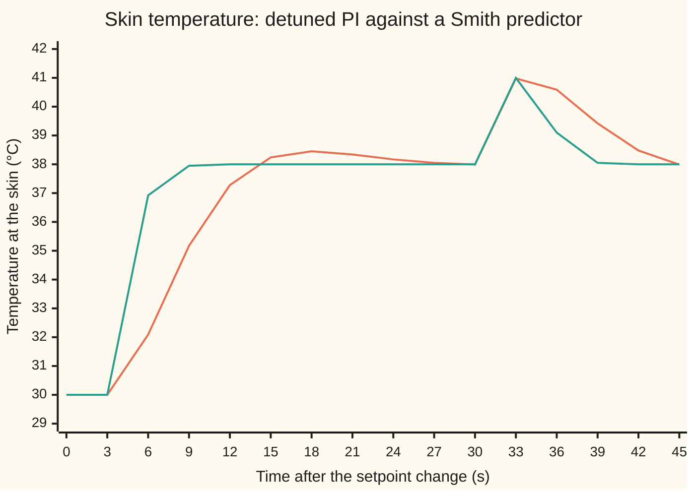
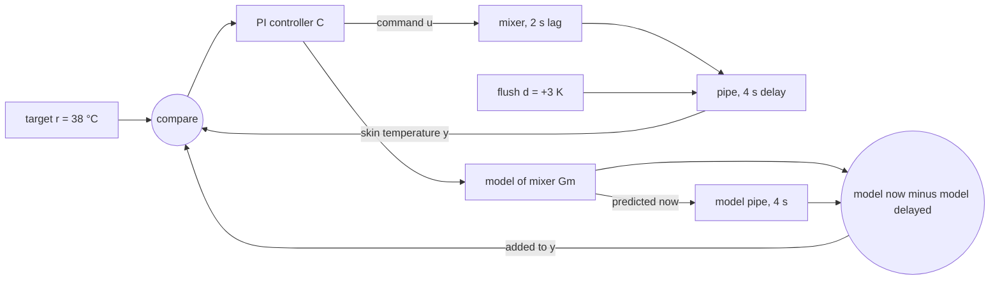
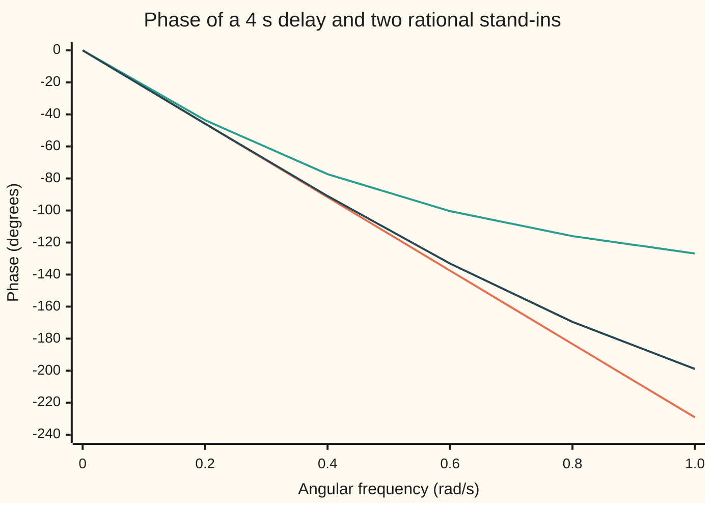

# Time delays: they eat phase margin, and a predictor can hide a known one

[Syllabus](../../../SYLLABUS.md) → [Engineering mathematics](../../../SYLLABUS.md#w13) → [Feedback Control](../../../SYLLABUS.md#w13-s03) → Time delays

---

## General Overview

A shower runs at 8 litres per minute. Between the mixer valve and the shower head sits a pipe holding 0.533 L of water, so whatever the mixer does takes 4.0 s to reach the skin. The mixer itself is quick but not instant: its outlet temperature follows the controller's command with a lag of 2 s: after any change of command it closes 63% of the remaining gap every 2 s. The water is at 30 °C and the target is 38 °C. An electronic controller reads a sensor at the head and moves the valve.

The engineer wants three numbers. How hard can the controller push before the shower starts swinging between hot and cold? How fast can it reach 38 °C without overshooting? And what happens when someone flushes a toilet elsewhere in the house, the cold pressure drops, and the mixer outlet jumps 3 K hotter?

The 4 s pipe is the whole problem. It is a **time delay** (also called dead time): the output is an exact copy of the input, shifted later. It shrinks nothing, yet a controller that would follow the target with a 1 s lag without the pipe makes the shower swing wildly with it. Two tools follow. The **Padé approximation** replaces the delay by a ratio of polynomials that the stability tests of earlier cards can handle. The **Smith predictor** is a controller that carries a model of the mixer and the pipe, and so acts on what the skin will feel 4 s from now.

**A delay of θ seconds costs a loop ωθ radians of phase at every angular frequency ω and no gain at all, so it caps how fast any loop can be; a Smith predictor removes a known delay from the loop's stability, but not from the output, not from disturbances, and not from errors in the delay itself.**

**What kind of fact this is:** a method, derived on this card in Why it works; the phase cost of the delay is an exact identity, and Padé is an approximation, with its error stated.

### The picture: the shower reaching 38 °C, then a flush



The setpoint moves from 30 °C to 38 °C at time zero. The first line (orange) is an ordinary proportional-integral controller turned down until the 4 s delay leaves it a safe margin: it overshoots to 38.45 °C and settles within 2% after 24.18 s. The second line (green) is a Smith predictor with the fast gain the delay-free mixer would allow: nothing happens for 4 s, then the skin reaches 38 °C with no overshoot, inside 2% at 7.90 s. At 27 s a flush makes the mixer outlet 3 K hotter. Both showers hit 41 °C. The predictor does not see the flush coming. The skin feels the full +3 K from 4 s to 8 s after the flush; only then does the correction arrive, and the predictor recovers faster.

---

## The formula

Reminders from earlier cards. A transfer function G(s) says what a system does to each exponential e^(st); s is the Laplace variable. On the frequency axis s = jω, where ω is angular frequency in rad/s and engineers write j for the square root of −1 (the rest of the library writes i). The loop gain L(s) is the transfer function once round the loop. The phase margin is how far the loop's phase sits above −180° at the crossover frequency, where |L| = 1 ([Nyquist and margins](06-nyquist-criterion-and-stability-margins.md)).

A delay of $\theta$ seconds turns an input u(t) into u(t − θ). Its transfer function, by the shift theorem of [Step functions](../../08-Differential%20equations%20and%20dynamics/08-Laplace%20Transforms%20for%20Initial-Value%20Problems/05-step-functions-and-delays.md), and its effect on a loop are:

$$e^{-\theta s}\Big|_{s=j\omega} = e^{-j\omega\theta}: \quad |e^{-j\omega\theta}| = 1, \qquad \arg e^{-j\omega\theta} = -\omega\theta; \qquad \phi_m^{\text{delay}} = \phi_m^{\text{no delay}} - \omega_c\theta.$$

**Read it aloud:** a delay leaves every frequency at full size and turns it back by frequency times delay, so the phase margin falls by the crossover frequency times the delay.

The Smith predictor, with a model $G_m$ of the delay-free mixer and a model delay $\theta_m$, feeds back the measured output plus a correction:

$$y_{\text{fed back}} = y + G_m(s)\,\big(1 - e^{-\theta_m s}\big)\,u, \qquad \text{and if the model is exact,}\qquad \frac{Y}{R} = \frac{C\,G_0}{1 + C\,G_0}\,e^{-\theta s}.$$

**Read it aloud:** add to the measurement what the model says the output will become minus what it says the pipe is delivering now; with a perfect model, the loop behaves as if the delay were outside it, tacked on at the end.

The Padé stand-ins replace $e^{-\theta s}$ by rational functions of $x = \theta s$:

$$e^{-x} \approx \frac{1 - x/2}{1 + x/2} \;\;(\text{first order}), \qquad e^{-x} \approx \frac{1 - x/2 + x^2/12}{1 + x/2 + x^2/12} \;\;(\text{second order}).$$

The shower's numbers. The mixer is $G_0(s) = 1/(\tau s + 1)$: one kelvin at the outlet per kelvin commanded, lag $\tau$ = 2 s. The controller is proportional-integral, $C(s) = K_p\,(1 + 1/(T_i s))$, with the integral time set to $T_i = \tau$. That choice cancels the mixer's lag and leaves the clean loop

$$L(s) = \frac{K_p\,e^{-\theta s}}{\tau s}, \qquad \omega_c = \frac{K_p}{\tau}, \qquad \phi_m = 90^\circ - \omega_c\theta\cdot\frac{180^\circ}{\pi}, \qquad K_u = \frac{\pi\,\tau}{2\,\theta}.$$

| Symbol | Plain meaning | In our example | Push it up and the answer… |
| --- | --- | --- | --- |
| $\theta$ | delay: pipe volume divided by flow | 4.0 s at 8 L/min; 5.33 s at 6 L/min | phase margin falls, ultimate gain falls |
| $\theta_m$, $\Delta$ | the delay the predictor's model assumes (on nyquist-criterion-and-stability-margins θ_m is the delay margin, a different thing); true delay minus model delay | 4 s; 0 s when the flow is 8 L/min | the predictor rings, then goes unstable past a true delay of 5.49 s |
| $\tau$, $G_0$, $G_m$ | mixer lag; delay-free mixer 1/(τs + 1); the predictor's copy of it | 2 s | a slower mixer allows a larger gain before the delay bites |
| $s$, $\omega$, $j$ | Laplace variable; angular frequency; the square root of −1 | ω in rad/s | the delay's phase lag grows in proportion to ω |
| $C$, $K_p$, $T_i$ | the controller; its proportional gain; its integral time | Kp = 2 (fast) or 0.262 (detuned); Ti = 2 s | higher Kp: faster, until the delay makes it unstable |
| $L$, $\omega_c$ | loop gain; crossover frequency, where L has size 1 | ω_c = Kp/τ = 1 rad/s at Kp = 2 | a higher crossover loses more phase to the delay |
| $\phi_m$ | phase margin | 60° detuned; −139° for Kp = 2 with the pipe | a larger margin: calmer, slower response |
| $K_u$, $\omega_{180}$ | ultimate gain, the gain at which the loop starts to oscillate; the frequency where the phase reaches −180° | 0.785; the swing period is 16 s | — |
| $T_0$, $T$ | delay-free closed loop C G0/(1 + C G0); T = T0 e^(−θ_m s), the closed loop with the model's delay | 1/(s + 1) at Kp = 2: lag 1 s | — |
| $x$ | the delay's exponent, θs, in the Padé formulas | 4s | the stand-ins drift from the truth as ωθ grows |
| $y$, $u$, $r$, $d$ | skin temperature; controller command; target; disturbance at the mixer outlet | 30 → 38 °C; flush d = +3 K | — |

### When it holds

- **The delay is pure transport.** Water that mixes along the pipe adds some lag on top of the delay; the model holds for a long, thin pipe.
- **The delay is constant.** Delay is volume over flow, so it moves with the flow: 4.0 s at 8 L/min, 5.33 s at 6 L/min, 6.40 s at 5 L/min. The Smith predictor tuned for 4 s stays stable at 5.33 s but rings, and at 6.40 s its swings grow 2.94 times every 32 s.
- **The predictor's model is right.** Its derivation needs the model to equal the plant. With the fast gain it tolerates a true delay between 2.50 s and 5.49 s, and no more.
- **The loop is linear.** Computed swings of an unstable loop grow without limit; a real mixer hits its hot and cold stops and cycles between them instead.
- **Disturbances are not predicted.** The model sees only the controller's command, so a flush meets the delay at full strength.

### The picture: the Smith predictor



A block diagram, schematic. The lower branch is the predictor. It adds to the measured temperature the model's estimate of what is already in the pipe and not yet felt.

---

## Why it works

### Step 0: the delay changes timing, not size, and timing is phase

A loop corrects an error by pushing against it. A late correction pushes against an error that has already moved. At the frequency where it is late by half a cycle, it pushes the wrong way, and since a delay shrinks nothing, nothing weakens that push. Everything below puts numbers on "late by half a cycle".

### Step 1: the delay's transfer function is a pure phase lag

The shift theorem says a signal delayed by θ has its Laplace transform multiplied by e^(−θs). On the frequency axis, s = jω, and Euler's formula gives e^(−jωθ) = cos ωθ − j sin ωθ. Its size is cos^2 + sin^2 = 1 under the square root. Its angle is −ωθ radians. A sine wave of angular frequency ω, delayed by θ, is the same wave turned back by ωθ. At ω = 1 rad/s the shower's 4 s pipe costs 4 rad, which is 229.18°.

### Step 2: the delay leaves the crossover frequency where it was and takes its phase

Multiplying L by something of size 1 leaves |L| unchanged, so the crossover frequency ω_c does not move. The phase there drops by ω_c θ, and so does the phase margin. On a Bode plot the magnitude is untouched and the phase falls without limit; a lag's phase stops at −90°, a delay's never stops.

### Step 3: for the shower, every number has a closed form

With the integral time equal to the mixer lag, C G0 = Kp(τs + 1)/(τs) × 1/(τs + 1) = Kp/(τs). The loop is Kp e^(−θs)/(τs).

- Its size at s = jω is Kp/(τω), so crossover is at ω_c = Kp/τ.
- Its phase is −90° (from the 1/s) minus ωθ.
- Phase margin: 90° minus ω_c θ turned into degrees. Without the pipe it is 90° at any gain. With the pipe and Kp = 2, it is 90° − 229.18° = −139.18°. The loop is unstable.
- The phase reaches −180° when ωθ = π/2, so ω_180 = π/(2θ). The loop oscillates when |L| there reaches 1: Kp = τ ω_180 = πτ/(2θ) = 0.785. The swing period is 2π/ω_180 = 4θ = 16 s.
- For a 60° margin, ω_c θ must be 30°, which is π/6 rad. Then ω_c = π/(6θ) = 0.1309 rad/s and Kp = τ ω_c = 0.262.

The trade is stark. Without the pipe, Kp = 2 gives a closed loop with a 1 s lag. With the pipe, a safe gain is 0.262 against 2, and the shower takes 24.18 s to settle. The rule of thumb that drops out is general: **a delay θ limits the crossover frequency to well under 1/θ**, and so limits how fast any feedback loop can respond.

### Step 4: Padé swaps the delay for a ratio of polynomials

The delay makes the closed-loop equation 1 + L(s) = 0 transcendental: it has infinitely many roots, and the Routh test of [Routh-Hurwitz](04-routh-hurwitz-criterion.md) cannot be applied. The fix is to write e^(−x) = e^(−x/2)/e^(x/2) and keep two terms of each: (1 − x/2)/(1 + x/2). Expanding the ratio gives 1 − x + x^2/2 − x^3/4 + …, while e^(−x) is 1 − x + x^2/2 − x^3/6 + …. They agree through x^2; the error starts at x^3/12.

On the frequency axis the stand-in keeps one property of the true delay exactly: top and bottom are complex conjugates, so its size is 1 at every frequency. A system whose size is 1 at every frequency is called **all-pass**. What it gets wrong is the phase: −2 arctan(ωθ/2), which never passes −180°, where the true phase falls without limit.

Put the first-order stand-in into the shower loop. Then 1 + L = 0 becomes, after clearing fractions, the quadratic (τθ/2)s^2 + (τ − Kp θ/2)s + Kp = 0. A quadratic is stable when all its coefficients are positive, so the limit is Kp < 2τ/θ = 1.000. The true limit is 0.785. The second-order stand-in gives a cubic, and Routh's condition on it gives 0.791288, much closer.

<details>
<summary>The algebra behind this, if you want it</summary>

**Second-order coefficients.** Write the stand-in as (1 + a x + b x^2)/(1 + c x + e x^2) and require it to match e^(−x) through x^4. Matching powers gives c = 1/2, e = 1/12, a = −1/2, b = 1/12. The first error term is about x^5/720.

**The first-order edge.** With L = Kp(1 − θs/2)/(τs(1 + θs/2)), clearing the bottom gives τs(1 + θs/2) + Kp(1 − θs/2) = 0, the quadratic above.

**The second-order edge.** Its phase crosses −180° when the bottom's angle is 45°, that is when ωθ/2 = 1 − (ωθ)^2/12. With z = ωθ that is z^2 + 6z − 12 = 0, so z = √21 − 3, and the edge gain is τ z/θ = τ(√21 − 3)/θ = 0.791288. Routh on the cubic (τθ^2/12)s^3 + (τθ/2 + Kp θ^2/12)s^2 + (τ − Kp θ/2)s + Kp gives the same number by bisection.

</details>

### Step 5: the Smith predictor feeds back what the mixer is doing now

O. J. M. Smith's idea of 1957: the controller cannot see the skin's future, but it can compute it. Keep a model of the mixer, Gm, driven by the same command u. Its output is the model's estimate of the mixer outlet now. Pass that through a model of the pipe, a buffer of the last θ_m seconds, to get the model's estimate of the skin now. Feed back

y + Gm u − Gm e^(−θ_m s) u.

If the model is exact and nothing else disturbs the water, the measured y equals Gm e^(−θs) u, the last term cancels it, and what is fed back is Gm u: the outlet temperature now, with no delay. The controller then works on the delay-free mixer. Its closed loop is T0 = C G0/(1 + C G0), and the skin sees that response θ seconds later:

Y/R = T0(s) e^(−θs).

The delay has left the loop's characteristic equation 1 + C G0 = 0, so any gain safe for the mixer alone is safe here. With Kp = 2, T0 = 1/(s + 1), a lag of 1 s. The step response is 8(1 − e^(−(t − 4))) kelvin above 30 °C for t > 4 s. It stays outside the 2% band, 0.16 K, until e^(−(t − 4)) = 1/50, at θ + ln 50 × 1 s = 7.912 s. The simulation, run in steps of 5 ms, gives 7.900 s.

### Step 6: what the predictor cannot do

**Disturbances.** A flush adds d to the outlet, after the model. Follow d around the loop: the fed-back signal becomes e^(−θs)d + G0 u, so u = −C e^(−θs) d/(1 + C G0), and the skin sees

Y/D = e^(−θs) (1 − T0(s) e^(−θs)).

The first factor: the flush reaches the skin θ = 4 s after it happens. The second: the correction, launched when the skin first feels it, needs another θ to arrive. So the skin feels nothing for 4 s, then the full +3 K from 4 s to 8 s after the flush (the simulation agrees to 1 mK), then the error decays as 3e^(−(t − 8)), t in seconds after the flush. It is back within 0.2 K when that equals 0.2, at 8 + ln 15 = 10.708 s after the flush; the simulation gives 10.705 s. No feedback controller can do better than 2θ: the flush takes θ to be seen, and the correction takes θ to arrive. Only a measurement before the pipe could: the mixer's outlet temperature, closed in a fast inner loop (cascade), or the cold supply itself, acted on at once (feedforward), both on [PID in practice](08-pid-on-real-hardware.md).

**Model error.** If the true delay is θ = θ_m + Δ, the characteristic equation becomes 1 + C G0 (1 − e^(−θ_m s) + e^(−θ s)) = 0, which is 1 + T(s)(e^(−Δ s) − 1) = 0, where T(s) = T0(s) e^(−θ_m s) is the nominal closed loop. On the frequency axis e^(−jωΔ) has size 1, so the loop can only cross into instability at a frequency where |1 − 1/T(jω)| = 1; there Δ is read off the angle. For the fast design that gives a stable range of true delays from 2.50 s to 5.49 s. A time-domain bisection on the simulated delay finds 2.505 s and 5.480 s. The detuned PI, with no model to be wrong about, stays stable up to a 12.0 s delay.

A second route to the ultimate gain is the Nyquist curve of [Nyquist and margins](06-nyquist-criterion-and-stability-margins.md): Kp e^(−jωθ)/(jωτ) is a spiral round the origin, and its first crossing of the negative real axis gives 0.785398 in the code.

### The picture: the delay's phase against its Padé stand-ins



The first line (orange) is the true delay, a straight line falling 229.18° by 1 rad/s. The second (green) is the first-order Padé stand-in: close at 0.2 rad/s, already −77.32° against the true −91.67° at 0.4 rad/s, and it never passes −180°. The third (dark) is the second-order stand-in, at −90.96° there.

---

## Worked numbers, by hand

| Step | Arithmetic | Value |
| --- | --- | --- |
| pipe volume | 8 L/min × 4 s ÷ 60 | 0.533 L |
| delay at 6 L/min | 0.533 ÷ (6/60) | 5.33 s |
| fast crossover | Kp/τ = 2/2 | 1 rad/s |
| phase eaten at crossover | 1 × 4 rad × 180/π | 229.18° |
| phase margin, fast design, with pipe | 90° − 229.18° | **−139.18°: unstable** |
| ultimate gain | π × 2 / (2 × 4) | **0.785** |
| swing period at that gain | 4 × 4 s | 16 s |
| detuned gain for a 60° margin | 2 × (π/6) / 4 | **0.262** |
| first-order Padé edge | 2 × 2 / 4 | 1.000 |
| Smith step, 2% settling | 4 + ln 50 × 1 s | **7.91 s** |
| Smith, flush felt at full size | from θ to 2θ after the flush | 4 s to 8 s |
| Smith, back within 0.2 K | 8 + ln 15 | 10.71 s |

Without help, the 4 s pipe forces the controller down to a gain of 0.262 and the shower takes 24.18 s to settle. With the predictor and a correct model, it settles in 7.9 s, of which 4 s is the pipe and cannot be removed.

### What breaks if you drop a piece

| Mistake | Comes out at | What went wrong |
| --- | --- | --- |
| Tune for the mixer alone, Kp = 2, no predictor | phase margin −139.18°: the shower swings hot and cold | the delay's phase was ignored |
| Trust first-order Padé's edge of 1.000 and set Kp = 0.9 | swings grow 2.12 times every 32 s | the stand-in's phase stops at −180°; the true edge is 0.785 |
| Eco shower head at 5 L/min, predictor still told 4 s | true delay 6.40 s; swings grow 2.94 times every 32 s | delay error beyond the 5.49 s edge |
| Expect the predictor to catch the flush | 41.00 °C at the skin from 4 s to 8 s after the flush | the model never sees the disturbance |

At 6 L/min the true delay is 5.33 s, inside the edge: the predictor survives, but its swings shrink only to 0.654 of their size every 32 s.

---

## Code, from first principles, and it actually runs

Three roads. Closed forms give the ultimate gain, margins, settling and recovery times. A simulation in 5 ms steps holds the pipe as a ring buffer of past mixer temperatures and finds stability edges by bisection on whether the swing grows. The frequency response, with complex arithmetic written out in Rust, finds the crossover, the margin, the Nyquist crossing and the predictor's tolerance to delay error. The simulated ultimate gain, 0.784978, sits under 0.785398 because a controller acting once per step adds about half a step of delay. Chart points are on the lines starting `chart`.

### Python

```python
# Time delays and the Smith predictor -- the check behind the card.  Standard library only.
# A shower mixer: the mixer outlet follows the controller with a 2 s lag; the water then
# spends 4 s in the pipe before the skin.  Roads: closed forms; a time-domain simulation with
# the delay held as a buffer of past samples; the frequency response with complex arithmetic.
import math, cmath
TAU, TH, DT = 2.0, 4.0, 0.005          # mixer lag (s), pipe delay (s), simulation step (s)
VOL, R0, STEP, FLUSH = 8.0 / 60 * 4.0, 30.0, 8.0, 3.0   # pipe volume (L), start (degC), step (K), flush (K)

def sim(kp, smith, th=TH, t_end=60.0, flush_at=None):
    """Skin temperature above 30 degC; PI with Ti = TAU, optional Smith predictor (model delay TH)."""
    a, n, nm = math.exp(-DT / TAU), round(th / DT), round(TH / DT)
    pipe, mpipe, m, mm, integ, out = [0.0] * n, [0.0] * nm, 0.0, 0.0, 0.0, []
    for k in range(round(t_end / DT)):
        y = pipe[k % n]                                   # water that left the mixer th seconds ago
        e = STEP - y - ((mm - mpipe[k % nm]) if smith else 0.0)
        u = kp * (e + integ / TAU)
        integ += e * DT
        d = FLUSH if flush_at is not None and k * DT >= flush_at else 0.0
        pipe[k % n], mpipe[k % nm] = m + d, mm
        m, mm = a * m + (1 - a) * u, a * mm + (1 - a) * u   # exact update of a 2 s lag, input held
        out.append(y)
    return out

def grows(kp, smith=False, th=TH):
    """True if the oscillation at 208-240 s is larger than at 112-144 s."""
    y = sim(kp, smith, th, 240.0)
    late, early = (max(abs(v - STEP) for v in y[round(s / DT):round((s + 32) / DT)]) for s in (208, 112))
    return late > early

def bisect(f, lo, hi, n=50):
    for _ in range(n):
        mid = (lo + hi) / 2
        lo, hi = (lo, mid) if f(mid) else (mid, hi)
    return (lo + hi) / 2

def delay(w, pade=0):
    """e^(-jw TH), or its first- or second-order Pade stand-in."""
    x = 1j * w * TH
    return {0: cmath.exp(-x), 1: (1 - x / 2) / (1 + x / 2), 2: (1 - x / 2 + x * x / 12) / (1 + x / 2 + x * x / 12)}[pade]

def loop(w, kp):
    """L(jw) = PI * mixer * delay, with Ti = TAU so L = kp e^(-jw TH) / (jw TAU)."""
    s = 1j * w
    return kp * (1 + 1 / (TAU * s)) / (TAU * s + 1) * delay(w)

def row(name, v, unit=""):
    print(f"{name:<50} {v:>11.6f} {unit}")

# ---- the pipe: delay = volume / flow ----
row("pipe volume, 8 L/min for 4 s", VOL, "L")
for lpm in (8.0, 6.0, 5.0):
    row(f"pipe delay at {lpm:.0f} L/min", VOL / (lpm / 60.0), "s")
# ---- phase cost of the delay at crossover; Ti = TAU makes |L| = kp/(w TAU), so w_c = kp/TAU ----
KF = 2.0                                              # delay-free design: closed loop time constant 1 s
row("fast design Kp = 2: crossover w_c = Kp/tau", KF / TAU, f"rad/s; closed loop lag {TAU / KF:.3f} s")
row("phase eaten by delay at w_c, w_c*theta", math.degrees(KF / TAU * TH), "deg")
row("phase margin, fast design, 4 s delay", 90.0 - math.degrees(KF / TAU * TH), "deg")
KD = (math.pi / 2 - math.pi / 3) * TAU / TH           # detuned: w_c*theta = 30 deg leaves 60 deg
row("detuned Kp for 60 deg margin", KD, "")
wc = bisect(lambda w: abs(loop(w, KD)) < 1, 1e-3, 10.0)
row("freq     detuned crossover from |L| = 1", wc, "rad/s")
row("freq     detuned phase margin 180 + arg L", 180 + math.degrees(cmath.phase(loop(wc, KD))), "deg")
# ---- ultimate gain: three roads, then two Pade stand-ins ----
ku = math.pi * TAU / (2 * TH)
row("formula  ultimate gain pi*tau/(2*theta)", ku, "")
w180 = bisect(lambda w: loop(w, 1.0).imag > 0, 0.05, 0.6)   # first frequency where L(jw) is real, negative
row("freq     ultimate gain 1/|L(jw180)|", 1 / abs(loop(w180, 1.0)), "")
row("freq     ultimate period 2*pi/w180", 2 * math.pi / w180, "s")
ku_sim = bisect(grows, 0.5, 1.2, 22)
row("sim      ultimate gain, growth test", ku_sim, "")
y = sim(ku, False, TH, 200.0)
ups = [k * DT for k in range(round(100 / DT), len(y)) if y[k - 1] < STEP <= y[k]]
row("sim      period at the ultimate gain", (ups[-1] - ups[0]) / (len(ups) - 1), "s")
row("pade 1   Routh edge 2*tau/theta", 2 * TAU / TH, "")
routh2 = lambda k: (TAU * TH / 2 + k * TH ** 2 / 12) * (TAU - k * TH / 2) < (TAU * TH ** 2 / 12) * k
row("pade 2   edge, algebra / Routh on the cubic", TAU * (math.sqrt(21) - 3) / TH, f"/ {bisect(routh2, 0.1, 2.0):.6f}")
# ---- phase of the delay against its Pade stand-ins (chart) ----
for i in range(6):
    w = i * 0.2
    ph = [math.degrees(-w * TH)] + [math.degrees(cmath.phase(delay(w, p))) for p in (1, 2)]
    ph = [ph[0] + 0.0] + [(v - 360 if v > 1e-9 else v) + 0.0 for v in ph[1:]]   # unwrap: stand-ins only lag
    print(f"chart phase, w {w:5.3f} rad/s, exact {ph[0]:8.2f}, pade1 {ph[1]:8.2f}, pade2 {ph[2]:8.2f} deg")
# ---- step 30 -> 38 degC, flush (+3 K) at 27 s: detuned PI against Smith predictor at Kp = 2 ----
yd, ys = sim(KD, False, flush_at=27.0), sim(KF, True, flush_at=27.0)
for t in range(0, 46, 3):
    print(f"chart step, t {t:2d} s, detuned PI {R0 + yd[round(t / DT)]:6.2f}, Smith {R0 + ys[round(t / DT)]:6.2f} degC")
settle = lambda y, tol, end: max(k for k in range(round(end / DT)) if abs(y[k] - STEP) > tol) * DT + DT
row("formula  Smith 2% settling theta + ln(50)*tau/Kp", TH + math.log(50) * TAU / KF, "s")
row("sim      Smith 2% settling (0.16 K band)", settle(ys, 0.16, 27.0), "s")
row("sim      detuned PI 2% settling", settle(yd, 0.16, 27.0), "s")
row("sim      detuned PI peak", R0 + max(yd[:round(27 / DT)]), "degC")
row("sim      flush peak, Smith / detuned", R0 + max(ys), f"/ {R0 + max(yd):.2f} degC")
row("formula  Smith flush full theta / 2theta / back", TH, f"/ {2 * TH:.6f} / {2 * TH + math.log(15) * TAU / KF:.6f} s after")
full = [k * DT - 27.0 for k in range(round(27 / DT), len(ys)) if abs(ys[k] - STEP - FLUSH) < 1e-3]
row("sim      Smith flush full size (1 mK), from / to", full[0], f"/ {full[-1]:.6f} s after")
row("sim      Smith back within 0.2 K", settle(ys, 0.2, 60.0) - 27.0, "s after")
row("sim      detuned PI back within 0.2 K", settle(yd, 0.2, 60.0) - 27.0, "s after")
# ---- model error: the pipe's true delay is not the 4 s the predictor assumes ----
def edge(sign):            # frequency road: 1 + T(jw)(e^(-jw D) - 1) = 0 needs |1 - 1/T| = 1
    best, w, step = None, 0.001, 0.001
    g = lambda w: abs(1 - (1 + 1j * w * TAU / KF) * cmath.exp(1j * w * TH)) - 1
    while w < 20:
        if g(w) * g(w + step) < 0:
            r = bisect(lambda v: (g(v) > 0) != (g(w) > 0), w, w + step); assert abs(g(r)) < 1e-9   # rising or falling crossing
            d = (-cmath.phase(1 - (1 + 1j * r * TAU / KF) * cmath.exp(1j * r * TH))) % (2 * math.pi) / r
            d = d if sign > 0 else d - 2 * math.pi / r
            best = d if best is None or abs(d) < abs(best) else best
        w += step
    return TH + best
row("freq     Smith stable for true delay from / to", edge(-1), f"/ {edge(+1):.6f} s")
def sedge(a, b):           # bisect a delay, in samples of DT, between a and b to where the growth test changes
    ga = grows(KF, True, a * DT)
    while b - a > 1:
        a, b = ((a + b) // 2, b) if grows(KF, True, (a + b) // 2 * DT) == ga else (a, (a + b) // 2)
    return a, b
(lo, _), (_, hi2) = sedge(840, 1400), sedge(400, 800)   # 4.2 s stable, 7 s not; 2 s unstable, 4 s stable
row("sim      Smith stable for true delay from / to", hi2 * DT, f"/ {lo * DT:.6f} s")
def ratio(y):              # largest swing in 208-240 s over the largest in 176-208 s
    return max(abs(v - STEP) for v in y[round(208 / DT):]) / max(abs(v - STEP) for v in y[round(176 / DT):round(208 / DT)])
sw = {lpm: ratio(sim(KF, True, VOL / (lpm / 60.0), 240.0)) for lpm in (6.0, 5.0)}
for lpm in (6.0, 5.0):
    row(f"sim      Smith at {lpm:.0f} L/min, swing ratio per 32 s", sw[lpm], "")
row("formula  detuned PI tolerates delay up to", math.pi * TAU / (2 * KD), "s")
sw09 = ratio(sim(0.9, False, TH, 240.0))
row("sim      Kp = 0.9 no predictor, swing ratio per 32 s", sw09, "")

assert abs(ku_sim - ku) < 3e-3                         # simulation edge vs closed form
assert abs(1 / abs(loop(w180, 1.0)) - ku) < 1e-6        # frequency road vs closed form
assert abs(bisect(routh2, 0.1, 2.0) - TAU * (math.sqrt(21) - 3) / TH) < 1e-6   # Routh vs algebra
assert abs(settle(ys, 0.16, 27.0) - (TH + math.log(50) * TAU / KF)) < 0.05      # Smith: sim vs formula
assert abs(settle(ys, 0.2, 60.0) - 27.0 - (2 * TH + math.log(15) * TAU / KF)) < 0.05   # flush: sim vs formula
assert abs(lo * DT - edge(+1)) < 0.02       # model-error edge: sim vs frequency road
assert abs(hi2 * DT - edge(-1)) < 0.01      # ... and the lower edge
assert abs(180 + math.degrees(cmath.phase(loop(wc, KD))) - 60.0) < 1e-6        # margin: complex vs formula
assert abs(full[0] - TH) < 0.01 and abs(full[-1] - 2 * TH) < 0.01                # flush felt theta to 2*theta
assert sw[6.0] < 1 < sw[5.0] and sw09 > 1   # 5.33 s inside the edge, 6.40 s and Pade-1's Kp = 0.9 outside
print("all checks passed")
```

**Ran 2026-10-06 on macOS, Python 3.14.6, standard library only. All checks passed. Output, pasted from the run:**

```
pipe volume, 8 L/min for 4 s                          0.533333 L
pipe delay at 8 L/min                                 4.000000 s
pipe delay at 6 L/min                                 5.333333 s
pipe delay at 5 L/min                                 6.400000 s
fast design Kp = 2: crossover w_c = Kp/tau            1.000000 rad/s; closed loop lag 1.000 s
phase eaten by delay at w_c, w_c*theta              229.183118 deg
phase margin, fast design, 4 s delay               -139.183118 deg
detuned Kp for 60 deg margin                          0.261799 
freq     detuned crossover from |L| = 1               0.130900 rad/s
freq     detuned phase margin 180 + arg L            60.000000 deg
formula  ultimate gain pi*tau/(2*theta)               0.785398 
freq     ultimate gain 1/|L(jw180)|                   0.785398 
freq     ultimate period 2*pi/w180                   16.000000 s
sim      ultimate gain, growth test                   0.784978 
sim      period at the ultimate gain                 16.013333 s
pade 1   Routh edge 2*tau/theta                       1.000000 
pade 2   edge, algebra / Routh on the cubic           0.791288 / 0.791288
chart phase, w 0.000 rad/s, exact     0.00, pade1     0.00, pade2     0.00 deg
chart phase, w 0.200 rad/s, exact   -45.84, pade1   -43.60, pade2   -45.81 deg
chart phase, w 0.400 rad/s, exact   -91.67, pade1   -77.32, pade2   -90.96 deg
chart phase, w 0.600 rad/s, exact  -137.51, pade1  -100.39, pade2  -133.14 deg
chart phase, w 0.800 rad/s, exact  -183.35, pade1  -115.99, pade2  -169.53 deg
chart phase, w 1.000 rad/s, exact  -229.18, pade1  -126.87, pade2  -198.92 deg
chart step, t  0 s, detuned PI  30.00, Smith  30.00 degC
chart step, t  3 s, detuned PI  30.00, Smith  30.00 degC
chart step, t  6 s, detuned PI  32.09, Smith  36.92 degC
chart step, t  9 s, detuned PI  35.17, Smith  37.95 degC
chart step, t 12 s, detuned PI  37.28, Smith  38.00 degC
chart step, t 15 s, detuned PI  38.24, Smith  38.00 degC
chart step, t 18 s, detuned PI  38.45, Smith  38.00 degC
chart step, t 21 s, detuned PI  38.34, Smith  38.00 degC
chart step, t 24 s, detuned PI  38.17, Smith  38.00 degC
chart step, t 27 s, detuned PI  38.05, Smith  38.00 degC
chart step, t 30 s, detuned PI  37.99, Smith  38.00 degC
chart step, t 33 s, detuned PI  40.98, Smith  41.00 degC
chart step, t 36 s, detuned PI  40.59, Smith  39.10 degC
chart step, t 39 s, detuned PI  39.42, Smith  38.05 degC
chart step, t 42 s, detuned PI  38.48, Smith  38.00 degC
chart step, t 45 s, detuned PI  37.99, Smith  38.00 degC
formula  Smith 2% settling theta + ln(50)*tau/Kp      7.912023 s
sim      Smith 2% settling (0.16 K band)              7.900000 s
sim      detuned PI 2% settling                      24.180000 s
sim      detuned PI peak                             38.454876 degC
sim      flush peak, Smith / detuned                 41.000000 / 40.98 degC
formula  Smith flush full theta / 2theta / back       4.000000 / 8.000000 / 10.708050 s after
sim      Smith flush full size (1 mK), from / to      4.000000 / 8.000000 s after
sim      Smith back within 0.2 K                     10.705000 s after
sim      detuned PI back within 0.2 K                16.390000 s after
freq     Smith stable for true delay from / to        2.502029 / 5.486296 s
sim      Smith stable for true delay from / to        2.505000 / 5.480000 s
sim      Smith at 6 L/min, swing ratio per 32 s       0.654433 
sim      Smith at 5 L/min, swing ratio per 32 s       2.935963 
formula  detuned PI tolerates delay up to            12.000000 s
sim      Kp = 0.9 no predictor, swing ratio per 32 s    2.121260 
all checks passed
```

### Rust

```rust
// Time delays and the Smith predictor -- the check behind the card.  Rust std only.
// A shower mixer: the mixer outlet follows the controller with a 2 s lag; the water then
// spends 4 s in the pipe before the skin.  Roads: closed forms; a time-domain simulation with
// the delay held as a buffer of past samples; the frequency response with complex arithmetic.
use std::f64::consts::PI;
const TAU: f64 = 2.0; const TH: f64 = 4.0; const DT: f64 = 0.005; // mixer lag, pipe delay, step (s)
const VOL: f64 = 8.0 / 60.0 * 4.0; // pipe volume, L
const R0: f64 = 30.0; const STEP: f64 = 8.0; const FLUSH: f64 = 3.0; // start (degC), step (K), flush (K)
const KF: f64 = 2.0; // delay-free design: closed loop time constant 1 s

#[derive(Clone, Copy)]
struct C { re: f64, im: f64 } // a complex number, written out
impl C {
    fn add(self, o: C) -> C { C { re: self.re + o.re, im: self.im + o.im } }
    fn sub(self, o: C) -> C { C { re: self.re - o.re, im: self.im - o.im } }
    fn mul(self, o: C) -> C { C { re: self.re * o.re - self.im * o.im, im: self.re * o.im + self.im * o.re } }
    fn div(self, o: C) -> C {
        let d = o.re * o.re + o.im * o.im;
        C { re: (self.re * o.re + self.im * o.im) / d, im: (self.im * o.re - self.re * o.im) / d }
    }
    fn abs(self) -> f64 { self.re.hypot(self.im) }
    fn arg(self) -> f64 { self.im.atan2(self.re) }
}
fn r(x: f64) -> C { C { re: x, im: 0.0 } } fn cis(t: f64) -> C { C { re: t.cos(), im: t.sin() } } // x + 0j; e^(jt)

// Skin temperature above 30 degC; PI with Ti = TAU, optional Smith predictor (model delay TH).
fn sim(kp: f64, smith: bool, th: f64, t_end: f64, flush_at: Option<f64>) -> Vec<f64> {
    let (a, n, nm) = ((-DT / TAU).exp(), (th / DT).round() as usize, (TH / DT).round() as usize);
    let (mut pipe, mut mpipe, mut m, mut mm, mut integ, mut out) = (vec![0.0; n], vec![0.0; nm], 0.0f64, 0.0f64, 0.0f64, Vec::new());
    for k in 0..(t_end / DT).round() as usize {
        let y = pipe[k % n]; // water that left the mixer th seconds ago
        let e = STEP - y - if smith { mm - mpipe[k % nm] } else { 0.0 };
        let u = kp * (e + integ / TAU);
        integ += e * DT;
        let d = match flush_at { Some(t0) if k as f64 * DT >= t0 => FLUSH, _ => 0.0 };
        (pipe[k % n], mpipe[k % nm]) = (m + d, mm);
        m = a * m + (1.0 - a) * u; // exact update of a 2 s lag, input held
        mm = a * mm + (1.0 - a) * u;
        out.push(y);
    }
    out
}
fn swing(y: &[f64], t0: f64, t1: f64) -> f64 {
    y[(t0 / DT).round() as usize..(t1 / DT).round() as usize].iter().map(|v| (v - STEP).abs()).fold(0.0, f64::max)
}
// True if the oscillation at 208-240 s is larger than at 112-144 s.
fn grows(kp: f64, smith: bool, th: f64) -> bool {
    let y = sim(kp, smith, th, 240.0, None);
    swing(&y, 208.0, 240.0) > swing(&y, 112.0, 144.0)
}
fn bisect(f: &dyn Fn(f64) -> bool, mut lo: f64, mut hi: f64, n: usize) -> f64 {
    for _ in 0..n {
        let mid = (lo + hi) / 2.0;
        if f(mid) { hi = mid } else { lo = mid }
    }
    (lo + hi) / 2.0
}
// e^(-jw TH), or its first- or second-order Pade stand-in.
fn delay(w: f64, pade: u8) -> C {
    let x = C { re: 0.0, im: w * TH };
    let x2 = x.mul(x).div(r(12.0));
    match pade {
        0 => cis(-w * TH),
        1 => r(1.0).sub(x.div(r(2.0))).div(r(1.0).add(x.div(r(2.0)))),
        _ => r(1.0).sub(x.div(r(2.0))).add(x2).div(r(1.0).add(x.div(r(2.0))).add(x2)),
    }
}
// L(jw) = PI * mixer * delay, with Ti = TAU so L = kp e^(-jw TH) / (jw TAU).
fn lp(w: f64, kp: f64) -> C {
    let ts = C { re: 0.0, im: TAU * w };
    r(kp).mul(r(1.0).add(r(1.0).div(ts))).div(ts.add(r(1.0))).mul(delay(w, 0))
}
fn row(name: &str, v: f64, unit: &str) { println!("{:<50} {:>11.6} {}", name, v, unit); }
fn ratio(y: &[f64]) -> f64 { swing(y, 208.0, 240.0) / swing(y, 176.0, 208.0) } // swing growth per 32 s
// frequency road: 1 + T(jw)(e^(-jw D) - 1) = 0 needs |1 - 1/T| = 1
fn edge(sign: f64) -> f64 {
    let z = |w: f64| r(1.0).sub(C { re: 1.0, im: w * TAU / KF }.mul(cis(w * TH)));
    let g = |w: f64| z(w).abs() - 1.0;
    let (mut best, mut w, step) = (f64::NAN, 0.001, 0.001);
    while w < 20.0 {
        if g(w) * g(w + step) < 0.0 {
            let rt = bisect(&|v| (g(v) > 0.0) != (g(w) > 0.0), w, w + step, 50); assert!(g(rt).abs() < 1e-9); // rising or falling crossing
            let mut d = (-z(rt).arg()).rem_euclid(2.0 * PI) / rt;
            if sign < 0.0 { d -= 2.0 * PI / rt; }
            if best.is_nan() || d.abs() < best.abs() { best = d; }
        }
        w += step;
    }
    TH + best
}

fn main() {
    // ---- the pipe: delay = volume / flow ----
    row("pipe volume, 8 L/min for 4 s", VOL, "L");
    for lpm in [8.0, 6.0, 5.0] { row(&format!("pipe delay at {:.0} L/min", lpm), VOL / (lpm / 60.0), "s"); }
    // ---- phase cost of the delay at crossover; Ti = TAU makes |L| = kp/(w TAU), so w_c = kp/TAU ----
    row("fast design Kp = 2: crossover w_c = Kp/tau", KF / TAU, &format!("rad/s; closed loop lag {:.3} s", TAU / KF));
    row("phase eaten by delay at w_c, w_c*theta", (KF / TAU * TH).to_degrees(), "deg");
    row("phase margin, fast design, 4 s delay", 90.0 - (KF / TAU * TH).to_degrees(), "deg");
    let kd = (PI / 2.0 - PI / 3.0) * TAU / TH; // detuned: w_c*theta = 30 deg leaves 60 deg
    row("detuned Kp for 60 deg margin", kd, "");
    let wc = bisect(&|w| lp(w, kd).abs() < 1.0, 1e-3, 10.0, 50);
    row("freq     detuned crossover from |L| = 1", wc, "rad/s");
    let pm = 180.0 + lp(wc, kd).arg().to_degrees();
    row("freq     detuned phase margin 180 + arg L", pm, "deg");
    // ---- ultimate gain: three roads, then two Pade stand-ins ----
    let ku = PI * TAU / (2.0 * TH);
    row("formula  ultimate gain pi*tau/(2*theta)", ku, "");
    let w180 = bisect(&|w| lp(w, 1.0).im > 0.0, 0.05, 0.6, 50); // first w where L(jw) is real, negative
    row("freq     ultimate gain 1/|L(jw180)|", 1.0 / lp(w180, 1.0).abs(), "");
    row("freq     ultimate period 2*pi/w180", 2.0 * PI / w180, "s");
    let ku_sim = bisect(&|k| grows(k, false, TH), 0.5, 1.2, 22);
    row("sim      ultimate gain, growth test", ku_sim, "");
    let y = sim(ku, false, TH, 200.0, None);
    let ups: Vec<f64> = ((100.0 / DT).round() as usize..y.len()).filter(|&k| y[k - 1] < STEP && STEP <= y[k]).map(|k| k as f64 * DT).collect();
    row("sim      period at the ultimate gain", (ups[ups.len() - 1] - ups[0]) / (ups.len() - 1) as f64, "s");
    row("pade 1   Routh edge 2*tau/theta", 2.0 * TAU / TH, "");
    let routh2 = |k: f64| (TAU * TH / 2.0 + k * TH * TH / 12.0) * (TAU - k * TH / 2.0) < (TAU * TH * TH / 12.0) * k;
    let p2 = bisect(&routh2, 0.1, 2.0, 50);
    row("pade 2   edge, algebra / Routh on the cubic", TAU * (21f64.sqrt() - 3.0) / TH, &format!("/ {:.6}", p2));
    // ---- phase of the delay against its Pade stand-ins (chart) ----
    for i in 0..6 {
        let w = i as f64 * 0.2;
        let un = |v: f64| (if v > 1e-9 { v - 360.0 } else { v }) + 0.0; // unwrap: stand-ins only lag
        let (p1, q2) = (un(delay(w, 1).arg().to_degrees()), un(delay(w, 2).arg().to_degrees()));
        println!("chart phase, w {:5.3} rad/s, exact {:8.2}, pade1 {:8.2}, pade2 {:8.2} deg", w, (-w * TH).to_degrees() + 0.0, p1, q2);
    }
    // ---- step 30 -> 38 degC, flush (+3 K) at 27 s: detuned PI against Smith predictor at Kp = 2 ----
    let (yd, ys) = (sim(kd, false, TH, 60.0, Some(27.0)), sim(KF, true, TH, 60.0, Some(27.0)));
    for t in (0..46).step_by(3) {
        let k = (t as f64 / DT).round() as usize;
        println!("chart step, t {:2} s, detuned PI {:6.2}, Smith {:6.2} degC", t, R0 + yd[k], R0 + ys[k]);
    }
    let settle = |y: &[f64], tol: f64, end: f64| (0..(end / DT).round() as usize).filter(|&k| (y[k] - STEP).abs() > tol).max().unwrap() as f64 * DT + DT;
    let pk = |y: &[f64]| y.iter().cloned().fold(f64::MIN, f64::max);
    row("formula  Smith 2% settling theta + ln(50)*tau/Kp", TH + 50f64.ln() * TAU / KF, "s");
    row("sim      Smith 2% settling (0.16 K band)", settle(&ys, 0.16, 27.0), "s");
    row("sim      detuned PI 2% settling", settle(&yd, 0.16, 27.0), "s");
    row("sim      detuned PI peak", R0 + pk(&yd[..(27.0 / DT).round() as usize]), "degC");
    row("sim      flush peak, Smith / detuned", R0 + pk(&ys), &format!("/ {:.2} degC", R0 + pk(&yd)));
    row("formula  Smith flush full theta / 2theta / back", TH, &format!("/ {:.6} / {:.6} s after", 2.0 * TH, 2.0 * TH + 15f64.ln() * TAU / KF));
    let full: Vec<f64> = ((27.0 / DT).round() as usize..ys.len()).filter(|&k| (ys[k] - STEP - FLUSH).abs() < 1e-3).map(|k| k as f64 * DT - 27.0).collect();
    row("sim      Smith flush full size (1 mK), from / to", full[0], &format!("/ {:.6} s after", full[full.len() - 1]));
    row("sim      Smith back within 0.2 K", settle(&ys, 0.2, 60.0) - 27.0, "s after");
    row("sim      detuned PI back within 0.2 K", settle(&yd, 0.2, 60.0) - 27.0, "s after");
    // ---- model error: the pipe's true delay is not the 4 s the predictor assumes ----
    let up = edge(1.0); row("freq     Smith stable for true delay from / to", edge(-1.0), &format!("/ {:.6} s", up));
    // bisect a delay, in samples of DT, between a and b to where the growth test changes
    let sedge = |mut a: usize, mut b: usize| { let ga = grows(KF, true, a as f64 * DT); while b - a > 1 { let m = (a + b) / 2; if grows(KF, true, m as f64 * DT) == ga { a = m } else { b = m } } (a, b) };
    let ((lo, _), (_, hi2)) = (sedge(840, 1400), sedge(400, 800)); // 4.2 s stable, 7 s not; 2 s unstable, 4 s stable
    row("sim      Smith stable for true delay from / to", hi2 as f64 * DT, &format!("/ {:.6} s", lo as f64 * DT));
    let sw: Vec<f64> = [6.0, 5.0].iter().map(|lpm| ratio(&sim(KF, true, VOL / (lpm / 60.0), 240.0, None))).collect();
    for (i, lpm) in [6.0, 5.0].iter().enumerate() { row(&format!("sim      Smith at {:.0} L/min, swing ratio per 32 s", lpm), sw[i], ""); }
    row("formula  detuned PI tolerates delay up to", PI * TAU / (2.0 * kd), "s");
    let sw09 = ratio(&sim(0.9, false, TH, 240.0, None));
    row("sim      Kp = 0.9 no predictor, swing ratio per 32 s", sw09, "");

    assert!((ku_sim - ku).abs() < 3e-3); // simulation edge vs closed form
    assert!((1.0 / lp(w180, 1.0).abs() - ku).abs() < 1e-6); // frequency road vs closed form
    assert!((p2 - TAU * (21f64.sqrt() - 3.0) / TH).abs() < 1e-6); // Routh vs algebra
    assert!((settle(&ys, 0.16, 27.0) - (TH + 50f64.ln() * TAU / KF)).abs() < 0.05); // Smith: sim vs formula
    assert!((settle(&ys, 0.2, 60.0) - 27.0 - (2.0 * TH + 15f64.ln() * TAU / KF)).abs() < 0.05); // flush: sim vs formula
    assert!((lo as f64 * DT - up).abs() < 0.02); // model-error edge: sim vs frequency road
    assert!((hi2 as f64 * DT - edge(-1.0)).abs() < 0.01); // ... and the lower edge
    assert!((pm - 60.0).abs() < 1e-6); // margin: complex vs formula
    assert!((full[0] - TH).abs() < 0.01 && (full[full.len() - 1] - 2.0 * TH).abs() < 0.01); // flush felt theta to 2*theta
    assert!(sw[0] < 1.0 && 1.0 < sw[1]); assert!(sw09 > 1.0); // 5.33 s inside the edge; 6.40 s and Pade-1's Kp = 0.9 outside
    println!("all checks passed");
}
```

**Ran 2026-10-06 on macOS, rustc 1.98.1, no crates. All checks passed. Output, pasted from the run:**

```
pipe volume, 8 L/min for 4 s                          0.533333 L
pipe delay at 8 L/min                                 4.000000 s
pipe delay at 6 L/min                                 5.333333 s
pipe delay at 5 L/min                                 6.400000 s
fast design Kp = 2: crossover w_c = Kp/tau            1.000000 rad/s; closed loop lag 1.000 s
phase eaten by delay at w_c, w_c*theta              229.183118 deg
phase margin, fast design, 4 s delay               -139.183118 deg
detuned Kp for 60 deg margin                          0.261799 
freq     detuned crossover from |L| = 1               0.130900 rad/s
freq     detuned phase margin 180 + arg L            60.000000 deg
formula  ultimate gain pi*tau/(2*theta)               0.785398 
freq     ultimate gain 1/|L(jw180)|                   0.785398 
freq     ultimate period 2*pi/w180                   16.000000 s
sim      ultimate gain, growth test                   0.784978 
sim      period at the ultimate gain                 16.013333 s
pade 1   Routh edge 2*tau/theta                       1.000000 
pade 2   edge, algebra / Routh on the cubic           0.791288 / 0.791288
chart phase, w 0.000 rad/s, exact     0.00, pade1     0.00, pade2     0.00 deg
chart phase, w 0.200 rad/s, exact   -45.84, pade1   -43.60, pade2   -45.81 deg
chart phase, w 0.400 rad/s, exact   -91.67, pade1   -77.32, pade2   -90.96 deg
chart phase, w 0.600 rad/s, exact  -137.51, pade1  -100.39, pade2  -133.14 deg
chart phase, w 0.800 rad/s, exact  -183.35, pade1  -115.99, pade2  -169.53 deg
chart phase, w 1.000 rad/s, exact  -229.18, pade1  -126.87, pade2  -198.92 deg
chart step, t  0 s, detuned PI  30.00, Smith  30.00 degC
chart step, t  3 s, detuned PI  30.00, Smith  30.00 degC
chart step, t  6 s, detuned PI  32.09, Smith  36.92 degC
chart step, t  9 s, detuned PI  35.17, Smith  37.95 degC
chart step, t 12 s, detuned PI  37.28, Smith  38.00 degC
chart step, t 15 s, detuned PI  38.24, Smith  38.00 degC
chart step, t 18 s, detuned PI  38.45, Smith  38.00 degC
chart step, t 21 s, detuned PI  38.34, Smith  38.00 degC
chart step, t 24 s, detuned PI  38.17, Smith  38.00 degC
chart step, t 27 s, detuned PI  38.05, Smith  38.00 degC
chart step, t 30 s, detuned PI  37.99, Smith  38.00 degC
chart step, t 33 s, detuned PI  40.98, Smith  41.00 degC
chart step, t 36 s, detuned PI  40.59, Smith  39.10 degC
chart step, t 39 s, detuned PI  39.42, Smith  38.05 degC
chart step, t 42 s, detuned PI  38.48, Smith  38.00 degC
chart step, t 45 s, detuned PI  37.99, Smith  38.00 degC
formula  Smith 2% settling theta + ln(50)*tau/Kp      7.912023 s
sim      Smith 2% settling (0.16 K band)              7.900000 s
sim      detuned PI 2% settling                      24.180000 s
sim      detuned PI peak                             38.454876 degC
sim      flush peak, Smith / detuned                 41.000000 / 40.98 degC
formula  Smith flush full theta / 2theta / back       4.000000 / 8.000000 / 10.708050 s after
sim      Smith flush full size (1 mK), from / to      4.000000 / 8.000000 s after
sim      Smith back within 0.2 K                     10.705000 s after
sim      detuned PI back within 0.2 K                16.390000 s after
freq     Smith stable for true delay from / to        2.502029 / 5.486296 s
sim      Smith stable for true delay from / to        2.505000 / 5.480000 s
sim      Smith at 6 L/min, swing ratio per 32 s       0.654433 
sim      Smith at 5 L/min, swing ratio per 32 s       2.935963 
formula  detuned PI tolerates delay up to            12.000000 s
sim      Kp = 0.9 no predictor, swing ratio per 32 s    2.121260 
all checks passed
```

The two outputs are identical to the printed precision.

> [!TIP]
> **Try changing**
> - **Lower the flow.** Guess first: with the predictor still told 4 s, does the shower survive 6 L/min? Run `sim(KF, True, VOL / 0.1, 240.0)`. It does, barely: the true delay is 5.33 s and each 32 s the swing shrinks to 0.654 of its size. At 5 L/min it grows 2.94 times.
> - **Believe the first-order Padé.** Guess first: Routh on the stand-in says Kp = 0.9 is safe. Is it? The simulation says the swing grows 2.12 times every 32 s; the true edge is 0.785.
> - **Remove the predictor from the fast design.** Set `smith=False` with `KF`. Guess first: how bad? The phase margin is −139.18° and the simulated swing grows without limit.

---

## The usual mistake

> [!warning]
> **Thinking the Smith predictor removes the delay.** It removes the delay from the loop's stability, and nothing else. The skin still waits the full 4 s for every change, the flush still reaches the skin at full size and is not corrected until 2θ = 8 s after it, and the predictor's safety now rests on knowing the delay: with the fast gain it tolerates only 2.50 s to 5.49 s, while the slow ordinary controller survives anything up to 12.0 s. A delay that varies with flow, like this one, needs a slower predictor or a model that tracks the flow.
>
> - **Reading the delay as a loss of gain.** It has size 1 at every frequency. A Bode magnitude plot of the shower with and without the pipe is identical; only the phase plot shows the danger.
> - **Trusting a first-order Padé near the stability edge.** It puts the edge at Kp = 1.000 against the true 0.785, and Kp = 0.9 grows 2.12 times every 32 s.
> - **Mixing hertz and rad/s in ωθ.** The phase lag in radians is ω in rad/s times θ in seconds. Using a frequency in hertz understates the lag by a factor of 2π.
> - **Raising the gain to fight the slowness.** Near the edge, more gain buys more ringing, not more speed. At 0.785 the shower oscillates steadily with a 16 s period; above it the swings grow.

---

## Where you meet it in real life

- **Showers and taps.** A person at the mixer is the controller; scalding then freezing is a loop gain above the edge the pipe sets. A thermostatic mixer senses the water inside the valve, so its own loop has almost no delay.
- **Paper machines and rolling mills.** Sheet thickness is measured metres downstream of the actuator. Smith predictors and their descendants are standard here (Normey-Rico and Camacho, in Sources).
- **Chemical plants.** Composition analysers take minutes per sample, and process streams spend minutes in pipes. Common PID tuning rules start from a plant model of a gain, a lag and a delay for this reason ([PID control](07-pid-control-and-tuning.md)).
- **Remote control over a network.** Each command arrives a round trip late; showing the operator a modelled present instead of delayed video is the same idea.
- **Digital controllers everywhere.** Sampling and computation add about half a sample period of delay, and like any delay it costs phase in proportion to frequency. That is why the simulated edge here, 0.784978, sits slightly below the formula's 0.785398; [PID control](07-pid-control-and-tuning.md) meets the same half-step gap in its own simulation (its Step 4).

> **Say it back**
> A delay copies its input later, so it keeps every frequency at full size and turns it back by ωθ radians. That lowers the phase margin by the crossover frequency times the delay, and caps how fast a loop can be: the 4 s shower pipe forces a gain of 0.262 where the mixer alone would allow 2. A Padé ratio of polynomials stands in for the delay when a test needs polynomials, accurately only at low frequency. A Smith predictor feeds back a model of the mixer's present output, so the loop is designed as if there were no pipe. It cannot see disturbances, cannot shorten the pipe, and fails if its delay is wrong by much.

---

## What this builds on

- [Nyquist and margins](06-nyquist-criterion-and-stability-margins.md): the phase margin and the Nyquist crossing that the delay erodes.
- [Loop shaping](09-lead-lag-compensation-and-loop-shaping.md): shaping the loop around crossover; a delay is the one element no lead network can fully undo, because its phase keeps falling.
- [Step functions](../../08-Differential%20equations%20and%20dynamics/08-Laplace%20Transforms%20for%20Initial-Value%20Problems/05-step-functions-and-delays.md): the shift theorem, which makes a delay of θ a factor e^(−θs).

---

## Where this goes next

- Pade approximants: Padé approximants of any order for any function, how their coefficients come from a series, and how their error behaves.

On the shower the second-order stand-in put the edge at 0.791288 against the true 0.785398, where the first-order one said 1.000; why a ratio of polynomials beats a plain series of the same length, and how far up in frequency each order can be trusted, is what pade-and-rational-approximation answers.

---

## Sources

Verified 2026-10-06: every link below opens a page that names the cited work.

- Karl J. Åström and Richard M. Murray, *Feedback Systems: An Introduction for Scientists and Engineers*, Princeton University Press, 2nd ed., [book site with the free edition](https://fbswiki.org/wiki/index.php/Feedback_Systems:_An_Introduction_for_Scientists_and_Engineers). Time delay in the frequency domain, its phase lag, and the limit it puts on loop speed.
- Dale E. Seborg, Thomas F. Edgar, Duncan A. Mellichamp and Francis J. Doyle III, *Process Dynamics and Control*, 4th ed., Wiley, [publisher's page](https://www.wiley.com/en-us/Process+Dynamics+and+Control%2C+4th+Edition-p-9781119285915). Padé approximation of dead time and time-delay compensation by the Smith predictor, in process-plant terms.
- Julio E. Normey-Rico and Eduardo F. Camacho, *Control of Dead-time Processes*, Springer, 2007, [doi:10.1007/978-1-84628-829-6](https://doi.org/10.1007/978-1-84628-829-6). The Smith predictor, its sensitivity to delay error, and the modified predictors used in industry.
