<p align="center">
  
</p>

<p align="center">
  
  
  
  
  
</p>

<p align="center"><b>A plain-English library of mathematics, from counting to the edge of research.</b><br>
One idea per card. What it means, why it's true, a worked example with real numbers,<br>and code that checks every single number twice.</p>

<p align="center">
  <a href="SYLLABUS.md"></a>
  <a href="#start-here"></a>
</p>

---

## What is this?

A library of short, self-contained **cards**, each teaching one idea of mathematics. It's written for someone smart who never trained in maths and wants to learn it properly, not just memorise rules.

The cards are arranged like a ladder. They start with place value and fractions, climb through algebra, calculus and probability, and end at topology, number theory and the famous unsolved problems. Each card only uses ideas from the cards before it, so you can start at the bottom and keep going, or jump straight to whatever you need.

**1,087 of 1,866 cards are written so far.** The [syllabus](SYLLABUS.md) lists every one of them, wing by wing, with a tick on each card that's written.

## What's on a card

Every card has the same shape, so you always know where to look:

| Section | What you get |
| --- | --- |
| **General Overview** | The idea in plain words, starting from a real situation with real numbers. |
| **The formula** | The rule written once, every symbol explained, and a sentence for reading it aloud. |
| **Why it works** | The reasoning, step by step. Longer proofs are folded away until you want them. |
| **Worked numbers, by hand** | The example done in full, so you can follow every step with a pen. |
| **The code** | Two small programs, one in Python and one in Rust, that compute every number on the card, each reaching the answer by at least two independent routes. |
| **What breaks** | What goes wrong when an assumption fails, with the numbers to show it. |
| **The usual mistake** | The trap most people fall into, and how to avoid it. |
| **Where you meet it** | Where the idea turns up in real life. |
| **Builds on / goes next** | Links back to what you need first and forward to where it leads. |
| **Sources** | Real books and papers, checked to exist. |

## Start here

- [**Place value**](Cards/01-Foundations/01-Everyday%20Arithmetic/01-place-value.md): Why the 5 in 523 is worth five hundred.
- [**Bayes' rule**](Cards/09-Probability%20and%20statistics/01-Chance%20and%20Events/06-bayes-rule.md): How a positive test can still mean you probably don't have the disease.
- [**The Black–Scholes call**](Cards/12-Financial%20mathematics/08-The%20Black-Scholes%20call%20and%20put/01-black-scholes-call.md): The formula that prices an option, built up one piece at a time.
- [**Brownian motion**](Cards/11-Stochastic%20processes%20and%20calculus/05-Brownian%20Motion/01-brownian-motion.md): The jittery random path behind pollen grains and share prices.
- [**Why a new integral?**](Cards/10-Measure%20and%20integration/01-Sets%20You%20Can%20Measure/01-why-a-new-integral.md): The question that forced mathematicians to rebuild the idea of area.

## The map

The library has 25 **wings**, each split into shelves of cards. Click a wing to see its shelves and cards in the syllabus.

| # | Wing | What it's about | Cards | Written |
| --- | --- | --- | ---: | --- |
| 01 | [**Foundations**](SYLLABUS.md#w01) | Numbers, fractions, powers, logic and proof: the toolkit everything else uses. | 59 | `██████████ 100%` |
| 02 | [**Number theory**](SYLLABUS.md#w02) | Primes, remainders, clock arithmetic, codes and secrets. | 43 | `██████████ 100%` |
| 03 | [**Algebra**](SYLLABUS.md#w03) | Equations, vectors, matrices, groups and fields. | 51 | `██████████ 100%` |
| 04 | [**Combinatorics and graphs**](SYLLABUS.md#w04) | Counting cleverly, networks, routes and puzzles. | 82 | `██████████ 100%` |
| 05 | [**Geometry and trig**](SYLLABUS.md#w05) | Shapes, angles, coordinates and space. | 43 | `██████████ 100%` |
| 06 | [**Calculus and analysis**](SYLLABUS.md#w06) | Change, limits, areas and the infinitely small. | 70 | `██████████ 100%` |
| 07 | [**Complex analysis**](SYLLABUS.md#w07) | What the square root of −1 unlocks. | 60 | `██████████ 100%` |
| 08 | [**Differential equations**](SYLLABUS.md#w08) | How things change over time: growth, orbits, chaos. | 93 | `██████████ 100%` |
| 09 | [**Probability and statistics**](SYLLABUS.md#w09) | Chance, data and drawing honest conclusions. | 100 | `██████████ 100%` |
| 10 | [**Measure and integration**](SYLLABUS.md#w10) | The rigorous floor under probability and calculus. | 68 | `██████████ 100%` |
| 11 | [**Stochastic processes**](SYLLABUS.md#w11) | Randomness in motion: random walks to Brownian motion. | 60 | `██████████ 100%` |
| 12 | [**Financial mathematics**](SYLLABUS.md#w12) | Interest, pricing, risk and markets, from loans to derivatives. | 332 | `██████████ 100%` |
| 13 | [**Engineering mathematics**](SYLLABUS.md#w13) | Units, signals, control, circuits, mechanics, heat. | 86 | `███░░░░░░░ 30%` |
| 14 | [**Applied and computational**](SYLLABUS.md#w14) | Algorithms, information, cryptography, machine learning. | 71 | `░░░░░░░░░░ 0%` |
| 15 | [**Optimization**](SYLLABUS.md#w15) | Finding the best choice under limits. | 64 | `░░░░░░░░░░ 0%` |
| 16 | [**Numerical analysis**](SYLLABUS.md#w16) | Computing answers you can trust, and knowing how far off they are. | 68 | `░░░░░░░░░░ 0%` |
| 17 | [**Topology**](SYLLABUS.md#w17) | Shape without measurement: stretching, holes and knots. | 51 | `░░░░░░░░░░ 0%` |
| 18 | [**Functional analysis**](SYLLABUS.md#w18) | Infinite-dimensional spaces behind modern analysis. | 56 | `░░░░░░░░░░ 0%` |
| 19 | [**Partial differential equations**](SYLLABUS.md#w19) | Heat, waves and fluids. | 62 | `░░░░░░░░░░ 0%` |
| 20 | [**Harmonic analysis**](SYLLABUS.md#w20) | Breaking signals into waves. | 52 | `░░░░░░░░░░ 0%` |
| 21 | [**Number theory, advanced**](SYLLABUS.md#w21) | Primes in depth: zeta, L-functions and Galois. | 72 | `░░░░░░░░░░ 0%` |
| 22 | [**Algebraic geometry**](SYLLABUS.md#w22) | Shapes defined by equations. | 54 | `░░░░░░░░░░ 0%` |
| 23 | [**Differential geometry**](SYLLABUS.md#w23) | Curved space, symmetry and physics. | 69 | `░░░░░░░░░░ 0%` |
| 24 | [**Computability and complexity**](SYLLABUS.md#w24) | What computers can and can't do, and how fast. | 57 | `░░░░░░░░░░ 0%` |
| 25 | [**Frontier**](SYLLABUS.md#w25) | How research works, and the great open problems. | 43 | `░░░░░░░░░░ 0%` |

## How it's checked

Mathematics should be right, so every card is checked in several ways:

- **Every number is computed, not typed.** Each card's Python and Rust programs work out every number the card states, and the two must print exactly the same output.
- **Every check can fail.** The checks compare independent routes to the same answer (a formula against a brute-force count, a simulation, or an exact calculation), so a wrong formula trips them. They're tested by deliberately breaking the maths.
- **Every card passes a strict linter** that checks its shape, links, symbols and sources, and every DOI in a source list is verified.
- **Independent reviewers** recompute the numbers, test the proofs and look for anything misleading, and what they find gets fixed.

Errors still slip through now and then. If you spot one, please [open an issue](https://github.com/wappy-x/Mathematics/issues).

## Run a check yourself

Every card's checks live in `checks/`. You need Python 3, and Rust if you want to run the second program.

```bash
python3 checks/place_value_check.py
rustc --edition 2021 -O checks/place_value_check.rs -o /tmp/check && /tmp/check
```

Each program prints its working, then confirms that every check passed.

## Reading it

The cards are plain Markdown and read best right here on GitHub. Formulas, charts and diagrams display, the links between cards work, and the longer proofs stay folded until you open them. A card that isn't written yet is named in plain text.

## Layout

```
Cards/<wing>/<shelf>/<card>.md    the cards
Cards/<wing>/figures/             the diagrams drawn on the cards
checks/<card>_check.py            each card's Python check
checks/<card>_check.rs            each card's Rust check
SYLLABUS.md                       the full plan: every wing, shelf and card
.github/                          the contributing guide, the agent brief and the banner
```

## How it's made

The cards are written by AI agents working to a strict house standard, then checked by code and by independent review, as described above. The [agent brief](.github/AGENTS.md) is that standard in full.

## Contributing

Help is welcome, from a one-word fix to a whole shelf of new cards.

- **Spotted a mistake?** [Open an issue](https://github.com/wappy-x/Mathematics/issues) with the card and what's wrong, or send a pull request with the fix.
- **Want to build cards?** 779 cards are still to write, all listed in the [syllabus](SYLLABUS.md). Claim a shelf, give your AI agent the [agent brief](.github/AGENTS.md), and send the cards back as a pull request. The [contributing guide](.github/CONTRIBUTING.md) walks through it, using the next shelf as the example.

## Licence

The writing is licensed under [Creative Commons Attribution 4.0](LICENSE) (CC BY 4.0): share and adapt it for any purpose, with credit to this library. The code, meaning every program in `checks/` and the same programs shown on the cards, is licensed under [Apache 2.0](checks/LICENSE).
